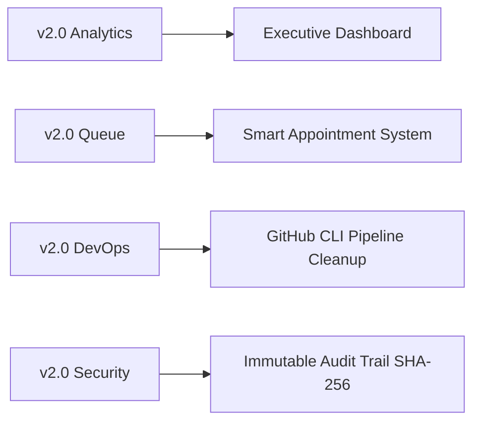
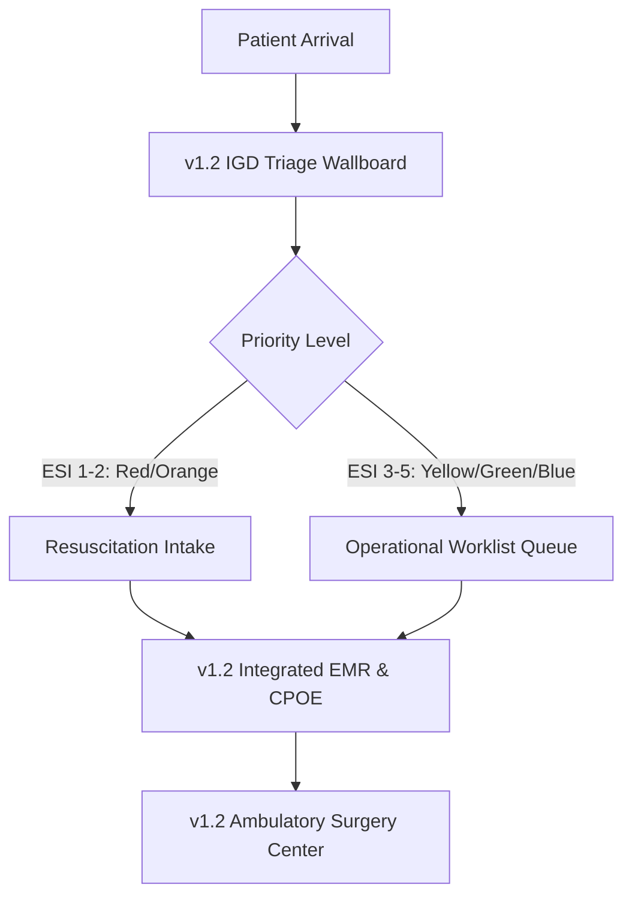

# HISTORICAL PATCH NOTES & CHANGELOG
## NURSEFLOW ENTERPRISE HOSPITAL INFORMATION SYSTEM (HIS)
### Repository Release History & Operational Patch Documentation

---

> **DOKUMEN RIWAYAT PEMBARUAN SISTEM (HISTORICAL CHANGELOG)**  
> **Target Audience:** Engineering Leads, DevOps Specialists, Hospital IT Directors, Compliance Auditors, System Integrators.  
> **Format Standard:** Keep a Changelog (v1.0.0) | **Build Standard:** Semantic Versioning (SemVer 2.0.0)

---

## 1. RINGKASAN PETA RILIS SISTEM (RELEASE MATRIX SUMMARY)

| Versi Release | Tanggal Release | Build Tag / Artifact | Focus & Primary Patch Scope | Status Stabilitas |
| :--- | :--- | :--- | :--- | :--- |
| **v2.0** | 15 Januari 2026 | `v2.0.0-ENTERPRISE` | Executive Analytics Dashboard, Smart Appointment Queue, DevOps GitHub CLI Pipeline Purging, Immutable Audit Trail. | **Production Ready (Current State)** |
| **v1.4** | 15 September 2025 | `v1.4.8-RELEASE` | Enterprise Financial Engine, Dynamic Multi-Tariff Matrix (Class x Payer), Medical Fee Breakdown, Real-time Cashier Ledger. | Deprecated / Upgraded to v2.0 |
| **v1.3** | 15 Juni 2025 | `v1.3.1-RELEASE` | Supply Chain & Logistics, Physical Warehouse Hierarchy, Tiered Material Request, FEFO Inventory Mutation Receiving. | Deprecated / Upgraded to v1.4 |
| **v1.2** | 30 April 2025 | `v1.2.5-RELEASE` | Clinical EMR Suite, IGD Triage Wallboard (ESI/NEWS2), Duty Worklist, CPOE E-Prescribing, Ambulatory Surgery Center (ASC). | Deprecated / Upgraded to v1.3 |
| **v1.1** | 28 Februari 2025 | `v1.1.2-RELEASE` | External SATUSEHAT Sandbox Integration, OAuth 2.0 M2M Client Credentials, KFA API v2 & v3 Catalog Sync Engine. | Deprecated / Upgraded to v1.2 |
| **v1.0** | 15 Januari 2025 | `v1.0.0-RELEASE` | Core Foundation Data Architecture, Patient Registration, Visit Management, Technical Alphanumeric IDs, ICD-10 & ICD-9 CM. | Deprecated / Upgraded to v1.1 |

---

## 2. RIWAYAT DETIL FASE PEMBARUAN SISTEM (HISTORICAL PATCH DETAILS)

---

## Versi 2.0 - Executive Analytics, Smart Scheduling & DevOps Infrastructure
**Release Date:** 15 Januari 2026 | **Build Tag:** `v2.0.0-ENTERPRISE`

### Overview Release
Rilis v2.0 merupakan pencapaian kondisi terkini (*Current State*) NurseFlow HIS Enterprise. Fase ini memberikan visibilitas penuh bagi jajaran direksi melalui Dashboard Eksekutif real-time, mengotomatisasi antrean perjanjian pasien, serta menstandarisasi infrastruktur DevOps dengan pembersihan otomatis pipeline CI/CD yang menumpuk.

### Categorized Patch Details:

- `[ADDED]` **Executive Real-Time Dashboard**: Modul analisis tingkat tinggi untuk jajaran Manajemen dan Direksi Rumah Sakit (`src/modules/analytics`, `src/modules/dashboard`). Menampilkan statistik *Real-Time Revenue*, *Bed Occupancy Rate* (BOR), *Length of Stay* (LOS), dan *Patient Turnaround Time* (TAT) dengan perbaruan data otomatis per 5 detik.
- `[ADDED]` **Smart Appointment & Queue Dispatch System**: Modul penjadwalan kunjungan dokter spesialis interaktif (`src/modules/appointment`, `src/modules/appointment_review`) yang mendukung reservasi via Web/Mobile App. Dilengkapi algoritma estimasi durasi konsultasi aktual untuk mencegah penumpukan antrean di Poliklinik.
- `[ADDED]` **Digital Signage & Display Wallboard Engine**: Modul layar antrean digital poliklinik dan IGD (`src/modules/signage`) untuk pemanggilan nomor antrean secara otomatis dan real-time.
- `[ADDED]` **JCI Enterprise Compliance Module Suite**: Integrasi modul manajemen kepatuhan standar internasional JCI:
  - `gld` (Governance, Leadership, and Direction)
  - `pfr` (Patient and Family Rights / Hak Pasien & Keluarga)
  - `sqe` (Staff Qualifications and Education / Kualifikasi & Edukasi Staf)
  - `moi` (Management of Information / Tata Kelola Informasi Medis)
- `[ADDED]` **Automated CI/CD Pipeline Purging via GitHub CLI**: Skrip otomatisasi pengoperasian GitHub CLI (`gh run delete`) untuk menghapus eksekusi *workflow pipeline* yang gagal (`status: failure`) atau membatalkan penumpukan *job* lama guna menghemat kuota runner dan mencegah *log bloat*.
- `[INTEGRATED]` **Third-Party GitHub Actions Workflow Cleanup**: Penerapan action `matt-ball/github-action-cleanup-workflows` yang berjalan otomatis setiap akhir pekan untuk membersihkan riwayat build berulang di repositori.
- `[INTEGRATED]` **Immutable Audit Trail Engine**: Implementasi tabel *append-only* audit log berbasis *Cryptographic SHA-256 Hash Chaining* yang menjamin jejak aktivitas klinis dan finansial tidak dapat dimanipulasi (*tamper-proof*).
- `[INTEGRATED]` **Certified Electronic Signature (e-Sign) API**: Integrasi API Tanda Tangan Elektronik terverifikasi BSrE BSSN / PERURI untuk otorisasi berkas RME dan persetujuan mutasi obat narkotika.
- `[FIXED]` Penanganan kebocoran memori (*memory leak*) pada *WebSockets listener* di Dashboard Utama saat memantau status tempat tidur rawat inap secara terus-menerus.

---

## Versi 1.4 - Enterprise Financial Architecture & Billing Engine
**Release Date:** 15 September 2025 | **Build Tag:** `v1.4.8-RELEASE`

### Overview Release
Fase ini mentransformasi arsitektur keuangan rumah sakit menjadi engine multi-tarif terpusat yang fleksibel. Mengakomodasi beragam penjamin (BPJS, Asuransi Swasta, Pasien Umum) dan secara otomatis memecah setiap transaksi ke dalam komponen remunerasi medis.

### Categorized Patch Details:

- `[ADDED]` **Dynamic Multi-Tariff Matrix Engine**: Matriks kalkulasi harga otomatis (`src/modules/billing`) berdasarkan kombinasi *Kelas Perawatan* (VVIP, VIP, Kelas 1, 2, 3, ICU) dan *Jenis Penjamin* (BPJS Kesehatan, Pasien Cash/Umum, Asuransi Swasta Tier-1, Kontrak Perusahaan).
- `[ADDED]` **Medical Fee Component Breakdown Split Engine**: Mesin pemecah harga otomatis untuk setiap tindakan medis menjadi 4 komponen finansial utama:
  1. *Jasa Rumah Sakit / Facility Fee* (35%)
  2. *Jasa Medis Dokter / Physician Fee* (45%)
  3. *Jasa Paramedis / Nursing Fee* (10%)
  4. *Jasa BHP & Obat / Consumables Fee* (10%)
- `[ADDED]` **Real-time Billing Ledger & Cashier Settlement Module**: Modul Kasir Utama yang konsolidasikan seluruh tagihan pasien (Rawat Jalan, IGD, Rawat Inap, Laboratorium, Farmasi) secara *real-time* ke dalam satu kwitansi terpadu.
- `[CHANGED]` Pembaruan logika penagihan pasien BPJS dari *itemized billing* menjadi pengelompokan klaim paket **INA-CBGs** otomatis saat pembuatan Berkas Klaim akhir.
- `[FIXED]` **Floating Unbilled Charges Defect**: Memperbaiki bug di mana tindakan medis yang diinput saat perpindahan antar-ruangan (*ward transfer*) tidak terekam pada tagihan akhir kasir.

---

## Versi 1.3 - Supply Chain, Logistics & Inventory Management
**Release Date:** 15 Juni 2025 | **Build Tag:** `v1.3.1-RELEASE`

### Overview Release
Fase v1.3 menghadirkan transparansi penuh terhadap rantai pasok rumah sakit, dari gudang utama hingga depo satelit di unit perawatan. Mengeliminasi kebocoran stok dan memastikan obat berisiko tinggi dikelola sesuai prinsip FEFO.

### Categorized Patch Details:

- `[ADDED]` **Master Item & Warehouse Hierarchy Management**: Pengelolaan hierarki lokasi penyimpanan fisik multi-level (`src/modules/inventory`, `src/modules/pharmacy`) (*Central Warehouse* $\rightarrow$ Gudang Satelit Farmasi $\rightarrow$ Rak Depo Unit).
- `[ADDED]` **Multi-Tiered Material Request System**: Fitur pengajuan kebutuhan Bahan Habis Pakai (BHP) dan obat-obatan dari unit perawatan ke gudang logistik dengan alur persetujuan berjenjang (Kepala Ruangan $\rightarrow$ Kepala Farmasi).
- `[ADDED]` **Goods Transfer & Mutation Receiving Module**: Modul mutasi stok barang antar-gudang (`MUT-YYYYMMDD-XXXX`) dengan validasi penerimaan fisik dan pelacakan nomor *batch* serta tanggal kedaluwarsa (*Expiry Date*).
- `[ADDED]` **First Expired, First Out (FEFO) Auto-Deduction**: Algoritma pemilihan *batch* obat secara otomatis berbasis tanggal kedaluwarsa terdekat saat dispensing CPOE atau mutasi logistik.
- `[INTEGRATED]` **Handheld Barcode PDA Scanner Endpoint**: Integrasi REST API & WebSocket endpoint untuk perangkat pemindai genggam di gudang dalam mempercepat proses *stock take* dan penerimaan barang.

---

## Versi 1.2 - Clinical Operations & EMR Suite
**Release Date:** 30 April 2025 | **Build Tag:** `v1.2.5-RELEASE`

### Overview Release
Fase v1.2 merupakan inti dari operasional klinis *NurseFlow HIS*, berfokus pada kecepatan penanganan pasien darurat di IGD, otomatisasi alur kerja tenaga medis, serta rekam medis elektronik yang terintegrasi.

### Categorized Patch Details:

- `[ADDED]` **IGD Emergency Triage Wallboard**: Modul triase cepat (`src/modules/triage`) dengan klasifikasi 5 tingkat ESI/ATS yang dilengkapi kode warna visual prioritas:
  - 🔴 **Red Zone (ESI 1)**: Resusitasi / Penanganan Segera (< 30 detik).
  - 🟠 **Orange Zone (ESI 2)**: Emergent / Penanganan Sangat Mendesak.
  - 🟡 **Yellow Zone (ESI 3)**: Urgent / Kondisi Stabil dengan Kebutuhan Sumber Daya Kompleks.
  - 🟢 **Green Zone (ESI 4)**: Less Urgent / Perawatan Standar.
  - 🔵 **Blue Zone (ESI 5)**: Non-Urgent / Kasus Non-Darurat.
- `[ADDED]` **NEWS2 Scoring Engine**: Kalkulator skor risiko deterioration pasien secara otomatis berdasarkan 6 tanda vital utama.
- `[ADDED]` **Operational Duty Worklist**: Daftar kerja terpadu (`src/modules/worklist`) untuk perawat dan dokter guna memantau antrean pemeriksaan, status vital, dan instruksi medis yang belum diselesaikan (*pending orders*).
- `[ADDED]` **Integrated Outpatient & Inpatient EMR Suite**: Rekam Medis Elektronik terpadu (`src/modules/emr`, `src/modules/ward`) yang mencakup lembar CPPT/SOAP interaktif, grafik tren vital sign, dan riwayat alergi obat.
- `[ADDED]` **Computerized Physician Order Entry (CPOE)**: Modul e-Prescribing yang terhubung langsung ke stok apotik dan SIM-Lab/Diagnostic (`src/modules/diagnostics`, `src/modules/lab`) untuk pemesanan laboratorium/radiologi.
- `[ADDED]` **Shift Handover Clinical Communication (SBAR)**: Modul serah terima shift perawat dan dokter (`src/modules/handover`) berbasis metode standar internasional SBAR (*Situation, Background, Assessment, Recommendation*).
- `[ADDED]` **Telemedicine Consultation Module**: Modul layanan konsultasi medis jarak jauh (`src/modules/telemedicine`) dengan video terenkripsi dan integrasi EMR/CPOE.
- `[ADDED]` **Ambulatory Surgery Center (ASC) / Modul Kamar Bedah**: Pengelolaan pendaftaran jadwal operasi, tim bedah, laporan anestesi, dan catatan intra-operatif.

---

## Versi 1.1 - External Integration & SATUSEHAT Ecosystem
**Release Date:** 28 Februari 2025 | **Build Tag:** `v1.1.2-RELEASE`

### Overview Release
Fase ini membuka konektivitas sistem ke ekosistem kesehatan nasional Kemenkes RI (SATUSEHAT) serta menyinkronkan data katalog obat lokal dengan Kamus Farmasi dan Alat Kesehatan (KFA).

### Categorized Patch Details:

- `[INTEGRATED]` **SATUSEHAT Kemenkes RI Sandbox Registration**: Registrasi resmi lisensi vendor dan pemetaan ID Organisasi/Fasilitas Kesehatan ke lingkungan Sandbox SATUSEHAT.
- `[ADDED]` **OAuth 2.0 Machine-to-Machine (M2M) Authentication Gateway**: Penggunaan otentikasi standar industri berbasis Client Credentials Grant (`/oauth2/v1/token`) dengan enkripsi RS256 JWT Token.
- `[ADDED]` **Token Management & Auto-Renewal Engine**: Mekanisme penyesuaian durasi hidup token dengan *Redis Caching* dan perbaruan token otomatis 10 menit sebelum masa kedaluwarsa.
- `[INTEGRATED]` **KFA Version 2 & Version 3 REST API Catalog Sync**: Modul sinkronisasi otomatis katalog obat dan alat kesehatan lokal dengan database KFA Kemenkes RI via API v2 & v3.
- `[FIXED]` Penanganan kegagalan koneksi (*graceful fallback*) saat API eksternal pemerintah mengalami *downtime* atau *rate-limiting*.

---

## Versi 1.0 - Core Foundation & Master Data Architecture
**Release Date:** 15 Januari 2025 | **Build Tag:** `v1.0.0-RELEASE`

### Overview Release
Pondasi awal pembangunan NurseFlow HIS Enterprise. Menentukan arsitektur data master, skema identifikasi unik, serta pemetaan koding medis internasional.

### Categorized Patch Details:

- `[ADDED]` **Patient Master Registration Module**: Pendaftaran data demografi pasien baru (`src/modules/patient`) dan penentuan Nomor Rekam Medis (MRN) Abadi.
- `[ADDED]` **Visit Encounter Management Module**: Pengelolaan episode kunjungan pasien per perawatan (`src/modules/encounter`) (IGD, Rawat Jalan, Rawat Inap).
- `[ADDED]` **Alphanumeric Technical Unique ID Generator**: Penerapan skema generator ID terstruktur alfanumerik untuk seluruh entitas database:
  - Master Pasien: `PAT-[YYYYMMDD]-[UUID8]`
  - Kunjungan: `VIS-[YYYYMMDD]-[SEQ5]`
  - Material/Obat: `MAT-[KATEGORI]-[SEQ4]`
  - Order CPOE: `ORD-[TIPE]-[YYYYMMDD]-[SEQ5]`
- `[CHANGED]` **Operational Separation of Concerns**: Pemisahan secara ketat data statis pasien (*Patient Data*) dari data dinamis episode perawatan (*Visit Encounter*).
- `[INTEGRATED]` **ICD-10 Diagnosis Code Mapping**: Database referensi koding diagnosis penyakit internasional ICD-10 untuk dokter.
- `[INTEGRATED]` **ICD-9 CM Procedure Code Mapping**: Database referensi koding tindakan medis dan prosedur bedah ICD-9 CM.

---

> **AKHIR DOKUMEN HISTORICAL PATCH NOTES & CHANGELOG**  
> *NurseFlow Enterprise Release Management Board - 2026*
