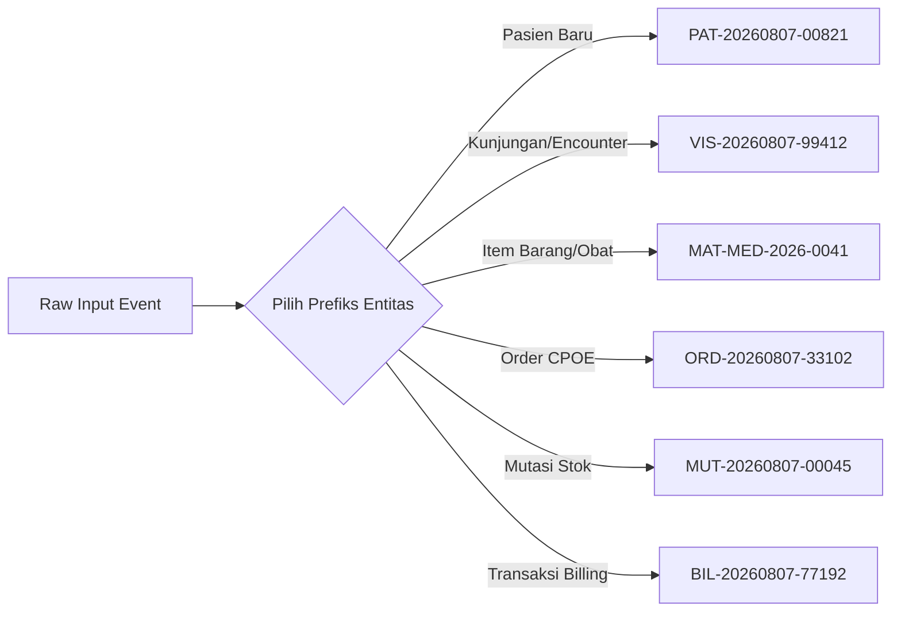
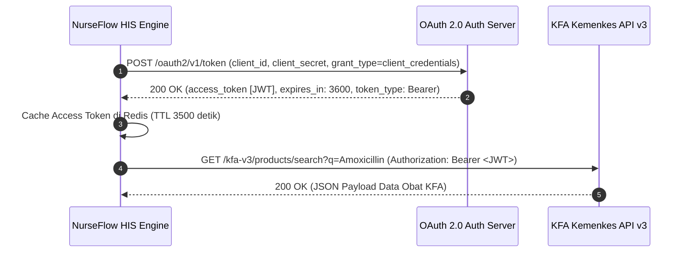
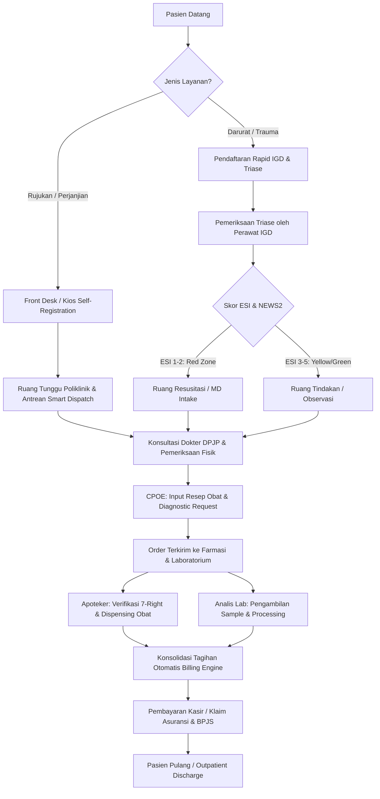
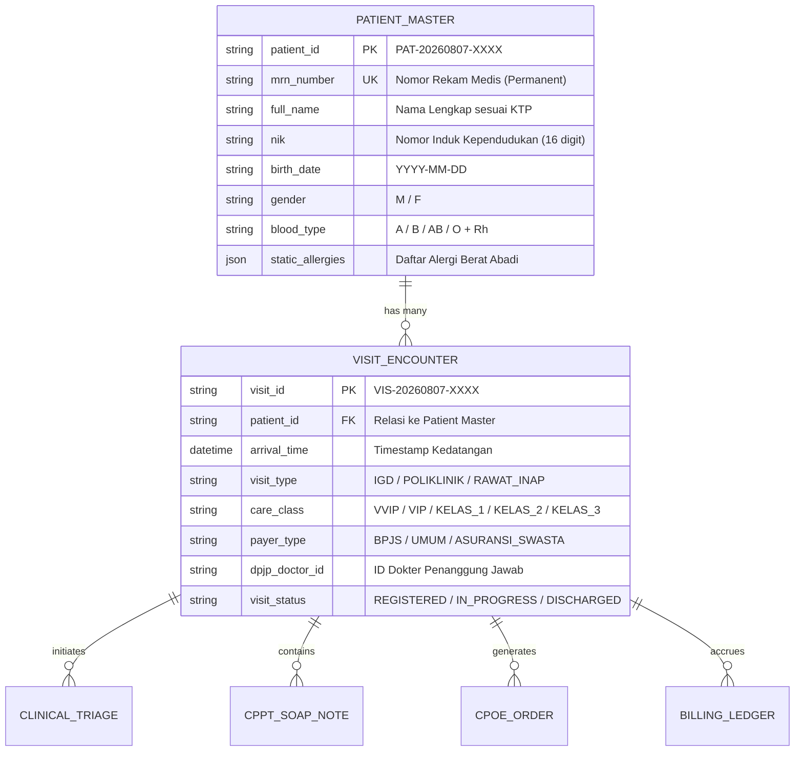
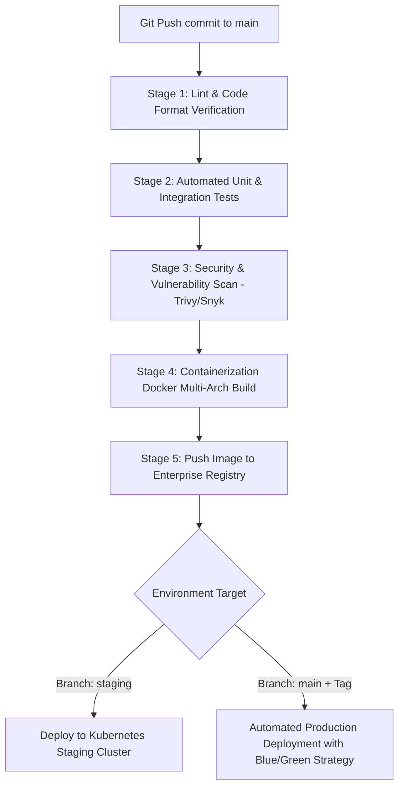
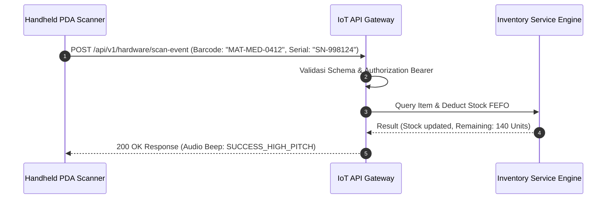
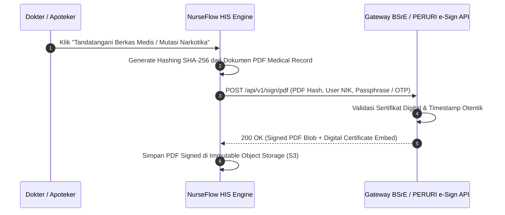
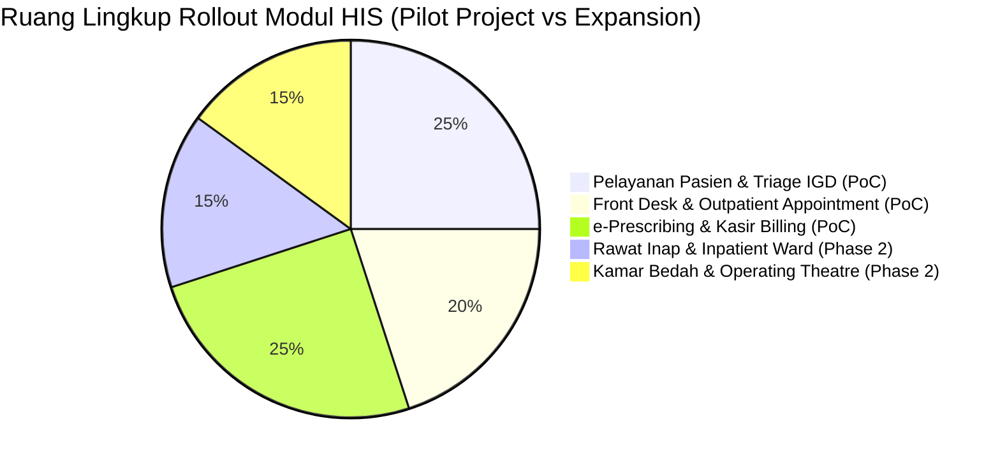

# MASTER SOFTWARE REQUIREMENT SPECIFICATION (SRS) & ARSITEKTUR SISTEM
## PROYEK PENGEMBANGAN ENTERPRISE HOSPITAL INFORMATION SYSTEM (HIS)
### Kode Proyek: NurseFlow-HIS-v2026 | Document Version: 1.0.0-ENTERPRISE

---

> **DOKUMEN SPESIFIKASI ARSITEKTUR & PERSYARATAN PERANGKAT LUNAK (MASTER SRS)**  
> **Status:** Approved for Implementation & IT Handoff  
> **Target Audience:** System Architects, Lead Engineers, Backend/Frontend Developers, DevOps Team, Medical IT Director, Hospital Management Committee.

---

## DAFTAR ISI

1. [PENDAHULUAN & STANDAR KEPATUHAN MEDIS](#1-pendahuluan--standar-kepatuhan-medis)
2. [PILAR 1: ARSITEKTUR MASTER DATA & IDENTIFIKASI UNIK](#2-pilar-1-arsitektur-master-data--identifikasi-unik)
3. [PILAR 2: DOKUMENTASI INTEGRASI & API EKSTERNAL](#3-pilar-2-dokumentasi-integrasi--api-ekternal)
4. [PILAR 3: ALUR KERJA WORKFLOW & INTERAKSI PENGGUNA SIMULASI ANTARMUKA](#4-pilar-3-alur-kerja-workflow--interaksi-pengguna-simulasi-antarmuka)
5. [PILAR 4: INFRASTRUKTUR DEVOPS & CI/CD PIPELINE AUTOMATION](#5-pilar-4-infrastruktur-devops--cicd-pipeline-automation)
6. [PILAR 5: ARSITEKTUR FINANSIAL & MULTI-TARIF BILLING ENGINE](#6-pilar-5-arsitektur-finansial--multi-tarif-billing-engine)
7. [PILAR 6: INTEGRASI PERANGKAT KERAS HARDWARE & IOT EDGE](#7-pilar-6-integrasi-perangkat-keras-hardware--iot-edge)
8. [PILAR 7: KEAMANAN TINGKAT LANJUT & KEPATUHAN HUKUM E-SIGN & AUDIT TRAIL](#8-pilar-7-keamanan-tingkat-lanjut--kepatuhan-hukum-e-sign--audit-trail)
9. [PILAR 8: STRATEGI BISNIS MODEL DEPLOYMENT & POC SCOPE](#9-pilar-8-strategi-bisnis-model-deployment--poc-scope)
10. [ANALISIS FITUR OPERASIONAL MODUL-MODUL INTI](#10-analisis-fitur-operasional-modul-modul-inti)

---

## 1. PENDAHULUAN & STANDAR KEPATUHAN MEDIS

### 1.1 Visi Sistem
Sistem Informasi Rumah Sakit (HIS) NurseFlow dirancang sebagai sistem operasi klinis dan manajemen enterprise berskala nasional/internasional. Sistem mengedepankan pendekatan *Clinical First*, maksimalisasi otomatisasi, minimasi jumlah klik (*clicks reduction*), eliminasi *human error*, serta interoperabilitas tinggi antar-modul dan ekosistem kesehatan luar.

### 1.2 Matriks Kepatuhan Standar (Compliance Matrix)

| Standar Kepatuhan | Lembaga Regulator | Implikasi Terhadap Arsitektur Sistem |
| :--- | :--- | :--- |
| **JCI Elite (Joint Commission International)** | JCI Accreditation Standards | Implementasi Two-Factor Identification (MRN + DOB), SLA Tracking Time-to-Care per ESI, Critical Value Alert System, Mandatory Audit Trail, dan Infection Isolation Flagging. |
| **ATS & ESI v4** | Australasian College for Emergency Medicine / Emergency Nurses Association | Algoritma triase IGD 5 Tingkat (Resuscitation, Emergent, Urgent, Less Urgent, Non-Urgent) dengan integrasi skor NEWS2 otomatis. |
| **SatuSehat FHIR R4** | Kementerian Kesehatan Republik Indonesia (Kemenkes RI) | Interoperabilitas data medis menggunakan standar HL7 FHIR Release 4 (`Encounter`, `Condition`, `Observation`, `MedicationRequest`). |
| **Permenkes No. 24 Tahun 2022** | Pemerintah Republik Indonesia | Kewajiban Rekam Medis Elektronik (RME) yang aman, memiliki Tanda Tangan Elektronik (TTE) legal, serta *immutable audit logging*. |
| **Kodeks ISO 27001 & PDP** | Badan Siber dan Sandi Negara (BSSN) & UU PDP | Enkripsi data *at-rest* (AES-256) dan *in-transit* (TLS 1.3), *Role-Based Access Control* (RBAC), serta pemisahan data sensitif pasien. |

---

## 2. PILAR 1: ARSITEKTUR MASTER DATA & IDENTIFIKASI UNIK

### 2.1 Skema Generator Unique ID Alfanumerik
Untuk menghindari *primary key collision* pada sistem terdistribusi serta memudahkan pemindaian manual maupun otomatis, seluruh entitas utama menggunakan ID alfanumerik terstruktur berbasis pola `[PREFIX]-[YYYYMMDD]-[UUID/SEQUENTIAL]`.



#### Spesifikasi Taksonomi Lengkap Unique ID Alfanumerik (29 Core & Sub-Entity ID Schemes):

| Kategori Sub-Sistem | Entitas Data | Format / Pattern ID | Contoh Value | Penjelasan & Aturan Unik |
| :--- | :--- | :--- | :--- | :--- |
| **Pendaftaran & Admisi** | **Master Pasien** | `PAT-[YYYYMMDD]-[8-CHAR UUID]` | `PAT-20260807-8A3F9B12` | Nomor Rekam Medis (MRN) Abadi pasien. Unik global. |
| | **Kunjungan (Encounter)** | `VIS-[YYYYMMDD]-[5-DIGIT SEQ]` | `VIS-20260807-01048` | Episode perawatan aktif (IGD, Rawat Jalan, Rawat Inap). |
| | **Antrean / Appointment** | `APT-[YYYYMMDD]-[5-DIGIT SEQ]` | `APT-20260807-0012` | Kios antrean & reservasi janji temu dokter. |
| **Departemen & SDM** | **Master Departemen** | `DEPT-[KODE_UNIT]` | `DEPT-EMERGENCY` | Identifikasi unit kerja / poliklinik spesialis. |
| | **Master Organisasi** | `ORG-[KODE_GUNA]` | `ORG-RS-MAIN-01` | Hierarki entitas bisnis/cabang fasilitas kesehatan. |
| | **Master Pegawai / Dokter** | `USR-[PERAN]-[4-DIGIT SEQ]` | `USR-DOCTOR-0012` | Identifikasi staf medis, perawat, apoteker, admin. |
| **Klinis & EMR** | **Order Medis (CPOE)** | `ORD-[TIPE]-[YYYYMMDD]-[SEQ5]`| `ORD-PHAR-20260807-0021` | Order e-Prescribing, Laboratorium, Radiologi. |
| | **Triase Warna IGD** | `CLR-[WARNA]-[ESI_LEVEL]` | `CLR-RED-ESI1` | Kode warna prioritas triase (Red, Org, Yel, Grn, Blu). |
| | **Tempat Tidur (Bed)** | `BED-[KODE_WARD]-[NO_BED]` | `BED-ICU-04` | Alokasi bed rawat inap & pemantauan hunian (BOR). |
| | **Operasi / Surgery** | `OPT-[YYYYMMDD]-[4-DIGIT SEQ]` | `OPT-20260807-0008` | Jadwal & laporan bedah Kamar Bedah (ASC). |
| | **Shift Handover (SBAR)**| `HND-[YYYYMMDD]-[4-DIGIT SEQ]` | `HND-20260807-0091` | Berkas serah terima keperawatan/dokter SBAR. |
| **Diagnostik & Lab/PACS** | **Sampel Lab (Specimen)**| `SMP-LAB-[YYYYMMDD]-[SEQ5]` | `SMP-LAB-20260807-00142` | Barcode spesimen darah/urine untuk LIS auto-ingest. |
| | **Radiologi Accession** | `RAD-ACC-[YYYYMMDD]-[SEQ5]` | `RAD-ACC-20260807-00812` | Accession Number untuk integrasi DICOM / PACS. |
| **Logistik & Gudang** | **Master Barang / Obat** | `MAT-[KATEGORI]-[4-DIGIT SEQ]` | `MAT-MED-0412` | Prefiks `MED` (Medis), `BHP`, `ALKES`. |
| | **Katalog KFA Kemenkes** | `KFA-[8-DIGIT KFA CODE]` | `KFA-93001842` | Kode referensi terstandar Kemenkes SatuSehat. |
| | **Gudang Fisik** | `WH-[KODE_GUDANG]` | `WH-CENTRAL-01` | Gudang Utama, Gudang Satelit, Depo Unit. |
| | **Rak & Baris Storage** | `RK-[GUDANG]-[RAK]-[BARIS]` | `RK-FAR-A01-S02` | Lokasi fisik presisi simpan barang. |
| | **Batch FEFO Logistik** | `BATCH-[KODE_OBAT]-[EXP_YM]` | `BATCH-ASP-202611` | Pelacakan *First Expired, First Out*. |
| | **Material Request (RQ)** | `RQ-[YYYYMMDD]-[4-DIGIT SEQ]` | `RQ-20260807-0042` | Permintaan barang habis pakai dari unit ke gudang. |
| | **Mutasi Stok (MUT)** | `MUT-[YYYYMMDD]-[4-DIGIT SEQ]` | `MUT-20260807-0089` | Mutasi stok barang antar gudang/depo. |
| | **Penerimaan Barang (RCV)**| `RCV-[YYYYMMDD]-[4-DIGIT SEQ]` | `RCV-20260807-0012` | Berkas penerimaan fisik dari supplier/gudang pusat. |
| **Finansial & Billing** | **Billing / Kwitansi** | `BIL-[YYYYMMDD]-[6-DIGIT SEQ]` | `BIL-20260807-004812` | Kwitansi & tagihan resmi pasien. |
| | **Grup Tarif Layanan** | `GRP-[PENJAMIN]-[KELAS]` | `GRP-BPJS-01` | Pengelompokan matriks tarif (BPJS/Cash/Asuransi). |
| | **Kelas Perawatan** | `CLS-[KODE_KELAS]` | `CLS-VIP` | Kelas akomodasi (VVIP, VIP, Class 1-3, ICU). |
| | **Komponen Jasa (Split)**| `CMP-[JENIS_JASA]` | `CMP-DOCTOR` | Pecahan tarif (`CMP-HOSPITAL`, `CMP-DOCTOR`, `CMP-PARAMEDIC`, `CMP-BHP`). |
| | **Berkas Klaim INA-CBGs**| `CLM-INACBG-[YYYYMMDD]-[SEQ4]`| `CLM-INACBG-20260807-0021`| Berkas pengajuan klaim ke BPJS Kesehatan. |
| **Keamanan, IoT & Regulatory**| **Tanda Tangan Digital** | `SIG-[PROVIDER]-[HASH8]` | `SIG-BSRE-99824A12` | Sertifikat e-Sign BSrE BSSN / PERURI. |
| | **Sensor Temperature IoT**| `IOT-COLD-[GUDANG]-[NO_SENS]`| `IOT-COLD-FAR-01` | Sensor telemetry suhu cold-chain vaksin/darah. |
| | **Surat Eligibilitas SEP** | `SEP-BPJS-[YYYYMMDD]-[SEQ6]` | `SEP-BPJS-20260807-008124`| Nomor SEP resmi BPJS V-Claim. |

### 2.2 Sinkronisasi Kode Standar Medis Internasional & Nasional

```typescript
// Interface Spesifikasi Pemetaan ICD-10, ICD-9 CM, dan KFA Kemenkes
interface MedicalDiagnosisICD10 {
  icd10Code: string;       // Contoh: "I21.9"
  diseaseNameID: string;   // "Infark Miokard Akut, tidak ditentukan"
  diseaseNameEN: string;   // "Acute myocardial infarction, unspecified"
  chapter: string;         // "IX. Diseases of the circulatory system"
  isChronic: boolean;      // True jika penyakit kronis (e.g. Hipertensi, Diabetes)
  isReportableKemenkes: boolean; // Flag laporan RL5 Kemenkes
}

interface MedicalProcedureICD9CM {
  icd9Code: string;        // Contoh: "36.06"
  procedureName: string;   // "Insertion of non-drug-eluting coronary artery stent(s)"
  category: string;        // "Operations on the cardiovascular system"
  requiresOperatingRoom: boolean; // Flag butuh OK/Kamar Bedah
}

interface KFAKemenkesItemSync {
  kfaCode: string;         // Contoh ID KFA: "93000124"
  kfaName: string;         // "Paracetamol 500 mg Tablet"
  activeIngredient: string; // "Paracetamol"
  dosageForm: string;      // "Tablet"
  rxNormId?: string;       // Mapping ID RxNorm Internasional
  satuSehatCommodityId: string; // ID Komoditas Terdaftar SatuSehat
  lastSyncedTimestamp: string;  // ISO 8601 UTC
}
```

### 2.3 Mekanisme Sinkronisasi KFA (Kamus Farmasi dan Alat Kesehatan)

1. **Job Scheduler**: Cron Job harian pukul 01:00 AM melacak perubahan katalog KFA Kemenkes via REST API.
2. **Delta Matcher**: Membandingkan checksum payload katalog KFA lokal dengan KFA Kemenkes.
3. **Conflict Resolution**: Jika item baru ditemukan, sistem menambahkan secara otomatis ke Master Material dengan status `DRAFT_REVIEW` untuk divalidasi oleh Kepala Farmasi.

---

## 3. PILAR 2: DOKUMENTASI INTEGRASI & API EKSTERNAL

### 3.1 Protokol Otentikasi Mesin (Machine-to-Machine OAuth 2.0)
Integrasi antarsistem ekstranet menggunakan standar **OAuth 2.0 Client Credentials Grant** menggunakan enkripsi RS256.



### 3.2 Spesifikasi Endpoint API Eksternal Core

#### A. Kemenkes KFA API (v2 & v3)

- **Search Products**: `GET /kfa-v3/products/search?keyword={query}&page=1&limit=20`
- **Get Product Detail**: `GET /kfa-v3/products/{kfa_code}`
- **Payload Request Headers**:
  ```http
  Authorization: Bearer <JWT_TOKEN>
  Accept: application/json
  X-Client-ID: HIS-NURSEFLOW-ENT-01
  ```
- **Example Response Body (`200 OK`)**:
  ```json
  {
    "code": 200,
    "status": "success",
    "data": {
      "kfa_code": "93001842",
      "display_name": "Amoxicillin Trihydrate 500 mg Kapsul",
      "form_code": "BS036",
      "form_name": "Kapsul",
      "active_ingredients": [
        {
          "name": "Amoxicillin Trihydrate",
          "strength": "500",
          "unit": "mg"
        }
      ],
      "net_content": 100,
      "package_unit": "Dus, 10 Strip @ 10 Kapsul",
      "satu_sehat_id": "SS-MED-098124"
    }
  }
  ```

#### B. NLM ClinicalTables API (Lookup Diagnosis ICD-10 & Prosedur ICD-9 CM)

- **ICD-10-CM Search**: `GET https://clinicaltables.nlm.nih.gov/api/icd10cm/v3/search?terms={query}&sf=code,name&maxList=10`
- **Example Response Body (`200 OK`)**:
  ```json
  [
    1,
    ["I21.9"],
    null,
    [["I21.9", "Acute myocardial infarction, unspecified"]]
  ]
  ```

#### C. BPJS V-Claim v2.0 API (Pembuatan SEP & Cek Peserta)

- **Endpoint SEP Creation**: `POST /vclaim-rest/SEP/2.0/insert`
- **Security Headers**: `X-cons-id`, `X-timestamp`, `X-signature` (HMAC-SHA256 dari ConsID + SecretKey + Timestamp).

---

## 4. PILAR 3: ALUR KERJA (WORKFLOW) & INTERAKSI PENGGUNA (SIMULASI ANTARMUKA)

### 4.1 End-to-End Customer Journey (Alur Pasien Terintegrasi)



### 4.2 Pemisahan Batas Operasional: "Data Pasien" vs "Manajemen Kunjungan"

Sistem memisahkan secara ketat entitas statis pasien dari entitas dinamis kunjungan (*separation of concerns*) untuk mencegah redundansi data dan mempermudah pelaporan medis legal.



---

### 4.3 Simulasi Antarmuka Spesifik Berdasarkan Persona

#### A. Persona 1: Perawat IGD (Emergency Nurse Triage Interface)

##### Fitur Utama UI:
- **Rapid Intake Panel**: Input 5 Tanda Vital Utama (`HR`, `RR`, `SpO2`, `BP`, `GCS/AVPU`) dalam < 20 detik.
- **Automated ESI & NEWS2 Engine**: Perhitungan langsung skor risiko klinis.
- **Red Zone Overcrowding Alert**: Indikator warna mencolok (Merah Flash) untuk ESI 1 (Resusitasi).

```
+---------------------------------------------------------------------------------------------------+
|  NURSEFLOW HIS v2026  --  IGD EMERGENCY TRIAGE WALLBOARD               [User: Ns. Sarah, S.Kep]  |
+---------------------------------------------------------------------------------------------------+
|  [+ PASIEN DARURAT BARU]   | SLA Timer Resusitasi: 00:00:15 (Target < 30 detik)                   |
+---------------------------------------------------------------------------------------------------+
|  RAPID VITALS INPUT PANEL (Pasien: VIS-20260807-0012)                                             |
|  Keluhan Utama : [ Nyeri Dada Hebat Tembus Punggung                ]                             |
|  Tekanan Darah : [ 170 / 100 ] mmHg  | Nadi (HR)   : [ 125 ] bpm    | RR : [ 28 ] x/min           |
|  Saturasi O2   : [ 91 ] %            | Suhu (Temp) : [ 37.8 ] C     | AVPU : (x) Pain ( ) Voice   |
+---------------------------------------------------------------------------------------------------+
|  SYSTEM DECISION SUPPORT RECOMMENDATION:                                                          |
|  >> ESI LEVEL   : LEVEL 1 (RESUSCITATION - RED ZONE) [ REKOMENDASI AI ]                           |
|  >> NEWS2 SCORE : 9 (HIGH RISK - ESCALATE TO MD IMMEDIATELY)                                      |
|  [ KONFIRMASI ESI 1 & NOTIFIKASI RESUSITASI ]   [ OVERRIDE KEPUTUSAN TRIASI ]                     |
+---------------------------------------------------------------------------------------------------+
|  QUEUE IGD LIVE MONITORING:                                                                       |
|  1. VIS-0012 - Ny. Budiarti   | ESI 1 (Red)    | SLA: 01 min | Action: Resusitasi Bed 1          |
|  2. VIS-0011 - En. Suhendra   | ESI 2 (Orange) | SLA: 08 min | Action: Triase Sekunder Bed 4     |
|  3. VIS-0009 - An. Rian       | ESI 4 (Green)  | SLA: 45 min | Action: Ruang Tunggu IGD          |
+---------------------------------------------------------------------------------------------------+
```

#### B. Persona 2: Dokter DPJP (Attending Physician Workspace & CPOE)

##### Fitur Utama UI:
- **CPPT / SOAP Interactive Form**: Entri Subjektif, Objektif, Asesmen, dan Plan.
- **ClinicalTables ICD-10 Search Autocomplete**: Pencarian kode diagnosis presisi tanpa buka buku manual.
- **Computerized Physician Order Entry (CPOE)**: Pemesanan resep elektronik terhubung langsung ke stok apotik.

```
+---------------------------------------------------------------------------------------------------+
|  PHYSICIAN CLINICAL WORKSPACE  --  DPJP: dr. Alexander Sp.JP           [Patient: Tn. Herman (62th)]|
+---------------------------------------------------------------------------------------------------+
|  RIWAYAT ALERGI PASIEN: [! WARNING: ALERGI PENISILIN (ANAFILAKSIS) !]                             |
+---------------------------------------------------------------------------------------------------+
|  SOAP / CPPT CLINICAL ENTRY:                                                                      |
|  [S] Subjektif : Pasien mengeluh dada terasa ditindih beban berat sejak 2 jam SBRS.               |
|  [O] Objektif  : TD: 150/90, HR: 110, EKG: ST-Elevasi pada lead V1-V4.                            |
|  [A] Asesmen   : ICD-10 Lookup: [ I21.0  | Acute transmural myocardial infarction of anterior wall]|
|  [P] Plan      : Terapi Reperfusi / Primary PCI, Antiplatelet ganda.                              |
+---------------------------------------------------------------------------------------------------+
|  CPOE PRESCRIBING PANEL (E-Prescribing):                                                          |
|  Obat: [ Aspirin 80 mg Tablet        ] | Dosis: 320 mg (4 Tab) | Rute: Oral (Chewable)            |
|  Obat: [ Clopidogrel 75 mg Tablet    ] | Dosis: 300 mg (4 Tab) | Rute: Oral                       |
|  [+ ADD MEDICATION]  [+ ORDER LAB/EKG]  --> [ KIRIM RESEP REK ELEKTRONIK KE FARMASI ]            |
+---------------------------------------------------------------------------------------------------+
```

#### C. Persona 3: Apoteker (Pharmacist Dispensing & 7-Right Verification UI)

##### Fitur Utama UI:
- **Verifikasi 7-Right Safety Checklist**: Tepat Pasien, Tepat Obat, Tepat Dosis, Tepat Rute, Tepat Waktu, Tepat Dokumentasi, Tepat Informasi.
- **FEFO Batch Selector**: Pengeluaran otomatis berbasis *First Expired, First Out*.
- **High-Alert / Narcotics Dual Approval Modal**: Verifikasi 2 otorisasi dengan PIN/Biometrik.

```
+---------------------------------------------------------------------------------------------------+
|  PHARMACY DISPENSING & VERIFICATION  --  Apoteker: Apt. Siska, S.Farm    [Order: ORD-PHAR-0021]   |
+---------------------------------------------------------------------------------------------------+
|  DETAIL RESEP DOKTER: dr. Alexander Sp.JP  | Pasien: Tn. Herman (VIS-20260807-0012)              |
|  Item 1: Aspirin 80 mg Tab (Qty: 4)    | Batch System Match: BATCH-ASP-202611 (Exp: 11/2027)      |
|  Item 2: Morphine 10mg/ml Inj (Qty: 1) | [! HIGH ALERT DRUG / NARKO TIKA !]                        |
+---------------------------------------------------------------------------------------------------+
|  VERIFIKASI KESELAMATAN OBAT (7-RIGHT VERIFICATION CHECKLIST):                                   |
|  [X] Right Patient   [X] Right Drug   [X] Right Dose   [X] Right Route   [X] Right Time           |
+---------------------------------------------------------------------------------------------------+
|  NARCOTICS & HIGH-ALERT DUAL SIGN-OFF REQUIRED:                                                   |
|  Apoteker Utama PIN : [ **** ] (Verified: Apt. Siska)                                             |
|  Saksi Verifikator  : [ **** ] (Verified: Ns. Herman)                                             |
|  [ DISPENSE & PRINT ETIKET OBAT ]   [ TOLAK RESEP / REVISI DOKTER ]                               |
+---------------------------------------------------------------------------------------------------+
```

---

## 5. PILAR 4: INFRASTRUKTUR DEVOPS & CI/CD PIPELINE AUTOMATION

### 5.1 Panduan Operasional GitHub CLI (`gh`)

Pengelolaan repositori enterprise dan pembersihan *workflow runs* yang gagal atau menumpuk dilakukan menggunakan GitHub CLI.

```bash
# 1. Login ke GitHub Enterprise Host menggunakan Token
gh auth login --hostname github.com --with-token < AUTOMATION_PAT_TOKEN.txt

# 2. Menampilkan daftar Workflow Run yang gagal (Status: failure)
gh run list --workflow=ci-cd-pipeline.yml --status=failure --limit 30

# 3. Batch Delete Workflow Runs yang gagal/batal untuk membersihkan storage runner
gh run list --status=failure --json databaseId -q '.[].databaseId' | xargs -I {} gh run delete {}

# 4. Batch Delete Workflow Runs lama yang berstatus success (> 30 hari)
gh run list --status=success --limit 100 --json databaseId -q '.[].databaseId' | xargs -I {} gh run delete {}
```

### 5.2 Skrip Otomatisasi Cleanup CI/CD Workflow (`.github/workflows/cleanup-pipeline.yml`)

```yaml
name: Automated Workflow Runs Cleanup

on:
  schedule:
    # Berjalan otomatis setiap hari Minggu pukul 02.00 AM UTC
    - cron: '0 2 * * 0'
  workflow_dispatch:

jobs:
  cleanup-old-runs:
    runs-on: ubuntu-latest
    steps:
      - name: Cleanup Duplicate and Stale Workflow Runs
        uses: matt-ball/github-action-cleanup-workflows@v2
        with:
          pr_trim: true
          keep_minimum_runs: 5
          to_delete: 'failure, cancelled, skipped'
          token: ${{ secrets.GITHUB_TOKEN }}
```

### 5.3 Multi-Stage CI/CD Pipeline Architecture



---

## 6. PILAR 5: ARSITEKTUR FINANSIAL & MULTI-TARIF BILLING ENGINE

### 6.1 Matriks Grouptarif Dinamis
Tarif dasar layanan medis dihitung secara otomatis berdasarkan kombinasi **Kelas Perawatan** dan **Jenis Penjamin/Payer**.

$$\text{Total Tarif Layanan} = \text{Tarif Dasar Layanan} \times \text{Pengali Kelas Perawatan} \times \text{Pengali Jenis Penjamin}$$

#### Matriks Pengali Tarif Layanan (Grouptarif Matrix):

| Kelas Perawatan \ Jenis Penjamin | BPJS Kesehatan | Pasien Umum (Cash) | Asuransi Swasta Tier-1 | Corporate Contract |
| :--- | :--- | :--- | :--- | :--- |
| **VVIP / President Suite** | N/A (Top-Up Tariff) | 2.50x | 2.20x | 2.00x |
| **VIP** | N/A (Top-Up Tariff) | 1.80x | 1.65x | 1.50x |
| **Kelas 1** | Paket INA-CBGs Class 1 | 1.30x | 1.25x | 1.20x |
| **Kelas 2** | Paket INA-CBGs Class 2 | 1.15x | 1.10x | 1.05x |
| **Kelas 3** | Paket INA-CBGs Class 3 | 1.00x (Base) | 1.00x | 1.00x |
| **ICU / HCU / ICCU** | Paket INA-CBGs Special | 2.20x | 2.00x | 1.85x |

---

### 6.2 Aturan Pemecahan Komponen Harga (Price Breakdown Split Engine)

Setiap transaksi tindakan medis secara rasional dipecah menjadi 4 komponen finansial utama untuk keperluan pembagian jasa medis (*remunerasi*) dan akuntansi biaya (*cost accounting*).

```
TOTAL HARGA TINDAKAN (100%)
├── 1. Jasa Rumah Sakit / Facility Fee (35%)   --> Operasional, Listrik, Depresiasi Alat
├── 2. Jasa Medis Dokter / Physician Fee (45%) --> Remunerasi Langsung Dokter DPJP
├── 3. Jasa Paramedis / Nursing Fee (10%)       --> Jasa Keperawatan & Tim Medis
└── 4. Jasa BHP / Consumables Fee (10%)        --> Replacement Cost Alkes & Bahan Habis Pakai
```

#### TypeScript Implementation: Price Breakdown Engine

```typescript
export interface TariffBreakdown {
  totalTariff: number;
  hospitalFee: number;
  doctorFee: number;
  paramedicFee: number;
  bhpFee: number;
}

export function calculateTariffSplit(
  baseServicePrice: number,
  careClassMultiplier: number,
  payerMultiplier: number,
  customSplitRatio?: { hospital: number; doctor: number; paramedic: number; bhp: number }
): TariffBreakdown {
  const finalPrice = Math.round(baseServicePrice * careClassMultiplier * payerMultiplier);

  // Ratio default: RS=35%, Dokter=45%, Paramedis=10%, BHP=10%
  const ratio = customSplitRatio || { hospital: 0.35, doctor: 0.45, paramedic: 0.10, bhp: 0.10 };

  return {
    totalTariff: finalPrice,
    hospitalFee: Math.round(finalPrice * ratio.hospital),
    doctorFee: Math.round(finalPrice * ratio.doctor),
    paramedicFee: Math.round(finalPrice * ratio.paramedic),
    bhpFee: Math.round(finalPrice * ratio.bhp),
  };
}
```

---

## 7. PILAR 6: INTEGRASI PERANGKAT KERAS (HARDWARE & IOT EDGE)

### 7.1 Spesifikasi Handheld Scanner Endpoint (Gudang Logistik & Farmasi)

Perangkat Handheld Scanner (Android PDA) berkomunikasi dengan HIS via WebSocket secure (`wss://`) atau REST Intent Listener untuk eksekusi *stock take*, mutasi, dan penerimaan barang secara *real-time*.



---

### 7.2 Protokol Webhook / MQTT Smart Temperature Sensor (Cold-Chain Storage)

Penyimpanan obat-obatan berisiko tinggi (Vaksin, Serum, Kantong Darah) dipantau oleh sensor suhu pintar IoT 24/7.

- **Protokol**: MQTT v5.0 over TLS (Port 8883)
- **MQTT Topic**: `his/iot/coldchain/{storage_id}/telemetry`
- **Data Payload JSON**:
  ```json
  {
    "device_id": "COLD-SENS-FAR-01",
    "storage_location": "Kulkas Utama Farmasi IGD",
    "temperature_celsius": 11.4,
    "humidity_percentage": 58.2,
    "threshold_min": 2.0,
    "threshold_max": 8.0,
    "status": "CRITICAL_OVERHEAT_ALERT",
    "timestamp": 1788771560
  }
  ```
- **Automated Escalation Rule**: Jika suhu di atas 8.0°C selama > 10 menit, HIS otomatis memicu Sirine Peringatan di Ruang Apoteker dan mengirimkan pesan Broadcast WhatsApp/SMS ke Kepala Farmasi.

---

### 7.3 Smart Gate Receiving & Validasi RFID Otomatis

Penerimaan logistik besar di *docking gate* dan penerimaan mutasi barang antar-gedung menggunakan RFID Fixed Reader Gate.

```
       +------------------------------------------------------+
       |          SMART GATE RECEIVING DOCK D-01               |
       |                                                      |
       |  [ RFID GATE ANTENNA 1 ]    [ RFID GATE ANTENNA 2 ]  |
       |             \                     /                  |
       |              \   PALLET BARANG   /                   |
       |               +-----------------+                    |
       |               | Tag 1: Obat A   |                    |
       |               | Tag 2: Alkes B  |                    |
       |               +-----------------+                    |
       +-----------------------|------------------------------+
                               v
             [ HIS RFID ENGINE EDGE SERVICE ]
                               |
            (Validasi 100% RFID Tag vs Surad Jalan)
                               v
            STATUS: MUTASI LOGISTIK VERIFIED & LOADED
```

---

## 8. PILAR 7: KEAMANAN TINGKAT LANJUT & KEPATUHAN HUKUM (E-SIGN & AUDIT TRAIL)

### 8.1 Integrasi API Tanda Tangan Elektronik (e-Sign) Tersertifikasi BSrE / PERURI

Seluruh dokumen rekam medis legal dan persetujuan mutasi narkotika wajib ditandatangani secara digital menggunakan Sertifikat Elektronik Resmi yang diakui BSSN.



---

### 8.2 Database Audit Trail Tak Terubah (Immutable Audit Trail Engine)

Setiap transaksi penulisan, pengubahan, atau penghapusan data medis menggunakan skema *Append-Only Audit Log Table* berbasis **Cryptographic Hash Chaining** (serupa dengan prinsip *Blockchain*).

```sql
-- DDL Table Audit Trail Tak Terubah (Immutable Ledger)
CREATE TABLE immutable_audit_trail (
    audit_id BIGSERIAL PRIMARY KEY,
    timestamp TIMESTAMP WITH TIME ZONE DEFAULT CURRENT_TIMESTAMP NOT NULL,
    user_id VARCHAR(64) NOT NULL,
    user_role VARCHAR(32) NOT NULL,
    action_type VARCHAR(16) NOT NULL, -- 'INSERT', 'UPDATE', 'DELETE', 'OVERRIDE'
    target_table VARCHAR(64) NOT NULL,
    record_id VARCHAR(64) NOT NULL,
    previous_value JSONB,
    new_value JSONB,
    override_reason TEXT,
    ip_address VARCHAR(45) NOT NULL,
    biometric_signature_hash VARCHAR(128),
    previous_row_hash VARCHAR(64) NOT NULL, -- SHA-256 Hash dari baris audit sebelumnya
    current_row_hash VARCHAR(64) NOT NULL   -- SHA-256 Hash (Current Data + previous_row_hash)
);

-- Indexing Khusus Audit Trail
CREATE INDEX idx_audit_record ON immutable_audit_trail(target_table, record_id);
CREATE INDEX idx_audit_timestamp ON immutable_audit_trail(timestamp);
```

#### Formula Hash Chaining Audit Log:

$$\text{Current Row Hash} = \text{SHA256}(\text{audit\_id} + \text{timestamp} + \text{user\_id} + \text{action\_type} + \text{new\_value} + \text{previous\_row\_hash})$$

---

## 9. PILAR 8: STRATEGI BISNIS, MODEL DEPLOYMENT & POC SCOPE

### 9.1 Matriks Pemisahan Environment Variables (`.env`)

Sistem mendukung 2 mode deployment utama: **SaaS Multi-Tenant Cloud** dan **Dedicated On-Premise HIS**.

| Environment Variable | SaaS Multi-Tenant Cloud Mode | Dedicated On-Premise HIS Mode |
| :--- | :--- | :--- |
| `DEPLOYMENT_MODE` | `SAAS_CLOUD` | `ON_PREMISE` |
| `TENANT_ISOLATION_TYPE` | `SCHEMA_PER_TENANT` / `ROW_LEVEL_SECURITY` | `SINGLE_TENANT_DEDICATED` |
| `DATABASE_URL` | `postgresql://cloud-cluster.his.internal:5432/his_db` | `postgresql://local-db.hospital.local:5432/nurseflow_db` |
| `HARDWARE_IOT_GATEWAY` | `https://iot-cloud-gateway.nurseflow.io` | `http://192.168.10.50:8080` (Local Edge) |
| `BSRE_ESIGN_ENDPOINT` | `https://bsre-api.kemenkes.go.id/v1` | `https://bsre-appliance.hospital.local/v1` |
| `STORAGE_PROVIDER` | `GOOGLE_CLOUD_STORAGE` / `AWS_S3` | `LOCAL_MINIO_CLUSTER` |

---

### 9.2 Penentuan Ruang Lingkup Modul Uji Coba (Pilot Project / PoC Scope)



#### Ruang Lingkup Fase Pilot Project (PoC - Duration: 3 Bulan):
1. **Modul Triage IGD & Rapid Intake**: Pengujian kecepatan respon perawat dan pemetaan ESI.
2. **Modul Master Layanan & Billing Engine**: Uji coba pencatatan tarif multi-penjamin (BPJS vs Cash).
3. **Modul CPOE & Apotik Outpatient**: Verifikasi alur resep elektronik dan pengeluaran stok FEFO.
4. **Modul Pendaftaran & Antrean Appointment**: Uji coba integrasi kios antrean front desk.

---

## 10. ANALISIS FITUR OPERASIONAL MODUL-MODUL INTI

### 10.1 Modul Pelayanan Pasien (Patient Care)
- **Kemampuan Utama**: Manajemen pendaftaran episode perawatan (IGD, Rawat Jalan, Rawat Inap), penelusuran status ketersediaan tempat tidur (*Bed Management*), serta riwayat rekam medis terpadu (*Single Medical Record View*).
- **Inovasi Workflow**: Integrasi langsung indikator alergi obat berbahaya yang secara proaktif mengunci penulisan resep CPOE oleh dokter jika terjadi keraguan klinis.

### 10.2 Modul Master Layanan (Service Catalog Master)
- **Kemampuan Utama**: Pengelolaan katalog seluruh tindakan medis, pemeriksaan laboratorium, pemeriksaan radiologi, dan akomodasi rawat inap.
- **Inovasi Workflow**: Pemetaan dinamis kode layanan lokal rumah sakit ke kode ICD-9 CM dan kode Klaim INA-CBGs untuk pencegahan klaim *pending* BPJS.

### 10.3 Modul Material Request (Hospital Consumables Ordering)
- **Kemampuan Utama**: Pengajuan permintaan Bahan Habis Pakai (BHP), spuit, kasa steril, dan cairan infus dari ruang perawatan ke Gudang Logistik Farmasi.
- **Inovasi Workflow**: Otomatisasi persetujuan (*auto-approval*) untuk permintaan material yang berada di bawah kuota batas kritis mingguan unit.

### 10.4 Modul Mutasi Logistik Gudang (Warehouse Inventory Mutation)
- **Kemampuan Utama**: Perpindahan stok fisik antar gudang utama (*Central Warehouse*) ke gudang satelit (Apotik IGD, Depo Rawat Inap).
- **Inovasi Workflow**: Pelacakan nomor *batch* dan tanggal kedaluwarsa (*Expiry Date*) menggunakan teknologi Handheld Barcode PDA dan RFID Smart Gate.

### 10.5 Modul Appointment & Penjadwalan Kunjungan (Queue Scheduling Engine)
- **Kemampuan Utama**: Penjadwalan kunjungan dokter spesialis via Mobile Apps/Web, pemesanan nomor antrean otomatis, dan integrasi BPJS Antrean Online API.
- **Inovasi Workflow**: Algoritma *Smart Queue Dispatch* yang menyesuaikan estimasi jam panggil berdasarkan kecepatan rata-rata durasi konsultasi aktual dokter per pasien.

---

## 11. FITUR SPESIFIK LANJUTAN ENTERPRISE HIS (PACS/DICOM, JCI IPSG, & DISASTER RECOVERY)

### 11.1 Integrasi DICOM / PACS & LIS Interoperability (Radiologi & Lab Analyzer)
- **Radiology Integration (DICOM / PACS)**: Integrasi dengan modalitas Radiologi (X-Ray, CT-Scan, MRI) menggunakan protokol **DICOMweb** (`WADO-RS`, `STOW-RS`, `QIDO-RS`) sehingga hasil pencitraan medis dapat langsung dibuka oleh Dokter DPJP melalui viewer terenkripsi berbasis HTML5 Zero-Footprint di lembar EMR.
- **Laboratory Information System (LIS Analyzer Auto-Ingest)**: Komunikasi bidirectional dengan mesin analisa laboratorium via protokol ASTM/HL7 v2.x untuk pengiriman sampel medis dan penarikan hasil otomatis tanpa entri manual.

### 11.2 Implementasi 6 Sasaran Keselamatan Pasien JCI (IPSG 1 - 6)

| Sasaran Keselamatan JCI | Nama Protokol IPSG | Implementasi Arsitektur Sistem HIS NurseFlow |
| :--- | :--- | :--- |
| **IPSG 1** | Identifikasi Pasien Secara Benar | Dua parameter verifikasi wajib (*MRN* + *Tanggal Lahir*) pada setiap pencetakan gelang barcode/RFID pasien. |
| **IPSG 2** | Peningkatan Komunikasi Efektif | Modul Serah Terima Shift Keperawatan berbasis **SBAR** (*Situation, Background, Assessment, Recommendation*) dan tombol *Read-Back Verification* untuk instruksi lisan. |
| **IPSG 3** | Peningkatan Keamanan Obat High-Alert | Fitur penguncian CPOE untuk elektrolit pekat & obat narkotika yang membutuhkan *Dual Sign-Off Biometrik/PIN* dari 2 apoteker/perawat. |
| **IPSG 4** | Kepastian Tepat-Lokasi, Tepat-Prosedur, Tepat-Pasien Bedah | Modul Kamar Bedah (ASC) dengan checklist wajib *Sign In*, *Time Out*, dan *Sign Out* sebelum insisi bedah. |
| **IPSG 5** | Pengurangan Risiko Infeksi Terkait Pelayanan Kesehatan | *Infection Isolation Flagging* otomatis pada profil EMR pasien saat terdeteksi bakteri resisten multi-obat (MRSA/TB). |
| **IPSG 6** | Pengurangan Risiko Pasien Cedera Akibat Jatuh | Kalkulator **Morse Fall Scale** otomatis pada intake triase yang secara visual memberikan indikator gelang kuning (*Fall Risk Alert*). |

---

### 11.3 Strategi Disaster Recovery (DRP) & Data Retention Policy 25 Tahun

- **Permenkes No. 24 Tahun 2022 Retention Compliance**: Data Rekam Medis Elektronik (RME) disimpan secara aktif selama minimum 25 tahun menggunakan skema *Cold Storage Tiering* (AWS S3 Glacier / MinIO Cold Tier) dengan enkripsi AES-256.
- **High Availability & High-Velocity Failover**: PostgreSQL Database Active-Passive Clustering dengan *Patroni/PgBouncer* yang mendukung *Automatic Failover* dalam < 5 detik dan *Zero Data Loss RPO* (Recovery Point Objective).

---

> **AKHIR DOKUMEN MASTER SRS & ARSITEKTUR SISTEM**  
> *NurseFlow Enterprise HIS Architecture Board - 2026*

