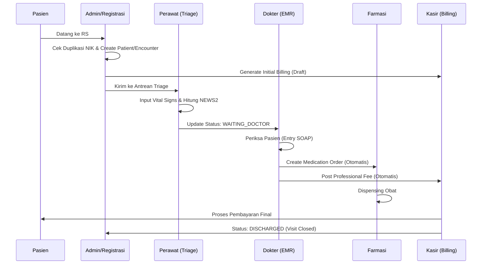
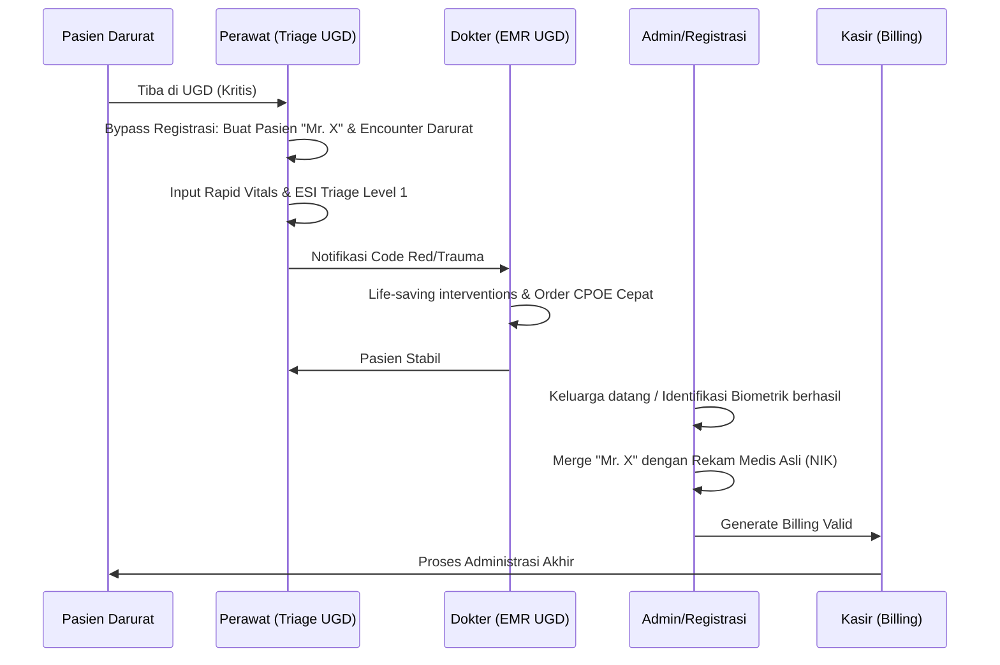
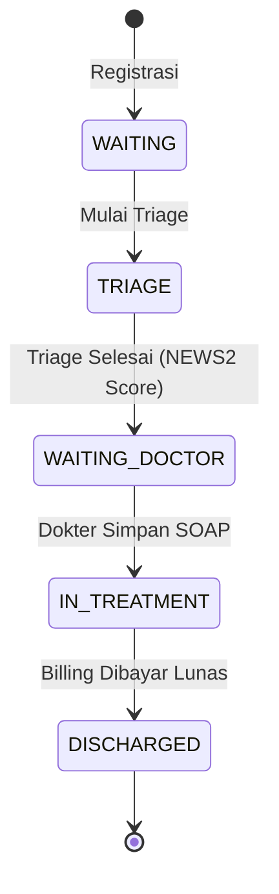

# 🏥 NURSEFLOW ENTERPRISE HIS 2026 - OPERATIONAL MANUAL
**V5.1 Spark-Safe | JCI International Standards Ready**

Manual ini dirancang untuk tenaga medis dan administrator rumah sakit sebagai panduan simulasi operasional nyata dalam ekosistem NurseFlow.

---

## 🏛️ V5 Cognitive UI Standard (Adaptive Design)

Mulai tahun 2026, NurseFlow mengadopsi antarmuka kognitif adaptif untuk mendukung pengambilan keputusan cepat di bawah tekanan (Decision Support).

### 🎨 Sistem Warna Semantik (Cognitive Lock)
Seluruh staf harus memahami makna warna berikut tanpa ambiguitas:
- **MERAH (Critical):** Tindakan segera. Pasien dalam risiko tinggi atau alert sistem kritis.
- **KUNING (Warning):** Waspada. SLA terlampaui atau tren klinis menurun.
- **HIJAU (Safe/Normal):** Operasional berjalan sesuai standar.
- **BIRU (Info):** Pembaruan data atau informasi administratif.

### 🛡️ Adaptive Modes (Stress & Focus)
Sistem akan berubah secara otomatis berdasarkan beban kerja klinis:
1. **STRESS MODE (Pulse Indicator):**
   - **Trigger:** Jumlah antrian > SLA atau adanya Alert Emergensi yang belum ditangani.
   - **Efek:** Kontras UI meningkat tajam, elemen visual berdenyut untuk menarik perhatian ke area kritis.
2. **FOCUS MODE (Noise Reduction):**
   - **Trigger:** Terjadi saat level stres kritis atau diaktifkan manual.
   - **Efek:** Sidebar akan mengecil otomatis dan informasi non-esensial disembunyikan untuk mengurangi beban kognitif.
   - **Whitelist:** Nama pasien, status klinis, dan tombol aksi utama akan selalu terlihat.

### 🔄 Classic UI Rollback (Safety Guard)
Jika dalam kondisi tertentu staf merasa antarmuka adaptif membingungkan, tersedia tombol **"Classic Mode"** (ikon perisai) di bar atas untuk mengembalikan UI ke tampilan standar secara instan.

---
*Manual ini adalah dokumen hidup. Setiap perubahan pada sistem Adaptive UI harus melalui persetujuan Komite Medis dan TI.*

## 🏛️ 1. Filosofi Sistem & Standar JCI
NurseFlow 2026 bukan sekadar aplikasi pencatatan, melainkan instrumen penegakan standar **Joint Commission International (JCI)** dengan fokus pada:
1. **International Patient Safety Goals (IPSG):** Identifikasi pasien yang benar via MRN & NIK.
2. **Auditability:** Setiap perubahan data klinis dicatat dalam audit log immutable.
3. **Traceability:** Tindakan medis dan biaya tagihan terhubung secara langsung.

---

## 🔄 2. Diagram Alur Kerja (Workstream Visualization)

### A. End-to-End Patient Journey

### A2. Emergency Anonymous Patient Journey (Mr. X / Tanpa Identitas)
*Kasus: Pasien tidak sadar (Trauma/Gawat Darurat) tanpa membawa identitas.*

### B. State Transition Encounter (Lifecycle Pasien)

---

## 📑 3. Simulasi Workflow Detil (Standard Operating Procedure)

### Tahap 1: Registrasi & Admisi (The Entry Gate)
*   **Aksi:** Admin menginput data pasien.
*   **Behavior Sistem:**
    *   Sistem melakukan deteksi duplikasi NIK.
    *   Generate **MRN (Medical Record Number)** unik.
    *   Membuka **Encounter (Kunjungan)** baru.
    *   **Financial Trigger:** Sistem membuat dokumen Billing status `DRAFT` dengan biaya administrasi awal.
*   **JCI Standard:** Identifikasi pasien tunggal (Single Patient Identity).

### Tahap 2: Triage Klinis (The Safety Valve)
*   **Aksi:** Perawat melakukan assessment vital signs.
*   **Behavior Sistem:**
    *   Server menghitung **NEWS2 Score** secara otomatis.
    *   Jika skor kritis, sistem memicu **Escalation Alert** ke seluruh tim medis.
    *   Status Encounter berubah menjadi `TRIAGE` (Siap diperiksa Dokter).
*   **JCI Standard:** Prioritasi pasien berdasarkan urgensi klinis (Bukan urutan kedatangan).

### Tahap 3: Konsultasi & EMR (The Medical Core)
*   **Aksi:** Dokter memeriksa pasien dan mengisi form **SOAP (Subjective, Objective, Assessment, Plan)**.
*   **Behavior Sistem:**
    *   Sistem menarik data vital signs dari Triage ke layar Dokter (No re-entry).
    *   Saat SOAP disimpan, sistem melakukan *multi-action*:
        1.  Kirim resep digital ke modul Farmasi.
        2.  Tambahkan komponen biaya jasa dokter ke Billing.
        3.  Update status ke `IN_TREATMENT`.
*   **JCI Standard:** Rekam medis terintegrasi dan terdokumentasi secara lengkap.

### Tahap 4: Farmasi & Penyiapan Obat (Order Fulfillment)
*   **Aksi:** Apoteker memverifikasi dan menyiapkan obat.
*   **Behavior Sistem:**
    *   Status obat berubah dari `PENDING` -> `DISPENSED`.
    *   Sistem mencatat siapa yang menyiapkan dan jam berapa obat diberikan.

### Tahap 5: Kasir & Kepulangan Pasien (Discharge Process)
*   **Aksi:** Kasir menerima pembayaran dari pasien.
*   **Behavior Sistem:**
    *   Kasir hanya memvalidasi tagihan yang sudah ter-itemisasi otomatis oleh sistem.
    *   **Atomic Event:** Begitu status pembayaran berubah menjadi `PAID`, sistem secara otomatis menutup Encounter tersebut (`DISCHARGED`).
    *   Pasien dihapus dari Worklist aktif.
*   **JCI Standard:** Transparansi biaya dan penutupan rekam medis yang tepat waktu.

### Skenario Khusus: Penanganan Pasien Darurat Anonim (Mr. X)
*   **Aksi 1 (Triage Kritis):** Perawat UGD menyambut pasien tidak sadar tanpa identitas. Perawat menggunakan modul Triage untuk membuat pasien baru secara instan (*Bypass Admisi*).
    *   **Behavior Sistem:** Menghasilkan ID unik `MRX-YYYYMMDD-XXX` dan mencatat jenis kelamin serta ciri-ciri visual. Sistem langsung melompati status `WAITING` dan masuk ke status darurat `TRIAGE`.
*   **Aksi 2 (Asesmen Cepat & Code Red):** Perawat merekam Tanda Vital (Rapid Vitals) dan menetapkan ESI Level 1 (Resusitasi).
    *   **Behavior Sistem:** Memicu notifikasi alarm visual (Code Red/Trauma) di dasbor EMR Dokter UGD, mengaktifkan alur penyelamatan nyawa darurat.
*   **Aksi 3 (Tindakan Penyelamatan Medis):** Dokter UGD langsung memberikan obat-obatan kritis, resusitasi cairan, dan intubasi melalui form EMR atas nama "Mr. X". 
    *   **Behavior Sistem:** Mencatat timestamp tindakan secara presisi untuk keperluan medikolegal, mencatat resep ke Farmasi Darurat, dan memulai *Billing Draft* anonim.
*   **Aksi 4 (Identifikasi Biometrik / Verifikasi Keluarga):** Keluarga pasien tiba atau alat pemindai sidik jari/iris RS mengonfirmasi identitas asli pasien (Misal: Tn. Budi, NIK 317XXXX).
*   **Aksi 5 (Merge Data / Peleburan Entitas):** Staf Registrasi atau Admin medis menggunakan modul "Patient Merge".
    *   **Behavior Sistem:** 
        1. Menarik seluruh riwayat Triage, Tanda Vital, SOAP Dokter, obat-obatan, dan *Billing* dari akun sementara "Mr. X".
        2. Meleburkan semua data tersebut secara utuh ke dalam *Medical Record Number* asli Tn. Budi tanpa ada jeda atau kehilangan *timestamp*.
        3. Menghapus (atau menonaktifkan dengan status *merged*) akun "Mr. X" dari *database* aktif.
*   **JCI Standard:** Penyelamatan nyawa tidak terhambat birokrasi pendaftaran, namun integritas rekam medis jangka panjang tetap terjaga (Zero Data Loss & Identitas Tunggal).

---

## 🛡️ 4. Keamanan & Integritas Data
*   **Audit Trail:** Setiap tindakan (view, create, update) dicatat dengan metadata `siapa`, `kapan`, dan `alamat IP`.
*   **Role-Based Access:** Perawat tidak bisa mengisi SOAP Dokter; Apoteker hanya bisa melihat data resep dan profil pasien terbatas.
*   **Zero-Trust Backend:** Validasi klinis (skoring) dilakukan di sisi server (Cloud Functions), menghindari manipulasi data di sisi browser.

---
*Manual ini adalah dokumen hidup dan harus diperbarui setiap kali ada perubahan versi skema sistem.*
