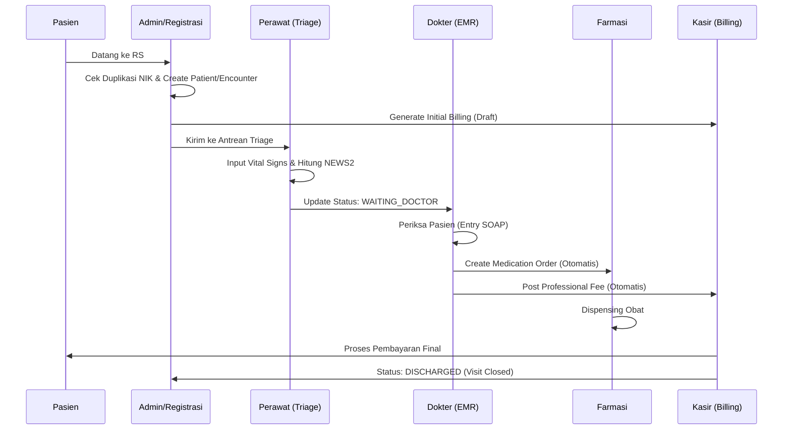
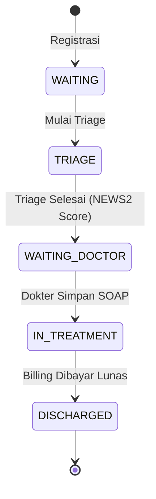

# 🏥 NURSEFLOW ENTERPRISE HIS 2026 - OPERATIONAL MANUAL
**V5.1 Spark-Safe | JCI International Standards Ready**

Manual ini dirancang untuk tenaga medis dan administrator rumah sakit sebagai panduan simulasi operasional nyata dalam ekosistem NurseFlow.

---

## 🏛️ 1. Filosofi Sistem & Standar JCI
NurseFlow 2026 bukan sekadar aplikasi pencatatan, melainkan instrumen penegakan standar **Joint Commission International (JCI)** dengan fokus pada:
1. **International Patient Safety Goals (IPSG):** Identifikasi pasien yang benar via MRN & NIK.
2. **Auditability:** Setiap perubahan data klinis dicatat dalam audit log immutable.
3. **Traceability:** Tindakan medis dan biaya tagihan terhubung secara langsung.

---

## 🔄 2. Diagram Alur Kerja (Workstream Visualization)

### A. End-to-End Patient Journey

### B. State Transition Encounter (Lifecycle Pasien)

---

## 📑 3. Simulasi Workflow Detil (Standard Operating Procedure)

### Tahap 1: Registrasi & Admisi (The Entry Gate)
*   **Aksi:** Admin menginput data pasien.
*   **Behavior Sistem:**
    *   Sistem melakukan deteksi duplikasi NIK.
    *   Generate **MRN (Medical Record Number)** unik.
    *   Membuka **Encounter (Kunjungan)** baru.
    *   **Financial Trigger:** Sistem membuat dokumen Billing status `DRAFT` dengan biaya administrasi awal.
*   **JCI Standard:** Identifikasi pasien tunggal (Single Patient Identity).

### Tahap 2: Triage Klinis (The Safety Valve)
*   **Aksi:** Perawat melakukan assessment vital signs.
*   **Behavior Sistem:**
    *   Server menghitung **NEWS2 Score** secara otomatis.
    *   Jika skor kritis, sistem memicu **Escalation Alert** ke seluruh tim medis.
    *   Status Encounter berubah menjadi `TRIAGE` (Siap diperiksa Dokter).
*   **JCI Standard:** Prioritasi pasien berdasarkan urgensi klinis (Bukan urutan kedatangan).

### Tahap 3: Konsultasi & EMR (The Medical Core)
*   **Aksi:** Dokter memeriksa pasien dan mengisi form **SOAP (Subjective, Objective, Assessment, Plan)**.
*   **Behavior Sistem:**
    *   Sistem menarik data vital signs dari Triage ke layar Dokter (No re-entry).
    *   Saat SOAP disimpan, sistem melakukan *multi-action*:
        1.  Kirim resep digital ke modul Farmasi.
        2.  Tambahkan komponen biaya jasa dokter ke Billing.
        3.  Update status ke `IN_TREATMENT`.
*   **JCI Standard:** Rekam medis terintegrasi dan terdokumentasi secara lengkap.

### Tahap 4: Farmasi & Penyiapan Obat (Order Fulfillment)
*   **Aksi:** Apoteker memverifikasi dan menyiapkan obat.
*   **Behavior Sistem:**
    *   Status obat berubah dari `PENDING` -> `DISPENSED`.
    *   Sistem mencatat siapa yang menyiapkan dan jam berapa obat diberikan.

### Tahap 5: Kasir & Kepulangan Pasien (Discharge Process)
*   **Aksi:** Kasir menerima pembayaran dari pasien.
*   **Behavior Sistem:**
    *   Kasir hanya memvalidasi tagihan yang sudah ter-itemisasi otomatis oleh sistem.
    *   **Atomic Event:** Begitu status pembayaran berubah menjadi `PAID`, sistem secara otomatis menutup Encounter tersebut (`DISCHARGED`).
    *   Pasien dihapus dari Worklist aktif.
*   **JCI Standard:** Transparansi biaya dan penutupan rekam medis yang tepat waktu.

---

## 🛡️ 4. Keamanan & Integritas Data
*   **Audit Trail:** Setiap tindakan (view, create, update) dicatat dengan metadata `siapa`, `kapan`, dan `alamat IP`.
*   **Role-Based Access:** Perawat tidak bisa mengisi SOAP Dokter; Apoteker hanya bisa melihat data resep dan profil pasien terbatas.
*   **Zero-Trust Backend:** Validasi klinis (skoring) dilakukan di sisi server (Cloud Functions), menghindari manipulasi data di sisi browser.

---
*Manual ini adalah dokumen hidup dan harus diperbarui setiap kali ada perubahan versi skema sistem.*
