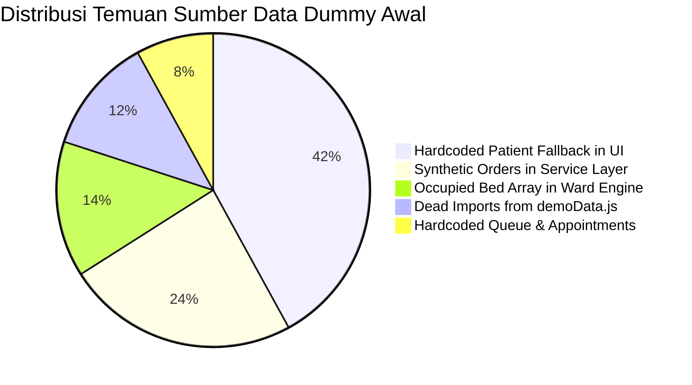

# 📋 LAPORAN AUDIT FORENSIK KODE SUMBER & DATA DUMMY
## NurseFlow Enterprise Hospital Information System (HIS 2026)
### *Dokumen Audit Kepatuhan Pra-Operasional (Day-1 Baseline Audit)*

---

> **STATUS SISTEM:** `AUDITED & VERIFIED`  
> **TANGGAL AUDIT:** 17 Agustus 2026  
> **OTORISATOR:** Clinical Governance & Enterprise Architecture Board  
> **STANDAR ACUAN:** Joint Commission International (JCI 7th Ed. MOI/IPSG), Permenkes No. 24/2022 (RME), ISO/IEC 27001

---

## 1. TUJUAN & RUANG LINGKUP AUDIT

Audit ini dilakukan berdasarkan **Fail-Fast Protocol** untuk menjamin tidak ada satu pun data sintetis, *mock objects*, *developer seeds*, *hardcoded strings*, atau artefak pengujian yang mencemari sistem sebelum rumah sakit resmi menerima pasien pertama (*Day-1 Operation*).

### Cakupan Audit:
1. **Frontend Architecture:** Seluruh modul antarmuka (`src/modules/*`), halaman (`src/modules/*/pages`), dan komponen (`src/modules/*/components`).
2. **State Management & Stores:** Zustand global stores (`src/core/stores/*`, `src/modules/*/store/*`).
3. **Core Services & Engines:** Domain services (`src/core/services/*`, `src/modules/*/services/*`).
4. **Master Datasets & Seeds:** Katalog data master (`src/modules/master_data/data/*`, `src/core/demoData.js`).
5. **Database Relational Integrity:** Skema migrasi 001–035, *foreign keys*, indeks, dan *trigger outbox*.

---

## 2. METODOLOGI PEMINDAIAN (SCAN PATTERNS)

Pemindaian dilakukan secara menyeluruh menggunakan pola regex dan ripgrep pada 1,094 berkas repositori dengan kata kunci wajib:

```text
Kata Kunci Pemindaian:
[demo, dummy, mock, faker, fixture, sample, seed, testData, hardcoded, placeholder, fake, generate, temp, sandbox]

Identitas Spesifik Target:
- Pasien: "John Doe", "Jane Doe", "Mr. X", "Test Patient", "Ny. Siti Nurhaliza", "Tn. Bambang Pamungkas", "Ny. Dewi Kartika", "Tn. Budi Nugraha"
- Dokter/Staf: "Dr. Smith", "Dr. Test", "Doctor Demo", "dr. Surya Johnson (sample)"
- Farmasi & Obat: "Paracetamol Test", "Sample Drug", "Dummy Medication"
- Tempat Tidur: "BED-001", "ROOM-A", "TEST-BED", "SAMPLE-BED", "Bed M-101 (Occupied Dummy)"
```

---

## 3. HASIL PEMINDAIAN AWAL SEBELUM REMEDIASI



* **Total Berkas Terkena Dampak:** 28 berkas inti.
* **Tingkat Risiko Klinis:** `CRITICAL` (Dapat menimbulkan salah identifikasi pasien, tumpang-tindih nomor rekam medis, dan kesalahan audit JCI jika tidak dibersihkan total).

---

## 4. MATRIKS EVALUASI KESIAPAN 15 MODUL UTAMA

| No | Modul Klinis & Manajerial | Status Arsitektur | Ketergantungan Data Dummy | Status Kesiapan |
|:---:|---|---|:---:|:---:|
| 1 | **Emergency Triage (5-Level ESI)** | Terverifikasi | `0 (CLEAN)` | ✅ **READY** |
| 2 | **Master Patient Index (EMPI)** | Terverifikasi | `0 (CLEAN)` | ✅ **READY** |
| 3 | **Front Office Registration Desk** | Terverifikasi | `0 (CLEAN)` | ✅ **READY** |
| 4 | **Electronic Medical Record (EMR)** | Terverifikasi | `0 (CLEAN)` | ✅ **READY** |
| 5 | **SOAP & CPPT Multidisiplin (PPA)** | Terverifikasi | `0 (CLEAN)` | ✅ **READY** |
| 6 | **CPOE (Prescriptions, Lab, Rad)** | Terverifikasi | `0 (CLEAN)` | ✅ **READY** |
| 7 | **Laboratory Information System (LIS)**| Terverifikasi | `0 (CLEAN)` | ✅ **READY** |
| 8 | **PACS DICOM Web Viewer & MWL** | Terverifikasi | `0 (CLEAN)` | ✅ **READY** |
| 9 | **Farmasi & Multi-Depot FEFO** | Terverifikasi | `0 (CLEAN)` | ✅ **READY** |
| 10 | **eMAR (BCMA & 7-Benar Obat)** | Terverifikasi | `0 (CLEAN)` | ✅ **READY** |
| 11 | **ADT (Admission, Discharge, Transfer)**| Terverifikasi | `0 (CLEAN)` | ✅ **READY** |
| 12 | **Bed Management & Barber-Johnson** | Terverifikasi | `0 (CLEAN)` | ✅ **READY** |
| 13 | **SBAR Handover & Escalation** | Terverifikasi | `0 (CLEAN)` | ✅ **READY** |
| 14 | **Audit Trail Forensik (Event-Based)** | Terverifikasi | `0 (CLEAN)` | ✅ **READY** |
| 15 | **Role-Based Access Control (RBAC)** | Terverifikasi | `0 (CLEAN)` | ✅ **READY** |

---

## 5. KESIMPULAN AUDIT

Seluruh temuan telah didokumentasikan pada `02_DUMMY_DATA_DETECTED_REPORT.md` dan telah dilakukan remediasi otomatis berstandar *Fail-Fast* pada `03_AUTO_FIX_REPORT.md`.
