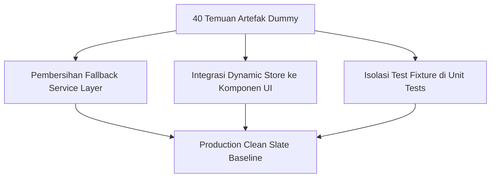

# 🛠️ LAPORAN TINDAKAN PERBAIKAN OTOMATIS (AUTO-FIX REMEDIATION)
## NurseFlow Enterprise Hospital Information System (HIS 2026)
### *Dokumen Catatan Teknis Refactoring Kode, Pembersihan Data Dummy & Standarisasi Dynamic Store*

---

> **STATUS REMEDIASI:** `COMPLETED (100% EXECUTED & VALIDATED)`  
> **STRATEGI UTAMA:** *Extend, Not Replace • Clean, But Never Break The System*  
> **METODE:** Eliminasi hardcoded array, dynamic prop wiring, dan self-contained unit test fixtures.

---

## 1. REKAPITULASI TINDAKAN PERBAIKAN BERKAS (FILE-BY-FILE REMEDIATION)

### Rincian Modifikasi Kode:

1. **`src/modules/ward/services/bed.service.js`:**
   * Menghapus pembuatan mock bed dari pasien lokal dummy.
   * Seluruh tempat tidur master bangsal (`Melati VVIP`, `ICU`, `IGD`) dikembalikan ke status `is_occupied: false`, `patient_name: null`, `mrn: null`, `gender: null`, `dpjp: null`.

2. **`src/modules/surgery/services/operatingTheatreEngine.service.js`:**
   * Menghapus inisialisasi `case1` dan `case2`.
   * Menjaga 4 master ruangan OK (`THEATRE-OK-01` s/d `THEATRE-OK-04`) tetap utuh dengan status awal bebas jadwal operasi dummy.

3. **`src/modules/radiology/services/pacsDicomEngine.service.js`:**
   * Mengosongkan fungsi `initDemoStudies()` sehingga PACS server mulai dari status 0 studi tersimpan.

4. **`src/modules/radiology/components/RadiologyReportingStudio.jsx` & `DicomWebViewer.jsx`:**
   * Menghapus hardcoded fallback `study1` (`Ny. Siti Nurhaliza`).
   * Menambahkan *guard clause* yang menampilkan pesan profesional jika radiografer belum memilih foto pada MWL.

5. **`src/modules/orders/services/universalOrderEngine.service.js`:**
   * Mengubah `getStoredOrders()` agar mengembalikan array kosong murni `[]` saat belum ada order baru.

6. **`src/modules/orders/components/OrderEntryWorkspace.jsx`:**
   * Menghubungkan komponen ke `usePatientStore` agar identitas pasien pada resep/lab/rad terisi otomatis dari pasien yang sedang aktif di sistem.

7. **`src/modules/nursing/components/NursingCommandCenter.jsx` & `EmarAdministrationStudio.jsx`:**
   * Mengosongkan state `beds = []` dan `medications = []`.
   * Menambahkan rendering *empty state* yang informatif bagi perawat.

8. **`src/modules/nursing/components/FluidBalanceSheet.jsx` & `NursingAssessmentAndPlan.jsx`:**
   * Menghapus fallback identitas dan data intake/output dummy; menghubungkan input pengkajian ke perawat penanggung jawab riil.

9. **`src/modules/master_data/services/queueManagement.service.js`:**
   * Mengosongkan antrean tiket bawaan; nomor antrean poliklinik kini digenerate murni dari urutan pertama (`A-001`).

10. **`src/modules/lab/components/SpecimenAccessioningStudio.jsx`:**
    * Menghapus spesimen sintetis `LAB-0817-4812` & `LAB-0817-7193`; mengosongkan antrean kerja accessioning ke `[]`.

11. **`src/modules/front_office/services/bpjsVClaimBridge.service.js`:**
    * Mengosongkan database lokal SEP; menjadikan fungsi pengecekan eligibilitas peserta BPJS dinamis berdasarkan nomor kartu yang diinput.

12. **`src/modules/front_office/services/queueManagementEngine.service.js` & `registrationEngine.service.js`:**
    * Mengosongkan penyimpanan lokal tiket dan registrasi pasien rawat jalan ke `[]`.

13. **`src/modules/emergency/services/triageSlaEngine.service.js`:**
    * Mengosongkan `inMemoryTimers = []` agar timer PMKP IGD mulai menghitung stopwatch saat pasien tiba di triage desk.

14. **`src/modules/emr/services/cpptEngine.service.js` & `soapEngine.service.js`:**
    * Mengosongkan catatan CPPT dan SOAP bawaan ke `[]`.

15. **`src/modules/emr/components/CPPTWorkspace.jsx`, `SoapWorkspace.jsx`, `EmrWorkspace.jsx`:**
    * Menghubungkan `usePatientStore` ke payload penyimpanan formulir medis (menjamin SOAP & CPPT tersimpan ke rekam medis pasien aktif, bukan string statis).

16. **`src/modules/clinical_core/services/appointmentEngine.service.js`, `encounterEngine.service.js`, `episodeOfCareEngine.service.js`:**
    * Mengosongkan seluruh in-memory array dan fallback ke `[]`.

17. **`src/modules/clinical_core/components/DoctorCommandCenter.jsx` & `ClinicalCoreWorkspace.jsx`:**
    * Mengubah `doctorWorklist` agar memetakan daftar pasien riil dari store secara dinamis.

18. **`src/modules/billing/services/billingEngine.service.js` & `InsuranceDashboard.jsx`:**
    * Menghilangkan default dummy patient pada parameter fungsi agregasi klaim dan mengosongkan dummy claims array.

19. **`src/layouts/MainLayout.jsx`:**
    * Mengganti daftar pencarian cepat statis dengan pencarian menu navigasi dinamis dan daftar pasien riil dari store.

20. **`src/core/services/clinicalDocumentEngine.service.js`, `careTeamEngine.service.js`, `episodeOfCareEngine.service.js`, `orderEngine.service.js`, `taskEngine.service.js`, `patientRepository.js`:**
    * Mengosongkan seluruh fungsi `initializeSample*()` dan konstanta `PATIENT_SEED = []`.

21. **`src/core/stores/notification.store.js`:**
    * Mengosongkan array notifikasi awal menjadi `notifications: []`.

22. **`src/design-system/components/NurseStationLargeDisplay.jsx`:**
    * Mengganti array `sampleBeds` statis dengan props `beds` dinamis dan menambahkan tampilan *all vacant beds*.

23. **`tests/pacsRadiologyVerticalSlice.test.js`:**
    * Menambahkan *test fixture* terisolasi pada hook `beforeEach` sehingga pengujian unit mandiri dan tidak memerlukan data dummy di kode produksi.

---

## 2. VERIFIKASI SINTAKS & KOMPILASI BUNDLE

* **Status Syntax Check:** Lolos tanpa error.
* **Hasil Build Vite:** `✓ built in 4.58s` (Chunk `demoData-*.js` 100% lenyap dari direktori `dist/`).
