# ⚙️ MASTER DATA CONFIGURATION & ENTERPRISE CODE REGISTRY
## NurseFlow Enterprise Hospital Information System (HIS 2026)
### *Konfigurasi Master Fasilitas, Tempat Tidur, Organisasi Klinis, Master Peran & Katalog Terminologi Medis Internasional*

---

> **DOKUMEN SPESIFIKASI MASTER DATA OPERASIONAL**  
> **Rumah Sakit:** RSUP Nasional / Primaya Hospital Group  
> **Standar Integrasi:** Kemenkes SATUSEHAT FHIR R4, WHO ICD-10, ICD-9-CM, LOINC, SNOMED-CT, RxNorm/KFA  
> **Status:** `ACTIVE PRODUCTION MASTER`

---

## 1. STRUKTUR MASTER UNIT & DEPARTEMEN RUMAH SAKIT

Master unit pelayanan dikelompokkan secara hierarkis sesuai standar organisasi rumah sakit umum kelas A/B:

```mermaid
graph TD
    RS[Rumah Sakit Umum Pusat]
    
    RS --> IGD[1. Instalasi Gawat Darurat]
    RS --> RAJAL[2. Instalasi Rawat Jalan]
    RS --> RANAP[3. Instalasi Rawat Inap]
    RS --> KRITIS[4. Intensive & Critical Care]
    RS --> BEDAH[5. Kamar Bedah Sentral IBS]
    RS --> DIAG[6. Layanan Diagnostik Terpadu]
    RS --> PENUNJANG[7. Farmasi & Penunjang Medis]
    RS --> ADM[8. Admisi & Manajemen Rekam Medis]

    IGD --> IGD_TRI[Triase & Intake]
    IGD --> IGD_RES[Zona Resusitasi]
    IGD --> IGD_AKUT[Zona Akut / Trauma]
    IGD --> IGD_OBS[Zona Observasi / Fast Track]

    RANAP --> MAWAR[Bangsal Mawar - Medikal Dewasa]
    RANAP --> MELATI[Bangsal Melati - Bedah Dewasa]
    RANAP --> ANGGREK[Bangsal Anggrek - Pediatrik & Obgyn]

    KRITIS --> ICU[ICU Dewasa]
    KRITIS --> HCU[HCU Step-down]
    KRITIS --> NICU[NICU / PICU]

    DIAG --> LAB[Laboratorium Patologi Klinik / LIS]
    DIAG --> RAD[Radiologi & Imejing / PACS]
    DIAG --> BDRS[Bank Darah Rumah Sakit]

    PENUNJANG --> FAR_IGD[Depot Farmasi IGD 24 Jam]
    PENUNJANG --> FAR_RANAP[Depot Farmasi Rawat Inap]
    PENUNJANG --> FAR_INDUK[Gudang Logistik Farmasi Induk]
```



---

## 2. STRUKTUR MASTER TEMPAT TIDUR (BED REGISTRY MATRIX)

### 2.1 Instalasi Gawat Darurat (Kapasitas: 9 Tempat Tidur)
| Kode Bed | Nama Ruangan / Zona | Kategori Pelayanan | Tipe Monitoring | Status Default |
|---|---|---|---|:---:|
| `RES-01` | Ruang Resusitasi 1 | Kritis / Cito (ESI 1) | Multi-Parameter + Defibrillator + Ventilator | **VACANT** |
| `RES-02` | Ruang Resusitasi 2 | Kritis / Cito (ESI 1) | Multi-Parameter + Ventilator | **VACANT** |
| `A-01` | Zona Akut Bed 1 | Akut / Emergent (ESI 2) | NIBP, SpO2, EKG Telemetri | **VACANT** |
| `A-02` | Zona Akut Bed 2 | Akut / Emergent (ESI 2) | NIBP, SpO2, EKG Telemetri | **VACANT** |
| `A-03` | Zona Akut Bed 3 | Akut / Urgent (ESI 3) | NIBP, SpO2 | **VACANT** |
| `A-04` | Zona Akut Bed 4 | Akut / Urgent (ESI 3) | NIBP, SpO2 | **VACANT** |
| `OBS-01`| Zona Observasi 1 | Observasi / Urgent (ESI 3)| Bed Monitoring Berkala | **VACANT** |
| `OBS-02`| Zona Observasi 2 | Observasi / Urgent (ESI 3)| Bed Monitoring Berkala | **VACANT** |
| `ISO-01`| Ruang Isolasi Tekanan Negatif | Airborne / Infeksius | Hepa-Filter + Monitoring Sentral | **VACANT** |

### 2.2 Instalasi Rawat Inap (Bangsal Mawar - Medikal Dewasa)
| Kode Bed | Kamar | Kelas Perawatan | Fasilitas Penunjang | Status Default |
|---|---|---|---|:---:|
| `MAWAR-301-A` | Kamar 301 | Kelas 1 (2 Bed/Kamar) | Oksigen Sentral, Suction, Nurse Call, TV | **VACANT** |
| `MAWAR-301-B` | Kamar 301 | Kelas 1 (2 Bed/Kamar) | Oksigen Sentral, Suction, Nurse Call, TV | **VACANT** |
| `MAWAR-302-A` | Kamar 302 | Kelas 1 (2 Bed/Kamar) | Oksigen Sentral, Suction, Nurse Call, TV | **VACANT** |
| `MAWAR-302-B` | Kamar 302 | Kelas 1 (2 Bed/Kamar) | Oksigen Sentral, Suction, Nurse Call, TV | **VACANT** |
| `MAWAR-303-VIP`| Kamar 303 | VIP (1 Bed/Kamar) | Electric Bed, O2, Sofa Bed, Kulkas, AC | **VACANT** |

---

## 3. MASTER PERAN PENGGUNA & MATRIKS OTORISASI (RBAC)

Setiap akun pengguna staf di dalam sistem NurseFlow wajib diasosiasikan dengan satu atau lebih peran terakreditasi:

```
[1] Perawat Triase (Triage Nurse)
    ├── Scope: IGD Intake, Triage Assessment, ESI Engine, Temporary Unknown Patient (Mr. X)
    └── Level Akses: R/W Triase & Vitals, Read-Only Rekam Medis

[2] Petugas Admisi & HIM (Registration & Medical Records)
    ├── Scope: Master EMPI Registry, Patient Identity, EMPI Merge Guard, BPJS V-Claim Bridge
    └── Level Akses: R/W Identitas & Penjamin, No Clinical Notes Access

[3] Dokter Jaga IGD & Dokter Penanggung Jawab Pelayanan (DPJP)
    ├── Scope: Clinical Core, CPPT SOAP, ICD-10 Coding, CPOE Diagnostics, SPRI Admission
    └── Level Akses: Full Clinical Read/Write, Electronic Signature Authority (BSrE)

[4] Analis Laboratorium (LIS Technician / Sp.PK)
    ├── Scope: Accessioning, Barcode Vacutainer, Auto-Analyzer Entry, Critical Value Notification
    └── Level Akses: Full LIS Order Processing, Read-Only Clinical Orders

[5] Radiografer & Dokter Spesialis Radiologi (PACS / Sp.Rad)
    ├── Scope: Modality Worklist (MWL), DICOM Storage, Web Viewer VOI LUT, Expertise Release
    └── Level Akses: Full PACS Processing, Read-Only Diagnostic Requisitions

[6] Apoteker Klinis & Tenaga Teknis Kefarmasian (Clinical Pharmacist)
    ├── Scope: E-Prescribing Review, 7-Principles Screening, Multi-Depot FEFO Dispensing
    └── Level Akses: Full Pharmacy Dispensing, CDSS Overrides, Drug Inventory Control

[7] Perawat Pelaksana Rawat Inap & IGD (Ward / Staff Nurse)
    ├── Scope: Nursing Assessment, Morse Fall Scale, eMAR Barcode Scanning, SBAR Handover
    └── Level Akses: Full Nursing Care Plans, eMAR Administration, Bed Status Update

[8] Administrator Sistem & Casemix Coder (System Admin / INA-CBG Coder)
    ├── Scope: Master Data Governance, User Privileging, Tariff Master, Forensic Audit Logs
    └── Level Akses: Super-User Administrative Control
```

---

## 4. MASTER KATALOG TERMINOLOGI MEDIS & INTEROPERABILITAS

Sistem mengintegrasikan katalog terminologi berstandar internasional yang terpetakan ke **Kemenkes SATUSEHAT FHIR R4**:

### 4.1 Master ICD-10 (Diagnosis Utama Acuan Skenario IGD)
* **`I63.9`** — *Cerebral infarction, unspecified (Stroke Non-Hemorrhagic Akut)*
* **`I61.9`** — *Nontraumatic intracerebral hemorrhage, unspecified (Stroke Hemoragik)*
* **`I10`** — *Essential (primary) hypertension (Krisis Hipertensi)*
* **`I21.9`** — *Acute myocardial infarction, unspecified (STEMI / NSTEMI)*
* **`A90`** — *Dengue fever [classical dengue] (Demam Dengue)*
* **`K35.8`** — *Acute appendicitis, other and unspecified (Apendisitis Akut)*

### 4.2 Master LOINC (Katalog Pemeriksaan Laboratorium Terpadu)
* **`57021-8`** — *CBC with Differential Panel (Darah Lengkap)*
* **`2345-7`** — *Glucose [Mass/volume] in Blood (Gula Darah Sewaktu)*
* **`49563-0`** — *Troponin I.cardiac [Mass/volume] in Serum or Plasma by High sensitivity method*
* **`5902-2`** — *Prothrombin time (PT) in Platelet poor plasma by Coagulation assay*
* **`3173-2`** — *aPTT in Platelet poor plasma by Coagulation assay*
* **`2951-2`** — *Sodium [Moles/volume] in Serum or Plasma*
* **`2823-3`** — *Potassium [Moles/volume] in Serum or Plasma*

### 4.3 Master KFA / RxNorm (Formularium Obat RS Acuan Skenario)
* **`KFA-93001041`** — *Citicoline Injeksi 500 mg/4 mL Ampul*
* **`KFA-93000854`** — *Ranitidine Injeksi 50 mg/2 mL Ampul*
* **`KFA-93000122`** — *Amlodipine Besilate Tablet 10 mg*
* **`KFA-93000411`** — *Clopidogrel Bisulfate Film-Coated Tablet 75 mg*
* **`KFA-91000001`** — *Natrium Klorida 0.9% Larutan Infus 500 mL Kolf*
* **`KFA-93002100`** — *Nicardipine Hydrochloride Injeksi 10 mg/10 mL Ampul (High-Alert)*
