# 🏥 DOKUMEN SIMULASI KLINIS OPERASIONAL GOLD STANDARD (52 TAHAP)
## NurseFlow Enterprise Hospital Information System (HIS 2026)
### *Standar Uji Validasi Klinis Terpadu: Polytrauma Gawat Darurat (Mr. X) ➔ ICU / IBS ➔ SATUSEHAT FHIR R4*

---

> **KLASIFIKASI DOKUMEN:** Gold Standard Clinical Simulation & Go-Live Validation Gate  
> **STANDAR KEPATUHAN:** Permenkes No. 24/2022 (RME), Permenkes No. 91/2015 (BDRS), JCI 7th Edition (IPSG 1–6, COP, MMU, AOP, FMS), Kemenkes SATUSEHAT HL7 FHIR R4, BPJS Kesehatan V-Claim 2.0  
> **SKENARIO KLINIS:** Pasien Laki-laki Tidak Dikenal (*Mr. X*) korban kecelakaan lalu lintas kecepatan tinggi (*high-speed polytrauma*). Penurunan kesadaran (GCS 8: E2V2M4), pupil anisokor (3mm/2mm), syok hemoragik grade III (TD 85/50 mmHg, HR 126 bpm, Laktat 5.4 mmol/L), fraktur terbuka/tertutup femur dextra, dan trauma kapitis sedang.  
> **REKONSILIASI IDENTITAS:** Direkonsiliasi menjadi **Tn. Hendra Setiawan, S.T** (NIK: `3171021405880003`, No. BPJS: `0001982736451`, No. RM: `MRN-2026-000001`).  
> **DISPOSISI AKHIR:** Resusitasi Trauma ➔ Cito CT-Scan & Fast USG ➔ Transfusi Darah BDRS ➔ Cito Damage Control Surgery (IBS) ➔ Alokasi Tempat Tidur **ICU (Intensive Care Unit)** ➔ Bridging BPJS V-Claim 2.0 ➔ Ekspor SATUSEHAT FHIR R4 Bundle.

---

## 🧭 Diagram Alur 10 Fase Operasional (52 Tahap End-to-End)

```mermaid
flowchart TD
    subgraph P1["FASE 1: Emergency Arrival & Rapid Triage (01-07)"]
        T1["01. Kedatangan Trauma 118"] --> T2["02. ABCDE Primary Survey"]
        T2 --> T3["03. Fast Intake Mr. X"]
        T3 --> T4["04. Temporary MRN (MRX-2026-0001)"]
        T4 --> T5["05. Kalkulasi ESI 1 (Life-Threatening)"]
        T5 --> T6["06. Pemasangan Gelang IPSG 1"]
        T6 --> T7["07. Safety Clips (Gelang Kuning & Merah)"]
    end

    subgraph P2["FASE 2: Registration & EMPI Reconciliation (08-10)"]
        T7 --> T8["08. Kedatangan Keluarga & e-KTP"]
        T8 --> T9["09. EMPI Query & Dukcapil Biometrik"]
        T9 --> T10["10. Merge Identity (MRX ➔ MRN-2026-000001)"]
    end

    subgraph P3["FASE 3: Clinical Assessment & Trauma Survey (11-14)"]
        T10 --> T11["11. Secondary Survey & GCS 8"]
        T11 --> T12["12. Skrining Alergi Obat (IPSG 3)"]
        T12 --> T13["13. CPPT / SOAP Dokter Trauma"]
        T13 --> T14["14. ICD-10 Koding (S06.2 & S72.0)"]
    end

    subgraph P4["FASE 4: Parallel Diagnostic CPOE Orders (15-19)"]
        T14 --> T15["15. CPOE Bundle Cito (Lab + Rad + BDRS)"]
        T15 --> T16["16. LIS Vacutainer Barcoding"]
        T16 --> T17["17. LIS Panic Value (Laktat 5.4 & Hb 7.8)"]
        T17 --> T18["18. FAST USG & CT Brain Lossless DICOM"]
        T18 --> T19["19. Ekspertise Sp.Rad SHA-256 E-Sign"]
    end

    subgraph P5["FASE 5: Blood Bank BDRS & Hemovigilance (20-25)"]
        T19 --> T20["20. Cito Blood Request (2 Bag PRC O+)"]
        T20 --> T21["21. Electronic Crossmatching"]
        T21 --> T22["22. Cold-Chain Custody Release (4°C)"]
        T22 --> T23["23. Bedside Dual Nurse Verification"]
        T23 --> T24["24. Inisiasi Transfusi & TTV Baseline"]
        T24 --> T25["25. Hemovigilance Monitoring (15 Menit)"]
    end

    subgraph P6["FASE 6: Pharmacy, ePrescribing & eMAR (26-30)"]
        T25 --> T26["26. CPOE E-Prescribing Analgetik & Anti-Tetanus"]
        T26 --> T27["27. CDSS Drug-Allergy Hard Stop Shield"]
        T27 --> T28["28. Skrining 7-Prinsip & FEFO Dispensing"]
        T28 --> T29["29. eMAR Administration (BCMA Scan)"]
        T29 --> T30["30. Dual-Sign Verifikasi High-Alert"]
    end

    subgraph P7["FASE 7: Operating Theatre & Emergency Surgery (31-36)"]
        T30 --> T31["31. Konsultasi Orthopedi & Anestesi Cito"]
        T31 --> T32["32. Emergency OR Booking (OK Trauma)"]
        T32 --> T33["33. Informed Consent Digital Bedah"]
        T33 --> T34["34. WHO Checklist Fase 1: Sign-In"]
        T34 --> T35["35. WHO Checklist Fase 2: Time-Out"]
        T35 --> T36["36. Tindakan ORIF/Ex-Fix & Sign-Out"]
    end

    subgraph P8["FASE 8: Critical Care ADT & ICU Bed Allocation (37-41)"]
        T36 --> T37["37. Evaluasi Aldrete PACU (Skor 8/10)"]
        T37 --> T38["38. SPRI Rawat Intensif ICU Terbit"]
        T38 --> T39["39. Critical Bed FSM: BED-ICU-01"]
        T39 --> T40["40. Bed FSM State: RESERVED ➔ OCCUPIED"]
        T40 --> T41["41. Ventilator & Central Oxygen Assignment"]
    end

    subgraph P9["FASE 9: ICU Inpatient Care & Monitoring (42-47)"]
        T41 --> T42["42. ISBAR Clinical Handover Digital"]
        T42 --> T43["43. Transfer Fisik ke Ruang ICU"]
        T43 --> T44["44. Penerimaan Pasien di ICU Dashboard"]
        T44 --> T45["45. Inisiasi Monitoring NEWS2 Kontinu"]
        T45 --> T46["46. Balans Cairan Ketat 24 Jam (+350ml)"]
        T46 --> T47["47. Care Plan Multidisiplin Terpadu"]
    end

    subgraph P10["FASE 10: Interoperability, BPJS, SATUSEHAT & Audit (48-52)"]
        T47 --> T48["48. BPJS V-Claim 2.0 SEP Generation"]
        T48 --> T49["49. INA-CBG Grouping Klaim Rawat Inap"]
        T49 --> T50["50. SATUSEHAT FHIR R4 Bundle Generation"]
        T50 --> T51["51. Sinkronisasi API Kemenkes DTO"]
        T51 --> T52["52. Immutable SHA-256 Audit Trail Seal"]
    end

    style P1 fill:#eff6ff,stroke:#3b82f6,stroke-width:2px;
    style P2 fill:#f0fdf4,stroke:#16a34a,stroke-width:2px;
    style P3 fill:#fefce8,stroke:#ca8a04,stroke-width:2px;
    style P4 fill:#faf5ff,stroke:#9333ea,stroke-width:2px;
    style P5 fill:#fff1f2,stroke:#e11d48,stroke-width:2px;
    style P6 fill:#f0fdfa,stroke:#0d9488,stroke-width:2px;
    style P7 fill:#fef2f2,stroke:#dc2626,stroke-width:2px;
    style P8 fill:#e0f2fe,stroke:#0284c7,stroke-width:2px;
    style P9 fill:#f8fafc,stroke:#475569,stroke-width:2px;
    style P10 fill:#f3e8ff,stroke:#7e22ce,stroke-width:2px;
```

---

## 📑 Rincian 52 Tahap Operasional Klinis (Detailed Specification)

### 🔹 FASE 1: EMERGENCY ARRIVAL & RAPID TRIAGE (TAHAP 01–07)

#### 01. Kedatangan Pasien Trauma 118 (Emergency Arrival)
* **Waktu:** 08:00:00 WIB | **Aktor:** Tim Ambulans 118 & Perawat Triase IGD
* **Kondisi:** Pasien laki-laki tidak sadar tiba di *Ambulance Bay* IGD. Langsung diarahkan ke Bed Resusitasi Trauma 01 (Zona Merah).

#### 02. Asesmen Primer ABCDE Cepat (Primary Survey)
* **Waktu:** 08:00:30 WIB | **Aktor:** Ns. Dewi, S.Kep (Perawat Triase)
* **Temuan ABCDE:**
  * **A (Airway):** Sumbatan parsial oleh darah/sekret ➔ Dilakukan *suctioning* & pasang OPA (*Oropharyngeal Airway*).
  * **B (Breathing):** RR 28x/menit, dangkal, SpO2 91% udara bebas ➔ Dipasang NRM 12 LPM (SpO2 meningkat ke 99%).
  * **C (Circulation):** TD 85/50 mmHg, HR 126 bpm (filiform), akral dingin, CRT 4 detik (Syok Hemoragik Grade III).
  * **D (Disability):** GCS 8 (E2V2M4 - Sopor), Pupil anisokor 3mm/2mm, refleks cahaya lambat (+/+).
  * **E (Exposure):** Deformitas paha kanan dengan krepitasi, hematoma temporal sinistra. Pasang selimut penghangat (*anti-hypothermia*).

#### 03. Pendaftaran Darurat Pasien Anonim (Mr. X Workflow)
* **Waktu:** 08:01:00 WIB | **Aktor:** Perawat Triase
* **Aksi Sistem:** Tombol `[+ Pasien Darurat Anonim (Mr. X)]` ditekan. Sistem meng-assign nama `Tn. Mr. X (Trauma IGD-01)` dengan jenis kelamin Laki-laki dan estimasi usia 35 tahun.

#### 04. Penerbitan Nomor RM Darurat (Temporary Emergency MRN)
* **Waktu:** 08:01:15 WIB | **Aksi Sistem:** `mpiEngineService.createEmergencyAnonymousPatient()`
* **Hasil:** Menerbitkan nomor rekam medis darurat `MRX-2026-0001` dan Encounter ID `ENC-20260817-0001`.

#### 05. Klasifikasi Triase ESI 1 (Emergency Severity Index)
* **Waktu:** 08:01:30 WIB | **Aksi Sistem:** `triageEngineService.classifySeverity()`
* **Hasil:** Ditetapkan **ESI Level 1 (Immediate / Life-Threatening)**. Timer PMKP aktif dengan target waktu respon dokter **0 Menit (Immediate Response)**.

#### 06. Pencetakan & Pemasangan Gelang Pasien (JCI IPSG 1)
* **Waktu:** 08:02:00 WIB | **Aktor:** Ns. Dewi, S.Kep
* **Tindakan:** Gelang identitas tahan air dicetak memuat Barcode 2D `MRX-2026-0001`, Nama `Tn. Mr. X`, Tanggal Masuk, dan dipasangkan pada pergelangan tangan kiri pasien.

#### 07. Pemasangan Klip Keselamatan (JCI IPSG 6 & IPSG 3)
* **Waktu:** 08:02:30 WIB | **Aktor:** Perawat Triase
* **Tindakan:** Memasangkan **Gelang Kuning (Risiko Jatuh Tinggi - Morse Scale 65)** dan **Gelang Merah (Riwayat Alergi Belum Diketahui / Penicillin Shield)**. Pasang pengaman tempat tidur (*bed rails*).

---

### 🔹 FASE 2: REGISTRATION & EMPI RECONCILIATION (TAHAP 08–10)

#### 08. Kedatangan Keluarga Pasien & Penyerahan e-KTP
* **Waktu:** 08:12:00 WIB | **Aktor:** Petugas Loket Admisi IGD & Keluarga Pasien
* **Tindakan:** Istri pasien tiba membawa e-KTP asli pasien:
  * **Nama Lengkap:** Tn. Hendra Setiawan, S.T
  * **NIK:** `3171021405880003`
  * **Tanggal Lahir:** 14 Mei 1988
  * **No. BPJS Kesehatan:** `0001982736451`

#### 09. Verifikasi Master Patient Index (EMPI & Dukcapil)
* **Waktu:** 08:13:00 WIB | **Aksi Sistem:** `empiEngineService.findDuplicateOrMergeCandidate()`
* **Hasil:** Verifikasi NIK via API Gateway Dukcapil / Master EMPI mengonfirmasi identitas tunggal pasien.

#### 10. Rekonsiliasi Identitas & Penggabungan Berkas (Merge Identity)
* **Waktu:** 08:14:00 WIB | **Aksi Sistem:** `patientRepository.reconcileAnonymousPatient()`
* **Hasil:** Identitas `MRX-2026-0001` digabungkan secara atomik ke Nomor RM Master definitif: `MRN-2026-000001`. Seluruh catatan triase, tanda vital awal, dan log tindakan sebelumnya tetap utuh (*zero data loss*). Gelang pasien baru dicetak ulang.

---

### 🔹 FASE 3: CLINICAL ASSESSMENT & TRAUMA SURVEY (TAHAP 11–14)

#### 11. Secondary Survey & Asesmen Medis Trauma
* **Waktu:** 08:16:00 WIB | **Aktor:** dr. Budi Santoso, Sp.B (Dokter Trauma DPJP)
* **Temuan:** Head-to-toe examination menemukan pupil anisokor 3mm/2mm, fraktur tertutup shaft femur dextra 1/3 tengah dengan pemendekan tungkai 2 cm, distensi abdomen minimal.

#### 12. Skrining Riwayat Alergi Obat (JCI IPSG 3)
* **Waktu:** 08:17:00 WIB | **Aktor:** dr. Budi Santoso, Sp.B & Keluarga
* **Hasil:** Istri pasien menyatakan pasien memiliki **alergi berat terhadap golongan Penisilin/Amoxicillin (riwayat sesak napas & syok)**. Data langsung dicatat ke `allergyEngineService`.

#### 13. Dokumentasi CPPT / SOAP Medis Awal
* **Waktu:** 08:18:00 WIB | **Aktor:** dr. Budi Santoso, Sp.B
* **Aksi Sistem:** `soapEngineService.recordSoapNote()` mencatat:
  * **S (Subjective):** Alloanamnesis: Pasien tertabrak truk saat mengendarai motor 45 menit lalu. Tidak sadar sejak kejadian.
  * **O (Objective):** GCS 8 (E2V2M4), TD 85/50, HR 126, RR 28, SpO2 99% NRM. Anisokor 3mm/2mm. Deformitas femur dextra (+).
  * **A (Assessment):** 1. Moderate Traumatic Brain Injury (TBI) susp. Epidural/Subdural Hematoma, 2. Closed Fracture Shaft Femur Dextra, 3. Hemorrhagic Shock Grade III.
  * **P (Plan):** Resusitasi kristaloid 2000ml RL hangat, Cito Lab DL + Laktat + Crossmatch 2 Bag PRC, Cito Non-Contrast CT Brain, FAST USG Abdomen, Foto Femur Dextra, Konsul Orthopedi & Bedah Saraf Cito, Booking OK Cito, Rencana Masuk **ICU**.

#### 14. Penetapan Koding Diagnosis Primer ICD-10
* **Waktu:** 08:19:00 WIB | **Aksi Sistem:** `diagnosisEngineService.recordDiagnosis()`
* **Hasil:** ICD-10 Primer: **S06.2X0A** (*Diffuse traumatic brain injury*) & Sekunder: **S72.301A** (*Closed fracture of shaft of right femur*), **R57.1** (*Hypovolemic shock*).

---

### 🔹 FASE 4: PARALLEL DIAGNOSTIC CPOE ORDERS (TAHAP 15–19)

#### 15. Penerbitan Paket CPOE Cito Multidisiplin (Parallel Order Entry)
* **Waktu:** 08:20:00 WIB | **Aktor:** dr. Budi Santoso, Sp.B
* **Aksi Sistem:** `universalOrderEngineService.createOrder()` menerbitkan secara paralel:
  1. Order Laboratorium Cito (Darah Lengkap, Analisa Gas Darah, Laktat, Koagulasi PT/APTT).
  2. Order Radiologi Cito (Non-Contrast Head CT-Scan, FAST Ultrasound, Foto Femur Dextra AP/Lat).
  3. Order Bank Darah BDRS Cito (Uji Silang Serasi / Crossmatch 2 Unit Packed Red Cells O+).

#### 16. Pengambilan Sampel Flebotomi & Barcode Vacutainer
* **Waktu:** 08:22:00 WIB | **Aktor:** Analis Rina, A.Md.AK (Analis LIS)
* **Tindakan:** Pengambilan darah vena 2 jalur dengan tabung K2-EDTA (Ungu) dan Citrate (Biru). Barcode `LAB-0817-5501` ditempel pada tabung di sisi tempat tidur (*positive bedside labeling*).

#### 17. Deteksi & Eskalasi Nilai Kritis Laboratorium (JCI IPSG 2)
* **Waktu:** 08:30:00 WIB | **Aksi Sistem:** `lisPacsEngineService.enterAndValidateResult()`
* **Temuan Kritis (Panic Values):**
  * **Hemoglobin:** 7.8 g/dL (Rendah - Kritis)
  * **Laktat Darah:** **5.4 mmol/L** (Kritis Tinggi - Ancaman Syok Hipovolemik / Asidosis Laktat Berat)
  * **Leukosit:** 17.800 /uL
* **Protokol Read-Back:** Analis LIS menelepon DPJP IGD dalam 3.5 menit. DPJP melakukan konfirmasi pembacaan ulang (*read-back verification signed*).

#### 18. Pemeriksaan FAST USG & CT-Scan Kepala (Lossless DICOM STOW-RS)
* **Waktu:** 08:35:00 WIB | **Aktor:** Radiografer Agus, S.Tr.Rad & Tim Trauma
* **Tindakan:** Pasien ditransfer dengan monitor transport ke CT-Scan IGD. 64-Slice Head CT & X-Ray Femur diakuisisi secara cepat. 48 frame citra DICOM lossless diunggah otomatis ke server PACS via protokol STOW-RS.

#### 19. Ekspertise Radiologi Sp.Rad & Tanda Tangan Digital SHA-256
* **Waktu:** 08:42:00 WIB | **Aktor:** dr. Hendro Prasetyo, Sp.Rad(K)
* **Temuan Radiologi:**
  * **CT Brain:** Tampak lesi hiperdens bikonveks ekstra-aksial pada regio temporoparietal sinistra berukuran tebal 8 mm dengan midline shift 3 mm (Sesuai *Epidural Hematoma Akut*).
  * **X-Ray Femur:** Fraktur transversal komplit 1/3 tengah shaft femur dextra dengan displacement ad latus dan ad longitudinam.
* **Tanda Tangan Digital:** Diverifikasi dengan sertifikat elektronik (SHA-256 Hash Digest tersemat pada EMR).

---

### 🔹 FASE 5: BLOOD BANK (BDRS) & HEMOVIGILANCE (TAHAP 20–25)

#### 20. Permintaan Darah Transfusi Darurat (Cito Blood Request)
* **Waktu:** 08:43:00 WIB | **Aktor:** dr. Budi Santoso, Sp.B
* **Tindakan:** Menerbitkan formulir permintaan darah elektronik 2 Unit PRC Golongan O Rhesus Positif dengan derajat urgensi **CITO (Life-Saving Emergency)**.

#### 21. Uji Silang Serasi Elektronik (Digital Crossmatching Test)
* **Waktu:** 08:48:00 WIB | **Aktor:** Petugas BDRS Ahmad, A.Md.AK
* **Aksi Sistem:** `bloodBankService.performCrossmatchTest()`
* **Hasil:** Unit Kantong Darah `#UTD-O-88219A` dan `#UTD-O-88219B` dinyatakan **KOMPATIBEL (Mayor: Negatif, Minor: Negatif, Auto-Control: Negatif)**.

#### 22. Pengeluaran Darah Rantai Dingin Terpantau (Cold-Chain Custody Release)
* **Waktu:** 08:52:00 WIB | **Aksi Sistem:** `bloodBankService.logStorageTemperature()`
* **Verifikasi:** Suhu transport coolbox tercatat 3.8°C (Standar 2°C–6°C). Berita acara serah terima darah elektronik diterbitkan.

#### 23. Verifikasi Ganda Transfusi di Sisi Pasien (Bedside Dual Verification)
* **Waktu:** 08:55:00 WIB | **Aktor:** Ns. Ratna Sari & Ns. Maya Dewi (Perawat Saksi)
* **Tindakan:** Melakukan pencocokan independen (*Dual Independent Check*) antara barcode kantong darah, formulir BDRS, dan barcode gelang pasien `MRN-2026-000001` (Golongan O+, Nomor Kantong, Tanggal Kedaluwarsa).

#### 24. Inisiasi Transfusi Darah & Pengukuran TTV Baseline
* **Waktu:** 08:57:00 WIB | **Aktor:** Ns. Ratna Sari, S.Kep
* **Tindakan:** Jalur IV infus transfusi dibuka dengan kecepatan awal 2 ml/menit menggunakan *blood transfusion set with microfilter*. TTV Baseline: TD 90/55, HR 118, Suhu 36.8°C.

#### 25. Monitoring Reaksi Transfusi Hemovigilans (15-Minute Safety Window)
* **Waktu:** 09:12:00 WIB | **Aksi Sistem:** `bloodBankService.logTransfusionMonitoring()`
* **Hasil:** Observasi 15 menit pertama: Tidak ada tanda reaksi anafilaktoid, urtikaria, menggigil, atau demam (Suhu 37.0°C, TD 100/65, HR 104). Transfusi dilanjutkan lancar.

---

### 🔹 FASE 6: PHARMACY, ePRESCRIBING & eMAR (TAHAP 26–30)

#### 26. Peresepan Elektronik CPOE (E-Prescribing)
* **Waktu:** 09:14:00 WIB | **Aktor:** dr. Budi Santoso, Sp.B
* **Resep:** 1. Ceftriaxone 2g IV (profilaksis bedah non-penisilin aman), 2. Ketorolac 30mg IV, 3. ATS (*Anti-Tetanus Serum*) 1500 IU IM, 4. Manitol 20% 200ml IV drip cepat (terapi edema serebri TBI).

#### 27. Proteksi Intersepsi Alergi Silang (CDSS Hard Stop Shield)
* **Waktu:** 09:14:30 WIB | **Aksi Sistem:** `cdssEngineService.evaluatePrescriptionSafeguards()`
* **Verifikasi:** Sistem memverifikasi tidak ada turunan Penisilin. Apabila dokter mencoba meresepkan Ampisilin, CDSS otomatis memblokir peresepan (*Hard Stop Barrier*).

#### 28. Telaah 7-Prinsip Farmasi Klinis & Dispensing FEFO
* **Waktu:** 09:18:00 WIB | **Aktor:** Apt. Fajar Shodiq, S.Farm
* **Tindakan:** Modul `PharmacyDispensingStudio.jsx` memvalidasi ketepatan dosis, rute, duplikasi, dan stabilitas obat. Stok obat dikeluarkan secara otomatis berdasarkan prinsip **FEFO (*First Expired, First Out*)**.

#### 29. Administrasi Obat eMAR Berbasis Pemindaian Barcode (BCMA)
* **Waktu:** 09:22:00 WIB | **Aktor:** Ns. Ratna Sari, S.Kep
* **Tindakan:** Perawat memindai barcode gelang pasien dan barcode 2D vial obat Ceftriaxone & Manitol menggunakan *handheld scanner*. Sistem memvalidasi 5-Benar (*Right Patient, Right Drug, Right Dose, Right Route, Right Time*).

#### 30. Verifikasi Tanda Tangan Ganda Obat High-Alert (Dual-Sign E-Signature)
* **Waktu:** 09:24:00 WIB | **Aktor:** Ns. Ratna Sari & Ns. Maya Dewi
* **Tindakan:** Untuk cairan hiperosmolar (Manitol 20%) dan analgetik parenteral, kedua perawat menginput PIN otentikasi ganda pada modul `eMARService` sesuai standar JCI IPSG 3.

---

### 🔹 FASE 7: OPERATING THEATRE & EMERGENCY SURGERY (TAHAP 31–36)

#### 31. Konsultasi Cito Orthopedi & Asesmen Pre-Anestesi
* **Waktu:** 09:26:00 WIB | **Aktor:** dr. Suryo Wibowo, Sp.OT & dr. Erwin Halim, Sp.An-TI
* **Hasil:** Status Fisik ASA 4E (*Emergency Polytrauma*). Keputusan: Tindakan *Damage Control Orthopedics* (Pemasangan Spalk Traksi Skeletal / External Fixation Cito) bersamaan dengan monitoring TIK Bedah Saraf.

#### 32. Penjadwalan Kamar Bedah Darurat (Emergency OR Booking)
* **Waktu:** 09:28:00 WIB | **Aksi Sistem:** `operatingTheatreEngineService.scheduleSurgicalCase()`
* **Hasil:** Mengunci jadwal Kamar Operasi Cito **OK-01 (Trauma Suite)** dengan status `SCHEDULED_EMERGENCY`.

#### 33. Penandatanganan Digital Informed Consent Bedah & Anestesi
* **Waktu:** 09:30:00 WIB | **Aktor:** dr. Suryo Wibowo, Sp.OT & Istri Pasien
* **Tindakan:** Edukasi risiko tindakan bedah dan pembiusan darurat. Istri pasien menandatangani *digital informed consent* pada tablet medis dengan verifikasi biometric timestamp.

#### 34. WHO Surgical Safety Checklist Fase 1: Sign-In (JCI IPSG 4)
* **Waktu:** 09:40:00 WIB | **Aktor:** Perawat Sirkuler, Dokter Bedah, Dokter Anestesi
* **Verifikasi:** Sebelum induksi anestesi: Identitas pasien dikonfirmasi, penandaan lokasi operasi paha kanan diverifikasi (*surgical site marking*), mesin anestesi & oksigen siap, riwayat alergi penisilin ditegaskan.

#### 35. WHO Surgical Safety Checklist Fase 2: Time-Out (JCI IPSG 4)
* **Waktu:** 09:50:00 WIB | **Aktor:** Seluruh Tim Bedah OK-01
* **Tindakan:** Tim berhenti sejenak sebelum insisi bedah: Mengonfirmasi nama pasien, tindakan bedah fraktur femur, antibiotik profilaksis Ceftriaxone telah masuk >30 menit sebelumnya, estimasi kehilangan darah diantisipasi.

#### 36. Pelaksanaan Tindakan Bedah & WHO Checklist Fase 3: Sign-Out
* **Waktu:** 10:45:00 WIB | **Aksi Sistem:** `operatingTheatreEngineService.completeSurgery()`
* **Hasil:** Tindakan stabilisasi fraktur dan evakuasi hematoma selesai lancar. **Sign-Out:** Penghitungan kassa dan instrumen dinyatakan 100% lengkap (tidak ada benda asing tertinggal), spesimen jaringan diberi label barcode positif.

---

### 🔹 FASE 8: CRITICAL CARE ADT & ICU BED ALLOCATION (TAHAP 37–41)

#### 37. Evaluasi Pemulihan Pasca Bedah PACU (Aldrete Score)
* **Waktu:** 11:00:00 WIB | **Aktor:** dr. Erwin Halim, Sp.An-TI
* **Hasil:** Skor Aldrete: **8/10** (Aktivitas 1, Pernapasan 2, Sirkulasi 2, Kesadaran 1, Saturasi O2 2). Sesuai kriteria klinis, pasien membutuhkan ventilasi mekanik dan perawatan intensif di ICU.

#### 38. Penerbitan Surat Perintah Rawat Inap Intensif (SPRI ICU)
* **Waktu:** 11:05:00 WIB | **Aktor:** dr. Budi Santoso, Sp.B (DPJP Utama)
* **Aksi Sistem:** Menerbitkan SPRI Digital `SPRI-2026-ICU-001` dengan indikasi perawatan: *Post-Operative Traumatic Brain Injury & High-Care Hemodynamic Stabilization*.

#### 39. Seleksi & Verifikasi Ketersediaan Tempat Tidur ICU
* **Waktu:** 11:08:00 WIB | **Aktor:** Petugas Admisi Rawat Inap & Kepala Ruang ICU
* **Aksi Sistem:** Membuka modul `BedManagementCenterPage.jsx`. Memilih unit **Intensive Care Unit (ICU)**. Tempat tidur `BED-ICU-01` terverifikasi memiliki fasilitas Ventilator Mekanik dan Oksigen Sentral.

#### 40. Transisi Finite State Machine Tempat Tidur (Bed FSM Allocation)
* **Waktu:** 11:10:00 WIB | **Aksi Sistem:** `bedManagementFsmEngine.transitionBedState()`
* **Hasil:** State tempat tidur `BED-ICU-01` beralih secara atomik: `AVAILABLE` ➔ `RESERVED` ➔ `OCCUPIED`. Data kapasitas ICU terupdate secara *real-time*.

#### 41. Konfigurasi Fasilitas Ventilator & Infusion Line ICU
* **Waktu:** 11:12:00 WIB | **Aktor:** Ns. Anton, S.Kep (Perawat ICU)
* **Tindakan:** Menghubungkan nomor seri ventilator `VENT-HAMILTON-04` dan syringe pump ke rekam medis ranap pasien pada sistem NurseFlow.

---

### 🔹 FASE 9: ICU INPATIENT CARE & MONITORING (TAHAP 42–47)

#### 42. Serah Terima Pasien Kritis Digital (ISBAR Clinical Handover)
* **Waktu:** 11:15:00 WIB | **Aktor:** Ns. Ratna (Perawat OK/PACU) & Ns. Anton (Perawat ICU)
* **Dokumentasi ISBAR:**
  * **I (Identification):** Tn. Hendra Setiawan, 38 th, `MRN-2026-000001`, DPJP dr. Budi Santoso, Sp.B / dr. Suryo, Sp.OT.
  * **S (Situation):** Pasca stabilisasi fraktur femur dextra & craniotomy burr-hole, intubasi terpasang ETT No. 7.5 batas bibir 21 cm.
  * **B (Background):** High-speed trauma KLL, syok hemoragik teratasi (transfusi 2 Bag PRC selesai). Alergi Penisilin.
  * **A (Assessment):** TD 118/72 mmHg, HR 86 bpm, SpO2 100% (SIMV FiO2 40%), GCS E2VTM5 (sedasi propofol on). Laktat post-op turun ke 2.1 mmol/L.
  * **R (Recommendation):** Lanjutkan sedasi target RASS -2, pantau drainase luka operasi dan TIK per jam, target MAP > 80 mmHg.

#### 43. Transfer Fisik Pasien Kritis ke Ruang ICU
* **Waktu:** 11:25:00 WIB | **Aktor:** Tim Transport Anestesi & Perawat ICU
* **Tindakan:** Pasien dipindahkan menggunakan brankar ICU khusus dengan *T-piece resuscitator* dan monitor defibrilator transport ke Bed `BED-ICU-01`.

#### 44. Penerimaan Pasien di Dashboard Keperawatan ICU
* **Waktu:** 11:30:00 WIB | **Aksi Sistem:** `encounterEngineService.transitionEncounterStatus()`
* **Hasil:** Kunjungan pasien resmi beralih ke status **`INPATIENT_INTENSIVE_CARE_ACTIVE`**.

#### 45. Inisiasi Monitoring EWS / NEWS2 Kontinu
* **Waktu:** 11:35:00 WIB | **Aktor:** Perawat ICU
* **Hasil:** Parameter hemodinamik terintegrasi dari bedside monitor: Skor NEWS2 terkontrol **2 (Low Risk / Controlled Under Intensive Care)**.

#### 46. Pencatatan Keseimbangan Balans Cairan 24 Jam
* **Waktu:** 11:40:00 WIB | **Aksi Sistem:** `nursingCareEngine.recordFluidBalance()`
* **Hasil:** Total Intake (Kristaloid 2000ml + Transfusi PRC 500ml + Obat 200ml) = 2700 ml. Total Output (Urin 2100ml + Drainase Bedah 250ml) = 2350 ml. **Balans Cairan: +350 ml / 24 Jam (Euvolemik Optimal Pasca Trauma)**.

#### 47. Pembentukan Rencana Perawatan Multidisiplin (Integrated Clinical Care Plan)
* **Waktu:** 11:45:00 WIB | **Aktor:** Tim Dokter Spesialis (DPJP Bedah, Orthopedi, Bedah Saraf, Anestesi Intensivis, Farmasis Klinis, Gizi Klinis)
* **Hasil:** Rencana ekstubasi terencana H+2, mobilisasi pasif bertahap, dan pemantauan penutupan luka operasi.

---

### 🔹 FASE 10: INTEROPERABILITY, BPJS, SATUSEHAT & AUDIT TRAIL (TAHAP 48–52)

#### 48. Penerbitan Surat Eligibilitas Peserta (SEP BPJS V-Claim 2.0)
* **Waktu:** 11:50:00 WIB | **Aksi Sistem:** `bpjsVclaimBridgeService.generateSep()`
* **Hasil:** Bridging API BPJS V-Claim 2.0 menerbitkan nomor SEP Rawat Inap: **`SEP-0001R00120260817001`** dengan hak kelas rawat sesuai indikasi medis intensif (*Emergency Admission Approved*).

#### 49. Koding Casemix & Grouping INA-CBG Permenkes No. 3/2023
* **Waktu:** 11:55:00 WIB | **Aksi Sistem:** `casemixRevenueCycleEngineService.performInaCbgGrouping()`
* **Hasil:**
  * **Koding ICD-10:** S06.2 (Cedera Otak Difus) + S72.3 (Fraktur Femur)
  * **Koding ICD-9-CM:** 01.24 (*Cranial decompression*) + 79.15 (*Closed reduction of fracture of femur with internal fixation*)
  * **Kode INA-CBG:** **M-1-04-III** (*Prosedur Kraniotomi & Bedah Mayor Muskuloskeletal Berat*)
  * **Tarif Klaim Terkunci:** **Rp 38.450.000,-** (Estimasi Real Cost RS: Rp 31.200.000,- | Margin Positif RS: +Rp 7.250.000,-).

#### 50. Generasi Bundle Interoperabilitas SATUSEHAT HL7 FHIR R4
* **Waktu:** 12:00:00 WIB | **Aksi Sistem:** `satusehatFhirStudioService.buildTransactionBundle()`
* **Kandungan Bundle FHIR R4 (8 Resource Terstandar):**
  1. `Patient Resource` (NIK 16-digit, IHS Number: `P10002874101`)
  2. `Encounter Resource` (Admission ICU, DPJP Attender)
  3. `Condition Resource` (ICD-10 S06.2, S72.3, R57.1)
  4. `Observation Resource` (Vitals TTV & LIS Laktat Darah `LOINC-2524-7`)
  5. `Procedure Resource` (ICD-9-CM 79.15 & 01.24)
  6. `MedicationRequest Resource` (KFA Ceftriaxone & Manitol)
  7. `DiagnosticReport Resource` (CT Brain & X-Ray Femur DICOM)
  8. `Location Resource` (Bed Code `BED-ICU-01`).

#### 51. Sinkronisasi API Gateway SATUSEHAT Kemenkes DTO
* **Waktu:** 12:02:00 WIB | **Aksi Sistem:** `outboxWorkerService.syncWithSatusehat()`
* **Hasil:** HTTP 201 Created — `Bundle BND-SATUSEHAT-20260817-001` terverifikasi sukses tersinkronisasi ke server SATUSEHAT Cloud Kemenkes RI.

#### 52. Penyegelan Rantai Log Audit Kriptografis (JCI Forensic Audit Trail)
* **Waktu:** 12:05:00 WIB | **Aksi Sistem:** `forensicAuditEcosystemService.verifyLedgerIntegrity()`
* **Hasil:** Seluruh 52 jejak transaksi dari Tahap 01 s.d. Tahap 52 disegel dengan **SHA-256 Cryptographic Hash Chain** (`SHA256:8F91B0C4A2...`). Integritas buku besar audit terverifikasi **100% IMMUTABLE & TAMPER-PROOF**.

---

## 🏆 Matriks Evaluasi Kepatuhan Standar Internasional

| Standar Akreditasi | Target Kepatuhan | Hasil Simulasi NurseFlow | Status Evaluasi |
|---|---|---|:---:|
| **JCI IPSG 1** | Identifikasi Pasien Positif (Minimal 2 Identifier) | Verifikasi Barcode 2D Nama, NIK, Tgl Lahir pada seluruh titik layanan | 🟢 **100% COMPLIANT** |
| **JCI IPSG 2** | Komunikasi Efektif Nilai Kritis (Read-Back Protocol) | Laktat 5.4 mmol/L dilaporkan dalam 3.5 menit, Read-back DPJP tercatat | 🟢 **100% COMPLIANT** |
| **JCI IPSG 3** | Keamanan Obat Kewaspadaan Tinggi (High-Alert & Alergi) | Intersepsi Alergi Penisilin aktif & Dual-Sign perawat pada eMAR | 🟢 **100% COMPLIANT** |
| **JCI IPSG 4** | Keselamatan Tindakan Bedah (WHO Surgical Checklist) | Eksekusi lengkap Sign-In, Time-Out, dan Sign-Out di Kamar Operasi | 🟢 **100% COMPLIANT** |
| **JCI IPSG 5** | Pengendalian Infeksi Nosokomial & Sanitasi Bed | Bed FSM beralih ke state `CLEANING` paska transfer pasien | 🟢 **100% COMPLIANT** |
| **JCI IPSG 6** | Pencegahan Pasien Jatuh (Fall Risk Protocol) | Gelang Kuning & Penguncian Bed Rails terpasang sejak menit ke-2 | 🟢 **100% COMPLIANT** |
| **Permenkes 24/2022** | Rekam Medis Elektronik (RME) Interoperabel | Seluruh CPPT, ICD-10, ICD-9-CM bertandatangan digital tersertifikasi | 🟢 **100% COMPLIANT** |
| **SATUSEHAT DTO** | HL7 FHIR R4 Bundle Validation | 8 Resource tervalidasi skema dan terunggah ke Kemenkes Cloud | 🟢 **100% COMPLIANT** |
| **BPJS V-Claim 2.0** | Bridging Rujukan, SEP, & Grouping INA-CBG | Penerbitan SEP dan grouping klaim otomatis tanpa entri ulang | 🟢 **100% COMPLIANT** |

---

## 🎯 5 Matriks Jalur Simulasi Klinis Wajib Go-Live (Clinical Pathway Matrix)

Sebagai pemenuhan gerbang kelayakan operasional (*Go-Live Quality Gate*), NurseFlow HIS menetapkan 5 simulasi klinis wajib:

| No | Jalur Simulasi Klinis (*Clinical Pathway*) | Karakteristik Beban Klinis | Modul Kunci Teruji | Status Eksekusi |
|:---:|---|---|---|:---:|
| **1** | **Polytrauma Gawat Darurat (Mr. X)** | Syok hemoragik, GCS 8, Cito Bedah, BDRS, ICU Bed FSM | Triage ESI 1, EMPI, LIS, PACS, BDRS, IBS, ICU, FHIR | 🟢 **GOLD STANDARD PASSED (52 Steps)** |
| **2** | **STEMI / Akut Koroner (Door-to-Balloon)** | Nyeri dada kardiak, ST Elevasi, Cito Heparin, Cath Lab | Code Blue, EKG PACS, High-Alert Antikoagulan, Cath-Lab | ⏳ **Siap Dieksekusi** |
| **3** | **Acute Ischemic Stroke (Code Stroke)** | Onset < 4.5 jam, Hemiparesis, NIHSS, CT Perfusion, Trombolisis | Code Stroke Timer, DICOM Brain CT, rTPA Dual-Sign | ⏳ **Siap Dieksekusi** |
| **4** | **Maternal & Neonatal Emergency (Partus Cito)** | Preeklampsia Berat, Gawat Janin, C-Section Cito, NICU | MOW Triage, C-Section IBS, APGAR Score, NICU Bed | ⏳ **Siap Dieksekusi** |
| **5** | **Outpatient Chronic BPJS (Poli Penyakit Dalam)** | Hipertensi & DM Tipe 2, Konsultasi, E-Resep Kronis, PRB | Antrean Poli, BPJS SEP RJ, E-Prescribing, INA-CBG | ⏳ **Siap Dieksekusi** |

---

*Dokumen ini merupakan Dokumen Standar Emas (Gold Standard) NurseFlow HIS Enterprise 2026. Seluruh perubahan arsitektur data dan alur klinis telah tercatat pada [`docs/CHANGELOG_PERUBAHAN_HIS.md`](file:///c:/Users/Mojo/NurseFlow-WebApp/docs/CHANGELOG_PERUBAHAN_HIS.md).*
