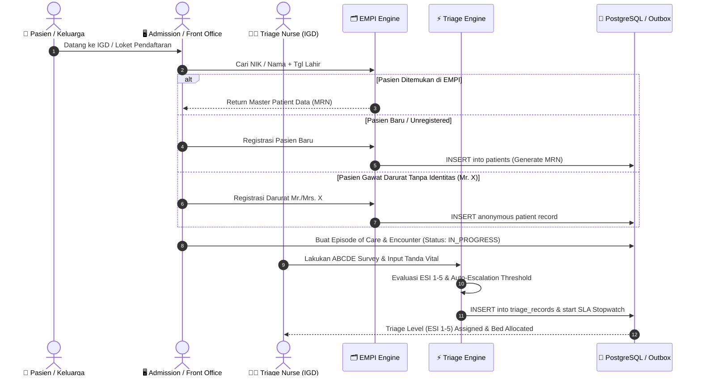
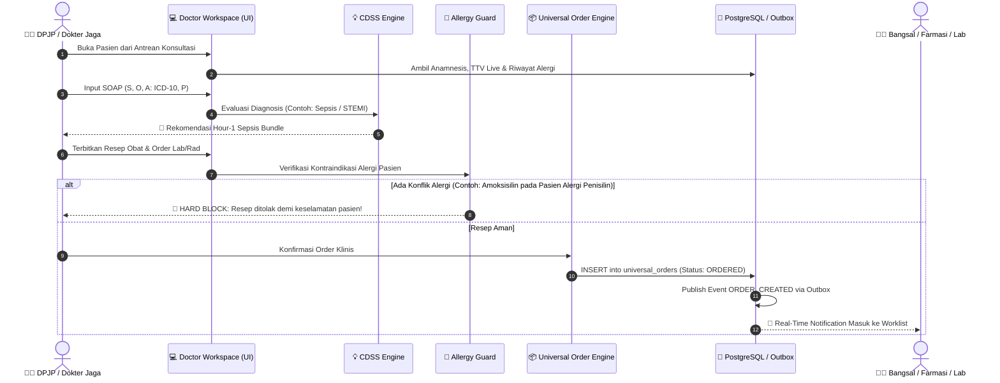
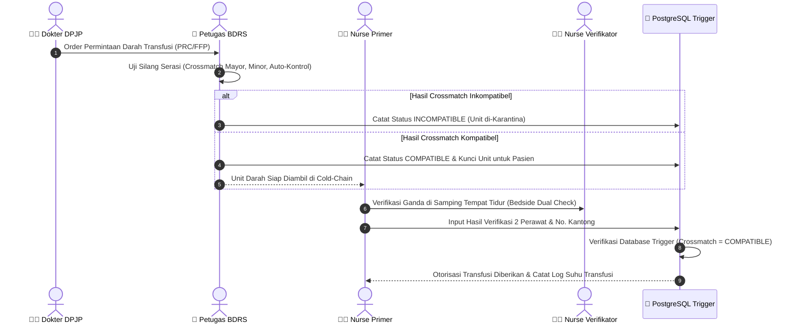

# 🔄 Clinical Workflow Sequence Diagrams
## NurseFlow Enterprise HIS 2026

**Standard Compliance:** JCI 7th Edition (Patient Journey), KARS PMKP, Permenkes No. 24/2022

---

## 1. 🏥 Patient Intake & IGD Rapid Triage Workflow

---

## 2. 👨‍⚕️ Doctor Consultation, CDSS & Universal Ordering Workflow

---

## 3. 🩸 Blood Transfusion Safety Workflow (BDRS)

