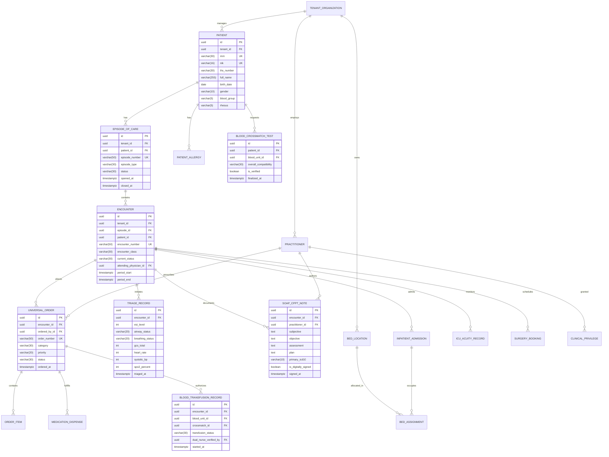

# 🗄️ Database Architecture & Entity Relationship Diagram (ERD)
## NurseFlow Enterprise HIS 2026

**Standard Compliance:** Joint Commission International (JCI 7th Edition), Permenkes No. 24/2022 (RME), SATUSEHAT HL7 FHIR R4  
**Database Engine:** PostgreSQL 16 Enterprise with Multi-Tenant Row Level Security (RLS)  
**ORM:** Prisma ORM 5.x with 15 Deterministic SQL Migrations

---

## 1. 📊 Master Clinical Core ERD (Mermaid Diagram)



---

## 2. 🔐 Row Level Security (RLS) Multi-Tenant Policies
Setiap tabel master dan transaksional menerapkan constraint isolasi faskes berbasis `tenant_id`:
```sql
ALTER TABLE patients ENABLE ROW LEVEL SECURITY;
CREATE POLICY tenant_isolation_policy ON patients
    USING (tenant_id = NULLIF(current_setting('app.current_tenant_id', true), '')::uuid);
```

---

## 3. 🛡️ Clinical Safety Invariants Enforced at Database Level
1. **No Incompatible Blood Transfusion:**
   `blood_transfusion_records` terikat secara foreign key ke `blood_crossmatch_tests` yang memiliki status `overall_compatibility = 'COMPATIBLE'`.
2. **Atomic Inventory Decrement (FEFO):**
   `CHECK (available_quantity >= 0)` memastikan stok farmasi tidak pernah bernilai negatif dalam kondisi lonjakan konkurensi.
3. **Immutable Audit Trail:**
   Tabel `audit_logs` dan `outbox_events` menerapkan append-only policy (*NO UPDATE / NO DELETE*).
