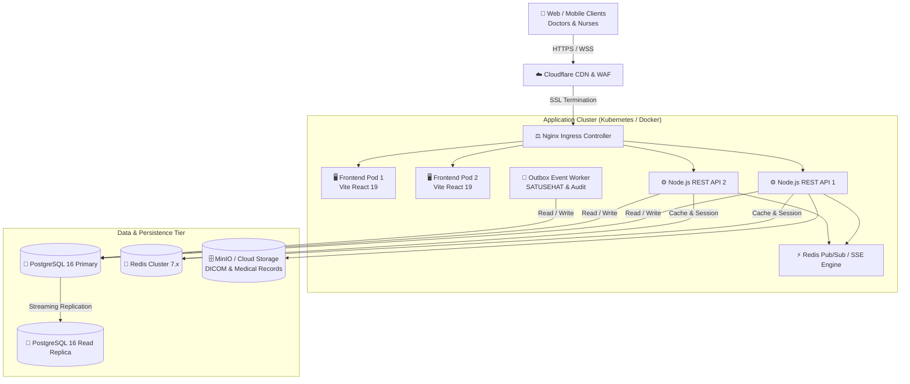

# 🚀 Deployment Architecture & High-Availability Topology
## NurseFlow Enterprise HIS 2026

**Target Environment:** Multi-Hospital Group (300+ Beds, 500+ Concurrent Clinical Sessions)  
**Infrastructure Model:** High-Availability Hybrid Cloud / On-Premise Kubernetes

---

## 1. 🏗️ High-Availability Multi-Tier Topology

---

## 2. 🛡️ Fault-Tolerance & Recovery Metrics
* **RPO (Recovery Point Objective):** $\le 0\text{ detik}$ (Synchronous streaming WAL replication pada database primer dan standby).
* **RTO (Recovery Time Objective):** $\le 30\text{ detik}$ (Automated healthcheck failover pada Ingress & database cluster).
* **Zero-Downtime Deployment:** Rolling updates pada Kubernetes pods menjamin pelayanan IGD dan rawat inap tetap berjalan 24/7 tanpa gangguan operasional.
