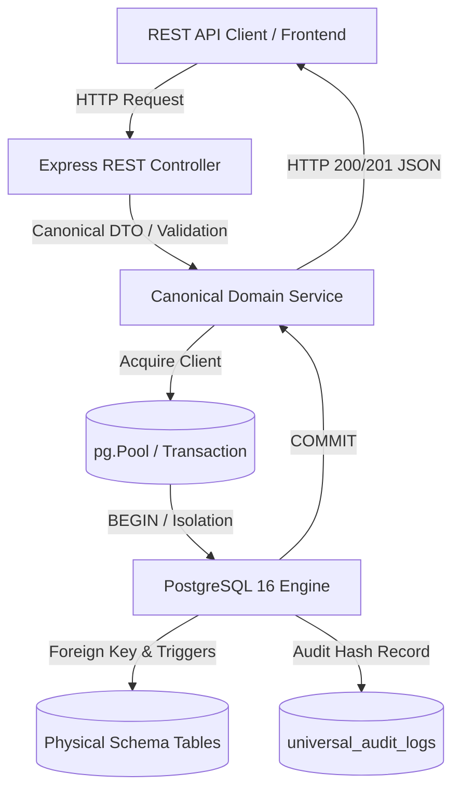

# 📊 MATRIKS KEBENARAN PERSISTENSI GATE 0B (PERSISTENCE TRUTH MATRIX 2026)
**NurseFlow Enterprise Hospital Information System (HIS)**  
**Standar Keabsahan Data:** Single Source of Truth (SSOT) — Native PostgreSQL 16  
**Auditor:** NurseFlow Core Architecture Board  
**Tanggal:** 21 Agustus 2026

---

## 1. Matriks Alur Data REST API ↔ PostgreSQL

Berikut adalah pemetaan formal alur persistensi dari REST Endpoint ke tabel fisik PostgreSQL untuk seluruh 7 domain:

---

## 2. Rincian Pemetaan Teknis 7 Domain

### 1. Blood Bank (BDRS)
- **REST Endpoint:** `POST /api/v1/blood-bank/units`, `POST /api/v1/blood-bank/crossmatch`, `POST /api/v1/blood-bank/transfusion/verify`
- **Controller:** [bloodBank.controller.js](file:///c:/ALL%20DATA/BERKAS%20ROBBY/APPS%20PROJECT/NurseFlow-WebApp/server/controllers/bloodBank.controller.js)
- **Tabel PostgreSQL:**
  - `blood_donor_units` (Penyimpanan kantong darah ISBT-128 & cold-chain status)
  - `blood_crossmatch_tests` (Uji silang serasi & proteksi trigger `trg_protect_finalized_crossmatch`)
  - `blood_transfusion_records` (Catatan transfusi klinis)
  - `blood_bedside_verifications` (7-point bedside dual-nurse safety checklist)
- **Kunci Unik & Integritas:** `uq_blood_unit_tenant_number`, `chk_distinct_nurses` (Perawat 1 <> Perawat 2).

### 2. Staff Credentialing & Privileging
- **REST Endpoint:** `POST /api/v1/staff-privileges/staff`, `POST /api/v1/staff-privileges/credentials`, `POST /api/v1/staff-privileges/privileges`, `POST /api/v1/staff-privileges/verify`
- **Controller:** [staffPrivileging.controller.js](file:///c:/ALL%20DATA/BERKAS%20ROBBY/APPS%20PROJECT/NurseFlow-WebApp/server/controllers/staffPrivileging.controller.js)
- **Tabel PostgreSQL:**
  - `clinical_staff_profiles` (Master tenaga medis)
  - `staff_credentials` (STR, SIP, Sertifikasi)
  - `clinical_privileges` (Kewenangan Klinis SPK/RKK)
  - `clinical_authorization_logs` (Audit evaluasi otorisasi tindakan)
- **Database Trigger:** `trg_validate_privilege_prerequisites` (Memblokir SPK jika STR/SIP tidak aktif).

### 3. Master Data Hub
- **REST Endpoint:** `GET /api/v1/master-data/:entityType`, `POST /api/v1/master-data/:entityType`, `PUT /api/v1/master-data/:entityType/:id`
- **Controller:** [masterDataHub.controller.js](file:///c:/ALL%20DATA/BERKAS%20ROBBY/APPS%20PROJECT/NurseFlow-WebApp/server/controllers/masterDataHub.controller.js)
- **Tabel PostgreSQL:** `master_genders`, `master_religions`, `master_countries`, `master_provinces`, `master_cities`, `master_wards`, `master_rooms`, `master_beds`, `master_diagnoses`, `master_procedures`, `master_tariffs`.
- **Integritas:** Relasi spasial hirarki gedung -> lantai -> bangsal (`master_wards`) -> ruangan (`master_rooms`) -> tempat tidur (`master_beds`).

### 4. Appointments & Queues
- **REST Endpoint:** `GET /api/v1/appointments`, `POST /api/v1/appointments/book`, `POST /api/v1/appointments/check-in`, `POST /api/v1/appointments/cancel`
- **Controller:** [appointment.controller.js](file:///c:/ALL%20DATA/BERKAS%20ROBBY/APPS%20PROJECT/NurseFlow-WebApp/server/controllers/appointment.controller.js)
- **Tabel PostgreSQL:**
  - `appointments` (Jadwal konsultasi & status)
  - `appointment_audit_logs` (Riwayat pembatalan/reschedule)
  - `queue_sequences` (Nomor antrean harian atomik dengan `ON CONFLICT DO UPDATE`)
- **Mutex:** Active Doctor Slot Mutex (`doctor_id`, `appointment_date`, `slot_time`).

### 5. Enterprise Multi-Depot Inventory
- **REST Endpoint:** `GET /api/v1/inventory/stock`, `POST /api/v1/inventory/receive`, `POST /api/v1/inventory/transfer`, `GET /api/v1/inventory/movements`
- **Controller:** [enterpriseInventory.controller.js](file:///c:/ALL%20DATA/BERKAS%20ROBBY/APPS%20PROJECT/NurseFlow-WebApp/server/controllers/enterpriseInventory.controller.js)
- **Tabel PostgreSQL:**
  - `pharmacy_warehouses` (Gudang farmasi sentral & depo rawat inap/jalan/IGD/OK)
  - `medication_catalog` (Katalog obat & KFA Kemenkes)
  - `inventory_batches` (Batch obat, ED, stok tersedia, FEFO ledger)
  - `inventory_stock_movements` (Mutasi stok historis)
- **Check Constraint:** `CHECK (available_quantity >= 0)` (Anti-stok negatif di level engine).

### 6. SATUSEHAT FHIR Interop & Outbox
- **REST Endpoint:** `GET /api/v1/satusehat/logs`, `POST /api/v1/satusehat/validate`, `POST /api/v1/satusehat/transmit`
- **Controller:** [satusehatStudio.controller.js](file:///c:/ALL%20DATA/BERKAS%20ROBBY/APPS%20PROJECT/NurseFlow-WebApp/server/controllers/satusehatStudio.controller.js)
- **Tabel PostgreSQL:**
  - `fhir_delivery_outbox` (Reliable outbox queue, state: `PENDING -> PROCESSING -> DELIVERED / FAILED`)
  - `satusehat_integration_configs` (Kredensial OAuth2 & Secret Hash)
- **Idempotensi:** `UNIQUE(tenant_id, idempotency_key)` mencegah transmisi ganda ke Kemenkes.

### 7. Executive Command Center (Observer Cockpit)
- **REST Endpoint:** `GET /api/v1/command-center/capacity`, `GET /api/v1/command-center/emergency`, `GET /api/v1/command-center/financial`, `GET /api/v1/command-center/safety`, `GET /api/v1/command-center/alerts`
- **Controller:** [commandCenter.controller.js](file:///c:/ALL%20DATA/BERKAS%20ROBBY/APPS%20PROJECT/NurseFlow-WebApp/server/controllers/commandCenter.controller.js)
- **Arsitektur:** **Strictly Read-Only Observability**.
- **Sumber Data:** Agregasi SQL langsung ke `master_beds`, `encounters`, `hospital_invoices`, `universal_audit_logs`.
- **Proteksi Klinis:** Endpoint mutasi dinonaktifkan / 405 Method Not Allowed untuk menjaga pemisahan wewenang kontrol eksekutif dan eksekusi klinis.
