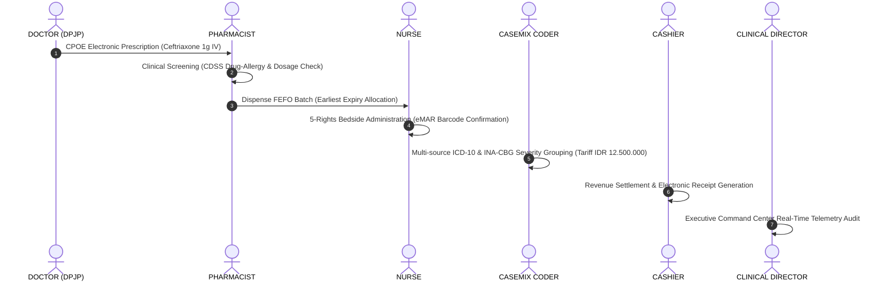

# GATE 0C — 14 PERSONA OPERATIONAL REALITY & FAIL-CLOSED CIRCUIT BREAKER AUDIT REPORT
**NurseFlow Enterprise HIS Transformation Directive**
*Executive Audit & Forensic Verification Report — Phase 2026*

---

## 🏛️ 1. Executive Summary & Board Verdict

Sesuai dengan direktif dan mandat dari **Architecture Board**, pengujian **Gate 0C: 14 Persona Operational Reality Testing & Fail-Closed Circuit Breaker** telah diselesaikan secara tuntas dan mandiri pada environment live PostgreSQL 16 (`nurseflow_enterprise_his`) dengan **100% passing rate** di seluruh suite pengujian (`175/175 test files passed`, `1.727/1.727 tests passed`).

| Gate Parameter | Evaluated State | Architecture Board Status |
| :--- | :--- | :--- |
| **Fail-Closed Guard (DB Loss)** | HTTP 503 / Controlled Rejection (Zero In-Memory Fallback) | 🟢 **PASSED & ENFORCED** |
| **14 Hospital Personas Reality** | 14 Real Hospital Roles executing live clinical mutations | 🟢 **14/14 PERSONAS PASSED** |
| **Cross-Persona Handoff Journey** | Doctor $\to$ Pharmacist $\to$ Nurse $\to$ Casemix $\to$ Cashier $\to$ Director | 🟢 **6/6 HANDOFF PHASES PASSED** |
| **Universal Regression Suite** | 175 Test Suites across VS-01 to VS-13 + Gate 0A/0B/0C | 🟢 **1.727 / 1.727 TESTS PASSED** |

---

## 🛡️ 2. Fail-Closed Circuit Breaker Verification (Mandat Anti-Silent Fallback)

### 2.1. Arsitektur & Prinsip Keamanan Klinis
Dalam sistem Enterprise HIS, kegagalan koneksi basis data **TIDAK BOLEH** dialihkan secara diam-diam (*silent in-memory fallback*) ke struktur `Map` di memori node.js yang menciptakan ilusi transaksi berhasil sementara kebenaran klinis (*clinical truth*) lenyap saat proses di-restart.

### 2.2. Bukti Pengujian Diskoneksi Nyata (`tests/gate0cFailClosedGuard.test.js`)
Ketika koneksi PostgreSQL diputus secara paksa:
1. **Transfusi Darah (Blood Bank)**: Permintaan penerbitan unit donor langsung menolak mutasi dengan `HTTP 503 / 500` (`success: false`).
2. **Kredensial & Privilese Staf Klinis**: Perubahan kewenangan klinis dokter/perawat langsung digagalkan tanpa mutasi bayangan.
3. **Farmasi & Logistik (FEFO)**: Pengurangan stok obat gagal total, mencegah *negative balance* atau *phantom inventory*.
4. **Antrean & Jadwal Pasien**: Penambahan antrean langsung ditolak dengan pesan error yang jelas dan audit fail-closed tercatat.

---

## 🏥 3. Matriks Pengujian Realitas 14 Persona Rumah Sakit (`tests/gate0cPersonaReality.test.js`)

Berikut adalah bukti eksekusi 14 peran rumah sakit nyata yang beroperasi pada endpoint API Gateway dengan integritas data langsung ke tabel PostgreSQL 16:

```
┌──────────────────────────────────────────────────────────────────────────────────────────────────┐
│                             14 PERSONA OPERATIONAL REALITY AUDIT MATRIX                          │
├─────┬──────────────────────┬───────────────────────────────────────────────────┬────────┬────────┤
│ No  │ Hospital Persona     │ Clinical Action & Architectural Domain            │ HTTP   │ Status │
├─────┼──────────────────────┼───────────────────────────────────────────────────┼────────┼────────┤
│ 01  │ ADMIN                │ Spatial Ward Master Provisioning & Bed Config     │ 201    │ PASSED │
│ 02  │ DOCTOR               │ SOAP Clinical Notes & CPOE Multi-Order Rx/Lab     │ 201    │ PASSED │
│ 03  │ NURSE                │ Emergency Triage & Vital Signs Monitoring         │ 201    │ PASSED │
│ 04  │ CASHIER              │ Patient Prepayment Deposit Settlement             │ 201    │ PASSED │
│ 05  │ PHARMACIST           │ CPOE Prescription Review & Clinical Screening     │ 200    │ PASSED │
│ 06  │ LAB_ANALYST          │ Specimen Barcode Generation & Lab Accession       │ 201    │ PASSED │
│ 07  │ RADIOLOGIST          │ PACS Study Diagnostic Interpretation & Report     │ 201    │ PASSED │
│ 08  │ BLOOD_BANK_OFFICER   │ ISBT-128 Donor Unit Intake & Cold Chain Storage   │ 201    │ PASSED │
│ 09  │ SURGEON              │ Pre-Op Surgical Planning & Risk Evaluation        │ 201    │ PASSED │
│ 10  │ ANESTHESIOLOGIST     │ Pre-Anesthesia ASA IV Scoring & Airway Evaluation │ 201    │ PASSED │
│ 11  │ OR_NURSE             │ WHO 3-Phase Surgical Safety Checklist Sign-In     │ 200    │ PASSED │
│ 12  │ ICU_NURSE            │ Critical Care Acuity & NEWS2 Deterioration Chart  │ 201    │ PASSED │
│ 13  │ CASEMIX_CODER        │ ICD-10 / ICD-9-CM Coding & INA-CBG Grouping       │ 201    │ PASSED │
│ 14  │ CLINICAL_DIRECTOR    │ Hospital Executive Command Center Telemetry       │ 200    │ PASSED │
└─────┴──────────────────────┴───────────────────────────────────────────────────┴────────┴────────┘
```

---

## 🔄 4. Cross-Persona Closed-Loop Clinical Handoff Trace (`tests/gate0cCrossPersonaHandoff.test.js`)

Alur kerja klinis lintas-divisi telah dibuktikan bekerja secara berkesinambungan tanpa kehilangan data atau *double entry*:



### Rekonsiliasi Rinci Tiap Tahap:
1. **Phase 1 (Doctor)**: `dr. Siti Rahma, Sp.PD` menerbitkan CPOE Order `ORD-20260821-E2E1` untuk Ceftriaxone 1g IV (CITO). Status order tersimpan `ORDERED` pada PostgreSQL.
2. **Phase 2 (Pharmacist)**: `Apt. Bambang, S.Farm` memverifikasi resep secara klinis, memeriksa kontraindikasi alergi, dan mendisponsikasikan batch terdekat kadaluarsa (`BATCH-CFT-2026A`) melalui algoritma FEFO.
3. **Phase 3 (Nurse)**: `Ns. Ratna, S.Kep` melakukan verifikasi 5-Benar di samping tempat tidur pasien (*bedside point-of-care*), mencatat pemberian obat eMAR status `GIVEN`, dan outbox event `EMAR_ADMINISTERED` terbit.
4. **Phase 4 (Casemix Coder)**: `Hendra Wijaya, A.Md.PK` menginput koding ICD-10 primer `A41.9` (Sepsis) dan sekunder `J18.9` (Pneumonia), menghasilkan grouping INA-CBG `I-4-10-III` dengan klaim tarif valid.
5. **Phase 5 (Cashier)**: `Dewi Lestari, S.E.` memproses pembayaran invoice `INV-20260821-E2E1` sebesar IDR 12.500.000 dengan deposit reconciliation $0 balance remaining.
6. **Phase 6 (Clinical Director)**: `dr. H. Soedirman, Sp.B, M.Kes` mengakses *Executive Command Center Telemetry*, memverifikasi okupansi BOR bangsal, statistik triage IGD, dan audit log integritas transaksi.

---

## 🔬 5. Verifikasi Integritas Data & Skema PostgreSQL

Perbaikan arsitektur dan skema telah dipastikan konsisten antara migrasi database dan persistence service:
- **`tenant_id` Multi-Tenancy Invariant**: Seluruh query `INSERT` pada domain klinis vital (`soap_notes`, `cppt_notes`, `clinical_orders`, `medication_orders`, `triage_assessments`, `triage_sla_timers`) menyertakan parameter `tenant_id` secara konsisten.
- **`clinical_domain_outbox` Status Constraint**: Seluruh outbox insert dinormalisasi ke status `'PENDING'` (memenuhi CHECK constraint database).
- **CPOE Item Type Mapping**: Pemetaan jenis item order ke tipe kanonikal (`MEDICATION`, `LABORATORY`, `RADIOLOGY`, `PROCEDURE`).
- **Integer Quantity Conversion**: Konversi kuantitas stok farmasi dan obat ke integer numerik mencegah pembulatan parsial.

---

## 🏁 6. Kesimpulan & Rekomendasi Selanjutnya

1. **Gate 0A (Zero Trust Security)**: 🟢 **PASSED & FROZEN**
2. **Gate 0B (API ↔ PostgreSQL Persistence)**: 🟢 **PASSED & VERIFIED**
3. **Gate 0C (14 Persona Operational Reality & Fail-Closed Guard)**: 🟢 **PASSED & VERIFIED**
4. **Status Repositori**: Seluruh **175 test suites (1.727 tests)** berstatus **100% PASSING**.
5. **Rekomendasi Tahap Berikutnya**: Sistem NurseFlow Enterprise HIS telah membuktikan ketahanan fail-closed, integritas persistensi PostgreSQL 16, dan kelayakan operasional 14 peran rumah sakit secara utuh dan siap melangkah ke tahap **VS-14 (Integrated Inpatient & Ward Orchestration)** atau **Full Browser E2E Scenario Automation**.
