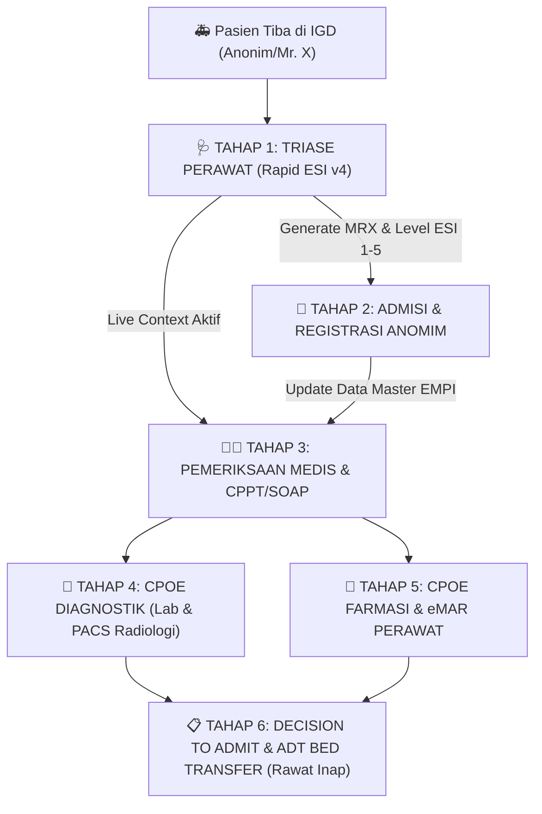
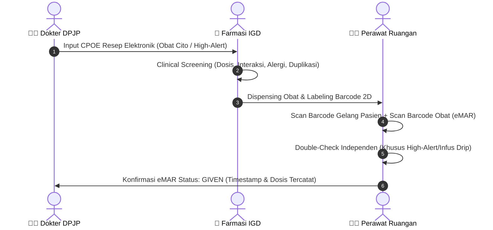

# PANDUAN OPERASIONAL STANDAR (SOP) & ALUR KERJA ENTERPRISE HIS
## Modul Triase, Registrasi Pasien Anonim, CPOE, eMAR, Hingga Transfer Rawat Inap
**Standar Kepatuhan: JCI 7th Edition (IPSG 1, 2, 3, 4), KARS 2024 (PMKP & PAP), Emergency Severity Index (ESI v4)**

---

### 📌 Ringkasan Skenario Klinis
* **Status Pasien:** Pasien Baru Anonim (Mr. / Mrs. X) tidak sadar / penurunan kesadaran akibat trauma/stroke akut yang dibawa ambulans/keluarga tanpa identitas KTP/BPJS di awal.
* **Tujuan Alur:** Memastikan **Clinical Safety First (Zero Administrative Delay)**, keselamatan pasien, pelacakan audit tak terputus (*traceable immutable audit log*), dan integrasi mulus lintas 6 peran medis/non-medis.

---

## 1. TAHAP 1: TRIASE PERAWAT IGD (Nurse Triage Workflow)
> **Prinsip Utama JCI:** *Patient safety over bureaucracy.* Triase dilakukan dalam < 2 menit sejak pasien tiba di pintu IGD sebelum administrasi manual selesai.

### A. Langkah Kerja Perawat Triase:
1. **Buka Modul Triase:** Akses menu navigasi `Gawat Darurat (IGD)` ➔ `Triase 5-Level (ATS/ESI)`.
2. **Penanganan Pasien Anonim / Emergency Fast-Track:**
   * Jika pasien tidak beridentitas, klik tombol **`🚨 Buat Pasien Darurat (Mr. X)`** atau **`Emergency Unknown Patient`**.
   * Sistem secara otomatis menerbitkan Nomor RM Sementara (contoh: `MRX-20260817-A1`) dan membuka *Encounter Darurat* dengan status `TRIAGE_PENDING`.
   * Live Context pada **Clinical Ribbon** atas langsung terkunci pada pasien darurat ini.
3. **Survei Primer ABCDE & Input Cepat:**
   * **A (Airway):** Evaluasi Paten / Threatened / Obstructed.
   * **B (Breathing):** Normal / Dyspnea / Apnea / Stridor.
   * **C (Circulation):** Kuat & Teratur / Syok / Perdarahan Masif.
   * **D (Disability / GCS):** Isi skor Eye (1-4), Verbal (1-5), Motorik (1-6).
   * **E (Exposure/TTV):** Input Tekanan Darah (TD), Frekuensi Nadi (HR), Frekuensi Nafas (RR), SpO2 (%), Suhu (°C), dan Skala Nyeri NRS (0-10).
4. **Klasifikasi Otomatis ESI v4 Engine:**
   * **ESI 1 (Resusitasi Segera / 0 Menit):** Jika henti nafas/jantung, GCS ≤ 8, SpO2 < 85%. Sistem memunculkan tombol **`🚨 Code Blue Resuscitation Board`**.
   * **ESI 2 (Emergent / ≤ 10 Menit):** Kondisi ancaman jiwa/organ, stroke akut onset baru, nyeri dada tipikal ACS, GCS 9–13, atau nyeri ekstrem (skala ≥ 7).
   * **ESI 3 (Urgent / ≤ 30 Menit):** Butuh 2+ sumber daya diagnostik/terapi, TTV stabil.
   * **ESI 4 & 5 (Semi / Non-Urgent):** 0–1 sumber daya, alokasi ke zona hijau/fast-track.
5. **Alokasi Tempat Tidur & Finalisasi Triase:**
   * Pilih bed IGD (misal: `Bed Resusitasi RES-01` atau `Bed Akut A-01`).
   * Klik tombol **`Simpan Asesmen Triase & Mulai Stopwatch SLA`**.
   * *System Trigger:* Stopwatch KARS PMKP berjalan, Encounter berubah menjadi `TRIAGED`, notifikasi real-time terkirim ke Dashboard Dokter IGD.

---

## 2. TAHAP 2: PENDAFTARAN & VALIDASI ADMISI (Front Office / HIM)
> **Prinsip Utama JCI IPSG 1:** *Identifikasi Pasien yang Benar.* Mengamankan identitas anonim dan menggabungkannya saat identitas asli ditemukan tanpa merusak integritas rekam medis.

### A. Langkah Kerja Petugas Admisi:
1. **Akses Modul Admisi:** Masuk ke menu `Pasien & EMPI` ➔ `Antrean Registrasi / Front Office`.
2. **Klaim Pasien Anonim:**
   * Cari nomor RM sementara `MRX-20260817-A1`.
   * Tetapkan Penjamin Awal: `Jasa Raharja / Darurat IGD (Kemenkes)` atau `Umum Sementara`.
3. **Penyatuan Identitas (MPI Merge & Verification Guard):**
   * Ketika identitas asli (KTP/Kartu BPJS/Keluarga) tiba di admisi, lakukan pencarian NIK pada **Enterprise Master Patient Index (EMPI)**.
   * Jika pasien lama ditemukan, gunakan fitur **`EMPI Identity Merge Guard`**:
     * Primary Record: Rekam Medis Utama (`MRN-2026-001006`).
     * Secondary Record: Data Sementara IGD (`MRX-20260817-A1`).
     * Klik **`Execute Legal Merge (JCI HIM Standard)`**.
   * *System Trigger:* Seluruh data triase, TTV, dan encounter yang sudah diinput perawat otomatis dipindahkan ke No. RM definitif pasien tanpa ada data hilang (*Zero Data Loss*).

---

## 3. TAHAP 3: PENGISIAN EMR & SOAP MEDIS (Dokter DPJP & Perawat)
> **Prinsip Utama JCI:** *Traceability & Single Unified Clinical Record.* Dokter dan perawat berkolaborasi dalam satu lembar kerja CPPT terintegrasi.

### A. Langkah Kerja Perawat (Pengkajian Keperawatan IGD):
1. Buka menu `Pelayanan Klinis` ➔ `Nursing Workspace & eMAR`.
2. Lakukan Asesmen Sekunder:
   * Pengkajian Risiko Jatuh (Morse Fall Scale).
   * Skrining Nyeri Komprehensif & Alergi Obat/Makanan (High-Alert Allergy Tagging).
   * Pemasangan Gelang Identitas Merah Muda/Biru + Gelang Kuning (Risiko Jatuh) + Gelang Merah (Alergi).

### B. Langkah Kerja Dokter DPJP IGD:
1. Buka menu `Pelayanan Klinis` ➔ `Doctor Workspace (SOAP)`.
2. Pilih pasien dari daftar antrean triase aktif.
3. **Isi Lembar CPPT Terintegrasi (SOAP):**
   * **Subjective (S):** Anamnesis / Alloanamnesis kronologis (onset keluhan, riwayat penyakit).
   * **Objective (O):** Keadaan umum, TTV otomatis ditarik dari modul triase, status generalis & lokalis neurologis/bedah.
   * **Assessment (A):** Masukkan Diagnosis Utama (ICD-10, contoh: `I63.9 - Cerebral Infarction / Stroke Non-Hemorrhagic`) dan Diagnosis Sekunder (`I10 - Essential Hypertension`).
   * **Plan (P):** Rencana tatalaksana, target stabilisasi hemodinamik, instruksi CPOE, dan konsul spesialis.
4. Klik **`Simpan & Tandatangani Elektronik (BSrE Ready)`**.

---

## 4. TAHAP 4: PEMESANAN CPOE DIAGNOSTIK (Laboratorium & Radiologi PACS)
> **Prinsip JCI IPSG 2:** *Komunikasi Efektif & Pelaporan Nilai Kritis Segera.*

### A. Alur Pemeriksaan Laboratorium (LIS CPOE):
1. **Order Dokter:** Pada Doctor Workspace, klik tab `Order CPOE Diagnostik` ➔ Centang paket:
   * *Darah Lengkap (CBC), Gula Darah Sewaktu (GDS), Elektrolit Lengkap, Troponin-I Cito, PT/APTT.*
2. **Koleksi Sampel oleh Perawat IGD:**
   * Cetak barcode vacutainer langsung dari sistem.
   * Lakukan verifikasi 2 identitas sebelum pengambilan darah.
   * Update status tabung: `COLLECTED` ➔ `SENT_TO_LAB`.
3. **Pemeriksaan & Hasil Analis Lab:**
   * Petugas Lab menerima sampel di menu `Layanan Diagnostik` ➔ `Laboratorium (LIS)`.
   * Input hasil kuantitatif. Jika hasil melewati ambang batas (contoh: *GDS: 480 mg/dL* atau *Troponin-I: 0.84 ng/mL*), sistem otomatis membunyikan **Critical Alert Banner** di layar IGD dalam < 5 menit.

### B. Alur Pemeriksaan Radiologi (PACS & DICOM Web Viewer):
1. **Order Radiologi CITO:** Dokter memilih `CT-Scan Kepala Non-Kontras CITO (Protokol Stroke Akut)` atau `Foto Thorax AP Portabel`.
2. **Modality Worklist (MWL):** Mesin CT/X-Ray otomatis menerima order tanpa input ulang identitas (*Zero Typing Error*).
3. **Hasil & Bacaan Radiolog:**
   * Radiolog mengunggah hasil citra DICOM dan expertise di menu `PACS & DICOM Web Viewer`.
   * Dokter IGD langsung dapat memutar, zoom, dan melihat irisan rekonstruksi CT-Scan di layar dokter secara terintegrasi.

---

## 5. TAHAP 5: CPOE FARMASI & eMAR PEMBERIAN OBAT
> **Prinsip JCI IPSG 3:** *Peningkatan Keamanan Obat Kewaspadaan Tinggi (High-Alert Medications).* Mencegah kejadian *Medication Error* melalui verifikasi 7 Benar Farmasi dan 5 Benar Perawat.

### A. Langkah Kerja Farmasi Klinis:
1. Buka menu `Farmasi Enterprise` ➔ `Multi-Depot FEFO & Telaah Resep`.
2. Lakukan telaah klinis resep: tepat indikasi, dosis, rute, frekuensi, potensi alergi silang, dan interaksi obat.
3. Siapkan obat, tempelkan etiket dengan barcode unik, dan klik **`Dispense & Release to IGD`**.

### B. Langkah Kerja Perawat IGD (eMAR Administration):
1. Buka menu `Pelayanan Klinis` ➔ `Nursing Workspace & eMAR` ➔ Tab `Jadwal eMAR`.
2. Scan barcode pada gelang pasien dan barcode obat.
3. Sistem memvalidasi kesesuaian obat. Jika obat termasuk kategori **High-Alert (contoh: Insulin, Kalium Klorida Pekat, Heparin)**, sistem mewajibkan verifikasi *Double-Check* oleh 2 perawat dengan memasukkan PIN.
4. Klik **`Berikan Obat (Mark as GIVEN)`**.

---

## 6. TAHAP 6: SURAT PERINTAH RAWAT INAP & TRANSFER BANGSAL (ADT)
> **Prinsip JCI IPSG 2 & Transfer SOP:** *Serah terima pasien yang aman menggunakan metode SBAR (Situation, Background, Assessment, Recommendation).*

### A. Penerbitan Surat Perintah Rawat Inap (SPRI):
1. Dokter DPJP IGD memutuskan pasien memerlukan perawatan lanjutan (*Decision to Admit*).
2. Pada Doctor Workspace, klik tombol **`Terbitkan SPRI / Admission Order`**.
3. Tentukan diagnosis masuk, kelas perawatan yang dianjurkan (misal: *Kelas 1 / Ruang Rawat Mawar 301-B*), dan instruksi tirah baring/diet.

### B. Alokasi Bed & Transfer Pasien oleh Admisi / Perawat:
1. Admisi membuka menu `Peta Alokasi Bed & ADT Management`.
2. Pilih bed bangsal yang berstatus `VACANT / SANITIZED` (contoh: `FAC-BED-301B`).
3. Sistem mengubah status bed menjadi `RESERVED` ➔ `OCCUPIED`.
4. Perawat IGD membuat lembar **Transfer Internal Pasien (SBAR Form)**:
   * **S (Situation):** Pasien Tn. Hendra, 42 thn, stroke non-hemoragik akut stabil.
   * **B (Background):** Riwayat hipertensi tidak terkontrol, telah diberikan terapi antihipertensi & antiplatelet di IGD.
   * **A (Assessment):** TTV terkini TD 140/90, HR 82, GCS 15, defisit motorik ekstremitas kanan 4/5.
   * **R (Recommendation):** Lanjutkan monitoring TTV per 4 jam, fisioterapi bertahap, rawat bersama DPJP Neurologi.
5. Perawat Ruang Rawat Inap menerima pasien dan menandatangani serah terima digital di sistem. Status Encounter berpindah dari `EMERGENCY` menjadi `INPATIENT` secara otomatis.

---

## 7. MATRIKS RINGKASAN HAK AKSES & KEWENANGAN PERAN

| Modul / Fitur | Perawat Triase | Petugas Admisi | Dokter DPJP | Analis Lab | Radiolog | Farmasis | Perawat Bangsal |
|---|:---:|:---:|:---:|:---:|:---:|:---:|:---:|
| **Input Triase Cepat (Rapid ESI)** | **PENUH (R/W)** | Baca (R) | Baca (R) | - | - | - | Baca (R) |
| **Registrasi & EMPI Merge** | Baca (R) | **PENUH (R/W)** | - | - | - | - | - |
| **Doctor SOAP & SPRI** | Baca (R) | Baca (R) | **PENUH (R/W)** | - | - | - | Baca (R) |
| **CPOE Order Diagnostik** | Verifikasi | - | **PENUH (R/W)** | - | - | - | Baca (R) |
| **Entri Hasil Lab (LIS)** | - | - | Baca (R) | **PENUH (R/W)** | - | - | Baca (R) |
| **PACS Viewer & Expertise** | Baca (R) | - | Baca (R) | - | **PENUH (R/W)** | - | Baca (R) |
| **Telaah & Dispensing Obat** | - | - | - | - | - | **PENUH (R/W)** | - |
| **Administrasi eMAR** | **PENUH (R/W)** | - | Baca (R) | - | - | Baca (R) | **PENUH (R/W)** |
| **ADT Bed Transfer & SBAR** | **PENUH (R/W)** | **PENUH (R/W)** | Baca (R) | - | - | - | **PENUH (R/W)** |

---

## 8. INDIKATOR MUTU & AUDIT SAFETY (KARS PMKP / JCI)
1. **Door-to-Triage Time:** $\le 2\text{ menit}$ untuk seluruh kedatangan pasien IGD.
2. **Door-to-Doctor Time:**
   * ESI 1: $0\text{ menit}$ (Segera / Cito).
   * ESI 2: $\le 10\text{ menit}$.
   * ESI 3: $\le 30\text{ menit}$.
3. **Critical Value Reporting:** Notifikasi nilai kritis lab dilaporkan dan dikonfirmasi dalam waktu $\le 15\text{ menit}$.
4. **Zero Medication Administration Errors:** 100% verifikasi barcode eMAR pada obat berisiko tinggi (*High-Alert*).
