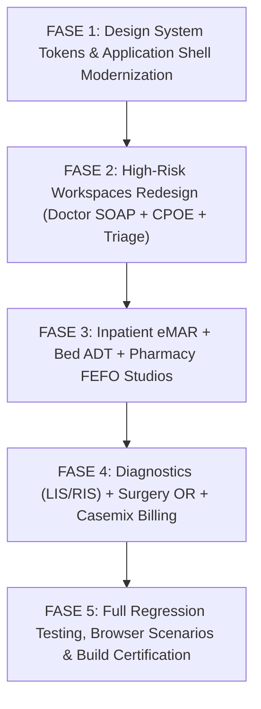

# 🗺️ ROADMAP TRANSFORMASI & IMPLEMENTASI UI/UX 2026 (UI/UX REDESIGN ROADMAP)
## NurseFlow Enterprise Hospital Information System

**Dokumen Referensi:** Master Task — Clinical UX & Workflow Re-Engineering  
**Tanggal Rilis:** 26 Agustus 2026  
**Status Eksekusi:** Aktif & Berjalan  

---

## 📌 Urutan Prioritas Eksekusi (Implementation Phasing)

---

## 📋 Matriks Fase & Komponen yang Direfaktor

### ⚡ Fase 1: Standarisasi Design System, Semantic Tokens & Sacred Shell
* **Target Modul/File:**
  * `src/index.css` (Update design tokens, typography, layout rhythm, dark mode contrast).
  * `src/components/ui/ClinicalContextRibbon.jsx` (Redesign Sacred Patient HUD: ESI, NEWS2, DPJP, Alergi Banner, Care State Navigation, Code Blue/Red Hot-Trigger).
  * `src/layouts/MainLayout.jsx` (Redesign Enterprise Workstation Shell, Collapsible Navigation Tree, Quick Command Palette).
  * `src/components/ui/button.jsx`, `src/components/ui/input.jsx`, `src/components/ui/DataTable.jsx`, `src/components/ui/StatusBadge.jsx`, `src/components/ui/ClinicalAlertBanner.jsx` (Standarisasi komponen primitif).
* **Risiko Regresi:** Rendah (Visual & Shell level).

### ⚡ Fase 2: High-Risk Clinical Workspaces (Doctor Consultation, CPOE & Triage)
* **Target Modul/File:**
  * `src/modules/clinical_core/pages/DoctorWorkspacePage.jsx` & `DoctorSoapWorkspace.jsx` (Integrasi 3-Panel: Riwayat $\rightarrow$ SOAP & ICD-10 $\rightarrow$ Universal CPOE Basket).
  * `src/modules/orders/components/OrdersWorkspace.jsx` & `OrderEntryWorkspace.jsx` (Single-screen multi-category order basket, estimasi tarif live, CDSS allergy hard-stop).
  * `src/modules/triage/pages/TriagePage.jsx` & `RapidTriageStudio.jsx` (Fast Numpad vital signs entry, auto-NEWS2 score, ATS/ESI 5-level routing).
* **Risiko Regresi:** Sedang (Memastikan API CPOE & SOAP PostgreSQL 16 tetap terkoneksi 100%).

### ⚡ Fase 3: Inpatient Nursing eMAR, Bed Management & Pharmacy FEFO
* **Target Modul/File:**
  * `src/modules/nursing/pages/NursingWorkspacePage.jsx` & `EmarAdministrationStudio.jsx` (Visual shift timeline 24 jam, 5-Rights scanner, dual-nurse verification for narcotics).
  * `src/modules/ward/pages/BedManagementCenterPage.jsx` & `LiveWardMapStudio.jsx` (Peta ranjang bangsal interaktif, OCC bed transfer, status housekeeping otomatis).
  * `src/modules/pharmacy/pages/EnterprisePharmacyWorkspacePage.jsx` & `ClinicalDispensingStudio.jsx` (Antrean resep CITO vs Reguler, FEFO batch selection, cetak etiket).
* **Risiko Regresi:** Sedang (Validasi state machine obat & ranjang).

### ⚡ Fase 4: Diagnostics (LIS/RIS), Surgery OR Board & Casemix Billing
* **Target Modul/File:**
  * `src/modules/lab/pages/LabPage.jsx` & `AnalyticalResultEntryStudio.jsx` (Panic value audio-visual alert, Delta-check indicator, keyboard-first table entry).
  * `src/modules/radiology/pages/RadiologyWorkspacePage.jsx` & `RadiologyReportingStudio.jsx` (PACS DICOMweb viewer split 50:50 dengan form pengetikan ekspertise).
  * `src/modules/surgery/pages/OperatingTheatreWorkspacePage.jsx` & `WhoSurgicalSafetyStudio.jsx` (WHO surgical safety checklist locked before surgical sign-out).
  * `src/modules/billing/pages/BillingPage.jsx` & `CasemixClaimsQueueStudio.jsx` (Split billing BPJS vs Pribadi, grouping INA-CBGs live, kuitansi kasir).
* **Risiko Regresi:** Rendah ke Sedang (Integrasi penagihan dan klaim).

### ⚡ Fase 5: Verifikasi Menyeluruh, Pengujian Browser & Sertifikasi Build
* **Target Pengujian:**
  * `npx vitest run`: 175 test files (1,727 tests) MUST PASS 100%.
  * `node scripts/verify_fase5a_ui_backend_operational_reality_v2.mjs`: 24/24 AC MUST PASS 100%.
  * `npm run build`: 0 error build Vite.
* **Toleransi Defek:** Zero P0 Critical & Zero P1 Workflow Blocking.
