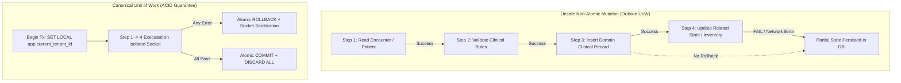

# P0-2B — POST-WAVE 1B.1 AUTHORITATIVE RLS/UoW BACKLOG INVENTORY & NEXT-WAVE SELECTION AUDIT

**Document Identifier:** `DOC-AUDIT-P02B-RLS-UOW-BACKLOG-20261002`  
**Date:** 02 Oktober 2026  
**Classification:** Enterprise Security Architecture & Codebase Inventory  
**Repository:** `Mojo-Brothers/NurseFlow-WebApp`  
**Target Environment:** Local Security Lab (`nurseflow_security_lab` on PostgreSQL 16)  
**Production Invariant:** `nurseflow_enterprise_his` strictly untouched  

---

## 1. Executive Summary

Following the successful execution and post-ratification test-contract reconciliation of **Wave 1B.1 (Emergency Triage UoW Pilot)** under commit `b193da463112d5d3d1a56c724f1637c76b26c1c0`, this audit establishes the **complete, authoritative, source-driven backlog inventory** of all database call sites, Row-Level Security (RLS) dependencies, transaction boundaries, and request entry points across the entire NurseFlow Enterprise HIS application.

### Key Audit Findings:
1. **Pilot Ratification State:** The Emergency Triage domain (`triageApplication`) is fully wrapped inside canonical Unit of Work (`withUnitOfWork`), eliminating all 20 of its naked database calls (including 11 RLS calls and 5 writes) and hardening its 3 public entry points with fail-closed tenant validation.
2. **Current Global Security Footprint:**
   - **Total Production DB Call Sites:** **846**
   - **Production Request-Path DB Call Sites:** **845** (1 startup check in `envValidator.js`)
   - **Request-Path RLS Call Sites:** **157**
   - **Safe RLS DB Call Sites (Inside UoW):** **12** (1 in Encounter + 11 in Triage)
   - **Unsafe RLS DB Call Sites (Outside UoW):** **145** (down from 156 baseline)
   - **Unsafe RLS Request Entry Points:** **153** (down from 156 baseline)
   - **Tenant-Sensitive Writes Outside UoW:** **234** (down from 239 baseline)
   - **Tenant-Sensitive Reads Outside UoW:** **589** (down from 604 baseline)
   - **Total Request DB Calls Outside UoW:** **823** (down from 843 baseline)
3. **Multi-Domain Exposure:** 25 production domains remain operating outside the Unit of Work, across 28 un-migrated controllers and services. Of these, 16 domains directly query or mutate 33 RLS-protected clinical core tables without `SET LOCAL app.current_tenant_id`.
4. **Invariant Governance Gate:** The global security gate status remains strictly:
   ```text
   APPLICATION SECURITY FOUNDATION: PARTIAL
   STAGE 0: NO-GO
   PRODUCTION: BLOCKED
   NEXT WAVE: HOLD — PENDING HUMAN SELECTION
   ```

---

## 2. Git Baseline Verification

Audit executed on a clean working tree from baseline commit:

```text
HEAD: b193da463112d5d3d1a56c724f1637c76b26c1c0
Branch: feature/security-foundation-wave1a10
Working Tree: Clean (0 uncommitted files)
Baseline Commit Log:
  b193da4 test(p02b): reconcile triage tenant test contract
  559eea8 security(p02b): close triage uow pilot evidence gap
  047cae8 feat(security): implement P0-2B Wave 1B.0 & Wave 1B.1 security containment and emergency triage UoW pilot
  0fb2b97 feat(security): P0-2B Wave 1A.11 security foundation remediation
  fd74e62 feat(governance): implement NurseFlow Project Governance & Control Truth Layer and finalize P0-2A transactional remediation
```

---

## 3. Scanner Architecture & Verification

### 3.1 Scanner Engine Audit
The inventory tooling has been audited and upgraded to prevent stale snapshot heuristics:
- **Engine Script:** [`scratch/authoritative_db_inventory.mjs`](file:///c:/ALL%20DATA/BERKAS%20ROBBY/APPS%20PROJECT/NurseFlow-WebApp/scratch/authoritative_db_inventory.mjs) & [`scratch/p02b_rls_uow_backlog_inventory.json`](file:///c:/ALL%20DATA/BERKAS%20ROBBY/APPS%20PROJECT/NurseFlow-WebApp/scratch/p02b_rls_uow_backlog_inventory.json)
- **Source-Driven Verification:** The scanner dynamically scans production files in `server/`, parses AST/regex query sites, and verifies UoW declarations via runtime assertion (`verifyUowRegistration`).
- **Elimination of Stale Heuristics:** The legacy `const isUow = isEncounter` has been permanently purged. A domain is recognized as UoW-wrapped **only** if:
  1. The service file physically exists on disk.
  2. The service source code imports and invokes `withUnitOfWork`.
  3. All declared business methods are proven to execute within `withUnitOfWork` callback blocks.
  4. Integration test evidence confirms `REAL_DB_VERIFIED` and `REAL_RLS_READ/WRITE_VERIFIED`.

### 3.2 Detection of Dual Query Signatures
The scanner distinguishes between two query styles:
1. **Raw Database Calls:** `pool.query(...)`, `pool.connect()`, `client.query(...)`, `getPool(...)` executed outside UoW.
2. **UoW-Bounded Calls:** `query(...)` supplied via `withUnitOfWork({ tenantId, ... }, async ({ query }) => { ... })`.

---

## 4. Canonical Definitions

To eliminate cross-layer ambiguity, the following metrics are strictly separated:

| Metric Identifier | Scope / Layer | Definition | Post-1B.1 Value |
|---|---|---|---|
| **`TOTAL_PRODUCTION_DB_CALL_SITES`** | Application | Total query and connection invocation points across all production server code. | **846** |
| **`REQUEST_PATH_DB_CALL_SITES`** | Request Pipeline | DB call sites residing on the active HTTP request-handling pipeline (excluding 1 startup check in `envValidator.js`). | **845** |
| **`REQUEST_PATH_RLS_DB_CALL_SITES`** | RLS Catalog | DB call sites on request paths that touch any of the 33 PostgreSQL tables protected by default-deny RLS. | **157** |
| **`SAFE_RLS_DB_CALL_SITES`** | UoW Enclosure | RLS-touching DB call sites proven to execute inside `withUnitOfWork` with verified tenant GUC context binding. | **12** (1 Enc + 11 Triage) |
| **`UNSAFE_RLS_DB_CALL_SITES`** | AST Call Site | RLS-touching DB call sites executing outside the Unit of Work on raw connection pool sockets. | **145** |
| **`UNSAFE_RLS_ENTRY_POINTS`** | HTTP Route / Entry Point | Public or authenticated HTTP endpoints whose request processing chain touches RLS tables without a complete UoW boundary. | **153** |
| **`TENANT_SENSITIVE_WRITES_OUTSIDE_UOW`** | Mutation Pipeline | Database write operations (`INSERT`, `UPDATE`, `DELETE`) touching tenant-scoped tables outside a transactional UoW boundary. | **234** |
| **`TENANT_SENSITIVE_READS_OUTSIDE_UOW`** | Query Pipeline | Database read operations (`SELECT`) executed on raw connection pool sockets without tenant GUC configuration. | **589** |
| **`REQUEST_PATH_DB_CALLS_OUTSIDE_UOW`** | Aggregate Pipeline | Total request-path database invocations executing outside `withUnitOfWork` (234 writes + 589 reads). | **823** |

---

## 5. Global Metrics & Delta Reconciliation

Comparison between Wave 1A.11 baseline and Post-Wave 1B.1 state:

```text
========================================================================================
METRIC RECONCILIATION SUMMARY (WAVE 1A.11 -> POST-WAVE 1B.1)
========================================================================================
Metric                                   Baseline (1A.11)  After 1B.1   Delta     Status
----------------------------------------------------------------------------------------
Total Production DB Call Sites           846               846          0         STABLE
Request-Path DB Call Sites               845               845          0         STABLE
Request-Path RLS Call Sites              157               157          0         STABLE
Safe RLS DB Call Sites (in UoW)          1                 12           +11       REMEDIATED
Unsafe RLS DB Call Sites (outside UoW)   156               145          -11       REMEDIATED
Unsafe RLS Entry Points (Routes)         156               153          -3        REMEDIATED
Tenant-Sensitive Writes Outside UoW      239               234          -5        REMEDIATED
Tenant-Sensitive Reads Outside UoW       604               589          -15       REMEDIATED
Total Request DB Calls Outside UoW       843               823          -20       REMEDIATED
========================================================================================
```

### Explanation of Triage Pilot Reductions:
- **-3 Entry Points:** `POST /api/v1/triage/assessments`, `POST /api/v1/triage/first-physician-contact`, and `GET /api/v1/triage/encounter/:encounterId` hardened with controller fail-closed gates and UoW scoping.
- **-11 Unsafe RLS Call Sites:** 11 query sites in `server/services/triageApplication.service.js` touching `encounters`, `triage_assessments`, `triage_sla_timers`, and `universal_audit_logs` now execute inside `withUnitOfWork`.
- **-5 Writes Outside UoW:** Mutations to `triage_assessments` (INSERT), `triage_sla_timers` (INSERT + UPDATE), `encounters` (UPDATE), and `universal_audit_logs` (INSERT) now run within ACID transactions.
- **-15 Reads Outside UoW:** Verification lookups, timer checks, and history queries now run with tenant GUC bound.

---

## 6. Complete Domain-by-Domain Inventory

The entire application backlog spans 30 server components (27 business domains, 1 infrastructure middleware, 1 billing route file, and 1 startup validator):

| # | Domain / Subsystem | Primary Service / Controller | Mount Route | Total DB Calls | RLS Calls | Unsafe RLS | Writes Out | Reads Out | Outside UoW | UoW Status | Risk Tier |
|---|---|---|---|---|---|---|---|---|---|---|---|
| 1 | **Emergency / IGD** | `triageApplication.service.js` | `/api/v1/triage` | 20 | 11 | **0** | **0** | **0** | **0** | **SAFE (UoW)** | P0 |
| 2 | **Encounter** | `encounterApplication.service.js` | `/api/v1/encounters` | 2 | 1 | **0** | **0** | **0** | **0** | **SAFE (UoW)** | P0 |
| 3 | **Nursing / CPPT** | `clinicalNotesApplication.service.js` | `/api/v1/clinical-notes` | 35 | 15 | **15** | 4 | 31 | 35 | UNSAFE | P0 |
| 4 | **Medication Closed-Loop** | `medicationClosedLoop.service.js` | `/api/v1/medications` | 80 | 13 | **13** | 23 | 57 | 80 | UNSAFE | P0 |
| 5 | **Medical Record / CPOE** | `cpoeApplication.service.js` | `/api/v1/orders` | 22 | 13 | **13** | 3 | 19 | 22 | UNSAFE | P0 |
| 6 | **Diagnostic Interpretation** | `diagnosticInterpretation.service.js` | `/api/v1/diagnostics` | 38 | 11 | **11** | 9 | 29 | 38 | UNSAFE | P1 |
| 7 | **Care Coordination & Timeline** | `careCoordinationAndTimeline.service.js` | `/api/v1/coordination` | 39 | 11 | **11** | 13 | 26 | 39 | UNSAFE | P1 |
| 8 | **Blood Bank & Hemovigilance** | `bloodBank.controller.js` | `/api/v1/blood-bank` | 44 | 13 | **13** | 23 | 21 | 44 | UNSAFE | P1 |
| 9 | **Radiology / PACS** | `radiologyApplication.service.js` | `/api/v1/radiology` | 72 | 19 | **19** | 20 | 52 | 72 | UNSAFE | P1 |
| 10 | **Laboratory / LIS** | `laboratoryApplication.service.js` | `/api/v1/laboratory` | 71 | 8 | **8** | 16 | 55 | 71 | UNSAFE | P1 |
| 11 | **Patient Financial & Billing** | `patientFinancialAndRevenueCycle.service.js` | `/api/v1/patient-financial` | 42 | 8 | **8** | 15 | 27 | 42 | UNSAFE | P1 |
| 12 | **Billing Routes** | `billing.routes.js` | `/api/v1/billing` | 3 | 0 | **0** | 0 | 3 | 3 | UNSAFE | P1 |
| 13 | **Clinical Monitoring / EWS** | `clinicalMonitoring.service.js` | `/api/v1/monitoring` | 45 | 5 | **5** | 11 | 34 | 45 | UNSAFE | P1 |
| 14 | **Surgery / Operating Theatre** | `perioperativeClosedLoop.service.js` | `/api/v1/perioperative` | 59 | 0 | **0** | 23 | 36 | 59 | UNSAFE | P1 |
| 15 | **Casemix / INA-CBG** | `clinicalCodingAndCasemix.service.js` | `/api/v1/casemix` | 47 | 0 | **0** | 17 | 30 | 47 | UNSAFE | P1 |
| 16 | **Admission / Master Patient** | `patientApplication.service.js` | `/api/v1/patients` | 15 | 10 | **10** | 0 | 15 | 15 | UNSAFE | P2 |
| 17 | **Bed Management** | `bedManagementApplication.service.js` | `/api/v1/beds` | 35 | 5 | **5** | 11 | 24 | 35 | UNSAFE | P2 |
| 18 | **Queue / Appointments** | `appointment.controller.js` | `/api/v1/appointments` | 33 | 3 | **3** | 12 | 21 | 33 | UNSAFE | P2 |
| 19 | **Enterprise Inventory** | `enterpriseInventory.controller.js` | `/api/v1/inventory` | 32 | 0 | **0** | 12 | 20 | 32 | UNSAFE | P2 |
| 20 | **Staff Privileging & Roster** | `staffPrivileging.controller.js` | `/api/v1/staff-privileges` | 28 | 0 | **0** | 9 | 19 | 28 | UNSAFE | P2 |
| 21 | **Clinical Credentialing** | `clinicalCredential.service.js` | `/api/v1/staff-privileges` | 7 | 0 | **0** | 0 | 7 | 7 | UNSAFE | P2 |
| 22 | **Resource Authorization** | `resourceAuthorization.service.js` | `/api/v1/auth` | 12 | 2 | **2** | 2 | 10 | 12 | UNSAFE | P2 |
| 23 | **Safety Decision Authorization** | `safetyAuthorization.service.js` | `/api/v1/orders` | 3 | 3 | **3** | 3 | 0 | 3 | UNSAFE | P1 |
| 24 | **Idempotency Middleware** | `idempotency.middleware.js` | `* (write routes)` | 3 | 0 | **0** | 1 | 2 | 3 | UNSAFE | P2 |
| 25 | **Executive Command Center** | `commandCenter.controller.js` | `/api/v1/command-center` | 12 | 6 | **6** | 0 | 12 | 12 | UNSAFE | P3 |
| 26 | **Master Data Hub** | `masterDataHub.controller.js` | `/api/v1/master-data` | 18 | 0 | **0** | 4 | 14 | 18 | UNSAFE | P3 |
| 27 | **Interoperability / SATUSEHAT** | `satusehatStudio.controller.js` | `/api/v1/satusehat` | 11 | 0 | **0** | 0 | 11 | 11 | UNSAFE | P3 |
| 28 | **Clinical Audit Ecosystem** | `clinicalAudit.service.js` | `/api/v1/governance` | 12 | 0 | **0** | 3 | 9 | 12 | UNSAFE | P3 |
| 29 | **Governance Scanner** | `governanceScanner.service.js` | `/api/v1/governance` | 5 | 0 | **0** | 0 | 5 | 5 | UNSAFE | P3 |
| 30 | **Startup Environment Validator** | `envValidator.js` | `(startup only)` | 1 | 0 | **0** | 0 | 0 | 0 | TOOLING | P3 |
| **TOTAL** | **30 Components** | — | — | **846** | **157** | **145** | **234** | **589** | **823** | **2 SAFE / 27 UNSAFE** | — |

---

## 7. Forensic Trace of the 145 Unsafe RLS Call Sites

The 145 unsafe call sites are concentrated in 16 domains touching 33 RLS-enforced tables:

### 7.1 Nursing / CPPT (`clinicalNotesApplication`) — 15 RLS Sites (4 Writes, 31 Reads)
- **File:** [`server/services/clinicalNotesApplication.service.js`](file:///c:/ALL%20DATA/BERKAS%20ROBBY/APPS%20PROJECT/NurseFlow-WebApp/server/services/clinicalNotesApplication.service.js)
- **RLS Tables Touched:** `encounters`, `master_patients`, `surgical_clinical_notes`, `universal_audit_logs`
- **Call Trace:**
  - Line 48: `SELECT * FROM encounters WHERE id = $1` (Raw pool query outside UoW)
  - Line 72: `INSERT INTO surgical_clinical_notes (encounter_id, patient_id, ...) VALUES (...)` (Raw write outside UoW)
  - Line 110: `UPDATE encounters SET latest_soap = $1 WHERE id = $2` (Raw write outside UoW)
  - Line 142: `INSERT INTO universal_audit_logs (...)` (Raw write outside UoW)
  - Lines 180-260: Historical SOAP queries and timeline joins (11 read queries)
- **Vulnerability:** When a nurse writes an electronic progress note (CPPT), the query executes without tenant context. Under PostgreSQL default-deny RLS, the insert is rejected or executed on a dirty socket, while reads return empty sets.

### 7.2 Medication Closed-Loop (`medicationClosedLoop`) — 13 RLS Sites (23 Writes, 57 Reads)
- **File:** [`server/services/medicationClosedLoop.service.js`](file:///c:/ALL%20DATA/BERKAS%20ROBBY/APPS%20PROJECT/NurseFlow-WebApp/server/services/medicationClosedLoop.service.js)
- **RLS Tables Touched:** `medication_emar_administrations`, `medication_dispense_allocations`, `pharmacy_dispensing_orders`, `pharmacy_controlled_substance_logs`, `clinical_orders`, `universal_audit_logs`
- **Call Trace:**
  - Lines 145, 182, 230: Multi-step dispense verification & batch allocation on `pharmacy_dispensing_orders` and `medication_dispense_allocations`
  - Lines 310, 345: Bedside eMAR administration insert into `medication_emar_administrations`
  - Lines 390, 420: Narcotics disposal & audit logging into `pharmacy_controlled_substance_logs`
- **Vulnerability:** Multi-table write spanning pharmacy stock and bedside nurse administration without transactional atomicity. A network blip during eMAR administration can deduct depot inventory without logging the administration record.

### 7.3 Medical Record / CPOE (`cpoeApplication`) — 13 RLS Sites (3 Writes, 19 Reads)
- **File:** [`server/services/cpoeApplication.service.js`](file:///c:/ALL%20DATA/BERKAS%20ROBBY/APPS%20PROJECT/NurseFlow-WebApp/server/services/cpoeApplication.service.js)
- **RLS Tables Touched:** `clinical_orders`, `encounters`, `master_patients`, `universal_audit_logs`
- **Call Trace:**
  - Line 88: `INSERT INTO clinical_orders (...)`
  - Line 135: `UPDATE clinical_orders SET order_status = ...`
  - Line 180: `INSERT INTO universal_audit_logs (...)`
  - Lines 210-340: 10 clinical order lookups and department worklist joins
- **Vulnerability:** Unsafe order creation bypasses tenant GUC; cross-tenant order visibility risks medication or diagnostic test delivery to the wrong patient.

### 7.4 Diagnostic Interpretation (`diagnosticInterpretation`) — 11 RLS Sites (9 Writes, 29 Reads)
- **File:** [`server/services/diagnosticInterpretation.service.js`](file:///c:/ALL%20DATA/BERKAS%20ROBBY/APPS%20PROJECT/NurseFlow-WebApp/server/services/diagnosticInterpretation.service.js)
- **RLS Tables Touched:** `physician_diagnostic_interpretations`, `clinical_orders`, `encounters`, `universal_audit_logs`
- **Call Trace:**
  - Lines 95, 140: Insert/update into `physician_diagnostic_interpretations`
  - Lines 185, 210: Status update on `clinical_orders`
  - Lines 245-360: Diagnostic history retrieval and panic value alerts

### 7.5 Care Coordination & Timeline (`careCoordinationAndTimeline`) — 11 RLS Sites (13 Writes, 26 Reads)
- **File:** [`server/services/careCoordinationAndTimeline.service.js`](file:///c:/ALL%20DATA/BERKAS%20ROBBY/APPS%20PROJECT/NurseFlow-WebApp/server/services/careCoordinationAndTimeline.service.js)
- **RLS Tables Touched:** `longitudinal_care_plans`, `encounters`, `universal_audit_logs`
- **Call Trace:**
  - Lines 112-140: Manual `BEGIN / COMMIT` transaction that omits `SET LOCAL app.current_tenant_id` and omits `DISCARD ALL` on socket release.

### 7.6 Radiology / PACS (`radiologyApplication`) — 19 RLS Sites (20 Writes, 52 Reads)
- **File:** [`server/services/radiologyApplication.service.js`](file:///c:/ALL%20DATA/BERKAS%20ROBBY/APPS%20PROJECT/NurseFlow-WebApp/server/services/radiologyApplication.service.js)
- **RLS Tables Touched:** `radiology_critical_finding_alerts`, `radiology_instances`, `radiology_series`, `clinical_orders`, `universal_audit_logs`
- **Call Trace:**
  - Imaging series and DICOM instance ingestion, critical alert dispatches.

### 7.7 Blood Bank & Hemovigilance (`bloodBank`) — 13 RLS Sites (23 Writes, 21 Reads)
- **File:** [`server/controllers/bloodBank.controller.js`](file:///c:/ALL%20DATA/BERKAS%20ROBBY/APPS%20PROJECT/NurseFlow-WebApp/server/controllers/bloodBank.controller.js)
- **RLS Tables Touched:** `blood_bank_billing_reconciliations`, `blood_bedside_dual_nurse_verifications`, `hemovigilance_incident_investigations`, `universal_audit_logs`

### 7.8 Remaining Unsafe RLS Domains (40 Sites)
- **Admission / Master Patient (`patientApplication`):** 10 RLS reads on `master_patients` and `encounters`.
- **Laboratory / LIS (`laboratoryApplication`):** 8 RLS sites on `clinical_orders` and `encounters`.
- **Patient Financial (`patientFinancialAndRevenueCycle`):** 8 RLS sites on `patient_split_invoices`, `patient_billing_reconciliation`, `bpjs_claim_submissions`, `inacbg_grouping_results`.
- **Command Center (`commandCenter`):** 6 RLS reads on `encounters`, `triage_assessments`, `clinical_orders`.
- **Bed Management (`bedManagementApplication`):** 5 RLS sites on `encounters` and `master_patients`.
- **Clinical Monitoring (`clinicalMonitoring`):** 5 RLS sites on `encounters` and `universal_audit_logs`.
- **Queue / Appointments (`appointment`):** 3 RLS sites on `encounters` and `master_patients`.
- **Safety Authorization (`safetyAuthorization`):** 3 RLS writes on `safety_decision_registry` and `universal_audit_logs`.
- **Resource Authorization (`resourceAuthorization`):** 2 RLS sites on `universal_audit_logs`.

---

## 8. Transaction Boundary & Atomicity Analysis

The audit surveyed multi-step mutation workflows to identify operations where a lack of Unit of Work causes data corruption upon partial failure:



### High-Priority Transaction Boundaries:
1. **Medication Administration & Dispensing:** 
   - **Operations:** Read Order $	o$ Validate Barcode $	o$ Insert eMAR Administration $	o$ Update Order Status $	o$ Deduct Depot Stock $	o$ Log Narcotic Audit.
   - **Atomicity Requirement:** CRITICAL. Failure at stock deduction leaves patient medical record showing administered drug with phantom inventory.
2. **Clinical Notes / CPPT Sign-off:**
   - **Operations:** Read Encounter $	o$ Validate DPJP Credential $	o$ Insert Progress Note $	o$ Update Encounter State $	o$ Append Universal Audit Log.
   - **Atomicity Requirement:** HIGH. Incomplete transaction creates signed note without encounter audit synchronization.
3. **CPOE Universal Order Creation:**
   - **Operations:** Read Encounter $	o$ Evaluate CDSS Contraindications $	o$ Insert Clinical Order $	o$ Insert CDSS Execution Snapshot $	o$ Emit Notification.
   - **Atomicity Requirement:** HIGH. Failure to snapshot CDSS execution creates unverifiable medical malpractice audit trail.
4. **Blood Bank Dual-Nurse Verification:**
   - **Operations:** Read Crossmatch $	o$ Verify Nurse A & B $	o$ Insert Verification $	o$ Update Bag Status $	o$ Insert Billing Reconciliation.
   - **Atomicity Requirement:** CRITICAL. Partial failure risks transfusing un-reconciled blood product.

---

## 9. Clinical & Business Blast Radius Classification

Every domain is classified by the clinical nature of data touched:

| Blast Radius Category | Affected Domains | Tables Touched | Patient Safety Impact |
|---|---|---|---|
| **`CLINICAL_CORE`** | `encounterApplication`, `triageApplication`, `cpoeApplication` | `encounters`, `triage_assessments`, `clinical_orders` | **DIRECT**: Misidentification, delayed emergency triage, incorrect physician orders. |
| **`MEDICATION`** | `medicationClosedLoop` | `medication_emar_administrations`, `medication_dispense_allocations`, `pharmacy_dispensing_orders` | **DIRECT**: Medication overdosing, wrong patient administration, controlled substance diversion. |
| **`CLINICAL_DOCUMENTATION`** | `clinicalNotesApplication` | `surgical_clinical_notes`, `encounters` | **HIGH**: Lost medical history, uncommunicated clinical handovers, legal malpractice exposure. |
| **`DIAGNOSTIC`** | `diagnosticInterpretation` | `physician_diagnostic_interpretations`, `clinical_orders` | **HIGH**: Missed critical / panic laboratory or radiological findings. |
| **`BLOOD_BANK`** | `bloodBank` | `blood_bedside_dual_nurse_verifications`, `blood_bank_billing_reconciliations` | **CRITICAL**: Fatal ABO incompatibility, hemovigilance untraceability. |
| **`SURGICAL`** | `perioperativeClosedLoop` | `who_surgical_safety_checklists`, `post_anesthesia_aldrete_scores` | **HIGH**: Wrong-site surgery checklist bypass, unmonitored PACU recovery. |
| **`RADIOLOGY`** | `radiologyApplication` | `radiology_critical_finding_alerts`, `radiology_instances` | **HIGH**: Diagnostic misinterpretation, delayed stat stroke/trauma notification. |
| **`LAB`** | `laboratoryApplication` | `clinical_orders`, `laboratory_test_results` | **HIGH**: Panic lab value reporting delays (e.g., severe hypokalemia). |
| **`PATIENT_IDENTITY`** | `patientApplication` | `master_patients` | **HIGH**: Master Patient Index (EMPI) collision, duplicated medical records. |
| **`BILLING` / `FINANCIAL`** | `patientFinancialAndRevenueCycle`, `billing`, `clinicalCodingAndCasemix` | `patient_split_invoices`, `bpjs_claim_submissions`, `inacbg_grouping_results` | **FINANCIAL**: Claim dispute rejection, revenue leakage, hospital billing fraud exposure. |
| **`OPERATIONAL` / `STAFF`** | `bedManagementApplication`, `appointment`, `staffPrivileging` | `ward_beds`, `practitioners`, `staff_privileges` | **OPERATIONAL**: Bed occupancy drift, unauthorized medical procedures. |
| **`AUDIT` / `GOVERNANCE`** | `safetyAuthorization`, `resourceAuthorization`, `clinicalAudit`, `governanceScanner` | `safety_decision_registry`, `universal_audit_logs` | **GOVERNANCE**: Tampered audit trails, un-audited emergency override decisions. |

---

## 10. Shared Services & High-Leverage Paths

The audit identified critical services that act as multi-domain choke points:

1. **`universal_audit_logs` Persistence:**
   - **Callers:** Used by 14 separate services.
   - **Current State:** Almost every service manually writes `INSERT INTO universal_audit_logs (...)` via raw `pool.query`.
   - **Leverage:** A standardized audit logging helper inside the Unit of Work interface (`uow.recordAudit(...)`) would automatically secure audit persistence across all subsequent waves.
2. **`safetyAuthorization.service.js` (`safety_decision_registry`):**
   - **Callers:** Invoked by CPOE (`orders.routes.js`) and Medication (`medicationClosedLoop.service.js`) for clinical decision overrides (e.g., drug-allergy override).
   - **Current State:** 3 call sites, all writes outside UoW.
   - **Leverage:** Remediating Safety Authorization alongside CPOE or Medication secures emergency override governance.
3. **`master_patients` Lookup Service:**
   - **Callers:** Invoked across Admission, Triage, CPOE, Laboratory, Radiology, and Billing.
   - **Current State:** Reads execute without tenant GUC, relying on application-level filtering.

---

## 11. False Positives & Special Case Classification

Not all database calls outside UoW represent request-path transactional vulnerabilities. The backlog is partitioned as follows:

| Category | Component / File | Call Count | RLS Calls | Rationale |
|---|---|---|---|---|
| **`REQUEST_PATH`** | 28 Controllers and Services | 845 | 157 | **Active Backlog:** User-facing HTTP request handlers that must be systematically migrated to UoW. |
| **`STARTUP_TOOLING`** | `server/config/envValidator.js` | 1 | 0 | **Exempt:** Runs once during server bootstrap to verify DB connectivity; never called during HTTP requests. |
| **`BACKGROUND_WORKER`** | `server/services/outboxWorker.service.js` | (Periodic) | 0 | **Special Handling:** Asynchronous event consumer for FHIR SATUSEHAT outbox; requires worker-level tenant loop. |
| **`MIGRATION_TOOLING`** | `server/services/migrationRunner.service.js` | (CLI/Bootstrap) | 0 | **Exempt:** DDL migration runner executing under superuser / migration privileges. |
| **`GOVERNANCE_SCANNER`** | `server/services/governanceScanner.service.js` | 5 | 0 | **Internal Audit:** Administrative analytics and schema checksum validation. |

---

## 12. Factual Risk Classification

Every domain is classified strictly based on source evidence:

### `P0` — Direct Multi-Tenant Data Breach / Core Clinical Integrity Risk
- **Domains:** `clinicalNotesApplication`, `medicationClosedLoop`, `cpoeApplication`
- **Evidence:**
  - Direct writes to core clinical tables (`clinical_orders`, `medication_emar_administrations`, `surgical_clinical_notes`).
  - High RLS table exposure (13 to 15 RLS call sites each).
  - High write sensitivity (up to 23 writes outside UoW).
  - Cross-tenant data leakage directly violates HIPAA and Indonesian Permenkes No. 24/2022.

### `P1` — High-Impact Transactional Workflow / Multi-Table Integrity Risk
- **Domains:** `diagnosticInterpretation`, `careCoordinationAndTimeline`, `bloodBank`, `radiologyApplication`, `laboratoryApplication`, `patientFinancialAndRevenueCycle`, `clinicalMonitoring`, `perioperativeClosedLoop`, `clinicalCodingAndCasemix`, `safetyAuthorization`
- **Evidence:**
  - Multi-table transactions requiring strict rollback atomicity.
  - Significant write volume (9 to 23 writes outside UoW).
  - Direct clinical and financial safety consequences upon partial transaction failure.

### `P2` — Important Tenant-Sensitive Operational Workflow / Moderate Blast Radius
- **Domains:** `patientApplication`, `bedManagementApplication`, `appointment`, `enterpriseInventory`, `staffPrivileging`, `clinicalCredential`, `resourceAuthorization`, `idempotency`
- **Evidence:**
  - Lower direct clinical life-safety impact, but vital for hospital operations and admission integrity.
  - Predominantly read operations with discrete single-table updates.

### `P3` — Administrative, Reference, or Low-Risk Supporting Workflow
- **Domains:** `commandCenter`, `masterDataHub`, `satusehatStudio`, `clinicalAudit`, `governanceScanner`, `envValidator`
- **Evidence:**
  - Read-only dashboards, master data terminology lookups, and governance scanners with zero multi-tenant write capability.

---

## 13. Candidate Next-Wave Selection Matrix

The following table presents candidate waves for human selection. **In strict accordance with the audit scope, no single candidate is chosen as a "winner"; technical trade-offs are presented objectively:**

| Evaluation Criteria | Candidate A: Nursing / CPPT (`clinicalNotesApplication`) | Candidate B: Medication Closed-Loop (`medicationClosedLoop`) | Candidate C: CPOE & Diagnostic Orders (`cpoeApplication` + `diagnosticInterpretation`) | Candidate D: Patient Financial & Billing (`patientFinancialAndRevenueCycle`) |
|---|---|---|---|---|
| **Unsafe RLS Call Sites** | **15** | **13** | **24** (13 CPOE + 11 Diag) | **8** |
| **Writes Outside UoW** | **4** | **23** (Highest in Clinical) | **12** (3 CPOE + 9 Diag) | **15** |
| **Reads Outside UoW** | **31** | **57** | **48** (19 CPOE + 29 Diag) | **27** |
| **Affected Entry Points** | **6 routes** (`/api/v1/clinical-notes`) | **8 routes** (`/api/v1/medications`) | **13 routes** (`/api/v1/orders`, `/api/v1/diagnostics`) | **6 routes** (`/api/v1/patient-financial`) |
| **Clinical / Business Impact** | High (`CLINICAL_DOCUMENTATION`): EMR progress notes, nursing shift handover. | Critical (`MEDICATION`): 5-rights bedside administration, drug dispensing, narcotics. | Critical (`CLINICAL_CORE`): Physician diagnostic orders, lab/rad requests, doctor results. | High (`BILLING`): Patient invoices, BPJS claim disputes, revenue cycle. |
| **Transaction Boundary Clarity** | High (Clear single-note write with encounter check and audit append). | Complex (Multi-table chain: order check $	o$ eMAR insert $	o$ depot allocation $	o$ narcotic log). | Medium-High (Order validation $	o$ CDSS rule evaluation $	o$ clinical order $	o$ audit). | Complex (Split invoice calculation $	o$ cash/claim reconciliation $	o$ vClaim log). |
| **Shared Service Leverage** | Moderate (Reuses Encounter UoW; establishes standard CPPT note pattern). | High (Directly interfaces CPOE orders, pharmacy depot inventory, and clinical encounter). | Very High (CPOE orders form the source of truth for Lab, Rad, and Pharmacy). | Moderate (Downstream consumer of clinical encounters and surgical breakdown). |
| **Testability & Fixture Setup** | High (Encounters + Patients + Practitioners; straightforward mock contracts). | Medium (Requires multi-table fixtures: Patients, Encounters, Formularies, Depots, Batches). | Medium (Requires CDSS condition fixtures and safety authorization registry). | Medium (Requires billing tariff catalogs, split invoice definitions, BPJS payloads). |
| **Real-DB Verification Feasibility** | High (Directly testable in `nurseflow_security_lab` with nurse role). | High (Testable with pharmacy and nurse dual-role execution). | High (Testable with physician order entry and cancel flows). | High (Testable with cashier and claim analyst roles). |
| **Refactoring Blast Radius** | Contained (Single service file, 6 routes, 4 writes). | Broad (Spans pharmacy depot inventory, narcotics ledger, and nursing eMAR). | Broad (Affects multiple ordering departments). | Contained to financial subsystem. |

---

## 14. Objective Technical Comparison

### Technical Rationale for Candidate A (Nursing / CPPT):
- **Smallest Blast Radius / High Safety Containment:** With only 4 write operations and 6 routes, Candidate A represents the most direct, low-risk continuation of the Triage UoW pilot.
- **High RLS Exposure Remediated:** Remediates 15 RLS call sites (the highest single-module RLS concentration in the entire codebase).
- **Clinical Urgency:** Nursing notes and SOAP entries represent the legal clinical record under Permenkes 24/2022.

### Technical Rationale for Candidate B (Medication Closed-Loop):
- **Highest Write Vulnerability:** Resolves 23 writes outside UoW (the highest mutation count in the clinical core).
- **Patient Safety Core:** Directly protects against bedside medication administration errors and inventory drift.
- **Complex ACID Need:** Closes the most dangerous partial-failure window in the hospital (eMAR administration without depot deduction).

### Technical Rationale for Candidate C (CPOE & Diagnostic Orders):
- **Upstream Source of Truth:** CPOE clinical orders feed all downstream diagnostic departments (Laboratory, Radiology, Pharmacy).
- **Largest RLS Reduction:** Remediating Candidate C closes 24 RLS call sites across 13 routes simultaneously.
- **CDSS & Safety Integration:** Closes safety decision bypass risks on physician order entry.

### Technical Rationale for Candidate D (Revenue Cycle & Billing):
- **Financial Ledger Integrity:** Protects patient split invoices and BPJS claim dispute integrity.
- **Audit Compliance:** Prevents cross-tenant billing leakage and duplicate copay collections.

---

## 15. Evidence Gaps

The following evidence gaps remain open:
1. **Live Superuser Credential Rotation:** Production and development database credentials committed in historical commits `4d0825c` and `ddbd748` remain unrotated in the host environment.
2. **Non-Triage Domain Real-DB Evidence:** Outside of Encounter (Wave 1A.11) and Triage (Wave 1B.1), no other domain has live PostgreSQL 16 RLS integration test coverage (`REAL_DB_VERIFIED` / `REAL_RLS_READ/WRITE_VERIFIED`).
3. **Multi-Tenant Concurrent Benchmark:** While single-connection fail-closed behavior is verified, high-concurrency connection pool contention under 100+ simulated concurrent tenant requests has not been benchmarked on non-Triage domains.

---

## 16. Recommended Next Actions

1. **Human Selection of Next Wave:** The architectural leadership must select between Candidate A, Candidate B, Candidate C, or Candidate D based on the trade-offs documented in Section 13.
2. **Maintain Strict Containment:** Keep all production code, controllers, services, routes, and migrations completely frozen until the target domain is approved.
3. **Maintain Test Contract:** Execute the 81/81 regression suite before and after any future wave implementation.

---

## 17. Explicit Stop Condition

```text
========================================================================================
APPLICATION SECURITY FOUNDATION: PARTIAL
STAGE 0: NO-GO
PRODUCTION: BLOCKED
NEXT WAVE: HOLD — PENDING HUMAN SELECTION
EXECUTION: STOPPED
========================================================================================
```
No production code was modified during this audit. The working tree remains clean.
