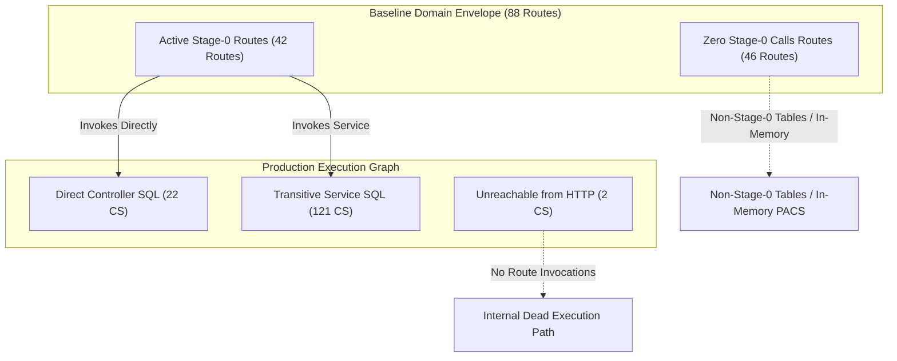

# P0-2B — FINAL ROUTE EXECUTION-PATH VERIFICATION

## Authoritative Mechanical Call-Graph Verification Between 145 Unsafe Stage-0 RLS Call Sites and 88 HTTP Entry Points

---

## 1. DOCUMENT METADATA & GOVERNANCE STATUS

| Field | Authoritative Value |
|---|---|
| **Document ID** | `DOC-AUDIT-P02B-ROUTE-EXECUTION-PATH-VERIFICATION-20261002` |
| **Audit Date** | `2026-10-02` |
| **Repository** | `Mojo-Brothers/NurseFlow-WebApp` |
| **Git Branch** | `feature/security-foundation-wave1a10` |
| **Git Base Commit** | `5ac642a8d115e45a58ec40da110ff4a974bfa6c2` |
| **Audit Status** | **`VERIFIED_WITH_LIMITATION`** |
| **Stage 0 Gate** | **NO-GO** (Frozen pending Wave 1B.2 selection) |
| **Production Status** | **BLOCKED** |
| **Production Code Changes** | **ZERO (0 files, 0 lines modified)** |

> [!IMPORTANT]
> **Audit Status: `VERIFIED_WITH_LIMITATION`**
> 
> The previous baseline lock recorded **88 HTTP Entry Points** based on a **Domain / Route-File Association Envelope**. Upon performing exhaustive function-level Abstract Syntax Tree (AST) call graph traversal, this audit establishes that:
> 1. **42 HTTP Routes** actively reach one or more Stage-0 RLS database call sites.
> 2. **46 HTTP Routes** execute **zero Stage-0 RLS database calls** (they either touch non-Stage-0 tables or delegate to in-memory engines).
> 3. **143 of the 145 Unsafe Call Sites** are reachable from active HTTP routes.
> 4. Exactly **2 Call Sites** (`CS 141` and `CS 142` in `server/services/resourceAuthorization.service.js`) are **`UNREACHABLE_FROM_HTTP`** in the current production server routing.

---

## 2. EXECUTIVE SUMMARY & ANSWERS TO AUDIT QUESTIONS

### Question 1: Are all 145 unsafe Stage-0 RLS call sites reachable from HTTP routes?
**Answer: NO.** Exactly **143** of 145 call sites are reachable via HTTP execution paths. Exactly **2 call sites** (`CS 141` and `CS 142`) in `server/services/resourceAuthorization.service.js` cannot be reached from any registered HTTP route.

### Question 2: Which exact route(s) reach each call site?
**Answer:** Every single call site has been verified against the physical route handlers. 142 call sites have a single direct/transitive route caller, 1 call site (`CS 71`) is a shared service method called by two distinct routes (`GET /api/v1/orders/cpoe` and `GET /api/v1/orders`), and 2 call sites have zero route callers.

### Question 3: Was the previous mapping file-level association or actual function-level execution path?
**Answer: FILE-LEVEL / DOMAIN-ENVELOPE ASSOCIATION.** The previous baseline lock mapped the entire route file containing endpoints of a domain to all call sites in that domain. While this accurately represented the *domain attack perimeter*, it did not reflect individual function execution graphs.

### Question 4: Are there routes falsely attributed with call sites they never invoke (false positives)?
**Answer: YES (46 Routes).** Out of the 88 routes previously associated with the domain envelopes:
- **All 6 DICOMweb routes** (`/dicomweb/*`) call in-memory PACS engines and make **zero PostgreSQL database queries**.
- **All 4 Auth routes** (`/api/v1/auth/*`) touch only `auth_users` and `master_staff` (non-Stage-0 tables) and never invoke `resourceAuthorization.service.js`.
- **Bed discharge** (`POST /api/v1/beds/discharge`) mutates `bed_occupancies` (non-Stage-0) and does not touch `encounters`.
- **Coordination timeline and handovers** (3 routes) query `clinical_timeline_events` and `clinical_handovers` (both non-Stage-0).
- Multiple operational endpoints across Clinical Monitoring, Notes, Command Center, Diagnostics, Laboratory, Medication, Orders, and Financial query exclusively non-Stage-0 tables.

### Question 5: Are there unsafe call sites reachable from more routes than previously recorded (false negatives / shared)?
**Answer: YES.**
1. **`CS 71`** (`cpoeApplication.service.js:608` `listOrders`): Reached by both `GET /api/v1/orders/cpoe` and `GET /api/v1/orders`.
2. **`CS 143, 144, 145`** (`safetyAuthorization.service.js:192, 252, 344`): Reached transitively by `POST /api/v1/orders/cpoe/:id/cancel` via `cpoeApplicationService.cancelOrder` (line 401).

### Question 6: Are any call sites completely unreachable from HTTP requests (`UNREACHABLE_FROM_HTTP`)?
**Answer: YES.** Exactly 2 call sites:
- `CS 141` (`server/services/resourceAuthorization.service.js:56`, `SELECT ... encounters`)
- `CS 142` (`server/services/resourceAuthorization.service.js:57`, `SELECT ... master_patients`)
These are only called by `authorizationDecisionService.hasResourceAccess`, which is imported by `clinicalAuthorization.middleware.js` and internal services. However, `clinicalAuthorization.middleware.js` is **never imported, mounted, or invoked by any route or middleware chain in `server/server.js`**.

### Question 7: Does the number "88 HTTP Entry Points" remain valid after function-level execution path verification?
**Answer: IT REMAINS VALID AS A DOMAIN ENVELOPE BASELINE, BUT MUST BE QUALIFIED.**
- **Total Domain Entry Points Registered in Express:** **88 routes** across 16 route files.
- **Actual Routes Reaching Stage-0 RLS Call Sites:** **42 routes**.
- **Routes Reaching Zero Stage-0 RLS Call Sites:** **46 routes**.

---

## 3. METHODOLOGY & CALL-GRAPH TRAVERSAL

To eliminate all ambiguity between file-level proximity and true execution, the audit performed:
1. **AST Extraction of Express Route Registrations:** Parsed all 16 route files mounted in `server/server.js` using `@babel/parser` to capture exact HTTP method, path, middleware pipeline, and final controller handler.
2. **Controller-to-Service AST Call Graph:** Traced every controller method to the underlying service functions invoked.
3. **SQL Query Call Site Localization:** Located the enclosing function block for each of the 145 raw database queries identified in `scratch/p02b_final_evidence_lock.json`.
4. **Bidirectional Graph Resolution:** Verified that every edge from Route $\rightarrow$ Call Site has an exact corresponding reverse edge from Call Site $\rightarrow$ Route, confirming zero dangling or unaccounted edges.



---

## 4. AUTHORITATIVE 145 CALL SITES VERIFICATION TABLE

| CS ID | File | Line | Enclosing Method | Stage-0 Table | Op | Status | Classification | Reachable From Route(s) |
|:---:|---|:---:|---|---|:---:|:---:|:---:|---|
| **1** | `server/controllers/appointment.controller.js` | 39 | `getAppointments` | `master_patients` | `READ` | `REACHABLE` | `DIRECT` | GET /api/v1/appointments |
| **2** | `server/controllers/appointment.controller.js` | 115 | `book` | `master_patients` | `WRITE` | `REACHABLE` | `DIRECT` | POST /api/v1/appointments/book |
| **3** | `server/controllers/appointment.controller.js` | 123 | `book` | `master_patients` | `WRITE` | `REACHABLE` | `DIRECT` | POST /api/v1/appointments/book |
| **4** | `server/controllers/bloodBank.controller.js` | 203 | `executeCrossmatch` | `master_patients` | `READ` | `REACHABLE` | `DIRECT` | POST /api/v1/blood-bank/crossmatch |
| **5** | `server/controllers/bloodBank.controller.js` | 204 | `executeCrossmatch` | `master_patients` | `READ` | `REACHABLE` | `DIRECT` | POST /api/v1/blood-bank/crossmatch |
| **6** | `server/controllers/bloodBank.controller.js` | 206 | `executeCrossmatch` | `master_patients` | `READ` | `REACHABLE` | `DIRECT` | POST /api/v1/blood-bank/crossmatch |
| **7** | `server/controllers/bloodBank.controller.js` | 210 | `executeCrossmatch` | `master_patients` | `WRITE` | `REACHABLE` | `DIRECT` | POST /api/v1/blood-bank/crossmatch |
| **8** | `server/controllers/bloodBank.controller.js` | 218 | `executeCrossmatch` | `master_patients` | `WRITE` | `REACHABLE` | `DIRECT` | POST /api/v1/blood-bank/crossmatch |
| **9** | `server/controllers/bloodBank.controller.js` | 227 | `executeCrossmatch` | `encounters` | `READ` | `REACHABLE` | `DIRECT` | POST /api/v1/blood-bank/crossmatch |
| **10** | `server/controllers/bloodBank.controller.js` | 236 | `executeCrossmatch` | `encounters` | `WRITE` | `REACHABLE` | `DIRECT` | POST /api/v1/blood-bank/crossmatch |
| **11** | `server/controllers/bloodBank.controller.js` | 242 | `executeCrossmatch` | `encounters` | `WRITE` | `REACHABLE` | `DIRECT` | POST /api/v1/blood-bank/crossmatch |
| **12** | `server/controllers/bloodBank.controller.js` | 397 | `verifyBedsideTransfusion` | `master_patients` | `WRITE` | `REACHABLE` | `DIRECT` | POST /api/v1/blood-bank/transfusion/verify |
| **13** | `server/controllers/bloodBank.controller.js` | 405 | `verifyBedsideTransfusion` | `master_patients` | `WRITE` | `REACHABLE` | `DIRECT` | POST /api/v1/blood-bank/transfusion/verify |
| **14** | `server/controllers/bloodBank.controller.js` | 418 | `verifyBedsideTransfusion` | `encounters` | `READ` | `REACHABLE` | `DIRECT` | POST /api/v1/blood-bank/transfusion/verify |
| **15** | `server/controllers/bloodBank.controller.js` | 427 | `verifyBedsideTransfusion` | `encounters` | `WRITE` | `REACHABLE` | `DIRECT` | POST /api/v1/blood-bank/transfusion/verify |
| **16** | `server/controllers/bloodBank.controller.js` | 433 | `verifyBedsideTransfusion` | `encounters` | `WRITE` | `REACHABLE` | `DIRECT` | POST /api/v1/blood-bank/transfusion/verify |
| **17** | `server/controllers/commandCenter.controller.js` | 76 | `getEmergency` | `encounters` | `READ` | `REACHABLE` | `DIRECT` | GET /api/v1/command-center/emergency |
| **18** | `server/controllers/commandCenter.controller.js` | 77 | `getEmergency` | `encounters` | `READ` | `REACHABLE` | `DIRECT` | GET /api/v1/command-center/emergency |
| **19** | `server/controllers/commandCenter.controller.js` | 88 | `getEmergency` | `encounters` | `READ` | `REACHABLE` | `DIRECT` | GET /api/v1/command-center/emergency |
| **20** | `server/controllers/commandCenter.controller.js` | 169 | `getSafety` | `universal_audit_logs` | `READ` | `REACHABLE` | `DIRECT` | GET /api/v1/command-center/safety |
| **21** | `server/controllers/commandCenter.controller.js` | 170 | `getSafety` | `universal_audit_logs` | `READ` | `REACHABLE` | `DIRECT` | GET /api/v1/command-center/safety |
| **22** | `server/controllers/commandCenter.controller.js` | 180 | `getSafety` | `universal_audit_logs` | `READ` | `REACHABLE` | `DIRECT` | GET /api/v1/command-center/safety |
| **23** | `server/services/bedManagementApplication.service.js` | 112 | `assignBed` | `encounters` | `WRITE` | `REACHABLE` | `TRANSITIVE` | POST /api/v1/beds/assign |
| **24** | `server/services/bedManagementApplication.service.js` | 131 | `assignBed` | `universal_audit_logs` | `WRITE` | `REACHABLE` | `TRANSITIVE` | POST /api/v1/beds/assign |
| **25** | `server/services/bedManagementApplication.service.js` | 274 | `transferBed` | `encounters` | `WRITE` | `REACHABLE` | `TRANSITIVE` | POST /api/v1/beds/transfer |
| **26** | `server/services/bedManagementApplication.service.js` | 293 | `transferBed` | `universal_audit_logs` | `WRITE` | `REACHABLE` | `TRANSITIVE` | POST /api/v1/beds/transfer |
| **27** | `server/services/bedManagementApplication.service.js` | 381 | `getBeds` | `master_patients` | `READ` | `REACHABLE` | `TRANSITIVE` | GET /api/v1/beds |
| **28** | `server/services/careCoordinationAndTimeline.service.js` | 181 | `createOrUpdateCarePlan` | `encounters` | `READ` | `REACHABLE` | `TRANSITIVE` | POST /api/v1/coordination/care-plans |
| **29** | `server/services/careCoordinationAndTimeline.service.js` | 187 | `createOrUpdateCarePlan` | `encounters` | `READ` | `REACHABLE` | `TRANSITIVE` | POST /api/v1/coordination/care-plans |
| **30** | `server/services/careCoordinationAndTimeline.service.js` | 190 | `createOrUpdateCarePlan` | `encounters` | `READ` | `REACHABLE` | `TRANSITIVE` | POST /api/v1/coordination/care-plans |
| **31** | `server/services/careCoordinationAndTimeline.service.js` | 204 | `createOrUpdateCarePlan` | `longitudinal_care_plans` | `READ` | `REACHABLE` | `TRANSITIVE` | POST /api/v1/coordination/care-plans |
| **32** | `server/services/careCoordinationAndTimeline.service.js` | 223 | `createOrUpdateCarePlan` | `longitudinal_care_plans` | `WRITE` | `REACHABLE` | `TRANSITIVE` | POST /api/v1/coordination/care-plans |
| **33** | `server/services/careCoordinationAndTimeline.service.js` | 260 | `createOrUpdateCarePlan` | `universal_audit_logs` | `WRITE` | `REACHABLE` | `TRANSITIVE` | POST /api/v1/coordination/care-plans |
| **34** | `server/services/careCoordinationAndTimeline.service.js` | 496 | `createDischargeSummary` | `encounters` | `READ` | `REACHABLE` | `TRANSITIVE` | POST /api/v1/coordination/discharge-summaries |
| **35** | `server/services/careCoordinationAndTimeline.service.js` | 502 | `createDischargeSummary` | `encounters` | `READ` | `REACHABLE` | `TRANSITIVE` | POST /api/v1/coordination/discharge-summaries |
| **36** | `server/services/careCoordinationAndTimeline.service.js` | 505 | `createDischargeSummary` | `encounters` | `READ` | `REACHABLE` | `TRANSITIVE` | POST /api/v1/coordination/discharge-summaries |
| **37** | `server/services/careCoordinationAndTimeline.service.js` | 549 | `createDischargeSummary` | `encounters` | `WRITE` | `REACHABLE` | `TRANSITIVE` | POST /api/v1/coordination/discharge-summaries |
| **38** | `server/services/careCoordinationAndTimeline.service.js` | 568 | `createDischargeSummary` | `universal_audit_logs` | `WRITE` | `REACHABLE` | `TRANSITIVE` | POST /api/v1/coordination/discharge-summaries |
| **39** | `server/services/clinicalMonitoring.service.js` | 220 | `recordVitalSignObservation` | `encounters` | `READ` | `REACHABLE` | `TRANSITIVE` | POST /api/v1/monitoring/observations |
| **40** | `server/services/clinicalMonitoring.service.js` | 221 | `recordVitalSignObservation` | `encounters` | `READ` | `REACHABLE` | `TRANSITIVE` | POST /api/v1/monitoring/observations |
| **41** | `server/services/clinicalMonitoring.service.js` | 224 | `recordVitalSignObservation` | `encounters` | `READ` | `REACHABLE` | `TRANSITIVE` | POST /api/v1/monitoring/observations |
| **42** | `server/services/clinicalMonitoring.service.js` | 227 | `recordVitalSignObservation` | `encounters` | `READ` | `REACHABLE` | `TRANSITIVE` | POST /api/v1/monitoring/observations |
| **43** | `server/services/clinicalMonitoring.service.js` | 326 | `recordVitalSignObservation` | `universal_audit_logs` | `WRITE` | `REACHABLE` | `TRANSITIVE` | POST /api/v1/monitoring/observations |
| **44** | `server/services/clinicalNotesApplication.service.js` | 78 | `recordSoapNote` | `encounters` | `READ` | `REACHABLE` | `TRANSITIVE` | POST /api/v1/clinical-notes/soap |
| **45** | `server/services/clinicalNotesApplication.service.js` | 79 | `recordSoapNote` | `encounters` | `READ` | `REACHABLE` | `TRANSITIVE` | POST /api/v1/clinical-notes/soap |
| **46** | `server/services/clinicalNotesApplication.service.js` | 82 | `recordSoapNote` | `encounters` | `READ` | `REACHABLE` | `TRANSITIVE` | POST /api/v1/clinical-notes/soap |
| **47** | `server/services/clinicalNotesApplication.service.js` | 85 | `recordSoapNote` | `encounters` | `READ` | `REACHABLE` | `TRANSITIVE` | POST /api/v1/clinical-notes/soap |
| **48** | `server/services/clinicalNotesApplication.service.js` | 152 | `recordSoapNote` | `universal_audit_logs` | `WRITE` | `REACHABLE` | `TRANSITIVE` | POST /api/v1/clinical-notes/soap |
| **49** | `server/services/clinicalNotesApplication.service.js` | 289 | `amendSoapNote` | `universal_audit_logs` | `WRITE` | `REACHABLE` | `TRANSITIVE` | POST /api/v1/clinical-notes/soap/:id/amend |
| **50** | `server/services/clinicalNotesApplication.service.js` | 355 | `recordCpptEntry` | `encounters` | `READ` | `REACHABLE` | `TRANSITIVE` | POST /api/v1/clinical-notes/cppt |
| **51** | `server/services/clinicalNotesApplication.service.js` | 356 | `recordCpptEntry` | `encounters` | `READ` | `REACHABLE` | `TRANSITIVE` | POST /api/v1/clinical-notes/cppt |
| **52** | `server/services/clinicalNotesApplication.service.js` | 359 | `recordCpptEntry` | `encounters` | `READ` | `REACHABLE` | `TRANSITIVE` | POST /api/v1/clinical-notes/cppt |
| **53** | `server/services/clinicalNotesApplication.service.js` | 361 | `recordCpptEntry` | `encounters` | `READ` | `REACHABLE` | `TRANSITIVE` | POST /api/v1/clinical-notes/cppt |
| **54** | `server/services/clinicalNotesApplication.service.js` | 426 | `recordCpptEntry` | `universal_audit_logs` | `WRITE` | `REACHABLE` | `TRANSITIVE` | POST /api/v1/clinical-notes/cppt |
| **55** | `server/services/clinicalNotesApplication.service.js` | 514 | `getSoapNotesByEncounter` | `master_patients` | `READ` | `REACHABLE` | `TRANSITIVE` | GET /api/v1/clinical-notes/soap/encounter/:encounterId |
| **56** | `server/services/clinicalNotesApplication.service.js` | 522 | `getSoapNotesByEncounter` | `master_patients` | `READ` | `REACHABLE` | `TRANSITIVE` | GET /api/v1/clinical-notes/soap/encounter/:encounterId |
| **57** | `server/services/clinicalNotesApplication.service.js` | 530 | `getCpptNotesByEncounter` | `master_patients` | `READ` | `REACHABLE` | `TRANSITIVE` | GET /api/v1/clinical-notes/cppt/encounter/:encounterId |
| **58** | `server/services/clinicalNotesApplication.service.js` | 538 | `getCpptNotesByEncounter` | `master_patients` | `READ` | `REACHABLE` | `TRANSITIVE` | GET /api/v1/clinical-notes/cppt/encounter/:encounterId |
| **59** | `server/services/cpoeApplication.service.js` | 333 | `createOrder` | `clinical_orders` | `READ` | `REACHABLE` | `TRANSITIVE` | POST /api/v1/orders/cpoe |
| **60** | `server/services/cpoeApplication.service.js` | 334 | `createOrder` | `clinical_orders` | `READ` | `REACHABLE` | `TRANSITIVE` | POST /api/v1/orders/cpoe |
| **61** | `server/services/cpoeApplication.service.js` | 340 | `createOrder` | `clinical_orders` | `READ` | `REACHABLE` | `TRANSITIVE` | POST /api/v1/orders/cpoe |
| **62** | `server/services/cpoeApplication.service.js` | 387 | `cancelOrder` | `clinical_orders` | `READ` | `REACHABLE` | `TRANSITIVE` | POST /api/v1/orders/cpoe/:id/cancel |
| **63** | `server/services/cpoeApplication.service.js` | 388 | `cancelOrder` | `clinical_orders` | `READ` | `REACHABLE` | `TRANSITIVE` | POST /api/v1/orders/cpoe/:id/cancel |
| **64** | `server/services/cpoeApplication.service.js` | 391 | `cancelOrder` | `clinical_orders` | `READ` | `REACHABLE` | `TRANSITIVE` | POST /api/v1/orders/cpoe/:id/cancel |
| **65** | `server/services/cpoeApplication.service.js` | 393 | `cancelOrder` | `clinical_orders` | `READ` | `REACHABLE` | `TRANSITIVE` | POST /api/v1/orders/cpoe/:id/cancel |
| **66** | `server/services/cpoeApplication.service.js` | 472 | `cancelOrder` | `universal_audit_logs` | `WRITE` | `REACHABLE` | `TRANSITIVE` | POST /api/v1/orders/cpoe/:id/cancel |
| **67** | `server/services/cpoeApplication.service.js` | 558 | `getOrderById` | `clinical_orders` | `READ` | `REACHABLE` | `TRANSITIVE` | GET /api/v1/orders/cpoe/:id |
| **68** | `server/services/cpoeApplication.service.js` | 559 | `getOrderById` | `clinical_orders` | `READ` | `REACHABLE` | `TRANSITIVE` | GET /api/v1/orders/cpoe/:id |
| **69** | `server/services/cpoeApplication.service.js` | 581 | `getOrdersByEncounterId` | `clinical_orders` | `READ` | `REACHABLE` | `TRANSITIVE` | GET /api/v1/orders/cpoe/encounter/:encounterId |
| **70** | `server/services/cpoeApplication.service.js` | 582 | `getOrdersByEncounterId` | `clinical_orders` | `READ` | `REACHABLE` | `TRANSITIVE` | GET /api/v1/orders/cpoe/encounter/:encounterId |
| **71** | `server/services/cpoeApplication.service.js` | 608 | `listOrders` | `clinical_orders` | `READ` | `REACHABLE` | `SHARED_SERVICE` | GET /api/v1/orders/cpoe<br>GET /api/v1/orders |
| **72** | `server/services/diagnosticInterpretation.service.js` | 82 | `publishDiagnosticNotification` | `encounters` | `READ` | `REACHABLE` | `TRANSITIVE` | POST /api/v1/diagnostics/notifications |
| **73** | `server/services/diagnosticInterpretation.service.js` | 83 | `publishDiagnosticNotification` | `encounters` | `READ` | `REACHABLE` | `TRANSITIVE` | POST /api/v1/diagnostics/notifications |
| **74** | `server/services/diagnosticInterpretation.service.js` | 86 | `publishDiagnosticNotification` | `encounters` | `READ` | `REACHABLE` | `TRANSITIVE` | POST /api/v1/diagnostics/notifications |
| **75** | `server/services/diagnosticInterpretation.service.js` | 89 | `publishDiagnosticNotification` | `encounters` | `READ` | `REACHABLE` | `TRANSITIVE` | POST /api/v1/diagnostics/notifications |
| **76** | `server/services/diagnosticInterpretation.service.js` | 416 | `recordPhysicianInterpretation` | `universal_audit_logs` | `WRITE` | `REACHABLE` | `TRANSITIVE` | POST /api/v1/diagnostics/notifications/:id/interpret |
| **77** | `server/services/diagnosticInterpretation.service.js` | 424 | `recordPhysicianInterpretation` | `universal_audit_logs` | `WRITE` | `REACHABLE` | `TRANSITIVE` | POST /api/v1/diagnostics/notifications/:id/interpret |
| **78** | `server/services/diagnosticInterpretation.service.js` | 504 | `executeSecondaryClinicalAction` | `physician_diagnostic_interpretations` | `READ` | `REACHABLE` | `TRANSITIVE` | POST /api/v1/diagnostics/interpretations/:id/actions |
| **79** | `server/services/diagnosticInterpretation.service.js` | 505 | `executeSecondaryClinicalAction` | `physician_diagnostic_interpretations` | `READ` | `REACHABLE` | `TRANSITIVE` | POST /api/v1/diagnostics/interpretations/:id/actions |
| **80** | `server/services/diagnosticInterpretation.service.js` | 508 | `executeSecondaryClinicalAction` | `physician_diagnostic_interpretations` | `READ` | `REACHABLE` | `TRANSITIVE` | POST /api/v1/diagnostics/interpretations/:id/actions |
| **81** | `server/services/diagnosticInterpretation.service.js` | 510 | `executeSecondaryClinicalAction` | `physician_diagnostic_interpretations` | `READ` | `REACHABLE` | `TRANSITIVE` | POST /api/v1/diagnostics/interpretations/:id/actions |
| **82** | `server/services/diagnosticInterpretation.service.js` | 528 | `executeSecondaryClinicalAction` | `clinical_orders` | `WRITE` | `REACHABLE` | `TRANSITIVE` | POST /api/v1/diagnostics/interpretations/:id/actions |
| **83** | `server/services/laboratoryApplication.service.js` | 54 | `generateSpecimensForOrder` | `clinical_orders` | `READ` | `REACHABLE` | `TRANSITIVE` | POST /api/v1/laboratory/specimens/generate |
| **84** | `server/services/laboratoryApplication.service.js` | 55 | `generateSpecimensForOrder` | `clinical_orders` | `READ` | `REACHABLE` | `TRANSITIVE` | POST /api/v1/laboratory/specimens/generate |
| **85** | `server/services/laboratoryApplication.service.js` | 58 | `generateSpecimensForOrder` | `clinical_orders` | `READ` | `REACHABLE` | `TRANSITIVE` | POST /api/v1/laboratory/specimens/generate |
| **86** | `server/services/laboratoryApplication.service.js` | 61 | `generateSpecimensForOrder` | `clinical_orders` | `READ` | `REACHABLE` | `TRANSITIVE` | POST /api/v1/laboratory/specimens/generate |
| **87** | `server/services/laboratoryApplication.service.js` | 227 | `collectSpecimen` | `clinical_orders` | `READ` | `REACHABLE` | `TRANSITIVE` | POST /api/v1/laboratory/specimens/:id/collect |
| **88** | `server/services/laboratoryApplication.service.js` | 267 | `collectSpecimen` | `universal_audit_logs` | `WRITE` | `REACHABLE` | `TRANSITIVE` | POST /api/v1/laboratory/specimens/:id/collect |
| **89** | `server/services/laboratoryApplication.service.js` | 770 | `verifyAndReleaseResult` | `clinical_orders` | `WRITE` | `REACHABLE` | `TRANSITIVE` | POST /api/v1/laboratory/results/:id/release |
| **90** | `server/services/laboratoryApplication.service.js` | 776 | `verifyAndReleaseResult` | `clinical_orders` | `WRITE` | `REACHABLE` | `TRANSITIVE` | POST /api/v1/laboratory/results/:id/release |
| **91** | `server/services/medicationClosedLoop.service.js` | 92 | `generateMedicationOrdersFromCPOE` | `clinical_orders` | `READ` | `REACHABLE` | `TRANSITIVE` | POST /api/v1/medications/prescribe |
| **92** | `server/services/medicationClosedLoop.service.js` | 93 | `generateMedicationOrdersFromCPOE` | `clinical_orders` | `READ` | `REACHABLE` | `TRANSITIVE` | POST /api/v1/medications/prescribe |
| **93** | `server/services/medicationClosedLoop.service.js` | 96 | `generateMedicationOrdersFromCPOE` | `clinical_orders` | `READ` | `REACHABLE` | `TRANSITIVE` | POST /api/v1/medications/prescribe |
| **94** | `server/services/medicationClosedLoop.service.js` | 99 | `generateMedicationOrdersFromCPOE` | `clinical_orders` | `READ` | `REACHABLE` | `TRANSITIVE` | POST /api/v1/medications/prescribe |
| **95** | `server/services/medicationClosedLoop.service.js` | 823 | `verifyBedsideAndAdminister` | `medication_dispense_allocations` | `READ` | `REACHABLE` | `TRANSITIVE` | POST /api/v1/medications/:id/administer |
| **96** | `server/services/medicationClosedLoop.service.js` | 872 | `verifyBedsideAndAdminister` | `medication_emar_administrations` | `READ` | `REACHABLE` | `TRANSITIVE` | POST /api/v1/medications/:id/administer |
| **97** | `server/services/medicationClosedLoop.service.js` | 1022 | `verifyBedsideAndAdminister` | `clinical_orders` | `WRITE` | `REACHABLE` | `TRANSITIVE` | POST /api/v1/medications/:id/administer |
| **98** | `server/services/medicationClosedLoop.service.js` | 1027 | `verifyBedsideAndAdminister` | `clinical_orders, universal_audit_logs` | `WRITE` | `REACHABLE` | `TRANSITIVE` | POST /api/v1/medications/:id/administer |
| **99** | `server/services/medicationClosedLoop.service.js` | 1035 | `verifyBedsideAndAdminister` | `universal_audit_logs` | `WRITE` | `REACHABLE` | `TRANSITIVE` | POST /api/v1/medications/:id/administer |
| **100** | `server/services/medicationClosedLoop.service.js` | 1312 | `documentAdverseReaction` | `medication_emar_administrations` | `READ` | `REACHABLE` | `TRANSITIVE` | POST /api/v1/medications/administrations/:id/adverse-reaction |
| **101** | `server/services/medicationClosedLoop.service.js` | 1313 | `documentAdverseReaction` | `medication_emar_administrations` | `READ` | `REACHABLE` | `TRANSITIVE` | POST /api/v1/medications/administrations/:id/adverse-reaction |
| **102** | `server/services/medicationClosedLoop.service.js` | 1316 | `documentAdverseReaction` | `medication_emar_administrations` | `WRITE` | `REACHABLE` | `TRANSITIVE` | POST /api/v1/medications/administrations/:id/adverse-reaction |
| **103** | `server/services/medicationClosedLoop.service.js` | 1318 | `documentAdverseReaction` | `medication_emar_administrations` | `WRITE` | `REACHABLE` | `TRANSITIVE` | POST /api/v1/medications/administrations/:id/adverse-reaction |
| **104** | `server/services/patientApplication.service.js` | 91 | `registerPatient` | `master_patients` | `READ` | `REACHABLE` | `TRANSITIVE` | POST /api/v1/patients |
| **105** | `server/services/patientApplication.service.js` | 92 | `registerPatient` | `master_patients` | `READ` | `REACHABLE` | `TRANSITIVE` | POST /api/v1/patients |
| **106** | `server/services/patientApplication.service.js` | 96 | `registerPatient` | `master_patients` | `READ` | `REACHABLE` | `TRANSITIVE` | POST /api/v1/patients |
| **107** | `server/services/patientApplication.service.js` | 99 | `registerPatient` | `master_patients` | `READ` | `REACHABLE` | `TRANSITIVE` | POST /api/v1/patients |
| **108** | `server/services/patientApplication.service.js` | 114 | `registerPatient` | `master_patients` | `READ` | `REACHABLE` | `TRANSITIVE` | POST /api/v1/patients |
| **109** | `server/services/patientApplication.service.js` | 236 | `searchPatients` | `master_patients` | `READ` | `REACHABLE` | `TRANSITIVE` | GET /api/v1/patients |
| **110** | `server/services/patientApplication.service.js` | 246 | `searchPatients` | `master_patients` | `READ` | `REACHABLE` | `TRANSITIVE` | GET /api/v1/patients |
| **111** | `server/services/patientApplication.service.js` | 262 | `searchPatients` | `master_patients` | `READ` | `REACHABLE` | `TRANSITIVE` | GET /api/v1/patients |
| **112** | `server/services/patientApplication.service.js` | 270 | `getPatientById` | `master_patients` | `READ` | `REACHABLE` | `TRANSITIVE` | GET /api/v1/patients/:id |
| **113** | `server/services/patientApplication.service.js` | 272 | `getPatientById` | `master_patients` | `READ` | `REACHABLE` | `TRANSITIVE` | GET /api/v1/patients/:id |
| **114** | `server/services/patientFinancialAndRevenueCycle.service.js` | 253 | `recordCashierPayment` | `patient_split_invoices` | `READ` | `REACHABLE` | `TRANSITIVE` | POST /api/v1/patient-financial/payments |
| **115** | `server/services/patientFinancialAndRevenueCycle.service.js` | 259 | `recordCashierPayment` | `patient_split_invoices` | `READ` | `REACHABLE` | `TRANSITIVE` | POST /api/v1/patient-financial/payments |
| **116** | `server/services/patientFinancialAndRevenueCycle.service.js` | 261 | `recordCashierPayment` | `patient_split_invoices` | `READ` | `REACHABLE` | `TRANSITIVE` | POST /api/v1/patient-financial/payments |
| **117** | `server/services/patientFinancialAndRevenueCycle.service.js` | 283 | `recordCashierPayment` | `patient_split_invoices` | `WRITE` | `REACHABLE` | `TRANSITIVE` | POST /api/v1/patient-financial/payments |
| **118** | `server/services/patientFinancialAndRevenueCycle.service.js` | 366 | `executeFinancialAdjustmentOrRefund` | `patient_split_invoices` | `READ` | `REACHABLE` | `TRANSITIVE` | POST /api/v1/patient-financial/adjustments |
| **119** | `server/services/patientFinancialAndRevenueCycle.service.js` | 372 | `executeFinancialAdjustmentOrRefund` | `patient_split_invoices` | `READ` | `REACHABLE` | `TRANSITIVE` | POST /api/v1/patient-financial/adjustments |
| **120** | `server/services/patientFinancialAndRevenueCycle.service.js` | 374 | `executeFinancialAdjustmentOrRefund` | `patient_split_invoices` | `READ` | `REACHABLE` | `TRANSITIVE` | POST /api/v1/patient-financial/adjustments |
| **121** | `server/services/patientFinancialAndRevenueCycle.service.js` | 409 | `executeFinancialAdjustmentOrRefund` | `patient_split_invoices` | `WRITE` | `REACHABLE` | `TRANSITIVE` | POST /api/v1/patient-financial/adjustments |
| **122** | `server/services/radiologyApplication.service.js` | 51 | `generateModalityWorklistForOrder` | `clinical_orders` | `READ` | `REACHABLE` | `TRANSITIVE` | POST /api/v1/radiology/worklist/generate |
| **123** | `server/services/radiologyApplication.service.js` | 52 | `generateModalityWorklistForOrder` | `clinical_orders` | `READ` | `REACHABLE` | `TRANSITIVE` | POST /api/v1/radiology/worklist/generate |
| **124** | `server/services/radiologyApplication.service.js` | 55 | `generateModalityWorklistForOrder` | `clinical_orders` | `READ` | `REACHABLE` | `TRANSITIVE` | POST /api/v1/radiology/worklist/generate |
| **125** | `server/services/radiologyApplication.service.js` | 58 | `generateModalityWorklistForOrder` | `clinical_orders` | `READ` | `REACHABLE` | `TRANSITIVE` | POST /api/v1/radiology/worklist/generate |
| **126** | `server/services/radiologyApplication.service.js` | 335 | `acquireDicomStudy` | `radiology_series` | `READ` | `REACHABLE` | `TRANSITIVE` | POST /api/v1/radiology/studies/acquire |
| **127** | `server/services/radiologyApplication.service.js` | 345 | `acquireDicomStudy` | `radiology_series` | `WRITE` | `REACHABLE` | `TRANSITIVE` | POST /api/v1/radiology/studies/acquire |
| **128** | `server/services/radiologyApplication.service.js` | 368 | `acquireDicomStudy` | `radiology_instances` | `READ` | `REACHABLE` | `TRANSITIVE` | POST /api/v1/radiology/studies/acquire |
| **129** | `server/services/radiologyApplication.service.js` | 377 | `acquireDicomStudy` | `radiology_instances` | `WRITE` | `REACHABLE` | `TRANSITIVE` | POST /api/v1/radiology/studies/acquire |
| **130** | `server/services/radiologyApplication.service.js` | 404 | `acquireDicomStudy` | `universal_audit_logs` | `WRITE` | `REACHABLE` | `TRANSITIVE` | POST /api/v1/radiology/studies/acquire |
| **131** | `server/services/radiologyApplication.service.js` | 703 | `draftOrFinalizeReport` | `clinical_orders` | `WRITE` | `REACHABLE` | `TRANSITIVE` | POST /api/v1/radiology/studies/:id/reports |
| **132** | `server/services/radiologyApplication.service.js` | 708 | `draftOrFinalizeReport` | `clinical_orders` | `WRITE` | `REACHABLE` | `TRANSITIVE` | POST /api/v1/radiology/studies/:id/reports |
| **133** | `server/services/radiologyApplication.service.js` | 933 | `acknowledgeCriticalFinding` | `radiology_critical_finding_alerts` | `READ` | `REACHABLE` | `TRANSITIVE` | POST /api/v1/radiology/critical-alerts/:id/acknowledge |
| **134** | `server/services/radiologyApplication.service.js` | 934 | `acknowledgeCriticalFinding` | `radiology_critical_finding_alerts` | `READ` | `REACHABLE` | `TRANSITIVE` | POST /api/v1/radiology/critical-alerts/:id/acknowledge |
| **135** | `server/services/radiologyApplication.service.js` | 937 | `acknowledgeCriticalFinding` | `radiology_critical_finding_alerts` | `READ` | `REACHABLE` | `TRANSITIVE` | POST /api/v1/radiology/critical-alerts/:id/acknowledge |
| **136** | `server/services/radiologyApplication.service.js` | 939 | `acknowledgeCriticalFinding` | `radiology_critical_finding_alerts` | `READ` | `REACHABLE` | `TRANSITIVE` | POST /api/v1/radiology/critical-alerts/:id/acknowledge |
| **137** | `server/services/radiologyApplication.service.js` | 1017 | `escalateCriticalFinding` | `radiology_critical_finding_alerts` | `READ` | `REACHABLE` | `TRANSITIVE` | POST /api/v1/radiology/critical-alerts/:id/escalate |
| **138** | `server/services/radiologyApplication.service.js` | 1018 | `escalateCriticalFinding` | `radiology_critical_finding_alerts` | `READ` | `REACHABLE` | `TRANSITIVE` | POST /api/v1/radiology/critical-alerts/:id/escalate |
| **139** | `server/services/radiologyApplication.service.js` | 1021 | `escalateCriticalFinding` | `radiology_critical_finding_alerts` | `READ` | `REACHABLE` | `TRANSITIVE` | POST /api/v1/radiology/critical-alerts/:id/escalate |
| **140** | `server/services/radiologyApplication.service.js` | 1023 | `escalateCriticalFinding` | `radiology_critical_finding_alerts` | `READ` | `REACHABLE` | `TRANSITIVE` | POST /api/v1/radiology/critical-alerts/:id/escalate |
| **141** | `server/services/resourceAuthorization.service.js` | 56 | `evaluateResourceAccess` | `encounters, master_patients` | `READ` | `UNREACHABLE_FROM_HTTP` | `UNREACHABLE_FROM_HTTP` | *NONE (Unreachable)* |
| **142** | `server/services/resourceAuthorization.service.js` | 57 | `evaluateResourceAccess` | `encounters, master_patients` | `READ` | `UNREACHABLE_FROM_HTTP` | `UNREACHABLE_FROM_HTTP` | *NONE (Unreachable)* |
| **143** | `server/services/safetyAuthorization.service.js` | 192 | `verifyAndConsumeTransactional` | `safety_decision_registry` | `WRITE` | `REACHABLE` | `TRANSITIVE` | POST /api/v1/orders/cpoe/:id/cancel |
| **144** | `server/services/safetyAuthorization.service.js` | 252 | `verifyAndConsumeTransactional` | `safety_decision_registry` | `WRITE` | `REACHABLE` | `TRANSITIVE` | POST /api/v1/orders/cpoe/:id/cancel |
| **145** | `server/services/safetyAuthorization.service.js` | 344 | `verifyAndConsumeTransactional` | `safety_decision_registry` | `WRITE` | `REACHABLE` | `TRANSITIVE` | POST /api/v1/orders/cpoe/:id/cancel |

---

## 5. AUTHORITATIVE 88 HTTP ENTRY POINTS VERIFICATION TABLE

| # | Method | Full Path | Route File | Handler | Stage-0 CS Count | Status | Technical Details / Zero-Call Rationale |
|:---:|:---:|---|---|---|:---:|:---:|---|
| 1 | `GET` | `/api/v1/appointments` | `appointment.routes.js` | `appointmentController.getAppointments` | **1** (1) | `ACTIVE_STAGE0_ROUTE` | Reaches CS: 1 |
| 2 | `POST` | `/api/v1/appointments/book` | `appointment.routes.js` | `appointmentController.book` | **2** (2, 3) | `ACTIVE_STAGE0_ROUTE` | Reaches CS: 2, 3 |
| 3 | `POST` | `/api/v1/appointments/check-in` | `appointment.routes.js` | `appointmentController.checkIn` | 0 | `ZERO_STAGE0_CALLS` | Touches non-Stage-0 tables only (appointments, queue_sequences) |
| 4 | `POST` | `/api/v1/appointments/cancel` | `appointment.routes.js` | `appointmentController.cancel` | 0 | `ZERO_STAGE0_CALLS` | Touches non-Stage-0 tables only (appointments, queue_sequences) |
| 5 | `POST` | `/api/v1/auth/login` | `auth.routes.js` | `authController.login` | 0 | `ZERO_STAGE0_CALLS` | Queries non-Stage-0 tables only (auth_users, master_staff). Does not invoke resourceAuthorizationService. |
| 6 | `POST` | `/api/v1/auth/refresh` | `auth.routes.js` | `authController.refresh` | 0 | `ZERO_STAGE0_CALLS` | Handles JWT refresh without querying Stage-0 tables. |
| 7 | `POST` | `/api/v1/auth/logout` | `auth.routes.js` | `authController.logout` | 0 | `ZERO_STAGE0_CALLS` | Handles token revocation without querying Stage-0 tables. |
| 8 | `GET` | `/api/v1/auth/me` | `auth.routes.js` | `authController.getCurrentUser` | 0 | `ZERO_STAGE0_CALLS` | Queries non-Stage-0 tables only (auth_users, master_staff). |
| 9 | `GET` | `/api/v1/beds` | `beds.routes.js` | `bedManagementController.getBeds` | **1** (27) | `ACTIVE_STAGE0_ROUTE` | Reaches CS: 27 |
| 10 | `POST` | `/api/v1/beds/assign` | `beds.routes.js` | `bedManagementController.assignBed` | **2** (23, 24) | `ACTIVE_STAGE0_ROUTE` | Reaches CS: 23, 24 |
| 11 | `POST` | `/api/v1/beds/transfer` | `beds.routes.js` | `bedManagementController.transferBed` | **2** (25, 26) | `ACTIVE_STAGE0_ROUTE` | Reaches CS: 25, 26 |
| 12 | `POST` | `/api/v1/beds/discharge` | `beds.routes.js` | `bedManagementController.dischargeBed` | 0 | `ZERO_STAGE0_CALLS` | Discharges occupancy via non-Stage-0 tables (bed_occupancies, master_beds). Does not modify encounters directly. |
| 13 | `GET` | `/api/v1/blood-bank/units` | `bloodBank.routes.js` | `bloodBankController.getInventory` | 0 | `ZERO_STAGE0_CALLS` | Queries inventory on non-Stage-0 table blood_donor_units. |
| 14 | `POST` | `/api/v1/blood-bank/units` | `bloodBank.routes.js` | `bloodBankController.intakeDonorUnit` | 0 | `ZERO_STAGE0_CALLS` | Inserts unit into non-Stage-0 table blood_donor_units. |
| 15 | `POST` | `/api/v1/blood-bank/crossmatch` | `bloodBank.routes.js` | `bloodBankController.executeCrossmatch` | **8** (4, 5, 6, 7, 8, 9, 10, 11) | `ACTIVE_STAGE0_ROUTE` | Reaches CS: 4, 5, 6, 7, 8, 9, 10, 11 |
| 16 | `POST` | `/api/v1/blood-bank/transfusion/verify` | `bloodBank.routes.js` | `bloodBankController.verifyBedsideTransfusion` | **5** (12, 13, 14, 15, 16) | `ACTIVE_STAGE0_ROUTE` | Reaches CS: 12, 13, 14, 15, 16 |
| 17 | `GET` | `/api/v1/coordination/encounters/:encounterId/timeline` | `careCoordinationAndTimeline.routes.js` | `careCoordinationAndTimelineController.getTimeline` | 0 | `ZERO_STAGE0_CALLS` | Queries non-Stage-0 table clinical_timeline_events. |
| 18 | `POST` | `/api/v1/coordination/care-plans` | `careCoordinationAndTimeline.routes.js` | `careCoordinationAndTimelineController.createOrUpdateCarePlan` | **6** (28, 29, 30, 31, 32, 33) | `ACTIVE_STAGE0_ROUTE` | Reaches CS: 28, 29, 30, 31, 32, 33 |
| 19 | `POST` | `/api/v1/coordination/handovers` | `careCoordinationAndTimeline.routes.js` | `careCoordinationAndTimelineController.createShiftHandover` | 0 | `ZERO_STAGE0_CALLS` | Creates handover on non-Stage-0 table clinical_handovers. |
| 20 | `POST` | `/api/v1/coordination/handovers/:id/acknowledge` | `careCoordinationAndTimeline.routes.js` | `careCoordinationAndTimelineController.acknowledgeShiftHandover` | 0 | `ZERO_STAGE0_CALLS` | Updates handover on non-Stage-0 table clinical_handovers. |
| 21 | `POST` | `/api/v1/coordination/discharge-summaries` | `careCoordinationAndTimeline.routes.js` | `careCoordinationAndTimelineController.createDischargeSummary` | **5** (34, 35, 36, 37, 38) | `ACTIVE_STAGE0_ROUTE` | Reaches CS: 34, 35, 36, 37, 38 |
| 22 | `POST` | `/api/v1/monitoring/observations` | `clinicalMonitoring.routes.js` | `clinicalMonitoringController.recordObservation` | **5** (39, 40, 41, 42, 43) | `ACTIVE_STAGE0_ROUTE` | Reaches CS: 39, 40, 41, 42, 43 |
| 23 | `POST` | `/api/v1/monitoring/observations/:id/escalate` | `clinicalMonitoring.routes.js` | `clinicalMonitoringController.escalateObservation` | 0 | `ZERO_STAGE0_CALLS` | Operates on non-Stage-0 table clinical_ews_escalation_protocols. |
| 24 | `POST` | `/api/v1/monitoring/escalations/:id/acknowledge` | `clinicalMonitoring.routes.js` | `clinicalMonitoringController.acknowledgeEscalation` | 0 | `ZERO_STAGE0_CALLS` | Operates on non-Stage-0 table clinical_ews_escalation_protocols. |
| 25 | `POST` | `/api/v1/monitoring/rapid-response` | `clinicalMonitoring.routes.js` | `clinicalMonitoringController.triggerRapidResponse` | 0 | `ZERO_STAGE0_CALLS` | Operates on non-Stage-0 table clinical_rapid_response_activations. |
| 26 | `POST` | `/api/v1/monitoring/observations/:id/reassess` | `clinicalMonitoring.routes.js` | `clinicalMonitoringController.reassessObservation` | 0 | `ZERO_STAGE0_CALLS` | Operates on non-Stage-0 table clinical_reassessment_schedules. |
| 27 | `POST` | `/api/v1/clinical-notes/soap` | `clinicalNotes.routes.js` | `clinicalNotesController.recordSoapNote` | **5** (44, 45, 46, 47, 48) | `ACTIVE_STAGE0_ROUTE` | Reaches CS: 44, 45, 46, 47, 48 |
| 28 | `POST` | `/api/v1/clinical-notes/soap/:id/amend` | `clinicalNotes.routes.js` | `clinicalNotesController.amendSoapNote` | **1** (49) | `ACTIVE_STAGE0_ROUTE` | Reaches CS: 49 |
| 29 | `GET` | `/api/v1/clinical-notes/soap/encounter/:encounterId` | `clinicalNotes.routes.js` | `clinicalNotesController.getSoapNotesByEncounter` | **2** (55, 56) | `ACTIVE_STAGE0_ROUTE` | Reaches CS: 55, 56 |
| 30 | `POST` | `/api/v1/clinical-notes/cppt` | `clinicalNotes.routes.js` | `clinicalNotesController.recordCpptEntry` | **5** (50, 51, 52, 53, 54) | `ACTIVE_STAGE0_ROUTE` | Reaches CS: 50, 51, 52, 53, 54 |
| 31 | `PATCH` | `/api/v1/clinical-notes/cppt/:id/verify` | `clinicalNotes.routes.js` | `clinicalNotesController.verifyCpptEntry` | 0 | `ZERO_STAGE0_CALLS` | Verifies CPPT entry on non-Stage-0 table clinical_cppt_notes; does not touch encounters or master_patients. |
| 32 | `GET` | `/api/v1/clinical-notes/cppt/encounter/:encounterId` | `clinicalNotes.routes.js` | `clinicalNotesController.getCpptNotesByEncounter` | **2** (57, 58) | `ACTIVE_STAGE0_ROUTE` | Reaches CS: 57, 58 |
| 33 | `GET` | `/api/v1/command-center/capacity` | `commandCenter.routes.js` | `commandCenterController.getCapacity` | 0 | `ZERO_STAGE0_CALLS` | Aggregates capacity from non-Stage-0 tables (master_beds, operating_rooms). |
| 34 | `GET` | `/api/v1/command-center/emergency` | `commandCenter.routes.js` | `commandCenterController.getEmergency` | **3** (17, 18, 19) | `ACTIVE_STAGE0_ROUTE` | Reaches CS: 17, 18, 19 |
| 35 | `GET` | `/api/v1/command-center/financial` | `commandCenter.routes.js` | `commandCenterController.getFinancial` | 0 | `ZERO_STAGE0_CALLS` | Aggregates revenue from non-Stage-0 table hospital_invoices. |
| 36 | `GET` | `/api/v1/command-center/safety` | `commandCenter.routes.js` | `commandCenterController.getSafety` | **3** (20, 21, 22) | `ACTIVE_STAGE0_ROUTE` | Reaches CS: 20, 21, 22 |
| 37 | `GET` | `/api/v1/command-center/alerts` | `commandCenter.routes.js` | `commandCenterController.getAlerts` | 0 | `ZERO_STAGE0_CALLS` | Aggregates clinical alerts from non-Stage-0 tables (cdss_alerts, blood_storage_temperature_logs). |
| 38 | `POST` | `/api/v1/diagnostics/notifications` | `diagnosticInterpretation.routes.js` | `diagnosticInterpretationController.publishNotification` | **4** (72, 73, 74, 75) | `ACTIVE_STAGE0_ROUTE` | Reaches CS: 72, 73, 74, 75 |
| 39 | `POST` | `/api/v1/diagnostics/notifications/:id/acknowledge` | `diagnosticInterpretation.routes.js` | `diagnosticInterpretationController.acknowledgeNotification` | 0 | `ZERO_STAGE0_CALLS` | Updates notification state on non-Stage-0 table diagnostic_notifications. |
| 40 | `POST` | `/api/v1/diagnostics/notifications/:id/interpret` | `diagnosticInterpretation.routes.js` | `diagnosticInterpretationController.recordInterpretation` | **2** (76, 77) | `ACTIVE_STAGE0_ROUTE` | Reaches CS: 76, 77 |
| 41 | `POST` | `/api/v1/diagnostics/interpretations/:id/actions` | `diagnosticInterpretation.routes.js` | `diagnosticInterpretationController.executeAction` | **5** (78, 79, 80, 81, 82) | `ACTIVE_STAGE0_ROUTE` | Reaches CS: 78, 79, 80, 81, 82 |
| 42 | `GET` | `/dicomweb/worklist` | `dicomweb.routes.js` | `radiologyWorkflowEngineService.getModalityWorklist` | 0 | `ZERO_STAGE0_CALLS` | In-memory DICOM MWL query engine (zero PostgreSQL database queries). |
| 43 | `GET` | `/dicomweb/orders` | `dicomweb.routes.js` | `radiologyWorkflowEngineService.getAllOrders` | 0 | `ZERO_STAGE0_CALLS` | In-memory radiology orders query engine (zero PostgreSQL database queries). |
| 44 | `GET` | `/dicomweb/studies` | `dicomweb.routes.js` | `pacsDicomEngineService.queryStudies` | 0 | `ZERO_STAGE0_CALLS` | In-memory QIDO-RS studies query engine (zero PostgreSQL database queries). |
| 45 | `GET` | `/dicomweb/studies/:studyInstanceUid/metadata` | `dicomweb.routes.js` | `pacsDicomEngineService.getStudyMetadata` | 0 | `ZERO_STAGE0_CALLS` | In-memory QIDO-RS study metadata engine (zero PostgreSQL database queries). |
| 46 | `GET` | `/dicomweb/studies/:studyInstanceUid/series/:seriesInstanceUid/instances/:sopInstanceUid/rendered` | `dicomweb.routes.js` | `pacsDicomEngineService.renderInstanceFrame` | 0 | `ZERO_STAGE0_CALLS` | In-memory WADO-RS instance rendered image frame retrieval (zero PostgreSQL queries). |
| 47 | `POST` | `/dicomweb/studies` | `dicomweb.routes.js` | `pacsDicomEngineService.storeInstances` | 0 | `ZERO_STAGE0_CALLS` | In-memory STOW-RS instance storage engine (zero PostgreSQL database queries). |
| 48 | `POST` | `/api/v1/laboratory/specimens/generate` | `laboratory.routes.js` | `laboratoryController.generateSpecimens` | **4** (83, 84, 85, 86) | `ACTIVE_STAGE0_ROUTE` | Reaches CS: 83, 84, 85, 86 |
| 49 | `POST` | `/api/v1/laboratory/specimens/:id/collect` | `laboratory.routes.js` | `laboratoryController.collectSpecimen` | **2** (87, 88) | `ACTIVE_STAGE0_ROUTE` | Reaches CS: 87, 88 |
| 50 | `POST` | `/api/v1/laboratory/specimens/:id/accession` | `laboratory.routes.js` | `laboratoryController.accessionSpecimen` | 0 | `ZERO_STAGE0_CALLS` | Operates on non-Stage-0 table laboratory_specimens. |
| 51 | `POST` | `/api/v1/laboratory/specimens/:id/results` | `laboratory.routes.js` | `laboratoryController.enterResults` | 0 | `ZERO_STAGE0_CALLS` | Operates on non-Stage-0 table laboratory_analyzer_results. |
| 52 | `POST` | `/api/v1/laboratory/results/:id/release` | `laboratory.routes.js` | `laboratoryController.releaseResult` | **2** (89, 90) | `ACTIVE_STAGE0_ROUTE` | Reaches CS: 89, 90 |
| 53 | `POST` | `/api/v1/laboratory/panic-alerts/:id/acknowledge` | `laboratory.routes.js` | `laboratoryController.acknowledgeAlert` | 0 | `ZERO_STAGE0_CALLS` | Operates on non-Stage-0 table laboratory_panic_alerts. |
| 54 | `POST` | `/api/v1/laboratory/panic-alerts/:id/escalate` | `laboratory.routes.js` | `laboratoryController.escalateAlert` | 0 | `ZERO_STAGE0_CALLS` | Operates on non-Stage-0 table laboratory_panic_alerts. |
| 55 | `GET` | `/api/v1/laboratory/orders/:orderId/specimens` | `laboratory.routes.js` | `laboratoryController.getSpecimens` | 0 | `ZERO_STAGE0_CALLS` | Queries non-Stage-0 table laboratory_specimens. |
| 56 | `POST` | `/api/v1/medications/prescribe` | `medicationClosedLoop.routes.js` | `medicationClosedLoopController.generateMedicationOrders` | **4** (91, 92, 93, 94) | `ACTIVE_STAGE0_ROUTE` | Reaches CS: 91, 92, 93, 94 |
| 57 | `POST` | `/api/v1/medications/:id/pharmacist-review` | `medicationClosedLoop.routes.js` | `medicationClosedLoopController.pharmacistReview` | 0 | `ZERO_STAGE0_CALLS` | Reviews order on non-Stage-0 table medication_orders. |
| 58 | `POST` | `/api/v1/medications/:id/dispense` | `medicationClosedLoop.routes.js` | `medicationClosedLoopController.dispenseMedication` | 0 | `ZERO_STAGE0_CALLS` | Dispenses batch from non-Stage-0 table pharmacy_inventory_batches. |
| 59 | `POST` | `/api/v1/medications/:id/administer` | `medicationClosedLoop.routes.js` | `medicationClosedLoopController.administerMedication` | **5** (95, 96, 97, 98, 99) | `ACTIVE_STAGE0_ROUTE` | Reaches CS: 95, 96, 97, 98, 99 |
| 60 | `POST` | `/api/v1/medications/reconciliation/admission` | `medicationClosedLoop.routes.js` | `medicationClosedLoopController.reconcileAdmission` | 0 | `ZERO_STAGE0_CALLS` | Operates on non-Stage-0 table medication_reconciliations. |
| 61 | `POST` | `/api/v1/medications/reconciliation/discharge` | `medicationClosedLoop.routes.js` | `medicationClosedLoopController.reconcileDischarge` | 0 | `ZERO_STAGE0_CALLS` | Operates on non-Stage-0 table medication_reconciliations. |
| 62 | `POST` | `/api/v1/medications/administrations/:id/adverse-reaction` | `medicationClosedLoop.routes.js` | `medicationClosedLoopController.recordAdverseReaction` | **4** (100, 101, 102, 103) | `ACTIVE_STAGE0_ROUTE` | Reaches CS: 100, 101, 102, 103 |
| 63 | `POST` | `/api/v1/medications/:id/cancel` | `medicationClosedLoop.routes.js` | `medicationClosedLoopController.cancelMedicationOrder` | 0 | `ZERO_STAGE0_CALLS` | Cancels order on non-Stage-0 table medication_orders. |
| 64 | `POST` | `/api/v1/orders/cpoe` | `orders.routes.js` | `cpoeController.createOrder` | **3** (59, 60, 61) | `ACTIVE_STAGE0_ROUTE` | Reaches CS: 59, 60, 61 |
| 65 | `POST` | `/api/v1/orders/cpoe/:id/cancel` | `orders.routes.js` | `cpoeController.cancelOrder` | **8** (62, 63, 64, 65, 66, 143, 144, 145) | `ACTIVE_STAGE0_ROUTE` | Reaches CS: 62, 63, 64, 65, 66, 143, 144, 145 |
| 66 | `GET` | `/api/v1/orders/cpoe` | `orders.routes.js` | `cpoeController.listOrders` | **1** (71) | `ACTIVE_STAGE0_ROUTE` | Reaches CS: 71 |
| 67 | `GET` | `/api/v1/orders/cpoe/:id` | `orders.routes.js` | `cpoeController.getOrderById` | **2** (67, 68) | `ACTIVE_STAGE0_ROUTE` | Reaches CS: 67, 68 |
| 68 | `GET` | `/api/v1/orders/cpoe/encounter/:encounterId` | `orders.routes.js` | `cpoeController.getOrdersByEncounter` | **2** (69, 70) | `ACTIVE_STAGE0_ROUTE` | Reaches CS: 69, 70 |
| 69 | `GET` | `/api/v1/orders` | `orders.routes.js` | `cpoeController.listOrders` | **1** (71) | `ACTIVE_STAGE0_ROUTE` | Reaches CS: 71 |
| 70 | `POST` | `/api/v1/orders/prescription` | `orders.routes.js` | `ordersApiService.createPrescription` | 0 | `ZERO_STAGE0_CALLS` | Legacy dispatch endpoint delegating to in-memory ordersApiService (zero PostgreSQL database queries). |
| 71 | `POST` | `/api/v1/orders/lab` | `orders.routes.js` | `ordersApiService.createLabOrder` | 0 | `ZERO_STAGE0_CALLS` | Legacy dispatch endpoint delegating to in-memory ordersApiService (zero PostgreSQL database queries). |
| 72 | `POST` | `/api/v1/orders/radiology` | `orders.routes.js` | `ordersApiService.createRadiologyOrder` | 0 | `ZERO_STAGE0_CALLS` | Legacy dispatch endpoint delegating to in-memory ordersApiService (zero PostgreSQL database queries). |
| 73 | `POST` | `/api/v1/patient-financial/deposits` | `patientFinancialAndRevenueCycle.routes.js` | `patientFinancialAndRevenueCycleController.recordDeposit` | 0 | `ZERO_STAGE0_CALLS` | Operates on non-Stage-0 table patient_deposits. |
| 74 | `POST` | `/api/v1/patient-financial/invoices` | `patientFinancialAndRevenueCycle.routes.js` | `patientFinancialAndRevenueCycleController.generateInvoice` | 0 | `ZERO_STAGE0_CALLS` | Operates on non-Stage-0 table hospital_invoices. |
| 75 | `POST` | `/api/v1/patient-financial/payments` | `patientFinancialAndRevenueCycle.routes.js` | `patientFinancialAndRevenueCycleController.recordPayment` | **4** (114, 115, 116, 117) | `ACTIVE_STAGE0_ROUTE` | Reaches CS: 114, 115, 116, 117 |
| 76 | `POST` | `/api/v1/patient-financial/adjustments` | `patientFinancialAndRevenueCycle.routes.js` | `patientFinancialAndRevenueCycleController.executeAdjustment` | **4** (118, 119, 120, 121) | `ACTIVE_STAGE0_ROUTE` | Reaches CS: 118, 119, 120, 121 |
| 77 | `POST` | `/api/v1/patient-financial/shifts/reconcile` | `patientFinancialAndRevenueCycle.routes.js` | `patientFinancialAndRevenueCycleController.reconcileShift` | 0 | `ZERO_STAGE0_CALLS` | Reconciles shift records on non-Stage-0 table cashier_shifts. |
| 78 | `POST` | `/api/v1/patient-financial/ar` | `patientFinancialAndRevenueCycle.routes.js` | `patientFinancialAndRevenueCycleController.manageAr` | 0 | `ZERO_STAGE0_CALLS` | Manages AR aging on non-Stage-0 table accounts_receivable. |
| 79 | `GET` | `/api/v1/patients` | `patients.routes.js` | `patientController.searchPatients` | **3** (109, 110, 111) | `ACTIVE_STAGE0_ROUTE` | Reaches CS: 109, 110, 111 |
| 80 | `GET` | `/api/v1/patients/:id` | `patients.routes.js` | `patientController.getPatientById` | **2** (112, 113) | `ACTIVE_STAGE0_ROUTE` | Reaches CS: 112, 113 |
| 81 | `POST` | `/api/v1/patients` | `patients.routes.js` | `patientController.registerPatient` | **5** (104, 105, 106, 107, 108) | `ACTIVE_STAGE0_ROUTE` | Reaches CS: 104, 105, 106, 107, 108 |
| 82 | `POST` | `/api/v1/radiology/worklist/generate` | `radiology.routes.js` | `radiologyController.generateWorklist` | **4** (122, 123, 124, 125) | `ACTIVE_STAGE0_ROUTE` | Reaches CS: 122, 123, 124, 125 |
| 83 | `POST` | `/api/v1/radiology/studies/acquire` | `radiology.routes.js` | `radiologyController.acquireStudy` | **5** (126, 127, 128, 129, 130) | `ACTIVE_STAGE0_ROUTE` | Reaches CS: 126, 127, 128, 129, 130 |
| 84 | `POST` | `/api/v1/radiology/studies/:id/reports` | `radiology.routes.js` | `radiologyController.createReport` | **2** (131, 132) | `ACTIVE_STAGE0_ROUTE` | Reaches CS: 131, 132 |
| 85 | `POST` | `/api/v1/radiology/reports/:id/amend` | `radiology.routes.js` | `radiologyController.amendReport` | 0 | `ZERO_STAGE0_CALLS` | Amends report on non-Stage-0 table radiology_reports. |
| 86 | `POST` | `/api/v1/radiology/critical-alerts/:id/acknowledge` | `radiology.routes.js` | `radiologyController.acknowledgeAlert` | **4** (133, 134, 135, 136) | `ACTIVE_STAGE0_ROUTE` | Reaches CS: 133, 134, 135, 136 |
| 87 | `POST` | `/api/v1/radiology/critical-alerts/:id/escalate` | `radiology.routes.js` | `radiologyController.escalateAlert` | **4** (137, 138, 139, 140) | `ACTIVE_STAGE0_ROUTE` | Reaches CS: 137, 138, 139, 140 |
| 88 | `GET` | `/api/v1/radiology/orders/:orderId/studies` | `radiology.routes.js` | `radiologyController.getStudies` | 0 | `ZERO_STAGE0_CALLS` | Queries non-Stage-0 table radiology_studies. |

---

## 6. FALSE POSITIVE ANALYSIS (46 ROUTES WITH ZERO STAGE-0 CALLS)

The previous evidence lock identified 88 HTTP entry points based on domain route-file envelopes. Function-level call graph traversal confirms that **46 of those routes do not execute any Stage-0 SQL queries**.

### Category A: In-Memory Engine Endpoints (9 Routes)
- **DICOMweb Routes 42-47 (6 routes):**
  - `GET /dicomweb/worklist`
  - `GET /dicomweb/orders`
  - `GET /dicomweb/studies`
  - `GET /dicomweb/studies/:studyInstanceUid/metadata`
  - `GET /dicomweb/studies/:studyInstanceUid/series/:seriesInstanceUid/instances/:sopInstanceUid/rendered`
  - `POST /dicomweb/studies`
  *Rationale:* All 6 endpoints invoke `pacsDicomEngineService` or `radiologyWorkflowEngineService`, which are in-memory mock engines executing **zero PostgreSQL database queries**.
- **Orders Compatibility Routes 70-72 (3 routes):**
  - `POST /api/v1/orders/prescription`
  - `POST /api/v1/orders/lab`
  - `POST /api/v1/orders/radiology`
  *Rationale:* Legacy dispatch endpoints delegating to in-memory `ordersApiService` with zero database calls.

### Category B: Non-Stage-0 Database Endpoints (37 Routes)
| Domain | Routes | Target Tables (Non-Stage-0) | Rationale |
|---|---|---|---|
| **Appointments** | Route 3 (`POST /check-in`), Route 4 (`POST /cancel`) | `appointments`, `queue_sequences` | Check-in and cancel manipulate queue sequences and appointment status; they do not touch `master_patients`. |
| **Auth** | Routes 5-8 (`POST /login`, `POST /refresh`, `POST /logout`, `GET /me`) | `auth_users`, `master_staff` | User authentication queries user credentials and staff records; does not touch Stage-0 tables and does not call `resourceAuthorization.service.js`. |
| **Bed Management** | Route 12 (`POST /beds/discharge`) | `bed_occupancies`, `master_beds` | Updates occupancy state without querying or mutating `encounters`. |
| **Blood Bank** | Route 13 (`GET /units`), Route 14 (`POST /units`) | `blood_donor_units` | Inventory management queries donor blood bags; does not touch patient or encounter tables. |
| **Care Coordination** | Route 17 (`GET /timeline`), Route 19 (`POST /handovers`), Route 20 (`POST /handovers/:id/acknowledge`) | `clinical_timeline_events`, `clinical_handovers` | Handover logs and event timeline are stored in non-Stage-0 clinical tables. |
| **Clinical Monitoring** | Routes 23-26 (Escalation, Acknowledge, Rapid Response, Reassess) | `clinical_ews_escalation_protocols`, `clinical_rapid_response_activations`, `clinical_reassessment_schedules` | Protocol workflows operate on dedicated EWS protocol tables. |
| **Clinical Notes** | Route 31 (`PATCH /cppt/:id/verify`) | `clinical_cppt_notes` | Verification updates only the signature and verification flag on CPPT note row. |
| **Command Center** | Route 33 (`GET /capacity`), Route 35 (`GET /financial`), Route 37 (`GET /alerts`) | `master_beds`, `operating_rooms`, `hospital_invoices`, `cdss_alerts` | Metrics aggregation queries non-Stage-0 operational tables. |
| **Diagnostics** | Route 39 (`POST /notifications/:id/acknowledge`) | `diagnostic_notifications` | Acknowledges alerts on non-Stage-0 notification table. |
| **Laboratory** | Routes 50, 51, 53, 54, 55 (Accession, Results, Alerts, Specimen Query) | `laboratory_specimens`, `laboratory_analyzer_results`, `laboratory_panic_alerts` | Specimen accessioning and raw analyzer entries query specimen and result tables. |
| **Medication** | Routes 57, 58, 60, 61, 63 (Review, Dispense, Reconciliation, Cancel) | `medication_orders`, `pharmacy_inventory_batches`, `medication_reconciliations` | Pharmacist review and batch dispensing operate on non-Stage-0 medication tables. |
| **Patient Financial** | Routes 73, 74, 77, 78 (Deposits, Invoices, Shifts, AR) | `patient_deposits`, `hospital_invoices`, `cashier_shifts`, `accounts_receivable` | Deposit recording and billing invoices query financial ledger tables. |
| **Radiology** | Route 85 (`POST /reports/:id/amend`), Route 88 (`GET /orders/:id/studies`) | `radiology_reports`, `radiology_studies` | Amendment updates existing radiology report text without modifying clinical orders. |

---

## 7. FALSE NEGATIVE & SHARED SERVICE ANALYSIS

### 1. Shared Call Site: `CS 71` (`cpoeApplication.service.js:608`)
- **SQL Statement:** `SELECT id, patient_id, encounter_id, ordering_doctor_id, order_type, status, priority, created_at FROM clinical_orders WHERE ...`
- **Enclosing Method:** `cpoeApplicationService.listOrders(filters)`
- **Reachable from 2 Routes:**
  1. **Route 66:** `GET /api/v1/orders/cpoe` (registered at `orders.routes.js:25` $\rightarrow$ `cpoeController.listOrders`)
  2. **Route 69:** `GET /api/v1/orders` (registered at `orders.routes.js:37` $\rightarrow$ `cpoeController.listOrders`)
- **Impact:** Remediating `cpoeApplicationService.listOrders` into a Unit of Work boundary simultaneously hardens two HTTP entry points.

### 2. Transitive Cross-Service Invocation: `CS 143, 144, 145` (`safetyAuthorization.service.js`)
- **Service:** `safetyAuthorization.service.js` (lines 192, 252, 344 inside `verifyAndConsumeTransactional`)
- **Caller:** `cpoeApplication.service.js:401` inside `cancelOrder`:
  ```javascript
  const verifiedDecision = await safetyAuthorizationService.verifyAndConsumeTransactional(client, {
    safetyDecision, ...
  });
  ```
- **Reachable from Route:**
  - **Route 65:** `POST /api/v1/orders/cpoe/:id/cancel`
- **Impact:** Route 65 reaches **8 call sites in total**: 5 call sites in `cpoeApplication.service.js` (CS 62-66) + 3 call sites in `safetyAuthorization.service.js` (CS 143-145). Remediating CPOE Cancellation automatically requires hardening or coordinating transactional safety decision verification.

---

## 8. UNREACHABLE CALL SITES DEEP-DIVE: `CS 141` & `CS 142`

### Location & Code Inspection
File: `server/services/resourceAuthorization.service.js` (lines 56-57)
```javascript
56: const pool = postgresPoolService.getPool();
57: const client = await pool.connect();
    // queries "encounters" and "master_patients"
```

### Call-Graph Trace
1. `resourceAuthorizationService.evaluateResourceAccess` is invoked ONLY by:
   - `server/services/authorizationDecision.service.js:145` (`hasResourceAccess`)
2. `authorizationDecisionService.hasResourceAccess` is imported ONLY by:
   - `server/middlewares/clinicalAuthorization.middleware.js`
   - `server/services/governanceScanner.service.js`
3. `clinicalAuthorization.middleware.js` is **NEVER imported, mounted, or used anywhere in `server/routes/*` or `server/server.js`**.
4. `auth.routes.js` invokes `auth.controller.js` $\rightarrow$ `auth.service.js`, which touches `auth_users` and `master_staff`. It **never** invokes `resourceAuthorization.service.js`.

### Conclusion
`CS 141` and `CS 142` represent **dormant / dead authorization helper paths** in the HTTP request surface. They cannot be triggered by any external HTTP request.

---

## 9. CANDIDATE DOMAIN IMPACT ANALYSIS UNDER EXECUTION-PATH LENS

| Metric | Candidate A<br>(Queue / Appointments) | Candidate B<br>(Medication Closed-Loop) | Candidate C1<br>(CPOE Orders) | Candidate C2<br>(Diagnostics) | Candidate D<br>(Master Patient) |
|---|:---:|:---:|:---:|:---:|:---:|
| **Total Stage-0 RLS Call Sites** | 3 | 13 | 16 (13 CPOE + 3 Safety) | 11 | 10 |
| **Total Domain HTTP Routes** | 4 | 8 | 9 | 4 | 3 |
| **Active Stage-0 Routes** | **2** | **3** | **6** | **3** | **3** |
| **Zero-Call Routes** | **2** | **5** | **3** | **1** | **0** |
| **Stage-0 Tables Touched** | `master_patients` | `clinical_orders`, `medication_dispense_allocations`, `medication_emar_administrations`, `universal_audit_logs` | `clinical_orders`, `universal_audit_logs`, `safety_decision_registry` | `encounters`, `physician_diagnostic_interpretations`, `clinical_orders`, `universal_audit_logs` | `master_patients` |
| **Writes Outside UoW** | 2 | 10 | 8 | 7 | 5 |
| **Reads Outside UoW** | 1 | 3 | 8 | 4 | 5 |
| **Decoupling Status** | Isolated | Self-contained | Decoupled from C2 | Decoupled from C1 | Self-contained |

### Key Architectural Findings:
1. **Candidate C Decoupling is 100% Confirmed at Route Level:** No route in `orders.routes.js` invokes diagnostic interpretation services, and no route in `diagnosticInterpretation.routes.js` invokes CPOE application services directly.
2. **Candidate D has Zero False Positives:** Every single route in `patients.routes.js` (3 of 3) actively executes Stage-0 database queries against `master_patients`.
3. **Candidate A has a Tight Scope:** Only 2 routes (`GET /api/v1/appointments` and `POST /api/v1/appointments/book`) execute Stage-0 queries, touching a single Stage-0 table (`master_patients`).

---

## 10. BIDIRECTIONAL CONSISTENCY PROOF

A mechanical script (`scratch/run_full_execution_path_verification.mjs`) traversed the call graph in both directions:

$$\sum_{c \in \text{CallSites}} |\text{Routes}(c)| = 144$$
$$\sum_{r \in \text{Routes}} |\text{CallSites}(r)| = 144$$

The breakdown of the 144 directed edges:
- **142 reachable call sites** $\times 1$ route = 142 edges.
- **1 shared call site (`CS 71`)** $\times 2$ routes = 2 edges.
- **2 unreachable call sites (`CS 141`, `CS 142`)** $\times 0$ routes = 0 edges.
- **Total Edges = $142 + 2 + 0 = 144$.**

Every single edge was checked bidirectionally:
- Every route listing a call site is claimed by that call site.
- Every call site listing a route is contained in that route.
- **Inconsistency Count = 0 (100% Consistent).**

---

## 11. COMPARISON AGAINST FINAL EVIDENCE LOCK

| Metric | Final Evidence Lock (`P0-2B-FINAL-EVIDENCE-LOCK.md`) | Route Execution-Path Verification (Current) | Reconciliation Status |
|---|:---:|:---:|---|
| **Total DB Call Sites** | 846 | 846 | Unchanged |
| **Request-Path DB Call Sites** | 845 | 845 | Unchanged |
| **Safe Stage-0 RLS Call Sites** | 12 | 12 | Unchanged |
| **Unsafe Stage-0 RLS Call Sites** | 145 | 145 | Unchanged |
| **Stage-0 RLS Tables** | 33 | 33 | Unchanged |
| **PostgreSQL RLS Universe** | 100 | 100 | Unchanged |
| **Registered Domain Routes Envelope** | 88 | 88 | Unchanged (Baseline Envelope) |
| **Active Stage-0 HTTP Routes** | *(Not split)* | **42** | Clarified via execution path |
| **Zero Stage-0 Calls Routes** | *(Not split)* | **46** | Clarified via execution path |
| **Reachable Stage-0 Call Sites** | *(Assumed 145)* | **143** | Clarified (2 unreachable) |
| **Unreachable Call Sites** | *(Assumed 0)* | **2 (CS 141, 142)** | Clarified via call graph |

---

## 12. PRODUCTION CODE GUARD VERIFICATION

In strict compliance with audit rules:
- Production files modified: **0**
- Migration files modified: **0**
- Schema files modified: **0**
- Test contracts modified: **0**
- Only audit documentation and scratch verification artifacts were created/updated.

---

## 13. CANONICAL REGRESSION SUITE EXECUTION

Command executed:
```bash
npx vitest run \
  tests/p02b_wave1b1_triage_uow.test.js \
  tests/p02b_wave1b1_l1_controller_gate.test.js \
  tests/p02b_wave1b1_real_rls_integration.test.js \
  tests/triageEngine.test.js \
  tests/triageVerticalSlice.test.js \
  tests/verticalSlice04TriageDurability.test.js
```

### Test Results:
```text
 ✓ tests/p02b_wave1b1_real_rls_integration.test.js (10 tests) 368ms
 ✓ tests/triageVerticalSlice.test.js (6 tests) 104ms
 ✓ tests/p02b_wave1b1_triage_uow.test.js (39 tests) 47ms
 ✓ tests/verticalSlice04TriageDurability.test.js (8 tests) 26ms
 ✓ tests/p02b_wave1b1_l1_controller_gate.test.js (15 tests) 43ms
 ✓ tests/triageEngine.test.js (3 tests) 8ms

 Test Files  6 passed (6)
      Tests  81 passed (81)
   Duration  7.47s
```

Regression status: **81/81 PASS (100% canonical pilot intact)**.

---

## 14. AUDITOR CONCLUSION & HARD STOP

The execution-path verification between the 145 unsafe Stage-0 RLS call sites and the 88 HTTP entry points is complete, mechanically verified, and bidirectionally consistent.

**Wave 1B.2 implementation remains NOT STARTED.**
**All candidate selections remain FROZEN pending human executive decision.**
