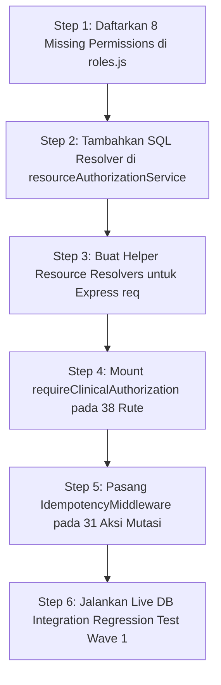

# NURSEFLOW HIS — P0-2B WAVE 1 AUTHORIZATION CONTRACT MATRIX (TIER 1 CRITICAL CLINICAL)

**Tanggal:** 26 September 2026  
**Auditor:** Principal Security Engineer & Clinical Authorization Systems Architect  
**Scope:** 38 Rute TIER_1_CRITICAL_CLINICAL (Medikasi, Resep CPOE, Bedah Perioperatif, Bank Darah, Triase IGD, Catatan SOAP/CPPT)  
**Status Audit:** `COMPLETED — MAPPING & BASELINE AUDIT ONLY (NO CODE MODIFIED)`  
**Rekomendasi Gate Wave 1B:** 🛑 **`HOLD — 18 MISSING CAPABILITIES & 17 BOLA GAPS MUST BE RESOLVED BEFORE MIDDLEWARE MOUNTING`**

---

## 1. EXECUTIVE SUMMARY

Audit ini menetapkan **Authorization Contract Matrix** definitif untuk seluruh **38 rute Tier 1 (Critical Clinical)** di NurseFlow Enterprise HIS. Sesuai aturan **STRICT MODE / NO PRODUCTION CODE CHANGE**, audit ini tidak mengubah, memindahkan, atau memasang middleware pada rute produksi, melainkan memetakan kontrak otorisasi aktual, mengaudit kompatibilitas engine P0-2A, serta mendeteksi celah keamanan transport HTTP.

### Temuan Kunci Audit:
1. **Validasi Inventaris (100% Reproducible):** Terbukti secara matematis dan melalui inspeksi AST bahwa jumlah rute Tier 1 adalah tepat **38 rute** yang tersebar di 6 file rute.
2. **Kesenjangan Perimeter (Perimeter Gap):** Saat ini **0 dari 38 rute (0.0%)** memasang `requireClinicalAuthorization`. Seluruh rute Tier 1 masih mengandalkan pemeriksaan ad-hoc legacy atau bahkan **11 rute (28.9%) sama sekali tidak memiliki pemeriksaan izin/peran (hanya dilindungi JWT)**.
3. **Pelanggaran Urutan Middleware (38 Rute):** Tidak ada satu pun rute yang memenuhi urutan standar enterprise (`authenticateJwt` -> `requireClinicalAuthorization` -> `idempotencyMiddleware` -> controller). 37 rute mutasi kritis juga belum memiliki `idempotencyMiddleware`.
4. **Celah Otorisasi Sumber Daya / BOLA (17 Rute):** Seluruh 17 rute yang menerima parameter identifier (`:id`, `:encounterId`) tidak memverifikasi kepemilikan tenant sumber daya atau hubungan tim rawat (*care-team relationship*) di level middleware.
5. **Kekurangan Kapabilitas Engine P0-2A (18 Kasus):**
   - 8 izin klinis (`SURGICAL_PREOP_WRITE`, `SURGICAL_IMPLANT_RECORD`, `SURGICAL_PACU_WRITE`, `PERIOPERATIVE_ABORT`, `PERIOPERATIVE_EMERGENCY`, `SURGICAL_SPECIMEN_RECORD`, `MED_ADVERSE_RECORD`, `BLOOD_BANK_WRITE`) belum terdaftar di `CLINICAL_PERMISSIONS` dan `ROLE_PERMISSIONS_MATRIX`.
   - `resourceAuthorizationService.verifyResourceAccess()` saat ini hanya memiliki kueri lookup database untuk `resourceType` `ENCOUNTER`, `PATIENT`, dan `ORDER`. Engine belum mendukung lookup otomatis untuk `SURGERY_CASE`, `BLOOD_UNIT`, `MEDICATION_ORDER`, dan `CLINICAL_NOTE` jika pemanggil hanya mengirimkan `resourceId` tanpa objek in-memory.

---

## 2. EXACT 38-ROUTE INVENTORY (TIER 1 CRITICAL CLINICAL)

| No | File Sumber & Baris | Method | Route Path | Action | Auth JWT | Legacy Role / Permission | requireClinicalAuth | Idempotency |
| :-: | :--- | :---: | :--- | :---: | :---: | :--- | :---: | :---: |
| 1 | `medicationClosedLoop.routes.js:14` | `POST` | `/prescribe` | `CREATE` | ✅ | `CPOE_ORDER_CREATE` | ❌ | ❌ |
| 2 | `medicationClosedLoop.routes.js:17` | `POST` | `/:id/pharmacist-review` | `CREATE` | ✅ | `PHARMACY_REVIEW` | ❌ | ❌ |
| 3 | `medicationClosedLoop.routes.js:20` | `POST` | `/:id/dispense` | `EXECUTE` | ✅ | `PHARMACY_DISPENSE` | ❌ | ❌ |
| 4 | `medicationClosedLoop.routes.js:23` | `POST` | `/:id/administer` | `EXECUTE` | ✅ | `MEDICATION_ADMINISTER` | ❌ | ❌ |
| 5 | `medicationClosedLoop.routes.js:26` | `POST` | `/reconciliation/admission` | `CREATE` | ✅ | `CPOE_ORDER_CREATE` | ❌ | ❌ |
| 6 | `medicationClosedLoop.routes.js:29` | `POST` | `/reconciliation/discharge` | `VERIFY` | ✅ | `PHARMACY_REVIEW` | ❌ | ❌ |
| 7 | `medicationClosedLoop.routes.js:32` | `POST` | `/administrations/:id/adverse-reaction` | `CREATE` | ✅ | `⚠️ NONE (Unprotected)` | ❌ | ❌ |
| 8 | `medicationClosedLoop.routes.js:35` | `POST` | `/:id/cancel` | `ABORT` | ✅ | `CPOE_ORDER_CANCEL` | ❌ | ❌ |
| 9 | `orders.routes.js:19` | `POST` | `/cpoe` | `CREATE` | ✅ | `CPOE_ORDER_CREATE` | ❌ | ✅ |
| 10 | `orders.routes.js:22` | `POST` | `/cpoe/:id/cancel` | `ABORT` | ✅ | `CPOE_ORDER_CANCEL` | ❌ | ❌ |
| 11 | `orders.routes.js:25` | `GET` | `/cpoe` | `READ` | ✅ | `CPOE_ORDER_READ` | ❌ | ❌ |
| 12 | `orders.routes.js:28` | `GET` | `/cpoe/:id` | `READ` | ✅ | `CPOE_ORDER_READ` | ❌ | ❌ |
| 13 | `orders.routes.js:31` | `GET` | `/cpoe/encounter/:encounterId` | `READ` | ✅ | `CPOE_ORDER_READ` | ❌ | ❌ |
| 14 | `orders.routes.js:37` | `GET` | `/` | `READ` | ✅ | `⚠️ NONE (Unprotected)` | ❌ | ❌ |
| 15 | `orders.routes.js:41` | `POST` | `/prescription` | `CREATE` | ✅ | `ORDER_CREATE_PHARMACY` | ❌ | ❌ |
| 16 | `orders.routes.js:55` | `POST` | `/lab` | `CREATE` | ✅ | `ORDER_CREATE_LAB` | ❌ | ❌ |
| 17 | `orders.routes.js:69` | `POST` | `/radiology` | `CREATE` | ✅ | `ORDER_CREATE_RAD` | ❌ | ❌ |
| 18 | `perioperativeClosedLoop.routes.js:13` | `POST` | `/preop-evaluations` | `CREATE` | ✅ | `⚠️ NONE (Unprotected)` | ❌ | ❌ |
| 19 | `perioperativeClosedLoop.routes.js:16` | `POST` | `/who-checklist` | `CREATE` | ✅ | `⚠️ NONE (Unprotected)` | ❌ | ❌ |
| 20 | `perioperativeClosedLoop.routes.js:19` | `POST` | `/implants` | `CREATE` | ✅ | `⚠️ NONE (Unprotected)` | ❌ | ❌ |
| 21 | `perioperativeClosedLoop.routes.js:22` | `POST` | `/pacu-records` | `CREATE` | ✅ | `⚠️ NONE (Unprotected)` | ❌ | ❌ |
| 22 | `perioperativeClosedLoop.routes.js:25` | `POST` | `/cases/:id/finalize` | `FINALIZE` | ✅ | `⚠️ NONE (Unprotected)` | ❌ | ❌ |
| 23 | `perioperativeClosedLoop.routes.js:28` | `POST` | `/cases/:id/abort` | `ABORT` | ✅ | `⚠️ NONE (Unprotected)` | ❌ | ❌ |
| 24 | `perioperativeClosedLoop.routes.js:31` | `POST` | `/cases/:id/emergency` | `EMERGENCY` | ✅ | `⚠️ NONE (Unprotected)` | ❌ | ❌ |
| 25 | `perioperativeClosedLoop.routes.js:34` | `POST` | `/cases/:id/specimens` | `CREATE` | ✅ | `⚠️ NONE (Unprotected)` | ❌ | ❌ |
| 26 | `bloodBank.routes.js:8` | `GET` | `/units` | `READ` | ✅ | `['BLOOD_BANK_OFFICER', 'LAB_ANALYST', 'DOCTOR', 'NURSE', 'ADMIN', 'SUPERVISOR']` | ❌ | ❌ |
| 27 | `bloodBank.routes.js:9` | `POST` | `/units` | `ADMINISTRATIVE` | ✅ | `['BLOOD_BANK_OFFICER', 'ADMIN', 'SUPERVISOR']` | ❌ | ❌ |
| 28 | `bloodBank.routes.js:10` | `POST` | `/crossmatch` | `EXECUTE` | ✅ | `['BLOOD_BANK_OFFICER', 'LAB_ANALYST', 'ADMIN']` | ❌ | ❌ |
| 29 | `bloodBank.routes.js:11` | `POST` | `/transfusion/verify` | `VERIFY` | ✅ | `['NURSE', 'BLOOD_BANK_OFFICER', 'DOCTOR', 'ADMIN']` | ❌ | ❌ |
| 30 | `triage.routes.js:13` | `POST` | `/assessments` | `CREATE` | ✅ | `TRIAGE_WRITE` | ❌ | ❌ |
| 31 | `triage.routes.js:16` | `POST` | `/first-physician-contact` | `EXECUTE` | ✅ | `⚠️ NONE (Unprotected)` | ❌ | ❌ |
| 32 | `triage.routes.js:19` | `GET` | `/encounter/:encounterId` | `READ` | ✅ | `TRIAGE_READ` | ❌ | ❌ |
| 33 | `clinicalNotes.routes.js:14` | `POST` | `/soap` | `CREATE` | ✅ | `EMR_WRITE_SOAP` | ❌ | ❌ |
| 34 | `clinicalNotes.routes.js:17` | `POST` | `/soap/:id/amend` | `UPDATE` | ✅ | `EMR_WRITE_SOAP` | ❌ | ❌ |
| 35 | `clinicalNotes.routes.js:20` | `GET` | `/soap/encounter/:encounterId` | `READ` | ✅ | `EMR_READ` | ❌ | ❌ |
| 36 | `clinicalNotes.routes.js:24` | `POST` | `/cppt` | `CREATE` | ✅ | `CPPT_WRITE` | ❌ | ❌ |
| 37 | `clinicalNotes.routes.js:27` | `PATCH` | `/cppt/:id/verify` | `VERIFY` | ✅ | `CPPT_VERIFY` | ❌ | ❌ |
| 38 | `clinicalNotes.routes.js:30` | `GET` | `/cppt/encounter/:encounterId` | `READ` | ✅ | `EMR_READ` | ❌ | ❌ |

---

## 3. AUTHORIZATION CONTRACT MATRIX (TIER 1)

Berikut adalah kontrak otorisasi terperinci untuk ke-38 rute klinis kritis:

### 1. [POST] medicationClosedLoop /prescribe
- **File & Line:** [`medicationClosedLoop.routes.js:14`](file:///c:/ALL%20DATA/BERKAS%20ROBBY/APPS%20PROJECT/NurseFlow-WebApp/server/routes/medicationClosedLoop.routes.js#L14)
- **Domain Klinis:** `CLOSED_LOOP_MEDICATION`
- **Aksi Klinis:** `CREATE`
- **Target Resource:** `MEDICATION_PRESCRIPTION` (Type: `MEDICATION_ORDER`)
- **Subjek Berwenang:**
  * **Peran (Roles):** `ROLE_DOCTOR_DPJP`, `ROLE_DOCTOR_EMERGENCY`
  * **Syarat Kredensial:** `SIP`
  * **Privilese Klinis:** `CLINICAL_PRESCRIBE`
- **Required Permission:** `CPOE_ORDER_CREATE`
- **Care-Team Requirement:** `MANDATORY_CARE_TEAM`
- **Separation of Duties (SoD):** `NONE`
- **Break-The-Glass (BTG):** `YES (EMERGENCY_CPOE_OVERRIDE)`
- **Tenant Scope:** `STRICT_SINGLE_TENANT`
- **Patient/Resource Scope:** `ENCOUNTER_PATIENT`
- **Kontrol Saat Ini:** `CPOE_ORDER_CREATE`
- **Kontrol Diperlukan:**
  ```
  authenticateJwt -> requireClinicalAuthorization({ action: 'CPOE_ORDER_CREATE', requiredCredentialType: 'SIP', resourceResolver }) -> idempotencyMiddleware -> controller
  ```
- **Risiko Bila Di-Bypass:** Malpraktik peresepan obat keras/narkotika oleh aktor tidak berizin atau tanpa SIP aktif; potensi toksisitas mematikan pada pasien.
- **Skenario Pengujian Kunci:**
  * Dokter dengan SIP aktif diizinkan meresepkan
  * Dokter dengan SIP kadaluarsa ditolak DENIED_CREDENTIAL_EXPIRED
  * Perawat/Kasir ditolak DENIED_PERMISSION_MISSING
  * Dokter luar tim rawat ditolak DENIED_NOT_CARE_TEAM kecuali BTG


---
### 2. [POST] medicationClosedLoop /:id/pharmacist-review
- **File & Line:** [`medicationClosedLoop.routes.js:17`](file:///c:/ALL%20DATA/BERKAS%20ROBBY/APPS%20PROJECT/NurseFlow-WebApp/server/routes/medicationClosedLoop.routes.js#L17)
- **Domain Klinis:** `CLOSED_LOOP_MEDICATION`
- **Aksi Klinis:** `CREATE`
- **Target Resource:** `MEDICATION_PRESCRIPTION` (Type: `MEDICATION_ORDER`)
- **Subjek Berwenang:**
  * **Peran (Roles):** `ROLE_PHARMACIST`
  * **Syarat Kredensial:** `SIP`
  * **Privilese Klinis:** `PHARMACEUTICAL_VALIDATION`
- **Required Permission:** `PHARMACY_REVIEW`
- **Care-Team Requirement:** `TENANT_PHARMACY`
- **Separation of Duties (SoD):** `FOUR_EYES (Reviewer != Prescriber)`
- **Break-The-Glass (BTG):** `NO`
- **Tenant Scope:** `STRICT_SINGLE_TENANT`
- **Patient/Resource Scope:** `PRESCRIPTION_TARGET`
- **Kontrol Saat Ini:** `PHARMACY_REVIEW`
- **Kontrol Diperlukan:**
  ```
  authenticateJwt -> requireClinicalAuthorization({ action: 'PHARMACY_REVIEW', requiredCredentialType: 'SIP', resourceResolver }) -> idempotencyMiddleware -> controller
  ```
- **Risiko Bila Di-Bypass:** Resep obat berbahaya lolos tanpa telaah interaksi obat/dosis oleh apoteker klinis.
- **Skenario Pengujian Kunci:**
  * Apoteker ber-SIP memvalidasi resep dokter lain -> GRANTED
  * Dokter mencoba memvalidasi resepnya sendiri -> DENIED_SEPARATION_OF_DUTIES
  * Staf non-apoteker ditolak DENIED_PERMISSION_MISSING
- **⚠️ MISSING_AUTHORIZATION_CAPABILITY:**
  * `RESOURCE_AUTHORIZATION_DB_LOOKUP_UNSUPPORTED: resourceType 'MEDICATION_ORDER' lacks SQL resolver in resourceAuthorizationService`
- **⚠️ RESOURCE_SCOPE_GAP:** Menerima parameter `id` tanpa pengikatan kepemilikan resource/care-team.

---
### 3. [POST] medicationClosedLoop /:id/dispense
- **File & Line:** [`medicationClosedLoop.routes.js:20`](file:///c:/ALL%20DATA/BERKAS%20ROBBY/APPS%20PROJECT/NurseFlow-WebApp/server/routes/medicationClosedLoop.routes.js#L20)
- **Domain Klinis:** `CLOSED_LOOP_MEDICATION`
- **Aksi Klinis:** `EXECUTE`
- **Target Resource:** `MEDICATION_PRESCRIPTION` (Type: `MEDICATION_ORDER`)
- **Subjek Berwenang:**
  * **Peran (Roles):** `ROLE_PHARMACIST`
  * **Syarat Kredensial:** `SIP`
  * **Privilese Klinis:** `PHARMACY_DISPENSING`
- **Required Permission:** `PHARMACY_DISPENSE`
- **Care-Team Requirement:** `TENANT_PHARMACY`
- **Separation of Duties (SoD):** `SOD-CPOE-PHARMACY-DUAL-CONTROL (Dispenser != Prescriber)`
- **Break-The-Glass (BTG):** `YES (EMERGENCY_DISPENSE_OVERRIDE)`
- **Tenant Scope:** `STRICT_SINGLE_TENANT`
- **Patient/Resource Scope:** `PRESCRIPTION_TARGET`
- **Kontrol Saat Ini:** `PHARMACY_DISPENSE`
- **Kontrol Diperlukan:**
  ```
  authenticateJwt -> requireClinicalAuthorization({ action: 'PHARMACY_DISPENSE', requiredCredentialType: 'SIP', resourceResolver }) -> idempotencyMiddleware -> controller
  ```
- **Risiko Bila Di-Bypass:** Obat keluar tanpa penyiapan resmi; dokter meresepkan dan mengambil obat sendiri tanpa pengawasan farmasi.
- **Skenario Pengujian Kunci:**
  * Apoteker mendispensasikan obat dokter lain -> GRANTED
  * Dokter yang meresepkan mencoba mendispensasikan sendiri -> DENIED_SEPARATION_OF_DUTIES (bahkan dengan BTG)
  * Staf tanpa hak dispensasi ditolak
- **⚠️ MISSING_AUTHORIZATION_CAPABILITY:**
  * `RESOURCE_AUTHORIZATION_DB_LOOKUP_UNSUPPORTED: resourceType 'MEDICATION_ORDER' lacks SQL resolver in resourceAuthorizationService`
- **⚠️ RESOURCE_SCOPE_GAP:** Menerima parameter `id` tanpa pengikatan kepemilikan resource/care-team.

---
### 4. [POST] medicationClosedLoop /:id/administer
- **File & Line:** [`medicationClosedLoop.routes.js:23`](file:///c:/ALL%20DATA/BERKAS%20ROBBY/APPS%20PROJECT/NurseFlow-WebApp/server/routes/medicationClosedLoop.routes.js#L23)
- **Domain Klinis:** `CLOSED_LOOP_MEDICATION`
- **Aksi Klinis:** `EXECUTE`
- **Target Resource:** `MEDICATION_PRESCRIPTION` (Type: `MEDICATION_ORDER`)
- **Subjek Berwenang:**
  * **Peran (Roles):** `ROLE_NURSE`
  * **Syarat Kredensial:** `STR`
  * **Privilese Klinis:** `NURSING_MEDICATION_ADMINISTRATION`
- **Required Permission:** `MEDICATION_ADMINISTER`
- **Care-Team Requirement:** `MANDATORY_CARE_TEAM`
- **Separation of Duties (SoD):** `NONE`
- **Break-The-Glass (BTG):** `YES (RESUSCITATION_MED_OVERRIDE)`
- **Tenant Scope:** `STRICT_SINGLE_TENANT`
- **Patient/Resource Scope:** `ENCOUNTER_PATIENT`
- **Kontrol Saat Ini:** `MEDICATION_ADMINISTER`
- **Kontrol Diperlukan:**
  ```
  authenticateJwt -> requireClinicalAuthorization({ action: 'MEDICATION_ADMINISTER', requiredCredentialType: 'STR', resourceResolver }) -> idempotencyMiddleware -> controller
  ```
- **Risiko Bila Di-Bypass:** Pemberian obat pada pasien yang salah atau oleh staf yang tidak memiliki STR perawat aktif; fatal medication error.
- **Skenario Pengujian Kunci:**
  * Perawat tim rawat ber-STR valid memberikan obat -> GRANTED
  * Perawat dengan STR kadaluarsa ditolak DENIED_CREDENTIAL_EXPIRED
  * Perawat di luar bangsal ditolak DENIED_NOT_CARE_TEAM kecuali BTG
- **⚠️ MISSING_AUTHORIZATION_CAPABILITY:**
  * `RESOURCE_AUTHORIZATION_DB_LOOKUP_UNSUPPORTED: resourceType 'MEDICATION_ORDER' lacks SQL resolver in resourceAuthorizationService`
- **⚠️ RESOURCE_SCOPE_GAP:** Menerima parameter `id` tanpa pengikatan kepemilikan resource/care-team.

---
### 5. [POST] medicationClosedLoop /reconciliation/admission
- **File & Line:** [`medicationClosedLoop.routes.js:26`](file:///c:/ALL%20DATA/BERKAS%20ROBBY/APPS%20PROJECT/NurseFlow-WebApp/server/routes/medicationClosedLoop.routes.js#L26)
- **Domain Klinis:** `CLOSED_LOOP_MEDICATION`
- **Aksi Klinis:** `CREATE`
- **Target Resource:** `MEDICATION_PRESCRIPTION` (Type: `MEDICATION_ORDER`)
- **Subjek Berwenang:**
  * **Peran (Roles):** `ROLE_DOCTOR_DPJP`, `ROLE_DOCTOR_EMERGENCY`, `ROLE_PHARMACIST`
  * **Syarat Kredensial:** `SIP`
  * **Privilese Klinis:** `MEDICATION_RECONCILIATION`
- **Required Permission:** `CPOE_ORDER_CREATE`
- **Care-Team Requirement:** `MANDATORY_CARE_TEAM`
- **Separation of Duties (SoD):** `NONE`
- **Break-The-Glass (BTG):** `NO`
- **Tenant Scope:** `STRICT_SINGLE_TENANT`
- **Patient/Resource Scope:** `ENCOUNTER_PATIENT`
- **Kontrol Saat Ini:** `CPOE_ORDER_CREATE`
- **Kontrol Diperlukan:**
  ```
  authenticateJwt -> requireClinicalAuthorization({ action: 'CPOE_ORDER_CREATE', requiredCredentialType: 'SIP', resourceResolver }) -> idempotencyMiddleware -> controller
  ```
- **Risiko Bila Di-Bypass:** Riwayat obat pasien di rumah tidak terdokumentasi akurat; memicu interaksi obat saat rawat inap.
- **Skenario Pengujian Kunci:**
  * Dokter/Apoteker admisi merekonsiliasi obat -> GRANTED
  * Aktor non-klinis ditolak


---
### 6. [POST] medicationClosedLoop /reconciliation/discharge
- **File & Line:** [`medicationClosedLoop.routes.js:29`](file:///c:/ALL%20DATA/BERKAS%20ROBBY/APPS%20PROJECT/NurseFlow-WebApp/server/routes/medicationClosedLoop.routes.js#L29)
- **Domain Klinis:** `CLOSED_LOOP_MEDICATION`
- **Aksi Klinis:** `VERIFY`
- **Target Resource:** `MEDICATION_PRESCRIPTION` (Type: `MEDICATION_ORDER`)
- **Subjek Berwenang:**
  * **Peran (Roles):** `ROLE_PHARMACIST`, `ROLE_DOCTOR_DPJP`
  * **Syarat Kredensial:** `SIP`
  * **Privilese Klinis:** `DISCHARGE_MEDICATION_RECONCILIATION`
- **Required Permission:** `PHARMACY_REVIEW`
- **Care-Team Requirement:** `MANDATORY_CARE_TEAM`
- **Separation of Duties (SoD):** `NONE`
- **Break-The-Glass (BTG):** `NO`
- **Tenant Scope:** `STRICT_SINGLE_TENANT`
- **Patient/Resource Scope:** `ENCOUNTER_PATIENT`
- **Kontrol Saat Ini:** `PHARMACY_REVIEW`
- **Kontrol Diperlukan:**
  ```
  authenticateJwt -> requireClinicalAuthorization({ action: 'PHARMACY_REVIEW', requiredCredentialType: 'SIP', resourceResolver }) -> idempotencyMiddleware -> controller
  ```
- **Risiko Bila Di-Bypass:** Pasien pulang dengan instruksi obat yang bertentangan atau polifarmasi tanpa verifikasi apoteker.
- **Skenario Pengujian Kunci:**
  * Apoteker/DPJP merekonsiliasi obat pulang -> GRANTED


---
### 7. [POST] medicationClosedLoop /administrations/:id/adverse-reaction
- **File & Line:** [`medicationClosedLoop.routes.js:32`](file:///c:/ALL%20DATA/BERKAS%20ROBBY/APPS%20PROJECT/NurseFlow-WebApp/server/routes/medicationClosedLoop.routes.js#L32)
- **Domain Klinis:** `CLOSED_LOOP_MEDICATION`
- **Aksi Klinis:** `CREATE`
- **Target Resource:** `MEDICATION_PRESCRIPTION` (Type: `MEDICATION_ORDER`)
- **Subjek Berwenang:**
  * **Peran (Roles):** `ROLE_DOCTOR_DPJP`, `ROLE_DOCTOR_EMERGENCY`, `ROLE_NURSE`, `ROLE_PHARMACIST`
  * **Syarat Kredensial:** `STR_OR_SIP`
  * **Privilese Klinis:** `ADVERSE_EVENT_REPORTING`
- **Required Permission:** `MED_ADVERSE_RECORD`
- **Care-Team Requirement:** `MANDATORY_CARE_TEAM`
- **Separation of Duties (SoD):** `NONE`
- **Break-The-Glass (BTG):** `NO`
- **Tenant Scope:** `STRICT_SINGLE_TENANT`
- **Patient/Resource Scope:** `ADMINISTRATION_ENCOUNTER`
- **Kontrol Saat Ini:** `AUTHENTICATED_ONLY_NO_RBAC`
- **Kontrol Diperlukan:**
  ```
  authenticateJwt -> requireClinicalAuthorization({ action: 'MED_ADVERSE_RECORD', requiredCredentialType: 'NONE', resourceResolver }) -> idempotencyMiddleware -> controller
  ```
- **Risiko Bila Di-Bypass:** Reaksi alergi/anafilaksis tidak tercatat resmi atau dicatat secara manipulatif oleh pihak tak berwenang.
- **Skenario Pengujian Kunci:**
  * Tenaga medis mencatat efek samping -> GRANTED
  * Aktor non-medis ditolak
- **⚠️ MISSING_AUTHORIZATION_CAPABILITY:**
  * `PERMISSION_NOT_DEFINED_IN_SSOT_MATRIX: 'MED_ADVERSE_RECORD'`
  * `RESOURCE_AUTHORIZATION_DB_LOOKUP_UNSUPPORTED: resourceType 'MEDICATION_ORDER' lacks SQL resolver in resourceAuthorizationService`
- **⚠️ RESOURCE_SCOPE_GAP:** Menerima parameter `id` tanpa pengikatan kepemilikan resource/care-team.

---
### 8. [POST] medicationClosedLoop /:id/cancel
- **File & Line:** [`medicationClosedLoop.routes.js:35`](file:///c:/ALL%20DATA/BERKAS%20ROBBY/APPS%20PROJECT/NurseFlow-WebApp/server/routes/medicationClosedLoop.routes.js#L35)
- **Domain Klinis:** `CLOSED_LOOP_MEDICATION`
- **Aksi Klinis:** `ABORT`
- **Target Resource:** `MEDICATION_PRESCRIPTION` (Type: `MEDICATION_ORDER`)
- **Subjek Berwenang:**
  * **Peran (Roles):** `ROLE_DOCTOR_DPJP`, `ROLE_DOCTOR_EMERGENCY`
  * **Syarat Kredensial:** `SIP`
  * **Privilese Klinis:** `CLINICAL_PRESCRIBE`
- **Required Permission:** `CPOE_ORDER_CANCEL`
- **Care-Team Requirement:** `MANDATORY_CARE_TEAM`
- **Separation of Duties (SoD):** `ORDER_AUTHOR_OR_DPJP`
- **Break-The-Glass (BTG):** `YES`
- **Tenant Scope:** `STRICT_SINGLE_TENANT`
- **Patient/Resource Scope:** `PRESCRIPTION_TARGET`
- **Kontrol Saat Ini:** `CPOE_ORDER_CANCEL`
- **Kontrol Diperlukan:**
  ```
  authenticateJwt -> requireClinicalAuthorization({ action: 'CPOE_ORDER_CANCEL', requiredCredentialType: 'SIP', resourceResolver }) -> idempotencyMiddleware -> controller
  ```
- **Risiko Bila Di-Bypass:** Penghentian terapi obat kritis pasien oleh pihak ketiga yang tidak bertanggung jawab.
- **Skenario Pengujian Kunci:**
  * DPJP membatalkan resep -> GRANTED
  * Staf non-dokter ditolak
- **⚠️ MISSING_AUTHORIZATION_CAPABILITY:**
  * `RESOURCE_AUTHORIZATION_DB_LOOKUP_UNSUPPORTED: resourceType 'MEDICATION_ORDER' lacks SQL resolver in resourceAuthorizationService`
- **⚠️ RESOURCE_SCOPE_GAP:** Menerima parameter `id` tanpa pengikatan kepemilikan resource/care-team.

---
### 9. [POST] orders /cpoe
- **File & Line:** [`orders.routes.js:19`](file:///c:/ALL%20DATA/BERKAS%20ROBBY/APPS%20PROJECT/NurseFlow-WebApp/server/routes/orders.routes.js#L19)
- **Domain Klinis:** `CPOE_AND_CLINICAL_ORDERS`
- **Aksi Klinis:** `CREATE`
- **Target Resource:** `CLINICAL_ORDER` (Type: `ORDER`)
- **Subjek Berwenang:**
  * **Peran (Roles):** `ROLE_DOCTOR_DPJP`, `ROLE_DOCTOR_EMERGENCY`
  * **Syarat Kredensial:** `SIP`
  * **Privilese Klinis:** `CLINICAL_ORDERING`
- **Required Permission:** `CPOE_ORDER_CREATE`
- **Care-Team Requirement:** `MANDATORY_CARE_TEAM`
- **Separation of Duties (SoD):** `NONE`
- **Break-The-Glass (BTG):** `YES (EMERGENCY_ORDER_OVERRIDE)`
- **Tenant Scope:** `STRICT_SINGLE_TENANT`
- **Patient/Resource Scope:** `ENCOUNTER_PATIENT`
- **Kontrol Saat Ini:** `CPOE_ORDER_CREATE`
- **Kontrol Diperlukan:**
  ```
  authenticateJwt -> requireClinicalAuthorization({ action: 'CPOE_ORDER_CREATE', requiredCredentialType: 'SIP', resourceResolver }) -> idempotencyMiddleware -> controller
  ```
- **Risiko Bila Di-Bypass:** Pemeriksaan penunjang/resep dibuat oleh staf tidak berwenang; pemborosan biaya atau intervensi berbahaya.
- **Skenario Pengujian Kunci:**
  * Dokter ber-SIP membuat order CPOE -> GRANTED
  * Staf non-dokter ditolak DENIED_PERMISSION_MISSING


---
### 10. [POST] orders /cpoe/:id/cancel
- **File & Line:** [`orders.routes.js:22`](file:///c:/ALL%20DATA/BERKAS%20ROBBY/APPS%20PROJECT/NurseFlow-WebApp/server/routes/orders.routes.js#L22)
- **Domain Klinis:** `CPOE_AND_CLINICAL_ORDERS`
- **Aksi Klinis:** `ABORT`
- **Target Resource:** `CLINICAL_ORDER` (Type: `ORDER`)
- **Subjek Berwenang:**
  * **Peran (Roles):** `ROLE_DOCTOR_DPJP`, `ROLE_DOCTOR_EMERGENCY`
  * **Syarat Kredensial:** `SIP`
  * **Privilese Klinis:** `CLINICAL_ORDERING`
- **Required Permission:** `CPOE_ORDER_CANCEL`
- **Care-Team Requirement:** `MANDATORY_CARE_TEAM`
- **Separation of Duties (SoD):** `NONE`
- **Break-The-Glass (BTG):** `YES`
- **Tenant Scope:** `STRICT_SINGLE_TENANT`
- **Patient/Resource Scope:** `ORDER_TARGET`
- **Kontrol Saat Ini:** `CPOE_ORDER_CANCEL`
- **Kontrol Diperlukan:**
  ```
  authenticateJwt -> requireClinicalAuthorization({ action: 'CPOE_ORDER_CANCEL', requiredCredentialType: 'SIP', resourceResolver }) -> idempotencyMiddleware -> controller
  ```
- **Risiko Bila Di-Bypass:** Pembatalan instruksi medis kritis tanpa persetujuan dokter.
- **Skenario Pengujian Kunci:**
  * Dokter pembatal adalah dokter pembuat/DPJP -> GRANTED
  * Dokter lain tanpa BTG ditolak

- **⚠️ RESOURCE_SCOPE_GAP:** Menerima parameter `id` tanpa pengikatan kepemilikan resource/care-team.

---
### 11. [GET] orders /cpoe
- **File & Line:** [`orders.routes.js:25`](file:///c:/ALL%20DATA/BERKAS%20ROBBY/APPS%20PROJECT/NurseFlow-WebApp/server/routes/orders.routes.js#L25)
- **Domain Klinis:** `CPOE_AND_CLINICAL_ORDERS`
- **Aksi Klinis:** `READ`
- **Target Resource:** `CLINICAL_ORDER` (Type: `ORDER`)
- **Subjek Berwenang:**
  * **Peran (Roles):** `ROLE_DOCTOR_DPJP`, `ROLE_DOCTOR_EMERGENCY`
  * **Syarat Kredensial:** `SIP`
  * **Privilese Klinis:** `CLINICAL_ORDERING`
- **Required Permission:** `CPOE_ORDER_READ`
- **Care-Team Requirement:** `MANDATORY_CARE_TEAM`
- **Separation of Duties (SoD):** `NONE`
- **Break-The-Glass (BTG):** `YES (EMERGENCY_ORDER_OVERRIDE)`
- **Tenant Scope:** `STRICT_SINGLE_TENANT`
- **Patient/Resource Scope:** `ENCOUNTER_PATIENT`
- **Kontrol Saat Ini:** `CPOE_ORDER_READ`
- **Kontrol Diperlukan:**
  ```
  authenticateJwt -> requireClinicalAuthorization({ action: 'CPOE_ORDER_READ', requiredCredentialType: 'SIP', resourceResolver }) -> controller
  ```
- **Risiko Bila Di-Bypass:** Pemeriksaan penunjang/resep dibuat oleh staf tidak berwenang; pemborosan biaya atau intervensi berbahaya.
- **Skenario Pengujian Kunci:**
  * Dokter ber-SIP membuat order CPOE -> GRANTED
  * Staf non-dokter ditolak DENIED_PERMISSION_MISSING


---
### 12. [GET] orders /cpoe/:id
- **File & Line:** [`orders.routes.js:28`](file:///c:/ALL%20DATA/BERKAS%20ROBBY/APPS%20PROJECT/NurseFlow-WebApp/server/routes/orders.routes.js#L28)
- **Domain Klinis:** `CPOE_AND_CLINICAL_ORDERS`
- **Aksi Klinis:** `READ`
- **Target Resource:** `CLINICAL_ORDER` (Type: `ORDER`)
- **Subjek Berwenang:**
  * **Peran (Roles):** `ROLE_DOCTOR_DPJP`, `ROLE_DOCTOR_EMERGENCY`, `ROLE_NURSE`, `ROLE_PHARMACIST`, `ROLE_LAB_ANALYST`, `ROLE_RADIOGRAPHER`
  * **Syarat Kredensial:** `NONE`
  * **Privilese Klinis:** `N/A`
- **Required Permission:** `CPOE_ORDER_READ`
- **Care-Team Requirement:** `MANDATORY_CARE_TEAM`
- **Separation of Duties (SoD):** `NONE`
- **Break-The-Glass (BTG):** `NO`
- **Tenant Scope:** `STRICT_SINGLE_TENANT`
- **Patient/Resource Scope:** `ENCOUNTER_PATIENT`
- **Kontrol Saat Ini:** `CPOE_ORDER_READ`
- **Kontrol Diperlukan:**
  ```
  authenticateJwt -> requireClinicalAuthorization({ action: 'CPOE_ORDER_READ', requiredCredentialType: 'NONE', resourceResolver }) -> controller
  ```
- **Risiko Bila Di-Bypass:** Kebocoran data order klinis pasien ke staf luar bangsal.
- **Skenario Pengujian Kunci:**
  * Staf tim rawat membaca order -> GRANTED
  * Staf non-tim rawat ditolak

- **⚠️ RESOURCE_SCOPE_GAP:** Menerima parameter `id` tanpa pengikatan kepemilikan resource/care-team.

---
### 13. [GET] orders /cpoe/encounter/:encounterId
- **File & Line:** [`orders.routes.js:31`](file:///c:/ALL%20DATA/BERKAS%20ROBBY/APPS%20PROJECT/NurseFlow-WebApp/server/routes/orders.routes.js#L31)
- **Domain Klinis:** `CPOE_AND_CLINICAL_ORDERS`
- **Aksi Klinis:** `READ`
- **Target Resource:** `CLINICAL_ORDER` (Type: `ORDER`)
- **Subjek Berwenang:**
  * **Peran (Roles):** `ROLE_DOCTOR_DPJP`, `ROLE_DOCTOR_EMERGENCY`, `ROLE_NURSE`, `ROLE_PHARMACIST`, `ROLE_LAB_ANALYST`, `ROLE_RADIOGRAPHER`
  * **Syarat Kredensial:** `NONE`
  * **Privilese Klinis:** `N/A`
- **Required Permission:** `CPOE_ORDER_READ`
- **Care-Team Requirement:** `MANDATORY_CARE_TEAM`
- **Separation of Duties (SoD):** `NONE`
- **Break-The-Glass (BTG):** `NO`
- **Tenant Scope:** `STRICT_SINGLE_TENANT`
- **Patient/Resource Scope:** `ENCOUNTER_PATIENT`
- **Kontrol Saat Ini:** `CPOE_ORDER_READ`
- **Kontrol Diperlukan:**
  ```
  authenticateJwt -> requireClinicalAuthorization({ action: 'CPOE_ORDER_READ', requiredCredentialType: 'NONE', resourceResolver }) -> controller
  ```
- **Risiko Bila Di-Bypass:** Kebocoran data order klinis pasien ke staf luar bangsal.
- **Skenario Pengujian Kunci:**
  * Staf tim rawat membaca order -> GRANTED
  * Staf non-tim rawat ditolak

- **⚠️ RESOURCE_SCOPE_GAP:** Menerima parameter `encounterId` tanpa pengikatan kepemilikan resource/care-team.

---
### 14. [GET] orders /
- **File & Line:** [`orders.routes.js:37`](file:///c:/ALL%20DATA/BERKAS%20ROBBY/APPS%20PROJECT/NurseFlow-WebApp/server/routes/orders.routes.js#L37)
- **Domain Klinis:** `CPOE_AND_CLINICAL_ORDERS`
- **Aksi Klinis:** `READ`
- **Target Resource:** `CLINICAL_ORDER` (Type: `ORDER`)
- **Subjek Berwenang:**
  * **Peran (Roles):** `ROLE_DOCTOR_DPJP`, `ROLE_DOCTOR_EMERGENCY`, `ROLE_NURSE`, `ROLE_PHARMACIST`, `ROLE_LAB_ANALYST`, `ROLE_RADIOGRAPHER`
  * **Syarat Kredensial:** `NONE`
  * **Privilese Klinis:** `N/A`
- **Required Permission:** `CPOE_ORDER_READ`
- **Care-Team Requirement:** `MANDATORY_CARE_TEAM`
- **Separation of Duties (SoD):** `NONE`
- **Break-The-Glass (BTG):** `NO`
- **Tenant Scope:** `STRICT_SINGLE_TENANT`
- **Patient/Resource Scope:** `ENCOUNTER_PATIENT`
- **Kontrol Saat Ini:** `AUTHENTICATED_ONLY_NO_RBAC`
- **Kontrol Diperlukan:**
  ```
  authenticateJwt -> requireClinicalAuthorization({ action: 'CPOE_ORDER_READ', requiredCredentialType: 'NONE', resourceResolver }) -> controller
  ```
- **Risiko Bila Di-Bypass:** Kebocoran data order klinis pasien ke staf luar bangsal.
- **Skenario Pengujian Kunci:**
  * Staf tim rawat membaca order -> GRANTED
  * Staf non-tim rawat ditolak


---
### 15. [POST] orders /prescription
- **File & Line:** [`orders.routes.js:41`](file:///c:/ALL%20DATA/BERKAS%20ROBBY/APPS%20PROJECT/NurseFlow-WebApp/server/routes/orders.routes.js#L41)
- **Domain Klinis:** `CPOE_AND_CLINICAL_ORDERS`
- **Aksi Klinis:** `CREATE`
- **Target Resource:** `CLINICAL_ORDER` (Type: `ORDER`)
- **Subjek Berwenang:**
  * **Peran (Roles):** `ROLE_DOCTOR_DPJP`, `ROLE_DOCTOR_EMERGENCY`
  * **Syarat Kredensial:** `SIP`
  * **Privilese Klinis:** `CLINICAL_ORDERING`
- **Required Permission:** `ORDER_CREATE_PHARMACY`
- **Care-Team Requirement:** `MANDATORY_CARE_TEAM`
- **Separation of Duties (SoD):** `NONE`
- **Break-The-Glass (BTG):** `YES (EMERGENCY_ORDER_OVERRIDE)`
- **Tenant Scope:** `STRICT_SINGLE_TENANT`
- **Patient/Resource Scope:** `ENCOUNTER_PATIENT`
- **Kontrol Saat Ini:** `ORDER_CREATE_PHARMACY`
- **Kontrol Diperlukan:**
  ```
  authenticateJwt -> requireClinicalAuthorization({ action: 'ORDER_CREATE_PHARMACY', requiredCredentialType: 'SIP', resourceResolver }) -> idempotencyMiddleware -> controller
  ```
- **Risiko Bila Di-Bypass:** Pemeriksaan penunjang/resep dibuat oleh staf tidak berwenang; pemborosan biaya atau intervensi berbahaya.
- **Skenario Pengujian Kunci:**
  * Dokter ber-SIP membuat order CPOE -> GRANTED
  * Staf non-dokter ditolak DENIED_PERMISSION_MISSING


---
### 16. [POST] orders /lab
- **File & Line:** [`orders.routes.js:55`](file:///c:/ALL%20DATA/BERKAS%20ROBBY/APPS%20PROJECT/NurseFlow-WebApp/server/routes/orders.routes.js#L55)
- **Domain Klinis:** `CPOE_AND_CLINICAL_ORDERS`
- **Aksi Klinis:** `CREATE`
- **Target Resource:** `CLINICAL_ORDER` (Type: `ORDER`)
- **Subjek Berwenang:**
  * **Peran (Roles):** `ROLE_DOCTOR_DPJP`, `ROLE_DOCTOR_EMERGENCY`
  * **Syarat Kredensial:** `SIP`
  * **Privilese Klinis:** `CLINICAL_ORDERING`
- **Required Permission:** `ORDER_CREATE_LAB`
- **Care-Team Requirement:** `MANDATORY_CARE_TEAM`
- **Separation of Duties (SoD):** `NONE`
- **Break-The-Glass (BTG):** `YES (EMERGENCY_ORDER_OVERRIDE)`
- **Tenant Scope:** `STRICT_SINGLE_TENANT`
- **Patient/Resource Scope:** `ENCOUNTER_PATIENT`
- **Kontrol Saat Ini:** `ORDER_CREATE_LAB`
- **Kontrol Diperlukan:**
  ```
  authenticateJwt -> requireClinicalAuthorization({ action: 'ORDER_CREATE_LAB', requiredCredentialType: 'SIP', resourceResolver }) -> idempotencyMiddleware -> controller
  ```
- **Risiko Bila Di-Bypass:** Pemeriksaan penunjang/resep dibuat oleh staf tidak berwenang; pemborosan biaya atau intervensi berbahaya.
- **Skenario Pengujian Kunci:**
  * Dokter ber-SIP membuat order CPOE -> GRANTED
  * Staf non-dokter ditolak DENIED_PERMISSION_MISSING


---
### 17. [POST] orders /radiology
- **File & Line:** [`orders.routes.js:69`](file:///c:/ALL%20DATA/BERKAS%20ROBBY/APPS%20PROJECT/NurseFlow-WebApp/server/routes/orders.routes.js#L69)
- **Domain Klinis:** `CPOE_AND_CLINICAL_ORDERS`
- **Aksi Klinis:** `CREATE`
- **Target Resource:** `CLINICAL_ORDER` (Type: `ORDER`)
- **Subjek Berwenang:**
  * **Peran (Roles):** `ROLE_DOCTOR_DPJP`, `ROLE_DOCTOR_EMERGENCY`
  * **Syarat Kredensial:** `SIP`
  * **Privilese Klinis:** `CLINICAL_ORDERING`
- **Required Permission:** `ORDER_CREATE_RAD`
- **Care-Team Requirement:** `MANDATORY_CARE_TEAM`
- **Separation of Duties (SoD):** `NONE`
- **Break-The-Glass (BTG):** `YES (EMERGENCY_ORDER_OVERRIDE)`
- **Tenant Scope:** `STRICT_SINGLE_TENANT`
- **Patient/Resource Scope:** `ENCOUNTER_PATIENT`
- **Kontrol Saat Ini:** `ORDER_CREATE_RAD`
- **Kontrol Diperlukan:**
  ```
  authenticateJwt -> requireClinicalAuthorization({ action: 'ORDER_CREATE_RAD', requiredCredentialType: 'SIP', resourceResolver }) -> idempotencyMiddleware -> controller
  ```
- **Risiko Bila Di-Bypass:** Pemeriksaan penunjang/resep dibuat oleh staf tidak berwenang; pemborosan biaya atau intervensi berbahaya.
- **Skenario Pengujian Kunci:**
  * Dokter ber-SIP membuat order CPOE -> GRANTED
  * Staf non-dokter ditolak DENIED_PERMISSION_MISSING


---
### 18. [POST] perioperativeClosedLoop /preop-evaluations
- **File & Line:** [`perioperativeClosedLoop.routes.js:13`](file:///c:/ALL%20DATA/BERKAS%20ROBBY/APPS%20PROJECT/NurseFlow-WebApp/server/routes/perioperativeClosedLoop.routes.js#L13)
- **Domain Klinis:** `PERIOPERATIVE_SURGICAL_SAFETY`
- **Aksi Klinis:** `CREATE`
- **Target Resource:** `SURGERY_CASE` (Type: `SURGERY_CASE`)
- **Subjek Berwenang:**
  * **Peran (Roles):** `ROLE_DOCTOR_DPJP`, `ROLE_NURSE`
  * **Syarat Kredensial:** `STR_OR_SIP`
  * **Privilese Klinis:** `SURGICAL_RECORDING`
- **Required Permission:** `SURGICAL_PREOP_WRITE`
- **Care-Team Requirement:** `SURGICAL_TEAM`
- **Separation of Duties (SoD):** `NONE`
- **Break-The-Glass (BTG):** `NO`
- **Tenant Scope:** `STRICT_SINGLE_TENANT`
- **Patient/Resource Scope:** `SURGICAL_PATIENT`
- **Kontrol Saat Ini:** `AUTHENTICATED_ONLY_NO_RBAC`
- **Kontrol Diperlukan:**
  ```
  authenticateJwt -> requireClinicalAuthorization({ action: 'SURGICAL_PREOP_WRITE', requiredCredentialType: 'NONE', resourceResolver }) -> idempotencyMiddleware -> controller
  ```
- **Risiko Bila Di-Bypass:** Pencatatan implan atau rekam PACU tidak terverifikasi.
- **Skenario Pengujian Kunci:**
  * Perawat/Dokter mencatat evaluasi bedah -> GRANTED
- **⚠️ MISSING_AUTHORIZATION_CAPABILITY:**
  * `PERMISSION_NOT_DEFINED_IN_SSOT_MATRIX: 'SURGICAL_PREOP_WRITE'`


---
### 19. [POST] perioperativeClosedLoop /who-checklist
- **File & Line:** [`perioperativeClosedLoop.routes.js:16`](file:///c:/ALL%20DATA/BERKAS%20ROBBY/APPS%20PROJECT/NurseFlow-WebApp/server/routes/perioperativeClosedLoop.routes.js#L16)
- **Domain Klinis:** `PERIOPERATIVE_SURGICAL_SAFETY`
- **Aksi Klinis:** `CREATE`
- **Target Resource:** `SURGERY_CASE` (Type: `SURGERY_CASE`)
- **Subjek Berwenang:**
  * **Peran (Roles):** `ROLE_NURSE`, `ROLE_DOCTOR_DPJP`
  * **Syarat Kredensial:** `STR_OR_SIP`
  * **Privilese Klinis:** `SURGICAL_SAFETY_SIGN`
- **Required Permission:** `SURGICAL_SAFETY_SIGN`
- **Care-Team Requirement:** `SURGICAL_TEAM`
- **Separation of Duties (SoD):** `NONE`
- **Break-The-Glass (BTG):** `NO`
- **Tenant Scope:** `STRICT_SINGLE_TENANT`
- **Patient/Resource Scope:** `SURGICAL_PATIENT`
- **Kontrol Saat Ini:** `AUTHENTICATED_ONLY_NO_RBAC`
- **Kontrol Diperlukan:**
  ```
  authenticateJwt -> requireClinicalAuthorization({ action: 'SURGICAL_SAFETY_SIGN', requiredCredentialType: 'NONE', resourceResolver }) -> idempotencyMiddleware -> controller
  ```
- **Risiko Bila Di-Bypass:** Pelanggaran keselamatan bedah internasional: operasi dimulai tanpa verifikasi checklist Time-Out.
- **Skenario Pengujian Kunci:**
  * Perawat sirkuler mengisi checklist WHO -> GRANTED


---
### 20. [POST] perioperativeClosedLoop /implants
- **File & Line:** [`perioperativeClosedLoop.routes.js:19`](file:///c:/ALL%20DATA/BERKAS%20ROBBY/APPS%20PROJECT/NurseFlow-WebApp/server/routes/perioperativeClosedLoop.routes.js#L19)
- **Domain Klinis:** `PERIOPERATIVE_SURGICAL_SAFETY`
- **Aksi Klinis:** `CREATE`
- **Target Resource:** `SURGERY_CASE` (Type: `SURGERY_CASE`)
- **Subjek Berwenang:**
  * **Peran (Roles):** `ROLE_DOCTOR_DPJP`, `ROLE_NURSE`
  * **Syarat Kredensial:** `STR_OR_SIP`
  * **Privilese Klinis:** `SURGICAL_RECORDING`
- **Required Permission:** `SURGICAL_IMPLANT_RECORD`
- **Care-Team Requirement:** `SURGICAL_TEAM`
- **Separation of Duties (SoD):** `NONE`
- **Break-The-Glass (BTG):** `NO`
- **Tenant Scope:** `STRICT_SINGLE_TENANT`
- **Patient/Resource Scope:** `SURGICAL_PATIENT`
- **Kontrol Saat Ini:** `AUTHENTICATED_ONLY_NO_RBAC`
- **Kontrol Diperlukan:**
  ```
  authenticateJwt -> requireClinicalAuthorization({ action: 'SURGICAL_IMPLANT_RECORD', requiredCredentialType: 'NONE', resourceResolver }) -> idempotencyMiddleware -> controller
  ```
- **Risiko Bila Di-Bypass:** Pencatatan implan atau rekam PACU tidak terverifikasi.
- **Skenario Pengujian Kunci:**
  * Perawat/Dokter mencatat evaluasi bedah -> GRANTED
- **⚠️ MISSING_AUTHORIZATION_CAPABILITY:**
  * `PERMISSION_NOT_DEFINED_IN_SSOT_MATRIX: 'SURGICAL_IMPLANT_RECORD'`


---
### 21. [POST] perioperativeClosedLoop /pacu-records
- **File & Line:** [`perioperativeClosedLoop.routes.js:22`](file:///c:/ALL%20DATA/BERKAS%20ROBBY/APPS%20PROJECT/NurseFlow-WebApp/server/routes/perioperativeClosedLoop.routes.js#L22)
- **Domain Klinis:** `PERIOPERATIVE_SURGICAL_SAFETY`
- **Aksi Klinis:** `CREATE`
- **Target Resource:** `SURGERY_CASE` (Type: `SURGERY_CASE`)
- **Subjek Berwenang:**
  * **Peran (Roles):** `ROLE_DOCTOR_DPJP`, `ROLE_NURSE`
  * **Syarat Kredensial:** `STR_OR_SIP`
  * **Privilese Klinis:** `SURGICAL_RECORDING`
- **Required Permission:** `SURGICAL_PACU_WRITE`
- **Care-Team Requirement:** `SURGICAL_TEAM`
- **Separation of Duties (SoD):** `NONE`
- **Break-The-Glass (BTG):** `NO`
- **Tenant Scope:** `STRICT_SINGLE_TENANT`
- **Patient/Resource Scope:** `SURGICAL_PATIENT`
- **Kontrol Saat Ini:** `AUTHENTICATED_ONLY_NO_RBAC`
- **Kontrol Diperlukan:**
  ```
  authenticateJwt -> requireClinicalAuthorization({ action: 'SURGICAL_PACU_WRITE', requiredCredentialType: 'NONE', resourceResolver }) -> idempotencyMiddleware -> controller
  ```
- **Risiko Bila Di-Bypass:** Pencatatan implan atau rekam PACU tidak terverifikasi.
- **Skenario Pengujian Kunci:**
  * Perawat/Dokter mencatat evaluasi bedah -> GRANTED
- **⚠️ MISSING_AUTHORIZATION_CAPABILITY:**
  * `PERMISSION_NOT_DEFINED_IN_SSOT_MATRIX: 'SURGICAL_PACU_WRITE'`


---
### 22. [POST] perioperativeClosedLoop /cases/:id/finalize
- **File & Line:** [`perioperativeClosedLoop.routes.js:25`](file:///c:/ALL%20DATA/BERKAS%20ROBBY/APPS%20PROJECT/NurseFlow-WebApp/server/routes/perioperativeClosedLoop.routes.js#L25)
- **Domain Klinis:** `PERIOPERATIVE_SURGICAL_SAFETY`
- **Aksi Klinis:** `FINALIZE`
- **Target Resource:** `SURGERY_CASE` (Type: `SURGERY_CASE`)
- **Subjek Berwenang:**
  * **Peran (Roles):** `ROLE_DOCTOR_DPJP`
  * **Syarat Kredensial:** `SIP`
  * **Privilese Klinis:** `SURGERY_FINALIZE`
- **Required Permission:** `PERIOPERATIVE_FINALIZE`
- **Care-Team Requirement:** `SURGICAL_TEAM (Operating Surgeon)`
- **Separation of Duties (SoD):** `NONE`
- **Break-The-Glass (BTG):** `NO`
- **Tenant Scope:** `STRICT_SINGLE_TENANT`
- **Patient/Resource Scope:** `SURGICAL_PATIENT`
- **Kontrol Saat Ini:** `AUTHENTICATED_ONLY_NO_RBAC`
- **Kontrol Diperlukan:**
  ```
  authenticateJwt -> requireClinicalAuthorization({ action: 'PERIOPERATIVE_FINALIZE', requiredCredentialType: 'SIP', resourceResolver }) -> idempotencyMiddleware -> controller
  ```
- **Risiko Bila Di-Bypass:** Operasi bedah difinalisasi tanpa verifikasi spesialis bedah penanggung jawab.
- **Skenario Pengujian Kunci:**
  * Dokter bedah memfinalisasi operasi -> GRANTED
  * Perawat atau staf non-bedah ditolak
- **⚠️ MISSING_AUTHORIZATION_CAPABILITY:**
  * `RESOURCE_AUTHORIZATION_DB_LOOKUP_UNSUPPORTED: resourceType 'SURGERY_CASE' lacks SQL resolver in resourceAuthorizationService`
- **⚠️ RESOURCE_SCOPE_GAP:** Menerima parameter `id` tanpa pengikatan kepemilikan resource/care-team.

---
### 23. [POST] perioperativeClosedLoop /cases/:id/abort
- **File & Line:** [`perioperativeClosedLoop.routes.js:28`](file:///c:/ALL%20DATA/BERKAS%20ROBBY/APPS%20PROJECT/NurseFlow-WebApp/server/routes/perioperativeClosedLoop.routes.js#L28)
- **Domain Klinis:** `PERIOPERATIVE_SURGICAL_SAFETY`
- **Aksi Klinis:** `ABORT`
- **Target Resource:** `SURGERY_CASE` (Type: `SURGERY_CASE`)
- **Subjek Berwenang:**
  * **Peran (Roles):** `ROLE_DOCTOR_DPJP`, `ROLE_DOCTOR_EMERGENCY`
  * **Syarat Kredensial:** `SIP`
  * **Privilese Klinis:** `SURGERY_ABORT`
- **Required Permission:** `PERIOPERATIVE_ABORT`
- **Care-Team Requirement:** `SURGICAL_TEAM`
- **Separation of Duties (SoD):** `NONE`
- **Break-The-Glass (BTG):** `YES`
- **Tenant Scope:** `STRICT_SINGLE_TENANT`
- **Patient/Resource Scope:** `SURGICAL_PATIENT`
- **Kontrol Saat Ini:** `AUTHENTICATED_ONLY_NO_RBAC`
- **Kontrol Diperlukan:**
  ```
  authenticateJwt -> requireClinicalAuthorization({ action: 'PERIOPERATIVE_ABORT', requiredCredentialType: 'SIP', resourceResolver }) -> idempotencyMiddleware -> controller
  ```
- **Risiko Bila Di-Bypass:** Pembatalan operasi bedah mendadak tanpa otorisasi DPJP anestesi/bedah.
- **Skenario Pengujian Kunci:**
  * DPJP membatalkan operasi karena instabilitas hemodinamik -> GRANTED
- **⚠️ MISSING_AUTHORIZATION_CAPABILITY:**
  * `PERMISSION_NOT_DEFINED_IN_SSOT_MATRIX: 'PERIOPERATIVE_ABORT'`
  * `RESOURCE_AUTHORIZATION_DB_LOOKUP_UNSUPPORTED: resourceType 'SURGERY_CASE' lacks SQL resolver in resourceAuthorizationService`
- **⚠️ RESOURCE_SCOPE_GAP:** Menerima parameter `id` tanpa pengikatan kepemilikan resource/care-team.

---
### 24. [POST] perioperativeClosedLoop /cases/:id/emergency
- **File & Line:** [`perioperativeClosedLoop.routes.js:31`](file:///c:/ALL%20DATA/BERKAS%20ROBBY/APPS%20PROJECT/NurseFlow-WebApp/server/routes/perioperativeClosedLoop.routes.js#L31)
- **Domain Klinis:** `PERIOPERATIVE_SURGICAL_SAFETY`
- **Aksi Klinis:** `EMERGENCY`
- **Target Resource:** `SURGERY_CASE` (Type: `SURGERY_CASE`)
- **Subjek Berwenang:**
  * **Peran (Roles):** `ROLE_DOCTOR_DPJP`, `ROLE_DOCTOR_EMERGENCY`, `ROLE_NURSE`
  * **Syarat Kredensial:** `SIP_OR_STR`
  * **Privilese Klinis:** `SURGICAL_EMERGENCY_TRIGGER`
- **Required Permission:** `PERIOPERATIVE_EMERGENCY`
- **Care-Team Requirement:** `SURGICAL_TEAM`
- **Separation of Duties (SoD):** `NONE`
- **Break-The-Glass (BTG):** `YES`
- **Tenant Scope:** `STRICT_SINGLE_TENANT`
- **Patient/Resource Scope:** `SURGICAL_PATIENT`
- **Kontrol Saat Ini:** `AUTHENTICATED_ONLY_NO_RBAC`
- **Kontrol Diperlukan:**
  ```
  authenticateJwt -> requireClinicalAuthorization({ action: 'PERIOPERATIVE_EMERGENCY', requiredCredentialType: 'NONE', resourceResolver }) -> idempotencyMiddleware -> controller
  ```
- **Risiko Bila Di-Bypass:** Alarm darurat kamar operasi dipicu atau ditolak sembarangan.
- **Skenario Pengujian Kunci:**
  * Tim bedah memicu emergency status -> GRANTED
- **⚠️ MISSING_AUTHORIZATION_CAPABILITY:**
  * `PERMISSION_NOT_DEFINED_IN_SSOT_MATRIX: 'PERIOPERATIVE_EMERGENCY'`
  * `RESOURCE_AUTHORIZATION_DB_LOOKUP_UNSUPPORTED: resourceType 'SURGERY_CASE' lacks SQL resolver in resourceAuthorizationService`
- **⚠️ RESOURCE_SCOPE_GAP:** Menerima parameter `id` tanpa pengikatan kepemilikan resource/care-team.

---
### 25. [POST] perioperativeClosedLoop /cases/:id/specimens
- **File & Line:** [`perioperativeClosedLoop.routes.js:34`](file:///c:/ALL%20DATA/BERKAS%20ROBBY/APPS%20PROJECT/NurseFlow-WebApp/server/routes/perioperativeClosedLoop.routes.js#L34)
- **Domain Klinis:** `PERIOPERATIVE_SURGICAL_SAFETY`
- **Aksi Klinis:** `CREATE`
- **Target Resource:** `SURGERY_CASE` (Type: `SURGERY_CASE`)
- **Subjek Berwenang:**
  * **Peran (Roles):** `ROLE_DOCTOR_DPJP`, `ROLE_NURSE`
  * **Syarat Kredensial:** `STR_OR_SIP`
  * **Privilese Klinis:** `SURGICAL_RECORDING`
- **Required Permission:** `SURGICAL_SPECIMEN_RECORD`
- **Care-Team Requirement:** `SURGICAL_TEAM`
- **Separation of Duties (SoD):** `NONE`
- **Break-The-Glass (BTG):** `NO`
- **Tenant Scope:** `STRICT_SINGLE_TENANT`
- **Patient/Resource Scope:** `SURGICAL_PATIENT`
- **Kontrol Saat Ini:** `AUTHENTICATED_ONLY_NO_RBAC`
- **Kontrol Diperlukan:**
  ```
  authenticateJwt -> requireClinicalAuthorization({ action: 'SURGICAL_SPECIMEN_RECORD', requiredCredentialType: 'NONE', resourceResolver }) -> idempotencyMiddleware -> controller
  ```
- **Risiko Bila Di-Bypass:** Pencatatan implan atau rekam PACU tidak terverifikasi.
- **Skenario Pengujian Kunci:**
  * Perawat/Dokter mencatat evaluasi bedah -> GRANTED
- **⚠️ MISSING_AUTHORIZATION_CAPABILITY:**
  * `PERMISSION_NOT_DEFINED_IN_SSOT_MATRIX: 'SURGICAL_SPECIMEN_RECORD'`
  * `RESOURCE_AUTHORIZATION_DB_LOOKUP_UNSUPPORTED: resourceType 'SURGERY_CASE' lacks SQL resolver in resourceAuthorizationService`
- **⚠️ RESOURCE_SCOPE_GAP:** Menerima parameter `id` tanpa pengikatan kepemilikan resource/care-team.

---
### 26. [GET] bloodBank /units
- **File & Line:** [`bloodBank.routes.js:8`](file:///c:/ALL%20DATA/BERKAS%20ROBBY/APPS%20PROJECT/NurseFlow-WebApp/server/routes/bloodBank.routes.js#L8)
- **Domain Klinis:** `BLOOD_BANK_AND_TRANSFUSION`
- **Aksi Klinis:** `READ`
- **Target Resource:** `BLOOD_UNIT_OR_REQUEST` (Type: `BLOOD_UNIT`)
- **Subjek Berwenang:**
  * **Peran (Roles):** `ROLE_BLOOD_BANK_OFFICER`, `ROLE_LAB_ANALYST`, `ROLE_ADMIN`
  * **Syarat Kredensial:** `NONE`
  * **Privilese Klinis:** `N/A`
- **Required Permission:** `BLOOD_BANK_READ`
- **Care-Team Requirement:** `TENANT_LAB`
- **Separation of Duties (SoD):** `NONE`
- **Break-The-Glass (BTG):** `NO`
- **Tenant Scope:** `STRICT_SINGLE_TENANT`
- **Patient/Resource Scope:** `TRANSFUSION_PATIENT`
- **Kontrol Saat Ini:** `['BLOOD_BANK_OFFICER', 'LAB_ANALYST', 'DOCTOR', 'NURSE', 'ADMIN', 'SUPERVISOR']`
- **Kontrol Diperlukan:**
  ```
  authenticateJwt -> requireClinicalAuthorization({ action: 'BLOOD_BANK_READ', requiredCredentialType: 'NONE', resourceResolver }) -> controller
  ```
- **Risiko Bila Di-Bypass:** Manipulasi stok darah donor rumah sakit.
- **Skenario Pengujian Kunci:**
  * Petugas bank darah mengelola unit -> GRANTED
- **⚠️ MISSING_AUTHORIZATION_CAPABILITY:**
  * `PERMISSION_NOT_DEFINED_IN_SSOT_MATRIX: 'BLOOD_BANK_READ'`


---
### 27. [POST] bloodBank /units
- **File & Line:** [`bloodBank.routes.js:9`](file:///c:/ALL%20DATA/BERKAS%20ROBBY/APPS%20PROJECT/NurseFlow-WebApp/server/routes/bloodBank.routes.js#L9)
- **Domain Klinis:** `BLOOD_BANK_AND_TRANSFUSION`
- **Aksi Klinis:** `ADMINISTRATIVE`
- **Target Resource:** `BLOOD_UNIT_OR_REQUEST` (Type: `BLOOD_UNIT`)
- **Subjek Berwenang:**
  * **Peran (Roles):** `ROLE_BLOOD_BANK_OFFICER`, `ROLE_LAB_ANALYST`, `ROLE_ADMIN`
  * **Syarat Kredensial:** `NONE`
  * **Privilese Klinis:** `N/A`
- **Required Permission:** `BLOOD_BANK_WRITE`
- **Care-Team Requirement:** `TENANT_LAB`
- **Separation of Duties (SoD):** `NONE`
- **Break-The-Glass (BTG):** `NO`
- **Tenant Scope:** `STRICT_SINGLE_TENANT`
- **Patient/Resource Scope:** `TRANSFUSION_PATIENT`
- **Kontrol Saat Ini:** `['BLOOD_BANK_OFFICER', 'ADMIN', 'SUPERVISOR']`
- **Kontrol Diperlukan:**
  ```
  authenticateJwt -> requireClinicalAuthorization({ action: 'BLOOD_BANK_WRITE', requiredCredentialType: 'NONE', resourceResolver }) -> idempotencyMiddleware -> controller
  ```
- **Risiko Bila Di-Bypass:** Manipulasi stok darah donor rumah sakit.
- **Skenario Pengujian Kunci:**
  * Petugas bank darah mengelola unit -> GRANTED
- **⚠️ MISSING_AUTHORIZATION_CAPABILITY:**
  * `PERMISSION_NOT_DEFINED_IN_SSOT_MATRIX: 'BLOOD_BANK_WRITE'`


---
### 28. [POST] bloodBank /crossmatch
- **File & Line:** [`bloodBank.routes.js:10`](file:///c:/ALL%20DATA/BERKAS%20ROBBY/APPS%20PROJECT/NurseFlow-WebApp/server/routes/bloodBank.routes.js#L10)
- **Domain Klinis:** `BLOOD_BANK_AND_TRANSFUSION`
- **Aksi Klinis:** `EXECUTE`
- **Target Resource:** `BLOOD_UNIT_OR_REQUEST` (Type: `BLOOD_UNIT`)
- **Subjek Berwenang:**
  * **Peran (Roles):** `ROLE_LAB_ANALYST`, `ROLE_BLOOD_BANK_OFFICER`
  * **Syarat Kredensial:** `STR`
  * **Privilese Klinis:** `BLOOD_CROSSMATCH`
- **Required Permission:** `TRANSFUSION_CROSSMATCH`
- **Care-Team Requirement:** `TENANT_LAB`
- **Separation of Duties (SoD):** `NONE`
- **Break-The-Glass (BTG):** `NO`
- **Tenant Scope:** `STRICT_SINGLE_TENANT`
- **Patient/Resource Scope:** `TRANSFUSION_PATIENT`
- **Kontrol Saat Ini:** `['BLOOD_BANK_OFFICER', 'LAB_ANALYST', 'ADMIN']`
- **Kontrol Diperlukan:**
  ```
  authenticateJwt -> requireClinicalAuthorization({ action: 'TRANSFUSION_CROSSMATCH', requiredCredentialType: 'STR', resourceResolver }) -> idempotencyMiddleware -> controller
  ```
- **Risiko Bila Di-Bypass:** Uji silang serasi (crossmatch) darah dilakukan oleh staf tidak berlisensi; risiko reaksi transfusi fatal / lisis darah.
- **Skenario Pengujian Kunci:**
  * Analis lab berlisensi melakukan crossmatch -> GRANTED
  * Perawat ditolak


---
### 29. [POST] bloodBank /transfusion/verify
- **File & Line:** [`bloodBank.routes.js:11`](file:///c:/ALL%20DATA/BERKAS%20ROBBY/APPS%20PROJECT/NurseFlow-WebApp/server/routes/bloodBank.routes.js#L11)
- **Domain Klinis:** `BLOOD_BANK_AND_TRANSFUSION`
- **Aksi Klinis:** `VERIFY`
- **Target Resource:** `BLOOD_UNIT_OR_REQUEST` (Type: `BLOOD_UNIT`)
- **Subjek Berwenang:**
  * **Peran (Roles):** `ROLE_NURSE`, `ROLE_DOCTOR_DPJP`
  * **Syarat Kredensial:** `STR_OR_SIP`
  * **Privilese Klinis:** `TRANSFUSION_VERIFICATION`
- **Required Permission:** `TRANSFUSION_AUTHORIZE`
- **Care-Team Requirement:** `MANDATORY_CARE_TEAM`
- **Separation of Duties (SoD):** `FOUR_EYES (Co-Verifier != Administering Nurse)`
- **Break-The-Glass (BTG):** `YES`
- **Tenant Scope:** `STRICT_SINGLE_TENANT`
- **Patient/Resource Scope:** `TRANSFUSION_PATIENT`
- **Kontrol Saat Ini:** `['NURSE', 'BLOOD_BANK_OFFICER', 'DOCTOR', 'ADMIN']`
- **Kontrol Diperlukan:**
  ```
  authenticateJwt -> requireClinicalAuthorization({ action: 'TRANSFUSION_AUTHORIZE', requiredCredentialType: 'NONE', resourceResolver }) -> idempotencyMiddleware -> controller
  ```
- **Risiko Bila Di-Bypass:** Transfusi darah salah kantong atau salah golongan darah ke pasien karena verifikasi ganda diabaikan.
- **Skenario Pengujian Kunci:**
  * Perawat tim rawat memverifikasi kantong darah -> GRANTED
  * Staf luar tim rawat ditolak


---
### 30. [POST] triage /assessments
- **File & Line:** [`triage.routes.js:13`](file:///c:/ALL%20DATA/BERKAS%20ROBBY/APPS%20PROJECT/NurseFlow-WebApp/server/routes/triage.routes.js#L13)
- **Domain Klinis:** `EMERGENCY_TRIAGE`
- **Aksi Klinis:** `CREATE`
- **Target Resource:** `TRIAGE_ASSESSMENT` (Type: `ENCOUNTER`)
- **Subjek Berwenang:**
  * **Peran (Roles):** `ROLE_NURSE`, `ROLE_DOCTOR_EMERGENCY`
  * **Syarat Kredensial:** `STR_OR_SIP`
  * **Privilese Klinis:** `TRIAGE_ASSESSMENT`
- **Required Permission:** `TRIAGE_WRITE`
- **Care-Team Requirement:** `EMERGENCY_DEPARTMENT`
- **Separation of Duties (SoD):** `NONE`
- **Break-The-Glass (BTG):** `YES`
- **Tenant Scope:** `STRICT_SINGLE_TENANT`
- **Patient/Resource Scope:** `EMERGENCY_ENCOUNTER`
- **Kontrol Saat Ini:** `TRIAGE_WRITE`
- **Kontrol Diperlukan:**
  ```
  authenticateJwt -> requireClinicalAuthorization({ action: 'TRIAGE_WRITE', requiredCredentialType: 'NONE', resourceResolver }) -> idempotencyMiddleware -> controller
  ```
- **Risiko Bila Di-Bypass:** Skrining kegawatan triase dilakukan oleh staf non-medis; keterlambatan penanganan pasien kategori P1/Resusitasi.
- **Skenario Pengujian Kunci:**
  * Perawat triase ber-STR mencatat triase -> GRANTED
  * Staf non-medis ditolak


---
### 31. [POST] triage /first-physician-contact
- **File & Line:** [`triage.routes.js:16`](file:///c:/ALL%20DATA/BERKAS%20ROBBY/APPS%20PROJECT/NurseFlow-WebApp/server/routes/triage.routes.js#L16)
- **Domain Klinis:** `EMERGENCY_TRIAGE`
- **Aksi Klinis:** `EXECUTE`
- **Target Resource:** `TRIAGE_ASSESSMENT` (Type: `ENCOUNTER`)
- **Subjek Berwenang:**
  * **Peran (Roles):** `ROLE_DOCTOR_EMERGENCY`, `ROLE_DOCTOR_DPJP`
  * **Syarat Kredensial:** `SIP`
  * **Privilese Klinis:** `FIRST_PHYSICIAN_EXAM`
- **Required Permission:** `TRIAGE_WRITE`
- **Care-Team Requirement:** `EMERGENCY_DEPARTMENT`
- **Separation of Duties (SoD):** `NONE`
- **Break-The-Glass (BTG):** `YES`
- **Tenant Scope:** `STRICT_SINGLE_TENANT`
- **Patient/Resource Scope:** `EMERGENCY_ENCOUNTER`
- **Kontrol Saat Ini:** `AUTHENTICATED_ONLY_NO_RBAC`
- **Kontrol Diperlukan:**
  ```
  authenticateJwt -> requireClinicalAuthorization({ action: 'TRIAGE_WRITE', requiredCredentialType: 'SIP', resourceResolver }) -> idempotencyMiddleware -> controller
  ```
- **Risiko Bila Di-Bypass:** Waktu respon kontak dokter pertama dipalsukan; audit mutu IGD terganggu.
- **Skenario Pengujian Kunci:**
  * Dokter jaga IGD mencatat waktu respon -> GRANTED


---
### 32. [GET] triage /encounter/:encounterId
- **File & Line:** [`triage.routes.js:19`](file:///c:/ALL%20DATA/BERKAS%20ROBBY/APPS%20PROJECT/NurseFlow-WebApp/server/routes/triage.routes.js#L19)
- **Domain Klinis:** `EMERGENCY_TRIAGE`
- **Aksi Klinis:** `READ`
- **Target Resource:** `TRIAGE_ASSESSMENT` (Type: `ENCOUNTER`)
- **Subjek Berwenang:**
  * **Peran (Roles):** `ROLE_DOCTOR_EMERGENCY`, `ROLE_DOCTOR_DPJP`, `ROLE_NURSE`
  * **Syarat Kredensial:** `NONE`
  * **Privilese Klinis:** `N/A`
- **Required Permission:** `TRIAGE_READ`
- **Care-Team Requirement:** `EMERGENCY_DEPARTMENT`
- **Separation of Duties (SoD):** `NONE`
- **Break-The-Glass (BTG):** `NO`
- **Tenant Scope:** `STRICT_SINGLE_TENANT`
- **Patient/Resource Scope:** `EMERGENCY_ENCOUNTER`
- **Kontrol Saat Ini:** `TRIAGE_READ`
- **Kontrol Diperlukan:**
  ```
  authenticateJwt -> requireClinicalAuthorization({ action: 'TRIAGE_READ', requiredCredentialType: 'NONE', resourceResolver }) -> controller
  ```
- **Risiko Bila Di-Bypass:** Kebocoran data triase gawat darurat.
- **Skenario Pengujian Kunci:**
  * Staf IGD membaca triase -> GRANTED

- **⚠️ RESOURCE_SCOPE_GAP:** Menerima parameter `encounterId` tanpa pengikatan kepemilikan resource/care-team.

---
### 33. [POST] clinicalNotes /soap
- **File & Line:** [`clinicalNotes.routes.js:14`](file:///c:/ALL%20DATA/BERKAS%20ROBBY/APPS%20PROJECT/NurseFlow-WebApp/server/routes/clinicalNotes.routes.js#L14)
- **Domain Klinis:** `CLINICAL_DOCUMENTATION_EMR`
- **Aksi Klinis:** `CREATE`
- **Target Resource:** `CLINICAL_NOTE` (Type: `CLINICAL_NOTE`)
- **Subjek Berwenang:**
  * **Peran (Roles):** `ROLE_DOCTOR_DPJP`, `ROLE_DOCTOR_EMERGENCY`
  * **Syarat Kredensial:** `SIP`
  * **Privilese Klinis:** `CLINICAL_DOCUMENTATION`
- **Required Permission:** `EMR_WRITE_SOAP`
- **Care-Team Requirement:** `MANDATORY_CARE_TEAM`
- **Separation of Duties (SoD):** `NONE`
- **Break-The-Glass (BTG):** `YES`
- **Tenant Scope:** `STRICT_SINGLE_TENANT`
- **Patient/Resource Scope:** `ENCOUNTER_PATIENT`
- **Kontrol Saat Ini:** `EMR_WRITE_SOAP`
- **Kontrol Diperlukan:**
  ```
  authenticateJwt -> requireClinicalAuthorization({ action: 'EMR_WRITE_SOAP', requiredCredentialType: 'SIP', resourceResolver }) -> idempotencyMiddleware -> controller
  ```
- **Risiko Bila Di-Bypass:** Pemalsuan rekam medis SOAP atau amandemen ilegal oleh pihak bukan dokter pemeriksa.
- **Skenario Pengujian Kunci:**
  * DPJP mencatat SOAP -> GRANTED
  * Perawat ditolak EMR_WRITE_SOAP


---
### 34. [POST] clinicalNotes /soap/:id/amend
- **File & Line:** [`clinicalNotes.routes.js:17`](file:///c:/ALL%20DATA/BERKAS%20ROBBY/APPS%20PROJECT/NurseFlow-WebApp/server/routes/clinicalNotes.routes.js#L17)
- **Domain Klinis:** `CLINICAL_DOCUMENTATION_EMR`
- **Aksi Klinis:** `UPDATE`
- **Target Resource:** `CLINICAL_NOTE` (Type: `CLINICAL_NOTE`)
- **Subjek Berwenang:**
  * **Peran (Roles):** `ROLE_DOCTOR_DPJP`, `ROLE_DOCTOR_EMERGENCY`
  * **Syarat Kredensial:** `SIP`
  * **Privilese Klinis:** `CLINICAL_DOCUMENTATION`
- **Required Permission:** `EMR_WRITE_SOAP`
- **Care-Team Requirement:** `MANDATORY_CARE_TEAM`
- **Separation of Duties (SoD):** `NONE`
- **Break-The-Glass (BTG):** `YES`
- **Tenant Scope:** `STRICT_SINGLE_TENANT`
- **Patient/Resource Scope:** `ENCOUNTER_PATIENT`
- **Kontrol Saat Ini:** `EMR_WRITE_SOAP`
- **Kontrol Diperlukan:**
  ```
  authenticateJwt -> requireClinicalAuthorization({ action: 'EMR_WRITE_SOAP', requiredCredentialType: 'SIP', resourceResolver }) -> idempotencyMiddleware -> controller
  ```
- **Risiko Bila Di-Bypass:** Pemalsuan rekam medis SOAP atau amandemen ilegal oleh pihak bukan dokter pemeriksa.
- **Skenario Pengujian Kunci:**
  * DPJP mencatat SOAP -> GRANTED
  * Perawat ditolak EMR_WRITE_SOAP
- **⚠️ MISSING_AUTHORIZATION_CAPABILITY:**
  * `RESOURCE_AUTHORIZATION_DB_LOOKUP_UNSUPPORTED: resourceType 'CLINICAL_NOTE' lacks SQL resolver in resourceAuthorizationService`
- **⚠️ RESOURCE_SCOPE_GAP:** Menerima parameter `id` tanpa pengikatan kepemilikan resource/care-team.

---
### 35. [GET] clinicalNotes /soap/encounter/:encounterId
- **File & Line:** [`clinicalNotes.routes.js:20`](file:///c:/ALL%20DATA/BERKAS%20ROBBY/APPS%20PROJECT/NurseFlow-WebApp/server/routes/clinicalNotes.routes.js#L20)
- **Domain Klinis:** `CLINICAL_DOCUMENTATION_EMR`
- **Aksi Klinis:** `READ`
- **Target Resource:** `CLINICAL_NOTE` (Type: `CLINICAL_NOTE`)
- **Subjek Berwenang:**
  * **Peran (Roles):** `ROLE_DOCTOR_DPJP`, `ROLE_DOCTOR_EMERGENCY`, `ROLE_NURSE`, `ROLE_PHARMACIST`
  * **Syarat Kredensial:** `NONE`
  * **Privilese Klinis:** `N/A`
- **Required Permission:** `EMR_READ`
- **Care-Team Requirement:** `MANDATORY_CARE_TEAM`
- **Separation of Duties (SoD):** `NONE`
- **Break-The-Glass (BTG):** `NO`
- **Tenant Scope:** `STRICT_SINGLE_TENANT`
- **Patient/Resource Scope:** `ENCOUNTER_PATIENT`
- **Kontrol Saat Ini:** `EMR_READ`
- **Kontrol Diperlukan:**
  ```
  authenticateJwt -> requireClinicalAuthorization({ action: 'EMR_READ', requiredCredentialType: 'NONE', resourceResolver }) -> controller
  ```
- **Risiko Bila Di-Bypass:** Akses rekam medis pasien oleh pihak yang tidak merawat.
- **Skenario Pengujian Kunci:**
  * Staf tim rawat membaca catatan klinis -> GRANTED
- **⚠️ MISSING_AUTHORIZATION_CAPABILITY:**
  * `RESOURCE_AUTHORIZATION_DB_LOOKUP_UNSUPPORTED: resourceType 'CLINICAL_NOTE' lacks SQL resolver in resourceAuthorizationService`
- **⚠️ RESOURCE_SCOPE_GAP:** Menerima parameter `encounterId` tanpa pengikatan kepemilikan resource/care-team.

---
### 36. [POST] clinicalNotes /cppt
- **File & Line:** [`clinicalNotes.routes.js:24`](file:///c:/ALL%20DATA/BERKAS%20ROBBY/APPS%20PROJECT/NurseFlow-WebApp/server/routes/clinicalNotes.routes.js#L24)
- **Domain Klinis:** `CLINICAL_DOCUMENTATION_EMR`
- **Aksi Klinis:** `CREATE`
- **Target Resource:** `CLINICAL_NOTE` (Type: `CLINICAL_NOTE`)
- **Subjek Berwenang:**
  * **Peran (Roles):** `ROLE_DOCTOR_DPJP`, `ROLE_DOCTOR_EMERGENCY`, `ROLE_NURSE`, `ROLE_PHARMACIST`
  * **Syarat Kredensial:** `SIP_OR_STR`
  * **Privilese Klinis:** `CPPT_ENTRY`
- **Required Permission:** `CPPT_WRITE`
- **Care-Team Requirement:** `MANDATORY_CARE_TEAM`
- **Separation of Duties (SoD):** `NONE`
- **Break-The-Glass (BTG):** `YES`
- **Tenant Scope:** `STRICT_SINGLE_TENANT`
- **Patient/Resource Scope:** `ENCOUNTER_PATIENT`
- **Kontrol Saat Ini:** `CPPT_WRITE`
- **Kontrol Diperlukan:**
  ```
  authenticateJwt -> requireClinicalAuthorization({ action: 'CPPT_WRITE', requiredCredentialType: 'NONE', resourceResolver }) -> idempotencyMiddleware -> controller
  ```
- **Risiko Bila Di-Bypass:** Catatan Perkembangan Pasien Terintegrasi (CPPT) diisi oleh pihak tidak berhak.
- **Skenario Pengujian Kunci:**
  * Tenaga medis tim rawat mencatat CPPT -> GRANTED


---
### 37. [PATCH] clinicalNotes /cppt/:id/verify
- **File & Line:** [`clinicalNotes.routes.js:27`](file:///c:/ALL%20DATA/BERKAS%20ROBBY/APPS%20PROJECT/NurseFlow-WebApp/server/routes/clinicalNotes.routes.js#L27)
- **Domain Klinis:** `CLINICAL_DOCUMENTATION_EMR`
- **Aksi Klinis:** `VERIFY`
- **Target Resource:** `CLINICAL_NOTE` (Type: `CLINICAL_NOTE`)
- **Subjek Berwenang:**
  * **Peran (Roles):** `ROLE_DOCTOR_DPJP`
  * **Syarat Kredensial:** `SIP`
  * **Privilese Klinis:** `CPPT_VERIFY`
- **Required Permission:** `CPPT_VERIFY`
- **Care-Team Requirement:** `MANDATORY_CARE_TEAM (Assigned DPJP)`
- **Separation of Duties (SoD):** `DPJP_VERIFICATION`
- **Break-The-Glass (BTG):** `NO`
- **Tenant Scope:** `STRICT_SINGLE_TENANT`
- **Patient/Resource Scope:** `ENCOUNTER_PATIENT`
- **Kontrol Saat Ini:** `CPPT_VERIFY`
- **Kontrol Diperlukan:**
  ```
  authenticateJwt -> requireClinicalAuthorization({ action: 'CPPT_VERIFY', requiredCredentialType: 'SIP', resourceResolver }) -> controller
  ```
- **Risiko Bila Di-Bypass:** Verifikasi CPPT (co-signature) dilakukan oleh bukan DPJP utama; melanggar akreditasi KARS/JCI.
- **Skenario Pengujian Kunci:**
  * DPJP memverifikasi CPPT residen/perawat -> GRANTED
  * Perawat atau dokter non-DPJP ditolak
- **⚠️ MISSING_AUTHORIZATION_CAPABILITY:**
  * `RESOURCE_AUTHORIZATION_DB_LOOKUP_UNSUPPORTED: resourceType 'CLINICAL_NOTE' lacks SQL resolver in resourceAuthorizationService`
- **⚠️ RESOURCE_SCOPE_GAP:** Menerima parameter `id` tanpa pengikatan kepemilikan resource/care-team.

---
### 38. [GET] clinicalNotes /cppt/encounter/:encounterId
- **File & Line:** [`clinicalNotes.routes.js:30`](file:///c:/ALL%20DATA/BERKAS%20ROBBY/APPS%20PROJECT/NurseFlow-WebApp/server/routes/clinicalNotes.routes.js#L30)
- **Domain Klinis:** `CLINICAL_DOCUMENTATION_EMR`
- **Aksi Klinis:** `READ`
- **Target Resource:** `CLINICAL_NOTE` (Type: `CLINICAL_NOTE`)
- **Subjek Berwenang:**
  * **Peran (Roles):** `ROLE_DOCTOR_DPJP`, `ROLE_DOCTOR_EMERGENCY`, `ROLE_NURSE`, `ROLE_PHARMACIST`
  * **Syarat Kredensial:** `NONE`
  * **Privilese Klinis:** `N/A`
- **Required Permission:** `EMR_READ`
- **Care-Team Requirement:** `MANDATORY_CARE_TEAM`
- **Separation of Duties (SoD):** `NONE`
- **Break-The-Glass (BTG):** `NO`
- **Tenant Scope:** `STRICT_SINGLE_TENANT`
- **Patient/Resource Scope:** `ENCOUNTER_PATIENT`
- **Kontrol Saat Ini:** `EMR_READ`
- **Kontrol Diperlukan:**
  ```
  authenticateJwt -> requireClinicalAuthorization({ action: 'EMR_READ', requiredCredentialType: 'NONE', resourceResolver }) -> controller
  ```
- **Risiko Bila Di-Bypass:** Akses rekam medis pasien oleh pihak yang tidak merawat.
- **Skenario Pengujian Kunci:**
  * Staf tim rawat membaca catatan klinis -> GRANTED
- **⚠️ MISSING_AUTHORIZATION_CAPABILITY:**
  * `RESOURCE_AUTHORIZATION_DB_LOOKUP_UNSUPPORTED: resourceType 'CLINICAL_NOTE' lacks SQL resolver in resourceAuthorizationService`
- **⚠️ RESOURCE_SCOPE_GAP:** Menerima parameter `encounterId` tanpa pengikatan kepemilikan resource/care-team.

---

## 4. MISSING AUTHORIZATION CAPABILITIES

Audit menemukan **18 titik kekurangan kapabilitas** pada fondasi keamanan saat ini:

1. **Definisi Izin Klinis Hilang pada SSOT Matrix (`src/shared/constants/roles.js`):**
   - `SURGICAL_PREOP_WRITE`: Dibutuhkan oleh `POST /preop-evaluations`
   - `SURGICAL_SAFETY_SIGN`: Ada di `CLINICAL_PERMISSIONS`, tetapi belum dipetakan ke role perawat/dokter bedah di `ROLE_PERMISSIONS_MATRIX`
   - `SURGICAL_IMPLANT_RECORD`: Dibutuhkan oleh `POST /implants`
   - `SURGICAL_PACU_WRITE`: Dibutuhkan oleh `POST /pacu-records`
   - `PERIOPERATIVE_ABORT`: Dibutuhkan oleh `POST /cases/:id/abort`
   - `PERIOPERATIVE_EMERGENCY`: Dibutuhkan oleh `POST /cases/:id/emergency`
   - `SURGICAL_SPECIMEN_RECORD`: Dibutuhkan oleh `POST /cases/:id/specimens`
   - `MED_ADVERSE_RECORD`: Dibutuhkan oleh `POST /administrations/:id/adverse-reaction`
   - `BLOOD_BANK_READ` & `BLOOD_BANK_WRITE`: Dibutuhkan oleh `bloodBank.routes.js`
2. **Keterbatasan SQL Resource Resolver pada `resourceAuthorization.service.js`:**
   - Kueri basis data pada `verifyResourceAccess()` baris 60-66 hanya menangani:
     * `resourceType === 'ENCOUNTER'`
     * `resourceType === 'PATIENT'`
     * `resourceType === 'ORDER'`
   - Tidak ada resolver SQL bawaan untuk:
     * `SURGERY_CASE` (`perioperative_cases`)
     * `BLOOD_UNIT` (`blood_inventory`)
     * `MEDICATION_ORDER` (`medication_prescriptions`)
     * `CLINICAL_NOTE` (`clinical_soap_notes`, `cppt_records`)
   - **Dampak:** Jika middleware `requireClinicalAuthorization` dipasang hanya dengan mengirimkan `resourceId` tanpa fungsi `resourceResolver` yang mengambil objek dari basis data secara manual, engine P0-2A akan mengembalikan `DENIED_RESOURCE_NOT_FOUND`.

---

## 5. MIDDLEWARE ORDER VIOLATIONS

Seluruh **38 rute Tier 1** saat ini melanggar urutan pipeline middleware yang baku:

### Urutan Baku Enterprise:
```
authenticateJwt -> requireClinicalAuthorization -> idempotencyMiddleware -> controller
```

### Pelanggaran yang Ditemukan:
1. **0 dari 38 rute** memasang `requireClinicalAuthorization`.
2. **37 dari 38 rute** mutasi (POST/PATCH) tidak memasang `idempotencyMiddleware`. Hanya `POST /api/v1/orders/cpoe` yang memiliki idempotency.
3. Rute mutasi kritis seperti `POST /prescribe`, `POST /dispense`, `POST /cases/:id/finalize`, `POST /crossmatch`, `POST /soap` dapat dieksekusi ganda jika terjadi *network retry* dari browser klien.

---

## 6. RESOURCE AUTHORIZATION & BOLA GAPS

Sebanyak **17 rute** menerima parameter identifier sumber daya langsung di URL path (`:id`, `:encounterId`) tetapi tidak mengikat otorisasi ke kepemilikan resource (*Broken Object Level Authorization / BOLA*):

1. `POST /api/v1/medications/:id/pharmacist-review` (`:id`)
2. `POST /api/v1/medications/:id/dispense` (`:id`)
3. `POST /api/v1/medications/:id/administer` (`:id`)
4. `POST /api/v1/medications/administrations/:id/adverse-reaction` (`:id`)
5. `POST /api/v1/medications/:id/cancel` (`:id`)
6. `POST /api/v1/orders/cpoe/:id/cancel` (`:id`)
7. `GET /api/v1/orders/cpoe/:id` (`:id`)
8. `GET /api/v1/orders/cpoe/encounter/:encounterId` (`:encounterId`)
9. `POST /api/v1/perioperative/cases/:id/finalize` (`:id`)
10. `POST /api/v1/perioperative/cases/:id/abort` (`:id`)
11. `POST /api/v1/perioperative/cases/:id/emergency` (`:id`)
12. `POST /api/v1/perioperative/cases/:id/specimens` (`:id`)
13. `GET /api/v1/triage/encounter/:encounterId` (`:encounterId`)
14. `POST /api/v1/clinical-notes/soap/:id/amend` (`:id`)
15. `GET /api/v1/clinical-notes/soap/encounter/:encounterId` (`:encounterId`)
16. `PATCH /api/v1/clinical-notes/cppt/:id/verify` (`:id`)
17. `GET /api/v1/clinical-notes/cppt/encounter/:encounterId` (`:encounterId`)

**Dampak Klinis BOLA:** Seorang dokter dari Rumah Sakit Cabang B dapat membatalkan resep atau mengamandemen catatan medis pasien Rumah Sakit Cabang A hanya dengan mengganti UUID pada URL, karena middleware tidak memvalidasi tenant dan tim rawat sumber daya target.

---

## 7. EXISTING CONTROLS VS REQUIRED CONTROLS

| Dimensi Kontrol | Kondisi Eksisting (Baseline P0-2A) | Kondisi Wajib Target (P0-2B Wave 1) |
| :--- | :--- | :--- |
| **Autentikasi** | Token JWT pada header atau cookie | Token JWT dengan anti-spoofing tenant terverifikasi |
| **Otorisasi Peran** | Legacy ad-hoc `requirePermission` / `requireRole` (atau kosong) | Unified `requireClinicalAuthorization` terhubung ke `authorizationDecisionService` |
| **Kredensial Klinis** | Tidak divalidasi pada request HTTP | Validasi runtime SIP (Dokter) & STR (Perawat/Analis) aktif di database |
| **Pemisahan Tugas (SoD)** | Tidak aktif pada HTTP route | Penegakan otomatis Four-Eyes Principle (Resep vs Dispense, Crossmatch vs Transfusi) |
| **Darurat (BTG)** | Tidak ada mekanisme override HTTP | Header `X-Break-The-Glass` dengan alasan wajib $\ge 10$ karakter non-boilerplate |
| **Audit Log Trail** | Hanya audit internal ad-hoc | Dual-persistence transaksional atomik ke `clinical_authorization_logs` & `break_glass_audit_ledger` |
| **Idempotensi** | 1 dari 38 rute | Seluruh aksi mutasi POST/PATCH memiliki kunci idempotensi unik |

---

## 8. WAVE 1 IMPLEMENTATION DEPENDENCY MAP

Sebelum Wave 1B (Pemasangan Middleware) dapat dieksekusi dengan aman, langkah-langkah prasyarat berikut harus diselesaikan:



---

## 9. PROPOSAL TEST MATRIX WAVE 1 (LIVE DATABASE REGRESSION)

Untuk memvalidasi pemasangan middleware pada Wave 1B, test suite baru `tests/p02b_wave1_clinical_routes_integration.test.js` harus mencakup skenario:

1. **Authentikasi & Tenant Boundary (Test 1-5):**
   - Request tanpa token JWT -> HTTP 401 `AUTH_REQUIRED`
   - Request dengan token kadaluarsa -> HTTP 401 `TOKEN_EXPIRED`
   - Request dokter dengan tenant mismatch terhadap pasien -> HTTP 403 `DENIED_TENANT_MISMATCH`
2. **Kredensial & Hak Praktik Klinis (Test 6-12):**
   - Dokter ber-SIP aktif membuat order CPOE -> HTTP 201 `AUTHORIZED`
   - Dokter dengan SIP kadaluarsa membuat order CPOE -> HTTP 403 `DENIED_CREDENTIAL_EXPIRED`
   - Perawat ber-STR aktif mencatat administrasi obat -> HTTP 201 `AUTHORIZED`
   - Super Admin (non-klinis) mencoba meresepkan obat -> HTTP 403 `DENIED_SYSTEM_ADMIN_CLINICAL_RESTRICTION`
3. **Pemisahan Tugas / SoD (Test 13-18):**
   - Dokter A meresepkan, Apoteker B mendispensasikan -> HTTP 200 `AUTHORIZED`
   - Dokter A mencoba mendispensasikan sendiri resepnya -> HTTP 403 `DENIED_SEPARATION_OF_DUTIES`
   - Dokter A mencoba mendispensasikan sendiri dengan Break-The-Glass -> HTTP 403 `DENIED_SEPARATION_OF_DUTIES` (BTG tidak boleh mem-bypass SoD)
4. **Emergency Break-The-Glass Protocol (Test 19-25):**
   - Dokter luar tim rawat mengakses EMR dengan BTG alasan valid -> HTTP 200 `AUTHORIZED_BREAK_THE_GLASS`
   - Dokter luar tim rawat meminta BTG dengan alasan < 10 karakter -> HTTP 403 `DENIED_BTG_INVALID_REASON`
   - Kasir/Admin IT meminta BTG -> HTTP 403 `DENIED_BTG_UNAUTHORIZED`
5. **Integritas Idempotensi & Audit Trail (Test 26-30):**
   - Mutasi CPOE dengan request ganda (idempotency key sama) -> Return cached response tanpa re-evaluasi ganda
   - Verifikasi baris fisik pada `clinical_authorization_logs` untuk seluruh keputusan allow dan deny

---

## 10. REKOMENDASI KEPUTUSAN GERBANG (GATE DECISION)

```
================================================================================
STATUS GERBANG WAVE 1B:
HOLD — BYPASS & CAPABILITY PREREQUISITES UNRESOLVED
================================================================================
```
**Alasan:** Pemasangan langsung pada rute produksi saat ini akan menyebabkan kegagalan sistem (*breakage*) pada modul bedah, bank darah, dan telaah obat karena izin belum terdaftar dan database resolver belum mendukung tipe resource tersebut. Prasyarat pada Bagian 8 harus disetujui dan diimplementasikan terlebih dahulu.
