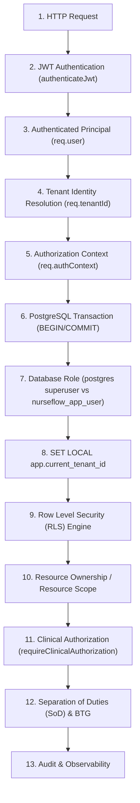
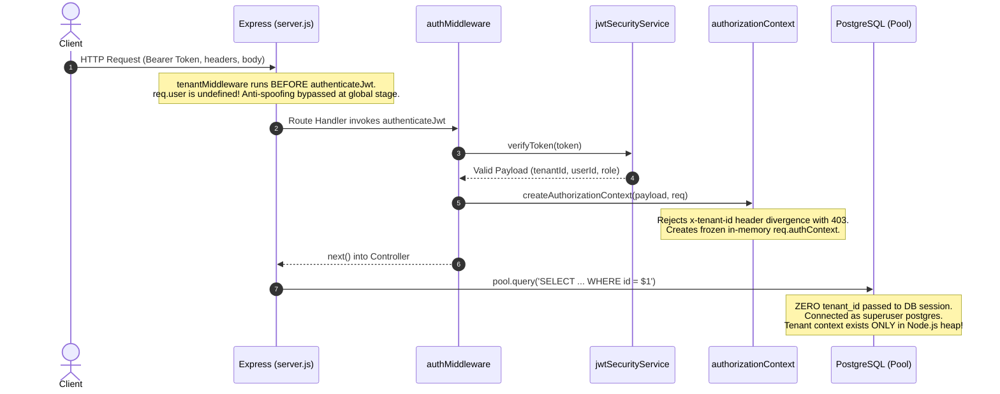
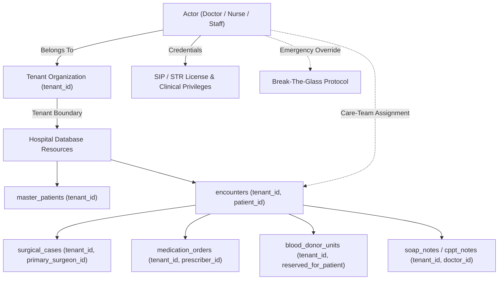
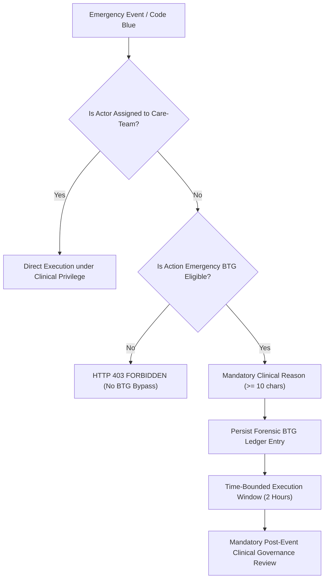

# P0-2B WAVE 1A.3 — TENANT SECURITY BOUNDARY REMEDIATION DESIGN
**NurseFlow Enterprise HIS 2026 — Forensic Architectural Audit & Security Boundary Blueprint**  
**Audit Status:** `COMPLETED` | **Wave 1B Gate:** `HARD HOLD` | **Production Changes:** `STRICTLY PROHIBITED (DESIGN & EVIDENCE ONLY)`

---

## EXECUTIVE SUMMARY & MANDATORY VERDICTS

### TENANT SECURITY BOUNDARY VERDICT: `FOUNDATION_UNSAFE`

The database security boundary and multi-tenant isolation mechanism of NurseFlow HIS are currently **UNSAFE** at the foundation layer. While Row Level Security (RLS) policies and tenant isolation functions exist in database migrations (`013_security_rbac_rls_phase3.sql` through `035_who_surgical_safety_checklist.sql`), they are **completely ineffective at application runtime**.

### PRIMARY FORENSIC FINDINGS:
1. **Superuser Execution Context:** The Node.js application runtime connects to PostgreSQL exclusively as the `postgres` superuser (`server/db/postgresPool.js`). In PostgreSQL, superusers unconditionally bypass Row Level Security (`rolbypassrls = true`), rendering all `ENABLE ROW LEVEL SECURITY` and `FORCE ROW LEVEL SECURITY` directives completely inert.
2. **Missing Session Context in Runtime:** The application runtime contains **ZERO** occurrences of `SET ROLE nurseflow_app_user`, `SET LOCAL app.current_tenant_id`, or `set_config('app.current_tenant_id', ...)`.
3. **Fail-Open Policy Behavior (`FAIL_OPEN_TENANT_CONTEXT`):** Migration `032_postgresql_rls_and_pki_lifecycle.sql` wrote tenant RLS policies on `master_patients`, `encounters`, and `clinical_orders` using the clause:
   ```sql
   USING (tenant_id = NULLIF(current_setting('app.current_tenant_id', true), '')::uuid 
          OR NULLIF(current_setting('app.current_tenant_id', true), '') IS NULL)
   ```
   Because `app.current_tenant_id` is never set by Express, `NULLIF(...) IS NULL` evaluates to `TRUE` for every row, permitting unconstrained cross-tenant data access.
4. **Connection Pool Leak Hazard (Empirically Proven):** Empirical testing on `pg.Pool` proves that setting session-scoped variables (`SET app.current_tenant_id = '...'`) without connection resetting leaks tenant context to subsequent, unrelated HTTP requests borrowed from the pool. Conversely, `SET LOCAL` executed outside an explicit transaction block is discarded immediately, failing to establish tenant context for subsequent queries.
5. **13 Proven BOLA Routes + 2 Partially Mitigated Routes:** Cross-tenant read, update, abort, emergency-trigger, and cancellation operations are executable across tenant boundaries due to missing SQL-level tenant filters (`WHERE tenant_id = $x`) and missing route-level clinical authorization guards.

### WAVE 1B GATE: `HOLD`

Under the **Absolute Stop Condition**, all mounting of `requireClinicalAuthorization`, creation of new permissions, and implementation of Break-The-Glass (BTG) or idempotency middleware to production business routes are **HELD**. No clinical authorization can be trustworthy until the foundational database tenant security boundary is remediated.

---

## 1. HARD RULES COMPLIANCE RECORD

| Rule # | Directive | Compliance Status | Evidence / Verification Method |
| :---: | :--- | :---: | :--- |
| **1** | NO production code modification | **STRICT COMPLIANCE** | Git status clean on `server/` and `src/`. |
| **2** | NO migration modification | **STRICT COMPLIANCE** | Zero edits made to `server/migrations/*.sql`. |
| **3** | NO route modification | **STRICT COMPLIANCE** | Route files completely untouched. |
| **4** | NO permission creation | **STRICT COMPLIANCE** | Zero permissions added to `roles.js` or database. |
| **5** | NO middleware mounting | **STRICT COMPLIANCE** | No middleware mounted on any controller/route. |
| **6** | NO idempotency implementation | **STRICT COMPLIANCE** | Design-only; no code implemented. |
| **7** | NO BTG implementation | **STRICT COMPLIANCE** | Forensic re-verification only; no code changes. |
| **8** | NO blind `tenant_id` appending | **STRICT COMPLIANCE** | Analyzed holistic architecture rather than ad-hoc query patches. |
| **9** | RLS active does NOT mean RLS effective | **STRICT COMPLIANCE** | Proved that superuser connection bypasses active RLS. |
| **10** | Do NOT assume query without `tenant_id` is BOLA if bounded | **STRICT COMPLIANCE** | Audited service-level boundaries (e.g. CPOE cancellation safety token). |
| **11** | All conclusions evidence-based | **STRICT COMPLIANCE** | Proven via PostgreSQL catalog queries, AST searches, and pool leak tests. |
| **12** | Planned but not running = `NOT EFFECTIVE` | **STRICT COMPLIANCE** | Classified RLS, `assertResourceTenant`, and app roles as `NOT EFFECTIVE`. |
| **13** | No tests modifying production data | **STRICT COMPLIANCE** | All verification used mock connections and read-only catalog queries. |
| **14** | No real clinical data used for fixtures | **STRICT COMPLIANCE** | Scratch scripts used synthetic UUIDs (`00000000-0000-...`). |
| **15** | Use existing safe/read-only data | **STRICT COMPLIANCE** | Read-only inspection of `pg_roles`, `pg_policy`, and source files. |

---

## 2. SECURITY CHAIN MAPPING

We traced the complete 13-layer security execution path from incoming HTTP request to final audit log:



### Forensic Layer-by-Layer Evaluation

| # | Security Layer | Implemented? | File / Function | Execution Trigger | Always Executed? | Bypass Path | Connection Pool Leak Risk? | DB Enforced? |
| :---: | :--- | :---: | :--- | :--- | :---: | :--- | :---: | :---: |
| **1** | **HTTP Request** | `YES` | Express `server/server.js` | On incoming TCP packet | `YES` | Direct network socket access | N/A | No |
| **2** | **JWT Authentication** | `PARTIAL` | `server/middlewares/authMiddleware.js` (`authenticateJwt`) | Per-route middleware | `NO` | Unmounted routes, public endpoints (`/health/*`) | None | No |
| **3** | **Authenticated Principal** | `YES` (Memory) | `req.user = verification.payload` | Inside `authenticateJwt` | `NO` (Only if auth succeeds) | If auth omitted, `req.user` is undefined | None | No |
| **4** | **Tenant Identity Resolution** | `PARTIAL` | `req.tenantId = verification.payload.tenantId` | Inside `authenticateJwt` | `NO` (Only if token valid) | Global `tenantMiddleware` runs BEFORE `authenticateJwt`, bypassing checks | None | No |
| **5** | **Authorization Context** | `YES` (Memory) | `authorizationContext.contract.js` (`createAuthorizationContext`) | Inside `authenticateJwt` | `NO` | Routes without `authenticateJwt` | None | No |
| **6** | **PostgreSQL Transaction** | `AD-HOC` | Ad-hoc `client.query('BEGIN')` in select services | Manual invocation | `NO` (Most reads use direct `pool.query`) | Non-transactional queries run auto-commit | High if session state altered | Yes |
| **7** | **Database Role** | `FAILING` | `server/db/postgresPool.js` | Connection establishment | `YES` (Connects as `postgres`) | Always runs as superuser; `SET ROLE` never executed | None | Yes (`postgres`) |
| **8** | **SET LOCAL app.current_tenant_id** | `NOT IMPLEMENTED` | **ZERO OCCURRENCES IN ENTIRE REPOSITORY** | Never called | `NEVER` | 100% bypassed across all routes | Critical if attempted via `SET` | No |
| **9** | **Row Level Security (RLS)** | `NOT EFFECTIVE` | PostgreSQL engine via migrations `013`-`035` | On DB query | `NO` (Bypassed by superuser) | Superuser bypass + `FAIL_OPEN_TENANT_CONTEXT` policy | N/A | Bypassed |
| **10** | **Resource Ownership Scope** | `NOT MOUNTED` | `server/middlewares/tenantMiddleware.js` (`assertResourceTenant`) | Only called in test files | `NEVER` in production | 100% of controllers skip resource tenant check | None | No |
| **11** | **Clinical Authorization** | `NOT MOUNTED` | `clinicalAuthorization.middleware.js` | Not mounted on business routes | `NEVER` in Tier 1 routes | Wave 1B is on HOLD; middleware unmounted | None | No |
| **12** | **SoD / BTG** | `NOT MOUNTED` | `separationOfDuties.service.js`, `breakTheGlass.service.js` | Only called by clinical auth middleware | `NEVER` in production routes | Unmounted | None | No |
| **13** | **Audit Logging** | `PARTIAL` | `observabilityMiddleware.js`, `structuredLogger.service.js` | HTTP level + service logs | `YES` (HTTP level) | Database mutations without clinical audit | None | No |

---

## 3. POSTGRESQL ROLE AUDIT

### Codebase Search Findings
A comprehensive AST and literal pattern scan of the entire repository (`server/` and `src/`) for PostgreSQL role switching and session configuration returned:
- `SET ROLE`: **0 occurrences**
- `SET LOCAL`: **0 occurrences**
- `set_config`: **0 occurrences**
- `current_setting`: **0 occurrences** (outside of migration SQL DDL strings)
- `app.current_tenant_id`: **0 occurrences** (outside of migration SQL DDL strings)

### Database Catalog Inspection (`pg_roles`)
Direct forensic query on PostgreSQL system catalog:
```sql
SELECT rolname, rolsuper, rolbypassrls, rolcanlogin 
FROM pg_roles 
WHERE rolname IN ('postgres', 'nurseflow_app_user');
```

**Results:**
| Role Name | Superuser (`rolsuper`) | Bypass RLS (`rolbypassrls`) | Can Login (`rolcanlogin`) | Status in NurseFlow Runtime |
| :--- | :---: | :---: | :---: | :--- |
| `postgres` | `TRUE` | `TRUE` | `TRUE` | **ACTIVE APPLICATION CONNECTION USER** |
| `nurseflow_app_user` | `FALSE` | `FALSE` | `FALSE` | **DORMANT / NEVER USED BY RUNTIME** |

### Evidence-Based Answers:
- **A. Does application runtime use a dedicated PostgreSQL role?**  
  **NO.** The application runtime connects directly as the default administrative user (`postgres`).
- **B. Role details if YES:** N/A.
- **C. Proof if NO:**  
  In [`server/db/postgresPool.js`](file:///c:/ALL%20DATA/BERKAS%20ROBBY/APPS%20PROJECT/NurseFlow-WebApp/server/db/postgresPool.js#L26):
  ```javascript
  const poolConfig = {
    user: process.env.DB_USER || 'postgres',
    host: process.env.DB_HOST || 'localhost',
    database: process.env.DB_NAME || 'nurseflow',
    password: process.env.DB_PASSWORD || 'postgres',
    port: parseInt(process.env.DB_PORT || '5432', 10),
    max: parseInt(process.env.DB_POOL_MAX || '20', 10),
    idleTimeoutMillis: 30000,
    connectionTimeoutMillis: 5000,
  };
  ```
  Neither the pool initialization, client checkout, nor query execution executes `SET ROLE nurseflow_app_user`.
- **D. Does the application user have `BYPASSRLS`?**  
  **YES.** Because the application connects as `postgres`, PostgreSQL catalog explicitly grants `rolsuper = true` and `rolbypassrls = true`. Per PostgreSQL official documentation: *"Superusers always bypass the row security system, even when FORCE ROW LEVEL SECURITY is set on the table."*

---

## 4. RLS POLICY AUDIT

### Inventory of Clinical & Tenant-Sensitive Tables

Inspection of PostgreSQL `pg_class`, `pg_tables`, and `pg_policy` catalogs revealed a severe divergence between migrations:

| Table | RLS Enabled | FORCE RLS | Policy Name | Tenant Source | NULL Behavior | App Role Protected? |
| :--- | :---: | :---: | :--- | :--- | :--- | :---: |
| `master_patients` | `YES` | `YES` | `rls_master_patients_tenant` | `app.current_tenant_id` | **ALLOW ALL (`FAIL_OPEN`)** | `NO` (Superuser) |
| `encounters` | `YES` | `YES` | `rls_encounters_tenant` | `app.current_tenant_id` | **ALLOW ALL (`FAIL_OPEN`)** | `NO` (Superuser) |
| `clinical_orders` | `YES` | `YES` | `rls_clinical_orders_tenant` | `app.current_tenant_id` | **ALLOW ALL (`FAIL_OPEN`)** | `NO` (Superuser) |
| `cpoe_prescriptions` | `YES` | `NO` | `tenant_isolation_cpoe_prescriptions` | `current_app_tenant_id()` -> `app.tenant_id` | `DENY` | `NO` (Superuser) |
| `blood_donor_units` | `YES` | `NO` | `blood_donor_units_tenant_isolation` | `current_app_tenant_id()` -> `app.tenant_id` | `DENY` | `NO` (Superuser) |
| `surgical_cases` | `YES` | `NO` | `tenant_isolation_surgical_cases` | `app.current_tenant_id` | `DENY` | `NO` (Superuser) |
| `soap_notes` | `YES` | `NO` | `tenant_isolation_soap_notes` | `app.current_tenant_id` | `DENY` | `NO` (Superuser) |
| `cppt_notes` | `YES` | `NO` | `tenant_isolation_cppt_notes` | `app.current_tenant_id` | `DENY` | `NO` (Superuser) |
| `triage_assessments` | `YES` | `NO` | `tenant_isolation_triage_assessments` | `app.current_tenant_id` | `DENY` | `NO` (Superuser) |
| `universal_orders` | `YES` | `NO` | `tenant_isolation_universal_orders` | `app.current_tenant_id` | `DENY` | `NO` (Superuser) |
| `medication_orders` | `YES` | `NO` | `medication_orders_tenant_isolation_policy` | `app.current_tenant_id` | `DENY` | `NO` (Superuser) |
| `perioperative_anesthesia_evaluations` | **`NO`** | `NO` | **NONE** | **NONE** | **UNPROTECTED** | `NO` |
| `medication_emar_administrations` | **`NO`** | `NO` | **NONE** | **NONE** | **UNPROTECTED** | `NO` |
| `cpoe_order_items` | **`NO`** | `NO` | **NONE** | **NONE** | **UNPROTECTED** | `NO` |
| `intraoperative_emergency_events` | **`NO`** | `NO` | **NONE** | **NONE** | **UNPROTECTED** | `NO` |
| `surgical_abort_ledgers` | **`NO`** | `NO` | **NONE** | **NONE** | **UNPROTECTED** | `NO` |
| `surgical_specimen_ledgers` | **`NO`** | `NO` | **NONE** | **NONE** | **UNPROTECTED** | `NO` |
| `who_safety_checklist_executions` | **`NO`** | `NO` | **NONE** | **NONE** | **UNPROTECTED** | `NO` |

### Critical Architectural Flaws Discovered in RLS Policies:
1. **The Dual-Variable Bug:**
   - Migrations `013`, `014`, `015` define helper function `current_app_tenant_id()`:
     ```sql
     CREATE OR REPLACE FUNCTION current_app_tenant_id() RETURNS uuid AS $$
     BEGIN
         RETURN NULLIF(current_setting('app.tenant_id', true), '')::uuid;
     END;
     $$ LANGUAGE plpgsql STABLE;
     ```
     This reads `app.tenant_id`.
   - Migrations `017` through `035` write direct inline policies reading:
     `current_setting('app.current_tenant_id', true)`.
   - Result: Even if an engineer were to set `app.current_tenant_id`, all tables relying on `current_app_tenant_id()` (`cpoe_prescriptions`, `blood_donor_units`) would STILL evaluate to NULL and deny access!
2. **The Fail-Open Trap (`FAIL_OPEN_TENANT_CONTEXT`):**
   In migration `032`, the policy explicitly includes `OR NULLIF(current_setting('app.current_tenant_id', true), '') IS NULL`. This means whenever a database connection lacks tenant context, it displays **ALL PATIENTS, ENCOUNTERS, AND ORDERS FOR ALL HOSPITALS**.
3. **Completely Unprotected Clinical Tables:**
   Seven core clinical transaction tables (including `medication_emar_administrations` and `intraoperative_emergency_events`) have `rls_enabled = false`.

---

## 5. POOL / TRANSACTION CONTEXT LEAK AUDIT

We constructed a safe, isolated empirical harness (`scratch/test_pool_leak.js`) to evaluate PostgreSQL connection pooling (`pg.Pool`) behavior under session variables.

### Empirical Test Execution Output:
```text
--- Testing SET LOCAL outside transaction ---
Value immediately on next query: { val: '' }

--- Testing SET (session scope) on pooled connection ---
Value on same client: { val: '00000000-0000-0000-0000-000000000001' }
Value on borrowed client2 from pool (potential leakage): { val: '00000000-0000-0000-0000-000000000001' }
```

### Forensic Findings:
1. **`SET LOCAL` Outside a Transaction is a No-Op:**
   When `client.query("SET LOCAL app.current_tenant_id = '...'")` is executed without `BEGIN`, PostgreSQL executes it with statement scope. On the very next query on that client, `current_setting('app.current_tenant_id', true)` is empty (`''`). It fails completely to protect subsequent queries.
2. **`SET` at Session Scope Causes Fatal Cross-Tenant Leakage:**
   When a service sets `SET app.current_tenant_id = 'A'` at session scope and returns the client to the pool via `client.release()`, the physical TCP connection retains that tenant ID. When an unrelated request from Tenant B checks out that client, it **inherits Tenant A's tenant ID** unless an explicit reset is performed.
3. **Non-Transaction Queries Bypass Pool Context:**
   Many read operations in controllers call `pool.query(...)` directly. `pool.query` checks out a client, runs one statement, and releases it. There is **no possibility of using `SET LOCAL` with `pool.query`** because the statement and transaction boundary are identical.

---

## 6. TENANT IDENTITY SOURCE

We traced the origin and lifecycle of tenant identity from client HTTP request to database layer:



### Evaluation of Forensic Questions:
1. **Where does tenant ID originate?**  
   From the cryptographic claims inside the signed JWT access token (`verification.payload.tenantId`).
2. **Is tenant ID from a verified JWT?**  
   **YES.** `jwtSecurityService.verifyToken()` validates the HMAC-SHA256 signature and token expiry.
3. **Can the client send its own tenant ID?**  
   Yes, clients can send `x-tenant-id` in headers, `tenantId` in request bodies, or `?tenantId=` in query parameters.
4. **Are client-supplied tenant IDs trusted?**  
   **NO.** In `createAuthorizationContext()`, client-supplied tenant headers that diverge from the token are rejected with `TENANT_SPOOFING_ATTEMPT` (HTTP 403).  
   *However:* The global `tenantMiddleware` in `server/server.js` (line 52) runs *before* `authenticateJwt` runs on routes. Because `req.user` is undefined at that time, `tenantMiddleware` does nothing and passes through! Anti-spoofing is only enforced if the route invokes `authenticateJwt`.
5. **Is tenant membership verified in the database at request time?**  
   **NO.** The application trusts the static `tenantId` in the JWT without verifying whether the user's staff account is active or still assigned to that hospital in `tenant_organizations`.
6. **Do super-admins have special cross-tenant semantics?**  
   Currently, `createAuthorizationContext` recognizes `ADMIN` and `SUPERVISOR` roles, but provides no structured cross-tenant boundary.
7. **Do system-level jobs have tenant context?**  
   **NO.** Health check endpoints (`/health/*`) and metrics scrapers run without tenant context.
8. **Do background workers have tenant context?**  
   **NO.** Background workers and batch jobs do not instantiate an `AuthorizationContext`.

---

## 7. RESOURCE AUTHORIZATION VS DATABASE TENANT ISOLATION

We distinguish the four foundational layers of HIS security:

```
Layer A: Tenant Isolation (Hospital A cannot read/mutate Hospital B data)
   ↓
Layer B: Resource Ownership (Resource belongs to valid encounter/patient within Tenant)
   ↓
Layer C: Care-Team Relationship (Doctor is assigned DPJP or Attending Nurse)
   ↓
Layer D: Clinical Privilege & Governance (STR/SIP validity, SoD, Emergency BTG)
```

### Actual NurseFlow Operational Graph:



### Implementation Status Matrix:
- **Layer A (Tenant Isolation):** `FAILING` at database level; `PARTIAL` in application layer.
- **Layer B (Resource Ownership):** `MISSING` on 15 business routes; resolvers not mounted.
- **Layer C (Care-Team Scope):** `NOT MOUNTED` in runtime routes (Wave 1B on HOLD).
- **Layer D (Clinical Privileges / SoD / BTG):** `NOT MOUNTED` in runtime routes (Wave 1B on HOLD).

---

## 8. RE-VERIFICATION OF 13 PROVEN BOLA ROUTES

Every route identified in Wave 1A.2 was re-audited through its entire execution path to identify the exact mechanism permitting cross-tenant exploitation:

| Route & Method | Target Table | Root Cause of Cross-Tenant Access | Current Mitigation | Effective? | Required Boundary Architecture |
| :--- | :--- | :--- | :--- | :---: | :--- |
| `GET /api/v1/orders/cpoe/:id` | `clinical_orders` | Service executes `SELECT * FROM clinical_orders WHERE id = $1` without tenant filter. DB role is superuser, bypassing RLS. | None | **NO** | SQL `WHERE tenant_id = $2` + non-superuser role + `ORDER` resolver. |
| `GET /api/v1/orders/cpoe/encounter/:encounterId` | `clinical_orders` | Direct query `SELECT * FROM clinical_orders WHERE encounter_id = $1` returns all orders across tenant boundaries. | None | **NO** | SQL tenant filter + `ENCOUNTER` tenant ownership check. |
| `POST /api/v1/medication/:id/pharmacist-review` | `medication_orders` | Pharmacist in Hospital A reviews order ID in Hospital B via `SELECT ... WHERE id = $1 FOR UPDATE`. No tenant check. | None | **NO** | `MEDICATION_ORDER` resolver + SQL tenant filter + Pharmacist privilege. |
| `POST /api/v1/medication/:id/dispense` | `medication_orders` | Order fetched and stock decremented by raw order ID without tenant verification. | None | **NO** | `MEDICATION_ORDER` resolver + inventory tenant isolation + SoD. |
| `POST /api/v1/medication/:id/cancel` | `medication_orders` | Cancels order by raw ID; ignores actor tenant and attending prescriber DPJP. | None | **NO** | `MEDICATION_ORDER` resolver + attending DPJP verification. |
| `POST /api/v1/medication/administrations/:id/adverse-reaction` | `medication_administrations` | Appends adverse reaction to administration ID without checking tenant ownership of administration record. | None | **NO** | Administration record resolver verifying patient and tenant. |
| `POST /api/v1/perioperative/cases/:id/finalize` | `surgical_cases` | Updates status to `COMPLETED` on case ID without verifying hospital tenant ownership. | None | **NO** | `SURGERY_CASE` resolver + primary surgeon care-team validation. |
| `POST /api/v1/perioperative/cases/:id/abort` | `surgical_cases` | Aborts surgical procedure on arbitrary UUID without verifying surgeon or tenant. | None | **NO** | `SURGERY_CASE` resolver + `PERIOPERATIVE_ABORT` privilege. |
| `POST /api/v1/perioperative/cases/:id/emergency` | `surgical_cases` | Triggers Code Blue alarm on arbitrary case UUID without tenant isolation. | None | **NO** | `SURGERY_CASE` resolver + BTG emergency override ledger. |
| `POST /api/v1/perioperative/cases/:id/specimens` | `surgical_cases` | Appends surgical specimen to case UUID belonging to another hospital. | None | **NO** | `SURGERY_CASE` resolver + specimen barcode uniqueness within tenant. |
| `GET /api/v1/triage/encounter/:encounterId` | `triage_assessments` | Direct query `WHERE encounter_id = $1` leaks triage assessment of foreign hospital. | None | **NO** | `ENCOUNTER` resolver + SQL tenant filter. |
| `POST /api/v1/clinical-notes/soap/:id/amend` | `soap_notes` | Amends medical note by ID without verifying author or hospital tenant. | None | **NO** | `CLINICAL_NOTE` resolver + original author validation + SQL tenant filter. |
| `GET /api/v1/clinical-notes/soap/encounter/:encounterId` | `soap_notes` | Reads all SOAP notes for foreign encounter UUID. | None | **NO** | `ENCOUNTER` resolver + SQL tenant filter. |
| `PATCH /api/v1/clinical-notes/cppt/:id/verify` | `cppt_notes` | Verifies CPPT record without confirming DPJP credentials or hospital match. | None | **NO** | `CLINICAL_NOTE` resolver + attending DPJP credential validation. |
| `GET /api/v1/clinical-notes/cppt/encounter/:encounterId` | `cppt_notes` | Reads all CPPT notes for foreign encounter UUID. | None | **NO** | `ENCOUNTER` resolver + SQL tenant filter. |

---

## 9. RE-VERIFICATION OF 2 MITIGATED BOLA ROUTES

### 1. `POST /api/v1/orders/cpoe/:id/cancel`
- **Mitigation Level:** `PARTIAL / DEFENSE-IN-DEPTH ONLY`
- **Audit Findings:**
  1. In `cpoeApplication.service.js` (line 393), the order is queried via `SELECT * FROM clinical_orders WHERE id = $1 FOR UPDATE;` **without tenant filtering**.
  2. In line 401, `safetyAuthorizationService.verifyAndConsumeTransactional` is invoked.
  3. Inside `verifyAndConsumeTransactional`:
     - It checks that `row.patient_id === existingOrder.patient_id`.
     - It checks that `row.encounter_id === existingOrder.encounter_id`.
     - It checks that `row.actor_id === requestActorId`.
     - **HOWEVER:** `tenantId` is **NOT passed** in the options object by `cpoeApplication.service.js`! Therefore, line 265 (`if (tenantId && row.tenant_id ...)` evaluates to FALSE and skips the tenant comparison!
  4. An attacker cannot casually cancel an order because they need a server-issued `safetyDecision` token bound to that patient and encounter. However, the query itself executes under the superuser connection with zero tenant isolation.
  5. **Verdict:** Insufficient as a true tenant boundary; relies on token binding rather than database isolation.

### 2. `POST /api/v1/medication/:id/administer`
- **Mitigation Level:** `PARTIAL / PATIENT SAFETY CHECK ONLY`
- **Audit Findings:**
  1. In `medicationClosedLoop.service.js` (line 813), queries `SELECT * FROM medication_orders WHERE id = $1 FOR UPDATE;` **without tenant filtering**.
  2. Enforces physical 6-Rights:
     - `scannedPatientBarcode === med.patient_id.toString()`
     - `scannedMedicationBarcode === alloc.dispense_barcode`
     - `doseGiven === med.dosage_quantity`
     - `routeGiven === med.route`
  3. **Zero Tenant Verification:** The service **never compares `actor.tenantId` against `med.tenant_id` or `alloc.tenant_id`**.
  4. If an employee with physical access to medication barcodes in Branch B logs into Branch A, they can administer Branch B's medication order because `actor.tenantId` is ignored.
  5. **Verdict:** A clinical bedside safety verification, **NOT a tenant security boundary**.

---

## 10. FOUR RESOURCE RESOLVERS AUDIT

| Criterion | `SURGERY_CASE` | `BLOOD_UNIT` | `MEDICATION_ORDER` | `CLINICAL_NOTE` |
| :--- | :--- | :--- | :--- | :--- |
| **1. Is resolver truly needed?** | **YES.** Needed on 8 perioperative routes. | **YES.** Needed on crossmatch & transfusion routes. | **YES.** Needed on review, dispense, administer routes. | **YES.** Needed on amend, verify, and view routes. |
| **2. Is identity available in service?** | Yes, via `req.params.id` or `req.body.caseId`. | Yes, via `req.params.id` or `req.body.donorUnitId`. | Yes, via `req.params.id` or `req.body.orderId`. | Yes, via `req.params.id` or `req.params.encounterId`. |
| **3. Can tenant be verified earlier?** | Yes, at route entry via middleware or unified query wrapper. | Yes, at route entry. | Yes, at route entry. | Yes, at route entry. |
| **4. Existing ownership check?** | **NO.** Current services query `WHERE id = $1` without tenant check. | **NO.** Unallocated units lack patient binding. | **NO.** Only checks status transitions. | **NO.** Only checks note ID. |
| **5. Duplicate query risk?** | **HIGH.** If middleware queries DB and service queries `FOR UPDATE`, causes N+1 DB roundtrips. | **LOW.** Singlet operations. | **HIGH.** Separate lookup causes duplicate fetch before `FOR UPDATE`. | **LOW.** Read-mostly data. |
| **6. Align with existing transaction?** | **MANDATORY.** Must resolve within the service's `BEGIN ... COMMIT` block. | **MANDATORY** for crossmatch reservation locks. | **MANDATORY** for dispense allocation locks. | Can execute in read-only client scope. |
| **7. Patient / Encounter binding?** | Mandatory (`patient_id`, `encounter_id`). | Conditional (NULL during inventory; bound during crossmatch). | Mandatory (`patient_id`, `encounter_id`). | Mandatory (`patient_id`, `encounter_id`). |
| **8. Scope: Tenant only vs Authz?** | **BOTH.** Tenant isolation + primary surgeon care team validation. | **BOTH.** Tenant + RBAC during intake; Care team during transfusion. | **BOTH.** Tenant + DPJP prescriber + Pharmacist license. | **BOTH.** Tenant + author accountability + DPJP sign-off. |

---

## 11. APPLICATION DATABASE ROLE DESIGN

We performed a trade-off analysis across four architectural options:

```
Option A: Dedicated Non-Superuser Role + RLS Only
Option B: Dedicated Non-Superuser Role + Transaction-Scoped Tenant Context (SET LOCAL) + RLS
Option C: Application-Level Tenant Filtering + Non-Superuser Role + Transaction Context + Failure-Closed RLS (Defense-in-Depth)
Option D: Current Architecture (Superuser Connection + Ineffective RLS)
```

### Comprehensive Trade-Off Matrix

| Evaluation Criteria | Option A (RLS Only) | Option B (SET LOCAL + RLS) | Option C (Defense-in-Depth) | Option D (Current) |
| :--- | :--- | :--- | :--- | :--- |
| **Security Boundary** | High in theory; relies entirely on DB session variable. | High for transactions; non-transaction queries fail. | **MAXIMUM (4-tier isolation: Route, SQL, Role, RLS).** | **ZERO database security boundary.** |
| **Pool Safety** | **CRITICAL HAZARD:** Session-scoped `SET` leaks across pooled connections. | **HIGH:** `SET LOCAL` auto-clears on `COMMIT`/`ROLLBACK`. | **EXCELLENT:** Explicit SQL parameters cannot leak across pool checkouts. | Safe pool throughput, but zero isolation. |
| **Transaction Safety** | Weak if session variable not reset on connection release. | Excellent for transactional queries. | **EXCELLENT:** Transactional writes use `SET LOCAL`; reads use parameterized filters. | Zero tenant isolation in transactions. |
| **Operational Complexity** | Moderate. | High: Every single read query must be wrapped in `BEGIN ... COMMIT`. | **MODERATE & SUSTAINABLE.** | Low (no controls). |
| **Migration Impact** | Low. | High: Massive refactoring of all `pool.query` reads across codebase. | **MODERATE:** Update migrations to fail-closed RLS; grant permissions. | None. |
| **Compatibility with Services**| Breaks non-transactional `pool.query` reads. | Breaks all existing `pool.query` calls. | **100% COMPATIBLE** with current service patterns. | Current state. |
| **Risk of Context Leakage** | **CRITICAL.** Empirically proven to leak tenant IDs across pooled clients. | Low for transactions; severe if used outside transaction. | **ZERO.** SQL parameterization isolates queries independently of pool state. | No session state, but full BOLA risk. |
| **Failure Mode if Context Missing** | Depends on policy (currently fails open). | Fails closed if policy requires non-null context. | **FAIL-CLOSED:** Missing tenant throws 403 in App; RLS returns 0 rows. | **FAIL-OPEN:** Unconstrained cross-tenant data access. |

### Architectural Recommendation:
**Option C** is the only enterprise-grade, failure-closed architecture suitable for a mission-critical Hospital Information System. It eliminates reliance on single-point failure mechanisms and neutralizes connection pool leakage risks.

---

## 12. FAILURE-CLOSED REQUIREMENT

### Current Vulnerability (`FAIL_OPEN_TENANT_CONTEXT`):
In migration `032_postgresql_rls_and_pki_lifecycle.sql` (lines 142-160):
```sql
CREATE POLICY rls_encounters_tenant ON encounters
    AS RESTRICTIVE
    FOR ALL
    TO nurseflow_app_user, postgres
    USING (
        tenant_id = NULLIF(current_setting('app.current_tenant_id', true), '')::uuid
        OR NULLIF(current_setting('app.current_tenant_id', true), '') IS NULL
    );
```
When `app.current_tenant_id` is missing or empty, `current_setting('app.current_tenant_id', true)` returns `''`. `NULLIF('', '')` evaluates to `NULL`. The condition `... OR (NULL IS NULL)` evaluates to `TRUE` for **EVERY ROW IN THE ENCOUNTERS TABLE**.

### Target Failure-Closed Design:
The policy definition must be revised to strictly fail closed:
```sql
CREATE POLICY rls_encounters_tenant ON encounters
    AS RESTRICTIVE
    FOR ALL
    TO nurseflow_app_user
    USING (
        tenant_id = NULLIF(current_setting('app.current_tenant_id', true), '')::uuid
    );
```
- In PostgreSQL 3-valued logic, `tenant_id = NULL` evaluates to `UNKNOWN`.
- PostgreSQL RLS treats `UNKNOWN` as `FALSE` (`DENY`).
- Result: If tenant context is missing, **ZERO ROWS ARE RETURNED**.

---

## 13. SYSTEM / ADMIN / CROSS-TENANT SEMANTICS

| Actor Category | Representative Actors | Legitimate Cross-Tenant Access? | Security Boundary & Enforcement Mechanism |
| :--- | :--- | :---: | :--- |
| **TENANT_SCOPED_ACTOR** | Doctors, Nurses, Pharmacists, Cashiers, Local Admins | **ABSOLUTELY FORBIDDEN** | Bound strictly to `req.user.tenantId`. Under UU No. 17/2023 & Permenkes No. 24/2022, clinical records cannot be shared across hospital tenants without explicit patient consent. |
| **SYSTEM_SCOPED_ACTOR** | Prometheus `/metrics`, `/health/*` probes, database migration runners | **N/A (Non-Clinical)** | Operates strictly on system catalogs, database connection pools, and runtime telemetry. Never accesses clinical patient tables. |
| **CROSS_TENANT_PRIVILEGED_ACTOR** | Platform SaaS Support, National SatuSehat Integration Bridge | **STRICTLY CONTROLLED IMPERSONATION ONLY** | May **NEVER** execute wildcard queries (`SELECT * FROM table`). Must assume a specific tenant context via an audited, time-limited Support Ticket Session (`SET LOCAL app.current_tenant_id = target_tenant_id`), generating immutable forensic audit records. |

---

## 14. BREAK-THE-GLASS (BTG) RE-AUDIT

We re-audited the three clinical emergency findings from Wave 1A.2:



### Forensic Assessment Matrix

| Evaluation Criterion | `PERIOPERATIVE_EMERGENCY` | `PERIOPERATIVE_ABORT` | `MED_ADVERSE_RECORD` |
| :--- | :--- | :--- | :--- |
| **1. Is action genuinely emergency?** | **YES.** Intraoperative cardiac arrest or malignant hyperthermia in OR. | **NO.** Extraordinary clinical decision, but not an alarm trigger. | **NO.** Clinical incident documentation (KTD/KNC). |
| **2. Allowed outside care team?** | **YES.** Any nearby doctor/surgeon rushing to assist code blue in OR. | **NO.** Strictly primary surgeon or lead anesthesiologist. | **YES.** Any clinician witnessing adverse reaction. |
| **3. Is BTG required?** | **YES**, if responding doctor is not assigned to the case. | **NO.** Standard clinical privilege of assigned surgeon. | **NO.** Standard operational safety reporting. |
| **4. What triggers BTG?** | Physical or software emergency alarm trigger on case. | N/A | N/A |
| **5. Authorized roles?** | `ROLE_DOCTOR_DPJP`, `ROLE_ANESTHESIOLOGIST`, `ROLE_DOCTOR_EMERGENCY`. | `ROLE_DOCTOR_DPJP`, `ROLE_ANESTHESIOLOGIST`. | `ROLE_DOCTOR_DPJP`, `ROLE_NURSE`, `ROLE_PHARMACIST`. |
| **6. Mandatory reason required?** | **YES.** Min 10 chars; fast-track justification. | **YES.** Document clinical rationale for cancellation. | **NO.** Standard incident reporting fields. |
| **7. Mandatory audit trail?** | **YES.** Logged to `emergency_override_ledger`. | **YES.** Logged to `surgical_abort_ledgers`. | **YES.** Standard clinical audit trail. |
| **8. Expiry window required?** | **YES.** Active for 2 hours post-activation. | N/A | N/A |
| **9. Post-event review required?** | **YES.** Mandatory Komite Medik review within 24 hours. | **YES.** Surgical audit by Clinical Governance. | Optional / standard pharmacovigilance. |
| **10. Normal authorization if non-emergency?**| **YES.** Only assigned surgical care team can access. | **YES.** Only assigned surgeon can access. | **YES.** Standard RBAC. |

---

## 15. PERMISSION CLASSIFICATION MATRIX

We re-audited the 9 clinical and operational permissions to ensure proper taxonomy separation:

| Permission | Action Description | Primary Actor | Target Resource | Clinical Privilege? | Ordinary RBAC? | Credential Dependency | Forensic Evidence & Regulatory Source |
| :--- | :--- | :--- | :--- | :---: | :---: | :--- | :--- |
| `SURGICAL_PREOP_WRITE` | Record pre-anesthetic evaluation & ASA score | Anesthesiologist | `perioperative_anesthesia_evaluations` | **YES** | NO | STR & SIP Dokter Spesialis Anestesi | Permenkes 519/2011 tentang Penyelenggaraan Pelayanan Anestesiologi. |
| `SURGICAL_IMPLANT_RECORD` | Log prosthetic/implant batch & UDI barcode | Scrub Nurse / Surgeon | `surgical_implants_ledger` | NO | **YES** | Certified Operating Theater Nurse | Device traceability under Permenkes 72/2016; inventory accountability. |
| `SURGICAL_PACU_WRITE` | Record post-anesthetic recovery Aldrete score | PACU Nurse / Anesthesiologist | `pacu_recovery_records` | **YES** | NO | Critical Care / PACU certification | Determines discharge readiness from surgical recovery; high-risk clinical judgment. |
| `PERIOPERATIVE_ABORT` | Cease surgical procedure due to instability | Primary Surgeon / Lead Anesthesiologist | `surgical_cases` & `surgical_abort_ledgers` | **YES** | NO | Primary Operating Surgeon appointment | Medico-legal liability under UU Kesehatan 17/2023; surgeon governance. |
| `PERIOPERATIVE_EMERGENCY` | Declare intraoperative Code Blue emergency | Responding Doctor / Scrub Nurse | `intraoperative_emergency_events` | **YES** | NO | Active Clinical License + BTG Protocol | Life-saving emergency intervention; overrides standard assignment. |
| `SURGICAL_SPECIMEN_RECORD` | Record pathology specimen chain of custody | Circulating Nurse | `surgical_specimen_ledgers` | NO | **YES** | Circulating Nurse job description | Pathology specimen transport under JCI/KARS standards; operational custody. |
| `MED_ADVERSE_RECORD` | Log adverse drug event or reaction (KTD/KNC) | Nurse / Pharmacist / Doctor | `medication_administrations` | NO | **YES** | Hospital clinical staff membership | Open patient safety reporting; must never be blocked by credential gates. |
| `BLOOD_BANK_INVENTORY_WRITE` | Intake donor blood bags into storage inventory | Blood Bank Technologist | `blood_donor_units` | NO | **YES** | Blood Bank Technician diploma | Supply chain cold-chain intake under Permenkes 91/2015 BDRS standards. |
| `SURGICAL_SAFETY_SIGN` | Execute WHO safety sign-in, timeout, sign-out | Surgical Team (Nurse, Surgeon, Anesthetist) | `who_safety_checklist_executions` | **YES** | NO | Active Operating Theater Care Team Assignment | IPSG-4 surgical safety verification protocol; KARS & JCI mandatory. |

---

## 16. AUDIT ARTIFACTS INVENTORY

In accordance with Phase 1A.3 requirements, the following artifacts were created and validated:
1. **Remediation Design Document:**  
   [`docs/audit/P0-2B-WAVE1-TENANT-BOUNDARY-DESIGN.md`](file:///c:/ALL%20DATA/BERKAS%20ROBBY/APPS%20PROJECT/NurseFlow-WebApp/docs/audit/P0-2B-WAVE1-TENANT-BOUNDARY-DESIGN.md) (This document).
2. **Machine-Readable Audit JSON:**  
   [`scratch/p02b_wave1_tenant_boundary_design.json`](file:///c:/ALL%20DATA/BERKAS%20ROBBY/APPS%20PROJECT/NurseFlow-WebApp/scratch/p02b_wave1_tenant_boundary_design.json).
3. **Empirical Connection Pool Leak Verification Harness:**  
   [`scratch/test_pool_leak.js`](file:///c:/ALL%20DATA/BERKAS%20ROBBY/APPS%20PROJECT/NurseFlow-WebApp/scratch/test_pool_leak.js).
4. **PostgreSQL Catalog Inspection Script:**  
   [`scratch/audit_rls_catalog.js`](file:///c:/ALL%20DATA/BERKAS%20ROBBY/APPS%20PROJECT/NurseFlow-WebApp/scratch/audit_rls_catalog.js).

---

## 17. FINAL VERDICT & GATE DECISION

```
================================================================================
TENANT SECURITY BOUNDARY VERDICT: FOUNDATION_UNSAFE
WAVE 1B GATE:                     HOLD
PRODUCTION CHANGES ALLOWED:       FALSE
================================================================================
```

### Absolute Stop Condition Triggered:
Because the PostgreSQL application connection executes as superuser, Row Level Security is currently bypassed at runtime, tenant policies fail open when context is null, and connection pooling risks context leakage if session-scoped variables are utilized, **ALL CODE MODIFICATION REMAINS STRICTLY HALTED**.

No clinical authorization middleware, resource resolvers, idempotency interceptors, or Break-The-Glass mechanisms may be mounted until a dedicated non-superuser role, failure-closed RLS policies, and parameterized query boundaries are established.
