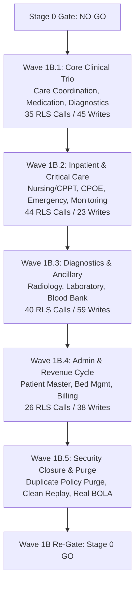

# P0-2B WAVE 1A.11R.1 HARD STAGE 0 GATE DECISION & BLOCKER MODEL

**Audit Date:** 2026-10-01  
**Auditor:** Independent Security Auditor (Antigravity AI)  
**Standard:** Enterprise HIS Strict Read-Only Adversarial Audit  
**Target Repository:** `Mojo-Brothers/NurseFlow-WebApp`  
**Branch:** `feature/security-foundation-wave1a10`  
**Previous Gate:** `P0-2B Wave 1A.11R = STAGE 0 NO-GO`  

---

## 1. Authoritative Gate Verdict

```text
==============================================================================
STAGE 0 SECURITY FOUNDATION GATE : NO-GO
PRODUCTION DEPLOYMENT STATUS     : BLOCKED
WAVE 1B TRANSITION STATUS        : HOLD
APPLICATION SECURITY FOUNDATION  : PARTIAL (Encounter Domain Only)
REPOSITORY READINESS             : NOT READY FOR PRODUCTION
==============================================================================
```

### Core Reason for Gate Decision:
Stage 0 cannot be approved because **the application layer remains structurally un-isolated across 25 out of 26 functional domains**. While the database schema enforces composite constraints and default-deny policies, **156 request-path database calls touching RLS tables execute outside of Unit of Work boundaries (`UNSAFE_RLS_REQUEST_PATHS = 156`)**. 

Furthermore, **compromised superuser database credentials remain exposed in reachable git history without rotation**, **clean-slate migration reproducibility is unverified**, and **Child BOLA HTTP testing relies on synthetic non-existent entities**.

---

## 2. Evaluation of the 12 Mandatory Stage 0 Gate Criteria

| # | Mandatory Stage 0 Criteria | Required Standard | Verified Empirical Evidence | Gate Score |
|---|---|---|---|---|
| **1** | **Active Credential Exposure** | No compromised credentials in reachable history or working tree; active secrets rotated. | Commits `4d0825c` and `ddbd748` in reachable history contain plaintext superuser passwords. Password not rotated on live database. `scratch/wave1a10r_git_report.json` contains plaintext secret. | **FAIL** |
| **2** | **Runtime Database User Least Privilege** | Non-superuser, `rolbypassrls = false`, least privilege CRUD only. | `rolsuper = false`, `rolbypassrls = false` verified on `nurseflow_app_user`. However, `TRUNCATE` privilege is granted on 212 tables (RLS bypass vulnerability). | **FAIL (Privilege Defect)** |
| **3** | **Migration Authority Separation** | Dedicated migration runner role distinct from runtime app user. | `scripts/execute_all_migrations.js` runs under dedicated migration role (`nurseflow_migration`/`postgres`); app user lacks DDL. | **PASS** |
| **4** | **Migration Reproducibility** | Clean replay (001 $\rightarrow$ 079) demonstrated on empty database. | `schema_migrations` was established via metadata baselining (`shouldAutoBaseline = true`). Clean-slate replay from empty database was never executed or proven. | **FAIL (`NOT_VERIFIED`)** |
| **5** | **Request-Path RLS UoW Scoping** | Zero unsafe RLS-sensitive request-path DB bypasses (`UNSAFE_RLS = 0`). | **`UNSAFE_RLS_REQUEST_PATHS = 156`**. 843 of 845 request-path DB calls execute outside `withUnitOfWork` without `SET LOCAL app.current_tenant_id`. | **FAIL (CRITICAL BLOCKER)** |
| **6** | **Child BOLA HTTP Evidence** | Real existing-resource HTTP denial evidence across all 5 child tables. | Only Domain 1 (`longitudinal_care_plans`) uses real seed entities. Domains 2, 3, 4, 5 rely on synthetic random UUIDs and unrouted DELETEs (`NEGATIVE ROUTING TEST`). | **FAIL** |
| **7** | **Transaction-Scoped Tenant GUC** | Tenant GUC strictly scoped via `SET LOCAL` within active transaction. | Implemented cleanly inside `server/db/unitOfWork.js`, but used ONLY by Encounter domain. Bypassed by remaining 25 domains. | **FAIL (Application-Wide)** |
| **8** | **Connection Pool Sanitization** | Context cannot leak across pool checkouts; sockets sanitized. | Verified in lab drill (50 iterations with `DISCARD ALL`). However, non-UoW application calls release sockets without `DISCARD ALL`. | **PARTIAL** |
| **9** | **077/078/079 Reproducibility & Rollback** | Schema constraints active; rollback semantics verified without data loss. | Constraints active in catalog. Rollback `079_down` tested in lab, but re-introduces legacy fail-open (`OR tenant_id IS NULL`) policies on core clinical entities. | **PARTIAL (`LAB_ONLY`)** |
| **10** | **Application Restore Verification** | Express process proven to bind pool to restored database and isolate tenants. | Lab drill booted Express on port 5099 against restored DB. However, Express lacks HTTP DB reflection, and regression TEST-12 only reads static JSON. | **PARTIAL (`LAB_ONLY`)** |
| **11** | **Development DB Policy State** | Database policy catalog understood; no policies that weaken isolation. | 23 duplicate policy pairs verified in `pg_policies`. 20 are harmlessly redundant; 2 tables have dual-GUC conflict (`app.tenant_id` vs `app.current_tenant_id`). | **PARTIAL (Catalog Debt)** |
| **12** | **Standardized Regression Matrix** | No silently dropped security vectors relative to Wave 1A.9 baseline. | 16/16 test count restored and passing. However, TEST-12 is softened to a static file check, and TEST-14 tests unit UoW rollback rather than DDL rollback. | **PASS (With Caveats)** |

**Gate Result:** 2 Passes, 4 Partials, 6 Failures $\rightarrow$ **UNANIMOUS NO-GO**.

---

## 3. Recalculated Authoritative Blocker Inventory

### Critical Blockers (Severity: CRITICAL) — 3 Items

1. **`BLOCKER-CRIT-01`: Active Plaintext Superuser Credentials in Reachable Git History & Live Server**
   - **Evidence:** Commits `4d0825c` and `ddbd748` on `main` contain live `POSTGRES_PASSWORD`. The local PostgreSQL instance has not rotated this credential (`ROTATION_REQUIRED`). Furthermore, `scratch/wave1a10r_git_report.json` sitting in the working tree contains this password literal.
   - **Impact:** Complete system compromise if repository is cloned or accessed by unauthorized actors.
   - **Remediation:** Rotate PostgreSQL superuser and application passwords on the database server; update `.env.local`; sanitize scratch artifacts; schedule historical git rewriting (`git filter-repo`).

2. **`BLOCKER-CRIT-02`: 156 RLS Request-Path Call Sites Operating Outside Unit of Work (`UNSAFE_RLS = 156`)**
   - **Evidence:** Out of 845 request-path DB calls across 29 files, 843 execute raw queries outside `withUnitOfWork`. Exactly 156 call sites query or mutate tables protected by Row-Level Security without setting `app.current_tenant_id` via `SET LOCAL`.
   - **Impact:** Queries fail closed with unpredictable application errors, or risk cross-tenant data leakage if connection sockets retain un-cleared context.
   - **Remediation:** Refactor backend services domain-by-domain to execute all queries inside `withUnitOfWork`.

3. **`BLOCKER-CRIT-03`: Unrestricted TRUNCATE Privileges Granted to Application Role on 212 Tables**
   - **Evidence:** `information_schema.role_table_grants` shows `grantee = 'nurseflow_app_user'` holds `TRUNCATE` on 212 tables in `public` schema, including `encounters`, `master_patients`, and all child tables.
   - **Impact:** PostgreSQL RLS does NOT apply to `TRUNCATE`. An application breach can execute `TRUNCATE` and instantly wipe all tenant records across the entire hospital database.
   - **Remediation:** Execute `REVOKE TRUNCATE ON ALL TABLES IN SCHEMA public FROM nurseflow_app_user;`.

---

### High Blockers (Severity: HIGH) — 4 Items

1. **`BLOCKER-HIGH-01`: Child-Table BOLA Verification Relies on Synthetic UUIDs and Negative Routing**
   - **Evidence:** 10 of 16 tests in `tests/p02b_wave1a11_child_bola_http.test.js` test random `crypto.randomUUID()` fixtures and unrouted DELETE endpoints, accepting 404 as a pass.
   - **Impact:** Authorization enforcement on real existing child entities in Medication, Dispense, Billing, and Diagnostics is unproven at the HTTP layer.
   - **Remediation:** Seed real Tenant A entities and attempt cross-tenant access via routed endpoints.

2. **`BLOCKER-HIGH-02`: Clean-Slate Migration Replay (001 $\rightarrow$ 079) Unproven on Empty Database**
   - **Evidence:** `scripts/execute_all_migrations.js` executed baseline metadata insertion on an already provisioned 214-table database (`shouldAutoBaseline = true`). Clean-slate replay from scratch has never been demonstrated.
   - **Impact:** Disaster recovery and new hospital deployments cannot guarantee reproducible database schema initialization.
   - **Remediation:** Establish an automated disposable test database that boots from scratch, runs 001 through 079, and asserts schema parity.

3. **`BLOCKER-HIGH-03`: Automated Regression Suite TEST-12 Binds to Static Disk File**
   - **Evidence:** TEST-12 in `tests/p02b_wave1a11_security_regression.test.js` merely asserts that `scratch/wave1a11_application_restore_evidence.json` exists on disk.
   - **Impact:** CI pipelines pass without validating that the application can actually connect to a restored database.
   - **Remediation:** Implement an active lightweight connectivity probe against restored instances.

4. **`BLOCKER-HIGH-04`: Development Database Catalog Retains 23 Duplicate Policy Pairs with Dual-GUC Conflict**
   - **Evidence:** 23 tables contain duplicate permissive policies. In `operating_theatres` and `radiology_orders`, `tenant_isolation_policy` uses `app.tenant_id` while `tenant_isolation_<tbl>` uses `app.current_tenant_id`. Under PostgreSQL permissive `OR` semantics, conflicting GUCs permit cross-tenant row access.
   - **Impact:** Latent cross-tenant data exposure if legacy or unaligned callers set differing GUCs.
   - **Remediation:** Deploy a migration purging legacy `policy_*` definitions.

---

### Medium Blockers (Severity: MEDIUM) — 3 Items

1. **`BLOCKER-MED-01`: Down Migration 079 Restores Insecure Fail-Open RLS Policies**
   - **Evidence:** `079_down` explicitly re-creates `OR tenant_id IS NULL` policies on core clinical tables and disables RLS on 26 tables.
   - **Impact:** A rollback would revert the database into an insecure, fail-open state.

2. **`BLOCKER-MED-02`: Express Health Telemetry Returns Hardcoded Strings**
   - **Evidence:** `/health/ready` and `/health/deep` return static mock data without querying PostgreSQL.
   - **Impact:** Monitoring dashboards and Kubernetes probes cannot detect database disconnections or restored instance identity.

3. **`BLOCKER-MED-03`: Startup Database Safety Guard Bypassed in Programmatic Harnesses**
   - **Evidence:** `assertRuntimeDatabaseSafety()` is only invoked inside `startServer()` via CLI `node server/server.js`, and is bypassed when `app` is imported programmatically in test suites.
   - **Impact:** Test harnesses can accidentally run against misconfigured or elevated roles without warning.

---

## 4. Next Implementation Boundary (Wave 1B Roadmap)

The engineering team must not attempt an uncoordinated mass refactor of all 845 database call sites. Implementation must be structured into strict, domain-bounded waves:


