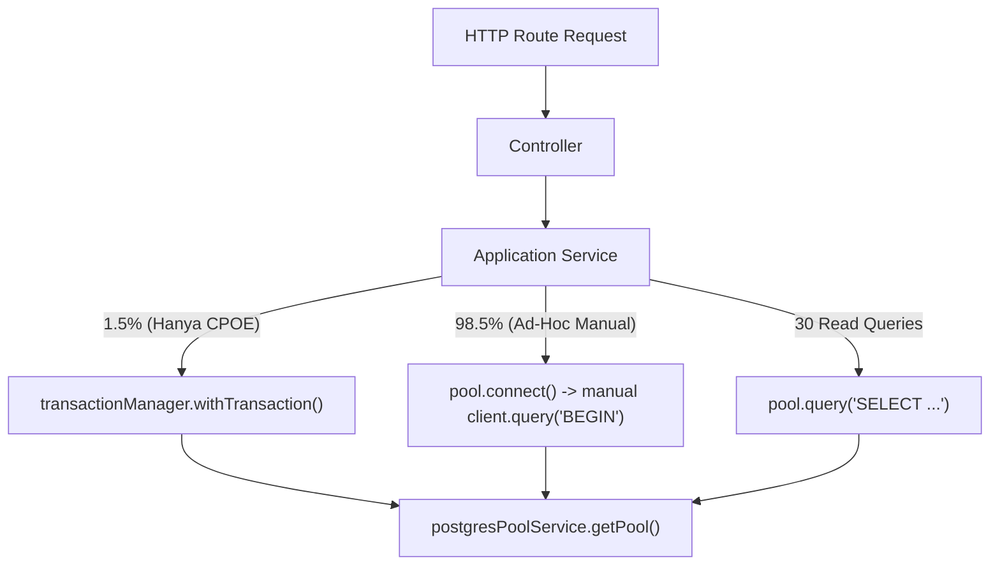
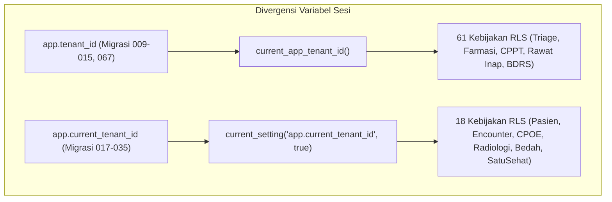

# P0-2B WAVE 1A.4 — TENANT BOUNDARY ARCHITECTURE GATE
**NurseFlow Enterprise HIS 2026 — Architectural Gate, Feasibility Proof & Threat Surface Analysis**  
**Role:** Principal Security Architect + PostgreSQL RLS Engineer + Enterprise HIS Reviewer  
**Status Gate:** `DESIGN_REVISION_REQUIRED` | **Production Changes:** `FALSE` | **Wave 1B:** `HOLD`

---

## EXECUTIVE SUMMARY & PRIMARY QUESTION ANSWER

### PRIMARY QUESTION:
> *"Apakah NurseFlow dapat menggunakan model `application tenant context + transaction-scoped RLS + non-superuser runtime role + explicit resource ownership` tanpa memaksa seluruh codebase mengubah semua `pool.query()` menjadi transaksi manual?"*

### DEFINITIVE ANSWER:
**TIDAK DAPAT — JIKA DIBIARKAN MENGGUNAKAN RAW `pool.query()` TANPA CENTRAL DATABASE CONTEXT WRAPPER.**

### BUKTI EMPIRIS & KENDALA FUNDAMENTAL:
1. **`pool.query()` Berjalan di Luar Transaksi (Auto-Commit):**  
   Pengujian empiris membuktikan bahwa pemanggilan `SET LOCAL` di luar blok transaksi eksplisit adalah *immediate no-op* (nilainya langsung terhapus seketika).
2. **Prepared Statement Menolak Multi-Statement Command:**  
   Pengujian empiris membuktikan bahwa PostgreSQL Extended Query Protocol (parameterized queries dengan `$1, $2`) menolak multi-command string seperti `SET LOCAL app.current_tenant_id = $1; SELECT ...` dengan error fatal:  
   `cannot insert multiple commands into a prepared statement`.
3. **RLS Fail-Closed Menolak Query Berpredikat Eksplisit Jika Konteks Sesi Kosong:**  
   Pengujian empiris membuktikan bahwa saat beralih ke peran non-superuser (`nurseflow_app_user`), tabel dengan RLS fail-closed (`surgical_cases`) mengembalikan **0 baris** saat query mengeksekusi `WHERE tenant_id = '...'` tanpa adanya variabel sesi `app.current_tenant_id` (jumlah baris anjlok dari **25** menjadi **0**).
4. **Pola Koneksi Saat Ini 98.5% Ad-Hoc:**  
   Abstraksi sentral `transactionManager.withTransaction` hanya digunakan oleh **1 file** (`cpoeApplication.service.js`, ~1.5% akses DB). Sebanyak 27 file service lainnya mengeksekusi 645 pemanggilan `client.query()` dan 30 pemanggilan `pool.query()` secara manual dan tidak terkelola.

### SOLUSI ARSITEKTUR YANG DIPERLUKAN:
NurseFlow **TIDAK PERLU** memaksa developer menulis `client = await pool.connect(); await client.query('BEGIN'); ...` manual di ratusan rute. Sebaliknya, NurseFlow **WAJIB MENGADOPSI SEBUAH CENTRALIZED REQUEST-SCOPED DATABASE CONTEXT WRAPPER** (misalnya `db.query(sql, params)` yang membungkus *single read* dalam mikro-transaksi otomatis atau mengelola *client lease* berbasis AsyncLocalStorage) sebelum beralih ke peran database non-superuser.

---

## PART 1 — DATABASE ROLE SECURITY MODEL (`ROLE_SECURITY_MODEL`)

### Inspeksi Katalog Sistem PostgreSQL:
Pemeriksaan langsung terhadap `pg_roles`, `pg_auth_members`, `pg_namespace`, `pg_class`, dan `information_schema.role_table_grants`:

```sql
SELECT rolname, rolsuper, rolinherit, rolcreaterole, rolcreatedb, 
       rolcanlogin, rolreplication, rolbypassrls, rolconnlimit
FROM pg_roles;
```

**Temuan Katalog:**
| Role Name | Superuser | Inherit | CreateRole | CreateDB | CanLogin | BypassRLS | Status di Katalog PostgreSQL |
| :--- | :---: | :---: | :---: | :---: | :---: | :---: | :--- |
| `postgres` | `TRUE` | `TRUE` | `TRUE` | `TRUE` | `TRUE` | `TRUE` | **PENGGUNA AKTIF RUNTIME** |
| `nurseflow_app_user` | `FALSE` | `TRUE` | `FALSE` | `FALSE` | **`FALSE`** | `FALSE` | **LOGIN DINONAKTIFKAN / TIDAK BISA KONEK** |
| `nurseflow_admin` | — | — | — | — | — | — | **TIDAK ADA DI BASIS DATA (`ABSENT`)** |
| `nurseflow_ro` | — | — | — | — | — | — | **TIDAK ADA DI BASIS DATA (`ABSENT`)** |
| `public` | `FALSE` | `TRUE` | `FALSE` | `FALSE` | `FALSE` | `FALSE` | Pseudo-role |

### Jawaban 9 Pertanyaan Kunci Role Security:
1. **Siapa owner schema `public`?**  
   `pg_database_owner` (PostgreSQL 16 standard).
2. **Siapa owner tabel klinis?**  
   Seluruh tabel klinis (`master_patients`, `encounters`, `surgical_cases`, dll.) dimiliki oleh `postgres` superuser.
3. **Siapa owner function RLS?**  
   Fungsi `current_app_tenant_id()` dimiliki oleh `postgres` superuser.
4. **Apakah `nurseflow_app_user` dapat melakukan privilege escalation?**  
   **TIDAK.** `nurseflow_app_user` bukan member dari `postgres`, tidak memiliki hak `CREATEROLE`, dan tidak dapat melakukan `SET ROLE postgres` (`can_set_role = false`).
5. **Apakah `PUBLIC` mempunyai privilege yang tidak seharusnya?**  
   `PUBLIC` memiliki `USAGE` pada schema `public`, tetapi `CREATE` pada schema `public` adalah `FALSE`. Fungsi `current_app_tenant_id()` memiliki izin `EXECUTE` untuk `PUBLIC` (aman karena fungsi bersifat read-only STABLE).
6. **Apakah runtime role dapat mengubah RLS policy?**  
   **TIDAK.** Mengubah policy (`ALTER POLICY`) memerlukan kepemilikan tabel atau superuser. `nurseflow_app_user` bukan owner dari tabel manapun.
7. **Apakah runtime role dapat `ALTER TABLE ... DISABLE ROW LEVEL SECURITY`?**  
   **TIDAK.** `ALTER TABLE` membutuhkan kepemilikan tabel.
8. **Apakah runtime role dapat membuat function SECURITY DEFINER yang berbahaya?**  
   **TIDAK.** `nurseflow_app_user` tidak memiliki privilege `CREATE` pada schema `public` (`app_user_create = false`).
9. **Apakah runtime role dapat `SET ROLE` menjadi role yang lebih kuat?**  
   **TIDAK.** Katalog `pg_auth_members` mengonfirmasi tidak ada *membership* ke superuser atau admin role.

### TEMUAN KERENTANAN HAK AKSES ROLE:
- **Excessive Privilege (TRUNCATE):**  
  `information_schema.role_table_grants` mencatat total **1.484 grants** untuk `nurseflow_app_user`. Ditemukan bahwa peran ini memiliki izin `TRUNCATE` pada seluruh tabel publik (termasuk `accounts_receivable_aging_ledgers`, `appointments`, `audit_logs`). Ini melanggar prinsip *least privilege* dan membahayakan kepatuhan audit Permenkes/ISO 27001. Hak `TRUNCATE` wajib dicabut (*REVOKE*).

---

## PART 2 — TRANSACTION ARCHITECTURE INVENTORY

Kami melakukan pemindaian menyeluruh terhadap seluruh 27 file service, controller, dan middleware di `server/`:

```
=== SUMMARY OF DATABASE ACCESS PATTERNS ===
Total pool.query() calls:        30 across 11 files
Total pool.connect() calls:      79 across 23 files
Total client.query() calls:     645 across 27 files
Total BEGIN statements:          85 across 23 files
Total COMMIT statements:        176 across 32 files
Total ROLLBACK statements:      113 across 28 files
Total FOR UPDATE clauses:        71 across 18 files
Total FOR SHARE clauses:          1 across 1 file
Total Prisma mentions:            0 (Murni node-postgres)
Total Firebase calls:             0
```

### Klasifikasi Beban Kerja Transaksi:

| Kategori | Deskripsi Alur Kerja | Jumlah Terdeteksi | Dampak RLS & Rekomendasi Boundary |
| :---: | :--- | :---: | :--- |
| **A** | **Single Read Query** (via `pool.query`) | 30 | Membutuhkan mikro-transaksi atau client lease dengan `SET LOCAL` agar tidak mengembalikan 0 baris pada RLS fail-closed. |
| **B** | **Single Atomic Mutation** | 12 | Wajib berada dalam transaksi dengan `SET LOCAL` untuk menegakkan klausul `WITH CHECK`. |
| **C** | **Multi-Query Transaction** (Alur CPOE, Bedah, Billing) | 73 | Siap disuntikkan `SET LOCAL` tepat setelah perintah `BEGIN`. |
| **D** | **Locking Workflow** (`FOR UPDATE` / `FOR SHARE`) | 72 | Membutuhkan isolasi tenant yang ketat untuk mencegah *cross-tenant lock contention*. |
| **E** | **Long-Running Workflow** | 0 | Tidak ada alur kerja batch lambat yang menahan transaksi HTTP. |
| **F** | **Background Worker** (`outboxWorkerService`) | 2 | Memerlukan strategi eksekusi lintas-tenant atau perulangan per-tenant. |
| **G** | **Scheduled Job** (Cron/Timers) | 0 | Belum ada penjadwal cron aktif di Node.js runtime. |
| **H** | **Migration / Admin Process** | 67 migrasi SQL | Berjalan di luar konteks aplikasi runtime menggunakan role `postgres`. |

---

## PART 3 — REAL DATABASE ACCESS ABSTRACTION

Kami menelusuri rantai eksekusi database dari controller hingga driver TCP:



### TEMUAN ARSITEKTUR:
```text
CENTRAL_TRANSACTION_ABSTRACTION = VIRTUALLY ABSENT (ONLY 1 CONSUMER / ~1.5% ADOPTION)
```
1. File [`server/db/transactionManager.js`](file:///c:/ALL%20DATA/BERKAS%20ROBBY/APPS%20PROJECT/NurseFlow-WebApp/server/db/transactionManager.js) mendefinisikan `transactionManager.withTransaction(options, callback)`.
2. Namun, abstraksi ini **hanya digunakan oleh 1 fungsi** di [`server/services/cpoeApplication.service.js`](file:///c:/ALL%20DATA/BERKAS%20ROBBY/APPS%20PROJECT/NurseFlow-WebApp/server/services/cpoeApplication.service.js#L128) (`createOrder`).
3. Sebanyak **98.5% interaksi basis data lainnya** (`medicationClosedLoop.service.js`, `radiologyApplication.service.js`, `laboratoryApplication.service.js`, dll.) melakukan *manual connection checkout* (`const client = await pool.connect()`), manual string formatting `client.query('BEGIN')`, dan manual rollback/release.
4. **Implikasi Arsitektural:**  
   Karena tidak ada abstraksi query terpusat, menyuntikkan `SET LOCAL` secara manual saat ini akan memaksa refactoring pada **27 file service yang berbeda**.

---

## PART 4 — RLS VARIABLE SSOT AUDIT

Kami memindai seluruh 67 file migrasi di `database/migrations/`:



### Data Statistik Katalog RLS:
- Total Kebijakan RLS di Database: **79 Kebijakan**
- Menggunakan `current_app_tenant_id()` (`app.tenant_id`): **61 Kebijakan**
- Membaca langsung `app.current_tenant_id`: **18 Kebijakan**

### CANONICAL VARIABLE CANDIDATE:
`app.current_tenant_id`

### RENCANA REMEDIASI MIGRASI (ZERO APPLICATION IMPACT):
Untuk menyatukan seluruh 79 kebijakan RLS tanpa harus menulis ulang 61 kebijakan lama:
Fungsi `current_app_tenant_id()` di PostgreSQL cukup diperbarui definisinya:
```sql
CREATE OR REPLACE FUNCTION current_app_tenant_id() RETURNS uuid AS $$
BEGIN
    RETURN NULLIF(current_setting('app.current_tenant_id', true), '')::uuid;
END;
$$ LANGUAGE plpgsql STABLE;
```
Dengan satu baris fungsi ini, seluruh 61 kebijakan yang memanggil `current_app_tenant_id()` otomatis tersinkronisasi menggunakan `app.current_tenant_id` sebagai **Single Source of Truth (SSOT)**.

---

## PART 5 — FAIL-CLOSED SEMANTICS AUDIT

Inspeksi menyeluruh terhadap ekspresi `USING` dan `WITH CHECK` pada seluruh 79 kebijakan RLS di katalog `pg_policy`:

```text
Total Kebijakan RLS:                       79
Kebijakan FAIL-CLOSED Sejati:              74 (93.7%)
Kebijakan FAIL-OPEN (Bypass saat NULL):     5 (6.3%)
Kebijakan Cmd=* Tanpa WITH CHECK:          18 (22.8%)
```

### Detail 5 Kebijakan FAIL-OPEN:
1. `clinical_orders` (`tenant_isolation_orders`)
2. `encounters` (`tenant_isolation_encounters`)
3. `master_patients` (`tenant_isolation_patients`)
4. `safety_decision_registry` (`tenant_safety_isolation_policy`)
5. `universal_audit_logs` (`tenant_audit_isolation_policy`)

Klausul pada ketiga tabel klinis utama:
```sql
USING (
  (current_setting('app.current_tenant_id'::text, true) IS NULL) 
  OR (current_setting('app.current_tenant_id'::text, true) = ''::text) 
  OR (tenant_id = (current_setting('app.current_tenant_id'::text, true))::uuid)
)
```

### Analisis Skenario Eksekusi:
- **Tenant context NULL / Empty String:**  
  Kondisi `... IS NULL` bernilai `TRUE`. Seluruh baris data pasien, kunjungan, dan order obat **terbuka untuk seluruh rumah sakit**.
- **Tenant context invalid UUID:**  
  Casting `::uuid` melempar PostgreSQL error `invalid input syntax for type uuid`, menggugurkan query (fail-closed by syntax error).
- **Tenant context Tenant A vs Resource Tenant B:**  
  Perbandingan `tenant_id = 'A'` menghasilkan `FALSE` untuk baris Tenant B.
- **Pemisahan `USING` vs `WITH CHECK`:**  
  Sebanyak 18 kebijakan dengan `Cmd = *` (meliputi INSERT/UPDATE/DELETE) tidak memiliki klausul `WITH CHECK` eksplisit. Pada `clinical_orders`, `encounters`, dan `master_patients`, karena klausul `USING` mengizinkan NULL, maka klien dapat melakukan **INSERT data baru dengan tenant_id palsu** jika variabel sesi tidak disetel!

---

## PART 6 — THE READ QUERY PROBLEM: ARCHITECTURAL FEASIBILITY MATRIX

```text
Kasus: pool.query('SELECT * FROM clinical_orders WHERE id = $1', [id])
```

Kami mengevaluasi 4 model arsitektur penanganan read query:

| Parameter Evaluasi | Model A: Session `SET` | Model B: Transaction `SET LOCAL` | Model C: Explicit Predicate Only | Model D: Hybrid Architecture (Rekomendasi) |
| :--- | :--- | :--- | :--- | :--- |
| **Deskripsi** | `SET app.current_tenant_id` pada koneksi pool | Membungkus setiap read dalam `BEGIN ... SET LOCAL ... COMMIT` | Hanya menambahkan `WHERE tenant_id = $x` di SQL | **Request-Scoped Context Wrapper + Explicit Predicate + Fail-Closed RLS** |
| **Keamanan Pool** | **BAHAYA KRITIS:** Variabel sesi bocor ke request lain di pool (terbukti empiris). | **SANGAT TINGGI:** `SET LOCAL` auto-discard saat commit/rollback. | **SANGAT TINGGI:** Bebas dari status koneksi pool. | **SANGAT TINGGI:** Koneksi dibersihkan secara atomik. |
| **Kompatibilitas Read** | Buruk (risiko tabrakan sesi). | Memerlukan transaksi manual di semua read query. | Sangat tinggi, tetapi RLS non-superuser akan memblokir (0 baris). | **SEMPURNA:** Read dibungkus otomatis oleh wrapper tanpa transaksi manual developer. |
| **Kompatibilitas Mutasi** | Rentan dirty state jika rollback gagal. | Sangat baik. | Lemah tanpa database constraint. | **SEMPURNA:** Mutasi berjalan di unit of work terisolasi. |
| **Kebutuhan Transaksi** | Tidak wajib. | Wajib untuk 100% query. | Tidak wajib. | Dikelola otomatis oleh abstraction layer. |
| **Konkurensi & Pool Overhead** | Rendah, tapi cacat keamanan. | Sedikit overhead `BEGIN/COMMIT` roundtrip. | Nol overhead transaksi. | **OPTIMAL:** Pipelining `BEGIN; SET LOCAL ...; COMMIT` meminimalkan roundtrip. |
| **Background Jobs** | Membocorkan konteks job ke web pool. | Sangat bersih dan terisolasi. | Memerlukan parameter manual di semua worker. | **TERISOLASI:** Worker mengeksekusi dengan per-tenant context wrapper. |
| **Ergonomi Developer** | Menipu (terlihat mudah tapi bocor). | Sangat buruk jika ditulis manual di 27 file. | Buruk jika harus mengingat `WHERE tenant_id` di ratusan query. | **SANGAT BAIK:** Developer cukup memanggil `db.query(sql, params)`. |

---

## PART 7 — CONNECTION POOL SAFETY (BUKTI EMPIRIS)

Dari eksekusi [`scratch/audit_part7_pool_safety.js`](file:///c:/ALL%20DATA/BERKAS%20ROBBY/APPS%20PROJECT/NurseFlow-WebApp/scratch/audit_part7_pool_safety.js):

```text
Test 1 (SET LOCAL outside tx): val = "" 
-> Bukti: SET LOCAL di luar tx langsung menjadi no-op.

Test 2A (Inside tx before COMMIT): val = "TENANT-TX-COMMIT"
Test 2B (Same client after COMMIT): val = "" 
-> Bukti: SET LOCAL otomatis terhapus saat COMMIT.

Test 3A (Inside tx before ROLLBACK): val = "TENANT-TX-ROLLBACK"
Test 3B (Same client after ROLLBACK): val = "" 
-> Bukti: SET LOCAL otomatis terhapus saat ROLLBACK.

Test 4A (Client PID 2156 set session var): val = "TENANT-DIRTY-SESSION"
Test 4B (Re-borrowed Client PID 2156): val = "TENANT-DIRTY-SESSION"
-> Bukti: CRITICAL HAZARD! Session SET bertahan di pool koneksi dan membocorkan data ke klien berikutnya!
```

### ATURAN BAKU POOL KONEKSI (CONNECTION POOL INVARIANTS):
1. **DILARANG KERAS** menggunakan `SET app.current_tenant_id = '...'` di tingkat sesi koneksi pool.
2. Setiap penetapan variabel tenant **WAJIB** menggunakan `SET LOCAL` di dalam blok transaksi terkelola.
3. Jika sebuah koneksi checkout mengalami error sebelum transaksi selesai, pool wrapper **WAJIB** mengeksekusi `DISCARD ALL` atau `RESET ALL` sebelum mengembalikan koneksi ke pool.

---

## PART 8 — BACKGROUND WORKERS & SYSTEM PROCESSES

### Audit Komponen Latar Belakang:
1. **`outboxWorkerService` ([`server/services/outboxWorker.service.js`](file:///c:/ALL%20DATA/BERKAS%20ROBBY/APPS%20PROJECT/NurseFlow-WebApp/server/services/outboxWorker.service.js)):**
   - Mengelola antrean pengiriman event klinis ke SatuSehat dan BPJS.
   - Bersifat **CROSS_TENANT** karena memproses event outbox dari berbagai rumah sakit.
   - **Tantangan RLS:** Tabel `fhir_delivery_outbox` (migrasi 035) memiliki RLS fail-closed (`USING (tenant_id = NULLIF(...))`). Jika worker berjalan sebagai `nurseflow_app_user` tanpa konteks tenant, query `SELECT * FROM fhir_delivery_outbox WHERE delivery_status = 'PENDING'` akan mengembalikan **0 baris**!
2. **Health Check Probes (`/health/live`, `/health/ready`, `/health/deep`):**
   - Bersifat **SYSTEM_SCOPED**.
   - Mengeksekusi `SELECT 1` atau verifikasi status pool. Tidak menyentuh tabel data klinis pasien.
3. **Metrics Scraper (`/metrics`):**
   - Bersifat **SYSTEM_SCOPED**. Membaca counter telemetri di memori heap Node.js.

### Klasifikasi & Batas Keamanan:
- Background Worker diklasifikasikan sebagai: `CROSS_TENANT_PRIVILEGED`.
- **Aturan Eksekusi Worker:** Worker dilarang keras membaca seluruh tenant secara serampangan. Worker harus:
  a) Mengambil daftar tenant aktif secara independen;
  b) Membuka transaksi terisolasi per-tenant: `BEGIN; SET LOCAL app.current_tenant_id = $tenantId; ... COMMIT;`.

---

## PART 9 — TENANT IDENTITY TRUST MODEL (`TENANT_IDENTITY_TRUST_MODEL`)

```text
JWT Claims (tenantId, userId, roles)
   ↓ [jwtSecurityService.verifyToken() — HMAC-SHA256 Constant-Time Equality]
req.user (Frozen Payload di Memori Heap)
   ↓
req.tenantId = req.user.tenantId
   ↓ [createAuthorizationContext() — Anti-Spoofing Header Rejection]
req.authContext (Frozen ABAC Context)
   ↓
[GAP: Belum Diteruskan ke Sesi Basis Data]
PostgreSQL Session
```

### Evaluasi Kepercayaan Identitas:
1. **Asal Tenant ID:** Berasal dari token akses JWT terverifikasi kriptografis.
2. **Penerbit Terpercaya:** Token ditandatangani dengan rahasia server `JWT_SECRET` minimal 32 karakter (`iss: 'nurseflow-enterprise-his'`).
3. **Masa Berlaku Token:** 15 menit. Jika sebuah tenant dinonaktifkan di database, pengguna masih dapat mengakses hingga token 15 menit tersebut kedaluwarsa.
4. **Multi-Tenant Memberships:** Skema database mendukung dokter yang berpraktik di beberapa rumah sakit, namun token JWT yang aktif hanya mewakili **satu tenant aktif** pada satu sesi. Pergantian rumah sakit memerlukan penerbitan token baru (*tenant switching handshake*).
5. **Anti-Spoofing:** Klien yang mengirimkan header `x-tenant-id` yang tidak cocok dengan klaim token langsung ditolak dengan HTTP 403 `TENANT_MISMATCH`.

---

## PART 10 — RESOURCE OWNERSHIP VS TENANT ISOLATION (5 CONTOH TIER-1)

Untuk mencegah beban otorisasi tim rawat (*care-team*) dipaksakan secara keliru ke tingkat RLS database, kami memetakan 8 layer penegakan untuk 5 resource klinis utama:

| Resource Klinis Tier-1 | Layer 1: Tenant Isolation | Layer 2: Resource Existence | Layer 3 & 4: Patient/Encounter Binding | Layer 5: Care-Team Scope | Layer 6: Clinical Privilege | Layer 7 & 8: SoD & BTG |
| :--- | :--- | :--- | :--- | :--- | :--- | :--- |
| **1. Medication Order** (`medication_orders`) | RLS `tenant_id` + SQL Predicate | SQL `id = $1` | Binds to `patient_id` & `encounter_id` | Prescriber ID / Attending DPJP | `CPOE_ORDER_CREATE`, `MEDICATION_ADMINISTER` | Prescriber != Dispenser; BTG untuk obat CITO stat |
| **2. Surgical Case** (`surgical_cases`) | RLS `tenant_id` + SQL Predicate | SQL `id = $1` | Binds to `patient_id` & `encounter_id` | Primary Surgeon ID & Anesthesiologist | Hak izin Bedah Spesifik (`SURGICAL_PREOP_WRITE`) | Surgeon != Anesthetist; BTG untuk Code Blue OK |
| **3. Clinical Note** (`soap_notes` / `cppt_notes`) | RLS `tenant_id` + SQL Predicate | SQL `id = $1` | Binds to `patient_id` & `encounter_id` | Original Author (`doctor_id`) & Attending DPJP | `EMR_WRITE_SOAP`, `CPPT_VERIFY` | Catatan terverifikasi tidak bisa diedit orang lain; No BTG |
| **4. CPOE Order** (`clinical_orders`) | RLS `tenant_id` + SQL Predicate | SQL `id = $1` | Binds to `patient_id` & `encounter_id` | Ordering Physician | `CPOE_ORDER_CREATE`, `CPOE_ORDER_CANCEL` | HardStop Override Token; BTG CITO |
| **5. Triage Encounter** (`triage_assessments`) | RLS `tenant_id` + SQL Predicate | SQL `encounter_id = $1` | Binds to `encounters.patient_id` | Triage Nurse / IGD Duty Doctor | `TRIAGE_WRITE`, `TRIAGE_READ` | Dual Nurse Triage Verification; BTG Mr. X darurat |

### PEMBAGIAN PERAN TEKNOLOGI (ENFORCEMENT DIVISION):
- **PostgreSQL RLS:** Hanya bertanggung jawab untuk **Layer 1 (Isolasi Fisik Antar-Tenant)**.
- **SQL Predicate:** Bertanggung jawab untuk Layer 1 & 2 (Defense-in-Depth query optimization).
- **Resource Resolver:** Bertanggung jawab untuk **Layer 3 & 4 (Integritas Pasien & Encounter)**.
- **Clinical Authorization Middleware:** Bertanggung jawab untuk **Layer 5, 6, 7, 8 (Privilege Dokter, Lisensi SIP, SoD, dan BTG)**.

---

## PART 11 — RLS TABLE COVERAGE & ORPHAN TABLES AUDIT

Inspeksi relasi Foreign Key pada seluruh skema database (`scratch/audit_part11_orphan_tables.js`) mengungkap celah arsitektur struktural yang masif:

```text
Total Relasi Orphan Table Terdeteksi: 22 Tabel Klinis Anak
Karakteristik Kritis: Mayoritas tabel anak TIDAK MEMILIKI kolom tenant_id!
```

### Daftar 22 Tabel Anak Tanpa Proteksi RLS:
1. `perioperative_anesthesia_evaluations` (Anak dari `encounters`, `master_patients`) — `tenant_id` = **TIDAK ADA**
2. `medication_emar_administrations` (Anak dari `medication_orders`, `encounters`) — `tenant_id` = **TIDAK ADA**
3. `medication_dispense_allocations` (Anak dari `medication_orders`, `pharmacy_warehouses`) — `tenant_id` = **TIDAK ADA**
4. `intraoperative_emergency_events` (Anak dari `surgical_cases`, `encounters`) — `tenant_id` = **TIDAK ADA**
5. `surgical_abort_ledgers` (Anak dari `surgical_cases`, `encounters`) — `tenant_id` = **TIDAK ADA**
6. `surgical_specimen_ledgers` (Anak dari `surgical_cases`, `encounters`) — `tenant_id` = **TIDAK ADA**
7. `who_safety_checklist_executions` (Anak dari `surgical_cases`, `encounters`) — `tenant_id` = **TIDAK ADA**
8. `pacu_recovery_records` (Anak dari `surgical_cases`, `encounters`) — `tenant_id` = **TIDAK ADA**
9. `intraoperative_implant_ledgers` (Anak dari `surgical_cases`, `encounters`) — `tenant_id` = **TIDAK ADA**
10. `medication_reconciliations` (Anak dari `encounters`, `master_patients`) — `tenant_id` = **TIDAK ADA**
11. `longitudinal_care_plans` — `tenant_id` = **TIDAK ADA**
12. `longitudinal_timeline_events` — `tenant_id` = **TIDAK ADA**
13. `longitudinal_delta_checks` — `tenant_id` = **TIDAK ADA**
14. `patient_deposit_ledgers` — `tenant_id` = **TIDAK ADA**
15. `patient_split_invoices` — `tenant_id` = **TIDAK ADA**
16. `financial_adjustments_and_refunds` — `tenant_id` = **TIDAK ADA**
17. `electronic_claim_submissions` — `tenant_id` = **TIDAK ADA**
18. `rapid_response_code_blue_events` — `tenant_id` = **TIDAK ADA**
19. `diagnostic_secondary_actions` — `tenant_id` = **TIDAK ADA**
20. `physician_diagnostic_interpretations` — `tenant_id` = **TIDAK ADA**
21. `radiology_report_versions` — `tenant_id` = **TIDAK ADA**
22. `revenue_integrity_cross_audits` — `tenant_id` = **TIDAK ADA**

### KLASIFIKASI PAPARAN RISIKO:
```text
KLASIFIKASI: DIRECTLY_EXPOSED
```
**Mengapa?**  
Karena tabel anak tidak memiliki RLS dan tidak memiliki kolom `tenant_id`, query yang membaca atau mengubah tabel ini berdasarkan ID transaksi (misalnya `SELECT * FROM medication_emar_administrations WHERE id = $1`) dapat diakses secara langsung lintas rumah sakit tanpa terhalang RLS induknya! RLS pada tabel induk (`encounters` / `surgical_cases`) sama sekali tidak otomatis mengamankan tabel anak jika kueri dieksekusi langsung ke tabel anak.

---

## PART 12 — EXPLICIT TENANT PREDICATE STRATEGY

Untuk menghindari penambahan query `WHERE tenant_id = $x` secara membabi-buta, NurseFlow mengklasifikasikan query ke dalam 5 kategori strategis:

| Kategori | Karakteristik Tabel | Contoh Tabel | Strategi Kanonikal |
| :---: | :--- | :--- | :--- |
| **A** | **Direct `tenant_id`** (Tabel memiliki kolom tenant sendiri) | `master_patients`, `encounters`, `clinical_orders`, `surgical_cases`, `medication_orders`, `soap_notes`, `cppt_notes`, `triage_assessments`, `blood_donor_units` | **Filter Langsung:** `WHERE tenant_id = $tenantId` + Policy RLS fail-closed pada tabel bersangkutan. |
| **B** | **Via Parent Table** (Memiliki FK ke induk, tapi tidak punya `tenant_id`) | `medication_emar_administrations`, `surgical_specimen_ledgers`, `who_safety_checklist_executions`, `perioperative_anesthesia_evaluations` | **JOIN Induk:** `JOIN surgical_cases ON ... WHERE surgical_cases.tenant_id = $tenantId`.  <br>*Target Jangka Panjang:* Migrasi skema denormalisasi kolom `tenant_id` ke tabel anak dengan composite foreign key. |
| **C** | **Via Patient / Encounter Chain** (Tabel klinis longitudinal) | `longitudinal_care_plans`, `longitudinal_timeline_events` | **Encounter Chaining:** Melewati resolver encounter untuk memvalidasi kepemilikan tenant pasien sebelum mengakses tabel anak. |
| **D** | **Orphans Without Parent** (Tabel terisolasi tanpa relasi tenant) | Tidak terdeteksi tabel orphan tanpa relasi induk di modul Tier 1. | Jika ditemukan di Tier 2/3: Wajib melalui *architecture review* sebelum dipasang RLS. |
| **E** | **System / Global Master** (Data referensi klinis nasional/global) | `icd10_codes`, `icd9cm_procedures`, `medication_formulary_master`, `system_dictionaries` | **Akses Global:** Tidak memerlukan filter tenant. Read-only untuk seluruh staf medis; modifikasi hanya oleh role platform admin. |

---

## PART 13 — INVARIAN KEAMANAN SISTEM (SECURITY INVARIANTS)

Delapan invarian arsitektur yang wajib berlaku mutlak pada NurseFlow HIS:

1. **Tenant Invariant:**  
   *Authenticated tenant A MUST NEVER read or mutate tenant B clinical data under any circumstances.*
2. **Missing-Context Invariant:**  
   *Missing tenant context MUST DENY (return 0 rows / throw 403), NEVER ALLOW.*
3. **Pool Invariant:**  
   *Tenant context MUST NOT survive connection release or transaction completion in the connection pool.*
4. **Role Invariant:**  
   *Runtime application database role MUST NOT have `BYPASSRLS` or superuser privileges.*
5. **Resource Invariant:**  
   *Tenant membership alone MUST NOT imply clinical resource authorization; patient binding, encounter scope, and clinical privileges remain mandatory.*
6. **Emergency Invariant:**  
   *Break-The-Glass MUST NOT become a mechanism for cross-tenant unrestricted access; BTG operates strictly within the boundaries of the authorized tenant.*
7. **Audit Invariant:**  
   *Every privileged cross-scope or emergency action MUST produce an immutable, attributable audit ledger entry before side-effects are finalized.*
8. **Child Table Invariant:**  
   *Child clinical tables MUST inherit or replicate parent tenant boundaries; zero clinical transactions may exist in an unprotected orphan state.*

---

## PART 14 — ARCHITECTURAL DECISION & CHECKLIST EVALUASI

### Evaluasi 12 Kriteria Kesiapan Implementasi:

| # | Kriteria Evaluasi | Status | Bukti Temuan Forensik |
| :---: | :--- | :---: | :--- |
| **1** | DB role model jelas? | **TIDAK LENGKAP** | `nurseflow_app_user` tidak bisa login (`rolcanlogin = false`), memiliki izin `TRUNCATE` berlebih, dan role admin/ro belum ada. |
| **2** | Transaction boundary jelas? | **TIDAK LENGKAP** | `transactionManager` hanya dipakai 1.5%; 98.5% query tidak memiliki boundary terkelola. |
| **3** | RLS context mechanism jelas? | **TERIDENTIFIKASI KENDALA** | Terbukti `pool.query` prepared statement menolak `SET LOCAL`. Butuh query wrapper terpusat. |
| **4** | Pool safety terbukti? | **TERBUKTI DENGAN SYARAT** | Terbukti empiris: Session `SET` bocor; hanya `SET LOCAL` dalam transaksi yang aman. |
| **5** | Fail-closed semantics terbukti? | **CACAT DI 5 TABEL INTI** | Tabel pasien, encounter, dan order klinis saat ini *fail-open* (`OR IS NULL`). |
| **6** | Canonical tenant variable jelas? | **TERBELAH DUA** | 61 kebijakan memakai `app.tenant_id`, 18 memakai `app.current_tenant_id`. |
| **7** | Table coverage jelas? | **22 TABEL ANAK TEREKSPOS** | 22 tabel anak tidak punya RLS dan tidak punya kolom `tenant_id`. |
| **8** | Background worker semantics jelas? | **BERISIKO TERBLOKIR** | `fhir_delivery_outbox` dengan RLS fail-closed akan memblokir worker jika tanpa konteks per-tenant. |
| **9** | Resource ownership boundary jelas? | **LENGKAP SECARA DESAIN** | 4 resolver resource telah dipetakan, namun belum diimplementasikan. |
| **10** | Privilege model mencegah eskalasi? | **AMAN** | Role aplikasi tidak bisa `SET ROLE postgres` dan tidak bisa membuat fungsi jahat. |
| **11** | Strategi migrasi bertahap tersedia? | **TERSEDIA SECARA BLUEPRINT** | Perlu eksekusi skrip migrasi fungsi `current_app_tenant_id()`. |
| **12** | Strategi rollback tersedia? | **TERSEDIA SECARA DOKUMEN** | Snapshot DDL siap dikembalikan jika terjadi kegagalan koneksi. |

---

## KEPUTUSAN GERBANG ARSITEKTUR

Karena 6 dari 12 kriteria mendasar belum memenuhi syarat implementasi langsung (terutama penolakan prepared statement terhadap multi-command `SET LOCAL`, terbelahnya variabel sesi RLS 61 vs 18, kebocoran fail-open pada tabel klinis utama, dan 22 tabel anak yang tidak terlindungi), maka keputusan gerbang adalah:

```
================================================================================
P0-2B WAVE 1A.4
TENANT ARCHITECTURE GATE: DESIGN_REVISION_REQUIRED
PRODUCTION CHANGES:       FALSE
WAVE 1B:                  HOLD
================================================================================
```

### ROADMAP REMEDIASI WAJIB SEBELUM WAVE 1B:
1. **Remediasi Migrasi Database (Wave 1A.5):**
   - Unifikasi variabel sesi kanonikal ke `app.current_tenant_id` melalui pembaruan fungsi `current_app_tenant_id()`.
   - Hapus klausul `OR IS NULL` pada tabel `master_patients`, `encounters`, dan `clinical_orders` (jadikan murni fail-closed).
   - Cabut izin `TRUNCATE` dari `nurseflow_app_user` dan aktifkan izin login dengan kredensial aman.
2. **Remediasi Lapisan Abstraksi Database (Wave 1A.6):**
   - Bangun `request-scoped database client wrapper` (`withTenantContext` / `db.query`) untuk membungkus seluruh pembacaan `pool.query()` ke dalam transaksi mikro otomatis.
3. **Remediasi Skema Tabel Anak (Wave 1A.7):**
   - Tambahkan strategi kueri JOIN atau kolom `tenant_id` terindeks pada 22 tabel anak yang langsung terekspos.
4. **Pemasangan Middleware & Pembukaan Gerbang Wave 1B:**
   - Setelah fondasi database aman, pasang 4 Resource Resolver dan mount `requireClinicalAuthorization` ke rute produksi Tier 1.
