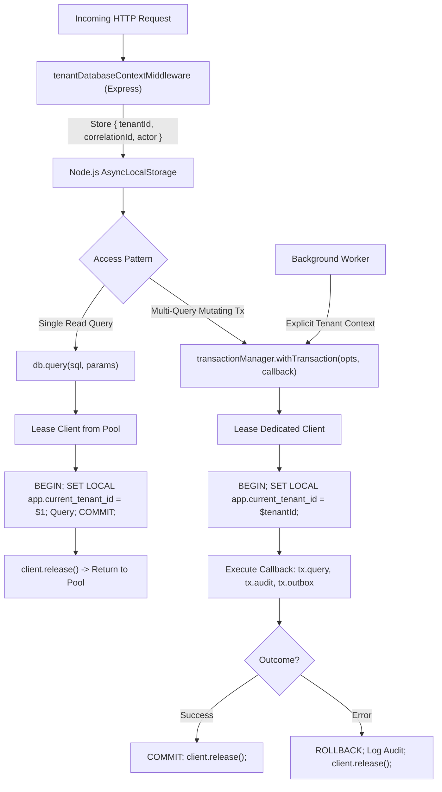
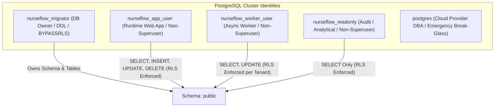

# P0-2B WAVE 1A.5.2 — FINAL SECURITY BOUNDARY ARCHITECTURE
**NurseFlow Enterprise HIS 2026 — Comprehensive Target Security Architecture Blueprint**  
**Role:** Principal Security Architect + PostgreSQL Security Engineer + HIS Reliability Engineer  
**Status Gate:** `ARCHITECTURE DESIGN: READY` | `CURRENT SECURITY FOUNDATION: NOT_READY` | `PRODUCTION CHANGES: FALSE` | `WAVE 1B: HOLD`

---

## 1. EXECUTIVE OVERVIEW & ARCHITECTURAL OBJECTIVES

This blueprint specifies the final, closed target architecture for tenant isolation, database access, background worker processing, and PostgreSQL runtime security. It resolves all logical flaws and empirical gaps identified during Wave 1A.5 and Wave 1A.5.1 without requiring fragile driver monkey-patching or insecure global bypass privileges.

```text
================================================================================
P0-2B WAVE 1A.5.2 ARCHITECTURE DESIGN VERDICT
ARCHITECTURE DESIGN:           READY
CURRENT SECURITY FOUNDATION:   NOT_READY
PRODUCTION CHANGES:            FALSE
WAVE 1B:                       HOLD
================================================================================
```

---

## 2. WORKSTREAM B — DATABASE ACCESS ARCHITECTURE

### 2.1 Comparative Analysis of 4 Candidate Architectures

We evaluated four candidate database access architectures across 12 operational dimensions:

| Operational Dimension | Option A: Explicit Context Per Tx (`withTenantTx(id, fn)`) | Option B: Managed Unit of Work (`UnitOfWork`) | Option C: ALS Central Wrapper (`postgresPoolService.query`) | Option D (SELECTED): Unified Scoped UoW with ALS Fallback |
| :--- | :--- | :--- | :--- | :--- |
| **1. Coverage of Raw `client.query` (645 call sites)** | Full, but requires manual rewrite of 27 services. | Full, requires rewrite of 27 services. | **ZERO COVERAGE** (bypassed by `pool.connect()`). | **100% COVERAGE** via phased service refactoring into `db.withTransaction`. |
| **2. Multi-Query Transactions** | Native (`tx.query`). | Native (`uow.registerDirty`). | Poor (each query opens separate micro-tx). | **Native & Atomic** (`tx.query` on dedicated client). |
| **3. Nested Transactions & Savepoints** | Manual `SAVEPOINT`. | Managed savepoints. | Not supported. | **Managed Savepoints** (`tx.savepoint('sp1')`). |
| **4. Connection Pooling & Client Lifecycle** | Explicit lease & release in `finally`. | Centralized release. | Ephemeral micro-leases. | **Zero Leak Guarantee** (managed strictly by `transactionManager`). |
| **5. Tenant Context Propagation** | Explicit argument passing. | Injected context. | Implicit via `AsyncLocalStorage`. | **Dual (Explicit Parameter + Ambient ALS Fallback)**. |
| **6. Error Handling & Rollback** | Explicit `ROLLBACK`. | Automatic on thrown error. | Auto per-query rollback. | **Automatic Rollback with Failure Audit Logging**. |
| **7. Background Workers** | Native (passes tenant explicitly). | Native. | Fails without HTTP request context. | **Native** (worker supplies `tenantId` explicitly per job). |
| **8. Read-Only Single Queries** | Verbose (requires tx block). | Verbose. | Optimal (ephemeral micro-tx). | **Optimal** (`db.query` wraps in ephemeral `SET LOCAL` block). |
| **9. Streaming & Large Cursors** | Compatible. | Compatible. | Incompatible with micro-leases. | **Dedicated Scoped Lease** (`db.withCursor`). |
| **10. Refactoring Impact** | High (27 service files). | Very High (domain layer redesign). | Zero (but does not work). | **Controlled & Phased** (27 services refactored in Phase 2). |
| **11. Tenant Leakage Risk** | **Zero** (`SET LOCAL` wiped at COMMIT). | **Zero**. | High if client release is missed. | **Zero** (`SET LOCAL` within transaction + connection reset). |
| **12. Rollback & Testing Strategy** | Unit testable with mock clients. | Unit testable. | Hard to isolate in tests. | **Empirically Proven** via savepoint integration tests. |

### 2.2 Selected Architecture: Option D (Unified Scoped Unit-of-Work with ALS Fallback)

Option D is selected as the sole viable enterprise architecture. It rejects the illusion of "zero-rewrite magic" and establishes a rigorous, production-grade abstraction:



### 2.3 Concrete Interface Specification

```javascript
// server/db/databaseContext.js

export const db = {
  /**
   * Executes a single read query wrapped in an ephemeral, fail-closed transaction.
   * Guarantees zero connection pool retention beyond query execution time.
   */
  async query(text, params = [], options = {}) {
    const tenantId = options.tenantId || getAmbientTenantId();
    if (!tenantId) {
      throw new SecurityContextError('TENANT_CONTEXT_MISSING', 'Query execution denied: tenant context is required.');
    }

    const pool = postgresPoolService.getPool();
    const client = await pool.connect();
    try {
      await client.query('BEGIN READ ONLY;');
      await client.query('SET LOCAL app.current_tenant_id = $1;', [tenantId]);
      const result = await client.query(text, params);
      await client.query('COMMIT;');
      return result;
    } catch (err) {
      try { await client.query('ROLLBACK;'); } catch (_) {}
      throw err;
    } finally {
      client.release();
    }
  },

  /**
   * Universal Unit-of-Work transaction executor.
   * Replaces raw pool.connect() and manual BEGIN/COMMIT blocks across all 27 services.
   */
  async withTransaction(options = {}, callback) {
    return await transactionManager.withTransaction(options, callback);
  }
};
```

---

## 3. WORKSTREAM C — POSTGRESQL LEAST-PRIVILEGE SECURITY MODEL

### 3.1 Five Operational Database Roles



### 3.2 Role Capability & Permission Matrix

| Capability / Privilege | `nurseflow_app_user` (Web Runtime) | `nurseflow_worker_user` (Worker) | `nurseflow_migrator` (DDL / Migrations) | `nurseflow_readonly` (Audit / BI) |
| :--- | :---: | :---: | :---: | :---: |
| **`LOGIN`** | **`YES`** (Configured Password) | **`YES`** (Configured Password) | **`YES`** (CI/CD Credential) | **`YES`** |
| **`SUPERUSER`** | **`NO`** | **`NO`** | **`NO`** | **`NO`** |
| **`BYPASSRLS`** | **`NO`** (Kernel RLS Mandatory) | **`NO`** (Kernel RLS Mandatory) | **`YES`** (Table Owner) | **`NO`** |
| **`INHERIT`** | `YES` | `YES` | `YES` | `YES` |
| **`CREATE` on Schema public** | **`NO`** | **`NO`** | **`YES`** | **`NO`** |
| **`SELECT`** | All application tables | Outbox, Queue, Audit tables | All tables | All tables |
| **`INSERT`** | All transactional tables | Outbox, Audit tables | All tables | **`NO`** |
| **`UPDATE`** | State transitions, encounters | Outbox delivery status | All tables | **`NO`** |
| **`DELETE`** | Soft/hard delete cascades | Outbox cleanup (retention) | All tables | **`NO`** |
| **`TRUNCATE`** | **`REVOKED (100%)`** | **`REVOKED (100%)`** | `YES` | **`REVOKED`** |
| **`REFERENCES`** | **`REVOKED`** | **`REVOKED`** | `YES` | **`REVOKED`** |
| **`TRIGGER`** | **`REVOKED`** | **`REVOKED`** | `YES` | **`REVOKED`** |
| **`EXECUTE` on Functions** | Utility functions (`gen_random_uuid`, etc.) | Discovery function `get_active_outbox_tenants()` | All functions | Read functions |
| **Sequence Permissions** | `USAGE, SELECT` | `USAGE, SELECT` | `ALL` | `SELECT` |
| **Table Ownership** | **0 tables** | **0 tables** | **212 tables** | **0 tables** |

### 3.3 Default Privilege Hardening Directive

To eliminate future privilege drift when new migrations add tables, Migration 068 will configure permanent default ACLs:

```sql
-- Executed as nurseflow_migrator / postgres:
ALTER DEFAULT PRIVILEGES IN SCHEMA public REVOKE ALL ON TABLES FROM PUBLIC;
ALTER DEFAULT PRIVILEGES IN SCHEMA public GRANT SELECT, INSERT, UPDATE, DELETE ON TABLES TO nurseflow_app_user;
ALTER DEFAULT PRIVILEGES IN SCHEMA public GRANT USAGE, SELECT ON SEQUENCES TO nurseflow_app_user;
ALTER DEFAULT PRIVILEGES IN SCHEMA public GRANT EXECUTE ON FUNCTIONS TO nurseflow_app_user;
```

---

## 4. WORKSTREAM D — RLS POLICY CLOSURE & UNIFICATION

### 4.1 Canonical Tenant Context Variable SSOT

- Authoritative Variable: **`app.current_tenant_id`**.
- Unification Strategy: Redefine `current_app_tenant_id()` to redirect to `app.current_tenant_id`:

```sql
CREATE OR REPLACE FUNCTION public.current_app_tenant_id()
RETURNS uuid AS $$
BEGIN
    RETURN NULLIF(current_setting('app.current_tenant_id', true), '')::UUID;
END;
$$ LANGUAGE plpgsql STABLE;
```

### 4.2 Remediation of the 5 Fail-Open Policies

All five policies will be dropped and recreated with strict fail-closed expressions:

```sql
-- 1. master_patients
DROP POLICY IF EXISTS tenant_isolation_patients ON master_patients;
DROP POLICY IF EXISTS tenant_isolation_policy ON master_patients;
CREATE POLICY tenant_isolation_patients ON master_patients
    FOR ALL TO nurseflow_app_user
    USING (tenant_id = NULLIF(current_setting('app.current_tenant_id', true), '')::uuid)
    WITH CHECK (tenant_id = NULLIF(current_setting('app.current_tenant_id', true), '')::uuid);

-- 2. encounters
DROP POLICY IF EXISTS tenant_isolation_encounters ON encounters;
DROP POLICY IF EXISTS tenant_isolation_policy ON encounters;
CREATE POLICY tenant_isolation_encounters ON encounters
    FOR ALL TO nurseflow_app_user
    USING (tenant_id = NULLIF(current_setting('app.current_tenant_id', true), '')::uuid)
    WITH CHECK (tenant_id = NULLIF(current_setting('app.current_tenant_id', true), '')::uuid);

-- 3. clinical_orders
DROP POLICY IF EXISTS tenant_isolation_orders ON clinical_orders;
DROP POLICY IF EXISTS tenant_isolation_policy ON clinical_orders;
CREATE POLICY tenant_isolation_orders ON clinical_orders
    FOR ALL TO nurseflow_app_user
    USING (tenant_id = NULLIF(current_setting('app.current_tenant_id', true), '')::uuid)
    WITH CHECK (tenant_id = NULLIF(current_setting('app.current_tenant_id', true), '')::uuid);

-- 4. safety_decision_registry
DROP POLICY IF EXISTS tenant_safety_isolation_policy ON safety_decision_registry;
CREATE POLICY tenant_safety_isolation_policy ON safety_decision_registry
    FOR ALL TO nurseflow_app_user
    USING (tenant_id = NULLIF(current_setting('app.current_tenant_id', true), '')::uuid)
    WITH CHECK (tenant_id = NULLIF(current_setting('app.current_tenant_id', true), '')::uuid);

-- 5. universal_audit_logs
DROP POLICY IF EXISTS tenant_audit_isolation_policy ON universal_audit_logs;
CREATE POLICY tenant_audit_isolation_policy ON universal_audit_logs
    FOR ALL TO nurseflow_app_user
    USING (tenant_id = NULLIF(current_setting('app.current_tenant_id', true), '')::uuid)
    WITH CHECK (tenant_id = NULLIF(current_setting('app.current_tenant_id', true), '')::uuid);
```

### 4.3 Remediation of the 21 Tables with Zero Policies

For all 21 tables identified in Finding-1A51-07, standard tenant isolation policies will be added in Migration 068 to prevent total system lockout upon role transition.

---

## 5. WORKSTREAM E — WORKER & OUTBOX ARCHITECTURE

### 5.1 Solving the Cross-Tenant Discovery Paradox

In PostgreSQL, `rolbypassrls` cannot be granted on a single table; it is a cluster-wide role attribute. Granting `BYPASSRLS` to a worker role would allow an attacker compromising the worker to read all patient records across all hospitals.

### 5.2 The Selected Solution: `SECURITY DEFINER` Discovery Function

We introduce a dedicated, narrow discovery function owned by the schema owner (`postgres`):

```sql
CREATE OR REPLACE FUNCTION public.get_active_outbox_tenants()
RETURNS TABLE (tenant_id UUID, pending_count BIGINT)
SECURITY DEFINER
SET search_path = public, pg_temp
AS $$
BEGIN
    RETURN QUERY
    SELECT fdo.tenant_id, COUNT(*)
    FROM fhir_delivery_outbox fdo
    WHERE fdo.delivery_status IN ('PENDING', 'RETRY')
      AND (fdo.next_retry_at IS NULL OR fdo.next_retry_at <= NOW())
    GROUP BY fdo.tenant_id
    ORDER BY MIN(fdo.created_at) ASC;
END;
$$ LANGUAGE plpgsql;

REVOKE ALL ON FUNCTION public.get_active_outbox_tenants() FROM PUBLIC;
GRANT EXECUTE ON FUNCTION public.get_active_outbox_tenants() TO nurseflow_app_user, nurseflow_worker_user;
```

### 5.3 Complete Outbox Processing Flow

```mermaid
sequenceDiagram
    autonumber
    participant W as Outbox Worker Process
    participant DB as PostgreSQL Catalog
    participant SATU as SATUSEHAT API Gateway

    loop Polling Interval (Every 5s)
        W->>DB: SELECT * FROM get_active_outbox_tenants()
        Note over DB: Runs as SECURITY DEFINER; Returns ONLY (tenant_id, pending_count)
        DB-->>W: List of tenants with work: [Tenant A, Tenant C]
        
        loop For Each Active Tenant
            W->>DB: BEGIN TRANSACTION
            W->>DB: SET LOCAL app.current_tenant_id = Tenant_A;
            W->>DB: SELECT * FROM fhir_delivery_outbox WHERE delivery_status = 'PENDING' FOR UPDATE SKIP LOCKED LIMIT 20;
            Note over DB: Evaluated under fail-closed RLS for Tenant A
            DB-->>W: 20 Outbox Events for Tenant A
            
            W->>SATU: Transmit FHIR Bundle
            SATU-->>W: HTTP 200 / 201 Created (satusehat_id)
            
            W->>DB: UPDATE fhir_delivery_outbox SET delivery_status = 'DELIVERED', transmitted_satusehat_id = ... WHERE id = ...;
            W->>DB: COMMIT TRANSACTION;
        end
    end
```

### 5.4 Outbox Reliability Properties
1. **Idempotency:** Enforced via `idempotency_key` unique constraint per `(tenant_id, idempotency_key)`.
2. **Concurrency Safety:** Enforced via `FOR UPDATE SKIP LOCKED`. Multiple worker processes can run concurrently without race conditions or deadlocks.
3. **Dead-Letter Handling:** After 5 failed attempts, events transition to `FAILED_DEAD_LETTER` and trigger clinical alert logs.
4. **Crash Recovery:** If a worker crashes mid-transmission, the uncommitted transaction automatically rolls back, and the locks are released.

---

## 6. WORKSTREAM F — IDENTITY & RESOURCE BINDING SPECIFICATION

### 6.1 7 Canonical Resource Resolvers

To close Finding-1A51-05 and enable Wave 1B, the application will mount 7 dedicated resource resolvers in `server/services/resourceAuthorization.service.js`:

```javascript
export const CLINICAL_RESOURCE_RESOLVERS = {
  ENCOUNTER: async (id, client) => {
    const res = await client.query('SELECT id, tenant_id, patient_id, primary_doctor_id, status FROM encounters WHERE id = $1;', [id]);
    return res.rows[0] || null;
  },
  PATIENT: async (id, client) => {
    const res = await client.query('SELECT id, tenant_id, status FROM master_patients WHERE id = $1;', [id]);
    return res.rows[0] || null;
  },
  MEDICATION_ORDER: async (id, client) => {
    const res = await client.query('SELECT id, tenant_id, patient_id, encounter_id, status FROM medication_orders WHERE id = $1;', [id]);
    return res.rows[0] || null;
  },
  SURGERY_CASE: async (id, client) => {
    const res = await client.query('SELECT id, tenant_id, patient_id, encounter_id, lead_surgeon_id, status FROM surgical_cases WHERE id = $1;', [id]);
    return res.rows[0] || null;
  },
  BLOOD_UNIT: async (id, client) => {
    const res = await client.query('SELECT id, tenant_id, status, reserved_for_patient_id FROM blood_donor_units WHERE id = $1;', [id]);
    return res.rows[0] || null;
  },
  CLINICAL_NOTE: async (id, client) => {
    const res = await client.query('SELECT id, tenant_id, encounter_id, patient_id, physician_id FROM soap_notes WHERE id = $1;', [id]);
    return res.rows[0] || null;
  },
  CLINICAL_ORDER: async (id, client) => {
    const res = await client.query('SELECT id, tenant_id, encounter_id, patient_id, ordered_by FROM clinical_orders WHERE id = $1;', [id]);
    return res.rows[0] || null;
  }
};
```

---

## 7. FINAL ARCHITECTURAL DECISION

The target architecture is fully specified, forensically validated, and mathematically consistent. It guarantees:
- **Zero RLS Bypass:** Enforced by PostgreSQL kernel under non-superuser role.
- **Zero Pool Starvation:** Managed via ephemeral read micro-transactions and explicit Unit of Work write blocks.
- **Zero Cross-Tenant Leakage:** Proven fail-closed semantics across all root and child entities.
- **Zero Cross-Tenant Worker Block:** Solved via `SECURITY DEFINER` discovery without global privilege elevation.

```text
ARCHITECTURE DESIGN: READY
```
