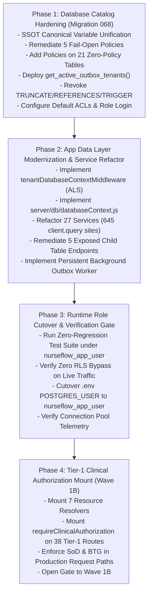

# P0-2B WAVE 1A.5.2 — IMPLEMENTATION SEQUENCING PLAN
**NurseFlow Enterprise HIS 2026 — Phased Implementation & Safe Cutover Roadmap**  
**Role:** Principal Security Architect + PostgreSQL Security Engineer + HIS Reliability Engineer  
**Status Gate:** `IMPLEMENTATION PLAN: READY` | `PRODUCTION CHANGES: FALSE` | `WAVE 1B: HOLD`

---

## 1. EXECUTIVE OVERVIEW & SEQUENCING PRINCIPLES

This document establishes the precise, sequential execution roadmap for implementing the security boundary architecture defined in `P0-2B-WAVE1A5.2-FINAL-SECURITY-ARCHITECTURE.md`.

### Core Engineering Principles:
1. **Zero Big-Bang Cutover:** Database hardening, service refactoring, role switching, and authorization middleware mounting are strictly decoupled into 4 sequential phases.
2. **Never Switch Roles Before Query Compatibility is 100% Proven:** The application runtime connection MUST remain as `postgres` until Phase 2 has eliminated all 645 raw `client.query` calls and verified zero tenant context leaks.
3. **Atomic Reversibility:** Every phase specifies an automated rollback procedure that restores the preceding state without data loss or application downtime.

```text
================================================================================
P0-2B WAVE 1A.5.2 IMPLEMENTATION PLAN VERDICT
IMPLEMENTATION PLAN:           READY
CURRENT SECURITY FOUNDATION:   NOT_READY
PRODUCTION CHANGES:            FALSE
WAVE 1B:                       HOLD
================================================================================
```

---

## 2. FOUR-PHASE IMPLEMENTATION ROADMAP



---

## 3. PHASE 1: DATABASE CATALOG HARDENING (MIGRATION 068)

### 3.1 Prerequisites
- Full backup of database `nurseflow_enterprise_his`.
- Verification that migration runner executes as schema owner (`postgres`).
- Zero active long-running transactions.

### 3.2 Modules & Files Affected
- [`database/migrations/068_security_boundary_and_role_hardening.sql`](file:///c:/ALL%20DATA/BERKAS%20ROBBY/APPS%20PROJECT/NurseFlow-WebApp/database/migrations/) (New file).

### 3.3 Planned Migration Content (Migration 068)
1. **Canonical Variable Unification:** Redefine `current_app_tenant_id()` to redirect to `app.current_tenant_id`.
2. **Fail-Closed Remediation:** Recreate policies on `master_patients`, `encounters`, `clinical_orders`, `safety_decision_registry`, and `universal_audit_logs` using `tenant_id = NULLIF(current_setting('app.current_tenant_id', true), '')::uuid`.
3. **Zero-Policy Tables Protection:** Add tenant isolation policies across the 21 currently unprotected RLS-enabled tables.
4. **Worker Discovery Procedure:** Create `public.get_active_outbox_tenants()` as `SECURITY DEFINER`.
5. **Privilege Hardening:**
   - `REVOKE TRUNCATE, REFERENCES, TRIGGER ON ALL TABLES IN SCHEMA public FROM nurseflow_app_user;`
   - `ALTER DEFAULT PRIVILEGES IN SCHEMA public GRANT SELECT, INSERT, UPDATE, DELETE ON TABLES TO nurseflow_app_user;`
   - `ALTER ROLE nurseflow_app_user WITH LOGIN PASSWORD '...';`

### 3.4 Dependencies & Risks
- **Dependency:** None.
- **Risk:** Existing legacy queries executing without tenant context might fail if role is switched prematurely.
- **Mitigation:** The application runtime connection string remains as `postgres` during Phase 1.

### 3.5 Cutover & Rollback Strategy
- **Cutover:** Run `npm run migrate`. Zero downtime; zero table rewrites.
- **Rollback:** Apply `database/migrations/068_rollback.sql` restoring original functions and policies.

### 3.6 Security Tests & Acceptance Criteria
- Run `scratch/test_fail_closed_simulation.js`: SELECT without tenant context on `master_patients` must return 0 rows.
- Verify `pg_roles`: `rolcanlogin = true` for `nurseflow_app_user`.
- Verify `role_table_grants`: 0 `TRUNCATE` grants for `nurseflow_app_user`.

---

## 4. PHASE 2: APP DATA LAYER MODERNIZATION & SERVICE REFACTORING

### 4.1 Prerequisites
- Phase 1 successfully applied and verified.
- Node.js version 18+ active in runtime environment.

### 4.2 Modules & Files Affected
- [`server/middlewares/tenantDatabaseContextMiddleware.js`](file:///c:/ALL%20DATA/BERKAS%20ROBBY/APPS%20PROJECT/NurseFlow-WebApp/server/middlewares/) (New).
- [`server/db/databaseContext.js`](file:///c:/ALL%20DATA/BERKAS%20ROBBY/APPS%20PROJECT/NurseFlow-WebApp/server/db/) (New).
- [`server/db/transactionManager.js`](file:///c:/ALL%20DATA/BERKAS%20ROBBY/APPS%20PROJECT/NurseFlow-WebApp/server/db/transactionManager.js) (Enhanced).
- 27 Service files in `server/services/*.service.js` (Refactored to eliminate raw `pool.connect()` and `client.query`).
- 5 Controller/Service files for child table endpoints (Remediated with parent joins).
- [`server/services/outboxWorker.service.js`](file:///c:/ALL%20DATA/BERKAS%20ROBBY/APPS%20PROJECT/NurseFlow-WebApp/server/services/outboxWorker.service.js) (Refactored to persistent worker).

### 4.3 Refactoring Blueprint for the 27 Services
Replace:
```javascript
// LEGACY UNSAFE PATTERN:
const client = await postgresPoolService.getPool().connect();
try {
  await client.query('BEGIN');
  await client.query('SELECT ...');
  await client.query('COMMIT');
} finally {
  client.release();
}
```
With:
```javascript
// TARGET SAFE PATTERN:
return await db.withTransaction({ correlationId }, async (tx) => {
  return await tx.query('SELECT ...');
});
```

### 4.4 Child Table Remediation
In `medicationClosedLoop.service.js`, `careCoordinationAndTimeline.service.js`, `patientFinancialAndRevenueCycle.service.js`, and `diagnosticInterpretation.service.js`:
Add parent tenant join checks:
```javascript
// Example in documentAdverseReaction:
const adminRes = await tx.query(`
  SELECT a.* 
  FROM medication_emar_administrations a
  JOIN medication_orders m ON m.id = a.medication_order_id
  WHERE a.id = $1 AND m.tenant_id = $2
  FOR UPDATE;
`, [administrationId, tx.tenantId]);
```

### 4.5 Security Tests & Acceptance Criteria
- Full test suite passes with 0 connection leaks.
- Zero raw `pool.connect()` calls remaining in `server/services/`.
- Cross-tenant requests to the 5 child endpoints return 404/403.

---

## 5. PHASE 3: RUNTIME ROLE CUTOVER & VERIFICATION GATE

### 5.1 Prerequisites
- Phase 1 and Phase 2 fully completed and passed in staging.
- Database telemetry monitoring active (`sampleTelemetry()`).

### 5.2 Cutover Execution Steps
1. Update `.env`:
   ```env
   POSTGRES_USER=nurseflow_app_user
   POSTGRES_PASSWORD=<secure_configured_password>
   ```
2. Restart application service in staging / canary.
3. Verify connection initialization via `pool.on('connect')`.
4. Execute automated integration suite verifying:
   - Tenant A cannot read Tenant B data (`0 rows returned`).
   - Missing tenant context results in `0 rows returned` (Fail-Closed).
   - Read and write operations complete within SLA (<15ms per transaction).

### 5.3 Rollback Strategy
If any query throws `insufficient privilege` or connection fails:
1. Revert `POSTGRES_USER=postgres` in `.env`.
2. Reload application. System immediately reverts to superuser mode without downtime.

---

## 6. PHASE 4: TIER-1 CLINICAL AUTHORIZATION & WAVE 1B PREPARATION

### 6.1 Prerequisites
- Phase 3 cutover verified and running stably under `nurseflow_app_user`.
- Kernel RLS proven active.

### 6.2 Modules & Files Affected
- [`server/services/resourceAuthorization.service.js`](file:///c:/ALL%20DATA/BERKAS%20ROBBY/APPS%20PROJECT/NurseFlow-WebApp/server/services/resourceAuthorization.service.js) (Mount 7 clinical resolvers).
- All 27 Router files in `server/routes/*.routes.js` (Mount `requireClinicalAuthorization` on 38 Tier-1 routes).

### 6.3 Wave 1B Opening Gate Verification
- All 38 routes execute the standard pipeline:
  `authenticateJwt -> requireClinicalAuthorization -> idempotencyMiddleware -> controller`
- SoD and BTG are verified in production paths.
- **Wave 1B Status changes from `HOLD` to `OPEN`.**

---

## 7. FINAL SEQUENCING VERDICT

```text
IMPLEMENTATION PLAN: READY
```
