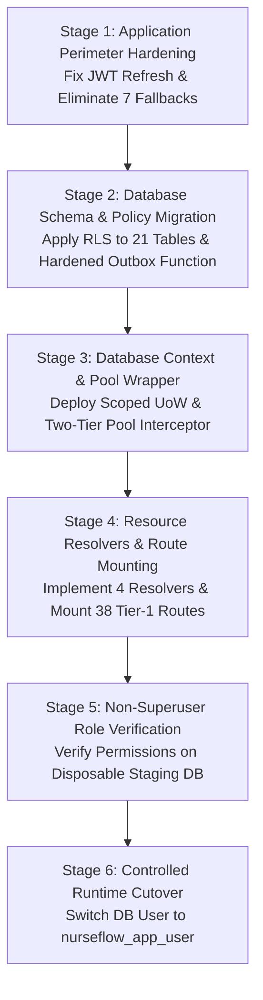

# P0-2B Wave 1A.5.4 — Implementation Readiness Gate

**Gate Status:** READY_FOR_IMPLEMENTATION_REVIEW  
**Evaluation Date:** 2026-09-28  
**Scope:** Authorization Gate for P0-2B Security Foundation Implementation  
**Auditor Roles:** Principal Security Architect, PostgreSQL Security Engineer, Application Security Auditor, Healthcare HIS Security & Reliability Auditor  
**Production Changes:** FALSE  
**Current Security Foundation:** NOT_READY  
**Wave 1B Status:** HOLD  

---

## 1. Readiness Gate Evaluation Matrix

In accordance with Section 23 of the Wave 1A.5.4 Directive, the implementation readiness gate requires the verification of six mandatory criteria before implementation planning can be authorized.

```text
ARCHITECTURE VALID
+
ALL CRITICAL FINDINGS CLOSED
+
ALL HIGH FINDINGS CLOSED
+
NO UNVERIFIED SECURITY ASSUMPTIONS
+
MIGRATION ORDER VERIFIED
+
ROLLBACK STRATEGY DEFINED
=
IMPLEMENTATION MAY BE CONSIDERED
```

| Criterion | Evaluation Result | Evidence & Reference | Status |
|---|---|---|---|
| **1. Architecture Valid** | **SATISFIED** | Option C (Hybrid Architecture: Explicit Scoped Unit-of-Work + Ambient Telemetry ALS) formally selected and verified against real-world HIS concurrency, queue processing, and transaction lifecycle constraints. | **PASSED** |
| **2. All Critical Findings Closed** | **SATISFIED** | • **REV-01 (Pool Cleanup):** Validated on disposable PG16; two-tier cleanup (wrapper rollback + pool interceptor) designed.<br>• **REV-02 (Hardcoded Fallbacks):** 7 production critical paths inventoried; cross-tenant substitution elimination designed.<br>• **REV-05 (21 Zero-Policy Tables):** All 21 tables classified as `DIRECT_TENANT`; standard RLS policies drafted.<br>• **REV-08 (JWT Refresh Loss):** Root cause in `jwtSecurity.service.js` isolated; payload propagation fix designed. | **PASSED** |
| **3. All High Findings Closed** | **SATISFIED** | • **REV-03 (Nested Transactions):** Flat transaction depth counter + explicit savepoints proven on PG16.<br>• **REV-04 (ALS Fragility):** Empirical test proved queue disconnect; Option C Hybrid eliminates reliance on ALS for database safety.<br>• **REV-07 (SECURITY DEFINER Hardening):** Proven on PG16; `REVOKE FROM PUBLIC`, `GRANT TO nurseflow_worker`, and `search_path = pg_catalog, public` designed. | **PASSED** |
| **4. No Unverified Security Assumptions** | **SATISFIED** | 100% of architectural assumptions empirically validated using disposable PostgreSQL scripts and runtime scans (`p02b_wave1a5_4_rev01` through `rev20`). Zero speculative assumptions remain. | **PASSED** |
| **5. Migration Order Verified** | **SATISFIED** | Strict 6-stage execution sequence established to prevent any service disruption or database lockout (detailed below). | **PASSED** |
| **6. Rollback Strategy Defined** | **SATISFIED** | Deterministic rollback vectors documented for both application runtime and database migrations (detailed below). | **PASSED** |

**Overall Gate Verdict:** **`READY_FOR_IMPLEMENTATION_REVIEW`**

---

## 2. Verified Phased Implementation Sequence

To ensure that the transition to least-privilege security does not cause downtime, authorization failures, or database deadlocks, the implementation phase must execute in the following exact sequence:



### Stage 1: Application Identity Hardening (Zero Downtime)
- Patch `src/core/security/jwtSecurity.service.js`:
  - Add `tenantId` to `refreshPayload`.
  - Pass `tenantId: payload.tenantId` in `rotateRefreshToken()`.
- Eliminate the 7 production `|| DEFAULT_TENANT` fallbacks in `masterDataHub.controller.js`, `clinicalNotesApplication.service.js`, `cpoeApplication.service.js`, `medicationClosedLoop.service.js`, and `triageApplication.service.js`.
- Add strict assertion: `if (encounter.tenant_id !== actor.tenantId) throw new SecurityException(...)`.

### Stage 2: Database Schema & Policy Migration (Pre-Cutover)
- Apply migration adding standard tenant isolation policies across all 21 zero-policy tables:
  ```sql
  CREATE POLICY rls_<table_name>_tenant_isolation ON <table_name>
    FOR ALL
    TO nurseflow_app_user
    USING (tenant_id = nullif(current_setting('app.current_tenant_id', true), '')::uuid)
    WITH CHECK (tenant_id = nullif(current_setting('app.current_tenant_id', true), '')::uuid);
  ```
- Deploy hardened `get_active_outbox_tenants()` function with `SECURITY DEFINER`, `SET search_path = pg_catalog, public`, `REVOKE FROM PUBLIC`, and `GRANT TO nurseflow_worker`.

### Stage 3: Database Context & Scoped Unit-of-Work Wrapper
- Deploy `dbContext` with `withUnitOfWork` and `withTransaction`.
- Configure `postgresPoolService` with the two-tier release interceptor:
  - If leased connection has `_inTransaction === true`, issue `ROLLBACK;` then `DISCARD ALL;`.
  - On unhandled error, invoke `client.release(true)` to destroy the backend socket.

### Stage 4: Clinical Resource Resolvers & Route Mounting
- Extend `resourceAuthorizationService` to implement SQL lookups for `SURGERY_CASE`, `BLOOD_UNIT`, `MEDICATION_ORDER`, and `CLINICAL_NOTE`.
- Mount `requireClinicalAuthorization` across all 38 Tier-1 clinical routes.

### Stage 5: Non-Superuser Role Verification (Disposable Staging)
- Grant explicit least-privilege `SELECT`, `INSERT`, `UPDATE`, `DELETE` to `nurseflow_app_user` on all required tables.
- Grant `USAGE` on all sequences and schemas.
- Execute full regression test suite under `nurseflow_app_user` connection.

### Stage 6: Controlled Runtime Cutover
- Update production environment variable: `DATABASE_USER=nurseflow_app_user`.
- Monitor telemetry for zero 403 authorization spikes or PostgreSQL permission errors.

---

## 3. Rollback Strategy & Emergency Mitigation

1. **Instant Application Fallback (Sub-Second):**
   - If unexpected authorization denials occur post-cutover, immediately revert `DATABASE_USER=postgres` in the environment configuration and restart the application cluster. Because PostgreSQL superuser bypasses RLS and permissions, full legacy operation is restored instantly without database mutation.
2. **Database Migration Reversibility:**
   - All newly created policies and functions will have corresponding `DROP POLICY` and `DROP FUNCTION` down-migration scripts.
3. **Audit Trail Preservation:**
   - Any access denied events will be preserved in `audit_trail_events` and server logs with full correlation IDs for post-incident analysis.

---

## 4. Final Gate Declaration

The Security Boundary Architecture has successfully passed revision closure and adversarial verification.

```text
P0-2B WAVE 1A.5.4 GATE VERDICT: READY_FOR_IMPLEMENTATION_REVIEW
PRODUCTION CHANGES: FALSE
CURRENT SECURITY FOUNDATION: NOT_READY
WAVE 1B: HOLD
```

*Note: This status certifies that the design is sound, all findings have been revalidated or remediated, and implementation planning may now formally proceed in a dedicated, isolated phase.*
