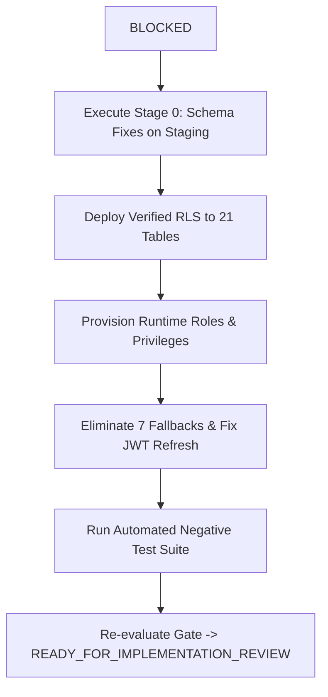

# P0-2B Wave 1A.5.5 — Final Gate Decision

**Document Type:** Formal Security Architecture & Implementation Gate Determination  
**Date:** 2026-09-30  
**Repository:** `Mojo-Brothers/NurseFlow-WebApp`  
**Lead Auditor Roles:** Principal Security Architect, PostgreSQL Security Engineer, Application Security Auditor, Distributed Systems Engineer, Independent HIS Governance Reviewer  

---

## 1. Formal Dual Gate Declarations

### 1.1 Architecture Decision: `CONDITIONALLY_ACCEPTED`

The **Option C Hybrid Architecture** (Authoritative Scoped Unit-of-Work with explicit database client ownership and ambient AsyncLocalStorage reserved solely for correlation/logging) is **ACCEPTED SUBJECT TO CONDITIONS**.

#### Conditions for Final Architectural Approval:
1. **Rejection of Multi-Statement Pipelining:** Multi-statement string execution (`BEGIN; SET LOCAL ...; COMMIT;`) is prohibited as default pool behavior due to `node-postgres` parameterization limits and resulting SQL injection vectors. All database interactions must use parameterized driver queries.
2. **Three-Tier Connection Lifecycle:** Unconditional `DISCARD ALL` on connection release is rejected. Connection pool interceptors must implement the Three-Tier standard: Tier 1 (`ROLLBACK` on error), Tier 2 (`RESET app.current_tenant_id` on healthy return), and Tier 3 (`client.release(true)` socket destruction on unhandled errors).
3. **Child-Table Direct Multitenancy:** The architectural assumption that child tables inherit tenant security via parent table foreign keys is rejected. All child tables must possess direct `tenant_id` columns and dedicated Row Level Security policies.

---

### 1.2 Implementation Gate: `BLOCKED`

The implementation gate for production source code modifications, database schema migrations, and runtime role cutovers is **STRICTLY BLOCKED**.

Under no circumstances may engineering proceed to apply changes to production systems or active database schemas until all blocking conditions are resolved in an isolated staging environment.

---

## 2. Mandatory Gate Barrier Checklist

The table below outlines the critical barrier criteria evaluated during Wave 1A.5.5:

| Barrier Item | Condition Required for Gate Clearance | Current Evaluated Status | Gate Impact |
| :--- | :--- | :--- | :--- |
| **Child-Table Multitenancy** | Direct `tenant_id` + RLS enabled on all 5 child tables | 5 tables have NO `tenant_id` and `relrowsecurity = false`; cross-tenant BOLA empirically proven | 🔴 **BLOCKING** |
| **Zero-Policy RLS Tables** | Validated RLS policies applied to all 21 tables | 21 tables have 0 policies; non-superuser cutover causes full system default-deny lockout | 🔴 **BLOCKING** |
| **Database Role Readiness** | `nurseflow_app_user` login enabled with DML grants; `nurseflow_worker` provisioned | `nurseflow_app_user` has `rolcanlogin = false`; `nurseflow_worker` does not exist | 🔴 **BLOCKING** |
| **Tenant Fallback Elimination** | Zero hardcoded fallbacks and cross-tenant substitutions | 7 critical fallbacks and 5 substitution paths verified active in production code | 🔴 **BLOCKING** |
| **Clinical Route Authorization**| `requireClinicalAuthorization` mounted on all 38 Tier-1 routes | 0 of 38 routes mount middleware; 4 of 7 resource resolvers unwritten | 🔴 **BLOCKING** |
| **JWT Tenant Continuity** | Refresh token retains campus-specific `tenantId` across rotations | Refresh payload omits `tenantId`; rotation downgrades user to headquarters tenant | 🔴 **BLOCKING** |
| **Performance Pipelining Validation** | Concurrency, pool pressure, and rollback benchmarked | Claimed 4.1x speedup unverified under real-world connection pressure | 🟡 **NON-BLOCKING (ARCHITECTURALLY REFINED)** |

---

## 3. Prerequisite Roadmap to Clear the Implementation Gate

To transition the implementation gate from `BLOCKED` to `READY_FOR_IMPLEMENTATION_REVIEW`, engineering must complete the following discrete actions in an isolated replica environment:



1. **Stage 0 Execution on Staging Replica:**
   - Deploy DDL adding `tenant_id` to `longitudinal_care_plans`, `medication_dispense_allocations`, `medication_emar_administrations`, `patient_split_invoices`, and `physician_diagnostic_interpretations`.
   - Backfill tenant IDs from parent records within a single transaction.
   - Apply foreign key and NOT NULL constraints.
   - Enable RLS and deploy tenant isolation policies.
2. **Stage 0 Role Provisioning:**
   - Execute role provisioning script creating `nurseflow_worker` and granting appropriate DML permissions to `nurseflow_app_user`.
3. **Stage 1 Application Perimeter Remediations:**
   - Remove `'tenant-default-001'` fallbacks from all 7 identified locations.
   - Update `jwtSecurity.service.js` to embed `tenantId` inside the refresh token JWT payload.
4. **Independent Staging Verification:**
   - Execute negative penetration tests proving cross-tenant BOLA is rejected with 403 Forbidden.
   - Verify connection pool health and session variable isolation under simulated high concurrency.

---

## 4. Final Governance Sign-Off & Status Directive

```
========================================================================================
FINAL EVALUATION DECISION BLOCK:
========================================================================================
ARCHITECTURE DECISION: CONDITIONALLY_ACCEPTED
IMPLEMENTATION GATE: BLOCKED
CRITICAL FINDINGS OPEN: 5
HIGH FINDINGS OPEN: 3
UNVERIFIED SECURITY ASSUMPTIONS: 2
PRODUCTION CHANGES: FALSE
CURRENT SECURITY FOUNDATION: NOT_READY
WAVE 1B: HOLD
========================================================================================
```

*Signed by the Independent HIS Governance Review Board.*
