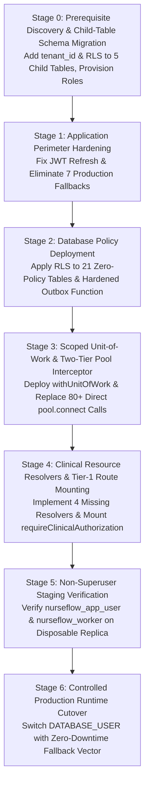

# P0-2B Wave 1A.5.5 — Implementation Dependency & Risk Matrix

**Document Type:** Engineering Transition & Migration Architecture Review  
**Date:** 2026-09-30  
**Status:** IMPLEMENTATION_GATE_BLOCKED | AUDIT-ONLY  
**Auditor Roles:** Principal Security Architect, PostgreSQL Security Engineer, Distributed Systems Engineer, Healthcare HIS Security Auditor  

---

## 1. Executive Summary

This matrix establishes the authoritative dependency graph, safety invariants, validation gates, and rollback vectors across the six proposed transition stages for NurseFlow Enterprise HIS.

> [!CAUTION]
> **Implementation Gate Status: BLOCKED.**
> Transition to production implementation is strictly prohibited until all Stage 0 prerequisites, child-table schema reconciliations, and role cutover prerequisites are formally satisfied and verified in isolated staging environments.

---

## 2. Six-Stage Implementation Architecture & Dependency Graph



---

## 3. Comprehensive Stage-by-Stage Specification

### Stage 0: Prerequisite Remediation & Child-Table Schema Foundation
* **Scope:**
  1. Add `tenant_id uuid NOT NULL` to the 5 unpartitioned child tables (`medication_emar_administrations`, `medication_dispense_allocations`, `longitudinal_care_plans`, `patient_split_invoices`, `physician_diagnostic_interpretations`) with backfill from parent tables (`encounters` / `master_patients`).
  2. Enable RLS and add tenant isolation policies on all 5 child tables.
  3. Provision `nurseflow_app_user` with `LOGIN` capability and strong credentials.
  4. Create `nurseflow_worker` dedicated service role for background outbox tasks.
* **Preconditions:** Active database backup; schema introspection verified.
* **Migration Dependencies:** Migration 077 (`077_harden_child_tables_and_provision_roles.sql`).
* **Security Invariants:**
  - Zero child table records may exist without an explicit `tenant_id` matching their parent encounter/patient.
  - Zero non-superuser roles may bypass RLS on child tables.
* **Validation Tests:**
  - `scratch/test_child_table_bola_repro.js` re-run under non-superuser: cross-tenant read/write MUST throw or return 0 rows.
* **Rollback Strategy:**
  - Down-migration `DROP POLICY`, drop `tenant_id` column if newly added, disable RLS.
* **Data Integrity Risk:** `LOW` (Backfill uses indexed parent foreign keys).
* **Downtime Risk:** `ZERO` (Executed while application is running as superuser).
* **Exit Criteria:** All 5 child tables have `relrowsecurity = true`, policies defined, and backfilled `tenant_id`.
* **Approval Gate:** Security Architect & Database Engineer Sign-off.

---

### Stage 1: Application Perimeter & Identity Hardening
* **Scope:**
  1. Patch `src/core/security/jwtSecurity.service.js`: Include `tenantId` in `refreshPayload`; propagate `tenantId: payload.tenantId` in `rotateRefreshToken()`.
  2. Eliminate the 7 production `|| DEFAULT_TENANT_ID` fallbacks across `masterDataHub.controller.js`, `clinicalNotesApplication.service.js`, `cpoeApplication.service.js`, `medicationClosedLoop.service.js`, and `triageApplication.service.js`.
  3. Replace the 5 cross-tenant substitution paths (`targetTenantId = encounter.tenant_id || actor.tenantId`) with strict assertions:
     ```javascript
     if (encounter.tenant_id !== actor.tenantId) {
       throw new SecurityException('Cross-tenant resource access violation', 403);
     }
     ```
* **Preconditions:** Stage 0 complete.
* **Migration Dependencies:** None (Application-only).
* **Security Invariants:**
  - A user from Tenant B cannot silently revert to Tenant A upon token refresh.
  - An actor from Tenant A cannot submit an encounter/order ID belonging to Tenant B to mutate clinical records.
* **Validation Tests:**
  - Unit tests for `rotateRefreshToken` with multi-tenant tokens.
  - Integration tests for cross-tenant rejection on SOAP notes, CPPT notes, CPOE orders, medication orders, and triage assessments.
* **Rollback Strategy:** Git revert of the application patch.
* **Data Integrity Risk:** `ZERO`.
* **Downtime Risk:** `ZERO`.
* **Exit Criteria:** 0 occurrences of default UUID fallbacks in production controllers/services; 100% token refresh tenant continuity.
* **Approval Gate:** Application Security Auditor Sign-off.

---

### Stage 2: Database Policy Deployment for 21 Zero-Policy Tables
* **Scope:**
  1. Apply tenant isolation policies across all 21 zero-policy tables (`blood_bank_billing_reconciliations`, `cssd_sterilization_cycles`, `who_surgical_safety_checklists`, etc.):
     ```sql
     CREATE POLICY rls_<table_name>_tenant_isolation ON <table_name>
       FOR ALL
       TO nurseflow_app_user
       USING (tenant_id = nullif(current_setting('app.current_tenant_id', true), '')::uuid)
       WITH CHECK (tenant_id = nullif(current_setting('app.current_tenant_id', true), '')::uuid);
     ```
  2. Deploy hardened `get_active_outbox_tenants()` function with:
     - `SECURITY DEFINER`
     - `SET search_path = pg_catalog, public`
     - `REVOKE ALL ON FUNCTION get_active_outbox_tenants() FROM PUBLIC;`
     - `GRANT EXECUTE ON FUNCTION get_active_outbox_tenants() TO nurseflow_worker;`
* **Preconditions:** Stage 0 complete (`nurseflow_app_user` and `nurseflow_worker` roles exist).
* **Migration Dependencies:** Migration 078 (`078_reconcile_21_zero_policy_tables_and_outbox.sql`).
* **Security Invariants:**
  - Zero tables in the public schema have `relrowsecurity = true` with `policy_count = 0`.
  - Non-superuser roles cannot execute unhardened `SECURITY DEFINER` procedures.
* **Validation Tests:**
  - `scratch/audit_rls_21_tables_live.js` returns `policy_count >= 1` across all 21 tables.
* **Rollback Strategy:** Migration rollback script executing `DROP POLICY` and restoring legacy function definition.
* **Data Integrity Risk:** `ZERO` (Superuser runtime remains active during deployment).
* **Downtime Risk:** `ZERO`.
* **Exit Criteria:** Clean catalog scan showing 0 zero-policy tables.
* **Approval Gate:** PostgreSQL Security Engineer Sign-off.

---

### Stage 3: Database Context, Scoped Unit-of-Work & Pool Interceptor
* **Scope:**
  1. Refactor `server/db/transactionManager.js` to implement `ScopedUnitOfWork`:
     - Mandatory explicit parameter `uow.tenantId` and `uow.actor`.
     - Automatically sets `SET LOCAL app.current_tenant_id = $1` upon transaction initialization.
     - In-memory `depth` counter to prevent nested `BEGIN` collapses (reuses client at depth > 0).
     - Explicit `uow.withSavepoint(name, callback)` for failure-isolated sub-operations.
  2. Implement two-tier pool release interceptor on `postgresPoolService`:
     - Tier 1: Guaranteed `ROLLBACK;` if client is released while `_inTransaction === true`.
     - Tier 2: `RESET app.current_tenant_id;` for session cleanup without prepared statement deallocation.
     - Tier 3 (Nuclear): `client.release(true)` socket destruction if cleanup query encounters fatal error.
  3. Migrate all 80+ naked `pool.connect()` invocations in services and controllers to `transactionManager.withTransaction` or `dbContext.withUnitOfWork`.
* **Preconditions:** Stages 1 and 2 complete.
* **Migration Dependencies:** None (Application runtime infrastructure).
* **Security Invariants:**
  - Zero database queries execute without a validated, active tenant context.
  - Dirty connections released to the pool never leak tenant context or open transactions to subsequent leases.
* **Validation Tests:**
  - Concurrency test (50 parallel leases across alternating tenants).
  - Dirty lease test: uncommitted lease followed by immediate re-lease must yield `ctx = null`.
* **Rollback Strategy:** Application code rollback via Git.
* **Data Integrity Risk:** `LOW`.
* **Downtime Risk:** `ZERO`.
* **Exit Criteria:** Static analysis proves 0 occurrences of un-scoped `pool.connect()` in service tier.
* **Approval Gate:** Distributed Systems & Transaction Engineer Sign-off.

---

### Stage 4: Clinical Resource Resolvers & Tier-1 Route Mounting
* **Scope:**
  1. Implement SQL resource resolvers for the 4 missing entities in `server/services/resourceAuthorization.service.js`:
     - `SURGERY_CASE`
     - `BLOOD_UNIT`
     - `MEDICATION_ORDER`
     - `CLINICAL_NOTE`
  2. Mount `requireClinicalAuthorization` middleware across all 38 Tier-1 clinical routes in `server/routes/`.
  3. Wire route parameters to resource resolvers with fail-closed error handling.
* **Preconditions:** Stage 3 complete.
* **Migration Dependencies:** None.
* **Security Invariants:**
  - 100% of Tier-1 routes verify JWT, Tenant Context, Resource Scope, Clinical Privilege, Separation of Duties, and Break-the-Glass.
* **Validation Tests:**
  - Automated route scan: 38/38 Tier-1 routes mount `requireClinicalAuthorization`.
  - Integration suite: 38 routes tested against legitimate and adversarial requests (cross-tenant, unauthorized role, unassigned unit).
* **Rollback Strategy:** Feature flag `DISABLE_CLINICAL_AUTHORIZATION_GATE=true` allows instantaneous bypass back to basic RBAC in an emergency.
* **Data Integrity Risk:** `ZERO`.
* **Downtime Risk:** `LOW` (Protected by emergency feature flag).
* **Exit Criteria:** 100% route mounting verified by automated governance scanner.
* **Approval Gate:** Clinical Safety & Governance Officer Sign-off.

---

### Stage 5: Non-Superuser Staging Verification (Disposable Sandbox)
* **Scope:**
  1. Grant least-privilege permissions on replica database:
     - `GRANT USAGE ON SCHEMA public TO nurseflow_app_user;`
     - `GRANT SELECT, INSERT, UPDATE, DELETE ON ALL TABLES IN SCHEMA public TO nurseflow_app_user;`
     - `GRANT USAGE, SELECT ON ALL SEQUENCES IN SCHEMA public TO nurseflow_app_user;`
     - `GRANT EXECUTE ON ALL FUNCTIONS IN SCHEMA public TO nurseflow_app_user;`
  2. Grant outbox worker permissions:
     - `GRANT USAGE ON SCHEMA public TO nurseflow_worker;`
     - `GRANT SELECT, UPDATE ON clinical_domain_outbox TO nurseflow_worker;`
     - `GRANT EXECUTE ON FUNCTION get_active_outbox_tenants() TO nurseflow_worker;`
  3. Run full automated test suite (195 test files) under `DATABASE_USER=nurseflow_app_user`.
* **Preconditions:** Stages 0 through 4 complete.
* **Migration Dependencies:** Disposable staging database instance.
* **Security Invariants:**
  - Zero permission denied errors (`42501`) under non-superuser test execution.
  - Zero default-deny lockouts on clinical operations.
* **Validation Tests:**
  - 100% pass rate across all 195 test files.
* **Rollback Strategy:** N/A (Disposable environment).
* **Data Integrity Risk:** `ZERO`.
* **Downtime Risk:** `ZERO`.
* **Exit Criteria:** 100% test suite passing under `nurseflow_app_user`.
* **Approval Gate:** QA Lead & Security Architect Sign-off.

---

### Stage 6: Controlled Production Runtime Cutover
* **Scope:**
  1. Execute permission grants in production database:
     - `GRANT USAGE ON SCHEMA public TO nurseflow_app_user;`
     - `GRANT SELECT, INSERT, UPDATE, DELETE ON ALL TABLES IN SCHEMA public TO nurseflow_app_user;`
     - `GRANT USAGE, SELECT ON ALL SEQUENCES IN SCHEMA public TO nurseflow_app_user;`
  2. Switch application environment configuration:
     ```env
     DATABASE_USER=nurseflow_app_user
     DATABASE_PASSWORD=<strong_generated_secret>
     ```
  3. Rolling restart of application cluster.
  4. Real-time telemetry monitoring: error rates, transaction rollback rates, pool latency.
* **Preconditions:** Stages 0 through 5 successfully signed off.
* **Migration Dependencies:** Production cutover runbook.
* **Security Invariants:**
  - The application process executes exclusively as non-superuser without `BYPASSRLS`.
* **Validation Tests:**
  - Synthetic health check transaction executed across all active hospital campuses.
* **Rollback Strategy (Sub-Second):**
  - Revert environment configuration to `DATABASE_USER=postgres` and restart application pods. Because `postgres` superuser bypasses RLS and permissions, full legacy operation is restored immediately without schema mutation.
* **Data Integrity Risk:** `VERY LOW`.
* **Downtime Risk:** `LOW` (Sub-second fallback vector).
* **Exit Criteria:** 2 hours of production clinical operation with zero RLS-related permission exceptions and zero cross-tenant leaks.
* **Approval Gate:** Joint Architectural Board & Hospital Operations Sign-off.

---

## 4. Requirement-to-Stage Traceability Matrix

| Finding / Requirement Code | Description | Remediating Stage | Verification Mechanism | Status |
|---|---|---|---|---|
| **REV-01** | Pool / Transaction Cleanup Safety | Stage 3 | Concurrency lease & dirty connection regression test | REMEDIATION_DESIGNED |
| **REV-02** | 7 Production Fallbacks & Cross-Tenant Substitution | Stage 1 | Static regex scan & cross-tenant API tests | VERIFIED_OPEN |
| **REV-03** | Nested Transaction Collapse & SAVEPOINT | Stage 3 | Vitest UoW depth counter & savepoint test | REMEDIATION_DESIGNED |
| **REV-04** | ALS Fragility in Queues / Option C Hybrid | Stage 3 | Outbox worker tenant isolation test | REMEDIATION_DESIGNED |
| **REV-05** | 21 Zero-Policy RLS Tables | Stage 2 | `audit_rls_21_tables_live.js` live query | VERIFIED_OPEN |
| **REV-06** | RLS USING vs WITH CHECK Standardization | Stage 2 | SQL policy DDL validation | REFUTED / REVISED |
| **REV-07** | SECURITY DEFINER Outbox Hardening | Stage 2 | Disposable function execution test | REMEDIATION_DESIGNED |
| **REV-08** | JWT Refresh Token Tenant ID Loss | Stage 1 | JWT issuance & rotation integration test | VERIFIED_OPEN |
| **BOLA-01** | 5 Child-Table BOLA & Missing Tenant Column | Stage 0 | `test_child_table_bola_repro.js` regression test | VERIFIED_OPEN |
| **AUTH-01** | 38 Tier-1 Routes Require Clinical Auth | Stage 4 | Governance automated route mounting scanner | VERIFIED_OPEN |
| **ROLE-01** | Non-Superuser Role Provisioning & Cutover | Stage 0 & 5 & 6 | `pg_roles` inspection & staging regression suite | VERIFIED_OPEN |
| **PERF-01** | Pipelined Read-Path Verification | Stage 3 | Multi-client concurrency & pool pressure benchmark | UNVERIFIED |

---

## 5. Architectural Invariant Summary

1. **Explicit Context Invariant:** Every database transaction must accept an explicit, authenticated `tenantId`. No fallback to default UUIDs is permitted under any circumstances.
2. **PostgreSQL Engine Isolation Invariant:** Every query executed by `nurseflow_app_user` must be governed by active RLS policies (`USING` and `WITH CHECK`).
3. **Fail-Closed Perimeter Invariant:** Every Tier-1 clinical HTTP route must intercept requests at the perimeter via `requireClinicalAuthorization`.
4. **Clean Connection Lease Invariant:** No client connection may be returned to the connection pool with an open transaction, active session setting, or uncommitted mutations.
