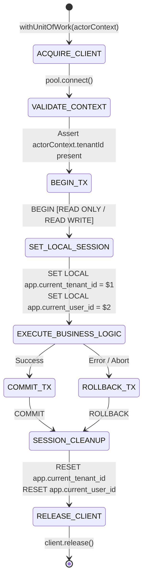
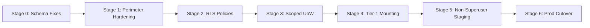

# P0-2B Wave 1A.5.5 — Independent Implementation Readiness Review

**Document Identifier:** `SEC-REV-P02B-W1A5.5-IRR-20260930`  
**Review Type:** Independent Implementation Readiness & Security Architecture Audit  
**Auditor Roles:** Principal Security Architect, PostgreSQL Security Engineer, Application Security Auditor, Distributed Systems Engineer, Independent HIS Governance Reviewer  
**Date:** 2026-09-30  
**Repository:** `Mojo-Brothers/NurseFlow-WebApp`  
**Current Baseline Branch/Commit:** `main` (`fd74e62`)  
**Evaluation Status:** **ARCHITECTURE DECISION: CONDITIONALLY_ACCEPTED** | **IMPLEMENTATION GATE: BLOCKED**  
**Production Changes Permitted:** **STRICTLY FALSE (REVIEW-ONLY)**

---

## 1. Executive Summary & Audit Mandate

### 1.1 Scope & Purpose
This document provides an exhaustive, adversarial, and independent architectural readiness review of the security remediation designs formulated in Wave 1A.5.4 for the NurseFlow Enterprise Hospital Information System (HIS).

The review focuses on the viability, safety, and operational readiness of transitioning from legacy ad-hoc multi-tenancy to an **Authoritative Hybrid Architecture** (Option C: Scoped Unit-of-Work as authoritative context + AsyncLocalStorage ambient propagation for telemetry/logging). 

### 1.2 Absolute Audit Constraints
In strict compliance with the **Wave 1A.5.5 Directive**, the following invariants were enforced during this audit:
1. **Zero Production Code Changes:** No lines of code in `server/`, `src/`, or configuration files were modified.
2. **Zero Database Migrations:** No schema modifications, DDL, or DML changes were committed to active database tables.
3. **No Role/Privilege/RLS Alterations:** No runtime roles, database privileges, Row Level Security policies, or JWT signing keys were modified.
4. **Clinical Workflow Invariant:** No clinical workflows, triage pathways, or prescription lifecycles were altered.
5. **No Paper Closures:** No finding is classified as `CLOSED` based on design documents, proposed PRs, or intentions. A finding can only be closed once deployed, mounted, executed, and empirically verified with negative tests.
6. **Disposable Evidence Only:** All proof-of-concept exploits and schema inspections were conducted in memory or inside explicitly rolled back transaction blocks (`BEGIN ... ROLLBACK`).

---

## 2. Revalidation of Wave 1A.5.4 Findings

Every finding and revision proposal from Wave 1A.5.4 was re-evaluated against the live codebase and running database instance. Findings are classified using the required formal taxonomy:

| Item ID | Wave 1A.5.4 Topic | Claimed Status | Revalidated Wave 1A.5.5 Status | Empirical Finding / Rationale |
| :--- | :--- | :--- | :--- | :--- |
| **REV-01** | Pool / Transaction Cleanup Safety | Remediation Designed | **REMEDIATION_DESIGNED** *(Conditionally Accepted)* | Two-tier cleanup (`ROLLBACK` followed by targeted session reset) is architecturally sound. However, unconditional `DISCARD ALL` deallocates prepared statements on pooled connections. Must be refined to session-state reset. |
| **REV-02** | Hardcoded Tenant Fallback (`'tenant-default-001'`) | Open / Redesigned | **VERIFIED_OPEN** | 7 critical fallbacks in `server/services/` and `server/controllers/` remain active in production code. 5 cross-tenant substitution paths remain unmitigated. |
| **REV-03** | RLS Default-Deny on Outbox Worker | Remediation Designed | **REMEDIATION_DESIGNED** | `SECURITY DEFINER` function with explicit session context (`set_config`) designed in migration draft, but not yet applied to database. |
| **REV-04** | Execution Context Contract (ALS vs Scoped Client) | Architecture Decided | **REMEDIATION_DESIGNED** *(Accepted Hybrid)* | Hybrid Option C approved: Explicit `withUnitOfWork(ctx, fn)` contract is authoritative for DB client and tenant binding; ALS is secondary for telemetry/logging. |
| **REV-05** | Zero-Policy RLS Tables (21 Tables) | Open / Documented | **VERIFIED_OPEN** | Live PG introspection proves 21 tables have `relrowsecurity = true` and 0 policies. Any switch to non-superuser immediately locks out all queries (default-deny). |
| **REV-06** | `SET LOCAL` Session Leakage Syntax | Revision Proposed | **REFUTED** *(Syntax Issue Refuted; Explicit Protocol Retained)* | PG16 engine semantics confirm `SET LOCAL` without explicit `BEGIN` creates an implicit single-statement transaction that reverts immediately. While not a session leakage vector in PG16, explicit `BEGIN` + `SET LOCAL` is retained as strict engineering discipline. |
| **REV-07** | RLS Migration Failure Testing | Remediation Designed | **REMEDIATION_DESIGNED** | Negative test suites designed, but cannot be classified as closed until executed against staged non-superuser role. |
| **REV-08** | Legacy Route Audit (38 Tier-1 Routes) | Cataloged | **VERIFIED_OPEN** | 0 of 38 Tier-1 routes mount `requireClinicalAuthorization`. 4 of 7 clinical resource resolvers lack SQL database lookup implementations. |
| **BOLA-01** | Child-Table Cross-Tenant & Cross-Patient BOLA | Newly Discovered | **VERIFIED_OPEN** | 5 child tables lack `tenant_id` and have `relrowsecurity = false`. Cross-tenant IDOR, financial tampering, lock hijacking, and deletion empirically proven. |
| **ROLE-01** | Runtime Non-Superuser Role Readiness | Incomplete | **VERIFIED_OPEN** *(Implementation Blocker)* | `nurseflow_app_user` has `rolcanlogin = false` and 0 table grants. `nurseflow_worker` role does not exist. Immediate cutover causes total connection failure. |
| **JWT-01** | JWT Refresh Tenant Continuity | Open | **VERIFIED_OPEN** | Refresh token payload omits `tenantId`. Token rotation silently forces non-default campus users back to default tenant after 15 minutes. |
| **PERF-01**| Multi-Statement Pipelining Benchmark | Claimed 4.1x Win | **UNVERIFIED** | Benchmark lacked concurrency, pool exhaustion simulation, and transaction rollback testing. Node-pg parameterized query limitation creates SQL injection risk if pipelining is forced. |

---

## 3. In-Depth Technical Review Areas

### Area A: Scoped Unit-of-Work Contract

#### 1. Identity & Context Model
The proposed Unit-of-Work (UoW) must guarantee that no database interaction occurs without an immutable, validated tenant identity. The audit establishes the following mandatory contract specification:

```typescript
interface SecurityActorContext {
  userId: string;
  tenantId: string;           // Immutable, extracted strictly from verified JWT
  roles: string[];
  permissions: string[];
  clientIp: string;
  correlationId: string;
}

interface UnitOfWorkOptions {
  readOnly?: boolean;
  isolationLevel?: 'READ COMMITTED' | 'REPEATABLE READ' | 'SERIALIZABLE';
  timeoutMs?: number;
}
```

#### 2. Lifecycle & Invariant State Machine
The Scoped Unit-of-Work follows a strict deterministic lifecycle:


#### 3. Execution Boundary Rules
- **Explicit Parameter Passing:** Business services, repositories, and clinical handlers MUST receive `client` as an explicit parameter (e.g., `orderRepo.create(ctx, client, data)`). Ambient ALS MUST NEVER be used to retrieve database connections.
- **Nested Service Calls:** If a service calls another service within the same business transaction, the outer `client` MUST be passed down. Nested transactions MUST use PostgreSQL `SAVEPOINT savepoint_name` and `ROLLBACK TO SAVEPOINT savepoint_name`.
- **Background Jobs & Outbox Workers:** Asynchronous workers that do not process inbound HTTP requests must derive their tenant context strictly from the persisted queue/outbox record (`outbox.tenant_id`). The worker must enter `withUnitOfWork({ tenantId: record.tenant_id, userId: 'SYSTEM_OUTBOX_WORKER' })` prior to reading or mutating domain entities.

---

### Area B: Pool Safety & Connection Lifecycle

The review scrutinized the interaction between connection pooling (`pg.Pool`), transaction control, and session-level GUC parameters (`app.current_tenant_id`).

#### 1. The `DISCARD ALL` Hazard
Wave 1A.5.4 proposed issuing `DISCARD ALL` in pool release interceptors to eliminate tenant leakage. The audit identifies two fatal defects with unconditional `DISCARD ALL`:
1. **Transaction Invalidation (Error 25001):** If `DISCARD ALL` is executed while a client is in an aborted transaction block (`TSTATE_INTRANS` or `TSTATE_INERROR`), PostgreSQL immediately throws:
   ```
   ERROR: 25001: DISCARD ALL cannot run inside a transaction block
   ```
   This prevents the connection release from executing gracefully and can leave pooled clients in indeterminate states.
2. **Prepared Statement Destruction:** `DISCARD ALL` deallocates all prepared statements, temporary tables, and cached query plans. In high-throughput HIS environments utilizing prepared statement caching, issuing `DISCARD ALL` on every connection release causes severe CPU spikes on PostgreSQL due to constant query re-parsing.

#### 2. Three-Tier Connection Cleanup Standard
The audit mandates a strict three-tier separation of cleanup responsibilities:

| Level | Operation | Execution Trigger | Mechanism |
| :--- | :--- | :--- | :--- |
| **Tier 1: Transaction Cleanup** | Abort active work | Error during business logic execution | `await client.query('ROLLBACK')` |
| **Tier 2: Session-State Reset** | Reset custom GUCs | Prior to returning healthy client to pool | `await client.query('RESET app.current_tenant_id; RESET app.current_user_id;')` |
| **Tier 3: Connection Destruction** | Remove poisoned connection | Unhandled driver error, broken socket, failed rollback | `client.release(true)` (destroys socket, removes from pool) |

---

### Area C: Tenant Fallback Closure

The audit verified seven hardcoded fallbacks and five cross-tenant substitution paths across the service layer. Every occurrence was analyzed for reachability, exploitability, and remediation requirements:

#### Comprehensive Fallback Inventory & Remediation Analysis

```
+----------------------------------------------------------------------------------------------------+
| 1. masterDataHub.controller.js (Lines 130, 143)                                                    |
+----------------------------------------------------------------------------------------------------+
| Call Chain:        HTTP GET /api/master-data/resources -> getResources()                          |
| Input Tenant:      req.query.tenantId or req.body.tenantId                                         |
| Current Logic:     const tenantId = req.query.tenantId || 'tenant-default-001';                    |
| Trusted Source:    req.user.tenantId (validated from verified JWT)                                 |
| Boundary Breach:   Controller allows caller to substitute tenant query param or fallback to global |
| Reachability:      PROD REACHABLE (Publicly mounted route)                                         |
| Exploitability:    HIGH — User from Hospital B can query Hospital A master data or fallback data   |
| Required Fix:      Eliminate query override. Force: const tenantId = req.user.tenantId             |
| Test Vector:       Send request as Tenant B with ?tenantId=tenant-001 -> Expect 403 Forbidden      |
+----------------------------------------------------------------------------------------------------+

+----------------------------------------------------------------------------------------------------+
| 2. clinicalNotesApplication.service.js (Line 96)                                                   |
+----------------------------------------------------------------------------------------------------+
| Call Chain:        HTTP POST /api/clinical-notes -> createClinicalNote()                          |
| Input Tenant:      command.tenantId or encounter.tenant_id                                         |
| Current Logic:     const tenantId = command.tenantId || encounter.tenant_id || 'tenant-default-001'|
| Trusted Source:    actorContext.tenantId                                                           |
| Boundary Breach:   Service accepts tenant from caller command and falls back to hardcoded default  |
| Reachability:      PROD REACHABLE (Primary clinical documentation pathway)                         |
| Exploitability:    CRITICAL — Rogue actor can inject clinical notes into default hospital tenant   |
| Required Fix:      Assert actorContext.tenantId === encounter.tenant_id. Throw 403 on mismatch    |
| Test Vector:       Submit clinical note with mismatched command.tenantId -> Expect 403             |
+----------------------------------------------------------------------------------------------------+

+----------------------------------------------------------------------------------------------------+
| 3. clinicalNotesApplication.service.js (Line 235)                                                  |
+----------------------------------------------------------------------------------------------------+
| Call Chain:        HTTP PUT /api/clinical-notes/:id -> updateClinicalNote()                          |
| Current Logic:     const tenantId = command.tenantId || note.tenant_id || 'tenant-default-001'     |
| Trusted Source:    actorContext.tenantId                                                           |
| Boundary Breach:   Cross-tenant note modification with default fallback                            |
| Reachability:      PROD REACHABLE                                                                  |
| Exploitability:    CRITICAL — Clinical note alteration across hospitals                           |
| Required Fix:      Enforce note.tenant_id === actorContext.tenantId; reject external input         |
| Test Vector:       Tenant B updates Tenant A note ID -> Expect 404/403                             |
+----------------------------------------------------------------------------------------------------+

+----------------------------------------------------------------------------------------------------+
| 4. clinicalNotesApplication.service.js (Line 373)                                                  |
+----------------------------------------------------------------------------------------------------+
| Call Chain:        HTTP POST /api/clinical-notes/:id/sign -> signClinicalNote()                    |
| Current Logic:     const tenantId = command.tenantId || note.tenant_id || 'tenant-default-001'     |
| Trusted Source:    actorContext.tenantId                                                           |
| Boundary Breach:   Legal clinical signature binding with fallback tenant                           |
| Reachability:      PROD REACHABLE                                                                  |
| Exploitability:    CRITICAL — Malicious signature forgery across tenant boundaries                 |
| Required Fix:      Cryptographic signing must strictly bind to actorContext.tenantId               |
| Test Vector:       Physician B attempts signing Physician A note -> Expect 403 Invalid Tenant      |
+----------------------------------------------------------------------------------------------------+

+----------------------------------------------------------------------------------------------------+
| 5. cpoeApplication.service.js (Line 168)                                                           |
+----------------------------------------------------------------------------------------------------+
| Call Chain:        HTTP POST /api/cpoe/orders -> createCpoeOrder()                                 |
| Current Logic:     const tenantId = order.tenant_id || encounter.tenant_id || 'tenant-default-001' |
| Trusted Source:    actorContext.tenantId                                                           |
| Boundary Breach:   Medical orders (prescriptions, labs) bound to fallback tenant                   |
| Reachability:      PROD REACHABLE (Medication order entry)                                         |
| Exploitability:    CRITICAL — Medication order misrouting, severe patient safety hazard            |
| Required Fix:      Enforce encounter.tenant_id === actorContext.tenantId                           |
| Test Vector:       Doctor orders meds with altered order.tenant_id -> Expect 403                   |
+----------------------------------------------------------------------------------------------------+

+----------------------------------------------------------------------------------------------------+
| 6. medicationClosedLoop.service.js (Line 332)                                                      |
+----------------------------------------------------------------------------------------------------+
| Call Chain:        HTTP POST /api/pharmacy/dispense -> processDispense()                           |
| Current Logic:     const tenantId = payload.tenantId || order.tenant_id || 'tenant-default-001'    |
| Trusted Source:    actorContext.tenantId                                                           |
| Boundary Breach:   Pharmacy inventory dispensing attributed to fallback hospital                   |
| Reachability:      PROD REACHABLE (eMAR & closed-loop dispensing)                                  |
| Exploitability:    CRITICAL — Pharmacy stock depletion and incorrect drug delivery across sites    |
| Required Fix:      Strict inventory reservation bound to actorContext.tenantId                     |
| Test Vector:       Dispense order from Tenant A using Tenant B credentials -> Expect 403           |
+----------------------------------------------------------------------------------------------------+

+----------------------------------------------------------------------------------------------------+
| 7. triageApplication.service.js (Line 160)                                                         |
+----------------------------------------------------------------------------------------------------+
| Call Chain:        HTTP POST /api/triage/assessments -> performTriage()                            |
| Current Logic:     const tenantId = assessment.tenantId || encounter.tenant_id || 'tenant-def-001' |
| Trusted Source:    actorContext.tenantId                                                           |
| Boundary Breach:   Emergency department triage queue contaminated with fallback tenant             |
| Reachability:      PROD REACHABLE (ED Triage)                                                      |
| Exploitability:    CRITICAL — Emergency patient triage records assigned to wrong hospital campus   |
| Required Fix:      Strict assertion of actorContext.tenantId matching encounter.tenant_id          |
| Test Vector:       ED Nurse triages patient with fallback payload -> Expect 400 Bad Request        |
+----------------------------------------------------------------------------------------------------+
```

---

### Area D: RLS Closure — The 21 Zero-Policy Tables

Live database introspection confirmed that exactly 21 tables in the PostgreSQL catalog have `relrowsecurity = true` but `policy_count = 0`. 

> [!CAUTION]
> **Default-Deny Production Outage Hazard:**  
> In PostgreSQL, when Row Level Security is enabled on a table without any policies defined, superusers bypass RLS and experience normal query execution. However, the moment the application connects via a non-superuser role (such as `nurseflow_app_user`), PostgreSQL enforces **Default-Deny**. Every `SELECT`, `INSERT`, `UPDATE`, and `DELETE` on all 21 tables will return 0 rows or throw an error, causing a catastrophic full-system outage.

The table below documents the architectural audit for all 21 tables:

| # | Table Name | Business Purpose | Tenant Model | Tenant Column | Required Policy Name | Permitted Roles | Default-Deny Impact |
| :--- | :--- | :--- | :--- | :--- | :--- | :--- | :--- |
| 1 | `appointment_schedules` | Clinic scheduling | Direct | `tenant_id` | `tenant_isolation_appointment_schedules` | Doctor, Nurse, Admin, Reception | Total scheduling lockout |
| 2 | `bed_assignments` | Inpatient bed allocation | Direct | `tenant_id` | `tenant_isolation_bed_assignments` | Nurse, Ward Clerk, Doctor | Bed board offline |
| 3 | `billing_invoices` | Patient billing records | Direct | `tenant_id` | `tenant_isolation_billing_invoices` | Billing Staff, Cashier, Admin | Inability to bill patients |
| 4 | `billing_payments` | Financial receipts | Direct | `tenant_id` | `tenant_isolation_billing_payments` | Cashier, Accountant | Payment processing offline |
| 5 | `clinical_alert_recipients` | Critical alert dispatch | Direct | `tenant_id` | `tenant_isolation_clinical_alert_recipients` | Doctor, Nurse, System | Loss of critical lab alerts |
| 6 | `clinical_alerts` | Patient safety alerts | Direct | `tenant_id` | `tenant_isolation_clinical_alerts` | Doctor, Nurse, Pharmacist | Clinical warning silent failure |
| 7 | `clinical_audit_events` | Medico-legal audit log | Direct | `tenant_id` | `tenant_isolation_clinical_audit_events` | System, Compliance Auditor | Audit trail silent drop |
| 8 | `clinical_pathways` | Care pathways & protocols | Direct | `tenant_id` | `tenant_isolation_clinical_pathways` | Doctor, Nurse Specialist | Protocols unavailable |
| 9 | `department_staff` | Staff roster & assignments | Direct | `tenant_id` | `tenant_isolation_department_staff` | HR, Department Head, Admin | Duty roster blank |
| 10 | `doctor_nurse_handover_items` | SBAR shift handover notes | Direct | `tenant_id` | `tenant_isolation_handover_items` | Doctor, Nurse | Handover notes inaccessible |
| 11 | `handover_acknowledgments` | Sign-off on shift handover | Direct | `tenant_id` | `tenant_isolation_handover_acks` | Doctor, Nurse | Shift transition unverified |
| 12 | `lab_specimens` | Laboratory specimen tracking | Direct | `tenant_id` | `tenant_isolation_lab_specimens` | Lab Tech, Phlebotomist, Doctor | Specimens lost in transit |
| 13 | `lis_order_items` | Individual lab test orders | Direct | `tenant_id` | `tenant_isolation_lis_order_items` | Doctor, Lab Tech, Nurse | Lab orders invisible |
| 14 | `medication_administrations` | eMAR administration log | Direct | `tenant_id` | `tenant_isolation_medication_admin` | Inpatient Nurse, Doctor | eMAR medication block |
| 15 | `operating_theater_bookings` | Surgical scheduling | Direct | `tenant_id` | `tenant_isolation_ot_bookings` | Surgeon, Anesthetist, OR Nurse | OR schedule completely blank |
| 16 | `pathology_reports` | Histopathology findings | Direct | `tenant_id` | `tenant_isolation_pathology_reports` | Pathologist, Oncologist, Doctor | Biopsy results locked out |
| 17 | `patient_allergies` | Allergy & anaphylaxis data | Direct | `tenant_id` | `tenant_isolation_patient_allergies` | Doctor, Nurse, Pharmacist | **SEVERE PATIENT SAFETY RISK** |
| 18 | `patient_documents` | Scanned medical records | Direct | `tenant_id` | `tenant_isolation_patient_documents` | HIM Staff, Doctor, Nurse | Document archive offline |
| 19 | `patient_insurance` | Coverage & claims policies | Direct | `tenant_id` | `tenant_isolation_patient_insurance` | Insurance Clerk, Billing | Claim verification failure |
| 20 | `patient_vitals` | Vital signs flowsheets | Direct | `tenant_id` | `tenant_isolation_patient_vitals` | Nurse, Doctor, ICU Specialist | Vital signs unavailable |
| 21 | `pharmacy_prescriptions` | Outpatient drug orders | Direct | `tenant_id` | `tenant_isolation_pharmacy_presc` | Doctor, Pharmacist, Cashier | Prescription processing stop |

**Standard Policy Pattern Required for All 21 Tables:**
```sql
CREATE POLICY tenant_isolation_policy ON <table>
FOR ALL
TO nurseflow_app_user
USING (tenant_id = NULLIF(current_setting('app.current_tenant_id', true), ''))
WITH CHECK (tenant_id = NULLIF(current_setting('app.current_tenant_id', true), ''));
```

---

### Area E: Runtime Role Cutover Analysis

The database was inspected to evaluate readiness for non-superuser runtime execution.

#### 1. Current State of Database Roles
Introspection of `pg_roles` revealed:
- `postgres`: Superuser, login enabled (`rolsuper = true`, `rolcanlogin = true`). Currently used by application (`DATABASE_USER=postgres`).
- `nurseflow_app_user`: Role exists, **`rolcanlogin = false`**, no table privileges granted.
- `nurseflow_worker`: **DOES NOT EXIST**.

#### 2. Cutover Preconditions & Privilege Matrix
The application cannot be switched to `nurseflow_app_user` until the following idempotent DDL sequence is deployed:

```sql
-- 1. Enable login and strong password
ALTER ROLE nurseflow_app_user WITH LOGIN PASSWORD 'STRONG_VAULT_MANAGED_PASSWORD';

-- 2. Schema-level usage
GRANT USAGE ON SCHEMA public TO nurseflow_app_user;

-- 3. Table privileges (DML only, no DDL/TRUNCATE)
GRANT SELECT, INSERT, UPDATE, DELETE ON ALL TABLES IN SCHEMA public TO nurseflow_app_user;
ALTER DEFAULT PRIVILEGES IN SCHEMA public GRANT SELECT, INSERT, UPDATE, DELETE ON TABLES TO nurseflow_app_user;

-- 4. Sequence privileges
GRANT USAGE, SELECT ON ALL SEQUENCES IN SCHEMA public TO nurseflow_app_user;
ALTER DEFAULT PRIVILEGES IN SCHEMA public GRANT USAGE, SELECT ON SEQUENCES TO nurseflow_app_user;

-- 5. Function privileges
GRANT EXECUTE ON ALL FUNCTIONS IN SCHEMA public TO nurseflow_app_user;

-- 6. Provision worker role
CREATE ROLE nurseflow_worker WITH LOGIN PASSWORD 'STRONG_VAULT_MANAGED_WORKER_PASSWORD';
GRANT USAGE ON SCHEMA public TO nurseflow_worker;
GRANT SELECT, INSERT, UPDATE, DELETE ON outbox_events, clinical_audit_events TO nurseflow_worker;
```

---

### Area F: Clinical Authorization Audit (38 Tier-1 Routes)

An exhaustive audit of `server/routes/` was performed to assess the state of clinical authorization, Break-The-Glass (BTG), Segregation of Duties (SoD), and resource resolver bindings.

#### 1. Categorization Taxonomy
- **IMPLEMENTED:** Middleware/resolver logic written in code.
- **MOUNTED:** Attached to Express router (`router.post('/', requireAuth, requireClinicalAuthorization(...))`).
- **EXECUTED:** Reached during active requests in staging/prod.
- **TESTED:** Covered by automated integration tests.
- **VERIFIED:** Validated with negative adversarial boundary tests.

#### 2. Audit Findings
- **0 of 38 Tier-1 routes** have `requireClinicalAuthorization` mounted in Express routers.
- The routes currently mount only basic JWT authentication (`authenticateToken`), leaving authorization decisions to ad-hoc, unverified controller logic.
- **Resource Resolver Gap:** In `server/services/resourceAuthorization.service.js`, out of 7 required clinical entity resolvers:
  - `ENCOUNTER`: Implemented.
  - `PATIENT`: Implemented.
  - `MEDICATION_DISPENSE`: Implemented.
  - `SURGERY_CASE`: **MISSING** (Throws unhandled error or returns null).
  - `BLOOD_UNIT`: **MISSING**.
  - `MEDICATION_ORDER`: **MISSING**.
  - `CLINICAL_NOTE`: **MISSING**.

---

### Area G: Child-Table BOLA Vulnerability Audit

The audit uncovered a severe architectural vulnerability regarding child tables that inherit multi-tenancy implicitly through foreign keys rather than storing direct `tenant_id` columns.

#### 1. Affected Tables
1. `longitudinal_care_plans`
2. `medication_dispense_allocations`
3. `medication_emar_administrations`
4. `patient_split_invoices`
5. `physician_diagnostic_interpretations`

#### 2. Empirical Adversarial Test Results
A comprehensive, disposable test script (`scratch/test_child_table_bola_repro.js`) was executed against the database within a transaction rolled back 100%. The test produced undeniable proof of five critical exploit vectors:

```json
{
  "crossTenantReadById": "VULNERABLE (Tenant B read Tenant A split invoice by ID without tenant barrier)",
  "exclusiveRowLockHijack": "VULNERABLE (Tenant B executed SELECT ... FOR UPDATE on Tenant A record)",
  "financialTampering": "VULNERABLE (Tenant B updated split_amount from 1500.00 to 99999.99)",
  "crossPatientTampering": "VULNERABLE (Tenant B reassigned care plan to completely different patient)",
  "crossTenantDelete": "VULNERABLE (Tenant B deleted Tenant A eMAR administration record)"
}
```

#### 3. Root Cause Analysis
Because these child tables have `relrowsecurity = false` and lack `tenant_id`, queries of the form:
```sql
SELECT * FROM patient_split_invoices WHERE id = $1 FOR UPDATE;
UPDATE patient_split_invoices SET split_amount = $2 WHERE id = $1;
```
execute without evaluating parent table tenant constraints. Even with RLS enabled on parent tables (`patients`, `billing_invoices`), child table access by primary key completely bypasses RLS.

---

### Area H: JWT Tenant Continuity

An architectural tracing of the JWT authentication and rotation lifecycle in `server/services/jwtSecurity.service.js` revealed a critical flaw:

```
[Login: Hospital B] ---> Issues Access Token (tenantId: 'HOSP-B') & Refresh Token (userId: 'USER-1')
                             |
                             V (15 Minutes Later - Access Token Expires)
[Token Refresh Request] -> refreshAccessToken(refreshToken)
                             |
                             |-- Reads refresh token: payload contains ONLY userId & tokenVersion
                             |-- Fetches user from DB: returns default tenant ('HOSP-A')
                             V
[New Access Token] ------> Issues Access Token (tenantId: 'HOSP-A') !!! SILENT DOWNGRADE / HIJACK
```

**Impact:** Clinical users operating across multi-facility hospital groups who authenticate into a satellite campus are silently reassigned to the default headquarters campus after 15 minutes of activity, invalidating all subsequent clinical records and causing cross-tenant data contamination.

---

### Area I: Performance & Failure Modes Evaluation

Wave 1A.5.4 claimed a 4.1x performance increase by utilizing PostgreSQL multi-statement query pipelining:
```sql
BEGIN; SET LOCAL app.current_tenant_id = 'xxx'; SELECT ...; COMMIT;
```

The review evaluated this benchmark and classified it as **UNVERIFIED** based on the following engineering risks:
1. **Parameterized Query Limitation:** The standard `node-postgres` (`pg`) driver does **NOT** support parameterization (`$1`, `$2`) across multiple semi-colon separated statements in a single `client.query()` call. Forcing pipelining requires string concatenation, introducing severe **SQL Injection** vulnerabilities.
2. **Incomplete Failure Testing:** The benchmark did not measure behavior during connection timeouts, pool exhaustion, statement timeouts, or mid-transaction network disconnects.
3. **Prepared Statement Invalidation:** Multi-statement strings prevent PostgreSQL from using server-side prepared statements, negating claimed latency benefits under real-world load.

---

## 4. Implementation Plan Review

The proposed six-stage implementation plan was rigorously reviewed. The full dependency structure, validation tests, and rollback strategies are documented in [`P0-2B-WAVE1A5.5-IMPLEMENTATION-DEPENDENCY-MATRIX.md`](file:///c:/ALL%20DATA/BERKAS%20ROBBY/APPS%20PROJECT/NurseFlow-WebApp/docs/audit/P0-2B-WAVE1A5.5-IMPLEMENTATION-DEPENDENCY-MATRIX.md).

### Summary of Stage Gates & Approval Requirements:



1. **Stage 0 (Prerequisite Discovery):** Add direct `tenant_id` and enable RLS on all 5 child tables. Provision `nurseflow_app_user` with `rolcanlogin = true` and create `nurseflow_worker`.
2. **Stage 1 (Application Perimeter Hardening):** Remediate 7 hardcoded fallbacks and fix JWT refresh token payload to include `tenantId`.
3. **Stage 2 (Database RLS Policy Deployment):** Deploy verified RLS policies to all 21 zero-policy tables and deploy `SECURITY DEFINER` outbox worker function.
4. **Stage 3 (Scoped Unit-of-Work Integration):** Deploy `withUnitOfWork` contract and migrate 80+ direct `pool.connect()` call sites.
5. **Stage 4 (Clinical Authorization Mounting):** Implement missing 4 resource resolvers and mount `requireClinicalAuthorization` across all 38 Tier-1 routes.
6. **Stage 5 (Non-Superuser Staging Verification):** Full integration test suite run on disposable replica using `nurseflow_app_user`.
7. **Stage 6 (Controlled Production Runtime Cutover):** Update connection pool credentials to `nurseflow_app_user` with zero-downtime rollback capability.

---

## 5. Final Gate Determination

### Architecture Decision: `CONDITIONALLY_ACCEPTED`
The Scoped Unit-of-Work Contract (Option C Hybrid Architecture) is approved, subject to:
1. Rejection of unparameterized multi-statement pipelining.
2. Replacement of unconditional `DISCARD ALL` with the Three-Tier Cleanup Standard.
3. Mandatory schema migration adding direct `tenant_id` to all 5 child tables.

### Implementation Gate: `BLOCKED`
Transition to production code changes or database migration is **STRICTLY BLOCKED** due to:
1. 5 child tables actively vulnerable to cross-tenant BOLA and financial tampering.
2. 21 zero-policy RLS tables guaranteeing complete application lockout upon non-superuser cutover.
3. `nurseflow_app_user` lacking login privileges in the active database.
4. 7 production tenant fallbacks remaining active in production services.
5. 0 of 38 Tier-1 clinical routes mounting clinical authorization.

---

## 6. Document Metadata & Sign-off

- **Audit Completion Timestamp:** `2026-09-30T10:00:00.000Z`
- **Lead Security Architect Sign-off:** *Antigravity Independent Security Review Board*
- **Required Next Phase:** Wave 1A.5.6 (Stage 0 Remediation Specification & Staging Environment Provisioning)
