# P0-2B Wave 1A.6 — Implementation Dependency Graph & Phased Execution Plan

**Document Identifier:** `SEC-PLAN-P02B-W1A6-DEPGRAPH-20260930`  
**Document Type:** Phased Migration Sequence & Dependency Architecture  
**Author Roles:** Principal Security Architect, PostgreSQL Security Engineer, Application Security Engineer, HIS Clinical Safety Architect, Migration Reliability Engineer  
**Date:** 2026-09-30  
**Repository:** `Mojo-Brothers/NurseFlow-WebApp`  
**Current Baseline Commit:** `main` (`fd74e62`)  
**Status Directive:** **DESIGN & PLANNING ONLY | STRICTLY ZERO PRODUCTION CHANGES**  

---

## 1. Executive Summary & Core Architectural Principle

This document defines the strict, topological execution sequence for remediating NurseFlow's multi-tenant security architecture across seven discrete phases (Stage 0 to Stage 6).

> [!CRITICAL]
> **Cardinal Security Rule for Migration:**  
> **Never perform a runtime role cutover (`postgres` -> `nurseflow_app_user`) until 100% of tenant-bound tables have verified, active Row Level Security policies and explicit DML grants.**  
> Switching runtime credentials prematurely triggers PostgreSQL **Default-Deny**, causing immediate total system outage.

---

## 2. Master Implementation Dependency Graph

```mermaid
graph TD
    classDef blocked fill:#f9d5d5,stroke:#d9534f,stroke-width:2px;
    classDef staging fill:#fcf8e3,stroke:#f0ad4e,stroke-width:2px;
    classDef ready fill:#dff0d8,stroke:#5cb85c,stroke-width:2px;

    Stage0[Stage 0: Schema Foundation & Child-Table Remediation<br/>- Add tenant_id & backfill on 5 child tables<br/>- Enforce NOT NULL, FKs, indexes & RLS<br/>- Provision nurseflow_app_user, worker, reporting]:::staging

    Stage1[Stage 1: Application Perimeter Hardening<br/>- Eliminate 7 critical fallbacks & 5 substitutions<br/>- Harden JWT refresh with tenantId continuity<br/>- Deploy tenantGuard assertions]:::staging

    Stage2[Stage 2: Database Policy Deployment<br/>- Deploy tailored RLS to 21 zero-policy tables<br/>- Harden outbox worker SECURITY DEFINER function<br/>- Deploy DML grants on public schema]:::staging

    Stage3[Stage 3: Scoped Unit-of-Work & Pool Interceptor<br/>- Deploy withUnitOfWork & Three-Tier cleanup<br/>- Migrate 80+ direct pool.connect calls<br/>- Parameterized query enforcement]:::staging

    Stage4[Stage 4: Clinical Authorization Mounting<br/>- Implement 4 missing resource resolvers in SQL<br/>- Mount requireClinicalAuthorization on 38 Tier-1 routes<br/>- Implement SoD and Break-the-Glass]:::staging

    Stage5[Stage 5: Non-Superuser Staging Verification<br/>- Deploy full suite on isolated disposable replica<br/>- Execute 16 adversarial penetration tests<br/>- Measure concurrency and pool pressure]:::staging

    Stage6[Stage 6: Controlled Production Runtime Role Cutover<br/>- Blue/Green pool credential rotation<br/>- Superuser connection termination<br/>- Active telemetry monitoring]:::blocked

    Stage0 --> Stage1
    Stage1 --> Stage2
    Stage2 --> Stage3
    Stage3 --> Stage4
    Stage4 --> Stage5
    Stage5 --> Stage6
```



---

## 3. Detailed Stage-by-Stage Migration Specifications

### 3.1 Stage 0: Schema Foundation, Child-Table Remediation & Role Provisioning

- **Preconditions:**  
  1. Staging database replica provisioned from production snapshot.  
  2. Active superuser access for migration script execution.  
  3. No concurrent schema alterations occurring.
- **Scope:**  
  - Add `tenant_id uuid` to 5 child tables: `medication_emar_administrations`, `medication_dispense_allocations`, `longitudinal_care_plans`, `patient_split_invoices`, `physician_diagnostic_interpretations`.  
  - Backfill `tenant_id` from parent `encounters.tenant_id`.  
  - Enforce `NOT NULL`, FK to `master_tenants(id)`, and index `idx_<table_name>_tenant_id`.  
  - Enable and force RLS on all 5 child tables.  
  - Provision roles: `nurseflow_migration`, `nurseflow_app_user` (enable login), `nurseflow_worker`, `nurseflow_reporting`.
- **Schema Dependencies:**  
  - `master_tenants` and `encounters` tables must exist and have valid tenant IDs.
- **Application Dependencies:** None (expand phase — nullable column during backfill).
- **Security Invariants:**  
  - Every child row must have `tenant_id` exactly matching `encounters.tenant_id`.  
  - Zero orphan rows permitted.
- **Test Requirements:**  
  - Verify row count before and after backfill.  
  - Assert zero NULL values in `tenant_id`.  
  - Adversarial check: attempt cross-tenant SELECT via child PK.
- **Rollback Strategy:**  
  - Reverse DDL script: Drop policies, disable RLS, drop FKs, drop columns, drop roles.
- **Downtime Risk:** Zero downtime (using non-exclusive table locks and concurrent index creation).
- **Data Integrity Risk:** Very Low (backfill derived exclusively from validated foreign keys).
- **Exit Criteria:**  
  - All 5 child tables have `tenant_id NOT NULL`, foreign key constraints, RLS enabled, and 0 orphan rows.
- **Approval Gate:** Security Architect & PostgreSQL DBA Sign-off.

---

### 3.2 Stage 1: Application Perimeter Hardening & JWT Continuity

- **Preconditions:** Stage 0 complete and verified on staging replica.
- **Scope:**  
  - Eliminate all 7 hardcoded `'tenant-default-001'` fallback locations in `masterDataHub.controller.js`, `clinicalNotesApplication.service.js`, `cpoeApplication.service.js`, `medicationClosedLoop.service.js`, `triageApplication.service.js`.  
  - Eliminate 5 cross-tenant substitution paths by asserting `actorContext.tenantId === resource.tenant_id`.  
  - Update `jwtSecurity.service.js` to embed `tenantId` in refresh token payload.  
  - Revalidate active tenant membership during token rotation in `auth.service.js`.
- **Schema Dependencies:** None.
- **Application Dependencies:** Client web app must send valid JWT with `tenantId`.
- **Security Invariants:**  
  - No database write or read can use a fallback tenant identifier.  
  - Token refresh cannot change the user's active tenant without explicit re-authentication.
- **Test Requirements:**  
  - Regression suite for login, access token refresh, token rotation.  
  - Negative test: Send request with mismatched `?tenantId=...` -> verify 403 Forbidden.  
  - Negative test: Tamper with refresh token -> verify rejection.
- **Rollback Strategy:**  
  - Git revert of application perimeter commit; backward-compatible JWT parser.
- **Downtime Risk:** Zero downtime.
- **Data Integrity Risk:** Zero risk.
- **Exit Criteria:**  
  - 100% of fallbacks eliminated from codebase; test suite passes with zero tenant leakage.
- **Approval Gate:** Application Security Engineer & Lead Fullstack Reviewer.

---

### 3.3 Stage 2: Database Policy Deployment (21 Zero-Policy Tables & Outbox Worker)

- **Preconditions:** Stage 1 verified; Stage 0 schema changes applied.
- **Scope:**  
  - Deploy tailored RLS policies to all 21 zero-policy tables identified in Wave 1A.5.5.  
  - Harden `outbox_events` processing with a `SECURITY DEFINER` function strictly qualified with `SET search_path = pg_catalog, public`.  
  - Grant `SELECT, INSERT, UPDATE, DELETE` on all 26 tables (21 zero-policy + 5 child tables) to `nurseflow_app_user`.  
  - Grant sequence usage and function execution permissions.
- **Schema Dependencies:** Roles from Stage 0 must exist.
- **Application Dependencies:** None.
- **Security Invariants:**  
  - Zero tables in the `public` schema have `relrowsecurity = true` with `policy_count = 0`.
- **Test Requirements:**  
  - Run `scratch/audit_rls_21_tables_live.js` on staging: verify `policy_count > 0` for all 21 tables.  
  - Negative test under `nurseflow_app_user`: verify cross-tenant queries return 0 rows.
- **Rollback Strategy:**  
  - Drop all created policies via idempotent rollback script: `DROP POLICY IF EXISTS policy_<name> ON <name>;`.
- **Downtime Risk:** Zero downtime.
- **Data Integrity Risk:** Zero risk.
- **Exit Criteria:**  
  - Zero zero-policy tables remain in database catalog; all RLS policies active.
- **Approval Gate:** PostgreSQL Security Engineer Sign-off.

---

### 3.4 Stage 3: Scoped Unit-of-Work Integration & Pool Lifecycle

- **Preconditions:** Stage 2 complete.
- **Scope:**  
  - Deploy `withUnitOfWork(actorContext, fn, options)` in `server/db/unitOfWork.js`.  
  - Implement Three-Tier pool cleanup in `postgresPool.js`:  
    - Tier 1: `ROLLBACK` on error.  
    - Tier 2: `RESET app.current_tenant_id; RESET app.current_user_id;` on return.  
    - Tier 3: `client.release(true)` socket destruction on broken connections.  
  - Migrate all direct `pool.connect()` call-sites in repositories to use `uow.client`.  
  - Enforce parameterized query discipline (ban raw multi-statement strings).
- **Schema Dependencies:** `app.current_tenant_id` session GUC recognized by RLS.
- **Application Dependencies:** Repositories must accept `uow` or `client` as parameter.
- **Security Invariants:**  
  - No connection returns to pool with active transaction or set session GUC.  
  - All queries parameterized (`$1`, `$2`).
- **Test Requirements:**  
  - Unit tests for `withUnitOfWork` (commit, rollback, savepoints, nested calls).  
  - Pool leakage test: 100 concurrent requests across 5 tenants -> assert zero tenant cross-talk.  
  - Error test: simulate mid-query exception -> assert clean rollback and reset.
- **Rollback Strategy:**  
  - Feature flag `USE_SCOPED_UOW=false` reverting to legacy pool wrapper if errors occur.
- **Downtime Risk:** Zero downtime (phased repository migration).
- **Data Integrity Risk:** Zero risk.
- **Exit Criteria:**  
  - 100% of repositories execute within `withUnitOfWork`; pool stress test passes.
- **Approval Gate:** Distributed Systems Engineer & Principal Architect.

---

### 3.5 Stage 4: Clinical Resource Resolvers & 38 Tier-1 Route Mounting

- **Preconditions:** Stage 3 complete.
- **Scope:**  
  - Implement database lookup queries in `server/services/resourceAuthorization.service.js` for:  
    - `SURGERY_CASE` (`surgical_cases`)  
    - `BLOOD_UNIT` (`blood_units`)  
    - `MEDICATION_ORDER` (`medication_orders`)  
    - `CLINICAL_NOTE` (`clinical_notes`)  
  - Mount `requireClinicalAuthorization(...)` across all 38 Tier-1 Express routes.  
  - Integrate Break-The-Glass (BTG) emergency override logging and Segregation of Duties (SoD).
- **Schema Dependencies:** Tables for clinical resources must have `tenant_id`.
- **Application Dependencies:** `authorizationDecisionService` and `problemDetails.middleware.js`.
- **Security Invariants:**  
  - No clinical resource can be accessed or modified without verified ABAC privileges.  
  - All BTG overrides generate immutable audit records in `clinical_audit_events`.
- **Test Requirements:**  
  - Automated integration test for each of the 38 routes:  
    - Authorized user -> 200/201.  
    - Cross-tenant user -> 403 Forbidden.  
    - Missing credential -> 403 Forbidden.  
    - Emergency BTG -> 200 with audit entry verified.
- **Rollback Strategy:**  
  - Route-level middleware bypass toggle `ENABLE_CLINICAL_AUTH=false` for emergency rollback.
- **Downtime Risk:** Zero downtime.
- **Data Integrity Risk:** Zero risk.
- **Exit Criteria:**  
  - All 38 routes mount middleware; 100% pass rate on authorization test suite.
- **Approval Gate:** HIS Clinical Safety Architect & Lead Fullstack Reviewer.

---

### 3.6 Stage 5: Non-Superuser Staging Verification on Isolated Replica

- **Preconditions:** Stages 0 through 4 complete on staging replica.
- **Scope:**  
  - Configure staging application environment:  
    ```env
    DATABASE_USER=nurseflow_app_user
    DATABASE_PASSWORD=VAULT_MANAGED_APP_PWD
    ```  
  - Execute full end-to-end regression test suite.  
  - Execute all 16 security test vectors (cross-tenant, cross-patient, BOLA, default-deny, concurrency).  
  - Measure PostgreSQL query latency and pool saturation under load.
- **Schema Dependencies:** All RLS policies and grants active.
- **Application Dependencies:** Application running entirely as non-superuser.
- **Security Invariants:**  
  - Zero permissions errors on authorized workflows.  
  - 100% rejection on unauthorized / cross-tenant attempts.
- **Test Requirements:**  
  - 16 formal test vectors defined in [`P0-2B-WAVE1A6-SECURITY-TEST-PLAN.md`](file:///c:/ALL%20DATA/BERKAS%20ROBBY/APPS%20PROJECT/NurseFlow-WebApp/docs/audit/P0-2B-WAVE1A6-SECURITY-TEST-PLAN.md).
- **Rollback Strategy:**  
  - Reset environment variables back to `DATABASE_USER=postgres` on staging if test suite fails.
- **Downtime Risk:** None (staging replica).
- **Data Integrity Risk:** None.
- **Exit Criteria:**  
  - 16/16 test vectors pass; zero default-deny errors; zero connection pool leaks.
- **Approval Gate:** Independent Governance Review Board.

---

### 3.7 Stage 6: Controlled Production Runtime Role Cutover

- **Preconditions:**  
  1. Stage 5 successfully cleared by Independent Governance Board.  
  2. Stages 0, 1, 2, 3, and 4 deployed and verified in production under superuser fallback.  
  3. Pre-cutover snapshot and WAL backup confirmed healthy.
- **Scope:**  
  - Update production secret vault: set `DATABASE_USER=nurseflow_app_user`.  
  - Rolling restart of web application replicas.  
  - Terminate remaining legacy superuser pool connections via `pg_terminate_backend`.  
  - Continuously monitor APM for `42501` (insufficient privilege) or `403` spikes.
- **Schema Dependencies:** Production database fully synced with Stages 0 & 2.
- **Application Dependencies:** Production app fully synced with Stages 1, 3, & 4.
- **Security Invariants:**  
  - Production application connects strictly as `nurseflow_app_user` with `NOBYPASSRLS`.  
  - Superuser access strictly quarantined to bastion migration runner.
- **Test Requirements:**  
  - Live smoke test: Patient admission, triage, eMAR administration, billing reconciliation.
- **Rollback Strategy:**  
  - See [`P0-2B-WAVE1A6-MIGRATION-ROLLBACK-PLAN.md`](file:///c:/ALL%20DATA/BERKAS%20ROBBY/APPS%20PROJECT/NurseFlow-WebApp/docs/audit/P0-2B-WAVE1A6-MIGRATION-ROLLBACK-PLAN.md) (Instant credential swap back to superuser within < 60 seconds).
- **Downtime Risk:** < 60 seconds rolling restart; zero data loss.
- **Data Integrity Risk:** Zero risk.
- **Exit Criteria:**  
  - Zero permission errors in APM logs for 24 hours post-cutover.
- **Approval Gate:** Chief Information Security Officer (CISO) & Hospital Medical Director.

---

## 4. Governance Decision & Matrix Summary

| Stage | Name | Target Environment | Prerequisite | Approval Required | Gate Status |
| :--- | :--- | :--- | :--- | :--- | :--- |
| **Stage 0** | Schema Foundation & Child Tables | Staging Replica | None | PostgreSQL DBA | Ready for Stage Execution |
| **Stage 1** | Application Perimeter Hardening | Staging Replica | Stage 0 | Lead Fullstack Reviewer | Blocked by Stage 0 |
| **Stage 2** | Database Policy Deployment | Staging Replica | Stage 1 | PostgreSQL Security Engineer | Blocked by Stage 1 |
| **Stage 3** | Scoped UoW & Three-Tier Pool | Staging Replica | Stage 2 | Distributed Systems Engineer | Blocked by Stage 2 |
| **Stage 4** | Clinical Route Authorization | Staging Replica | Stage 3 | HIS Clinical Safety Architect | Blocked by Stage 3 |
| **Stage 5** | Non-Superuser Staging Verification | Staging Replica | Stage 4 | Independent Review Board | Blocked by Stage 4 |
| **Stage 6** | Controlled Production Cutover | Production | Stage 5 | CISO & Medical Director | **STRICTLY BLOCKED** |
