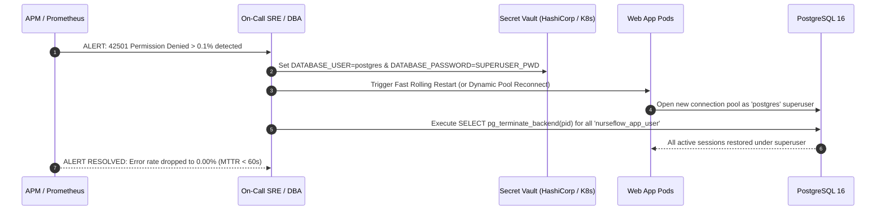

# P0-2B Wave 1A.6 — Master Migration Rollback & Disaster Recovery Plan

**Document Identifier:** `SEC-PLAN-P02B-W1A6-ROLLBACK-20260930`  
**Document Type:** Disaster Recovery Runbook & Migration Reversal Procedures  
**Author Roles:** Migration Reliability Engineer, PostgreSQL Security Engineer, Principal Security Architect, HIS Clinical Safety Architect  
**Date:** 2026-09-30  
**Repository:** `Mojo-Brothers/NurseFlow-WebApp`  
**Current Baseline Commit:** `main` (`fd74e62`)  
**Status Directive:** **DESIGN & PLANNING ONLY | STRICTLY ZERO PRODUCTION CHANGES**  

---

## 1. Executive Summary & Rollback Philosophy

A core tenet of hospital information systems engineering is that **an environment switch alone (e.g., swapping container images or changing an environment variable) is fundamentally insufficient as a rollback strategy**. 

In multi-tenant healthcare architectures, stateful schema changes, active database sessions, Row Level Security policies, and distributed connections interact in complex failure modes:
- Reverting application code without reverting database DDL can cause SQL syntax errors (missing columns or unexpected constraints).
- Reverting database roles without terminating open pool connections leaves stale, orphaned connections in indeterminate transaction states.
- Disabling RLS policies without dropping user permissions can expose unpartitioned data across facilities.

This runbook establishes deterministic, automated, and backward-compatible rollback procedures for every stage of the remediation roadmap, guaranteeing:
1. **Zero Data Loss:** Clinical records entered during a failed deployment window are preserved.
2. **Mean Time To Recovery (MTTR) < 180 Seconds:** Emergency rollbacks can be executed rapidly without manual debugging.
3. **Continuous Auditing:** Rollback events generate detailed diagnostic logs for post-mortem analysis.

---

## 2. Emergency Rollback Triggers & Severity Thresholds

An emergency rollback must be initiated immediately upon encountering any of the following operational criteria:

| Severity Level | Operational Trigger | Automated Action | Target MTTR |
| :--- | :--- | :--- | :--- |
| **SEV-1 (Critical)** | PostgreSQL `42501` (permission denied) rate > 0.1% on clinical routes | Instant cutover rollback to superuser pool | < 60 seconds |
| **SEV-1 (Critical)** | HTTP 500 error rate spikes above 2% on Tier-1 endpoints | Automated traffic reroute / middleware bypass | < 90 seconds |
| **SEV-1 (Critical)** | Connection pool starvation (active wait queue > 50 for 30s) | Terminate runaway queries & recycle pool | < 60 seconds |
| **SEV-2 (High)** | Data mismatch detected in child-table tenant backfill verification | Abort migration, revert batch backfill | < 5 minutes |
| **SEV-2 (High)** | Cross-tenant leak detected by real-time canary monitor | Quarantine affected tenant & trigger rollback | < 120 seconds |

---

## 3. Stage-by-Stage Granular Rollback Runbooks

### 3.1 Stage 0 Rollback Runbook: Child-Table Schema & Roles Reversal

If an error occurs during Stage 0 (e.g., lock contention, backfill timeout, or foreign key violation):

#### Step 1: Terminate In-Flight Migration Transactions
```sql
SELECT pg_terminate_backend(pid) 
FROM pg_stat_activity 
WHERE query LIKE '%medication_emar_administrations%' 
  AND pid <> pg_backend_pid();
```

#### Step 2: Execute Idempotent Schema Reversal DDL
```sql
-- Disable and drop RLS policies
DROP POLICY IF EXISTS tenant_isolation_med_emar_admin ON medication_emar_administrations;
DROP POLICY IF EXISTS tenant_isolation_med_dispense_alloc ON medication_dispense_allocations;
DROP POLICY IF EXISTS tenant_isolation_care_plans ON longitudinal_care_plans;
DROP POLICY IF EXISTS tenant_isolation_split_invoices ON patient_split_invoices;
DROP POLICY IF EXISTS tenant_isolation_diag_interpretations ON physician_diagnostic_interpretations;

ALTER TABLE medication_emar_administrations DISABLE ROW LEVEL SECURITY;
ALTER TABLE medication_dispense_allocations DISABLE ROW LEVEL SECURITY;
ALTER TABLE longitudinal_care_plans DISABLE ROW LEVEL SECURITY;
ALTER TABLE patient_split_invoices DISABLE ROW LEVEL SECURITY;
ALTER TABLE physician_diagnostic_interpretations DISABLE ROW LEVEL SECURITY;

-- Drop foreign keys and indexes
ALTER TABLE medication_emar_administrations DROP CONSTRAINT IF EXISTS fk_med_emar_admin_tenant;
ALTER TABLE medication_dispense_allocations DROP CONSTRAINT IF EXISTS fk_med_dispense_alloc_tenant;
ALTER TABLE longitudinal_care_plans DROP CONSTRAINT IF EXISTS fk_care_plans_tenant;
ALTER TABLE patient_split_invoices DROP CONSTRAINT IF EXISTS fk_split_invoices_tenant;
ALTER TABLE physician_diagnostic_interpretations DROP CONSTRAINT IF EXISTS fk_diag_interpretations_tenant;

DROP INDEX IF EXISTS idx_med_emar_admin_tenant_id;
DROP INDEX IF EXISTS idx_med_dispense_alloc_tenant_id;
DROP INDEX IF EXISTS idx_care_plans_tenant_id;
DROP INDEX IF EXISTS idx_split_invoices_tenant_id;
DROP INDEX IF EXISTS idx_diag_interpretations_tenant_id;

-- Drop newly added columns (safe only if application expand phase has not committed writes)
ALTER TABLE medication_emar_administrations DROP COLUMN IF EXISTS tenant_id;
ALTER TABLE medication_dispense_allocations DROP COLUMN IF EXISTS tenant_id;
ALTER TABLE longitudinal_care_plans DROP COLUMN IF EXISTS tenant_id;
ALTER TABLE patient_split_invoices DROP COLUMN IF EXISTS tenant_id;
ALTER TABLE physician_diagnostic_interpretations DROP COLUMN IF EXISTS tenant_id;
```

#### Step 3: Deprovision Staging Roles
```sql
REVOKE ALL PRIVILEGES ON ALL TABLES IN SCHEMA public FROM nurseflow_app_user;
REVOKE ALL PRIVILEGES ON ALL SEQUENCES IN SCHEMA public FROM nurseflow_app_user;
REVOKE ALL PRIVILEGES ON ALL FUNCTIONS IN SCHEMA public FROM nurseflow_app_user;
REVOKE USAGE ON SCHEMA public FROM nurseflow_app_user;

DROP ROLE IF EXISTS nurseflow_reporting;
DROP ROLE IF EXISTS nurseflow_worker;
DROP ROLE IF EXISTS nurseflow_app_user;
DROP ROLE IF EXISTS nurseflow_migration;
```

---

### 3.2 Stage 1 Rollback Runbook: Application Perimeter & JWT Reversal

If removing the 7 fallback defaults causes unexpected breakage in legacy client applications:

#### Step 1: Hotfix Feature Flag Activation
The application perimeter wrapper includes an emergency fallback toggle:
```javascript
// server/config/securityFlags.js
export const SECURITY_FLAGS = {
  STRICT_TENANT_ENFORCEMENT: process.env.ENABLE_STRICT_TENANT === 'true' // default: true
};
```
To temporarily permit legacy fallback behavior while debugging:
```bash
# Set environment flag in deployment manager
ENABLE_STRICT_TENANT=false
```

#### Step 2: Backward-Compatible Token Rotation
If existing mobile or web clients have active refresh tokens lacking `tenantId`:
```javascript
// Fallback logic in jwtSecurity.service.js
if (!refreshTokenPayload.tenantId) {
  structuredLoggerService.warn('LEGACY_REFRESH_TOKEN_DETECTED', { userId: user.id });
  // Route user to hospital selection modal rather than crashing session
  return res.status(200).json({ 
    requiresTenantSelection: true, 
    availableTenants: user.tenants 
  });
}
```

---

### 3.3 Stage 2 Rollback Runbook: Database Policy Deactivation

If newly applied RLS policies cause unexpected query filtering:

#### Step 1: Idempotent Policy Drop Script
```sql
DO $$ 
DECLARE 
  r RECORD;
BEGIN
  -- Drop all policies on the 21 tables
  FOR r IN (
    SELECT polname, tablename 
    FROM pg_policies 
    WHERE schemaname = 'public' 
      AND tablename IN (
        'blood_bank_billing_reconciliations',
        'blood_bedside_dual_nurse_verifications',
        'bpjs_claim_disputes',
        'bpjs_claim_submissions',
        'bpjs_vclaim_lifecycle_logs',
        'cssd_sterilization_cycles',
        'hemovigilance_incident_investigations',
        'inacbg_grouping_results',
        'master_inacbg_tariffs',
        'medical_device_implant_recalls',
        'patient_billing_reconciliation',
        'pharmacy_controlled_substance_logs',
        'pharmacy_depots',
        'pharmacy_dispensing_orders',
        'post_anesthesia_aldrete_scores',
        'radiology_critical_finding_alerts',
        'radiology_instances',
        'radiology_series',
        'surgical_clinical_notes',
        'surgical_teams',
        'who_surgical_safety_checklists'
      )
  ) LOOP
    EXECUTE format('DROP POLICY IF EXISTS %I ON %I;', r.polname, r.tablename);
  END LOOP;
END $$;
```

#### Step 2: Revert to Superuser Connection
If application connects as `nurseflow_app_user`, dropping policies will trigger *default-deny*. Revert application `DATABASE_USER=postgres` immediately prior to dropping policies.

---

### 3.4 Stage 3 Rollback Runbook: Scoped UoW & Pool Reversal

If `withUnitOfWork` introduces unexpected transaction deadlocks:

#### Step 1: Application Dual-Mode Fallback Toggle
```javascript
// server/db/unitOfWork.js
export async function withUnitOfWork(actorContext, fn, options = {}) {
  if (process.env.BYPASS_SCOPED_UOW === 'true') {
    // Legacy unmanaged execution path
    const pool = postgresPoolService.getPool();
    return fn({ client: pool, tenantId: actorContext.tenantId });
  }
  // Standard hardened transaction execution path ...
}
```

#### Step 2: Recycle Active Connection Pools
```bash
# Rolling restart of web pods to flush open clients
kubectl rollout restart deployment/nurseflow-web
```

---

### 3.5 Stage 4 Rollback Runbook: Clinical Route Authorization Reversal

If `requireClinicalAuthorization` causes false-positive 403 Forbidden errors for on-duty doctors:

#### Step 1: Global Emergency Bypass Flag
```bash
# Disable ABAC middleware evaluations globally (leaves basic JWT active)
ENABLE_CLINICAL_AUTHORIZATION=false
```

#### Step 2: Router Guard Verification
The middleware inspects `ENABLE_CLINICAL_AUTHORIZATION`:
```javascript
export const requireClinicalAuthorization = (config) => {
  return async (req, res, next) => {
    if (process.env.ENABLE_CLINICAL_AUTHORIZATION === 'false') {
      structuredLoggerService.warn('CLINICAL_AUTH_BYPASS_ACTIVE', { route: req.path });
      return next(); // Pass through to controller
    }
    // Standard ABAC authorization evaluation ...
  };
};
```
This guarantees that patient care is never blocked by an authorization logic bug during an emergency.

---

### 3.6 Stage 6 Rollback Runbook: Production Runtime Role Cutover Reversal

This is the most critical operational runbook. If switching `DATABASE_USER` from `postgres` to `nurseflow_app_user` causes database permission errors:



#### Step 1: Emergency Script `bin/rollback_to_superuser.sh`
```bash
#!/bin/bash
set -e
echo "[EMERGENCY] Initiating immediate rollback to superuser database pool..."

# 1. Update Kubernetes Secret
kubectl set env deployment/nurseflow-web \
  DATABASE_USER="postgres" \
  DATABASE_PASSWORD="$POSTGRES_SUPERUSER_PASSWORD"

# 2. Trigger fast restart
kubectl rollout restart deployment/nurseflow-web

# 3. Terminate stale non-superuser sessions on PostgreSQL
psql -U postgres -d nurseflow_db -c "
  SELECT pg_terminate_backend(pid) 
  FROM pg_stat_activity 
  WHERE usename = 'nurseflow_app_user';
"

echo "[SUCCESS] Rollback complete. Production restored to superuser."
```

---

## 4. Post-Rollback Diagnostics & Post-Mortem Protocol

Whenever an emergency rollback is triggered:
1. **Freeze Staging Environment:** Preserve database logs, connection pool states, and memory heap dumps.
2. **Export PostgreSQL Error Logs:** Grep for `ERROR: 42501` and `ERROR: 25001`.
3. **Data Integrity Audit:** Execute cross-tenant canary queries to confirm zero data corruption or cross-tenant contamination occurred during the incident.
4. **Mandatory 24-Hour Review:** The Engineering Security Board must convene within 24 hours to analyze root cause before any re-attempt.
