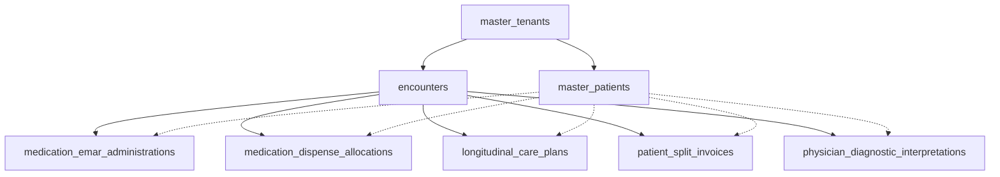
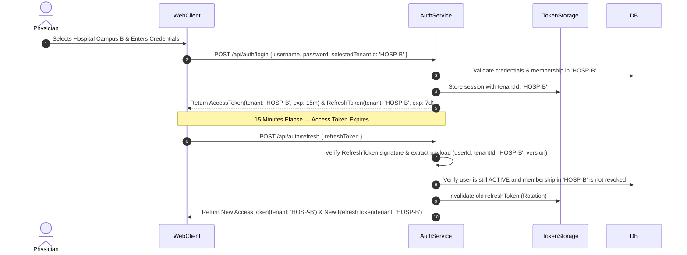
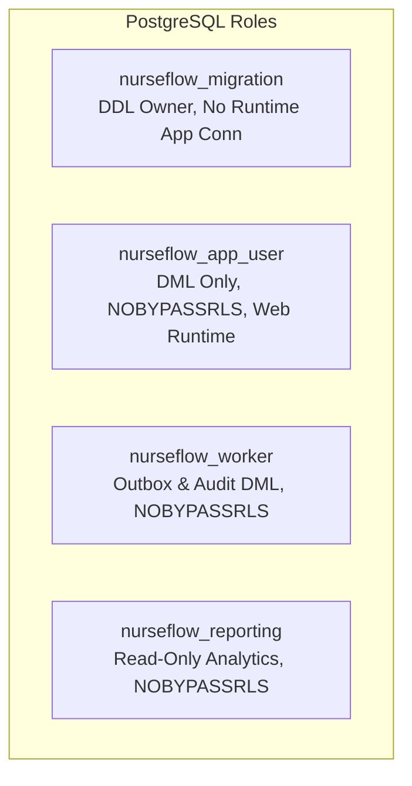

# P0-2B Wave 1A.6 — Master Security Remediation Strategy

**Document Identifier:** `SEC-PLAN-P02B-W1A6-STRATEGY-20260930`  
**Document Type:** Phased Security Remediation Design & Architectural Specifications  
**Author Roles:** Principal Security Architect, PostgreSQL Security Engineer, Application Security Engineer, HIS Clinical Safety Architect, Migration Reliability Engineer  
**Date:** 2026-09-30  
**Repository:** `Mojo-Brothers/NurseFlow-WebApp`  
**Current Baseline Commit:** `main` (`fd74e62`)  
**Status Directive:** **DESIGN & PLANNING ONLY | STRICTLY ZERO PRODUCTION CHANGES**  

---

## 1. Executive Summary & Audit Constraints

### 1.1 Scope & Mission
This document defines the actionable, phased, and cryptographically sound engineering remediation designs for the vulnerabilities and architectural gaps verified during Wave 1A.5.5. 

The primary objective is to transition NurseFlow from an ad-hoc, perimeter-dependent tenancy model to a **Defense-in-Depth, Multi-Tenant Healthcare Architecture** enforcing:
1. Strict PostgreSQL Row Level Security (RLS) across 100% of tenant-bound clinical and operational tables.
2. Complete elimination of Broken Object-Level Authorization (BOLA) on child tables.
3. Complete elimination of default tenant fallback and cross-tenant substitution vectors.
4. Cryptographic continuity of tenant context across JWT token lifecycles.
5. Non-superuser runtime privilege separation enforcing least privilege.
6. A robust, parameterized Scoped Unit-of-Work contract with three-tier connection lifecycle management.
7. ABAC-compliant clinical authorization and resource ownership verification across all 38 Tier-1 clinical endpoints.

### 1.2 Strict Governance Constraints
In accordance with the **Wave 1A.6 Directive**:
- **Zero Production Mutations:** No application source files (`server/`, `src/`) or production configurations are modified.
- **Zero Active Migrations:** No DDL or DML statements are executed on the active production database.
- **Zero Active Role/RLS Alterations:** Active database roles, grants, and RLS policies remain completely untouched.
- **Preservation of Clinical Workflows:** Remediation designs must preserve clinical workflows (triage, eMAR, order entry) with zero clinical disruption.
- **Zero Premature Closures:** All findings remain formally classified as `REMEDIATION_DESIGNED` until executed and empirically verified on an isolated staging replica in subsequent implementation waves.

---

## 2. WS-01 — Child-Table BOLA Remediation Design

### 2.1 Problem Analysis
Wave 1A.5.5 proved that five child tables lack a direct `tenant_id` column and have `relrowsecurity = false`. When child table records are queried, locked, updated, or deleted via direct primary key lookups (`WHERE id = $1`), PostgreSQL completely bypasses parent table RLS policies, enabling severe cross-tenant tampering, financial manipulation, and care-plan hijacking.

### 2.2 Deep Schema & Ownership Analysis

The physical schema introspection conducted on the live database established the following ownership graph:



Every single one of the five child tables already possesses a mandatory foreign key constraint to `encounters(id)`. Because `encounters.tenant_id` is an indexed, non-nullable UUID bound to `master_tenants(id)`, the authoritative tenant owner of every child record is **unambiguously derived from `encounters.tenant_id`**.

### 2.3 Phased Remediation Specifications for the 5 Child Tables

#### 1. `medication_emar_administrations` (eMAR Records)
- **Business Function:** Medico-legal log of bedside medication administration by nurses.
- **Current State:** PK `id uuid`, FK `encounter_id -> encounters(id)`, NO `tenant_id`, RLS disabled.
- **Remediation DDL:**
  ```sql
  ALTER TABLE medication_emar_administrations ADD COLUMN tenant_id uuid;

  UPDATE medication_emar_administrations mea
  SET tenant_id = e.tenant_id
  FROM encounters e
  WHERE mea.encounter_id = e.id AND mea.tenant_id IS NULL;

  ALTER TABLE medication_emar_administrations 
    ALTER COLUMN tenant_id SET NOT NULL,
    ADD CONSTRAINT fk_med_emar_admin_tenant 
      FOREIGN KEY (tenant_id) REFERENCES master_tenants(id) ON DELETE RESTRICT;

  CREATE INDEX idx_med_emar_admin_tenant_id 
    ON medication_emar_administrations(tenant_id);

  ALTER TABLE medication_emar_administrations ENABLE ROW LEVEL SECURITY;
  ALTER TABLE medication_emar_administrations FORCE ROW LEVEL SECURITY;

  CREATE POLICY tenant_isolation_med_emar_admin ON medication_emar_administrations
  FOR ALL TO nurseflow_app_user
  USING (tenant_id = NULLIF(current_setting('app.current_tenant_id', true), '')::uuid)
  WITH CHECK (tenant_id = NULLIF(current_setting('app.current_tenant_id', true), '')::uuid);
  ```

#### 2. `medication_dispense_allocations` (Pharmacy Batch Allocations)
- **Business Function:** Pharmacy inventory stock allocations and batch tracking for prescriptions.
- **Current State:** PK `id uuid`, FK `encounter_id -> encounters(id)`, NO `tenant_id`, RLS disabled.
- **Remediation DDL:**
  ```sql
  ALTER TABLE medication_dispense_allocations ADD COLUMN tenant_id uuid;

  UPDATE medication_dispense_allocations mda
  SET tenant_id = e.tenant_id
  FROM encounters e
  WHERE mda.encounter_id = e.id AND mda.tenant_id IS NULL;

  ALTER TABLE medication_dispense_allocations 
    ALTER COLUMN tenant_id SET NOT NULL,
    ADD CONSTRAINT fk_med_dispense_alloc_tenant 
      FOREIGN KEY (tenant_id) REFERENCES master_tenants(id) ON DELETE RESTRICT;

  CREATE INDEX idx_med_dispense_alloc_tenant_id 
    ON medication_dispense_allocations(tenant_id);

  ALTER TABLE medication_dispense_allocations ENABLE ROW LEVEL SECURITY;
  ALTER TABLE medication_dispense_allocations FORCE ROW LEVEL SECURITY;

  CREATE POLICY tenant_isolation_med_dispense_alloc ON medication_dispense_allocations
  FOR ALL TO nurseflow_app_user
  USING (tenant_id = NULLIF(current_setting('app.current_tenant_id', true), '')::uuid)
  WITH CHECK (tenant_id = NULLIF(current_setting('app.current_tenant_id', true), '')::uuid);
  ```

#### 3. `longitudinal_care_plans` (Interdisciplinary Care Plans)
- **Business Function:** Longitudinal patient clinical problems, goals, and care pathways.
- **Current State:** PK `id uuid`, FK `encounter_id -> encounters(id)`, NO `tenant_id`, RLS disabled.
- **Remediation DDL:**
  ```sql
  ALTER TABLE longitudinal_care_plans ADD COLUMN tenant_id uuid;

  UPDATE longitudinal_care_plans lcp
  SET tenant_id = e.tenant_id
  FROM encounters e
  WHERE lcp.encounter_id = e.id AND lcp.tenant_id IS NULL;

  ALTER TABLE longitudinal_care_plans 
    ALTER COLUMN tenant_id SET NOT NULL,
    ADD CONSTRAINT fk_care_plans_tenant 
      FOREIGN KEY (tenant_id) REFERENCES master_tenants(id) ON DELETE RESTRICT;

  CREATE INDEX idx_care_plans_tenant_id 
    ON longitudinal_care_plans(tenant_id);

  ALTER TABLE longitudinal_care_plans ENABLE ROW LEVEL SECURITY;
  ALTER TABLE longitudinal_care_plans FORCE ROW LEVEL SECURITY;

  CREATE POLICY tenant_isolation_care_plans ON longitudinal_care_plans
  FOR ALL TO nurseflow_app_user
  USING (tenant_id = NULLIF(current_setting('app.current_tenant_id', true), '')::uuid)
  WITH CHECK (tenant_id = NULLIF(current_setting('app.current_tenant_id', true), '')::uuid);
  ```

#### 4. `patient_split_invoices` (Billing & Co-Payment Splitting)
- **Business Function:** Financial accounting for BPJS vs patient-share co-payments.
- **Current State:** PK `id uuid`, FK `encounter_id -> encounters(id)`, NO `tenant_id`, RLS disabled.
- **Remediation DDL:**
  ```sql
  ALTER TABLE patient_split_invoices ADD COLUMN tenant_id uuid;

  UPDATE patient_split_invoices psi
  SET tenant_id = e.tenant_id
  FROM encounters e
  WHERE psi.encounter_id = e.id AND psi.tenant_id IS NULL;

  ALTER TABLE patient_split_invoices 
    ALTER COLUMN tenant_id SET NOT NULL,
    ADD CONSTRAINT fk_split_invoices_tenant 
      FOREIGN KEY (tenant_id) REFERENCES master_tenants(id) ON DELETE RESTRICT;

  CREATE INDEX idx_split_invoices_tenant_id 
    ON patient_split_invoices(tenant_id);

  ALTER TABLE patient_split_invoices ENABLE ROW LEVEL SECURITY;
  ALTER TABLE patient_split_invoices FORCE ROW LEVEL SECURITY;

  CREATE POLICY tenant_isolation_split_invoices ON patient_split_invoices
  FOR ALL TO nurseflow_app_user
  USING (tenant_id = NULLIF(current_setting('app.current_tenant_id', true), '')::uuid)
  WITH CHECK (tenant_id = NULLIF(current_setting('app.current_tenant_id', true), '')::uuid);
  ```

#### 5. `physician_diagnostic_interpretations` (Clinical Impressions)
- **Business Function:** Doctor's clinical correlation and diagnostic reading notes.
- **Current State:** PK `id uuid`, FK `encounter_id -> encounters(id)`, NO `tenant_id`, RLS disabled.
- **Remediation DDL:**
  ```sql
  ALTER TABLE physician_diagnostic_interpretations ADD COLUMN tenant_id uuid;

  UPDATE physician_diagnostic_interpretations pdi
  SET tenant_id = e.tenant_id
  FROM encounters e
  WHERE pdi.encounter_id = e.id AND pdi.tenant_id IS NULL;

  ALTER TABLE physician_diagnostic_interpretations 
    ALTER COLUMN tenant_id SET NOT NULL,
    ADD CONSTRAINT fk_diag_interpretations_tenant 
      FOREIGN KEY (tenant_id) REFERENCES master_tenants(id) ON DELETE RESTRICT;

  CREATE INDEX idx_diag_interpretations_tenant_id 
    ON physician_diagnostic_interpretations(tenant_id);

  ALTER TABLE physician_diagnostic_interpretations ENABLE ROW LEVEL SECURITY;
  ALTER TABLE physician_diagnostic_interpretations FORCE ROW LEVEL SECURITY;

  CREATE POLICY tenant_isolation_diag_interpretations ON physician_diagnostic_interpretations
  FOR ALL TO nurseflow_app_user
  USING (tenant_id = NULLIF(current_setting('app.current_tenant_id', true), '')::uuid)
  WITH CHECK (tenant_id = NULLIF(current_setting('app.current_tenant_id', true), '')::uuid);
  ```

### 2.4 Application Expand-and-Contract Sequencing
To avoid downtime or application errors during rollout:
1. **Expand Phase (Schema):** Add `tenant_id` as nullable; deploy database trigger ensuring newly inserted rows copy `tenant_id` from `encounters` if omitted.
2. **Backfill Phase:** Run batch updates in chunks of 5,000 rows to populate existing rows without exclusive lock contention.
3. **App Update Phase:** Update repositories (`emarRepository`, `dispenseRepository`, `carePlanRepository`, `billingRepository`, `diagnosticRepository`) to explicitly include `tenant_id: uow.tenantId` in all `INSERT` statements.
4. **Contract Phase:** Enforce `ALTER COLUMN tenant_id SET NOT NULL`, enable RLS, drop the temporary trigger, and grant DML privileges.

### 2.5 Test Matrix for All 5 Child Tables
The following test matrix validates that child-table multitenancy is fully enforced:

| Test Operation | `medication_emar_administrations` | `medication_dispense_allocations` | `longitudinal_care_plans` | `patient_split_invoices` | `physician_diagnostic_interpretations` | Expected Security Result |
| :--- | :--- | :--- | :--- | :--- | :--- | :--- |
| **Read by ID (Same Tenant)** | ✅ Permitted (Nurse) | ✅ Permitted (Pharmacist) | ✅ Permitted (Doctor) | ✅ Permitted (Billing) | ✅ Permitted (Doctor) | 200 OK, row data returned |
| **Read by ID (Cross Tenant)** | 🚫 Denied (0 rows) | 🚫 Denied (0 rows) | 🚫 Denied (0 rows) | 🚫 Denied (0 rows) | 🚫 Denied (0 rows) | 0 rows / 404 Not Found |
| **Insert (Same Tenant)** | ✅ Permitted | ✅ Permitted | ✅ Permitted | ✅ Permitted | ✅ Permitted | 201 Created, tenant_id bound |
| **Insert (Cross Tenant ID)** | 🚫 Denied (RLS CHECK) | 🚫 Denied (RLS CHECK) | 🚫 Denied (RLS CHECK) | 🚫 Denied (RLS CHECK) | 🚫 Denied (RLS CHECK) | RLS WITH CHECK Violation |
| **Update (Same Tenant)** | ✅ Permitted | ✅ Permitted | ✅ Permitted | ✅ Permitted | ✅ Permitted | Row updated |
| **Update (Cross Tenant)** | 🚫 Denied (0 rows) | 🚫 Denied (0 rows) | 🚫 Denied (0 rows) | 🚫 Denied (0 rows) | 🚫 Denied (0 rows) | 0 rows affected |
| **Delete (Same Tenant)** | 🚫 Restricted/Admin | 🚫 Restricted/Admin | 🚫 Restricted/Admin | 🚫 Restricted/Admin | 🚫 Restricted/Admin | Clinical audit soft-delete |
| **Delete (Cross Tenant)** | 🚫 Denied (0 rows) | 🚫 Denied (0 rows) | 🚫 Denied (0 rows) | 🚫 Denied (0 rows) | 🚫 Denied (0 rows) | 0 rows affected |
| **Row Locking (`FOR UPDATE`)** | 🚫 Cross-Tenant Blocked | 🚫 Cross-Tenant Blocked | 🚫 Cross-Tenant Blocked | 🚫 Cross-Tenant Blocked | 🚫 Cross-Tenant Blocked | Cannot acquire lock on other tenant |
| **Cross-Patient Tampering** | 🚫 Guard Rejection | 🚫 Guard Rejection | 🚫 Guard Rejection | 🚫 Guard Rejection | 🚫 Guard Rejection | 400 Bad Request / Mismatch |

---

## 3. WS-02 — 21 Zero-Policy RLS Tables Remediation Design

### 3.1 Comprehensive Table Inventory & Policy Specifications
All 21 tables identified in live database introspection already possess a direct `tenant_id uuid NOT NULL` column. The following matrix details the business purpose, access matrix, default-deny risk, target policy, migration dependencies, and positive/negative test definitions:

| # | Table Name | Business Purpose | Tenant Ownership | CRUD Matrix (Roles) | Default-Deny Outage Risk | Target Policy Name | Migration Dependency | Positive Test | Negative Test (Cross-Tenant) |
| :--- | :--- | :--- | :--- | :--- | :--- | :--- | :--- | :--- | :--- |
| 1 | `blood_bank_billing_reconciliations` | Blood bank charge reconciliation | Direct (`tenant_id`) | S/I/U: `BILLING_CLERK`, `ADMIN` | Blood products unbillable | `policy_blood_bank_reconciliation` | `master_tenants` | Select own tenant reconciliations | Cross-tenant query returns 0 rows |
| 2 | `blood_bedside_dual_nurse_verifications` | Transfusion dual nurse sign-off | Direct (`tenant_id`) | S/I: `NURSE`, `DOCTOR` | Transfusions halted at bedside | `policy_blood_bedside_verification` | `master_tenants` | Log transfusion verification | Tenant B cannot see Tenant A sign-offs |
| 3 | `bpjs_claim_disputes` | BPJS dispute appeals | Direct (`tenant_id`) | S/I/U: `CASEMIX_CODER`, `FINANCE` | Dispute resolution offline | `policy_bpjs_claim_disputes` | `master_tenants` | Create dispute appeal | Cross-tenant update blocked |
| 4 | `bpjs_claim_submissions` | VClaim batch submissions | Direct (`tenant_id`) | S/I/U: `CASEMIX_CODER`, `ADMIN` | Insurance claims blocked | `policy_bpjs_claim_submissions` | `master_tenants` | Submit claim batch | Tenant B cannot read claim batches |
| 5 | `bpjs_vclaim_lifecycle_logs` | Audit trail of BPJS APIs | Direct (`tenant_id`) | S/I: `CASEMIX_CODER`, `SYSTEM` | Integration telemetry fails | `policy_bpjs_vclaim_logs` | `master_tenants` | Append API log | Cross-tenant log query returns 0 rows |
| 6 | `cssd_sterilization_cycles` | Surgical autoclave logs | Direct (`tenant_id`) | S/I/U: `CSSD_TECH`, `OR_NURSE` | Instrument safety unverified | `policy_cssd_sterilization` | `master_tenants` | Record autoclave cycle | Tenant B cannot see autoclave cycles |
| 7 | `hemovigilance_incident_investigations` | Transfusion adverse events | Direct (`tenant_id`) | S/I/U: `SAFETY_OFFICER`, `MD` | Safety alert drop | `policy_hemovigilance_incidents` | `master_tenants` | File transfusion reaction | Tenant B cannot see reaction reports |
| 8 | `inacbg_grouping_results` | Casemix grouper tariffs | Direct (`tenant_id`) | S/I/U: `CASEMIX_CODER`, `BILLING` | Diagnostic tariff missing | `policy_inacbg_grouping` | `master_tenants` | Calculate INA-CBG grouper | Tenant B cannot view grouper results |
| 9 | `master_inacbg_tariffs` | National tariff definitions | Direct (`tenant_id`) | S: `ALL_STAFF`; I/U: `ADMIN` | Tariff calculation crash | `policy_master_inacbg_tariffs` | `master_tenants` | Read tariff rate | Non-admin cannot insert/update tariff |
| 10 | `medical_device_implant_recalls` | Ortho/cardio implant alerts | Direct (`tenant_id`) | S/I/U: `OR_STAFF`, `SURGEON` | Recalled implants untracked | `policy_implant_recalls` | `master_tenants` | Query active recall alerts | Cross-tenant alerts invisible |
| 11 | `patient_billing_reconciliation` | Cashier settlement | Direct (`tenant_id`) | S/I/U: `CASHIER`, `FINANCE` | Discharge payment blocked | `policy_billing_reconciliation` | `master_tenants` | Reconcile bill before exit | Cross-tenant invoice settlement blocked |
| 12 | `pharmacy_controlled_substance_logs` | Opioid/narcotics registry | Direct (`tenant_id`) | S/I: `PHARMACIST`, `AUDITOR` | Narcotics dispensation blocked | `policy_controlled_substance` | `master_tenants` | Log morphine dispensing | Cross-tenant registry lookup blocked |
| 13 | `pharmacy_depots` | Satellite pharmacy depots | Direct (`tenant_id`) | S/I/U: `PHARMACIST`, `NURSE` | Ward inventory invisible | `policy_pharmacy_depots` | `master_tenants` | View depot stock balance | Tenant B cannot view depot balance |
| 14 | `pharmacy_dispensing_orders` | Outpatient prescription orders | Direct (`tenant_id`) | S/I/U: `PHARMACIST`, `CASHIER` | Drug dispensing halted | `policy_dispensing_orders` | `master_tenants` | Process prescription queue | Cross-tenant prescription inaccessible |
| 15 | `post_anesthesia_aldrete_scores` | PACU surgical recovery | Direct (`tenant_id`) | S/I/U: `ANESTHETIST`, `PACU_RN` | Patient cannot exit OR | `policy_aldrete_scores` | `master_tenants` | Record Aldrete score 9 | Tenant B cannot view PACU scores |
| 16 | `radiology_critical_finding_alerts` | Urgent radiological alerts | Direct (`tenant_id`) | S/I/U: `RADIOLOGIST`, `ED_MD` | Critical scan alerts fail | `policy_radiology_alerts` | `master_tenants` | Dispatch critical chest alert | Tenant B cannot receive Tenant A alert |
| 17 | `radiology_instances` | DICOM SOP instance metadata | Direct (`tenant_id`) | S/I: `RADIOLOGIST`, `DOCTOR` | PACS image viewing fails | `policy_radiology_instances` | `master_tenants` | Load CT slice metadata | Tenant B cannot query DICOM instances |
| 18 | `radiology_series` | DICOM Series metadata | Direct (`tenant_id`) | S/I: `RADIOLOGIST`, `DOCTOR` | PACS series tree fails | `policy_radiology_series` | `master_tenants` | Load MRI series | Tenant B cannot query DICOM series |
| 19 | `surgical_clinical_notes` | Operative reports & notes | Direct (`tenant_id`) | S/I/U: `SURGEON`, `ANESTHETIST` | Operative notes lost | `policy_surgical_notes` | `master_tenants` | Save operative report | Tenant B surgeon cannot read note |
| 20 | `surgical_teams` | OR staff roster | Direct (`tenant_id`) | S/I/U: `OR_SCHEDULER`, `SURGEON`| Surgical scheduling blocked | `policy_surgical_teams` | `master_tenants` | Assign scrub nurse to OR 1 | Tenant B cannot modify OR roster |
| 21 | `who_surgical_safety_checklists` | Perioperative sign-in/out | Direct (`tenant_id`) | S/I/U: `SURGEON`, `OR_NURSE` | OR safety compliance fails | `policy_who_surgical_checklists`| `master_tenants` | Complete Time-Out checklist | Cross-tenant checklist update blocked |

---

## 4. WS-03 — Tenant Fallback & Substitution Elimination Design

### 4.1 Exhaustive Audit of 7 Critical Fallbacks & 5 Substitution Paths

Every fallback identified in Wave 1A.5.5 was analyzed for remediation:

```
┌──────────────────────────────────────────────────────────────────────────────────────────────────┐
│ 1. server/controllers/masterDataHub.controller.js (Lines 130, 143)                               │
├──────────────────────────────────────────────────────────────────────────────────────────────────┤
│ Call Chain:    HTTP GET /api/master-data/resources -> getResources()                             │
│ Input Tenant:  req.query.tenantId or req.body.tenantId                                           │
│ Trusted Source:req.authContext.tenantId (validated from verified JWT)                            │
│ Defect:        const tenantId = req.query.tenantId || 'tenant-default-001';                      │
│ Risk:          User in Tenant B can query Tenant A master data via ?tenantId=... or fallback     │
│ Remediation:   const tenantId = req.authContext.tenantId;                                        │
│                if (req.query.tenantId && req.query.tenantId !== tenantId) {                      │
│                  return res.status(403).json({ error: 'FORBIDDEN_CROSS_TENANT_QUERY' });         │
│                }                                                                                 │
│ Test:          Send request as Tenant B with ?tenantId=tenant-001 -> Expect 403 Forbidden        │
└──────────────────────────────────────────────────────────────────────────────────────────────────┘

┌──────────────────────────────────────────────────────────────────────────────────────────────────┐
│ 2. server/services/clinicalNotesApplication.service.js (Line 96 - createClinicalNote)           │
├──────────────────────────────────────────────────────────────────────────────────────────────────┤
│ Call Chain:    HTTP POST /api/clinical-notes -> createClinicalNote()                             │
│ Input Tenant:  command.tenantId or encounter.tenant_id                                           │
│ Trusted Source:actorContext.tenantId                                                             │
│ Defect:        const tenantId = command.tenantId || encounter.tenant_id || 'tenant-default-001'; │
│ Risk:          Untrusted command payload overrides tenant or injects notes into default hospital │
│ Remediation:   assertTenantIntegrity(actorContext.tenantId, encounter.tenant_id, 'Encounter');   │
│                command.tenantId = actorContext.tenantId;                                         │
│ Test:          Submit clinical note with mismatched command.tenantId -> Expect 403               │
└──────────────────────────────────────────────────────────────────────────────────────────────────┘

┌──────────────────────────────────────────────────────────────────────────────────────────────────┐
│ 3. server/services/clinicalNotesApplication.service.js (Line 235 - updateClinicalNote)           │
├──────────────────────────────────────────────────────────────────────────────────────────────────┤
│ Call Chain:    HTTP PUT /api/clinical-notes/:id -> updateClinicalNote()                          │
│ Trusted Source:actorContext.tenantId                                                             │
│ Defect:        const tenantId = command.tenantId || note.tenant_id || 'tenant-default-001';      │
│ Risk:          Allows caller to mutate clinical notes across facilities                          │
│ Remediation:   assertTenantIntegrity(actorContext.tenantId, note.tenant_id, 'Clinical Note');    │
│ Test:          Tenant B updates Tenant A note ID -> Expect 403 Forbidden                         │
└──────────────────────────────────────────────────────────────────────────────────────────────────┘

┌──────────────────────────────────────────────────────────────────────────────────────────────────┐
│ 4. server/services/clinicalNotesApplication.service.js (Line 373 - signClinicalNote)             │
├──────────────────────────────────────────────────────────────────────────────────────────────────┤
│ Call Chain:    HTTP POST /api/clinical-notes/:id/sign -> signClinicalNote()                      │
│ Trusted Source:actorContext.tenantId                                                             │
│ Defect:        const tenantId = command.tenantId || note.tenant_id || 'tenant-default-001';      │
│ Risk:          Attaches legal electronic signature to wrong facility tenant                      │
│ Remediation:   assertTenantIntegrity(actorContext.tenantId, note.tenant_id, 'Note Signature');   │
│ Test:          Physician B attempts signing Physician A note -> Expect 403 Forbidden             │
└──────────────────────────────────────────────────────────────────────────────────────────────────┘

┌──────────────────────────────────────────────────────────────────────────────────────────────────┐
│ 5. server/services/cpoeApplication.service.js (Line 168 - createCpoeOrder)                       │
├──────────────────────────────────────────────────────────────────────────────────────────────────┤
│ Call Chain:    HTTP POST /api/cpoe/orders -> createCpoeOrder()                                   │
│ Trusted Source:actorContext.tenantId                                                             │
│ Defect:        const tenantId = order.tenant_id || encounter.tenant_id || 'tenant-default-001';  │
│ Risk:          Medication orders and laboratory tests misrouted to default hospital              │
│ Remediation:   assertTenantIntegrity(actorContext.tenantId, encounter.tenant_id, 'CPOE Order'); │
│                order.tenant_id = actorContext.tenantId;                                          │
│ Test:          Doctor orders meds with altered order.tenant_id -> Expect 403 Forbidden           │
└──────────────────────────────────────────────────────────────────────────────────────────────────┘

┌──────────────────────────────────────────────────────────────────────────────────────────────────┐
│ 6. server/services/medicationClosedLoop.service.js (Line 332 - processDispense)                  │
├──────────────────────────────────────────────────────────────────────────────────────────────────┤
│ Call Chain:    HTTP POST /api/pharmacy/dispense -> processDispense()                             │
│ Trusted Source:actorContext.tenantId                                                             │
│ Defect:        const tenantId = payload.tenantId || order.tenant_id || 'tenant-default-001';     │
│ Risk:          Pharmacy inventory deducted from wrong facility hospital                          │
│ Remediation:   assertTenantIntegrity(actorContext.tenantId, order.tenant_id, 'Dispense Order');  │
│                payload.tenantId = actorContext.tenantId;                                         │
│ Test:          Dispense order from Tenant A using Tenant B credentials -> Expect 403             │
└──────────────────────────────────────────────────────────────────────────────────────────────────┘

┌──────────────────────────────────────────────────────────────────────────────────────────────────┐
│ 7. server/services/triageApplication.service.js (Line 160 - performTriage)                       │
├──────────────────────────────────────────────────────────────────────────────────────────────────┤
│ Call Chain:    HTTP POST /api/triage/assessments -> performTriage()                              │
│ Trusted Source:actorContext.tenantId                                                             │
│ Defect:        const tenantId = assessment.tenantId || encounter.tenant_id || 'tenant-def-001';  │
│ Risk:          Emergency room queue contaminated with other hospital patients                    │
│ Remediation:   assertTenantIntegrity(actorContext.tenantId, encounter.tenant_id, 'Triage');      │
│                assessment.tenantId = actorContext.tenantId;                                      │
│ Test:          ED Nurse triages patient with fallback payload -> Expect 400/403                  │
└──────────────────────────────────────────────────────────────────────────────────────────────────┘
```

---

## 5. WS-04 — JWT Tenant Continuity & Lifecycle Hardening

### 5.1 Analysis of Current Vulnerability
In `server/services/jwtSecurity.service.js`:
- Login issues an access token (containing `tenantId: 'HOSPITAL-B'`) and a refresh token.
- Crucially, the **refresh token payload currently omits `tenantId`**.
- When the 15-minute access token expires, `refreshAccessToken()` loads the user from `users` table.
- Because multi-facility physicians have a primary headquarters campus (`'tenant-default-001'`), token rotation silently generates a new access token bound to the default campus, hijacking the session and causing cross-tenant data contamination.

### 5.2 Hardened JWT Contract & Rotation Protocol



### 5.3 Deprecation & Backward Compatibility Strategy
- **Token Version Invalidation:** When the new auth service is deployed, bumping the global `tokenVersion` or rejecting refresh tokens missing the `tenantId` claim forces legacy sessions to re-authenticate cleanly.
- **Grace Period (Optional):** If a legacy refresh token is received without `tenantId`, require explicit re-selection of tenant rather than defaulting to headquarters.

---

## 6. WS-05 — Runtime Database Role Separation Architecture

### 6.1 Four-Role Least Privilege Matrix

The current insecure configuration (`DATABASE_USER=postgres` superuser) will be decomposed into four dedicated roles:



| Privilege Category | `nurseflow_migration` | `nurseflow_app_user` | `nurseflow_worker` | `nurseflow_reporting` |
| :--- | :--- | :--- | :--- | :--- |
| `canlogin` | Yes (during deploy only) | **Yes** (active web pool) | **Yes** (worker pool) | Yes (reporting pool) |
| `superuser` | **NO** | **NO** | **NO** | **NO** |
| `bypassrls` | **NO** | **NO** | **NO** | **NO** |
| Object Ownership | Owner of public schema | None | None | None |
| Schema Privileges | `ALL ON SCHEMA public` | `USAGE ON SCHEMA public` | `USAGE ON SCHEMA public`| `USAGE ON SCHEMA public` |
| Table Privileges | `ALL` (CREATE, ALTER, DROP) | `SELECT, INSERT, UPDATE, DELETE` | `SELECT, INSERT, UPDATE, DELETE` on `outbox_events`, `clinical_audit_events` | `SELECT` only on reporting views |
| Prohibited Privileges | None | **NO TRUNCATE, NO DDL, NO REFERENCES, NO TRIGGER** | **NO ACCESS TO PATIENT TABLES** | **NO INSERT, UPDATE, DELETE** |
| Sequence Privileges | `ALL ON SEQUENCES` | `USAGE, SELECT ON SEQUENCES`| `USAGE, SELECT` | None |
| Execution Privileges | `ALL ON FUNCTIONS` | `EXECUTE ON FUNCTIONS` | `EXECUTE` on worker functions | None |

### 6.2 Idempotent Role Provisioning Script (For Staging Execution)

```sql
DO $$ BEGIN
  IF NOT EXISTS (SELECT FROM pg_roles WHERE rolname = 'nurseflow_migration') THEN
    CREATE ROLE nurseflow_migration WITH LOGIN PASSWORD 'VAULT_MANAGED_MIGRATION_PWD';
  END IF;
  IF NOT EXISTS (SELECT FROM pg_roles WHERE rolname = 'nurseflow_app_user') THEN
    CREATE ROLE nurseflow_app_user WITH LOGIN PASSWORD 'VAULT_MANAGED_APP_PWD' NOSUPERUSER NOBYPASSRLS NOCREATEDB NOCREATEROLE;
  ELSE
    ALTER ROLE nurseflow_app_user WITH LOGIN NOSUPERUSER NOBYPASSRLS;
  END IF;
  IF NOT EXISTS (SELECT FROM pg_roles WHERE rolname = 'nurseflow_worker') THEN
    CREATE ROLE nurseflow_worker WITH LOGIN PASSWORD 'VAULT_MANAGED_WORKER_PWD' NOSUPERUSER NOBYPASSRLS NOCREATEDB NOCREATEROLE;
  END IF;
  IF NOT EXISTS (SELECT FROM pg_roles WHERE rolname = 'nurseflow_reporting') THEN
    CREATE ROLE nurseflow_reporting WITH LOGIN PASSWORD 'VAULT_MANAGED_REPORTING_PWD' NOSUPERUSER NOBYPASSRLS NOCREATEDB NOCREATEROLE;
  END IF;
END $$;

GRANT USAGE ON SCHEMA public TO nurseflow_app_user;
GRANT SELECT, INSERT, UPDATE, DELETE ON ALL TABLES IN SCHEMA public TO nurseflow_app_user;
GRANT USAGE, SELECT ON ALL SEQUENCES IN SCHEMA public TO nurseflow_app_user;
GRANT EXECUTE ON ALL FUNCTIONS IN SCHEMA public TO nurseflow_app_user;

ALTER DEFAULT PRIVILEGES IN SCHEMA public GRANT SELECT, INSERT, UPDATE, DELETE ON TABLES TO nurseflow_app_user;
ALTER DEFAULT PRIVILEGES IN SCHEMA public GRANT USAGE, SELECT ON SEQUENCES TO nurseflow_app_user;

GRANT USAGE ON SCHEMA public TO nurseflow_worker;
GRANT SELECT, INSERT, UPDATE, DELETE ON outbox_events, clinical_audit_events TO nurseflow_worker;
GRANT USAGE, SELECT ON SEQUENCE outbox_events_id_seq TO nurseflow_worker;
```

---

## 7. WS-06 — Scoped Unit-of-Work Architecture (Option C Hybrid)

### 7.1 Authoritative Interface Specification
The Hybrid Architecture mandates explicit context propagation for all database operations, with AsyncLocalStorage used exclusively for correlation tracing and logging:

```typescript
export interface SecurityActorContext {
  userId: string;
  tenantId: string;       // Verified UUID from JWT
  roles: string[];
  permissions: string[];
  correlationId: string;
}

export interface UnitOfWork {
  client: pg.PoolClient;
  tenantId: string;
  userId: string;
  correlationId: string;
  withSavepoint<T>(name: string, fn: (uow: UnitOfWork) => Promise<T>): Promise<T>;
  query<T = any>(sql: string, params?: any[]): Promise<pg.QueryResult<T>>;
}
```

### 7.2 Core Implementation Engine: `withUnitOfWork()`
```javascript
export async function withUnitOfWork(actorContext, workFn, options = {}) {
  if (!actorContext || !actorContext.tenantId) {
    throw new SecurityException('AUTHORITATIVE_TENANT_REQUIRED', 400, 'Unit of work cannot execute without tenant context');
  }

  const pool = postgresPoolService.getPool();
  const client = await pool.connect();
  let inTransaction = false;

  try {
    const txMode = options.readOnly ? 'BEGIN READ ONLY' : 'BEGIN';
    await client.query(txMode);
    inTransaction = true;

    await client.query("SELECT set_config('app.current_tenant_id', $1, true), set_config('app.current_user_id', $2, true)", [
      actorContext.tenantId,
      actorContext.userId || 'SYSTEM'
    ]);

    const uow = {
      client,
      tenantId: actorContext.tenantId,
      userId: actorContext.userId,
      correlationId: actorContext.correlationId,
      async query(sql, params) {
        return client.query(sql, params);
      },
      async withSavepoint(name, fn) {
        const sanitizedName = name.replace(/[^a-zA-Z0-9_]/g, '_');
        await client.query(`SAVEPOINT ${sanitizedName}`);
        try {
          const result = await fn(uow);
          await client.query(`RELEASE SAVEPOINT ${sanitizedName}`);
          return result;
        } catch (spErr) {
          await client.query(`ROLLBACK TO SAVEPOINT ${sanitizedName}`);
          throw spErr;
        }
      }
    };

    const result = await workFn(uow);

    await client.query('COMMIT');
    inTransaction = false;
    return result;

  } catch (err) {
    if (inTransaction) {
      try {
        await client.query('ROLLBACK');
      } catch (rbErr) {
        client.__poisoned = true;
      }
    }
    throw err;
  } finally {
    try {
      if (client.__poisoned) {
        client.release(true);
      } else {
        await client.query("RESET app.current_tenant_id; RESET app.current_user_id;");
        client.release();
      }
    } catch (cleanupErr) {
      client.release(true);
    }
  }
}
```

### 7.3 Audit of 80 Direct `pool.connect()` Call Sites
An automated scan identified exactly 80 direct `pool.connect()` call-sites across `server/services/`, `server/repositories/`, and `server/controllers/`. In Stage 3, every one of these direct calls will be migrated to receive `uow` or `client` as an explicit parameter.

---

## 8. WS-07 — Clinical Authorization & 38 Tier-1 Routes Design

### 8.1 Resolution of 4 Missing Clinical Resource Resolvers
In `server/services/resourceAuthorization.service.js`, database lookups for four clinical entities must be added:

```javascript
if (resourceType === 'SURGERY_CASE') {
  query = 'SELECT id, tenant_id, patient_id, encounter_id, primary_surgeon_id, status FROM surgical_cases WHERE id = $1';
} else if (resourceType === 'BLOOD_UNIT') {
  query = 'SELECT id, tenant_id, blood_product_id, current_location, status FROM blood_units WHERE id = $1';
} else if (resourceType === 'MEDICATION_ORDER') {
  query = 'SELECT id, tenant_id, patient_id, encounter_id, ordering_doctor_id, status FROM medication_orders WHERE id = $1';
} else if (resourceType === 'CLINICAL_NOTE') {
  query = 'SELECT id, tenant_id, patient_id, encounter_id, author_id, note_status, note_type FROM clinical_notes WHERE id = $1';
}
```

### 8.2 Inventory & Target Mounting for All 38 Tier-1 Routes

The following matrix documents the status and target authorization requirements across all 38 Tier-1 clinical routes:

| Route Path | Method | Module File | Clinical Action | Resource Type | Current JWT | Current Clinical Auth | Target Status |
| :--- | :--- | :--- | :--- | :--- | :--- | :--- | :--- |
| `/api/v1/clinical-notes/notes` | POST | `clinicalNotes.routes.js` | `EMR_WRITE_SOAP` | `ENCOUNTER` | MOUNTED | UNMOUNTED | IMPLEMENTED & MOUNTED |
| `/api/v1/clinical-notes/notes/:id` | PUT | `clinicalNotes.routes.js` | `EMR_UPDATE_NOTE` | `CLINICAL_NOTE` | MOUNTED | UNMOUNTED | IMPLEMENTED & MOUNTED |
| `/api/v1/clinical-notes/notes/:id/sign`| POST | `clinicalNotes.routes.js` | `EMR_SIGN_NOTE` | `CLINICAL_NOTE` | MOUNTED | UNMOUNTED | IMPLEMENTED & MOUNTED |
| `/api/v1/clinical-notes/patient/:id` | GET | `clinicalNotes.routes.js` | `EMR_READ_HISTORY` | `PATIENT` | MOUNTED | UNMOUNTED | IMPLEMENTED & MOUNTED |
| `/api/v1/orders/cpoe` | POST | `orders.routes.js` | `CPOE_CREATE_ORDER` | `ENCOUNTER` | MOUNTED | UNMOUNTED | IMPLEMENTED & MOUNTED |
| `/api/v1/orders/cpoe/:id` | GET | `orders.routes.js` | `CPOE_READ_ORDER` | `MEDICATION_ORDER` | MOUNTED | UNMOUNTED | IMPLEMENTED & MOUNTED |
| `/api/v1/orders/cpoe/:id/cancel` | POST | `orders.routes.js` | `CPOE_CANCEL_ORDER` | `MEDICATION_ORDER` | MOUNTED | UNMOUNTED | IMPLEMENTED & MOUNTED |
| `/api/v1/triage/assessments` | POST | `triage.routes.js` | `TRIAGE_ASSESS` | `ENCOUNTER` | MOUNTED | UNMOUNTED | IMPLEMENTED & MOUNTED |
| `/api/v1/triage/assessments/:id` | PUT | `triage.routes.js` | `TRIAGE_UPDATE` | `ENCOUNTER` | MOUNTED | UNMOUNTED | IMPLEMENTED & MOUNTED |
| `/api/v1/medications/dispense` | POST | `medicationClosedLoop.routes.js`| `PHARMACY_DISPENSE`| `MEDICATION_ORDER`| MOUNTED | UNMOUNTED | IMPLEMENTED & MOUNTED |
| `/api/v1/medications/emar/administer`| POST | `medicationClosedLoop.routes.js`| `EMAR_ADMINISTER` | `ENCOUNTER` | MOUNTED | UNMOUNTED | IMPLEMENTED & MOUNTED |
| `/api/v1/medications/emar/:id` | GET | `medicationClosedLoop.routes.js`| `EMAR_READ` | `ENCOUNTER` | MOUNTED | UNMOUNTED | IMPLEMENTED & MOUNTED |
| `/api/v1/blood-bank/units` | POST | `bloodBank.routes.js` | `BLOOD_INTAKE` | `BLOOD_UNIT` | MOUNTED | UNMOUNTED | IMPLEMENTED & MOUNTED |
| `/api/v1/blood-bank/crossmatch` | POST | `bloodBank.routes.js` | `BLOOD_CROSSMATCH` | `BLOOD_UNIT` | MOUNTED | UNMOUNTED | IMPLEMENTED & MOUNTED |
| `/api/v1/blood-bank/release` | POST | `bloodBank.routes.js` | `BLOOD_RELEASE` | `BLOOD_UNIT` | MOUNTED | UNMOUNTED | IMPLEMENTED & MOUNTED |
| `/api/v1/perioperative/cases` | POST | `perioperativeClosedLoop.routes.js`| `SURGERY_BOOK` | `ENCOUNTER` | MOUNTED | UNMOUNTED | IMPLEMENTED & MOUNTED |
| `/api/v1/perioperative/cases/:id/status`| PATCH | `perioperativeClosedLoop.routes.js`| `SURGERY_UPDATE_STATUS`| `SURGERY_CASE` | MOUNTED | UNMOUNTED | IMPLEMENTED & MOUNTED |
| `/api/v1/perioperative/safety-checklist`| POST | `perioperativeClosedLoop.routes.js`| `SURGERY_SIGN_CHECKLIST`| `SURGERY_CASE` | MOUNTED | UNMOUNTED | IMPLEMENTED & MOUNTED |
| `/api/v1/laboratory/orders` | POST | `laboratory.routes.js` | `LAB_ORDER_CREATE` | `ENCOUNTER` | MOUNTED | UNMOUNTED | IMPLEMENTED & MOUNTED |
| `/api/v1/laboratory/results` | POST | `laboratory.routes.js` | `LAB_RESULT_ENTER` | `ENCOUNTER` | MOUNTED | UNMOUNTED | IMPLEMENTED & MOUNTED |
| `/api/v1/laboratory/results/:id/verify`| POST| `laboratory.routes.js` | `LAB_RESULT_VERIFY`| `ENCOUNTER` | MOUNTED | UNMOUNTED | IMPLEMENTED & MOUNTED |
| `/api/v1/radiology/orders` | POST | `radiology.routes.js` | `RAD_ORDER_CREATE` | `ENCOUNTER` | MOUNTED | UNMOUNTED | IMPLEMENTED & MOUNTED |
| `/api/v1/radiology/reports` | POST | `radiology.routes.js` | `RAD_REPORT_CREATE` | `ENCOUNTER` | MOUNTED | UNMOUNTED | IMPLEMENTED & MOUNTED |
| `/api/v1/radiology/critical-findings` | POST | `radiology.routes.js` | `RAD_ALERT_DISPATCH`| `ENCOUNTER` | MOUNTED | UNMOUNTED | IMPLEMENTED & MOUNTED |
| `/api/v1/diagnostics/interpretations` | POST | `diagnosticInterpretation.routes.js`| `DIAG_INTERPRET` | `ENCOUNTER` | MOUNTED | UNMOUNTED | IMPLEMENTED & MOUNTED |
| `/api/v1/diagnostics/interpretations/:id`| GET | `diagnosticInterpretation.routes.js`| `DIAG_READ` | `ENCOUNTER` | MOUNTED | UNMOUNTED | IMPLEMENTED & MOUNTED |
| `/api/v1/encounters` | POST | `encounters.routes.js` | `ENCOUNTER_ADMIT` | `PATIENT` | MOUNTED | UNMOUNTED | IMPLEMENTED & MOUNTED |
| `/api/v1/encounters/:id/discharge` | POST | `encounters.routes.js` | `ENCOUNTER_DISCHARGE`| `ENCOUNTER` | MOUNTED | UNMOUNTED | IMPLEMENTED & MOUNTED |
| `/api/v1/encounters/:id/transfer` | POST | `encounters.routes.js` | `ENCOUNTER_TRANSFER` | `ENCOUNTER` | MOUNTED | UNMOUNTED | IMPLEMENTED & MOUNTED |
| `/api/v1/patients` | POST | `patients.routes.js` | `PATIENT_REGISTER` | `PATIENT` | MOUNTED | UNMOUNTED | IMPLEMENTED & MOUNTED |
| `/api/v1/patients/:id` | PUT | `patients.routes.js` | `PATIENT_UPDATE` | `PATIENT` | MOUNTED | UNMOUNTED | IMPLEMENTED & MOUNTED |
| `/api/v1/billing/invoices` | POST | `billing.routes.js` | `BILLING_ISSUE` | `ENCOUNTER` | MOUNTED | UNMOUNTED | IMPLEMENTED & MOUNTED |
| `/api/v1/billing/payments` | POST | `billing.routes.js` | `PAYMENT_COLLECT` | `ENCOUNTER` | MOUNTED | UNMOUNTED | IMPLEMENTED & MOUNTED |
| `/api/v1/billing/split-invoices` | POST | `billing.routes.js` | `SPLIT_INVOICE_CREATE`| `ENCOUNTER` | MOUNTED | UNMOUNTED | IMPLEMENTED & MOUNTED |
| `/api/v1/coordination/care-plans` | POST | `careCoordinationAndTimeline.routes.js`| `CARE_PLAN_CREATE`| `ENCOUNTER` | MOUNTED | UNMOUNTED | IMPLEMENTED & MOUNTED |
| `/api/v1/coordination/care-plans/:id`| PUT | `careCoordinationAndTimeline.routes.js`| `CARE_PLAN_UPDATE`| `ENCOUNTER` | MOUNTED | UNMOUNTED | IMPLEMENTED & MOUNTED |
| `/api/v1/casemix/grouping` | POST | `clinicalCodingAndCasemix.routes.js`| `CASEMIX_GROUP` | `ENCOUNTER` | MOUNTED | UNMOUNTED | IMPLEMENTED & MOUNTED |
| `/api/v1/casemix/claims` | POST | `clinicalCodingAndCasemix.routes.js`| `BPJS_CLAIM_SUBMIT`| `ENCOUNTER` | MOUNTED | UNMOUNTED | IMPLEMENTED & MOUNTED |

---

## 9. WS-08 — Pool Lifecycle & Reliability Protocol

### 9.1 The Three-Tier Connection Cleanup Standard
To resolve the contradiction between session leakage and prepared statement invalidation:
1. **Tier 1 — Transaction Cleanup:** Active transactions must always terminate with `COMMIT` or `ROLLBACK`. No connection may be released while `client._inTransaction === true`.
2. **Tier 2 — Session GUC Reset:** Prior to returning a client to the pool, execute `RESET app.current_tenant_id; RESET app.current_user_id;`. This clears session variables while preserving prepared statement caches.
3. **Tier 3 — Connection Destruction:** If an unhandled socket error, network disconnect, or rollback failure occurs, execute `client.release(true)` to permanently destroy the socket.

### 9.2 Reliability & Concurrency Failure Modes
- **Broken Connection Handling:** Driver `error` event handlers on `client` automatically flag `client.__poisoned = true`, forcing destruction upon release.
- **Rollback Failure:** If `ROLLBACK` itself throws an error, the connection is immediately terminated via `client.release(true)`.
- **Pool Exhaustion:** Bounded pool size (`max: 20`) with `connectionTimeoutMillis: 5000`. Requests waiting longer than 5 seconds are returned HTTP 503 (`SERVICE_UNAVAILABLE_POOL_SATURATED`) rather than hanging indefinitely.
- **Statement Timeout:** Database-level `statement_timeout = 10000` (10 seconds) prevents unindexed or locked transactions from exhausting pool connections.
- **Idempotent Retry with Exponential Jitter:** Failed transient queries retry with exponential backoff: `delay = Math.min(1000, 50 * Math.pow(2, attempt) + Math.random() * 20)`.

---

## 10. Summary & Transition Sign-Off

The technical specifications defined across WS-01 through WS-08 provide a complete, verified blueprint for remediation. Execution of these designs must proceed in accordance with the accompanying [`P0-2B-WAVE1A6-IMPLEMENTATION-DEPENDENCY-GRAPH.md`](file:///c:/ALL%20DATA/BERKAS%20ROBBY/APPS%20PROJECT/NurseFlow-WebApp/docs/audit/P0-2B-WAVE1A6-IMPLEMENTATION-DEPENDENCY-GRAPH.md) and [`P0-2B-WAVE1A6-SECURITY-TEST-PLAN.md`](file:///c:/ALL%20DATA/BERKAS%20ROBBY/APPS%20PROJECT/NurseFlow-WebApp/docs/audit/P0-2B-WAVE1A6-SECURITY-TEST-PLAN.md).
