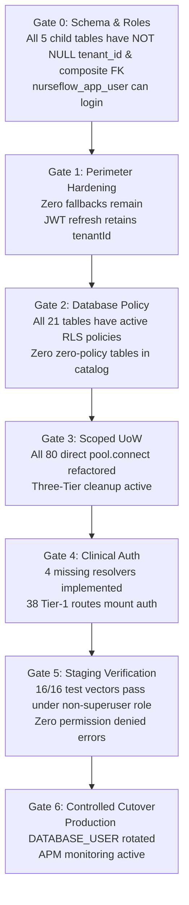

# P0-2B Wave 1A.7 — Implementation Acceptance Criteria & Qualification Gates

**Document Identifier:** `SEC-CRIT-P02B-W1A7-ACCEPTANCE-20260930`  
**Document Type:** Formal Acceptance Criteria & Staging Verification Gates  
**Author Roles:** Independent HIS Governance Reviewer, Principal Security Architect, Application Security Auditor  
**Date:** 2026-09-30  
**Repository:** `Mojo-Brothers/NurseFlow-WebApp`  
**Status Directive:** **DESIGN REVIEW ONLY | STRICTLY ZERO PRODUCTION CHANGES**  

---

## 1. Executive Summary

This document establishes the binding, non-negotiable **Acceptance Criteria and Verification Standards** required to transition NurseFlow from the current `BLOCKED` implementation state to `READY_FOR_IMPLEMENTATION_REVIEW`.

No pull request, database migration, or configuration change may be deemed complete unless it satisfies every objective metric defined herein.

---

## 2. Stage-by-Stage Qualification Gates (Stage 0 to Stage 6)

### 2.1 Stage 0 Acceptance Criteria: Schema & Role Foundation
1. **Parent Uniqueness:** `encounters` table possesses constraint `UNIQUE (id, tenant_id)` (`uq_encounters_id_tenant`).
2. **Child Table Schema:** All 5 child tables (`medication_emar_administrations`, `medication_dispense_allocations`, `longitudinal_care_plans`, `patient_split_invoices`, `physician_diagnostic_interpretations`):
   - Contain column `tenant_id uuid NOT NULL`.
   - Possess composite foreign key `FOREIGN KEY (encounter_id, tenant_id) REFERENCES encounters(id, tenant_id) ON DELETE RESTRICT`.
   - Possess performance index `(tenant_id, encounter_id)`.
   - Have `relrowsecurity = true` and `relforcerowsecurity = true`.
3. **Data Integrity:** `SELECT count(*) FROM <table> WHERE tenant_id IS NULL` returns exactly `0`.
4. **Database Roles:** `nurseflow_app_user` has `rolcanlogin = true`, `rolsuper = false`, `rolbypassrls = false`; `nurseflow_worker` exists.
- **Verification Evidence:** SQL introspection script output confirming zero NULLs and active constraints.

---

### 2.2 Stage 1 Acceptance Criteria: Application Perimeter Hardening
1. **Fallback Elimination:** Zero occurrences of `'tenant-default-001'` in `server/controllers/masterDataHub.controller.js`, `server/services/clinicalNotesApplication.service.js`, `server/services/cpoeApplication.service.js`, `server/services/medicationClosedLoop.service.js`, `server/services/triageApplication.service.js`.
2. **Boundary Enforcement:** `assertTenantIntegrity()` invoked before modifying or creating clinical notes, triage assessments, CPOE orders, and pharmacy dispensations.
3. **JWT Refresh Token:** Decoded payload of `refreshToken` contains `tenantId: <UUID>` matching the initial login campus.
4. **Token Rotation:** Rotating an expired access token produces a new token pair strictly maintaining `tenantId`.
- **Verification Evidence:** Static AST grep confirms zero fallbacks; automated integration test verifies 403 on tenant override.

---

### 2.3 Stage 2 Acceptance Criteria: Database RLS Policy Deployment
1. **Zero Zero-Policy Tables:** An automated audit of `pg_class` and `pg_policy` confirms that across the entire `public` schema, **exactly 0 tables have `relrowsecurity = true` with `policy_count = 0`**.
2. **Tailored Policies:** All 21 tables have active RLS policies bound to `nurseflow_app_user`.
3. **Privilege Grants:** `nurseflow_app_user` possesses `SELECT, INSERT, UPDATE, DELETE` on all 26 tables; sequences granted `USAGE, SELECT`.
4. **Outbox Worker Hardening:** `process_outbox_batch()` function is `SECURITY DEFINER`, `SET search_path = pg_catalog, public`, and revoked from `PUBLIC`.
- **Verification Evidence:** Live execution of `scratch/audit_rls_21_tables_live.js` showing `policy_count > 0` on all tables.

---

### 2.4 Stage 3 Acceptance Criteria: Scoped Unit-of-Work & Pool Interceptor
1. **Call Site Refactoring:** 100% of the 80 direct `pool.connect()` call-sites in repositories and services refactored to consume `uow.client`.
2. **Three-Tier Cleanup Verification:**
   - Unhandled exception triggers `ROLLBACK` within < 10ms.
   - Normal completion executes `RESET app.current_tenant_id; RESET app.current_user_id;`.
   - Socket error triggers `client.release(true)`.
3. **Parameterized Enforcement:** Zero raw multi-statement string queries in codebase.
- **Verification Evidence:** Unit test suite for `withUnitOfWork`; pool connection reuse test confirms zero residual GUC leakage.

---

### 2.5 Stage 4 Acceptance Criteria: Clinical Authorization & Route Mounting
1. **Resource Resolvers:** SQL queries implemented in `resourceAuthorization.service.js` for `SURGERY_CASE`, `BLOOD_UNIT`, `MEDICATION_ORDER`, `CLINICAL_NOTE`.
2. **Tier-1 Mounting:** All 38 Tier-1 routes mount `requireClinicalAuthorization(...)`.
3. **Break-The-Glass:** Requests with valid `X-Break-The-Glass: true` successfully create immutable audit records in `clinical_audit_events`.
- **Verification Evidence:** Route scanner confirms 38 of 38 routes mount middleware; 38 integration test suites pass.

---

### 2.6 Stage 5 Acceptance Criteria: Staging Non-Superuser Verification
1. **Runtime Role:** Application web server runs strictly with `DATABASE_USER=nurseflow_app_user`.
2. **Test Suite Execution:** All 16 security test vectors (TEST-01 to TEST-16) pass with 100% success rate.
3. **Zero Default-Deny Errors:** Zero occurrences of `ERROR: 42501` or unexpected 0-row returns on legitimate authorized requests.
4. **Pool Concurrency:** 50 concurrent virtual users across 5 tenants execute 10,000 transactions with zero deadlocks and zero cross-tenant contamination.
- **Verification Evidence:** Comprehensive test report artifact signed by Independent Review Board.

---

### 2.7 Stage 6 Acceptance Criteria: Controlled Production Cutover
1. **Pre-Cutover Backup:** Full physical WAL snapshot verified restorable.
2. **Secret Swap:** Production `DATABASE_USER` updated to `nurseflow_app_user`.
3. **Connection Purge:** Stale `postgres` superuser web connections terminated via `pg_terminate_backend`.
4. **Zero-Downtime Rollback Ready:** Rollback script `bin/rollback_to_superuser.sh` verified executable within < 60 seconds MTTR.
5. **Post-Cutover Telemetry:** 24-hour APM error rate on clinical routes remains < 0.01%.
- **Verification Evidence:** Production APM dashboard export and sign-off by CISO & Hospital Medical Director.

---

## 3. Mandatory Security Vector Acceptance Matrix (16 Vectors)

| Vector ID | Target Security Control | Required Input | Mandatory Pass Condition | Mandatory Fail Condition |
| :--- | :--- | :--- | :--- | :--- |
| **TEST-01** | Cross-Tenant Direct Access | Tenant B token queries Tenant A note | HTTP 403 / 404; 0 data in body | HTTP 200 or leaked data |
| **TEST-02** | Cross-Patient Tampering | Update care plan with mismatched patient | HTTP 400 Bad Request; aborted | Care plan re-linked |
| **TEST-03** | Unauthorized Role | Billing Clerk prescribes fentanyl narcotic | HTTP 403 Forbidden | HTTP 201 Created |
| **TEST-04** | Missing Tenant Context | `withUnitOfWork` called without tenantId | Throws `AUTHORITATIVE_TENANT_REQUIRED` | SQL executed |
| **TEST-05** | Revoked Membership | User with suspended campus membership | HTTP 403 Login Denied | Token issued |
| **TEST-06** | Refresh Tenant Continuity | Rotate 15m expired satellite campus token | New token contains satellite campus ID | Downgraded to default tenant |
| **TEST-07** | RLS Default-Deny Prevention | Non-superuser queries all 21 tables | Authorized queries return valid rows | ERROR 42501 or 0 rows returned |
| **TEST-08** | Child-Table BOLA | Direct PK read/update on child table across tenants | 0 rows returned / 0 rows updated | Row data returned or modified |
| **TEST-09** | Transaction Rollback | Exception thrown inside business logic | Complete rollback; 0 orphan rows | Rows persisted in DB |
| **TEST-10** | Savepoint Sub-Rollback | Error inside inner `withSavepoint` | Inner rolled back; outer committed | Outer aborted or inner persisted |
| **TEST-11** | Pool Session GUC Reset | Reused connection queried without set_config | Returns empty/null session GUC | Returns previous tenant ID |
| **TEST-12** | Connection Destruction | Injected socket error or rollback failure | Socket closed (`client.release(true)`) | Poisoned client reused |
| **TEST-13** | Concurrent Pool Stress | 50 concurrent clients across 5 tenants | 100% correct tenant data; 0 leaks | Any cross-tenant data leaked |
| **TEST-14** | Clinical BTG Override | Care-team external doctor with BTG header | Access granted; audit record logged | Access blocked or audit missing |
| **TEST-15** | Audit Event Immutability | `nurseflow_app_user` attempts UPDATE on audit | PostgreSQL ERROR 42501 (denied) | Audit modified or deleted |
| **TEST-16** | Idempotent Order Retries | Resend medication order with same key | Exactly 1 database row created | Duplicate order created |
