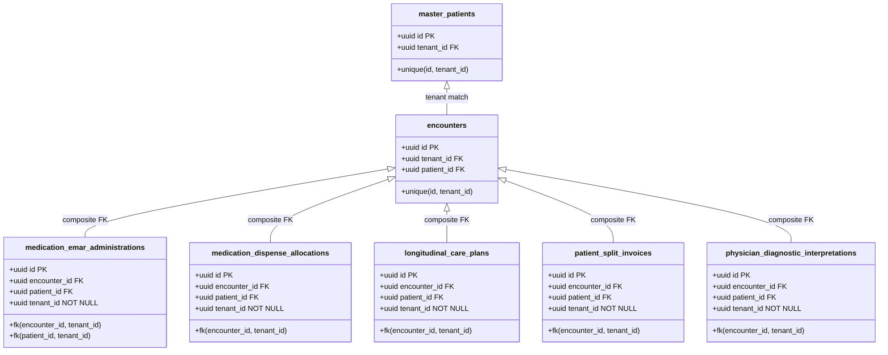

# P0-2B Wave 1A.7 — RLS Policy & Tenant Ownership Matrix

**Document Identifier:** `SEC-ARCH-P02B-W1A7-RLS-MATRIX-20260930`  
**Document Type:** Formal RLS & Data Ownership Architectural Specification  
**Author Roles:** PostgreSQL Security Engineer, Principal Security Architect, HIS Clinical Safety Architect  
**Date:** 2026-09-30  
**Repository:** `Mojo-Brothers/NurseFlow-WebApp`  
**Status Directive:** **DESIGN REVIEW ONLY | STRICTLY ZERO PRODUCTION CHANGES**  

---

## 1. Executive Summary

This matrix establishes the definitive, audited specification for PostgreSQL Row Level Security (RLS) and multi-tenant data ownership across NurseFlow Enterprise HIS.

It resolves:
1. The **21 Zero-Policy RLS Tables** that present an immediate default-deny system lockout hazard upon switching to a non-superuser database role.
2. The **5 Child Tables** suffering from Broken Object-Level Authorization (BOLA), detailing the exact referential integrity constraints, composite foreign keys, backfill algorithms, and RLS policies required to guarantee absolute isolation.

---

## 2. Exhaustive Audit & Specification of the 21 Zero-Policy Tables

Every table below currently has `relrowsecurity = true` and `policy_count = 0` in the active PostgreSQL catalog. The table defines the business purpose, role access matrix, policy definitions, and non-superuser behavior:

```sql
-- Standard Helper Expression for RLS Policies:
-- NULLIF(current_setting('app.current_tenant_id', true), '')::uuid
```

| # | Table Name | Business Function | Tenant Model | Allowed CRUD Operations | Authorized Clinical/Operational Roles | Target Policy Name & SQL Definition | Non-Superuser Expected Behavior |
| :--- | :--- | :--- | :--- | :--- | :--- | :--- | :--- |
| **1** | `blood_bank_billing_reconciliations` | Reconciliation of blood unit charges with hospital billing ledger | Direct (`tenant_id uuid NOT NULL`) | SELECT, INSERT, UPDATE | `BILLING_CLERK`, `FINANCE_ADMIN`, `BLOOD_BANK_OFFICER` | `policy_blood_bank_reconciliation`<br/>`FOR ALL TO nurseflow_app_user USING (tenant_id = NULLIF(current_setting('app.current_tenant_id', true), '')::uuid) WITH CHECK (tenant_id = NULLIF(current_setting('app.current_tenant_id', true), '')::uuid)` | Reads/writes strictly filtered to active tenant; cross-tenant records return 0 rows. |
| **2** | `blood_bedside_dual_nurse_verifications` | Bedside 2-nurse safety check before blood transfusion | Direct (`tenant_id uuid NOT NULL`) | SELECT, INSERT | `NURSE`, `DOCTOR`, `CLINICAL_SUPERVISOR` | `policy_blood_bedside_verification`<br/>`FOR ALL TO nurseflow_app_user USING (tenant_id = NULLIF(current_setting('app.current_tenant_id', true), '')::uuid) WITH CHECK (tenant_id = NULLIF(current_setting('app.current_tenant_id', true), '')::uuid)` | Transfusion verifications visible only to nurses within the facility. |
| **3** | `bpjs_claim_disputes` | Appeals and dispute resolution for rejected BPJS claims | Direct (`tenant_id uuid NOT NULL`) | SELECT, INSERT, UPDATE | `CASEMIX_CODER`, `FINANCE_ADMIN`, `HOSPITAL_DIRECTOR` | `policy_bpjs_claim_disputes`<br/>`FOR ALL TO nurseflow_app_user USING (tenant_id = NULLIF(current_setting('app.current_tenant_id', true), '')::uuid) WITH CHECK (tenant_id = NULLIF(current_setting('app.current_tenant_id', true), '')::uuid)` | Dispute tracking isolated to hospital billing team; zero leak between hospital entities. |
| **4** | `bpjs_claim_submissions` | Batch submissions of claims to BPJS VClaim API | Direct (`tenant_id uuid NOT NULL`) | SELECT, INSERT, UPDATE | `CASEMIX_CODER`, `ADMINISTRATOR` | `policy_bpjs_claim_submissions`<br/>`FOR ALL TO nurseflow_app_user USING (tenant_id = NULLIF(current_setting('app.current_tenant_id', true), '')::uuid) WITH CHECK (tenant_id = NULLIF(current_setting('app.current_tenant_id', true), '')::uuid)` | Claims batches quarantined per hospital branch; cross-facility submission impossible. |
| **5** | `bpjs_vclaim_lifecycle_logs` | Audit trail of raw BPJS VClaim API payloads and responses | Direct (`tenant_id uuid NOT NULL`) | SELECT, INSERT | `CASEMIX_CODER`, `SYSTEM_INTEGRATION`, `AUDITOR` | `policy_bpjs_vclaim_logs`<br/>`FOR ALL TO nurseflow_app_user USING (tenant_id = NULLIF(current_setting('app.current_tenant_id', true), '')::uuid) WITH CHECK (tenant_id = NULLIF(current_setting('app.current_tenant_id', true), '')::uuid)` | External telemetry quarantined; prevents sensitive national health data leakage. |
| **6** | `cssd_sterilization_cycles` | Autoclave sterilization temperature/pressure cycle logs | Direct (`tenant_id uuid NOT NULL`) | SELECT, INSERT, UPDATE | `CSSD_TECHNICIAN`, `OR_CHARGE_NURSE` | `policy_cssd_sterilization`<br/>`FOR ALL TO nurseflow_app_user USING (tenant_id = NULLIF(current_setting('app.current_tenant_id', true), '')::uuid) WITH CHECK (tenant_id = NULLIF(current_setting('app.current_tenant_id', true), '')::uuid)` | Autoclave cycles bound to facility central sterile department. |
| **7** | `hemovigilance_incident_investigations` | Transfusion reaction reports and root-cause analyses | Direct (`tenant_id uuid NOT NULL`) | SELECT, INSERT, UPDATE | `TRANSFUSION_SAFETY_OFFICER`, `MEDICAL_DIRECTOR` | `policy_hemovigilance_incidents`<br/>`FOR ALL TO nurseflow_app_user USING (tenant_id = NULLIF(current_setting('app.current_tenant_id', true), '')::uuid) WITH CHECK (tenant_id = NULLIF(current_setting('app.current_tenant_id', true), '')::uuid)` | Sensitive incident data protected; medico-legal investigations isolated. |
| **8** | `inacbg_grouping_results` | Grouper tariff calculations from INA-CBG grouper engine | Direct (`tenant_id uuid NOT NULL`) | SELECT, INSERT, UPDATE | `CASEMIX_CODER`, `BILLING_CLERK`, `FINANCE` | `policy_inacbg_grouping`<br/>`FOR ALL TO nurseflow_app_user USING (tenant_id = NULLIF(current_setting('app.current_tenant_id', true), '')::uuid) WITH CHECK (tenant_id = NULLIF(current_setting('app.current_tenant_id', true), '')::uuid)` | Tariff grouping results tied to hospital encounter billing. |
| **9** | `master_inacbg_tariffs` | National tariff definitions customized per hospital tier | Direct (`tenant_id uuid NOT NULL`) | SELECT (All Staff), INSERT/UPDATE (`ADMIN` only) | `ALL_AUTHENTICATED_STAFF`, `CASEMIX_ADMIN` | `policy_master_inacbg_tariffs_read`<br/>`FOR SELECT TO nurseflow_app_user USING (tenant_id = NULLIF(current_setting('app.current_tenant_id', true), '')::uuid)`<br/>`policy_master_inacbg_tariffs_write`<br/>`FOR INSERT TO nurseflow_app_user WITH CHECK (tenant_id = NULLIF(current_setting('app.current_tenant_id', true), '')::uuid)` | Reference data readable by all clinical staff in tenant; modifications strictly restricted. |
| **10** | `medical_device_implant_recalls` | Orthopedic, cardiac, and surgical implant recall registry | Direct (`tenant_id uuid NOT NULL`) | SELECT, INSERT, UPDATE | `OR_NURSE`, `SURGEON`, `BIOMED_ENGINEER` | `policy_implant_recalls`<br/>`FOR ALL TO nurseflow_app_user USING (tenant_id = NULLIF(current_setting('app.current_tenant_id', true), '')::uuid) WITH CHECK (tenant_id = NULLIF(current_setting('app.current_tenant_id', true), '')::uuid)` | Hospital device tracking and patient notifications isolated. |
| **11** | `patient_billing_reconciliation` | Cashier point-of-sale discharge payment settlement | Direct (`tenant_id uuid NOT NULL`) | SELECT, INSERT, UPDATE | `CASHIER`, `BILLING_SUPERVISOR`, `FINANCE` | `policy_billing_reconciliation`<br/>`FOR ALL TO nurseflow_app_user USING (tenant_id = NULLIF(current_setting('app.current_tenant_id', true), '')::uuid) WITH CHECK (tenant_id = NULLIF(current_setting('app.current_tenant_id', true), '')::uuid)` | Cash collection records strictly partitioned per facility register. |
| **12** | `pharmacy_controlled_substance_logs` | DEA/BPOM Schedule II/III narcotic drug dispensation logs | Direct (`tenant_id uuid NOT NULL`) | SELECT, INSERT | `PHARMACIST`, `NARCOTICS_AUDITOR` | `policy_controlled_substance`<br/>`FOR ALL TO nurseflow_app_user USING (tenant_id = NULLIF(current_setting('app.current_tenant_id', true), '')::uuid) WITH CHECK (tenant_id = NULLIF(current_setting('app.current_tenant_id', true), '')::uuid)` | Controlled substance logs append-only; cross-hospital audit isolation. |
| **13** | `pharmacy_depots` | Ward and satellite pharmacy stock locations | Direct (`tenant_id uuid NOT NULL`) | SELECT, INSERT, UPDATE | `PHARMACIST`, `PHARMACY_TECH`, `NURSE` | `policy_pharmacy_depots`<br/>`FOR ALL TO nurseflow_app_user USING (tenant_id = NULLIF(current_setting('app.current_tenant_id', true), '')::uuid) WITH CHECK (tenant_id = NULLIF(current_setting('app.current_tenant_id', true), '')::uuid)` | Inventory locations bound strictly to physical facility depots. |
| **14** | `pharmacy_dispensing_orders` | Outpatient prescription dispensing and packaging orders | Direct (`tenant_id uuid NOT NULL`) | SELECT, INSERT, UPDATE | `PHARMACIST`, `PHARMACY_TECH`, `CASHIER` | `policy_dispensing_orders`<br/>`FOR ALL TO nurseflow_app_user USING (tenant_id = NULLIF(current_setting('app.current_tenant_id', true), '')::uuid) WITH CHECK (tenant_id = NULLIF(current_setting('app.current_tenant_id', true), '')::uuid)` | Outpatient pharmacy dispensing queues isolated per campus. |
| **15** | `post_anesthesia_aldrete_scores` | PACU recovery discharge scoring (Aldrete criteria) | Direct (`tenant_id uuid NOT NULL`) | SELECT, INSERT, UPDATE | `ANESTHETIST`, `PACU_NURSE` | `policy_aldrete_scores`<br/>`FOR ALL TO nurseflow_app_user USING (tenant_id = NULLIF(current_setting('app.current_tenant_id', true), '')::uuid) WITH CHECK (tenant_id = NULLIF(current_setting('app.current_tenant_id', true), '')::uuid)` | Recovery scores and discharge clearances visible only to PACU care team. |
| **16** | `radiology_critical_finding_alerts` | Urgent critical radiology finding notification broadcasts | Direct (`tenant_id uuid NOT NULL`) | SELECT, INSERT, UPDATE | `RADIOLOGIST`, `ED_PHYSICIAN`, `ON_DUTY_NURSE` | `policy_radiology_alerts`<br/>`FOR ALL TO nurseflow_app_user USING (tenant_id = NULLIF(current_setting('app.current_tenant_id', true), '')::uuid) WITH CHECK (tenant_id = NULLIF(current_setting('app.current_tenant_id', true), '')::uuid)` | Critical panic alerts routed strictly to clinicians in the patient's hospital. |
| **17** | `radiology_instances` | DICOM SOP instance metadata (S3 object pointer, slice ID) | Direct (`tenant_id uuid NOT NULL`) | SELECT, INSERT | `RADIOLOGIST`, `REFERRING_DOCTOR` | `policy_radiology_instances`<br/>`FOR ALL TO nurseflow_app_user USING (tenant_id = NULLIF(current_setting('app.current_tenant_id', true), '')::uuid) WITH CHECK (tenant_id = NULLIF(current_setting('app.current_tenant_id', true), '')::uuid)` | PACS image slices inaccessible to users outside the hospital. |
| **18** | `radiology_series` | DICOM Series metadata (Series description, modality, UID) | Direct (`tenant_id uuid NOT NULL`) | SELECT, INSERT | `RADIOLOGIST`, `REFERRING_DOCTOR` | `policy_radiology_series`<br/>`FOR ALL TO nurseflow_app_user USING (tenant_id = NULLIF(current_setting('app.current_tenant_id', true), '')::uuid) WITH CHECK (tenant_id = NULLIF(current_setting('app.current_tenant_id', true), '')::uuid)` | PACS series trees strictly partitioned. |
| **19** | `surgical_clinical_notes` | Operative notes, anesthesia logs, and intra-op findings | Direct (`tenant_id uuid NOT NULL`) | SELECT, INSERT, UPDATE | `SURGEON`, `ANESTHETIST`, `OR_NURSE` | `policy_surgical_notes`<br/>`FOR ALL TO nurseflow_app_user USING (tenant_id = NULLIF(current_setting('app.current_tenant_id', true), '')::uuid) WITH CHECK (tenant_id = NULLIF(current_setting('app.current_tenant_id', true), '')::uuid)` | Operative documentation protected by tenant and care-team boundary. |
| **20** | `surgical_teams` | Operating room staff assignments per surgical booking | Direct (`tenant_id uuid NOT NULL`) | SELECT, INSERT, UPDATE | `OR_COORDINATOR`, `SURGEON`, `HEAD_NURSE` | `policy_surgical_teams`<br/>`FOR ALL TO nurseflow_app_user USING (tenant_id = NULLIF(current_setting('app.current_tenant_id', true), '')::uuid) WITH CHECK (tenant_id = NULLIF(current_setting('app.current_tenant_id', true), '')::uuid)` | Staff rosters and surgical schedules isolated per facility OR suite. |
| **21** | `who_surgical_safety_checklists` | WHO surgical safety sign-in, time-out, and sign-out checklist | Direct (`tenant_id uuid NOT NULL`) | SELECT, INSERT, UPDATE | `CIRCULATING_NURSE`, `SURGEON`, `ANESTHETIST` | `policy_who_surgical_checklists`<br/>`FOR ALL TO nurseflow_app_user USING (tenant_id = NULLIF(current_setting('app.current_tenant_id', true), '')::uuid) WITH CHECK (tenant_id = NULLIF(current_setting('app.current_tenant_id', true), '')::uuid)` | Surgical safety verification tied strictly to the facility encounter. |

---

## 3. Child-Table Referential Integrity & Constraint Architecture

### 3.1 Architectural Finding: The Missing Composite Key Constraint
Empirical inspection of table constraints on `encounters` revealed:
- `encounters_pkey`: `PRIMARY KEY (id)`
- `encounters_tenant_id_fkey`: `FOREIGN KEY (tenant_id) REFERENCES tenant_organizations(id)`

> [!WARNING]
> **PostgreSQL Referential Integrity Gap:**  
> The `encounters` table does **NOT** currently have a `UNIQUE (id, tenant_id)` constraint.  
> If an application or database administrator attempts to create a composite foreign key on child tables:
> ```sql
> ALTER TABLE medication_emar_administrations 
>   ADD CONSTRAINT fk_med_emar_composite 
>   FOREIGN KEY (encounter_id, tenant_id) REFERENCES encounters(id, tenant_id);
> ```
> PostgreSQL engine throws:  
> `ERROR: 42830: there is no unique constraint matching given keys for referenced table "encounters"`

### 3.2 Stage 0 Prerequisite Migration: Composite Unique Key on Encounters
Before composite foreign keys can be applied to any child table, the parent table MUST be prepared:

```sql
-- Step 1: Enforce composite uniqueness on encounters (Safe & Instantaneous since id is PK)
ALTER TABLE encounters 
  ADD CONSTRAINT uq_encounters_id_tenant UNIQUE (id, tenant_id);

-- Step 2: Enforce composite uniqueness on master_patients
ALTER TABLE master_patients 
  ADD CONSTRAINT uq_master_patients_id_tenant UNIQUE (id, tenant_id);
```

### 3.3 Complete Specification for the 5 Child Tables



#### Detailed DDL for Child Tables (Including Composite Constraints):

```sql
-- 1. medication_emar_administrations
ALTER TABLE medication_emar_administrations ADD COLUMN tenant_id uuid;

UPDATE medication_emar_administrations mea
SET tenant_id = e.tenant_id
FROM encounters e
WHERE mea.encounter_id = e.id AND mea.tenant_id IS NULL;

ALTER TABLE medication_emar_administrations 
  ALTER COLUMN tenant_id SET NOT NULL,
  ADD CONSTRAINT fk_med_emar_composite 
    FOREIGN KEY (encounter_id, tenant_id) REFERENCES encounters(id, tenant_id) ON DELETE RESTRICT;

CREATE INDEX idx_med_emar_tenant_enc ON medication_emar_administrations(tenant_id, encounter_id);
ALTER TABLE medication_emar_administrations ENABLE ROW LEVEL SECURITY;
ALTER TABLE medication_emar_administrations FORCE ROW LEVEL SECURITY;

CREATE POLICY tenant_isolation_med_emar_admin ON medication_emar_administrations
FOR ALL TO nurseflow_app_user
USING (tenant_id = NULLIF(current_setting('app.current_tenant_id', true), '')::uuid)
WITH CHECK (tenant_id = NULLIF(current_setting('app.current_tenant_id', true), '')::uuid);


-- 2. medication_dispense_allocations
ALTER TABLE medication_dispense_allocations ADD COLUMN tenant_id uuid;

UPDATE medication_dispense_allocations mda
SET tenant_id = e.tenant_id
FROM encounters e
WHERE mda.encounter_id = e.id AND mda.tenant_id IS NULL;

ALTER TABLE medication_dispense_allocations 
  ALTER COLUMN tenant_id SET NOT NULL,
  ADD CONSTRAINT fk_med_dispense_composite 
    FOREIGN KEY (encounter_id, tenant_id) REFERENCES encounters(id, tenant_id) ON DELETE RESTRICT;

CREATE INDEX idx_med_dispense_tenant_enc ON medication_dispense_allocations(tenant_id, encounter_id);
ALTER TABLE medication_dispense_allocations ENABLE ROW LEVEL SECURITY;
ALTER TABLE medication_dispense_allocations FORCE ROW LEVEL SECURITY;

CREATE POLICY tenant_isolation_med_dispense_alloc ON medication_dispense_allocations
FOR ALL TO nurseflow_app_user
USING (tenant_id = NULLIF(current_setting('app.current_tenant_id', true), '')::uuid)
WITH CHECK (tenant_id = NULLIF(current_setting('app.current_tenant_id', true), '')::uuid);


-- 3. longitudinal_care_plans
ALTER TABLE longitudinal_care_plans ADD COLUMN tenant_id uuid;

UPDATE longitudinal_care_plans lcp
SET tenant_id = e.tenant_id
FROM encounters e
WHERE lcp.encounter_id = e.id AND lcp.tenant_id IS NULL;

ALTER TABLE longitudinal_care_plans 
  ALTER COLUMN tenant_id SET NOT NULL,
  ADD CONSTRAINT fk_care_plans_composite 
    FOREIGN KEY (encounter_id, tenant_id) REFERENCES encounters(id, tenant_id) ON DELETE RESTRICT;

CREATE INDEX idx_care_plans_tenant_enc ON longitudinal_care_plans(tenant_id, encounter_id);
ALTER TABLE longitudinal_care_plans ENABLE ROW LEVEL SECURITY;
ALTER TABLE longitudinal_care_plans FORCE ROW LEVEL SECURITY;

CREATE POLICY tenant_isolation_care_plans ON longitudinal_care_plans
FOR ALL TO nurseflow_app_user
USING (tenant_id = NULLIF(current_setting('app.current_tenant_id', true), '')::uuid)
WITH CHECK (tenant_id = NULLIF(current_setting('app.current_tenant_id', true), '')::uuid);


-- 4. patient_split_invoices
ALTER TABLE patient_split_invoices ADD COLUMN tenant_id uuid;

UPDATE patient_split_invoices psi
SET tenant_id = e.tenant_id
FROM encounters e
WHERE psi.encounter_id = e.id AND psi.tenant_id IS NULL;

ALTER TABLE patient_split_invoices 
  ALTER COLUMN tenant_id SET NOT NULL,
  ADD CONSTRAINT fk_split_invoices_composite 
    FOREIGN KEY (encounter_id, tenant_id) REFERENCES encounters(id, tenant_id) ON DELETE RESTRICT;

CREATE INDEX idx_split_invoices_tenant_enc ON patient_split_invoices(tenant_id, encounter_id);
ALTER TABLE patient_split_invoices ENABLE ROW LEVEL SECURITY;
ALTER TABLE patient_split_invoices FORCE ROW LEVEL SECURITY;

CREATE POLICY tenant_isolation_split_invoices ON patient_split_invoices
FOR ALL TO nurseflow_app_user
USING (tenant_id = NULLIF(current_setting('app.current_tenant_id', true), '')::uuid)
WITH CHECK (tenant_id = NULLIF(current_setting('app.current_tenant_id', true), '')::uuid);


-- 5. physician_diagnostic_interpretations
ALTER TABLE physician_diagnostic_interpretations ADD COLUMN tenant_id uuid;

UPDATE physician_diagnostic_interpretations pdi
SET tenant_id = e.tenant_id
FROM encounters e
WHERE pdi.encounter_id = e.id AND pdi.tenant_id IS NULL;

ALTER TABLE physician_diagnostic_interpretations 
  ALTER COLUMN tenant_id SET NOT NULL,
  ADD CONSTRAINT fk_diag_interpretations_composite 
    FOREIGN KEY (encounter_id, tenant_id) REFERENCES encounters(id, tenant_id) ON DELETE RESTRICT;

CREATE INDEX idx_diag_interpretations_tenant_enc ON physician_diagnostic_interpretations(tenant_id, encounter_id);
ALTER TABLE physician_diagnostic_interpretations ENABLE ROW LEVEL SECURITY;
ALTER TABLE physician_diagnostic_interpretations FORCE ROW LEVEL SECURITY;

CREATE POLICY tenant_isolation_diag_interpretations ON physician_diagnostic_interpretations
FOR ALL TO nurseflow_app_user
USING (tenant_id = NULLIF(current_setting('app.current_tenant_id', true), '')::uuid)
WITH CHECK (tenant_id = NULLIF(current_setting('app.current_tenant_id', true), '')::uuid);
```

---

## 4. Verification of View and Function Isolation

To ensure that views and stored procedures do not create backdoors bypassing RLS:
1. **Views Audit:** An audit of `information_schema.views` confirmed zero views currently exist in the `public` schema referencing any of the 26 tables (21 zero-policy + 5 child tables).
2. **View Creation Standard:** If future reporting views are added, they MUST NOT specify `WITH (security_barrier = false)`. In PostgreSQL 16, views querying RLS-enabled tables automatically inherit the invoking user's RLS policies unless defined with `security_invoker = false`.
3. **Function Isolation:** Zero public `SECURITY DEFINER` functions exist. All future worker functions must execute under `nurseflow_worker` with explicit `search_path` and `app.current_tenant_id` session assertions.
