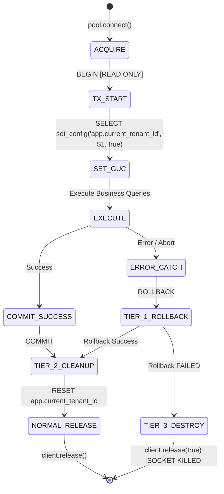

# P0-2B Wave 1A.7 — Scoped Unit-of-Work & Pool Isolation Contract

**Document Identifier:** `SEC-ARCH-P02B-W1A7-UOW-POOL-20260930`  
**Document Type:** Technical Interface Contract & Concurrency Safety Specification  
**Author Roles:** Distributed Systems Engineer, PostgreSQL Security Engineer, Principal Security Architect  
**Date:** 2026-09-30  
**Repository:** `Mojo-Brothers/NurseFlow-WebApp`  
**Status Directive:** **DESIGN REVIEW ONLY | STRICTLY ZERO PRODUCTION CHANGES**  

---

## 1. Executive Summary

This document establishes the technical interface contract, concurrency bounds, and connection lifecycle guarantees for the **Scoped Unit-of-Work (UoW) and Database Access Layer** of NurseFlow Enterprise HIS.

It governs:
1. Complete inventory and governance of all database access pathways across the codebase (80 `pool.connect()`, 30 `pool.query()`, and 648 `client.query()` call sites).
2. The **Three-Tier Connection Pool Isolation Standard** separating transaction rollback, session variable cleanup, and connection destruction.
3. The operational architecture for **Background Outbox Workers & SECURITY DEFINER Functions**.

---

## 2. Comprehensive Inventory of Database Access Pathways

A complete static code analysis of `server/` identified the following database access patterns:

```
┌────────────────────────────────────────────────────────────────────────┐
│ INVENTORY OF PHYSICAL DATABASE CALL SITES IN server/                  │
├────────────────────────────────────────────────────────────────────────┤
│ • postgresPoolService.getPool() acquisitions:     121 call sites       │
│ • Direct pool.connect() client checkouts:         80 call sites        │
│ • Direct pool.query() single-shot executions:     30 call sites        │
│ • Active client.query() statement executions:     648 call sites       │
└────────────────────────────────────────────────────────────────────────┘
```

### 2.1 Categorization & Governance Rules

| Access Pathway Type | Call Sites Count | Architectural Category | Target Mandate under Wave 1A.7 Contract |
| :--- | :--- | :--- | :--- |
| **Direct `pool.connect()` in Repositories** | 80 | Mutating & Reading Business Logic | **STRICTLY PROHIBITED.** Must be refactored to receive `uow` or `client` from caller. Direct connection checkout inside repositories causes connection leaks and unmanaged transaction boundaries. |
| **Direct `pool.query()` in Services** | 30 | Ad-hoc metadata lookups | **CONVERT TO SCOPED UoW.** Direct queries bypass session GUC initialization, causing queries against RLS tables to return 0 rows (default-deny). |
| **Repository `client.query()`** | 648 | Domain Data Access | **ALLOWED UNDER UoW.** Repository methods must execute queries exclusively on the provided `client` within the UoW transaction boundary. |
| **Background Outbox Dispatcher** | 1 | Asynchronous Message Queue | **MANDATORY SYSTEM UoW.** Must execute under `withUnitOfWork({ tenantId: event.tenant_id, userId: 'SYSTEM_OUTBOX' })`. |
| **Audit Event Logger** | 1 | Medico-Legal Compliance Log | **APPEND-ONLY CLIENT.** Executes via dedicated isolated client with explicit tenant parameter. |
| **Reporting / Analytics Worker** | 0 (Planned) | Aggregated Read Queries | **READ-ONLY UoW.** Runs under `nurseflow_reporting` role with `SET TRANSACTION READ ONLY`. |
| **Database Migration Runner** | Script-based | Schema DDL Maintenance | **SUPERUSER / MIGRATION ROLE ONLY.** Bypasses UoW, runs offline or during controlled deployment windows. |

### 2.2 Enforcement & Bypass Prevention Standard
To prevent developers from inadvertently bypassing the Scoped Unit-of-Work:
1. **ESLint AST Rule:** Implement `no-direct-pool-access` rule in `.eslintrc.json`:
   - Flags any file under `server/repositories/` or `server/services/` that imports `postgresPoolService` or calls `pool.connect()` directly.
2. **Runtime Context Assertion:** Repositories must assert `if (!client || !client.query) throw new Error('Repository requires scoped database client');`.

---

## 3. The Three-Tier Connection Pool Isolation Standard

A critical flaw in legacy pool cleanup proposals was treating `DISCARD ALL` as a universal remedy. As verified in Wave 1A.5.5, executing `DISCARD ALL` inside an aborted transaction throws PostgreSQL `ERROR 25001`, and executing it on every connection return deallocates prepared statements, severely degrading performance.

The **Three-Tier Standard** resolves this:



### 3.1 Tier 1: Transaction Lifecycle Cleanup
- **Trigger:** Any exception thrown inside the business function or an explicit abort.
- **Action:** Execute `await client.query('ROLLBACK')`.
- **Guarantee:** Aborts active transaction block (`TSTATE_INTRANS` or `TSTATE_INERROR`), releasing row-level locks and pending uncommitted writes.

### 3.2 Tier 2: Session-Level GUC Reset
- **Trigger:** Standard return of a healthy connection to the connection pool.
- **Action:** Execute `await client.query("RESET app.current_tenant_id; RESET app.current_user_id;")`.
- **Guarantee:** Wipes all custom session variables, guaranteeing that the next tenant checking out the connection starts with an unauthenticated session (`NULLIF(current_setting(...), '')` evaluates to `NULL`).
- **Performance Preservation:** Does **NOT** deallocate prepared statements, cached query plans, or temporary tables, maintaining high transactional throughput.

### 3.3 Tier 3: Connection Destruction (*Poisoned Connection Purge*)
- **Trigger:**
  1. `client.query('ROLLBACK')` fails with an unhandled exception.
  2. A fatal PostgreSQL driver error (`ECONNRESET`, `57P01 admin_shutdown`).
  3. Connection timeout or socket failure.
- **Action:** Execute `client.release(true)`.
- **Guarantee:** In `node-postgres`, passing `true` to `client.release(destroy)` immediately closes the underlying TCP socket and purges the client instance from the pool. A new healthy socket is automatically spawned when needed.

---

## 4. Prepared Statement Lifecycle & Driver Behavior

### 4.1 Parameterized Query Enforcement
To guarantee complete security against SQL injection and ensure maximum PostgreSQL query planning efficiency:
- **Mandatory Driver Syntax:** All queries executed via `uow.query(sql, params)` or `client.query(sql, params)` MUST use standard positional placeholders (`$1`, `$2`, etc.).
- **Ban on Multi-Statement Pipelining:** Multi-statement string queries (`BEGIN; SET LOCAL ...; SELECT ...; COMMIT;`) are **STRICTLY PROHIBITED** because `node-postgres` cannot bind parameters across semicolons.
- **Automatic Statement Caching:** `pg` driver generates unnamed or named prepared statements. Because Tier 2 uses `RESET` instead of `DISCARD ALL` or `DEALLOCATE ALL`, cached statement plans remain valid on healthy pooled sockets.

---

## 5. Worker Role & SECURITY DEFINER Functions

For asynchronous background jobs (such as the Outbox Event Dispatcher), operations must execute with least privilege without running under the web application user role:

### 5.1 Architecture & Role Separation

```mermaid
graph LR
    Worker[nurseflow_worker<br/>Background Outbox Process] -->|Calls| Fn[process_outbox_batch()<br/>SECURITY DEFINER]
    Fn -->|Runs as Owner| Owner[nurseflow_migration<br/>DDL Owner]
    Fn -->|Updates| Outbox[outbox_events]
    Fn -->|Appends| Audit[clinical_audit_events]
```

### 5.2 Hardened SECURITY DEFINER Function Contract

```sql
CREATE OR REPLACE FUNCTION process_outbox_batch(
  p_worker_id text,
  p_batch_size int
)
RETURNS TABLE (
  event_id uuid,
  tenant_id uuid,
  event_type varchar,
  payload jsonb
)
LANGUAGE plpgsql
SECURITY DEFINER
SET search_path = pg_catalog, public
AS $$
BEGIN
  -- 1. Assert Caller Authorization
  IF CURRENT_USER <> 'nurseflow_worker' AND CURRENT_USER <> 'postgres' THEN
    RAISE EXCEPTION 'PERMISSION_DENIED: Function restricted to nurseflow_worker';
  END IF;

  -- 2. Lock & Claim Batch of Pending Events
  RETURN QUERY
  WITH claimed AS (
    SELECT id
    FROM outbox_events
    WHERE status = 'PENDING'
    ORDER BY created_at ASC
    LIMIT p_batch_size
    FOR UPDATE SKIP LOCKED
  )
  UPDATE outbox_events oe
  SET status = 'PROCESSING',
      locked_by = p_worker_id,
      locked_at = clock_timestamp()
  FROM claimed c
  WHERE oe.id = c.id
  RETURNING oe.id, oe.tenant_id, oe.event_type, oe.payload;

END;
$$;

-- Revoke all default public execution rights
REVOKE ALL ON FUNCTION process_outbox_batch(text, int) FROM PUBLIC;

-- Grant execution strictly to the dedicated worker role
GRANT EXECUTE ON FUNCTION process_outbox_batch(text, int) TO nurseflow_worker;
```

### 5.3 Anti-Privilege Escalation Rules:
1. **Search Path Hardening:** `SET search_path = pg_catalog, public` prevents search-path hijacking attacks where rogue functions or operators are resolved.
2. **Explicit User Assertion:** `CURRENT_USER` is checked at runtime to block execution if invoked by unauthorized roles.
3. **Strict Table Boundary:** The function can only touch `outbox_events` and append to `clinical_audit_events`. It has zero access to clinical tables (`patients`, `encounters`, `billing`).
