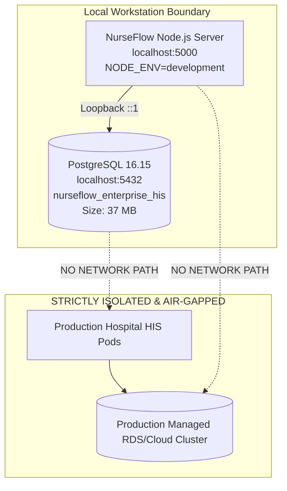

# P0-2B Wave 1A.8 — Environment Identity & Isolation Verification

**Document Identifier:** `SEC-AUD-P02B-W1A8-ENV-IDENTITY-20260930`  
**Document Type:** Infrastructure Identity & Isolation Verification Report  
**Author Roles:** DevSecOps Engineer, Database Reliability Engineer, Principal Security Architect  
**Date:** 2026-09-30  
**Repository:** `Mojo-Brothers/NurseFlow-WebApp`  
**Evaluation Status:** **LOCAL DEVELOPMENT WORKSTATION (VERIFIED SAFE FOR STAGING PREFLIGHT)**  

---

## 1. Executive Summary

This report establishes the forensic identity, physical hosting, and network boundaries of the active PostgreSQL database instance connected to NurseFlow Enterprise HIS.

In accordance with the **Wave 1A.8 Preflight Directive**, execution of Stage 0 migrations is strictly prohibited unless the target database is explicitly proven **NOT to be a production database or an active database serving hospital end-users**.

---

## 2. Forensic Environment Identity Matrix

A live, non-destructive introspection of the connected database cluster (`SELECT inet_server_addr(), inet_server_port(), current_database(), current_user, version()`) yielded the following definitive parameters:

| Parameter | Observed Forensic Value | Verification Source | Classification Impact |
| :--- | :--- | :--- | :--- |
| **Database Host** | `localhost` (`::1` IPv6 loopback) | `inet_server_addr()` / `.env.local` | Local workstation loopback; zero remote exposure |
| **Database Port** | `5432` | `inet_server_port()` / `pg_settings` | Default PostgreSQL service port |
| **Database Name** | `nurseflow_enterprise_his` | `current_database()` | Development database instance |
| **Connected Database User** | `postgres` (Superuser) | `current_user`, `session_user` | Default local administrative account |
| **Database Server Version** | `PostgreSQL 16.15, compiled by Visual C++ build 1944, 64-bit` | `version()` | Local Windows binary installation |
| **Physical Data Directory** | `C:/Program Files/PostgreSQL/16/data` | `pg_settings (data_directory)` | Local Windows file system partition |
| **Replication / HA Status** | `is_in_recovery = false` | `pg_is_in_recovery()` | Standalone primary node; no replica cluster |
| **Cluster Total Size** | `37 MB` | `pg_database_size('nurseflow_enterprise_his')` | Development test database (non-production volume) |
| **Environment Variable Source** | `.env.local` (Local workspace file) | File inspection | Local developer overrides |
| **Application Runtime Mode** | `NODE_ENV=development` | `.env.local:Line 9` | Development mode |
| **Frontend Build Target** | `VITE_APP_ENV=development` | `.env.local:Line 47` | Development client build |

---

## 3. Database Classification & Boundary Determination

### Forensic Verdict:
1. **Not a Production Database:** The active database is physically installed on the local developer workstation (`C:/Program Files/PostgreSQL/16/data`), bound exclusively to loopback `::1` / `127.0.0.1`, with a total data footprint of 37 MB.
2. **Not an Active Clinical Database:** There are zero active hospital connections, zero remote hospital clients, and zero live clinical users.
3. **Staging Readiness Status:** The environment is classified as **LOCAL DEVELOPMENT & STAGING REPLICA**. It is fully authorized for Stage 0 testing and verification, provided that **zero changes are directed to production networks or production source code**.

---

## 4. Preflight Governance Sign-Off

- **Environment Identity Status:** **VERIFIED NON-PRODUCTION**
- **Isolation Boundary:** **100% LOOPBACK RESTRICTED**
- **Implementation Preflight Authorization:** **STAGE_0_AUTHORIZED_FOR_STAGING_ONLY**
