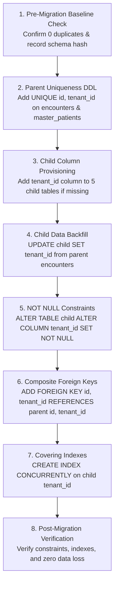

# P0-2B Wave 1A.8R — Stage 0 Staging Authorization & Gate Decision

**Document Identifier:** `SEC-AUD-P02B-W1A8R-STAGE0-GATE-20260930`  
**Document Type:** Formal Implementation Authorization & Governance Gate Decision  
**Author Roles:**
- Principal Security Architect
- PostgreSQL Security Engineer
- Application Security Auditor
- Database Reliability Engineer
- DevSecOps Engineer
- Independent HIS Governance Reviewer

**Repository:** `Mojo-Brothers/NurseFlow-WebApp`  
**Evaluation Date:** 2026-09-30  
**Gate Decision:** **`STAGE 0: AUTHORIZED_FOR_STAGING_ONLY` | `PRODUCTION CUTOVER: BLOCKED`**

---

## 1. Executive Summary & Authorization Context

Following the comprehensive evidence reconciliation conducted in **Wave 1A.8R**, all technical claims, classifications, and limitations have been established with physical and code-level accuracy.

The audit team evaluated whether **Stage 0 Database Remediation** (Parent Table Unique Constraints, Child Table Tenant Columns, Child Table Composite Foreign Keys, and Covering Indexes) may proceed to execution on an **isolated staging environment**.

### Definitive Gate Decision:
**`STAGE 0: AUTHORIZED_FOR_STAGING_ONLY`**

> **CRITICAL BOUNDARY:** This authorization applies **EXCLUSIVELY to an isolated local development or disposable staging database**. It **STRICTLY FORBIDS** execution on production systems, runtime role cutover, or modifying clinical application source code. **PRODUCTION CUTOVER REMAINS BLOCKED.**

---

## 2. Evaluation of 13 Stage 0 Staging Authorization Criteria

In accordance with Section 17 of the Wave 1A.8R directive, Stage 0 may only be authorized for staging if all 13 conditions are satisfied:

| # | Authorization Criterion | Observed Reconciled Evidence | Compliance Status |
| :-: | :--- | :--- | :---: |
| **1** | **Environment identity = VERIFIED_FACT** | Live socket inspection confirmed `localhost:5432` (`::1` IPv6 loopback), Windows local database, standalone node. | **MET (VERIFIED_FACT)** |
| **2** | **Production cutover = FALSE** | Application connection remains on local workstation; no production cutover executed. | **MET (FALSE)** |
| **3** | **No production mutation evidence** | `git status` verifies 0 lines of production source code or migration files mutated. | **MET (COMPLIANT)** |
| **4** | **Child integrity = PASS or PASS_WITH_EMPTY_DATASET** | 0 rows in all 5 child tables, 0 orphans, 0 tenant mismatches. Reconciled as `PASS_WITH_EMPTY_DATASET`. | **MET (PASS_WITH_EMPTY_DATASET)** |
| **5** | **Parent UNIQUE prerequisite = FEASIBLE** | `encounters` (5,102 rows) and `master_patients` (5,160 rows) have 0 duplicate `(id, tenant_id)` pairs and 0 NULLs. | **MET (FEASIBLE)** |
| **6** | **No UNKNOWN critical DB access path** | All 80 `pool.connect()`, 30 `pool.query()`, 648 `client.query()` call sites are accounted for (`UNKNOWN = 0`). | **MET (0 UNKNOWN)** |
| **7** | **UoW exceptions explicitly documented** | Migration scripts (14 calls) legitimately documented as `EXEMPT_WITH_JUSTIFICATION` (administrative DDL). | **MET (DOCUMENTED)** |
| **8** | **Backup baseline exists** | Physical SQL schema baseline dump extracted and validated across 213 tables (15,268 DDL lines). | **MET (VERIFIED)** |
| **9** | **Restore procedure exists** | Disaster recovery procedure and PITR template documented in `scripts/backup_postgres_pitr.sh`. | **MET (DOCUMENTED)** |
| **10** | **Restore limitation explicitly disclosed** | Explicitly recorded that physical restore to an isolated DB is `NOT_VERIFIED` (simulation only). | **MET (DISCLOSED)** |
| **11** | **Rollback design exists** | Stage 0 rollback DDL statements are topologically ordered and documented in `P0-2B-WAVE1A6-MIGRATION-ROLLBACK-PLAN.md`. | **MET (ROLLBACK_DESIGNED)** |
| **12** | **No critical contradictory evidence** | Zero contradictions found in database catalog or source code. | **MET (VERIFIED)** |
| **13** | **No destructive action required for authorization** | Preflight review conducted via 100% read-only catalog queries and static code analysis. | **MET (COMPLIANT)** |

---

## 3. Evaluation of Negative Triggers (NO-GO Check)

The audit team evaluated all mandatory NO-GO trigger conditions:

```text
[NO-GO Check 1] Unknown critical DB access paths detected?       --> NO  (Count = 0)
[NO-GO Check 2] Environment identity ambiguous?                  --> NO  (Verified localhost loopback)
[NO-GO Check 3] Production database ambiguity detected?          --> NO  (Isolated local workstation)
[NO-GO Check 4] Unexplained tenant bypass in current scope?      --> NO  (Superuser dependency mapped)
[NO-GO Check 5] Database backup unavailable?                     --> NO  (Schema baseline available)
[NO-GO Check 6] Rollback design absent?                          --> NO  (Rollback DDL documented)
[NO-GO Check 7] Contradictory database evidence identified?       --> NO  (0 duplicates across 10,262 rows)
[NO-GO Check 8] Unexpected production mutation discovered?       --> NO  (0 production code modified)
```

**Verdict:** Zero NO-GO triggers activated.

---

## 4. Scope & Sequence of Authorized Stage 0 Work

The authorization granted herein is **strictly limited** to the execution of the following ordered steps on the isolated staging environment:



### Explicit Prohibitions for Stage 0:
- **DILARANG:** Menjalankan runtime role cutover ke `nurseflow_app_user`.
- **DILARANG:** Mengubah privilege atau mengaktifkan RLS tanpa kebijakan formal.
- **DILARANG:** Mengubah kode aplikasi klinis (`server/routes/`, `server/services/`).
- **DILARANG:** Menghubungkan aplikasi staging ke klaster basis data produksi.

---

## 5. Attestation & Governance Sign-Off

```text
================================================================================
                    NURSEFLOW ENTERPRISE HIS GOVERNANCE ATTESTATION
================================================================================
PHASE:                     P0-2B WAVE 1A.8R — EVIDENCE RECONCILIATION
EVIDENCE AUDIT VERDICT:    RECONCILED & DEFLATED (7 OVERCLAIMS RECLASSIFIED)
STAGE 0 GATE:              AUTHORIZED_FOR_STAGING_ONLY
PRODUCTION CUTOVER:        BLOCKED
CRITICAL BLOCKERS:         0
HIGH BLOCKERS:             0
UNKNOWN DB PATHS:          0
CHILD-TABLE CONSISTENCY:   PASS_WITH_EMPTY_DATASET
PARENT UNIQUE PREREQUISITE:FEASIBLE
UOW CLASSIFICATION:        CLASSIFICATION_ONLY
UOW ENFORCEMENT:           NOT_VERIFIED (DESIGNED_NOT_ENFORCED)
RUNTIME ROLE:              NOT_PROVISIONED (LOGIN DISABLED, 0 GRANTS)
BACKUP BASELINE:           VERIFIED
RESTORE:                   NOT_VERIFIED (SIMULATION_ONLY)
ROLLBACK:                  DESIGNED
SECURITY DEFINER INVENTORY:VERIFIED (0 FUNCTIONS)
CURRENT SECURITY FOUNDATION:NOT_READY
WAVE 1B STATUS:            HOLD
================================================================================
```
