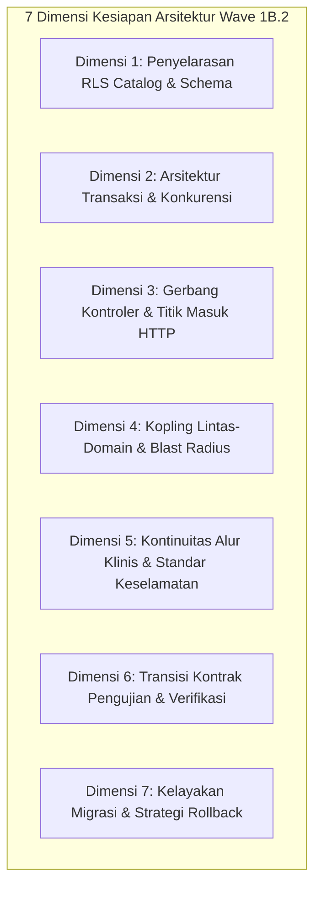

# P0-2B — WAVE 1B.2 ARCHITECTURE DECISION READINESS REVIEW
## Deep-Dive Technical, Transactional, and Security Readiness Evidence Across Candidate Domains

---

## 1. GOVERNANCE METADATA & REPOSITORY BASELINE

| Parameter | Nilai Otoritatif Repository | Sumber Bukti |
|---|---|---|
| **Document ID** | `DOC-AUDIT-P02B-WAVE1B2-ARCH-READINESS-REVIEW-20261003` | Standar Tata Kelola HIS NurseFlow |
| **Audit Date** | `2026-10-03` | System Timestamp |
| **Repository** | `Mojo-Brothers/NurseFlow-WebApp` | Git Remote Origin |
| **Branch** | `feature/security-foundation-wave1a10` | `git branch --show-current` |
| **Base Commit** | `4efa9368d4d73aa7d27e2a9b2ae8b1b22e118944` | `git rev-parse HEAD` |
| **Audit Mode** | **READ-ONLY AUDIT (NO IMPLEMENTATION)** | Mandat Audit P0-2B |
| **Production Code Changes** | **0 lines (0 files modified)** | `git status --short` |
| **Migration Changes** | **0 lines (0 files modified)** | `git diff --stat database/migrations/` |
| **Schema Changes** | **0 lines (0 files modified)** | `git diff --stat database/schema/` |
| **Test Suite Changes** | **0 lines (0 files modified)** | `git diff --stat tests/` |
| **Stage-0 Gate** | **NO-GO** (Frozen pending Wave 1B.2 selection) | Baseline Tata Kelola |
| **Production Deployment** | **BLOCKED** | Default-Deny Architecture |
| **Canonical Pilot Regression** | **81/81 PASS (100% Clean)** | 6 Canonical Test Suites |
| **Wave 1B.2 Implementation** | **NOT STARTED** | Hard Stop Protocol |

---

## 2. BASELINE DISCREPANCY RECONCILIATION

Berdasarkan mandat audit, auditor memverifikasi konsistensi metrik call sites dan interaksi basis data pada setiap kandidat domain. Terdapat perbedaan klasifikasi (*Baseline Discrepancy*) yang direkonsiliasi secara terbuka:

```text
+---------------------------------------------------------------------------------------------------+
| CANDIDATE | PROMPT ESTIMATE | VERIFIED STAGE-0 RLS CS | TOTAL MODULE DB CALLS | RECONCILIATION    |
+-----------+-----------------+-------------------------+-----------------------+-------------------+
| A         | 2 Writes / 1 Rd | 2 Writes / 1 Read (3)   | 12 Writes / 21 Reads  | SINKRON           |
| B         | 10 Wr / 3 Reads | 5 Writes / 8 Reads (13) | 23 Writes / 57 Reads  | INVERSI ESTIMASI  |
| C1        | 8 Wr / 8 Reads  | 4 Writes / 12 Reads(16) | 6 Writes / 19 Reads   | INCL 3 SAFETY CS  |
| C2        | 7 Wr / 4 Reads  | 3 Writes / 8 Reads (11) | 9 Writes / 29 Reads   | DML NON-STAGE-0   |
| D         | 5 Wr / 5 Reads  | 3 Writes / 7 Reads (10) | 1 Write / 14 Reads    | AST SCANNER GAP   |
+---------------------------------------------------------------------------------------------------+
```

### Penjelasan Akar Penyebab (*Root Causes*):
1. **Candidate A (Queue / Appointments):** Metrik sinkron. 3 CS pada `master_patients` (CS 1: Read L39, CS 2: Write/FOR UPDATE L115, CS 3: Write/INSERT L123).
2. **Candidate B (Medication Closed-Loop):** Estimasi awal (10W / 3R) terbalik. Secara faktual, terdapat 5 mutasi DML Stage-0 (CS 97, 98, 99, 102, 103) dan 8 kueri SELECT Stage-0 (CS 91-96, 100, 101). Di luar Stage-0, modul berinteraksi dengan `pharmacy_inventory_batches`, `medication_orders`, dan `patient_allergies` (total 80 panggilan: 23W / 57R).
3. **Candidate C1 (CPOE Orders):** Estimasi awal (8W / 8R) mengasumsikan separuh call site adalah write. Secara faktual, terdapat 4 mutasi Stage-0 (CS 66 audit log, CS 143-145 safety decision lock/expiry/consume) dan 12 kueri baca Stage-0 (CS 59-65, CS 67-71). Total interaksi modul adalah 25 panggilan (6W / 19R).
4. **Candidate C2 (Diagnostics):** Estimasi awal (7W / 4R) mencakup penulisan tabel non-Stage-0 (`diagnostic_result_notifications`). Terhadap 33 tabel Stage-0, hanya ada 3 mutasi tulis (CS 76, 77 audit logs, CS 82 insert clinical_orders) dan 8 kueri baca (CS 72-75 encounters, CS 78-81 interpretations). Total interaksi modul adalah 38 panggilan (9W / 29R).
5. **Candidate D (Master Patient):** Scanner AST otomatis sebelumnya mendeteksi 0 Write dan 10 Read karena `INSERT INTO master_patients` berada dalam template string bertingkat (baris 170). Secara audit manual: 1 INSERT (L170), 2 SELECT FOR UPDATE (L99, L114), dan 7 SELECT murni (total 10 CS Stage-0). Total interaksi modul adalah 15 panggilan (1W / 14R).

> [!NOTE]
> Seluruh total Stage-0 Unsafe Call Sites (**A: 3, B: 13, C1: 16, C2: 11, D: 10**) adalah **100% konsisten dan valid**.

---

## 3. ANALISIS LINTAS-DIMENSI ARSITEKTURAL (7 CRITICAL DIMENSIONS)

Untuk memberikan landasan keputusan yang komprehensif bagi human owner, setiap kandidat dievaluasi secara mendalam pada 7 dimensi arsitektur inti:



---

## 4. PROFIL ARSITEKTUR KANDIDAT A — QUEUE / APPOINTMENTS

### A. Rincian Call Sites & Keterjangkauan HTTP (3 CS)
- **CS 1 (`server/controllers/appointment.controller.js:39`):** `getAppointments` — `READ` pada `master_patients` via `LEFT JOIN` pada rute `GET /api/v1/appointments`. Status: `HTTP_REACHABLE`.
- **CS 2 (`server/controllers/appointment.controller.js:115`):** `book` — `WRITE` pada `master_patients` via `SELECT id FROM master_patients WHERE tenant_id = $1 ... LIMIT 1` pada rute `POST /api/v1/appointments/book`. Status: `HTTP_REACHABLE`.
- **CS 3 (`server/controllers/appointment.controller.js:123`):** `book` — `WRITE` pada `master_patients` via `INSERT INTO master_patients (...)` (Auto-provisioning pasien) pada rute `POST /api/v1/appointments/book`. Status: `HTTP_REACHABLE`.
- **Rute Express Terdampak:** 4 total (`GET /`, `POST /book`, `POST /check-in`, `POST /cancel`). Rute aktif Stage-0: **2** (`GET /`, `POST /book`). Rute zero Stage-0: **2** (`POST /check-in`, `POST /cancel` hanya memanipulasi tabel `appointments` dan `queue_sequences`).

### B. Dimensi 1: RLS Policy & Schema Catalog Alignment
- **Tabel Stage-0 Terlibat:** `master_patients` (1 tabel).
- **Kebijakan RLS:** `tenant_isolation_master_patients` (Migration 079 & 081) menerapkan `FORCE ROW LEVEL SECURITY` dengan default-deny.
- **Kondisi Eksisting:** `appointmentController.getAppointments` menjalankan kueri mentah langsung ke pool tanpa menyetel `app.current_tenant_id`. Akibatnya, pada PostgreSQL non-superuser, `LEFT JOIN master_patients` akan mengevaluasi kondisi RLS menjadi `FALSE` (karena GUC bernilai NULL), sehingga kolom pasien (`patientName`, `mrn`) bernilai NULL secara diam-diam.
- **Kondisi Eksisting pada `book`:** Menggunakan hardcoded fallback:
  ```js
  const DEFAULT_TENANT_ID = '00000000-0000-0000-0000-000000000001';
  const tenantId = (req.user?.tenantId && isUUID(req.user.tenantId)) ? req.user.tenantId : DEFAULT_TENANT_ID;
  ```
  Ini melanggar prinsip *fail-closed* multi-tenancy.

### C. Dimensi 2: Arsitektur Transaksi & Konkurensi
- **Tingkat Isolasi:** `READ COMMITTED`.
- **Mekanisme Kunci Konkurensi:**
  1. Kunci idempotensi: `SELECT * FROM appointments WHERE bpjs_booking_code = $1 OR id::text = $1 LIMIT 1;`
  2. Kunci slot dokter (*slot mutex*): `SELECT id FROM appointments WHERE tenant_id = $1 AND doctor_id = $2 AND appointment_date = $3 AND slot_time = $4 AND status IN ('BOOKED', 'CONFIRMED', 'CHECKED_IN', 'IN_CONSULTATION') LIMIT 1 FOR UPDATE;`
- **Anatomi Transaksi:** Seluruh logika database berada langsung di dalam controller (`appointment.controller.js`) tanpa abstraksi domain service.
- **Durasi Koneksi Pool:** Singkat (10-25ms). Risiko *pool starvation* rendah.

### D. Dimensi 3: Gerbang Kontroler (L1 Controller Gate)
- **Status Saat Ini:** **FAIL-OPEN**. Tidak ada validasi `isValidUuid` yang menolak request tanpa tenant.
- **Kebutuhan Remedi:** Menambahkan gerbang fail-closed L1 pada `getAppointments` dan `book` yang menolak dengan HTTP 403 `TENANT_CONTEXT_REQUIRED` jika tenant ID tidak valid.

### E. Dimensi 4: Kopling Lintas-Domain & Blast Radius
- **Kopling Hulu/Hilir:** Sangat rendah (*isolated boundary*). Modul antrean berjalan mandiri di gerbang masuk poliklinik rawat jalan.
- **Kopling Basis Data:** Hanya menyentuh `master_patients` untuk verifikasi/auto-provisioning pasien.

### F. Dimensi 5: Kontinuitas Alur Klinis & Standar Keselamatan
- **Standar Akreditasi:** JCI ACC (Access to Care and Continuity of Care), BPJS Antrean Online v2.
- **Tingkat Kekritisan Klinis:** Rendah hingga Sedang (administrasi pendaftaran/antrean rawat jalan).

### G. Dimensi 6: Kontrak Pengujian & Verifikasi
- **Pengujian Eksisting:** 2 test suite berbasis mock (`tests/appointmentQueue.test.js`, `tests/appointmentQueuePersistence.test.js`). 0 pengujian Real RLS.
- **Kebutuhan Fixture Real RLS:** Sangat sederhana (hanya membutuhkan entitas `tenant_organizations`, `enterprise_users`, dan slot jadwal dokter).

### H. Dimensi 7: Kelayakan Migrasi & Rollback
- **Area Perubahan (*Blast Radius*):** Paling kecil di antara seluruh kandidat. Hanya 1 berkas kontroler, 3 call sites, dan 1 tabel Stage-0.
- **Risiko Rollback:** Sangat rendah.

---

## 5. PROFIL ARSITEKTUR KANDIDAT B — MEDICATION CLOSED-LOOP

### A. Rincian Call Sites & Keterjangkauan HTTP (13 CS)
- **CS 91-94 (`server/services/medicationClosedLoop.service.js:92-99`):** `generateMedicationOrdersFromCPOE` — 4 `READ` kueri pada `clinical_orders` via rute `POST /api/v1/medications/prescribe`.
- **CS 95 (`server/services/medicationClosedLoop.service.js:823`):** `verifyBedsideAndAdminister` — `READ` pada `medication_dispense_allocations` via rute `POST /api/v1/medications/:id/administer`.
- **CS 96 (`server/services/medicationClosedLoop.service.js:872`):** `verifyBedsideAndAdminister` — `READ` pada `medication_emar_administrations` via rute `POST /api/v1/medications/:id/administer`.
- **CS 97 (`server/services/medicationClosedLoop.service.js:1022`):** `verifyBedsideAndAdminister` — `WRITE` pada `clinical_orders` (update status ke `ADMINISTERED`).
- **CS 98 (`server/services/medicationClosedLoop.service.js:1027`):** `verifyBedsideAndAdminister` — `WRITE` pada `medication_emar_administrations` (insert record administrasi dual-nurse).
- **CS 99 (`server/services/medicationClosedLoop.service.js:1035`):** `verifyBedsideAndAdminister` — `WRITE` pada `universal_audit_logs`.
- **CS 100-101 (`server/services/medicationClosedLoop.service.js:1312-1313`):** `documentAdverseReaction` — 2 `READ` kueri dengan row-lock `FOR UPDATE` pada `medication_emar_administrations` via rute `POST /api/v1/medications/administrations/:id/adverse-reaction`.
- **CS 102-103 (`server/services/medicationClosedLoop.service.js:1316-1318`):** `documentAdverseReaction` — 2 `WRITE` kueri (update alergi/reaksi pada `medication_emar_administrations` dan insert `universal_audit_logs`).
- **Rute Express Terdampak:** 8 total. Rute aktif Stage-0: **3** (`POST /prescribe`, `POST /:id/administer`, `POST /administrations/:id/adverse-reaction`). Rute zero Stage-0: **5** (`/:id/pharmacist-review`, `/:id/dispense`, `/reconciliation/admission`, `/reconciliation/discharge`, `/:id/cancel` yang memanipulasi tabel formulary, reconciliation, dan inventory batches non-Stage-0).

### B. Dimensi 1: RLS Policy & Schema Catalog Alignment
- **Tabel Stage-0 Terlibat:** 4 tabel (`clinical_orders`, `medication_dispense_allocations`, `medication_emar_administrations`, `universal_audit_logs`).
- **Integritas Foreign Key Komposit (Migration 078):**
  - `medication_emar_administrations` memiliki constraint `fk_medication_emar_administrations_enc_tenant` ke `encounters(id, tenant_id)` dan `fk_medication_emar_administrations_pat_tenant` ke `master_patients(id, tenant_id)`.
  - `medication_dispense_allocations` memiliki constraint komposit yang setara.
- **Kondisi Eksisting:** `medicationClosedLoop.service.js` membuka transaksi manual (`BEGIN ISOLATION LEVEL READ COMMITTED;`) tanpa menyetel `app.current_tenant_id`. Mengingat kedua tabel anak memiliki default dinamis `DEFAULT NULLIF(current_setting('app.current_tenant_id', true), '')::uuid`, setiap insert tanpa UoW pada PostgreSQL riil akan gagal fatal dengan error NOT NULL constraint violation.

### C. Dimensi 2: Arsitektur Transaksi & Konkurensi
- **Tingkat Isolasi:** `READ COMMITTED`.
- **Kompleksitas Transaksi Multi-Tabel:** Sangat tinggi.
  Pada `verifyBedsideAndAdminister`, transaksi tunggal harus memvalidasi alokasi barcode obat, membaca riwayat eMAR pasien, memverifikasi prinsip 5-Benar, memperbarui status `clinical_orders`, menyisipkan log perawat ganda ke `medication_emar_administrations`, dan menyisipkan audit trail universal.
- **Durasi Koneksi Pool:** Sedang hingga Lama (40-120ms) akibat kalkulasi skrining alergi silang (*cross-reactivity*) dan interaksi obat (*DDI*) sebelum commit.

### D. Dimensi 3: Gerbang Kontroler (L1 Controller Gate)
- **Status Saat Ini:** **FAIL-OPEN**. Kontroler menggunakan mock actor default:
  ```js
  const actor = req.user || { userId: 'USR-DOC-001', username: 'dr_siti', role: 'ROLE_DOCTOR_DPJP' };
  ```
  Tidak ada ekstraksi `req.tenantId` maupun validasi `isValidUuid`.
- **Kebutuhan Remedi:** Pemasangan L1 gate pada seluruh 8 handler kontroler.

### E. Dimensi 4: Kopling Lintas-Domain & Blast Radius
- **Kopling Hulu:** Membaca instruksi medis dari CPOE (`clinical_orders`), membaca riwayat alergi pasien (`patient_allergies`), dan memotong stok lot farmasi FEFO.
- **Kopling Hilir:** Menjadi dasar pencatatan eMAR perawat rawat inap dan memicu penagihan obat (*pharmacy billing*) di kasir.
- **Klasifikasi Kopling:** **TINGGI (HIGH)**.

### F. Dimensi 5: Kontinuitas Alur Klinis & Standar Keselamatan
- **Standar Akreditasi:** **JCI IPSG 3 (High-Alert Medications)**, JCI MMU.4 (Telaah Resep Klinis), Standar Akreditasi Kemenkes (Pelayanan Farmasi & Penggunaan Obat).
- **Tingkat Kekritisan Klinis:** **SANGAT TINGGI / KRITIS (CRITICAL)**. Kesalahan transaksi eMAR di tempat tidur (*bedside*) berpotensi langsung mencelakai pasien (salah obat, salah dosis, overdosis).

### G. Dimensi 6: Kontrak Pengujian & Verifikasi
- **Pengujian Eksisting:** 8 test suite (`tests/verticalSlice07MedicationDurability.test.js`, dll.). Seluruhnya menggunakan tiruan *vi.mock*.
- **Kebutuhan Fixture Real RLS:** Sangat kompleks. Membutuhkan tenant, user dokter, user apoteker, user perawat, data pasien, encounter aktif, order CPOE, alokasi FEFO farmasi, dan batch inventaris.

### H. Dimensi 7: Kelayakan Migrasi & Rollback
- **Area Perubahan (*Blast Radius*):** Luas. Melibatkan 1 kontroler, 1 service besar (~1400 baris), 13 Stage-0 CS, dan 4 tabel Stage-0.
- **Risiko Rollback:** Sedang ke Tinggi jika integrasi transaksi FEFO terganggu.

---

## 6. PROFIL ARSITEKTUR KANDIDAT C1 — CPOE ORDERS & SAFETY

### A. Rincian Call Sites & Keterjangkauan HTTP (16 CS)
- **CS 59-61 (`cpoeApplication.service.js:333-340`):** `createOrder` — 3 `READ` kueri pada `encounters` dan `clinical_orders` via rute `POST /api/v1/orders/cpoe`.
- **CS 62-65 (`cpoeApplication.service.js:387-393`):** `cancelOrder` — 4 `READ` kueri dengan row-lock `FOR UPDATE` pada `clinical_orders` via rute `POST /api/v1/orders/cpoe/:id/cancel`.
- **CS 66 (`cpoeApplication.service.js:472`):** `cancelOrder` — 1 `WRITE` kueri pada `universal_audit_logs`.
- **CS 67-68 (`cpoeApplication.service.js:558-559`):** `getOrderById` — 2 `READ` kueri pada `clinical_orders` via `GET /api/v1/orders/cpoe/:id`.
- **CS 69-70 (`cpoeApplication.service.js:581-582`):** `getOrdersByEncounterId` — 2 `READ` kueri pada `clinical_orders` via `GET /api/v1/orders/cpoe/encounter/:encounterId`.
- **CS 71 (`cpoeApplication.service.js:608`):** `listOrders` — 1 `READ` kueri pada `clinical_orders` via **DUA RUTE SEKALIGUS** (`GET /api/v1/orders/cpoe` dan `GET /api/v1/orders`). Status: **SHARED CALL SITE**.
- **CS 143-145 (`safetyAuthorization.service.js:192-344`):** `verifyAndConsumeTransactional` — 3 `WRITE` operasi pada `safety_decision_registry` (lock baris `FOR UPDATE`, evaluasi kadaluarsa, dan konsumsi token bermaterai kriptografis) yang dipanggil transitif oleh `cancelOrder`.
- **Rute Express Terdampak:** 9 total. Rute aktif Stage-0: **6** (Routes 64, 65, 66, 67, 68, 69). Rute zero Stage-0: **3** (Routes 70, 71, 72 untuk in-memory compatibility).

### B. Dimensi 1: RLS Policy & Schema Catalog Alignment
- **Tabel Stage-0 Terlibat:** 3 tabel (`clinical_orders`, `universal_audit_logs`, `safety_decision_registry`).
- **Kebijakan RLS:** Dilindungi oleh `tenant_isolation_clinical_orders`, `tenant_isolation_universal_audit_logs`, dan `tenant_isolation_safety_decision_registry` (Migration 079 & 081).
- **Kondisi Eksisting pada Transaksi:**
  - `createOrder` menggunakan modul legacy `transactionManager.withTransaction` (baris 128) yang dipanggil **tanpa meneruskan `tenantId`**.
  - `cancelOrder` menggunakan `pool.connect()` langsung dan `client.query('BEGIN ISOLATION LEVEL READ COMMITTED;')` tanpa menyetel GUC `app.current_tenant_id`.
  - Pada pembatalan order, `cpoeApplicationService` meneruskan objek `client` PostgreSQL ke `safetyAuthorizationService.verifyAndConsumeTransactional`. Jika `client` ini dibungkus dengan `withUnitOfWork`, maka seluruh operasi CPOE dan Safety Decision secara otomatis mewarisi konteks tenant yang sama tanpa kebocoran.

### C. Dimensi 2: Arsitektur Transaksi & Konkurensi
- **Tingkat Isolasi:** `READ COMMITTED`.
- **Karakteristik Lintas-Layanan (*Cross-Service Spanning*):**
  Transaksi pembatalan order melintasi dua modul layanan (`cpoeApplicationService` $\rightarrow$ `safetyAuthorizationService`) dalam satu transaksi ACID bersama.
- **Integritas Kriptografis & Anti-Replay:**
  Konsumsi token pembatalan memvalidasi hash perintah (`command_hash = SHA256(...)`), memastikan tidak ada pembatalan order yang dieksekusi tanpa otorisasi klinis dua orang (*two-person authorization rule*).
- **Pencegahan Konflik Konkurensi:** Menggunakan kolom `version` (optimistic concurrency check) pada `clinical_orders`.

### D. Dimensi 3: Gerbang Kontroler (L1 Controller Gate)
- **Status Saat Ini:** **FAIL-OPEN**. Kontroler `cpoe.controller.js` menggunakan fallback `req.user || { userId: 'USR-DOC-001', ... }` tanpa validasi tenant UUID.
- **Kebutuhan Remedi:** Pemasangan L1 fail-closed gate pada 6 rute aktif.

### E. Dimensi 4: Kopling Lintas-Domain & Blast Radius
- **Kopling Hulu:** Membutuhkan encounter aktif (`encounters`) dan pasien terdaftar (`master_patients`).
- **Kopling Hilir:** **Paling Luas di Seluruh Rumah Sakit**. Seluruh instruksi farmasi, laboratorium, dan radiologi bermula dari CPOE.
- **Shared Call Site (CS 71):** Mempengaruhi endpoint `/api/v1/orders/cpoe` dan kompatibilitas `/api/v1/orders`.
- **Klasifikasi Kopling:** **TINGGI (HIGH / BACKBONE CORE)**.

### F. Dimensi 5: Kontinuitas Alur Klinis & Standar Keselamatan
- **Standar Akreditasi:** **JCI Care of Patients (COP)**, JCI IPSG 2 (Effective Communication), UU Kesehatan (Kekuatan Hukum Resep & Order Medis).
- **Tingkat Kekritisan Klinis:** **SANGAT TINGGI / KRITIS (CRITICAL)**. Order medis dokter adalah satu-satunya mandat legal pelaksanaan tindakan medis terhadap pasien.

### G. Dimensi 6: Kontrak Pengujian & Verifikasi
- **Pengujian Eksisting:** 3 test suite (`tests/verticalSlice06AUniversalCpoeDurability.test.js`, dll.) + suite otorisasi keselamatan. 0 pengujian Real RLS.
- **Kebutuhan Fixture Real RLS:** Membutuhkan encounter terdaftar, kredensial dokter DPJP, dan payload token otorisasi keselamatan bertanda tangan kriptografis.

### H. Dimensi 7: Kelayakan Migrasi & Rollback
- **Area Perubahan (*Blast Radius*):** Luas. Membutuhkan pengamanan pada 2 berkas layanan (`cpoeApplication.service.js` dan `safetyAuthorization.service.js`), 1 kontroler, dan 16 Stage-0 CS.
- **Risiko Rollback:** Sedang.

---

## 7. PROFIL ARSITEKTUR KANDIDAT C2 — DIAGNOSTICS

### A. Rincian Call Sites & Keterjangkauan HTTP (11 CS)
- **CS 72-75 (`diagnosticInterpretation.service.js:82-89`):** `publishDiagnosticNotification` — 4 `READ` kueri pada `encounters` via rute `POST /api/v1/diagnostics/notifications`.
- **CS 76-77 (`diagnosticInterpretation.service.js:416-424`):** `recordPhysicianInterpretation` — 2 `WRITE` operasi pada `universal_audit_logs` via rute `POST /api/v1/diagnostics/notifications/:id/interpret`.
- **CS 78-81 (`diagnosticInterpretation.service.js:504-510`):** `executeSecondaryClinicalAction` — 4 `READ` kueri dengan row-lock `FOR UPDATE` pada `physician_diagnostic_interpretations` via rute `POST /api/v1/diagnostics/interpretations/:id/actions`.
- **CS 82 (`diagnosticInterpretation.service.js:528`):** `executeSecondaryClinicalAction` — 1 `WRITE` kueri (`INSERT INTO clinical_orders`) via rute `POST /api/v1/diagnostics/interpretations/:id/actions`.
- **Rute Express Terdampak:** 4 total. Rute aktif Stage-0: **3** (`POST /notifications`, `POST /notifications/:id/interpret`, `POST /interpretations/:id/actions`). Rute zero Stage-0: **1** (`POST /notifications/:id/acknowledge` hanya memanipulasi `diagnostic_result_notifications` non-Stage-0).

### B. Dimensi 1: RLS Policy & Schema Catalog Alignment
- **Tabel Stage-0 Terlibat:** 4 tabel (`encounters`, `physician_diagnostic_interpretations`, `clinical_orders`, `universal_audit_logs`).
- **Integritas Foreign Key Komposit (Migration 078):**
  - `physician_diagnostic_interpretations` memiliki constraint komposit `fk_physician_diagnostic_interpretations_enc_tenant` dan `fk_physician_diagnostic_interpretations_pat_tenant`.
- **TEMUAN ANOMALI SCHEMA KRITIS PADA CS 82:**
  Pada baris 528, kueri penyisipan order sekunder adalah:
  ```sql
  INSERT INTO clinical_orders (
    id, encounter_id, patient_id, order_number,
    order_type, order_status, priority, ordering_doctor_id,
    ordering_doctor_name, ordering_doctor_role, notes,
    correlation_id, created_at
  ) VALUES ($1, $2, $3, $4, $5, $6, $7, $8, $9, $10, $11, $12, $13);
  ```
  Kueri ini **SECARA TOTAL MENGABAIKAN KOLOM `tenant_id`**. Berdasarkan Migration 009, kolom `clinical_orders.tenant_id` berstatus `NOT NULL` tanpa default (`DROP DEFAULT;`). Pada PostgreSQL riil dengan enforcement RLS, kueri ini pasti gagal dengan error:
  `null value in column "tenant_id" of relation "clinical_orders" violates not-null constraint`.
  Remediasi Wave 1B.2 pada C2 wajib memperbaiki anomali ini dengan menyertakan `targetTenantId`.

### C. Dimensi 2: Arsitektur Transaksi & Konkurensi
- **Tingkat Isolasi:** `READ COMMITTED`.
- **Pembuktian Dekopling Sinkron C1 $\leftrightarrow$ C2:**
  Audit kode sumber membuktikan secara definitif bahwa `diagnosticInterpretation.service.js` **tidak mengimpor maupun memanggil `cpoeApplication.service.js`**. Penerbitan order sekunder pada CS 82 dilakukan secara langsung via SQL pada koneksi transaksi C2 sendiri. Kopling transaksi sinkron antara C1 dan C2 adalah **NOL (100% DECOUPLED)**.
- **Mekanisme Kunci Konkurensi:** Row-level lock `FOR UPDATE` pada `encounters` dan `physician_diagnostic_interpretations`.

### D. Dimensi 3: Gerbang Kontroler (L1 Controller Gate)
- **Status Saat Ini:** **FAIL-OPEN**. Kontroler menggunakan mock actor default `USR-LAB-01`.
- **Kebutuhan Remedi:** Pemasangan L1 fail-closed gate pada 3 rute aktif.

### E. Dimensi 4: Kopling Lintas-Domain & Blast Radius
- **Kopling Hulu:** Membaca data encounter.
- **Kopling Hilir:** Menuliskan order klinis lanjutan ke `clinical_orders`.
- **Klasifikasi Kopling:** **SEDANG (MEDIUM)**.

### F. Dimensi 5: Kontinuitas Alur Klinis & Standar Keselamatan
- **Standar Akreditasi:** **JCI IPSG 2 (Improve Effective Communication — Pelaporan Nilai Kritis / Panic Values)**, Protokol TBAK (Tulis, Baca, Konfirmasi).
- **Tingkat Kekritisan Klinis:** **SANGAT TINGGI / KRITIS (CRITICAL)**. Keterlambatan atau kegagalan penyampaian hasil diagnostik kritis (misal: Kalium 6.8 mEq/L atau Troponin positif tinggi) mengancam nyawa pasien secara langsung dalam hitungan menit (*critical response SLA*).

### G. Dimensi 6: Kontrak Pengujian & Verifikasi
- **Pengujian Eksisting:** 1 test suite (`tests/verticalSlice09DiagnosticInterpretationDurability.test.js`) berbasis mock. 0 pengujian Real RLS.
- **Kebutuhan Fixture Real RLS:** Membutuhkan encounter aktif, pasien, dan notifikasi hasil lab/rad kritis.

### H. Dimensi 7: Kelayakan Migrasi & Rollback
- **Area Perubahan (*Blast Radius*):** Sedang. Melibatkan 1 kontroler, 1 service, 11 CS, dan perbaikan bug omisi `tenant_id` pada CS 82.
- **Risiko Rollback:** Rendah ke Sedang.

---

## 8. PROFIL ARSITEKTUR KANDIDAT D — MASTER PATIENT / ADMISSION

### A. Rincian Call Sites & Keterjangkauan HTTP (10 CS)
- **CS 104-106 (`patientApplication.service.js:91-96`):** `registerPatient` — Inisialisasi pool dan transaksi atomic `BEGIN ISOLATION LEVEL READ COMMITTED;`.
- **CS 107 (`patientApplication.service.js:99`):** `registerPatient` — `WRITE` (Row lock) `SELECT id, mrn, full_name FROM master_patients WHERE nik = $1 LIMIT 1 FOR UPDATE;`.
- **CS 108 (`patientApplication.service.js:114`):** `registerPatient` — `WRITE` (Row lock) `SELECT id, mrn, full_name FROM master_patients WHERE bpjs_card_number = $1 LIMIT 1 FOR UPDATE;`.
- **CS 109-111 (`patientApplication.service.js:236-262`):** `searchPatients` — 3 `READ` kueri pada `master_patients` via rute `GET /api/v1/patients`.
- **CS 112-113 (`patientApplication.service.js:270-272`):** `getPatientById` — 2 `READ` kueri pada `master_patients` via rute `GET /api/v1/patients/:id`.
- **Rute Express Terdampak:** 3 total (`GET /`, `GET /:id`, `POST /`). Rute aktif Stage-0: **3 (100% aktif)**. Rute zero Stage-0: **0**.

### B. Dimensi 1: RLS Policy & Schema Catalog Alignment
- **Tabel Stage-0 Terlibat:** `master_patients` (1 tabel).
- **Kebijakan RLS & Constraint Unik Komposit:**
  - Dilindungi oleh `tenant_isolation_master_patients` (Migration 079 & 081) dengan `FORCE ROW LEVEL SECURITY`.
  - Memiliki constraint komposit unik `uq_master_patients_id_tenant` pada `(id, tenant_id)` (Migration 077).
  - Memiliki constraint keunikan MRN berbasis tenant `uq_patients_tenant_mrn` pada `(tenant_id, mrn)` (Migration 009).
- **Kondisi Eksisting:**
  - Pada `registerPatient`, kueri pengecekan NIK (CS 107) dan BPJS (CS 108) saat ini **tidak menyertakan klausul `tenant_id`**.
  - Pada kueri penyisipan pasien (baris 136), kolom `tenant_id` tidak disertakan dalam daftar insert. Mengingat `master_patients.tenant_id` berstatus `NOT NULL` tanpa default, operasi ini membutuhkan UoW dengan GUC `app.current_tenant_id` dan penambahan nilai parameter tenant secara eksplisit.
  - Pembungkusan UoW akan secara otomatis mengisolasi pencarian pasien pada `searchPatients` dan `getPatientById`, mencegah kebocoran data demografi rekam medis lintas rumah sakit.

### C. Dimensi 2: Arsitektur Transaksi & Konkurensi
- **Tingkat Isolasi:** `READ COMMITTED`.
- **Pembangkitan Nomor Rekam Medis Sekuensial (*Sequential MRN Generation*):**
  Fungsi `generateNextMrn(client)` mengunci baris rekam medis tertinggi tahun berjalan:
  ```sql
  SELECT mrn FROM master_patients WHERE mrn LIKE $1 ORDER BY mrn DESC LIMIT 1 FOR UPDATE;
  ```
  Di bawah UoW dengan isolasi RLS, kueri ini secara otomatis hanya melihat dan mengunci nomor rekam medis milik tenant terkait. Hal ini memastikan penomoran rekam medis berjalan sekuensial dan mandiri untuk masing-masing rumah sakit tanpa konflik nomor ganda lintas-tenant.

### D. Dimensi 3: Gerbang Kontroler (L1 Controller Gate)
- **Status Saat Ini:** **COMPLETELY ABSENT**. Kontroler `patient.controller.js` pada ketiga metodenya (`getPatients`, `getPatientById`, `createPatient`) sama sekali tidak membaca maupun memvalidasi `tenantId`.
- **Kebutuhan Remedi:** Pemasangan gerbang fail-closed L1 pada seluruh 3 rute.

### E. Dimensi 4: Kopling Lintas-Domain & Blast Radius
- **Kopling Kode Eksekusi:** **SANGAT RENDAH (ISOLATED)**. Berkas `patientApplication.service.js` berdiri sendiri tanpa mengimpor service domain klinis lainnya.
- **Kopling Relasional Basis Data:** **PALING KRITIS DI SELURUH SISTEM HIS**. Tabel `master_patients` adalah induk (*root parent entity*) dari mana seluruh `encounters`, `appointments`, `cpoe`, `medications`, `triage`, dan `billing` merujuk melalui Foreign Key.
- **Klasifikasi Kopling:** **RENDAH (Kode) / KRITIS (Relasional)**.

### F. Dimensi 5: Kontinuitas Alur Klinis & Standar Keselamatan
- **Standar Akreditasi:** **JCI IPSG 1 (Identify Patients Correctly)**, Standar Rekam Medis Kemenkes RI, SatuSehat Patient Identifier.
- **Tingkat Kekritisan Klinis:** **SANGAT TINGGI / KRITIS (CRITICAL)**. Kesalahan identifikasi rekam medis pasien (*wrong patient error*) adalah salah satu penyebab *sentinel events* fatal di rumah sakit.

### G. Dimensi 6: Kontrak Pengujian & Verifikasi
- **Pengujian Eksisting:** 11 test suite (`tests/verticalSlice01PatientDurability.test.js`, dll.). Seluruhnya berbasis mock.
- **Kebutuhan Fixture Real RLS:** Paling mandiri dan sederhana. Hanya membutuhkan entitas `tenant_organizations`.

### H. Dimensi 7: Kelayakan Migrasi & Rollback
- **Area Perubahan (*Blast Radius*):** Terfokus. Hanya melibatkan 1 kontroler, 1 service, 1 tabel Stage-0, dan 10 Call Sites.
- **Risiko Rollback:** Sangat rendah karena kode eksekusi terisolasi secara modular.

---

## 9. MATRIKS PERBANDINGAN KESIAPAN ARSITEKTUR (FACT-BASED SYNTHESIS)

Tabel berikut menyajikan sintesis perbandingan teknis antar kelima kandidat secara obyektif berdasarkan bukti nyata repositori:

| Parameter Arsitektural | Candidate A<br>(Queue / Appt) | Candidate B<br>(Medication) | Candidate C1<br>(CPOE Orders) | Candidate C2<br>(Diagnostics) | Candidate D<br>(Master Patient) |
|---|:---:|:---:|:---:|:---:|:---:|
| **Jumlah Express Routes (Total / Aktif)** | 4 / **2** | 8 / **3** | 9 / **6** | 4 / **3** | 3 / **3 (100%)** |
| **Stage-0 Unsafe Call Sites** | **3** | **13** | **16** | **11** | **10** |
| **Tabel Stage-0 Terlibat** | 1 | 4 | 3 | 4 | 1 |
| **Operasi DML Tulis Stage-0 Berisiko** | 2 | 5 | 4 | 3 | 3 |
| **Kueri Baca Stage-0 Berisiko** | 1 | 8 | 12 | 8 | 7 |
| **Total Interaksi Basis Data Modul** | 33 (12W / 21R) | 80 (23W / 57R) | 25 (6W / 19R) | 38 (9W / 29R) | 15 (1W / 14R) |
| **Kompleksitas Transaksi Multi-Tabel** | Rendah | Sangat Tinggi | Tinggi (Lintas-Service) | Sedang | Rendah-Sedang |
| **Ketergantungan Layanan Bersama** | 0 | 0 | 1 (`CS 71`) | 0 | 0 |
| **Kopling Lintas-Domain (Kode Eksekusi)** | Rendah | Tinggi | Tinggi | Sedang | Rendah |
| **Kopling Lintas-Domain (Relasional DB)** | Rendah | Tinggi | Tinggi | Sedang | **Kritis (Akar Relasi)** |
| **Kekritisan Keselamatan Pasien (JCI)** | Sedang (ACC) | **Kritis (IPSG 3)** | **Kritis (COP)** | **Kritis (IPSG 2)** | **Kritis (IPSG 1)** |
| **Kerumitan Fixture Real RLS** | Minimal | Sangat Kompleks | Kompleks | Sedang | Minimal |
| **Suite Pengujian Mock Eksisting** | 2 | 8 | 3 | 1 | 11 |
| **Luas Area Perubahan (*Blast Radius*)** | **Minimal** | **Tinggi** | **Tinggi** | **Sedang** | **Kecil-Sedang** |
| **Risiko Regresi terhadap Sistem Global** | Paling Rendah | Sedang-Tinggi | Sedang-Tinggi | Rendah-Sedang | Rendah |

---

## 10. AUDIT KASUS KHUSUS & ANOMALI KEAMANAN

### 1. CS 141 & CS 142 pada `resourceAuthorization.service.js`
- **Lokasi Kode:**
  ```text
  CS 141 (L56): SELECT id, tenant_id, patient_id, episode_id, status FROM encounters WHERE id = $1
  CS 142 (L57): SELECT id, tenant_id, status FROM master_patients WHERE id = $1
  ```
- **Status Call Graph:** Fungsi `evaluateResourceAccess` hanya dipanggil oleh `authorizationDecisionService.hasResourceAccess`, yang hanya diimpor oleh `clinicalAuthorization.middleware.js`. Middleware tersebut **tidak pernah diimpor maupun dipasang pada Express router mana pun**.
- **Klasifikasi:** **`UNREACHABLE_FROM_HTTP — RETAIN IN INVENTORY`**. Wajib tetap dipertahankan dalam inventaris 145 call sites sebagai arsitektur tidur (*dormant*), namun tidak memiliki jalur eksekusi dari lalu lintas HTTP.

### 2. Shared Call Site CS 71 pada `cpoeApplication.service.js:608`
- **Karakteristik:** Method `cpoeApplicationService.listOrders` melayani dua rute HTTP Express:
  1. `GET /api/v1/orders/cpoe`
  2. `GET /api/v1/orders` (rute kompatibilitas)
- **Konsekuensi Arsitektural:** Remediasi UoW pada method ini akan langsung mengamankan 2 rute HTTP sekaligus tanpa duplikasi kode.

### 3. Anomali Omisi Kolom `tenant_id` pada CS 82 (`diagnosticInterpretation.service.js:528`)
- **Karakteristik:** Penyisipan data ke tabel `clinical_orders` pada tindakan sekunder diagnostik sama sekali tidak mencantumkan kolom `tenant_id`.
- **Konsekuensi Arsitektural:** Di bawah PostgreSQL riil, operasi ini akan gagal seketika akibat NOT NULL constraint. Kandidat C2 membutuhkan perbaikan query DML sebagai bagian dari migrasi UoW.

---

## 11. REPRODUSIBILITAS AUDIT

Seluruh analisis dan temuan di atas dapat diverifikasi dan direproduksi secara mandiri menggunakan langkah-langkah berikut:

```bash
# 1. Pastikan HEAD commit dan status git bersih
git rev-parse HEAD
# Output: 4efa9368d4d73aa7d27e2a9b2ae8b1b22e118944

# 2. Eksekusi skrip kompilasi artefak pembantu
node scratch/build_readiness_review_json.cjs

# 3. Jalankan 6 suite pengujian regresi kanonik (Wajib 81/81 PASS)
npx vitest run \
  tests/p02b_wave1b1_real_rls_integration.test.js \
  tests/triageVerticalSlice.test.js \
  tests/p02b_wave1b1_triage_uow.test.js \
  tests/verticalSlice04TriageDurability.test.js \
  tests/p02b_wave1b1_l1_controller_gate.test.js \
  tests/triageEngine.test.js
```

---

## 12. KERANGKA KEPUTUSAN EKSEKUTIF (HUMAN EXECUTIVE DECISION)

Laporan kesiapan arsitektur ini menyajikan bukti teknis obyektif tanpa memihak. Keputusan pemilihan domain Wave 1B.2 sepenuhnya berada di tangan Human Owner berdasarkan trade-off strategis berikut:

1. **Trade-off Fondasi Relasional vs Risiko:** Memilih **Candidate D (Master Patient)** mengamankan entitas induk (*root parent entity*) dari seluruh sistem HIS dengan blast radius kode yang kecil dan fixture yang sederhana, namun memerlukan disiplin ketat karena seluruh tabel lain bergantung padanya.
2. **Trade-off Keselamatan Pasien Tertinggi vs Kompleksitas Transaksi:** Memilih **Candidate B (Medication Closed-Loop)** mengamankan proses klinis paling kritis (IPSG 3: High-Alert Medications & Bedside eMAR), namun memiliki kompleksitas transaksi multi-tabel paling tinggi dan kebutuhan fixture pengujian paling rumit.
3. **Trade-off Inti Instruksi Medis vs Kopling Modul:** Memilih **Candidate C1 (CPOE Orders & Safety)** mengamankan *central ordering backbone* rumah sakit beserta otorisasi pembatalan bermaterai kriptografis, namun melibatkan penanganan transaksi lintas-layanan dan shared call site.
4. **Trade-off Alur Penunjang Kritis vs Perbaikan Bug:** Memilih **Candidate C2 (Diagnostics)** mengamankan pelaporan nilai kritis lab/rad (IPSG 2) yang 100% terdekopel dari C1, sekaligus memperbaiki anomali omisi `tenant_id` pada CS 82.
5. **Trade-off Kecepatan Eksekusi vs Dampak:** Memilih **Candidate A (Queue / Appointments)** memberikan jalur refactoring paling cepat dengan blast radius minimal (3 CS), namun dampak klinis dan permukaannya relatif terbatas dibandingkan modul klinis rawat inap.

```text
================================================================================
                    HUMAN OWNER DECISION SIGN-OFF
================================================================================
SELECTED WAVE 1B.2 DOMAIN : [ HUMAN DECISION REQUIRED ]

EXECUTIVE RATIONALE       : [ HUMAN DECISION REQUIRED ]

DATE & AUTHORIZATION      : [ HUMAN DECISION REQUIRED ]
================================================================================
```
