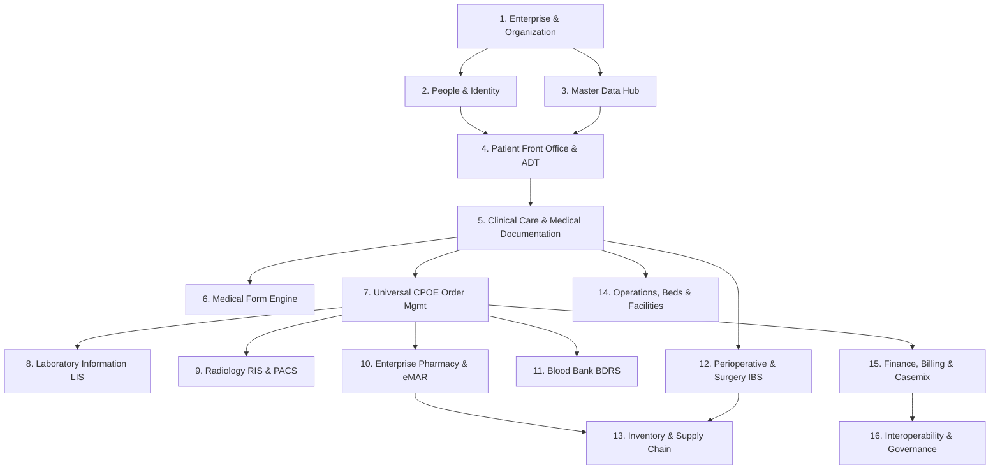

# NURSEFLOW ENTERPRISE HIS — MASTER DOMAIN MAP
**Status Dokumen:** `OFFICIAL ARCHITECTURAL BLUEPRINT`  
**Tanggal Rilis:** 23 September 2026  
**Cakupan:** 16 Enterprise Domains, 84 Subdomains, Real-World Hospital Operating Model  

---

## 1. STRUKTUR DOMAIN ENTERPRISE (16 CORE DOMAINS)

NurseFlow Enterprise HIS memetakan seluruh siklus operasional rumah sakit ke dalam 16 domain inti yang saling terikat secara relasional dan prosedural:



---

## 2. DETAIL DEFINISI & PEMETAAN 16 DOMAIN

### DOMAIN 1: ENTERPRISE & ORGANIZATIONAL HIERARCHY
* **Fungsi:** Mengatur multitenansi, struktur institusi rumah sakit, entitas hukum, dan hierarki spasial fisik.
* **Entitas Inti:** `Tenant`, `Hospital`, `Branch`, `Facility`, `Building`, `Floor`, `Department`, `ServiceUnit`, `Room`, `Bed`.
* **Database Tables (Actual):** `master_tenants`, `tenant_organizations`, `tenant_subscriptions`, `master_facilities`, `master_buildings`, `master_floors`, `master_wards`, `master_rooms`, `master_beds`, `master_departments`, `master_service_units`.
* **Status Implementasi:** 🟢 DDL tersedia (72 migration), tetapi terdapat duplikasi definisi tabel spasial antara migrasi `010` dan `026`.

### DOMAIN 2: PEOPLE, IDENTITY & CLINICAL CREDENTIALING
* **Fungsi:** Mengelola identitas pengguna, otentikasi multi-faktor, RBAC enterprise, kredensial profesi (STR, SIP, masa berlaku), dan hak klinis (Clinical Privileges).
* **Entitas Inti:** `User`, `Role`, `Permission`, `StaffProfile`, `DoctorCredential`, `ClinicalPrivilege`, `SignatureCertificate`.
* **Database Tables (Actual):** `auth_users`, `auth_roles`, `auth_permissions`, `auth_user_roles`, `auth_role_permissions`, `clinical_staff_profiles`, `staff_credentials`, `clinical_privileges`, `practitioner_key_lifecycle`.
* **Status Implementasi:** 🟠 Kesenjangan Kritis: Frontend menggunakan Firebase Auth/LocalStorage, sementara backend Express memiliki mock router login tanpa verifikasi password.

### DOMAIN 3: MASTER DATA & TERMINOLOGY GOVERNANCE
* **Fungsi:** Standardisasi terminologi medis internasional dan nasional, katalog layanan, tarif dasar, dan data demografi.
* **Entitas Inti:** `ICD-10`, `ICD-9-CM`, `LOINC`, `SNOMED-CT`, `KFA (Kamus Farmasi dan Alkes Kemkes)`, `TariffMaster`, `PayerMaster`.
* **Database Tables (Actual):** `master_icd10`, `master_icd9cm`, `master_loinc`, `master_snomed`, `master_kfa`, `master_medications`, `master_medication_classes`, `master_lab_tests`, `master_radiology_procedures`, `master_inacbg_tariffs`, `master_insurances`.
* **Status Implementasi:** 🟣 Sebagian tabel master terisi (ICD-10: 7 baris, ICD-9: 5 baris, LOINC: 5 baris, KFA: 10 baris, obat: 10 baris). Perlu injeksi seed kamus klinis skala produksi.

### DOMAIN 4: PATIENT MANAGEMENT, EMPI & FRONT OFFICE (ADT)
* **Fungsi:** Registrasi pasien baru, deteksi duplikasi NIK/identitas (Enterprise Master Patient Index), antrean poliklinik, registrasi kunjungan (Encounter), admisi rawat inap, transfer bangsal, dan pemulangan (Discharge).
* **Entitas Inti:** `Patient`, `IdentityDocument`, `QueueTicket`, `Appointment`, `EpisodeOfCare`, `Encounter`, `BedTransfer`, `DischargeDisposition`.
* **Database Tables (Actual):** `master_patients`, `patient_registrations`, `queue_tickets`, `queue_sequences`, `appointments`, `episodes_of_care`, `encounters`, `bed_occupancies`, `bed_transfers`.
* **Status Implementasi:** 🟢 Arsitektur terkuat di database: `master_patients` (4.859 baris), `encounters` (4.810 baris), `episodes_of_care` (4.810 baris).

### DOMAIN 5: CLINICAL CARE & MEDICAL DOCUMENTATION (EMR / CPPT)
* **Fungsi:** Dokumentasi medis terintegrasi multidisiplin (PPA: Dokter DPJP, Perawat, Farmasi, Gizi), Catatan Perkembangan Pasien Terintegrasi (CPPT), format SOAP/SBAR, anamnesis, vital sign, dan diagnosis kerja/utama.
* **Entitas Inti:** `SoapNote`, `CpptEntry`, `VitalSignsObservation`, `ClinicalObservation`, `DiagnosisRecord`, `CarePlan`, `DischargeSummary`.
* **Database Tables (Actual):** `soap_notes` (3.848 baris), `cppt_notes` (33 baris), `clinical_vital_sign_observations` (64 baris), `clinical_observations` (428 baris), `clinical_coding_records` (36 baris), `clinical_discharge_summaries` (0 baris).
* **Status Implementasi:** 🟢 Implementasi aktif pada tabel `soap_notes`, namun tabel pendukung seperti `clinical_discharge_summaries` masih kosong.

### DOMAIN 6: MEDICAL FORMS ENGINE & LIFECYCLE
* **Fungsi:** Standardisasi formulir asesmen medis, versioning, amandemen legal, verifikasi digital signature BSrE, dan pencegahan edit sepihak setelah ditandatangani (*WORM Immutability*).
* **Entitas Inti:** `FormTemplate`, `FormInstance`, `FormFieldValue`, `FormAmendment`, `DigitalSignatureAudit`.
* **Lifecycle:** `DRAFT` $\rightarrow$ `IN_PROGRESS` $\rightarrow$ `COMPLETED` $\rightarrow$ `SIGNED` $\rightarrow$ `LOCKED` (Amandemen via `AMENDMENT_PENDING` $\rightarrow$ `AMENDED`).
* **Status Implementasi:** 🔴 Kesenjangan Arsitektural: Tidak ada engine generic. Formulir dibuat sebagai komponen JSX mandiri (`MEOWSForm.jsx`, `PEWSForm.jsx`, `SepsisSOFACriteriaForm.jsx`, dll.) dengan mock identifier demo.

### DOMAIN 7: ORDER MANAGEMENT & UNIVERSAL CPOE
* **Fungsi:** Entri instruksi medis terpadu (*Computerized Physician Order Entry*) untuk obat, laboratorium, radiologi, tindakan, transfusi darah, dan konsultasi internal, dilengkapi evaluasi keselamatan *Clinical Decision Support System* (CDSS).
* **Entitas Inti:** `ClinicalOrder`, `CpoeOrderItem`, `CdssAlert`, `SafetyDecision`, `AllergyOverride`.
* **Lifecycle:** `DRAFT` $\rightarrow$ `PLACED` $\rightarrow$ `VALIDATED` $\rightarrow$ `ACCEPTED` $\rightarrow$ `IN_PROGRESS` $\rightarrow$ `COMPLETED` $\rightarrow$ `RESULTED` $\rightarrow$ `REVIEWED`.
* **Database Tables (Actual):** `clinical_orders` (2.278 baris), `cpoe_order_items` (56 baris), `cdss_alerts` (0 baris), `cdss_executions` (0 baris), `safety_decision_registry` (0 baris).
* **Status Implementasi:** 🟢 Endpoint dan transactional service di `server/services/cpoeApplication.service.js` lengkap, didukung audit SHA-256 dan JCS.

### DOMAIN 8: LABORATORY INFORMATION SYSTEM (LIS)
* **Fungsi:** Penerimaan order lab, penarikan tabung spesimen (*Vacutainer barcode accessioning*), pemrosesan analitik, validasi hasil analis, deteksi nilai kritis (*Panic Value Alert*), dan otorisasi dokter Sp.PK.
* **Entitas Inti:** `LabOrder`, `Specimen`, `AccessionNumber`, `LabTestResult`, `CriticalPanicAlert`.
* **Lifecycle:** `ORDER` $\rightarrow$ `SPECIMEN_COLLECTED` $\rightarrow$ `ACCESSIONED` $\rightarrow$ `IN_ANALYTICS` $\rightarrow$ `RESULTED` $\rightarrow$ `VALIDATED_SPPK` $\rightarrow$ `RELEASED`.
* **Database Tables (Actual):** `laboratory_orders` (0 baris), `laboratory_specimens` (21 baris), `laboratory_test_results` (0 baris), `laboratory_panic_alerts` (0 baris).
* **Status Implementasi:** 🟠 Tabel spesimen terisi, tetapi tabel hasil (`laboratory_test_results`) dan alert kritis masih kosong (0 baris).

### DOMAIN 9: RADIOLOGY INFORMATION SYSTEM & PACS (RIS)
* **Fungsi:** Penjadwalan modalitas (USG, X-Ray, CT-Scan, MRI), integrasi DICOM Web Viewer via WADO-RS/QIDO-RS, pembuatan expertise/ekspertise dokter Sp.Rad, dan verifikasi laporan diagnostik.
* **Entitas Inti:** `RadiologyOrder`, `ModalityWorklist`, `DicomStudy`, `DicomSeries`, `DicomInstance`, `RadiologyReport`.
* **Database Tables (Actual):** `radiology_orders` (0 baris), `radiology_studies` (23 baris), `radiology_reports` (23 baris), `radiology_report_versions` (23 baris), `dicom_nodes` (0 baris).
* **Status Implementasi:** 🟣 Metadata studi dan laporan terisi (23 baris), router DICOM Web di Express aktif, namun tabel modalitas dan node DICOM fisik kosong.

### DOMAIN 10: ENTERPRISE PHARMACY & CLOSED-LOOP MEDICATION (eMAR)
* **Fungsi:** Telaah resep farmasi (Legal, Administratif, Klinis), skrining interaksi obat (DDI), penyiapan, dispensing multi-depot FEFO, dan administrasi obat di bangsal dengan verifikasi 5 Prinsip Benar (Barcode Patient + Barcode Obat via eMAR).
* **Entitas Inti:** `Prescription`, `MedicationVerification`, `DispenseAllocation`, `EmarAdministration`, `MedicationReturn`.
* **Database Tables (Actual):** `medication_orders` (31 baris), `medication_catalog` (52 baris), `medication_dispense_allocations` (0 baris), `medication_emar_administrations` (0 baris), `prescription_dispense_records` (0 baris).
* **Status Implementasi:** 🟠 Katalog obat dan master order terisi, namun tabel administrasi bangsal (`medication_emar_administrations`) kosong di database.

### DOMAIN 11: BLOOD BANK & TRANSFUSION SAFETY (BDRS)
* **Fungsi:** Pelacakan rantai dingin (Cold Chain 2-6°C), stok komponen darah (PRC, TC, FFP, Cryo), uji silang serasi (Gel-Test Crossmatch), protokol transfusi masif (MTP 1:1:1), verifikasi dual-nurse di sisi ranjang pasien, dan pelaporan hemovigilans.
* **Entitas Inti:** `BloodDonorUnit`, `CrossmatchTest`, `MtpProtocol`, `BedsideDualVerification`, `TransfusionReaction`.
* **Database Tables (Actual):** `blood_donor_units` (140 baris), `blood_crossmatch_tests` (18 baris), `blood_transfusion_records` (14 baris), `blood_bedside_verifications` (14 baris), `transfusion_reaction_logs` (0 baris).
* **Status Implementasi:** 🟢 Alur database berjalan baik di backend, unit terisi data cold-chain valid.

### DOMAIN 12: PERIOPERATIVE, SURGERY & CSSD (KAMAR BEDAH / IBS)
* **Fungsi:** Penjadwalan kamar operasi, asesmen pra-anestesi (ASA Score & Mallampati), Informed Consent bedah, WHO Surgical Safety Checklist (Sign In, Time Out, Sign Out), pemantauan intra-operatif, pemulihan PACU (Aldrete Score), dan sterilisasi instrumen CSSD.
* **Entitas Inti:** `SurgeryBooking`, `AnesthesiaEvaluation`, `WhoChecklist`, `IntraoperativeRecord`, `PacuRecovery`, `CssdCycle`.
* **Database Tables (Actual):** `surgical_cases` (23 baris), `perioperative_anesthesia_evaluations` (44 baris), `who_safety_checklist_executions` (23 baris), `cssd_sterilization_cycles` (0 baris), `intraoperative_implant_ledgers` (0 baris).
* **Status Implementasi:** 🟣 Kasus bedah, anestesi, dan checklist WHO terisi data di database, namun CSSD dan pelacakan implan masih kosong.

### DOMAIN 13: INVENTORY, LOGISTICS & SUPPLY CHAIN
* **Fungsi:** Master item medis dan non-medis, SKU, satuan unit (UOM), multi-gudang (Gudang Farmasi Utama, Gudang Medis, Gudang Logistik Umum, Depo Poliklinik, Depo IBS), kartu stok batch/lot dengan expiry FEFO, Material Request (RO), mutasi barang, dan opname stok.
* **Entitas Inti:** `ItemMaster`, `Warehouse`, `BatchStock`, `StockMovement`, `MaterialRequest`, `StockTransfer`, `StockAdjustment`.
* **Database Tables (Actual):** `pharmacy_warehouses` (78 baris), `inventory_batches` (98 baris), `inventory_stock_movements` (77 baris).
* **Status Implementasi:** 🟠 Database memiliki tabel batch dan pergerakan stok, namun komponen frontend (`MaterialRequestTab.jsx`) masih membaca/menulis ke `localStorage['nurseflow_ro_list']` dan PIN statis `123456`.

### DOMAIN 14: HOSPITAL OPERATIONS, BEDS & FACILITIES
* **Fungsi:** Manajemen kapasitas tempat tidur real-time (Kamar, Bed, Tipe Kelas, Status Isolasi/ICU/HCU/Isolasi Tekanan Negatif), pemantauan bangsal (Ward Monitor), pemeliharaan fasilitas (Facility Maintenance), dan ambulans.
* **Entitas Inti:** `BedStatus`, `WardOccupancy`, `MaintenanceTicket`, `AmbulanceDispatch`.
* **Database Tables (Actual):** `master_beds` (121 baris), `bed_occupancies` (66 baris), `master_wards` (4 baris).
* **Status Implementasi:** 🟢 Manajemen tempat tidur terintegrasi di database dan UI (`BedManagementCenterPage.jsx`).

### DOMAIN 15: FINANCE, REVENUE CYCLE, CASEMIX & CLAIMS
* **Fungsi:** Penangkapan biaya (*Charge Capture*), formulasi tarif tindakan medis, faktur tagihan pasien (Billing Invoices), kasir dan penerimaan pembayaran multi-metode, piutang (*Accounts Receivable*), pengkodean klinis ICD-10 & ICD-9-CM, pengelompokan INA-CBG, dan klaim BPJS Kesehatan.
* **Entitas Inti:** `ChargeCapture`, `PatientBill`, `CashierPayment`, `InaCbgGrouping`, `BpjsClaim`, `GeneralLedgerSync`.
* **Database Tables (Actual):** 
  * Terisi: `patient_deposit_ledgers` (37 baris), `clinical_coding_records` (36 baris), `casemix_rulesets` (2 baris).
  * Kosong (0 baris): `hospital_invoices`, `billing_ledgers`, `cashier_payment_transactions`, `cashier_shift_reconciliations`, `inacbg_claims`, `inacbg_grouping_results`, `bpjs_sep_records`, `bpjs_claim_submissions`.
* **Status Implementasi:** 🔴 Kesenjangan Kritis: Modul kasir dan klaim BPJS belum memiliki persistence transaksi riil di PostgreSQL.

### DOMAIN 16: INTEROPERABILITAS, SECURITY & GOVERNANCE
* **Fungsi:** Interoperabilitas SATUSEHAT Kemkes RI (FHIR R4 resources: Encounter, Condition, Observation, Procedure, MedicationRequest), bridging BPJS V-Claim & Antrean Online, audit forensik imutabel (WORM), PKI Digital Signature, dan Zero-Trust RBAC.
* **Entitas Inti:** `FhirResourceOutbox`, `SatusehatLog`, `UniversalAuditLog`, `BreakGlassAudit`, `IdempotencyRecord`.
* **Database Tables (Actual):** `universal_audit_logs` (615 baris), `clinical_domain_outbox` (365 baris), `break_glass_audit_ledger` (198 rows), `practitioner_key_lifecycle` (66 rows), `tenant_satusehat_credentials` (2 rows), `fhir_delivery_outbox` (1 row).
* **Status Implementasi:** 🟢 Arsitektur outbox dan audit forensik sangat kuat di backend (`universal_audit_logs` 615 baris, outbox 365 baris).

---

## 3. GRAFIK KETERGANTUNGAN ARSITEKTUR (DEPENDENCY GRAPH)

```
[D1: Organization & Spatials]
     │
     ├──► [D2: Identity & Roles]
     │         │
     │         └──► [D4: Patient Front Office & ADT] ◄── [D3: Master Data & Terminology]
     │                   │
     │                   ├──► [D5: Clinical Care EMR/CPPT]
     │                   │         │
     │                   │         ├──► [D6: Medical Forms]
     │                   │         │
     │                   │         └──► [D7: Universal CPOE Orders]
     │                   │                   │
     │                   │                   ├──► [D8: Laboratory LIS]
     │                   │                   ├──► [D9: Radiology RIS]
     │                   │                   ├──► [D10: Pharmacy & eMAR] ◄── [D13: Inventory]
     │                   │                   └──► [D11: Blood Bank BDRS]
     │                   │
     │                   ├──► [D12: Surgery & Anesthesia] ◄────────────── [D13: Inventory]
     │                   │
     │                   ├──► [D14: Bed & Ward Operations]
     │                   │
     │                   └──► [D15: Billing, Casemix & Claims]
     │                             │
     │                             └──► [D16: SATUSEHAT & Governance]
```
