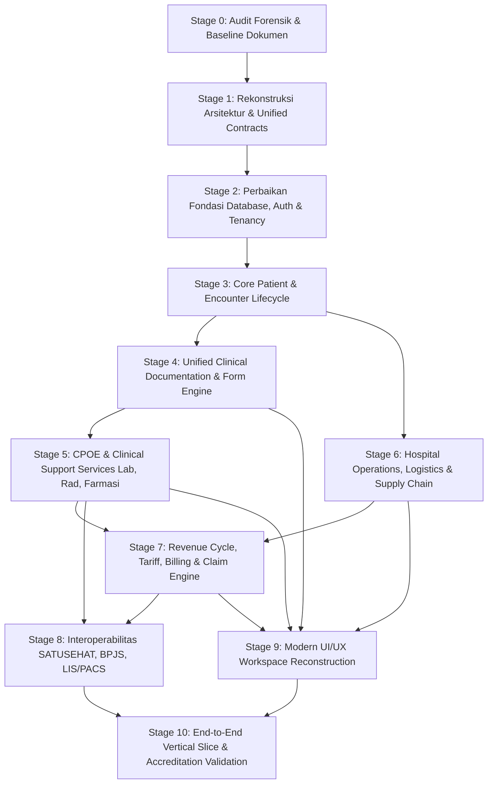

# NurseFlow Root Remediation Roadmap (2026–2027)
## Peta Jalan Rekonstruksi & Pemulihan Arsitektural Berbasis Dependensi

> **Status Dokumen:** RATIFIED AUDIT BASELINE  
> **Klasifikasi:** Dokumen Tata Kelola Arsitektur (Architecture Governance)  
> **Prinsip Utama:** *Dependency Order, Not Business Desirability. No Patching on Quicksand.*

---

## 1. Eksekutif Ringkasan & Filosofi Remediasi

Berdasarkan audit forensik menyeluruh pada **Stage 0**, NurseFlow mengalami **Tri-Layer Architectural Disconnect**:
1. **Frontend Layer:** Sebagian besar form klinis (42+ form) dan alur kerja masih memanggil Firebase Firestore (`emr.service.js`, `billing.service.js`) atau beroperasi secara in-memory/localStorage.
2. **Backend API Gateway (Express):** Memiliki 35+ router dan service yang kaya, namun sebagian besar routing otentikasi menerbitkan token bypass simulasi (`auth.routes.js`), dan validasi RBAC tidak terikat ke otorisasi database.
3. **Database Layer (PostgreSQL 16):** Memiliki 211 tabel pada migration DDL, namun **hanya memiliki 11 Foreign Keys**, 5 nomor migrasi duplikat, 11 nama tabel bentrok/duplikat, serta 118 tabel kosong (56% dorman) tanpa relasi integritas referensial.

Untuk memulihkan NurseFlow menjadi **Enterprise Hospital Information System (HIS)** kelas dunia yang aman bagi pasien (*clinically safe*), dapat diaudit (*traceable*), dan realistis operasional, perbaikan **DILARANG** dilakukan dengan menambal gejala lokal (*isolated bug patches*). 

Rencana remediasi disusun dalam **11 Tahapan Berjenjang (Stage 0 s.d. Stage 10)** yang diikat oleh pohon dependensi (*dependency graph*):



---

## 2. Tingkat Prioritas Arsitektural (P0 s.d. P5)

| Prioritas | Kategori | Fokus Domain & Komponen | Dasar Penentuan Prioritas |
| :--- | :--- | :--- | :--- |
| **P0** | **Structural Integrity** | Schema DDL, Relasi FK, Tenant Isolation, RBAC Auth, Audit Sinks, Patient Master (EMPI) | Tanpa fondasi data yang konsisten, setiap data transaksi klinis berisiko menjadi orphan dan membahayakan keselamatan pasien. |
| **P1** | **Core HIS Workflow** | Admisi, Antrean, Registrasi, Encounter State Machine, IGD Triage, Rawat Jalan, Rawat Inap, CPPT | Alur hidup pasien adalah tulang punggung seluruh aktivitas rumah sakit. Seluruh order dan billing bergantung pada Encounter aktif. |
| **P2** | **Clinical Support** | Universal CPOE Engine, Farmasi & Dispensing, Laboratorium (LIS), Radiologi (RIS/PACS), Kamar Operasi (OK/AIMS), Bank Darah | Pelayanan diagnostik dan terapeutik yang menghasilkan beban biaya, order resep obat, serta catatan keselamatan kritis. |
| **P3** | **Operations & Logistics** | Master Item/SKU, Multi-Warehouse Inventory, Batch & Expiry Tracking, Material Request, PO, Penerimaan, Asset Maintenance | Menghubungkan konsumsi obat/alkes di bangsal/OK ke pengurangan stok fisik gudang farmasi tanpa selisih data. |
| **P4** | **Financial & Revenue Cycle** | Multi-Component Tariffs, Charge Capture Otomatis, Split-Billing, Kasir, Klaim INA-CBGs, Jurnal Akuntansi | Mengubah aktivitas klinis terverifikasi menjadi tagihan akurat tanpa kehilangan potensi pendapatan (*zero revenue leakage*). |
| **P5** | **Enterprise & Interoperability** | SATUSEHAT FHIR R4 Inbound/Outbound, BPJS V-Claim & Antrean, Multi-Facility Sync, Analytics Executive | Integrasi eksternal berbasis standar regulasi Kemenkes RI dan BPJS Kesehatan setelah data internal terbukti kokoh. |

---

## 3. Matriks Roadmap Tahapan Remediasi (Stage 0 s.d. Stage 10)

```
========================================================================================================
STAGE 0: FORENSIK DAN AUDIT REALITAS SISTEM (STATUS: CURRENT - SELESAI)
========================================================================================================
Tujuan Utama       : Memetakan kebenaran aktual repository, menghilangkan ilusi kelengkapan semu, membongkar disparitas tri-layer, dan menetapkan dokumen baseline tata kelola.
Prasyarat          : None.
Cakupan Komponen   :
  - Database       : Analisis DDL 72 file migrasi, audit PostgreSQL live (211 tabel, 11 FK, 118 tabel kosong).
  - Backend API    : Audit 35+ service, Express server, mock auth endpoint, deteksi rute dorman.
  - Frontend       : Audit 42+ form EMR, ketergantungan Firebase/localStorage, hardcoded demo mock (`demo-patient-dewi`).
  - Testing        : Audit 189 file pengujian, pembongkaran in-memory mock client yang menyamarkan kegagalan database riil.
Deliverables       : 10 Dokumen Tata Kelola di `docs/governance/` + Laporan Eksekutif Forensik (A s.d. O).
Gate Kriteria      : Seluruh disparitas arsitektur terdokumentasi tanpa asumsi semu. Larangan coding fungsional dipatuhi.
Risiko & Mitigasi  : Risiko resistensi asumsi lama. Mitigasi: Semua klaim wajib disertai nomor baris file atau query DDL riil.

========================================================================================================
STAGE 1: REKONSTRUKSI ARSITEKTUR & UNIFIED SYSTEM CONTRACTS
========================================================================================================
Tujuan Utama       : Menetapkan kontrak data tunggal (Single Source of Truth) antara PostgreSQL, API Gateway, dan Client UI. Menghilangkan ketergantungan ganda Firebase vs PostgreSQL.
Prasyarat          : Stage 0 Approved.
Cakupan Komponen   :
  - Arsitektur     : Menetapkan PostgreSQL sebagai primary relational store dan menonaktifkan Firebase Firestore untuk penulisan data transaksional klinis.
  - Contracts      : Standardisasi Envelope Response API (RFC 7807 Problem Details), Data Transfer Objects (DTO) untuk Pasien, Encounter, CPOE, Billing.
  - Tenancy        : Standar `tenant_id` dan `facility_id` wajib pada setiap header permintaan dan query konteks.
Deliverables       :
  - `server/contracts/` lengkap (PatientDTO, EncounterDTO, CpoeOrderDTO, BillingInvoiceDTO).
  - Standarisasi Error Catalog & Problem Details RFC 7807 pada seluruh handler API.
  - Blueprint terminologi tunggal (penyatuan `master_patients` vs `patients`, dsb).
Gate Kriteria      : Spesifikasi API OpenAPI/Swagger terverifikasi sinkron dengan skema tabel PostgreSQL sasaran.

========================================================================================================
STAGE 2: PERBAIKAN PONDASI DATABASE, OTENTIKASI & TENANCY
========================================================================================================
Tujuan Utama       : Memperbaiki skema relational database PostgreSQL secara aman (*forward safe migration*), menyatukan auth ke database, dan mengaktifkan audit sink terpercaya.
Prasyarat          : Stage 1 Completed.
Cakupan Komponen   :
  - Database       : Konsolidasi 5 migrasi dengan nomor bentrok. Penambahan Foreign Keys esensial (`encounters.patient_id` -> `master_patients.id`, dll) dengan indeks pendukung.
  - Identity & Auth: Refactor `server/routes/auth.routes.js`. Hapus mock login `dr. Siti`. Implementasikan verifikasi password hash Argon2/Bcrypt terhadap tabel `users` PostgreSQL.
  - RBAC           : Penyelarasan role frontend (`src/shared/constants/roles.js`) dan backend (`rbacMiddleware.js`) ke data tabel `roles` dan `role_permissions`.
  - Audit Trail    : Aktivasi PostgreSQL Audit Trigger atau middleware audit persisten ke tabel `security_audit_logs` untuk setiap operasi mutasi data medis (CUD).
Deliverables       :
  - Forward migration script `073_reconcile_foreign_keys_and_indices.sql`.
  - Service otentikasi riil terhadap database PostgreSQL.
  - RBAC middleware terikat dinamis pada database roles.
Gate Kriteria      : Uji coba login riil terhadap tabel PostgreSQL berhasil; pelanggaran foreign key berhasil ditolak oleh RDBMS; audit log tercatat di DB.

========================================================================================================
STAGE 3: CORE PATIENT & ENCOUNTER LIFECYCLE
========================================================================================================
Tujuan Utama       : Menghubungkan rantai hidup pasien dari pendaftaran hingga kepulangan (*cradle-to-grave encounter engine*) secara konsisten antara UI, API, dan Database.
Prasyarat          : Stage 2 Completed.
Cakupan Komponen   :
  - Patient Master : EMPI (Enterprise Master Patient Index) dengan validasi NIK, penanganan duplikasi MRN, dan prosedur merge pasien yang aman.
  - Registration   : Alur registrasi rawat jalan, rawat inap, dan IGD terhubung langsung ke tabel `master_patients`.
  - Encounter SM   : State Machine Encounter terpusat (`PLANNED` -> `ARRIVED` -> `TRIAGED` -> `IN_PROGRESS` -> `ON_HOLD` -> `DISCHARGED` -> `COMPLETED`).
  - Bed Management : Pengalokasian tempat tidur rawat inap (`beds`), reservasi, transfer bangsal, dan pembebasan bed (*discharge/cleaning*).
Deliverables       :
  - `src/modules/patient/services/patient.service.js` direfaktor total memanggil API backend (`/api/v1/patients`), bukan Firestore.
  - `server/services/encounterStateMachine.service.js` menjamin aturan transisi status encounter yang valid.
Gate Kriteria      : Alur pembuatan pasien baru -> pembuatan encounter -> alokasi bed -> pemulangan berjalan mulus dan tersimpan di PostgreSQL.

========================================================================================================
STAGE 4: UNIFIED CLINICAL DOCUMENTATION & FORM ENGINE
========================================================================================================
Tujuan Utama       : Menggantikan fragmentasi 42+ form hardcoded dengan Universal Medical Form Engine yang mendukung lifecycle dokumen medis, tandatangan digital, dan amandemen.
Prasyarat          : Stage 3 Completed.
Cakupan Komponen   :
  - Form Engine    : Engine rendering dan validasi dinamis berbasis JSON schema medis.
  - Form Lifecycle : State Machine: `DRAFT` -> `IN_PROGRESS` -> `COMPLETED` -> `SIGNED` -> `LOCKED`.
  - Amendment Flow : Pembatasan modifikasi dokumen berstatus `SIGNED`/`LOCKED` hanya melalui mekanisme revisi resmi dengan jejak alasan dan riwayat versi.
  - Clinical Forms : Migrasi form inti: Triase IGD, Initial Assessment Medis/Perawat, CPPT Terintegrasi (SOAP), dan Resume Medis Pasien Pulang (Discharge Summary).
Deliverables       :
  - Unified Medical Form Registry di database PostgreSQL (`clinical_forms`, `form_templates`, `clinical_form_versions`).
  - API endpoint form EMR terintegrasi (`/api/v1/emr/forms`).
  - Refaktor komponen `ClinicalFormShell.jsx` agar terhubung ke API backend, bukan Firestore.
Gate Kriteria      : Dokter dapat mengisi SOAP/Resume Pulang, menandatangani dokumen secara digital, dokumen terkunci, dan upaya edit langsung ditolak RDBMS/API.

========================================================================================================
STAGE 5: UNIVERSAL CPOE & CLINICAL SUPPORT SYSTEMS
========================================================================================================
Tujuan Utama       : Menghidupkan lifecycle order medis (CPOE) untuk Farmasi, Laboratorium, Radiologi, Bedah, dan Bank Darah dengan safety alerts otomatis.
Prasyarat          : Stage 4 Completed.
Cakupan Komponen   :
  - Universal CPOE : Lifecycle order: `PLACED` -> `VALIDATED` -> `ACCEPTED` -> `IN_PROGRESS` -> `RESULTED` -> `VERIFIED`.
  - Safety Guards  : Pengecekan riwayat alergi pasien, interaksi obat (DDI), duplikasi terapi, dan kontraindikasi sebelum order resep disimpan.
  - Farmasi & eMAR : Dispensing farmasi bangsal, verifikasi 7-Benar obat, dan administrasi obat oleh perawat di samping tempat tidur (*bedside eMAR*).
  - LIS & RIS/PACS : Accession number spesimen lab, input dan verifikasi nilai kritis lab, pengunggahan tautan hasil interpretasi radiologi DICOM.
Deliverables       :
  - CPOE API Routes & Services (`/api/v1/orders/...`).
  - eMAR Mobile/Tablet Ready Workspace.
  - Clinical Decision Support (CDS) Rules Engine terintegrasi.
Gate Kriteria      : Order resep dari DPJP memicu notifikasi antrean telaah farmasi; pemberian obat terdata di eMAR; hasil lab kritis memicu alert seketika.

========================================================================================================
STAGE 6: HOSPITAL OPERATIONS, LOGISTICS & SUPPLY CHAIN
========================================================================================================
Tujuan Utama       : Menghubungkan konsumsi obat dan alkes medis dengan pergerakan inventori gudang fisik secara real-time (*closed-loop supply chain*).
Prasyarat          : Stage 5 Completed.
Cakupan Komponen   :
  - Inventory Core : Master SKU, Multi-Warehouse (Gudang Utama, Depo IGD, Depo Rawat Inap, Depo Bedah).
  - Batch & Expiry : Tracking lot/batch number dan tanggal kedaluwarsa dengan aturan rotasi FEFO (First-Expired, First-Out).
  - Movement Flow  : Material Request (Bangsal -> Gudang) -> Approval -> Pengeluaran Barang -> Mutasi Stok.
  - Dispense Link  : Pengurangan stok otomatis saat obat diverifikasi dan diserahkan ke pasien, tercatat dengan referensi encounter.
Deliverables       :
  - PostgreSQL Inventory Ledger Trigger / Service transaksional anti-race-condition.
  - Modul Stock Opname & Penyesuaian Stok Terotorisasi.
Gate Kriteria      : Pemberian obat kepada pasien secara otomatis mengurangi stok pada batch yang sesuai di depo terkait dengan audit ledger transaksional.

========================================================================================================
STAGE 7: REVENUE CYCLE, TARIFF, BILLING & CLAIM ENGINE
========================================================================================================
Tujuan Utama       : Otomasi penangkapan biaya (*automated charge capture*) dari aktivitas klinis, kalkulasi tarif multi-komponen, penagihan kasir, dan klaim penjamin.
Prasyarat          : Stage 5 & Stage 6 Completed.
Cakupan Komponen   :
  - Charge Capture : Setiap tindakan dokter, pemeriksaan lab/rad, dan obat yang diberikan otomatis masuk ke folio billing encounter aktif.
  - Tariff Engine  : Kalkulasi tarif berdasarkan kelas rawat inap, komponen jasa medis, jasa rumah sakit, dan farmasi.
  - Billing Ledger : Invoice tunggal dengan rincian per departemen, split-billing (tanggungan BPJS/Asuransi vs ekses mandiri pasien).
  - Kasir & Payment: Penerimaan pembayaran multi-metode (Kas, Kartu Debit/Kredit, QRIS, Transfer Bank), pencetakan kuitansi resmi, dan penutupan kasir per shift.
  - Casemix / E-Klaim: Integrasi data diagnosis ICD-10 dan prosedur ICD-9-CM untuk pengelompokan tarif INA-CBGs.
Deliverables       :
  - Refaktor menyeluruh `server/services/billing.service.js` dan sinkronisasi ke tabel `billing_invoices` & `billing_items`.
  - Workspace Billing & Kasir terintegrasi penuh.
Gate Kriteria      : Pasien pulang tidak dapat difinalisasi bila ada tagihan menggantung; pembayaran kasir berhasil mengunci invoice dan mengubah status encounter menjadi `CLOSED`.

========================================================================================================
STAGE 8: ENTERPRISE INTEROPERABILITY (SATUSEHAT & BPJS)
========================================================================================================
Tujuan Utama       : Mengintegrasikan sistem NurseFlow dengan platform nasional Kementerian Kesehatan RI (SATUSEHAT FHIR R4) dan BPJS Kesehatan (V-Claim & Antrean).
Prasyarat          : Stage 7 Completed.
Cakupan Komponen   :
  - SATUSEHAT Core : Modul pemetaan FHIR Resource: Patient, Encounter, Condition (ICD-10), Procedure (ICD-9-CM), Observation, MedicationRequest, Composition.
  - Queue & Retry  : Background job queue (BullMQ/Redis) untuk pengiriman data asinkron ke SATUSEHAT dengan dead-letter queue dan retry exponential backoff.
  - BPJS V-Claim   : Pembuatan SEP (Surat Eligibilitas Peserta), verifikasi rujukan, bridging jadwal dokter dan antrean online BPJS.
Deliverables       :
  - `server/integrations/satusehat/` service terstandarisasi dengan skema OAuth2.0 Kemenkes.
  - `server/integrations/bpjs/` client library dengan signature generator HMAC-SHA256.
Gate Kriteria      : Encounter yang ditutup otomatis mengirimkan FHIR Bundle ke sandbox SATUSEHAT dan menerima konfirmasi HTTP 201 dengan ID resource Kemenkes.

========================================================================================================
STAGE 9: ROLE-BASED UI/UX RECONSTRUCTION & ERGONOMICS
========================================================================================================
Tujuan Utama       : Merekonstruksi seluruh antarmuka pengguna menjadi workspace ergonomis berbasis peran (Doctor, Nurse, Pharmacist, Cashier, dll) tanpa redundansi klik.
Prasyarat          : Stage 4 s.d. Stage 8 Completed.
Cakupan Komponen   :
  - Role Workspaces: Dashboard spesifik per persona (Dokter DPJP, Perawat Bangsal, Petugas Triase IGD, Kasir, Apoteker).
  - UX Ergonomics  : Navigasi cepat dengan keyboard shortcuts, breadcrumb jelas, indikator koneksi real-time, loading/empty/error state terstandarisasi.
  - Responsive     : Pengoptimalan tampilan untuk layar workstation poliklinik, mobile tablet perawat di samping tempat tidur, dan display antrean loket.
Deliverables       :
  - Redesain `MainLayout.jsx` dan navigasi modular berbasis hak akses dinamis.
  - Role-specific clinical command centers.
Gate Kriteria      : Seluruh persona dapat menyelesaikan workflow hariannya tanpa melihat menu yang bukan hak aksesnya (*zero cognitive overload*).

========================================================================================================
STAGE 10: END-TO-END VERTICAL SLICE & ACCREDITATION READINESS
========================================================================================================
Tujuan Utama       : Validasi menyeluruh 6 perjalanan pasien nyata (IGD, Rawat Jalan, Rawat Inap, Bedah, Inventory, Revenue) di bawah pengujian beban dan simulasi akreditasi.
Prasyarat          : Seluruh Stage 1 s.d. Stage 9 Terpenuhi.
Cakupan Komponen   :
  - Integration Test: Menghapus semua in-memory mock client. Menjalankan test suite terhadap instance PostgreSQL dan Redis riil.
  - Vertical Slices: Simulasi pasien gawat darurat masuk IGD hingga sembuh/pulang dengan audit trail terverifikasi.
  - Akreditasi KARS: Pengujian pemenuhan regulasi rekam medis elektronik (Permenkes 24/2022) dan standar keselamatan pasien KARS/JCI.
Deliverables       :
  - Comprehensive Automated E2E Test Suite (Playwright / Supertest).
  - Laporan Kesiapan Akreditasi Rekam Medis Elektronik Nasional.
Gate Kriteria      : 100% dari 6 Hospital Journeys berhasil dieksekusi tanpa intervensi manual database, dengan tingkat kegagalan transaksi 0% pada stress test.
========================================================================================================
```

---

## 4. Analisis Manajemen Risiko & Rencana Rollback

| Potensi Risiko | Probabilitas / Dampak | Strategi Mitigasi Terencana | Rencana Rollback (Bila Gagal) |
| :--- | :--- | :--- | :--- |
| **Data Inconsistency saat menambahkan Foreign Keys di Stage 2** | Sedang / Kritis | Jalankan script pembersihan data orphan terlebih dahulu ke skema penampung sementara (`archive_orphans`) sebelum menambahkan constraint `FOREIGN KEY`. | Skrip migrasi dirancang reversibel (`073_reconcile_foreign_keys_down.sql`) dengan transaksi atomik `BEGIN ... ROLLBACK`. |
| **Regresi UI saat melepas dependensi Firebase di Stage 4** | Tinggi / Tinggi | Buat adapter layer bertahap (`emrStorageAdapter.js`) yang mengalihkan panggilan data dari Firebase ke Express API secara modular per form. | Kemampuan toggle feature flag environment `VITE_USE_EXPRESS_BACKEND=true/false` selama masa transisi pengujian. |
| **Race Condition pada Pengurangan Stok Multi-User di Stage 6** | Sedang / Kritis | Gunakan row-level locking (`SELECT ... FOR UPDATE`) pada tabel batch inventory di dalam transaksi database serializable. | Pemulihan otomatis melalui rollback transaksi database jika stok tidak mencukupi, dengan notifikasi error ke user. |
| **Keterlambatan / Timeout Bridging Eksternal (SATUSEHAT / BPJS)** | Tinggi / Sedang | Jangan pernah melakukan panggilan API eksternal di dalam request/response cycle sinkron. Gunakan background worker asinkron dengan pola *Outbox Pattern*. | Pesan gagal masuk ke Dead Letter Queue (DLQ) dan sistem lokal tetap berjalan lancar tanpa mengunci alur klinis pasien. |

---

## 5. Tata Kelola Perubahan & Protokol Update

1. Setiap commit yang menyelesaikan milestone tahapan di atas **WAJIB** mencantumkan tag tahapan:  
   `[STAGE-X] [CATEGORY] Pesan perubahan`.
2. Setiap perubahan arsitektur **WAJIB** dicatat dalam Bahasa Indonesia pada file:  
   [`docs/CHANGELOG_PERUBAHAN_HIS.md`](file:///c:/ALL%20DATA/BERKAS%20ROBBY/APPS%20PROJECT/NurseFlow-WebApp/docs/CHANGELOG_PERUBAHAN_HIS.md).
3. Kode lama yang digantikan **TIDAK BOLEH** langsung dihapus tanpa klasifikasi status (`KEEP`, `REFACTOR`, `CONSOLIDATE`, `REBUILD`, `DEPRECATE`, `REMOVE`) dan audit dependensi pemanggil.
